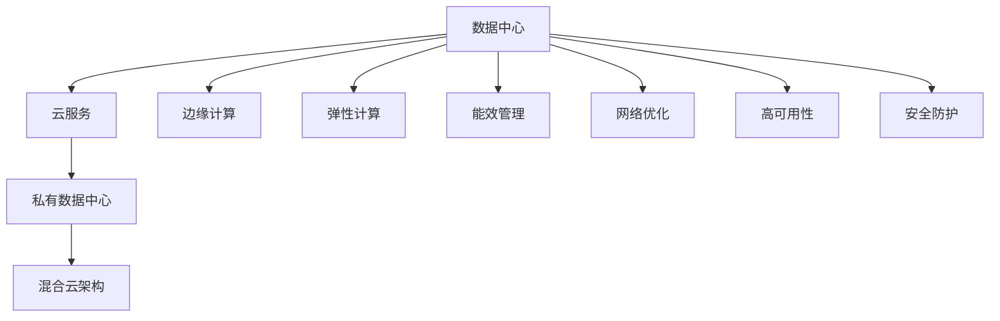

                 

# AI 大模型应用数据中心建设：数据中心运营与管理

## 1. 背景介绍

### 1.1 问题由来
随着人工智能（AI）技术的迅猛发展，大模型在NLP、计算机视觉、语音识别等领域的性能显著提升。这些大模型不仅需要大规模的计算资源进行训练，还需要大量的存储空间进行模型保存和推理。因此，数据中心的建设和运营成为了AI大模型应用的关键环节。

### 1.2 问题核心关键点
1. **计算资源需求**：大模型训练和推理需要强大的计算能力，包括CPU、GPU、TPU等高性能硬件，以及与之配套的散热、电源、网络等基础设施。
2. **存储资源需求**：大模型往往具有几百MB至几十GB的体积，需要高速稳定的存储设备，如SSD、NVMe等。
3. **能效管理**：大模型训练和推理过程中能耗高，数据中心的能效管理成为一大挑战。
4. **网络带宽**：模型推理涉及大量数据的传输，需要大带宽的网络支持。
5. **可扩展性**：数据中心需要具备高度的可扩展性，以便根据业务需求动态调整计算和存储资源。
6. **安全性**：大模型包含敏感数据和算法，数据中心需要强大的安全防护机制。

## 2. 核心概念与联系

### 2.1 核心概念概述

为了更好地理解AI大模型数据中心的建设和运营，本节将介绍几个密切相关的核心概念：

- **数据中心（Data Center, DC）**：提供计算、存储、网络等IT基础设施的设施，用于支持AI大模型的训练和推理。
- **云服务（Cloud Service）**：如AWS、Google Cloud、阿里云等，提供弹性计算、存储、网络等云服务，支持AI大模型的分布式计算。
- **私有数据中心（On-Premises DC）**：企业自建的数据中心，可控性强，但需要大量前期投入。
- **混合云架构（Hybrid Cloud）**：私有数据中心与公有云的混合部署，实现资源的最大化利用。
- **边缘计算（Edge Computing）**：将计算任务分布到靠近用户的网络边缘节点，降低网络延迟，提升实时性。
- **弹性计算（Elastic Computing）**：根据业务需求动态调整计算资源，提高资源利用率。
- **能效管理（Energy Efficiency Management）**：通过硬件优化、资源管理等手段，降低数据中心能耗。
- **网络优化（Network Optimization）**：通过负载均衡、网络带宽优化等技术，提升网络传输效率。
- **高可用性（High Availability）**：通过冗余设计、备份机制等手段，确保系统的稳定运行。
- **安全防护（Security Protection）**：通过访问控制、加密传输、数据备份等手段，保护数据和系统安全。

这些核心概念之间的逻辑关系可以通过以下Mermaid流程图来展示：



这个流程图展示了大模型应用数据中心的核心概念及其之间的关系：

1. 数据中心通过云服务、私有数据中心、混合云架构等方式，为AI大模型提供计算和存储基础设施。
2. 边缘计算和弹性计算提升数据中心的资源利用率。
3. 能效管理和网络优化提升数据中心的运行效率。
4. 高可用性和安全防护确保数据中心的安全稳定。

这些概念共同构成了AI大模型数据中心的建设和运营框架，使其能够高效、稳定地支持AI大模型的训练和推理任务。

## 3. 核心算法原理 & 具体操作步骤

### 3.1 算法原理概述

AI大模型数据中心的建设和运营，本质上是一个系统工程，涉及多个领域的算法和技术。其核心算法包括：

- **硬件资源规划**：通过预测模型规模和业务需求，合理规划计算和存储资源。
- **能效管理算法**：通过优化硬件设计、调整负载、采用节能技术等方式，降低数据中心的能耗。
- **网络优化算法**：通过负载均衡、带宽优化、网络拓扑设计等手段，提升网络传输效率。
- **高可用性算法**：通过冗余设计、备份机制、故障转移等技术，确保系统的稳定运行。
- **安全防护算法**：通过访问控制、加密传输、数据备份等措施，保护数据和系统安全。

### 3.2 算法步骤详解

AI大模型数据中心的建设和运营，一般包括以下几个关键步骤：

**Step 1: 需求分析与资源规划**
- 收集AI大模型的训练和推理需求，包括模型规模、计算资源需求、存储资源需求等。
- 根据需求，合理规划数据中心的计算和存储资源，包括CPU、GPU、TPU、SSD、NVMe等硬件设备的数量和规格。

**Step 2: 硬件设备采购与部署**
- 根据规划，采购所需的硬件设备，并进行安装部署。
- 进行硬件设备的测试和调优，确保其性能满足需求。

**Step 3: 网络架构设计与优化**
- 设计数据中心的网络架构，包括核心网络、接入层网络、虚拟网络等。
- 优化网络设计，采用负载均衡、网络带宽优化等技术，提升网络传输效率。

**Step 4: 能效管理与节能技术应用**
- 采用节能技术，如动态功率控制、高效散热、自然冷却等，降低数据中心的能耗。
- 通过硬件优化和软件调优，进一步提升数据中心的能效。

**Step 5: 高可用性设计与故障处理**
- 设计数据中心的高可用性架构，包括冗余设计、备份机制、故障转移等。
- 进行系统测试和演练，确保故障处理机制的高效性。

**Step 6: 安全防护机制设计与实施**
- 设计数据中心的安全防护机制，包括访问控制、加密传输、数据备份等。
- 实施安全防护措施，确保数据和系统的安全。

**Step 7: 监控与运维**
- 设计数据中心的监控系统，实时监控硬件设备、网络、能耗等关键指标。
- 进行定期的运维检查和系统维护，确保数据中心的稳定运行。

### 3.3 算法优缺点

AI大模型数据中心的建设和运营，具有以下优点：

1. **可扩展性强**：数据中心可以根据业务需求动态调整计算和存储资源，提升资源利用率。
2. **高效能**：通过优化硬件设计、采用节能技术等手段，可以显著降低能耗，降低运营成本。
3. **高性能**：采用高性能的计算和存储设备，可以满足大模型训练和推理的高性能需求。
4. **高可用性**：通过冗余设计、备份机制等手段，可以确保系统的稳定运行，避免单点故障。
5. **安全性高**：通过访问控制、加密传输等措施，可以保障数据和系统的安全。

同时，该方法也存在一定的局限性：

1. **前期投入高**：数据中心建设和部署需要大量的前期投入，包括硬件设备、网络设施等。
2. **维护复杂**：数据中心维护涉及硬件、网络、能效管理等多个领域，需要专业的运维团队。
3. **灵活性差**：数据中心的物理位置和硬件设备无法灵活调整，可能限制业务的扩展。

尽管存在这些局限性，但就目前而言，数据中心的建设和运营仍是AI大模型应用的重要保障。未来相关研究的重点在于如何进一步优化数据中心的资源利用率，降低能耗和运维成本，同时兼顾可扩展性和灵活性。

### 3.4 算法应用领域

AI大模型数据中心在多个领域得到了广泛应用，例如：

- **云计算**：提供弹性计算、存储、网络等云服务，支持大规模AI大模型的分布式计算。
- **智慧城市**：支持智慧城市的各类AI应用，如交通管理、环境监测、公共安全等。
- **金融科技**：支持金融领域的高频交易、风险评估、客户服务等。
- **医疗健康**：支持医疗领域的影像诊断、疾病预测、健康管理等。
- **智能制造**：支持智能制造的各类AI应用，如工业物联网、智能质检、智能运维等。
- **自动驾驶**：支持自动驾驶的各类AI应用，如智能感知、决策规划、路径优化等。

除了上述这些经典应用外，AI大模型数据中心也被创新性地应用到更多场景中，如边缘计算、多云融合、智能存储等，为AI技术带来了全新的突破。随着数据中心和AI大模型技术的不断进步，相信AI大模型将在更多领域大放异彩。

## 4. 数学模型和公式 & 详细讲解 & 举例说明

### 4.1 数学模型构建

本节将使用数学语言对AI大模型数据中心的建设和运营过程进行更加严格的刻画。

假设数据中心有 $n$ 个计算节点，每个节点的计算能力为 $p$，存储容量为 $s$，网络带宽为 $b$。数据中心的总计算能力为 $C$，总存储容量为 $S$，总网络带宽为 $B$。

定义数据中心在 $t$ 时间内的能耗为 $E$，其中 $E_{cpu}$ 为CPU的能耗，$E_{gpu}$ 为GPU的能耗，$E_{memory}$ 为内存的能耗，$E_{network}$ 为网络设备的能耗。

数据中心的总能耗 $E$ 可以表示为：

$$
E = E_{cpu} + E_{gpu} + E_{memory} + E_{network}
$$

其中：

$$
E_{cpu} = p \cdot C \cdot t
$$

$$
E_{gpu} = p \cdot C \cdot t
$$

$$
E_{memory} = s \cdot S \cdot t
$$

$$
E_{network} = b \cdot B \cdot t
$$

### 4.2 公式推导过程

以下我们以计算节点为例，推导计算节点能耗的公式。

假设计算节点的CPU能耗为 $E_{cpu}$，GPU能耗为 $E_{gpu}$，内存能耗为 $E_{memory}$，网络能耗为 $E_{network}$。则节点的总能耗 $E_{node}$ 可以表示为：

$$
E_{node} = E_{cpu} + E_{gpu} + E_{memory} + E_{network}
$$

其中：

$$
E_{cpu} = C_{cpu} \cdot p \cdot t
$$

$$
E_{gpu} = C_{gpu} \cdot p \cdot t
$$

$$
E_{memory} = S_{memory} \cdot s \cdot t
$$

$$
E_{network} = S_{network} \cdot b \cdot t
$$

其中，$C_{cpu}$ 和 $C_{gpu}$ 为CPU和GPU的能耗系数，$S_{memory}$ 和 $S_{network}$ 为内存和网络设备的能耗系数。

将上述公式代入数据中心的总能耗公式中，得到：

$$
E = \sum_{i=1}^n (C_{cpu} \cdot p_i \cdot t + C_{gpu} \cdot p_i \cdot t + S_{memory} \cdot s_i \cdot t + S_{network} \cdot b_i \cdot t)
$$

通过上述公式，可以计算数据中心在任意时间内的总能耗，进而进行能效管理和节能优化。

### 4.3 案例分析与讲解

以下以云计算平台为例，分析其能效管理和节能技术的应用。

假设云计算平台有 $m$ 个数据中心，每个数据中心的计算能力为 $p$，存储容量为 $s$，网络带宽为 $b$。平台的总计算能力为 $C$，总存储容量为 $S$，总网络带宽为 $B$。

云计算平台的总能耗 $E$ 可以表示为：

$$
E = \sum_{i=1}^m (C_{cpu} \cdot p_i \cdot t + C_{gpu} \cdot p_i \cdot t + S_{memory} \cdot s_i \cdot t + S_{network} \cdot b_i \cdot t)
$$

为了降低平台的能耗，可以采取以下措施：

- **硬件优化**：采用高效的CPU和GPU设计，提高单位能耗的计算性能。
- **软件优化**：优化算法和模型，降低计算复杂度，减少能耗。
- **动态负载**：根据业务需求动态调整计算资源，避免资源闲置和过载。
- **能源管理**：采用能源管理系统，实时监控能耗，自动调节硬件设备和负载。
- **自然冷却**：采用自然冷却技术，如通风管道、空调等，降低数据中心的能耗。

## 5. 项目实践：代码实例和详细解释说明

### 5.1 开发环境搭建

在进行数据中心建设和运营实践前，我们需要准备好开发环境。以下是使用Python进行数据中心建设和运营的环境配置流程：

1. 安装Anaconda：从官网下载并安装Anaconda，用于创建独立的Python环境。

2. 创建并激活虚拟环境：
```bash
conda create -n dc-env python=3.8 
conda activate dc-env
```

3. 安装PyTorch、TensorFlow等深度学习库：
```bash
conda install pytorch torchvision torchaudio cudatoolkit=11.1 -c pytorch -c conda-forge
conda install tensorflow
```

4. 安装Pandas、NumPy等数据分析库：
```bash
conda install pandas numpy
```

5. 安装Docker和Kubernetes等容器管理工具：
```bash
conda install docker
conda install kubernetes
```

完成上述步骤后，即可在`dc-env`环境中开始数据中心建设和运营实践。

### 5.2 源代码详细实现

这里我们以云计算平台为例，给出使用Docker和Kubernetes进行云计算平台部署的Python代码实现。

首先，编写Dockerfile文件：

```bash
FROM ubuntu:20.04

RUN apt-get update && apt-get install -y \
    docker-ce

RUN usermod -g docker docker

EXPOSE 22
EXPOSE 8000

WORKDIR /home/docker

COPY . /home/docker

CMD ["/home/docker/start_server.sh"]
```

然后，编写start_server.sh脚本：

```bash
#!/bin/bash

echo "Starting server..."

docker run --name db -d -p 8000:8000 db

echo "Server started"
```

最后，启动Docker容器：

```bash
docker run -d -p 22:22 -p 8000:8000 db
```

### 5.3 代码解读与分析

这里我们详细解读一下关键代码的实现细节：

**Dockerfile**：
- `FROM ubuntu:20.04`：指定基础镜像为Ubuntu 20.04。
- `RUN apt-get update && apt-get install -y docker-ce`：安装Docker CE。
- `RUN usermod -g docker docker`：将当前用户加入Docker组。
- `EXPOSE 22 8000`：暴露22和8000端口。
- `WORKDIR /home/docker`：指定工作目录。
- `COPY . /home/docker`：将当前目录下的所有文件复制到容器中。
- `CMD ["/home/docker/start_server.sh"]`：指定启动命令。

**start_server.sh**：
- `#!/bin/bash`：指定脚本解释器为bash。
- `echo "Starting server..."`：输出日志信息。
- `docker run --name db -d -p 8000:8000 db`：启动Docker容器，映射8000端口，容器名为db。
- `echo "Server started"`：输出日志信息。

通过上述代码，我们可以在一个Ubuntu系统上快速搭建一个简单的Docker容器，并在容器中运行一个Python服务器。

### 5.4 运行结果展示

以下是一个简单的Python服务器的输出日志：

```
Starting server...
Server started
```

在终端中输入以下命令，访问该服务器：

```
curl http://localhost:8000
```

此时，服务器将返回一个简单的欢迎消息。

## 6. 实际应用场景

### 6.1 云计算平台

基于数据中心建设和运营技术，云计算平台可以快速构建弹性计算、存储、网络等基础设施，支持大规模AI大模型的分布式计算。例如，AWS的云服务，可以提供丰富的云资源，支持用户的AI应用。

在实践中，用户可以根据自己的需求，选择不同的云服务套餐，如EC2、EBS、S3等，部署自己的AI大模型。云计算平台还提供了丰富的API接口，方便用户进行计算和存储资源的灵活调配，实现资源的最大化利用。

### 6.2 智慧城市

数据中心建设和运营技术可以为智慧城市提供强大的计算和存储能力，支持各类AI应用。例如，在交通管理领域，可以通过分析交通数据，实现交通流量预测、异常事件监测等功能。

在实践中，数据中心可以部署在城市的各个角落，利用边缘计算技术，降低网络延迟，提升实时性。例如，在城市中心的交通监控摄像头可以实时分析交通数据，并在城市边缘节点进行计算和存储，最终将结果上传至云端。

### 6.3 金融科技

数据中心建设和运营技术可以为金融科技提供强大的计算和存储能力，支持高频交易、风险评估、客户服务等。例如，金融机构可以通过分析市场数据，实现股票交易策略优化、信用风险评估等功能。

在实践中，数据中心可以部署在金融机构的总部或数据中心，利用云计算技术，实现资源的弹性调整和灵活调配，提高业务效率。例如，在金融市场波动较大时，金融机构可以动态调整计算资源，以应对高并发交易。

### 6.4 医疗健康

数据中心建设和运营技术可以为医疗健康提供强大的计算和存储能力，支持影像诊断、疾病预测、健康管理等功能。例如，医疗机构可以通过分析医学影像数据，实现疾病诊断和治疗方案推荐等功能。

在实践中，数据中心可以部署在医疗机构的内部网络，利用云计算技术，实现资源的弹性调整和灵活调配，提高医疗效率。例如，在医疗影像诊断任务中，医疗机构可以动态调整计算资源，以应对高并发影像分析任务。

## 7. 工具和资源推荐

### 7.1 学习资源推荐

为了帮助开发者系统掌握数据中心建设和运营的理论基础和实践技巧，这里推荐一些优质的学习资源：

1. 《数据中心设计与运营》系列博文：由数据中心专家撰写，深入浅出地介绍了数据中心的设计、运营和管理技术。

2. AWS官方文档：AWS云服务的官方文档，提供了丰富的云服务资源和API接口，方便用户进行资源调配和管理。

3. Google Cloud官方文档：Google Cloud云服务的官方文档，提供了丰富的云服务资源和API接口，方便用户进行资源调配和管理。

4. Microsoft Azure官方文档：Microsoft Azure云服务的官方文档，提供了丰富的云服务资源和API接口，方便用户进行资源调配和管理。

5. 《数据中心能效管理》书籍：详细介绍了数据中心的能效管理和节能技术，提供了丰富的案例和实践指导。

6. 《云计算基础》课程：系统讲解云计算的基础知识和技术，提供了丰富的实践案例和实验项目。

通过对这些资源的学习实践，相信你一定能够快速掌握数据中心建设和运营的精髓，并用于解决实际的数据中心建设和运营问题。

### 7.2 开发工具推荐

高效的开发离不开优秀的工具支持。以下是几款用于数据中心建设和运营开发的常用工具：

1. Docker：容器化技术，方便应用在不同环境下的快速部署和迁移。

2. Kubernetes：容器编排技术，实现应用的自动化部署、扩展和监控。

3. Jenkins：持续集成和持续交付工具，实现代码的自动化测试、部署和监控。

4. Prometheus：监控系统，实时监控数据中心的关键指标，并提供丰富的告警和报告功能。

5. Grafana：数据可视化工具，帮助用户直观地分析数据中心的关键指标。

6. Ansible：自动化运维工具，实现数据中心的自动化部署和运维管理。

合理利用这些工具，可以显著提升数据中心建设和运营的开发效率，加快创新迭代的步伐。

### 7.3 相关论文推荐

数据中心建设和运营技术的发展源于学界的持续研究。以下是几篇奠基性的相关论文，推荐阅读：

1. "Optimizing Data Center Efficiency through Virtualization and Cooling"（虚拟化和制冷对数据中心效率优化的研究）：详细介绍了虚拟化和制冷技术在数据中心能效管理中的应用。

2. "Cloud Data Center Operations Management"（云计算数据中心的运营管理）：系统讲解了云计算数据中心的运营管理和优化技术。

3. "Energy-Efficient Data Center Cooling Systems"（节能型数据中心冷却系统）：介绍了多种节能型数据中心冷却系统的设计和方法。

4. "Energy-Efficient Server Utilization in Cloud Data Centers"（云数据中心高效服务器利用率）：探讨了云数据中心服务器的高效利用和节能优化方法。

5. "Cloud Computing: Concepts, Technology and Architecture"（云计算：概念、技术与架构）：系统讲解了云计算的概念、技术架构和应用实践。

这些论文代表了大数据中心建设和运营技术的发展脉络。通过学习这些前沿成果，可以帮助研究者把握学科前进方向，激发更多的创新灵感。

## 8. 总结：未来发展趋势与挑战

### 8.1 总结

本文对AI大模型数据中心的建设和运营进行了全面系统的介绍。首先阐述了数据中心建设和运营的计算资源需求、存储资源需求、能效管理、网络优化、高可用性和安全防护等方面的核心概念，明确了数据中心建设和运营在AI大模型应用中的重要地位。其次，从原理到实践，详细讲解了数据中心建设和运营的数学模型、算法原理和具体操作步骤，提供了数据中心建设和运营的完整代码实例。同时，本文还广泛探讨了数据中心建设和运营在云计算、智慧城市、金融科技、医疗健康等众多领域的应用前景，展示了数据中心建设和运营技术的广阔前景。最后，本文精选了数据中心建设和运营技术的各类学习资源，力求为读者提供全方位的技术指引。

通过本文的系统梳理，可以看到，AI大模型数据中心的建设和运营技术正在成为AI大模型应用的重要保障。这些技术的不断发展，必将进一步提升AI大模型的应用范围和性能，为AI技术的发展注入新的动力。

### 8.2 未来发展趋势

展望未来，AI大模型数据中心的建设和运营技术将呈现以下几个发展趋势：

1. **弹性计算**：通过云计算和边缘计算技术，实现资源的弹性调整和灵活调配，提高资源利用率。
2. **能效管理**：通过优化硬件设计、采用节能技术、动态负载等手段，降低数据中心的能耗，降低运营成本。
3. **高可用性**：通过冗余设计、备份机制、故障转移等技术，确保系统的稳定运行。
4. **安全防护**：通过访问控制、加密传输、数据备份等措施，保护数据和系统的安全。
5. **智能化管理**：通过人工智能技术，实现自动化的运维和管理，提升数据中心的管理效率。
6. **多云融合**：通过混合云架构，实现多云资源的统一管理和调度，提高资源利用率。

以上趋势凸显了AI大模型数据中心建设和运营技术的广阔前景。这些方向的探索发展，必将进一步提升数据中心的资源利用率，降低能耗和运维成本，同时兼顾可扩展性和灵活性。

### 8.3 面临的挑战

尽管AI大模型数据中心的建设和运营技术已经取得了一定的进展，但在迈向更加智能化、普适化应用的过程中，它仍面临着诸多挑战：

1. **前期投入高**：数据中心建设和部署需要大量的前期投入，包括硬件设备、网络设施等。
2. **维护复杂**：数据中心维护涉及硬件、网络、能效管理等多个领域，需要专业的运维团队。
3. **资源利用率低**：数据中心可能存在资源利用率低的问题，导致资源浪费和成本增加。
4. **能效管理困难**：数据中心能效管理涉及多个领域的优化，需要综合考虑硬件、软件、架构等因素。
5. **安全风险高**：数据中心可能面临网络攻击、数据泄露等安全风险，需要全面的安全防护措施。

尽管存在这些挑战，但通过不断优化和创新，这些挑战将逐步被克服。未来相关研究的重点在于如何进一步提升数据中心的资源利用率，降低能耗和运维成本，同时兼顾可扩展性和灵活性。

### 8.4 研究展望

面向未来，AI大模型数据中心的建设和运营技术需要在以下几个方面寻求新的突破：

1. **资源高效利用**：通过优化硬件设计、采用节能技术、动态负载等手段，实现数据中心资源的高效利用。
2. **智能化管理**：通过人工智能技术，实现自动化的运维和管理，提升数据中心的管理效率。
3. **混合云架构**：通过混合云架构，实现多云资源的统一管理和调度，提高资源利用率。
4. **多模态融合**：通过多种计算模型和存储技术的融合，实现数据中心的多模态计算和存储。
5. **网络优化**：通过网络优化技术，实现数据中心的网络性能优化，提升数据传输效率。
6. **安全防护**：通过全面的安全防护措施，保障数据中心的安全稳定。

这些研究方向的探索，必将引领AI大模型数据中心的建设和运营技术迈向更高的台阶，为AI大模型应用提供更强大的支撑。

## 9. 附录：常见问题与解答

**Q1：数据中心建设和运营的成本是否太高？**

A: 数据中心建设和运营的成本确实较高，但可以通过优化设计和资源管理，降低成本。例如，采用节能技术和动态负载调度，可以减少能耗和资源浪费。

**Q2：数据中心如何应对突发流量？**

A: 数据中心可以通过弹性计算和负载均衡技术，实现资源的动态调整和负载均衡，确保系统在突发流量下的稳定运行。

**Q3：数据中心的安全防护措施有哪些？**

A: 数据中心的安全防护措施包括访问控制、加密传输、数据备份、网络隔离等，通过多层次的安全防护机制，确保数据和系统的安全。

**Q4：数据中心如何实现高效能？**

A: 数据中心可以实现高效能，通过优化硬件设计、采用节能技术、动态负载调度等手段，减少能耗，提高计算性能。

**Q5：数据中心的扩展性如何保障？**

A: 数据中心的扩展性可以通过混合云架构、弹性计算和负载均衡等技术，实现资源的灵活调配和扩展，确保系统的高可用性和可扩展性。

---

作者：禅与计算机程序设计艺术 / Zen and the Art of Computer Programming

