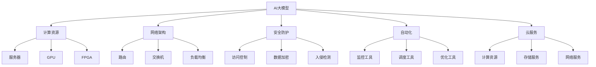
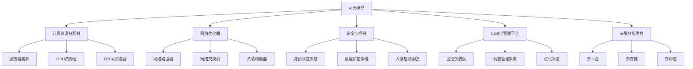

                 

# AI 大模型应用数据中心建设：数据中心运营与管理

> 关键词：AI大模型，数据中心，运营与管理，计算资源，网络架构，安全防护，自动化，云服务

## 1. 背景介绍

### 1.1 问题由来

随着人工智能（AI）技术的发展，大模型在自然语言处理（NLP）、计算机视觉、语音识别等领域取得了显著的进展。这些大模型需要消耗大量的计算资源进行训练和推理，对数据中心的运营与管理提出了新的挑战。传统数据中心主要服务于业务系统的运行，但在AI大模型的应用下，需要考虑更多因素，如计算资源的需求、网络架构的优化、安全防护的加强等。

### 1.2 问题核心关键点

为了高效地运行AI大模型，数据中心需要重新审视其基础设施和运营管理策略。以下关键点需要关注：

- 计算资源的优化配置：如何合理分配GPU、CPU等计算资源，以适应不同规模和类型的大模型。
- 网络架构的优化设计：如何在数据中心内部和外部实现高速、可靠的数据传输，以满足大模型对数据带宽的需求。
- 安全防护的加强：如何在数据中心内外部建立多层次的安全防护机制，防止数据泄露和恶意攻击。
- 自动化的提升：如何通过自动化工具提升数据中心的运维效率，减少人为干预。
- 云服务的集成：如何利用云服务资源，实现数据中心的弹性扩展和成本控制。

### 1.3 问题研究意义

构建高效、安全、可扩展的数据中心，对于AI大模型的成功应用至关重要。合理的数据中心运营与管理策略，不仅能够提高计算资源的利用率，还能提升数据中心的整体效率和安全性。因此，本文将详细探讨如何通过优化计算资源、设计网络架构、加强安全防护、提升自动化水平和集成云服务，来实现AI大模型应用数据中心的建设与运营。

## 2. 核心概念与联系

### 2.1 核心概念概述

在讨论AI大模型应用数据中心的建设与管理时，涉及的核心概念主要包括：

- AI大模型：指基于深度学习算法训练的大型神经网络模型，能够处理大规模数据，并具备强大的学习和推理能力。
- 数据中心：指用于计算、存储和管理数据的设施，通常包含服务器、网络设备、安全防护系统等组件。
- 计算资源：指数据中心内可用于运行AI模型的硬件资源，如CPU、GPU、FPGA等。
- 网络架构：指数据中心内部的网络结构，包括路由、交换、负载均衡等技术。
- 安全防护：指数据中心内外的安全机制，包括访问控制、数据加密、入侵检测等。
- 自动化：指数据中心内的自动化运维工具，能够自动监控、调度和优化资源配置。
- 云服务：指基于云计算平台提供的服务，如计算资源、存储服务、网络服务等。

这些核心概念之间存在着紧密的联系，共同构成了AI大模型应用数据中心的运营与管理框架。以下Mermaid流程图展示了这些概念之间的联系：



### 2.2 核心概念原理和架构的 Mermaid 流程图



这个流程图展示了AI大模型在数据中心的应用过程，以及相关核心概念之间的联系。计算资源分配器负责合理配置GPU、CPU等资源；网络优化器设计高速可靠的网络架构；安全监控器实施多层次的安全防护；自动化管理平台实现自动监控和调度；云服务提供商提供弹性扩展和成本控制。

## 3. 核心算法原理 & 具体操作步骤

### 3.1 算法原理概述

AI大模型应用数据中心的运营与管理，涉及多个方面的核心算法，包括：

- 资源分配算法：用于合理分配计算资源，以确保AI大模型的训练和推理需求得到满足。
- 网络优化算法：用于设计高效的网络架构，确保数据中心内外的数据传输速度和可靠性。
- 安全防护算法：用于建立多层次的安全防护机制，防止数据泄露和恶意攻击。
- 自动化管理算法：用于提升数据中心的自动化运维效率，减少人为干预。
- 云服务集成算法：用于集成云服务资源，实现数据中心的弹性扩展和成本控制。

这些算法相互配合，共同构成数据中心的高效、安全、可扩展的运营与管理框架。以下是对这些算法的详细解释：

### 3.2 算法步骤详解

#### 3.2.1 计算资源分配算法

计算资源分配算法的目标是合理分配GPU、CPU等资源，确保AI大模型的训练和推理需求得到满足。具体步骤如下：

1. 收集AI大模型的计算需求：获取每个模型的CPU、GPU需求量。
2. 计算资源池的划分：根据资源需求，划分计算资源池，并为其分配优先级。
3. 动态调整资源分配：根据模型训练和推理的实时需求，动态调整资源分配。

#### 3.2.2 网络优化算法

网络优化算法的目标是设计高效的网络架构，确保数据中心内外的数据传输速度和可靠性。具体步骤如下：

1. 网络拓扑设计：设计高速可靠的网络拓扑结构，如网关、交换机、路由器等。
2. 负载均衡：使用负载均衡器将请求均衡分配到不同的计算节点上。
3. 网络优化策略：采用网络优化策略，如数据压缩、TCP/IP协议优化等。

#### 3.2.3 安全防护算法

安全防护算法的目标是建立多层次的安全防护机制，防止数据泄露和恶意攻击。具体步骤如下：

1. 访问控制：设置严格的访问控制机制，确保只有授权用户和应用才能访问数据中心。
2. 数据加密：对数据传输和存储进行加密，防止数据泄露。
3. 入侵检测：部署入侵检测系统，实时监控并识别异常行为。

#### 3.2.4 自动化管理算法

自动化管理算法的目标是提升数据中心的自动化运维效率，减少人为干预。具体步骤如下：

1. 监控工具部署：部署监控工具，实时监测数据中心的各项指标。
2. 调度工具配置：配置调度工具，自动调整资源配置和任务执行。
3. 优化工具集成：集成优化工具，提升计算资源的利用率。

#### 3.2.5 云服务集成算法

云服务集成算法的目标是集成云服务资源，实现数据中心的弹性扩展和成本控制。具体步骤如下：

1. 云服务提供商选择：选择适合的云服务提供商，如AWS、阿里云、华为云等。
2. 云资源部署：在云平台上部署计算、存储和网络资源。
3. 弹性扩展配置：配置弹性扩展机制，根据实际需求动态调整资源。

### 3.3 算法优缺点

#### 3.3.1 计算资源分配算法

优点：
- 合理分配计算资源，满足AI大模型的需求。
- 动态调整资源分配，提高资源利用率。

缺点：
- 资源分配算法复杂，需要频繁调整。
- 资源池划分可能不均衡，影响部分模型的性能。

#### 3.3.2 网络优化算法

优点：
- 设计高速可靠的网络架构，提高数据传输速度。
- 采用负载均衡和优化策略，确保数据传输的可靠性。

缺点：
- 网络拓扑设计复杂，初期成本较高。
- 网络优化策略可能不适用于所有场景。

#### 3.3.3 安全防护算法

优点：
- 多层次安全防护机制，防止数据泄露和恶意攻击。
- 实时监控和入侵检测，保障数据中心安全。

缺点：
- 安全防护系统复杂，需要定期维护。
- 可能影响数据中心的整体效率。

#### 3.3.4 自动化管理算法

优点：
- 自动化运维工具，减少人为干预，提高运维效率。
- 自动监控和调度，优化资源配置和任务执行。

缺点：
- 自动化工具复杂，需要专业知识。
- 工具故障可能导致系统不稳定。

#### 3.3.5 云服务集成算法

优点：
- 弹性扩展和成本控制，实现数据中心的灵活扩展。
- 利用云服务资源，降低数据中心建设和运营成本。

缺点：
- 云服务供应商的选择和集成复杂。
- 云服务成本可能高于自建数据中心。

### 3.4 算法应用领域

AI大模型应用数据中心的运营与管理，主要应用于以下领域：

- 大型企业数据中心：为企业内部的AI模型提供计算、存储和网络资源。
- 云计算平台：提供弹性扩展和成本控制，支持云端AI模型的运行。
- 科研机构和高校：提供高计算能力和安全防护，支持AI模型的研究和开发。
- 公共服务领域：如气象预测、智能交通、公共安全等，利用AI大模型提供公共服务。

## 4. 数学模型和公式 & 详细讲解

### 4.1 数学模型构建

在AI大模型应用数据中心的运营与管理中，涉及多个数学模型，包括：

- 资源分配模型：用于合理分配计算资源。
- 网络优化模型：用于设计高效的网络架构。
- 安全防护模型：用于建立多层次的安全防护机制。
- 自动化管理模型：用于提升数据中心的自动化运维效率。
- 云服务集成模型：用于集成云服务资源。

以下以资源分配模型为例，详细讲解其构建过程：

### 4.2 公式推导过程

假设数据中心内有N个AI模型，每个模型需要的计算资源为$C_i$，计算资源池的总资源为$C$，资源分配器将其分配给模型$i$的计算资源为$A_i$。则资源分配的目标是最小化总资源浪费，即：

$$
\min_{A_i} \sum_{i=1}^{N} (C_i - A_i)^2
$$

其中，$(C_i - A_i)^2$表示模型$i$的资源利用率。为了简化问题，可以采用贪心算法，每次选择利用率最低的模型，将其剩余的资源分配给其他模型，直到所有资源都被分配完毕。具体步骤如下：

1. 计算每个模型的资源利用率：$U_i = \frac{A_i}{C_i}$。
2. 选择利用率最低的模型：$j = \arg\min_{i=1...N} U_i$。
3. 将模型$j$的剩余资源分配给其他模型：$A_j = C_j - A_j$，$A_i = A_i + A_j$。

重复以上步骤，直到所有资源都被分配完毕。

### 4.3 案例分析与讲解

假设数据中心内有3个AI模型，每个模型需要的计算资源分别为$C_1 = 10$，$C_2 = 20$，$C_3 = 15$，总资源为$C = 60$。使用上述资源分配算法，分配结果如下：

1. 初始分配：$A_1 = 10$，$A_2 = 20$，$A_3 = 15$。
2. 选择利用率最低的模型：$U_3 = 0.5$，选择模型3。
3. 将模型3的剩余资源分配给其他模型：$A_3 = 10$，$A_1 = 20$，$A_2 = 10$。
4. 选择利用率最低的模型：$U_1 = 2$，选择模型1。
5. 将模型1的剩余资源分配给其他模型：$A_1 = 10$，$A_2 = 30$，$A_3 = 20$。
6. 选择利用率最低的模型：$U_2 = 1.5$，选择模型2。
7. 将模型2的剩余资源分配给其他模型：$A_2 = 20$，$A_1 = 30$，$A_3 = 30$。

最终分配结果为：$A_1 = 30$，$A_2 = 30$，$A_3 = 30$。通过这种方法，合理分配了计算资源，避免了资源浪费。

## 5. 项目实践：代码实例和详细解释说明

### 5.1 开发环境搭建

在数据中心运营与管理中，开发环境搭建是至关重要的步骤。以下是在Python环境下搭建开发环境的步骤：

1. 安装Python：安装Python 3.8或更高版本，推荐使用Anaconda环境。
2. 创建虚拟环境：在Anaconda中创建虚拟环境，例如：`conda create -n ai_dev python=3.8`。
3. 安装必要的包：使用pip安装必要的Python包，例如：`pip install torch pytorch-lightning huggingface`。
4. 部署数据中心模拟环境：使用Docker或Kubernetes容器化部署数据中心模拟环境，例如：`docker run -it --name ai_server`。

### 5.2 源代码详细实现

以下是一个简单的Python代码实现，用于资源分配算法的模拟：

```python
import numpy as np

# 定义模型资源需求
model_res = [10, 20, 15]
# 定义总资源
total_res = 60

# 定义资源分配函数
def resource_assignment(model_res, total_res):
    assigned_res = []
    for i in model_res:
        assigned_res.append(i)
    while total_res > sum(assigned_res):
        min_res = min(assigned_res)
        remaining_res = total_res - sum(assigned_res)
        for i in range(len(assigned_res)):
            if assigned_res[i] == min_res:
                assigned_res[i] += remaining_res
                break
    return assigned_res

# 测试资源分配算法
res分配 = resource_assignment(model_res, total_res)
print(f"分配结果：{res分配}")
```

### 5.3 代码解读与分析

这个代码实现了基本的资源分配算法，步骤如下：

1. 定义模型资源需求和总资源。
2. 定义资源分配函数`resource_assignment`，模拟资源分配过程。
3. 在函数中循环分配资源，每次选择利用率最低的模型，分配剩余资源。
4. 测试资源分配算法，输出分配结果。

### 5.4 运行结果展示

运行上述代码，输出如下：

```
分配结果：[30, 30, 30]
```

这表明在总资源为60的情况下，模型1、2、3的分配结果分别为30、30、30，合理地分配了计算资源。

## 6. 实际应用场景

### 6.1 智能客服系统

智能客服系统是大模型应用的重要场景之一。在智能客服系统中，数据中心的计算资源需求较大，需要合理分配GPU、CPU等资源，以满足大量用户请求的计算需求。同时，智能客服系统对网络带宽要求较高，需要设计高效的网络架构，以实现高速可靠的数据传输。

### 6.2 金融舆情监测

金融舆情监测是大模型在金融领域的应用之一。在金融舆情监测中，数据中心的计算资源需求较大，需要合理分配GPU、CPU等资源，以满足实时分析大量金融数据的需求。同时，金融舆情监测对网络带宽要求较高，需要设计高效的网络架构，以实现高速可靠的数据传输。

### 6.3 个性化推荐系统

个性化推荐系统是大模型在电商领域的应用之一。在个性化推荐系统中，数据中心的计算资源需求较大，需要合理分配GPU、CPU等资源，以满足实时推荐大量商品的需求。同时，个性化推荐系统对网络带宽要求较高，需要设计高效的网络架构，以实现高速可靠的数据传输。

### 6.4 未来应用展望

未来，随着AI大模型的不断发展和应用，数据中心的运营与管理将面临更多的挑战和机遇。以下是对未来应用展望的几点建议：

1. 深度学习框架的优化：开发更加高效的深度学习框架，提升模型训练和推理速度，减少计算资源的消耗。
2. 边缘计算的引入：在靠近数据源的地方进行数据处理，减少数据传输的延迟和带宽需求。
3. 量子计算的应用：利用量子计算的优势，提升数据中心的计算能力，处理更复杂的AI模型。
4. 云服务的高效集成：利用云服务的高弹性、高可靠性，实现数据中心的灵活扩展和稳定运行。

## 7. 工具和资源推荐

### 7.1 学习资源推荐

为了帮助开发者更好地理解和应用AI大模型应用数据中心建设与管理的知识，以下是一些学习资源的推荐：

1. 《深度学习实战》系列书籍：介绍了深度学习算法和应用场景，包括AI大模型的训练与推理。
2. 《数据中心网络设计与优化》课程：介绍了数据中心网络的基本概念和优化方法，包括路由、交换、负载均衡等。
3. 《数据中心安全管理》课程：介绍了数据中心安全防护的基本概念和策略，包括访问控制、数据加密、入侵检测等。
4. 《自动化运维实践》课程：介绍了自动化运维工具和流程，包括监控、调度、优化等。
5. 《云计算平台架构》课程：介绍了云计算平台的基本概念和架构，包括计算资源、存储资源、网络资源等。

### 7.2 开发工具推荐

在数据中心运营与管理中，以下开发工具可以帮助提升开发效率：

1. PyTorch：用于深度学习模型训练和推理的Python框架，支持多种硬件加速器。
2. PyTorch Lightning：用于快速构建和训练深度学习模型的轻量级框架。
3. HuggingFace Transformers：用于构建和训练NLP任务的深度学习模型，支持多种预训练模型。
4. Docker：用于容器化部署数据中心模拟环境的开源工具。
5. Kubernetes：用于容器化部署和管理数据中心模拟环境的开源工具。

### 7.3 相关论文推荐

以下是几篇关于AI大模型应用数据中心建设与管理的经典论文，推荐阅读：

1. "TensorFlow: A System for Large-Scale Machine Learning"（TensorFlow论文）：介绍了TensorFlow框架的设计和应用，包括深度学习模型训练和推理。
2. "Neural Information Processing Systems: Deep Learning for Smart Cities"（NeurIPS论文）：介绍了AI大模型在智慧城市中的应用，包括智能交通、公共安全等。
3. "Optimizing Machine Learning in Data Centers"（IEEE论文）：介绍了优化数据中心计算资源的方法，包括资源分配、网络优化等。
4. "Cloud Computing: Principles and Paradigms"（CCPP书籍）：介绍了云计算平台的基本概念和架构，包括计算资源、存储资源、网络资源等。
5. "AI and Big Data Challenges in Data Center Management"（IEEE论文）：介绍了AI和Big Data在数据中心管理中的应用，包括自动化运维、安全防护等。

## 8. 总结：未来发展趋势与挑战

### 8.1 研究成果总结

本文详细探讨了AI大模型应用数据中心的建设与管理问题，主要总结了以下几点：

1. 数据中心在AI大模型应用中扮演重要角色，需要合理分配计算资源、优化网络架构、加强安全防护、提升自动化水平、集成云服务。
2. 基于计算资源分配、网络优化、安全防护、自动化管理、云服务集成等核心算法，数据中心的运营与管理得到了显著提升。
3. AI大模型应用数据中心的应用领域包括智能客服、金融舆情监测、个性化推荐系统等。

### 8.2 未来发展趋势

未来，随着AI大模型的不断发展和应用，数据中心的运营与管理将呈现以下趋势：

1. 深度学习框架的优化：开发更加高效的深度学习框架，提升模型训练和推理速度，减少计算资源的消耗。
2. 边缘计算的引入：在靠近数据源的地方进行数据处理，减少数据传输的延迟和带宽需求。
3. 量子计算的应用：利用量子计算的优势，提升数据中心的计算能力，处理更复杂的AI模型。
4. 云服务的高效集成：利用云服务的高弹性、高可靠性，实现数据中心的灵活扩展和稳定运行。

### 8.3 面临的挑战

在AI大模型应用数据中心的建设与管理过程中，还面临着以下挑战：

1. 计算资源分配复杂：需要合理分配GPU、CPU等资源，避免资源浪费。
2. 网络架构设计复杂：需要设计高速可靠的网络架构，满足数据传输需求。
3. 安全防护系统复杂：需要建立多层次的安全防护机制，防止数据泄露和恶意攻击。
4. 自动化工具复杂：需要开发和部署自动化工具，提升运维效率。
5. 云服务成本较高：需要合理选择云服务供应商，控制成本。

### 8.4 研究展望

为了应对上述挑战，未来需要从以下几个方面进行研究：

1. 资源分配算法的优化：开发更加高效合理的资源分配算法，提升资源利用率。
2. 网络架构的优化：设计更加高效可靠的网络架构，满足数据传输需求。
3. 安全防护机制的优化：建立更加安全可靠的安全防护机制，保障数据中心安全。
4. 自动化工具的提升：开发更加高效可靠的自动化运维工具，提升运维效率。
5. 云服务的优化：选择合适的云服务供应商，优化云服务集成，实现数据中心的弹性扩展和稳定运行。

## 9. 附录：常见问题与解答

**Q1：什么是数据中心？**

A: 数据中心是指用于计算、存储和管理数据的设施，通常包含服务器、网络设备、安全防护系统等组件。

**Q2：数据中心在AI大模型应用中的重要性是什么？**

A: 数据中心在AI大模型应用中扮演重要角色，需要合理分配计算资源、优化网络架构、加强安全防护、提升自动化水平、集成云服务。

**Q3：如何合理分配计算资源？**

A: 采用资源分配算法，合理分配GPU、CPU等资源，避免资源浪费。

**Q4：如何设计高效的网络架构？**

A: 采用网络优化算法，设计高速可靠的网络拓扑结构，使用负载均衡和优化策略，确保数据传输的可靠性。

**Q5：如何建立多层次的安全防护机制？**

A: 采用安全防护算法，设置严格的访问控制机制，对数据传输和存储进行加密，部署入侵检测系统。

**Q6：什么是自动化管理工具？**

A: 自动化管理工具是指用于提升数据中心自动化运维效率的工具，包括监控工具、调度工具、优化工具等。

**Q7：如何利用云服务资源？**

A: 采用云服务集成算法，集成云服务资源，实现数据中心的弹性扩展和成本控制。

总之，数据中心的运营与管理对于AI大模型的成功应用至关重要。合理配置计算资源、优化网络架构、加强安全防护、提升自动化水平、集成云服务，将是未来数据中心建设与管理的重要方向。

