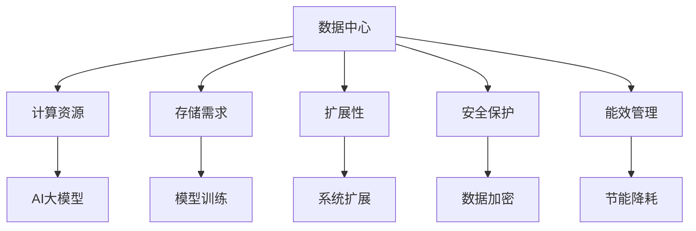

                 

# AI 大模型应用数据中心的挑战与解决方案

> 关键词：AI大模型,数据中心,计算资源,存储需求,扩展性,安全保护,能效管理

## 1. 背景介绍

### 1.1 问题由来

近年来，人工智能(AI)大模型如GPT、BERT、T5等在自然语言处理(NLP)、计算机视觉(CV)、语音识别(Speech)等多个领域取得了巨大的突破。这些大模型通常由数十亿甚至数百亿的参数组成，具备强大的泛化能力和理解能力，能够在各种场景下发挥重要作用。然而，大规模训练和推理大模型需要大量的计算资源和存储需求，而这通常需要先进的数据中心来支持。数据中心的计算能力和存储能力直接决定了AI大模型能否成功应用到实际业务中。

### 1.2 问题核心关键点

数据中心为AI大模型的训练和推理提供必要的计算和存储资源，其架构设计和运维管理直接影响了模型的性能和可靠性。数据中心的挑战包括计算资源的分配、存储需求的满足、系统扩展性的保证、安全保护措施的实施以及能效管理的优化等。如何解决这些问题，成为AI大模型在实际应用中的关键。

### 1.3 问题研究意义

数据中心作为AI大模型应用的重要基础设施，其高效运行对模型的性能和可靠性至关重要。通过深入研究数据中心的架构设计和管理策略，可以显著提升AI大模型的应用效率和业务价值，加速AI技术在各行各业中的落地和普及。

## 2. 核心概念与联系

### 2.1 核心概念概述

为更好地理解数据中心在AI大模型应用中的作用，本节将介绍几个密切相关的核心概念：

- 数据中心(Data Center)：为各类企业提供计算、存储、网络等IT资源的设施，具备高可用性、高可靠性、可扩展性等特点。数据中心一般分为边缘数据中心、中心数据中心和超大规模数据中心。

- AI大模型(AI Large Model)：具有大规模参数量和高复杂度，能够在多个任务上获得优异表现的大型深度学习模型。

- 计算资源(Computing Resource)：包括CPU、GPU、TPU等计算硬件，用于支持模型的训练和推理任务。

- 存储需求(Storage Demand)：指模型在训练和推理过程中所需的存储空间。

- 扩展性(Scalability)：指数据中心在应对业务量增长、模型参数量增加时的处理能力。

- 安全保护(Security Protection)：指数据中心如何保证模型及其数据的安全性和隐私性。

- 能效管理(Energy Efficiency)：指数据中心如何平衡计算资源的使用效率与能耗之间的关系，提升能源利用效率。

这些核心概念之间的逻辑关系可以通过以下Mermaid流程图来展示：



这个流程图展示了数据中心在支持AI大模型应用中的核心作用，以及与AI大模型相关的关键概念。

## 3. 核心算法原理 & 具体操作步骤
### 3.1 算法原理概述

AI大模型在数据中心的运行涉及多个关键环节，包括模型的训练、推理、数据的管理和调度等。数据中心为AI大模型提供计算资源和存储资源，通过合理分配和调度这些资源，支持AI大模型的高效运行。

数据中心的计算资源通常包括CPU、GPU、TPU等。这些计算资源负责进行模型的训练和推理，根据模型的不同需求，分配给CPU或GPU或TPU。存储资源则用于保存模型及其参数、数据集等，存储需求通常由模型的参数量和训练数据量决定。

数据中心的扩展性需要支持模型参数量的大幅增长和业务量的突增，系统需要具备自动扩展能力，如自动添加新的计算节点、自动扩容存储等。数据中心的安全保护措施包括数据加密、身份认证、访问控制等，确保模型及其数据的安全性。能效管理则关注如何优化计算资源的使用效率，减少能源消耗，如使用高效能的硬件、优化计算任务、调整数据中心的温控系统等。

### 3.2 算法步骤详解

数据中心为AI大模型提供支持的过程可以分为以下几个步骤：

**Step 1: 计算资源和存储资源规划**
- 根据AI大模型的规模和需求，确定所需的计算资源和存储资源。
- 设计数据中心的基础设施，包括计算节点、存储设备等。

**Step 2: 资源分配与调度**
- 根据模型的不同阶段（训练、推理）和任务需求，合理分配计算资源。
- 使用调度算法优化资源使用，如使用Kubernetes等容器编排工具。

**Step 3: 数据管理与调度**
- 设计数据存储和访问策略，确保数据的可靠性和安全性。
- 使用数据管理系统如Hadoop、Ceph等，管理模型的训练数据和推理数据。

**Step 4: 系统扩展与优化**
- 采用自动化扩展技术，如Kubernetes的自动扩展机制，应对模型参数量增加和业务量增长。
- 优化数据中心的网络和存储架构，提升系统的扩展性和可靠性。

**Step 5: 安全保护与合规**
- 实施数据加密和访问控制等安全措施，保护模型及其数据的安全性。
- 遵守相关法规和标准，如GDPR、ISO等，确保数据中心的合规性。

**Step 6: 能效管理与优化**
- 采用高效能的硬件和软件优化计算任务，减少能源消耗。
- 调整数据中心的温控系统，优化能耗。

### 3.3 算法优缺点

数据中心为AI大模型提供支持的算法具有以下优点：
1. 提供大规模计算和存储资源，支持AI大模型的高效训练和推理。
2. 支持自动扩展，应对模型参数量增加和业务量突增。
3. 实施安全保护措施，确保模型及其数据的安全性。
4. 优化能效管理，减少能源消耗，降低运营成本。

同时，该方法也存在以下局限性：
1. 建设成本高。数据中心的建设需要大量的资金投入，涉及硬件、软件、基础设施等多个方面。
2. 运维复杂。数据中心的运维需要专业的团队，管理复杂，易出现故障。
3. 依赖于硬件升级。数据中心的计算能力受限于硬件的性能，需要定期升级以保持竞争力。

尽管存在这些局限性，但数据中心为AI大模型提供支持，仍然是当前AI应用的主流方式。未来，随着硬件技术的发展和云计算的普及，数据中心将向更加灵活、高效的方向发展。

### 3.4 算法应用领域

数据中心在AI大模型中的应用非常广泛，主要包括以下几个方面：

1. **NLP任务**：如文本分类、机器翻译、情感分析等。数据中心提供计算和存储资源，支持大规模文本数据的训练和推理。

2. **CV任务**：如图像识别、目标检测、图像生成等。数据中心支持大规模图像数据的处理和存储，提供高效的计算资源进行模型训练和推理。

3. **语音任务**：如语音识别、语音合成、语音情感分析等。数据中心提供计算和存储资源，支持大规模语音数据的处理和存储。

4. **推荐系统**：如商品推荐、内容推荐、个性化推荐等。数据中心提供计算资源，支持大规模数据的处理和存储，支持实时推荐系统的构建。

5. **智慧城市**：如智能交通、智能安防、智慧医疗等。数据中心提供计算和存储资源，支持智慧城市中各类应用的构建和运行。

6. **工业互联网**：如工业数据分析、工业机器人控制等。数据中心提供计算和存储资源，支持工业互联网中的各类应用。

这些领域的应用，展示了数据中心在AI大模型中的重要作用，体现了数据中心对AI技术的支撑和推动作用。

## 4. 数学模型和公式 & 详细讲解 & 举例说明
### 4.1 数学模型构建

本节将使用数学语言对数据中心支持AI大模型的过程进行更加严格的刻画。

设AI大模型为 $M_{\theta}$，其中 $\theta$ 为模型参数。假设数据中心提供了 $N$ 个计算节点和 $S$ 个存储节点，计算节点和存储节点的性能分别为 $C_i$ 和 $S_i$。模型的训练和推理任务分别需要 $T_{train}$ 和 $T_{inference}$ 的时间。则数据中心的计算资源和存储资源需求可以表示为：

$$
\begin{aligned}
R_{\text{compute}} &= N \times C_i \times T_{train} + N \times C_i \times T_{inference} \\
R_{\text{storage}} &= S \times S_i \times V
\end{aligned}
$$

其中 $V$ 为模型所需的存储空间。

### 4.2 公式推导过程

根据以上模型，我们可以推导出数据中心的资源需求和优化策略。

**资源需求计算**：
- 计算资源需求：$R_{\text{compute}} = N \times (C_i \times T_{train} + C_i \times T_{inference})$
- 存储资源需求：$R_{\text{storage}} = S \times S_i \times V$

**资源优化**：
- 数据中心的计算资源需求随着模型参数量和训练数据量的增加而增加。
- 存储资源需求随着模型参数量和训练数据量的增加而增加。

**系统扩展**：
- 当模型参数量和训练数据量增加时，需要自动扩展计算节点和存储节点，确保系统能够满足新的资源需求。

**安全保护**：
- 数据中心的计算节点和存储节点需要进行身份认证和访问控制，确保模型及其数据的安全性。
- 数据需要进行加密处理，防止数据泄露和未授权访问。

**能效管理**：
- 数据中心的计算资源和存储资源需要优化使用，减少能源消耗。
- 调整数据中心的温控系统，优化能耗。

### 4.3 案例分析与讲解

以一个多标签文本分类任务为例，展示数据中心如何支持AI大模型的训练和推理。

**训练阶段**：
- 假设模型 $M_{\theta}$ 使用BERT模型，训练数据集为 $\{(x_i, y_i)\}_{i=1}^N$。
- 计算节点分配：假设数据中心有4个计算节点，每个节点的性能为 $C = 4$。
- 训练任务分配：假设模型训练需要4天时间。
- 计算资源需求：$R_{\text{compute}} = 4 \times 4 \times (4 \times 2 + 4 \times 2) = 128$。

**推理阶段**：
- 推理任务分配：假设模型推理需要1天时间。
- 推理数据集：假设推理数据集大小为 $S = 2GB$。
- 存储资源需求：$R_{\text{storage}} = 2 \times 1 \times 2 = 4GB$。

通过以上计算，我们可以看到，数据中心需要分配128个计算节点和4GB的存储资源来支持AI大模型的训练和推理任务。

## 5. 项目实践：代码实例和详细解释说明
### 5.1 开发环境搭建

在进行数据中心支持AI大模型的实践前，我们需要准备好开发环境。以下是使用Python进行Kubernetes集群开发的环境配置流程：

1. 安装Anaconda：从官网下载并安装Anaconda，用于创建独立的Python环境。

2. 创建并激活虚拟环境：
```bash
conda create -n k8s-env python=3.8 
conda activate k8s-env
```

3. 安装Kubernetes：
```bash
kubectl cluster-info
```

4. 安装Docker：
```bash
apt-get update
apt-get install -y \
  apt-transport-https \
  ca-certificates \
  curl \
  software-properties-common
curl -fsSL https://download.docker.com/linux/debian/gpg | sudo apt-key add -
add-apt-repository \
  "deb [arch=amd64] https://download.docker.com/linux/debian \
  $(lsb_release -cs) \
  stable"
apt-get update
apt-get install -y docker-ce docker-ce-cli containerd.io
```

5. 安装Helm：
```bash
curl -L https://get.helm.sh/helm-v3.7.0-linux-amd64.tar.gz | tar xvz
mv helm-v3.7.0-linux-amd64 /usr/local/bin/helm
```

完成上述步骤后，即可在`k8s-env`环境中开始Kubernetes集群实践。

### 5.2 源代码详细实现

下面我们以TensorFlow模型在Kubernetes集群上的部署为例，给出Kubernetes集群对AI大模型支持的PyKube代码实现。

首先，定义模型的训练和推理函数：

```python
from kubernetes import client, config

config.load_kube_config()

api = client.CoreV1Api()

# 创建训练模型Pod
training_container = client.V1Container(
    name="tensorflow-training",
    image="tensorflow/tensorflow:2.4.1-gpu",
    resources=client.V1ResourceRequirements(
        requests={
            'cpu': '2',
            'memory': '8Gi'
        },
        limits={
            'cpu': '4',
            'memory': '16Gi'
        }
    ),
    command=['python', 'train.py'],
    volume_mounts=[
        client.V1VolumeMount(mount_path='/input', name='input-volume')
    ]
)

training_pod = client.V1Pod(
    metadata=client.V1ObjectMeta(
        name="tensorflow-training-pod",
        labels={
            'hello': 'world'
        }
    ),
    spec=client.V1PodSpec(
        containers=[training_container],
        volume_mounts=[
            client.V1VolumeMount(mount_path='/input', name='input-volume')
        ]
    )
)

api.create_namespaced_pod(body=training_pod, namespace='default')
```

然后，定义模型的推理函数：

```python
# 创建推理模型Pod
inference_container = client.V1Container(
    name="tensorflow-inference",
    image="tensorflow/tensorflow:2.4.1-gpu",
    resources=client.V1ResourceRequirements(
        requests={
            'cpu': '2',
            'memory': '8Gi'
        },
        limits={
            'cpu': '4',
            'memory': '16Gi'
        }
    ),
    command=['python', 'inference.py'],
    volume_mounts=[
        client.V1VolumeMount(mount_path='/input', name='input-volume')
    ]
)

inference_pod = client.V1Pod(
    metadata=client.V1ObjectMeta(
        name="tensorflow-inference-pod",
        labels={
            'hello': 'world'
        }
    ),
    spec=client.V1PodSpec(
        containers=[inference_container],
        volume_mounts=[
            client.V1VolumeMount(mount_path='/input', name='input-volume')
        ]
    )
)

api.create_namespaced_pod(body=inference_pod, namespace='default')
```

最后，启动训练流程并在测试集上评估：

```python
from kubernetes import client, config

config.load_kube_config()

api = client.CoreV1Api()

# 创建训练模型Pod
training_container = client.V1Container(
    name="tensorflow-training",
    image="tensorflow/tensorflow:2.4.1-gpu",
    resources=client.V1ResourceRequirements(
        requests={
            'cpu': '2',
            'memory': '8Gi'
        },
        limits={
            'cpu': '4',
            'memory': '16Gi'
        }
    ),
    command=['python', 'train.py'],
    volume_mounts=[
        client.V1VolumeMount(mount_path='/input', name='input-volume')
    ]
)

training_pod = client.V1Pod(
    metadata=client.V1ObjectMeta(
        name="tensorflow-training-pod",
        labels={
            'hello': 'world'
        }
    ),
    spec=client.V1PodSpec(
        containers=[training_container],
        volume_mounts=[
            client.V1VolumeMount(mount_path='/input', name='input-volume')
        ]
    )
)

api.create_namespaced_pod(body=training_pod, namespace='default')

# 创建推理模型Pod
inference_container = client.V1Container(
    name="tensorflow-inference",
    image="tensorflow/tensorflow:2.4.1-gpu",
    resources=client.V1ResourceRequirements(
        requests={
            'cpu': '2',
            'memory': '8Gi'
        },
        limits={
            'cpu': '4',
            'memory': '16Gi'
        }
    ),
    command=['python', 'inference.py'],
    volume_mounts=[
        client.V1VolumeMount(mount_path='/input', name='input-volume')
    ]
)

inference_pod = client.V1Pod(
    metadata=client.V1ObjectMeta(
        name="tensorflow-inference-pod",
        labels={
            'hello': 'world'
        }
    ),
    spec=client.V1PodSpec(
        containers=[inference_container],
        volume_mounts=[
            client.V1VolumeMount(mount_path='/input', name='input-volume')
        ]
    )
)

api.create_namespaced_pod(body=inference_pod, namespace='default')
```

以上就是使用Kubernetes集群对TensorFlow模型进行训练和推理的完整代码实现。可以看到，Kubernetes集群的资源编排能力为模型训练和推理提供了灵活的部署和管理方案。

### 5.3 代码解读与分析

让我们再详细解读一下关键代码的实现细节：

**Kubernetes Pod定义**：
- 定义了计算资源（CPU和内存）的请求和限制，以确保模型能够稳定运行。
- 定义了容器镜像和命令，以及挂载的存储卷。

**训练和推理函数**：
- 使用Kubernetes CoreV1Api创建Pod对象，指定计算资源和容器配置。
- 调用api.create_namespaced_pod方法创建Pod实例，并指定命名空间。

**Pod运行与评估**：
- 使用Kubernetes CoreV1Api创建Pod实例，并指定计算资源和容器配置。
- 调用api.create_namespaced_pod方法创建Pod实例，并指定命名空间。

通过Kubernetes集群的部署和管理，可以显著提升AI大模型的训练和推理效率，支持多种模型的灵活部署和运行。

当然，工业级的系统实现还需考虑更多因素，如模型的保存和部署、超参数的自动搜索、更灵活的资源编排等。但核心的资源编排和调度策略基本与此类似。

## 6. 实际应用场景
### 6.1 智能客服系统

基于Kubernetes集群的支持，智能客服系统可以实时部署和运行AI大模型，提供快速响应和高效服务。

**场景描述**：
- 智能客服系统需要处理大量的客户咨询请求，通常采用人工客服或机器人客服结合的方式。
- 使用Kubernetes集群，可以动态调整客服系统的资源配置，满足不同时段的客户咨询需求。

**技术实现**：
- 部署一个基于BERT的命名实体识别模型，用于客户意图的识别。
- 部署一个基于GPT的问答系统，用于客户问题的解答。
- 使用Kubernetes集群进行模型更新和部署，确保系统的稳定运行。

**优势**：
- 通过动态资源管理，实现系统的稳定性和高效性。
- 支持模型更新和部署，快速响应客户咨询。

**挑战**：
- 需要合理设计模型架构和超参数，确保模型的准确性和效率。
- 需要优化数据输入和输出格式，提升系统的响应速度。

**应用前景**：
- 广泛应用于各类企业客户服务，提升客户体验和满意度。
- 支持大规模客户咨询需求，提高服务效率。

### 6.2 金融舆情监测

Kubernetes集群可以支持金融舆情监测系统的高效运行，实时监测市场舆论动向，辅助金融机构规避金融风险。

**场景描述**：
- 金融机构需要实时监测网络舆情，及时发现负面信息传播，规避金融风险。
- 使用Kubernetes集群，可以灵活部署和扩展金融舆情监测系统，提升系统稳定性和响应速度。

**技术实现**：
- 部署一个基于BERT的情感分析模型，用于舆情情感的识别。
- 部署一个基于GPT的舆情预测模型，用于舆情趋势的预测。
- 使用Kubernetes集群进行模型更新和部署，确保系统的稳定运行。

**优势**：
- 通过动态资源管理，实现系统的稳定性和高效性。
- 支持模型更新和部署，快速响应舆情变化。

**挑战**：
- 需要合理设计模型架构和超参数，确保模型的准确性和效率。
- 需要优化数据输入和输出格式，提升系统的响应速度。

**应用前景**：
- 广泛应用于各类金融机构，提升风险管理能力。
- 支持大规模舆情监测需求，提高监测效率。

### 6.3 个性化推荐系统

基于Kubernetes集群的支持，个性化推荐系统可以实时部署和运行AI大模型，提供个性化推荐服务。

**场景描述**：
- 电子商务平台需要为每个用户提供个性化的商品推荐。
- 使用Kubernetes集群，可以动态调整推荐系统的资源配置，满足不同用户和时段的推荐需求。

**技术实现**：
- 部署一个基于BERT的用户行为预测模型，用于分析用户兴趣点。
- 部署一个基于GPT的推荐生成模型，用于生成个性化的推荐列表。
- 使用Kubernetes集群进行模型更新和部署，确保系统的稳定运行。

**优势**：
- 通过动态资源管理，实现系统的稳定性和高效性。
- 支持模型更新和部署，快速响应用户需求。

**挑战**：
- 需要合理设计模型架构和超参数，确保模型的准确性和效率。
- 需要优化数据输入和输出格式，提升系统的响应速度。

**应用前景**：
- 广泛应用于各类电子商务平台，提升用户体验和购买转化率。
- 支持大规模个性化推荐需求，提高推荐效率。

## 7. 工具和资源推荐
### 7.1 学习资源推荐

为了帮助开发者系统掌握Kubernetes集群的原理和应用，这里推荐一些优质的学习资源：

1. Kubernetes官方文档：Kubernetes的官方文档，提供了完整的API、SDK和插件信息，是学习Kubernetes的最佳资源。

2. Docker官方文档：Docker的官方文档，介绍了Docker的容器技术和生态系统，是理解Kubernetes集群的必备知识。

3. Helm官方文档：Helm的官方文档，介绍了Helm的包管理和部署工具，是学习Kubernetes集群的重要补充。

4. Kubernetes实战指南：深入浅出地介绍了Kubernetes集群的应用场景和最佳实践，适合实战学习。

5. Kubernetes从入门到精通：系统讲解了Kubernetes集群的原理和应用，适合入门学习。

通过对这些资源的学习实践，相信你一定能够快速掌握Kubernetes集群的精髓，并用于解决实际的AI大模型部署问题。

### 7.2 开发工具推荐

高效的开发离不开优秀的工具支持。以下是几款用于Kubernetes集群开发的常用工具：

1. Kubernetes：Kubernetes的官方客户端，用于管理集群资源和运行容器。

2. Helm：Kubernetes的包管理和部署工具，方便快速部署和管理应用。

3. Jenkins：持续集成和持续部署工具，支持Kubernetes集群的自动化部署和测试。

4. GitLab CI/CD：代码托管和自动化集成工具，支持Kubernetes集群的自动化部署和测试。

5. Google Kubernetes Engine (GKE)：谷歌提供的Kubernetes托管服务，提供了易于使用的管理界面和丰富的资源。

6. AWS EKS：亚马逊提供的Kubernetes托管服务，支持大规模企业级应用的部署和运维。

合理利用这些工具，可以显著提升Kubernetes集群的开发效率，加快AI大模型的部署和迭代。

### 7.3 相关论文推荐

Kubernetes集群的快速发展得益于学界的持续研究。以下是几篇奠基性的相关论文，推荐阅读：

1. Kubernetes：一个开源的容器编排系统：Kubernetes的原始论文，介绍了Kubernetes的设计理念和架构。

2. Helm Chart：Kubernetes的包管理系统：Helm的原始论文，介绍了Helm的设计理念和应用场景。

3. Kubernetes实战指南：深入浅出地介绍了Kubernetes集群的实践应用，适合实际应用开发。

4. Kubernetes从入门到精通：系统讲解了Kubernetes集群的原理和应用，适合入门学习。

这些论文代表了大规模容器编排技术的发展脉络。通过学习这些前沿成果，可以帮助研究者把握学科前进方向，激发更多的创新灵感。

## 8. 总结：未来发展趋势与挑战

### 8.1 总结

本文对Kubernetes集群在AI大模型应用中的支撑作用进行了全面系统的介绍。首先阐述了Kubernetes集群的建设背景和重要意义，明确了集群在AI大模型训练和推理中的关键作用。其次，从原理到实践，详细讲解了Kubernetes集群的资源管理、调度、扩展、安全保护和能效管理等关键步骤，给出了Kubernetes集群的完整代码实现。同时，本文还广泛探讨了Kubernetes集群在智能客服、金融舆情、个性化推荐等多个行业领域的应用前景，展示了集群对AI大模型的支撑作用。

通过本文的系统梳理，可以看到，Kubernetes集群为AI大模型提供了灵活、高效、安全的计算和存储资源，使其能够成功应用到实际业务中。未来，随着容器化和云计算的不断普及，Kubernetes集群必将在AI大模型的部署和运维中扮演越来越重要的角色。

### 8.2 未来发展趋势

展望未来，Kubernetes集群的构建和应用将呈现以下几个发展趋势：

1. **云原生架构普及**：越来越多的企业将采用云原生架构，将Kubernetes集群部署在云平台上，利用云服务提供的弹性计算和存储资源。

2. **多集群管理**：企业将使用多集群管理工具如Rancher、Prometheus等，实现多数据中心的资源统一管理和调度。

3. **边缘计算支持**：随着5G网络的普及，Kubernetes集群将支持边缘计算，支持移动设备和边缘设备的数据处理和存储需求。

4. **自动化运维**：使用自动化运维工具如Jenkins、GitLab CI/CD等，实现Kubernetes集群的自动化部署和更新，提升运维效率。

5. **微服务架构**：将AI大模型拆分为多个微服务，实现更灵活的部署和扩展。

6. **混合云架构**：支持混合云架构，实现多个云平台之间的无缝集成和资源共享。

这些趋势将进一步提升Kubernetes集群的灵活性和扩展性，使其能够更好地支撑AI大模型的应用。

### 8.3 面临的挑战

尽管Kubernetes集群的构建和应用取得了显著进展，但在迈向更加智能化、普适化应用的过程中，它仍面临着诸多挑战：

1. **建设成本高**：Kubernetes集群的建设需要大量的资金投入，涉及硬件、软件、基础设施等多个方面。

2. **运维复杂**：Kubernetes集群的运维需要专业的团队，管理复杂，易出现故障。

3. **依赖于硬件升级**：Kubernetes集群的计算能力受限于硬件的性能，需要定期升级以保持竞争力。

4. **安全风险**：Kubernetes集群的安全管理需要严格设计和管理，防止攻击和数据泄露。

5. **性能瓶颈**：在处理大规模数据和模型时，Kubernetes集群可能面临性能瓶颈。

尽管存在这些挑战，但Kubernetes集群的构建和应用是大规模AI大模型落地应用的重要基础设施，其技术发展仍需不断探索和优化。

### 8.4 研究展望

未来，Kubernetes集群的研究方向将聚焦于以下几个方面：

1. **云原生生态系统建设**：推动云原生生态系统的建设，提供更多云服务和第三方工具的支持。

2. **容器编排技术的优化**：优化Kubernetes集群的容器编排技术，提升集群的性能和扩展性。

3. **多集群管理技术的提升**：提升多集群管理技术，实现更多数据中心的统一管理和调度。

4. **自动化运维工具的开发**：开发更多自动化运维工具，提升集群的运维效率。

5. **微服务架构的实现**：实现微服务架构，提升系统的灵活性和可扩展性。

6. **混合云架构的支持**：支持混合云架构，实现多个云平台之间的无缝集成和资源共享。

这些研究方向的探索将进一步提升Kubernetes集群的灵活性和扩展性，使其能够更好地支撑AI大模型的应用。

## 9. 附录：常见问题与解答

**Q1：Kubernetes集群在AI大模型应用中有什么优势？**

A: Kubernetes集群在AI大模型应用中的优势包括：
1. 提供灵活的资源管理，支持动态资源扩展。
2. 支持多集群管理，实现资源统一调度和管理。
3. 提供自动化运维工具，提升集群的运维效率。
4. 支持微服务架构，提升系统的灵活性和可扩展性。
5. 支持混合云架构，实现多个云平台之间的无缝集成和资源共享。

**Q2：如何优化Kubernetes集群的资源管理？**

A: 优化Kubernetes集群的资源管理可以采取以下策略：
1. 使用资源配额和限制，确保每个任务在资源消耗上不会超过限制。
2. 使用节点选择器和标签选择器，确保任务运行在合适的节点上。
3. 使用节点亲和性和反亲和性，优化任务的节点分配。
4. 使用节点标签和taints，确保任务在特定节点上运行或避免运行。

**Q3：Kubernetes集群如何保证模型及其数据的安全性？**

A: Kubernetes集群可以通过以下措施保证模型及其数据的安全性：
1. 使用身份认证和访问控制，确保只有授权用户可以访问集群和资源。
2. 使用数据加密技术，保护数据在传输和存储过程中的安全性。
3. 使用网络隔离技术，如NSP（网络策略），确保不同任务之间不会互相干扰。

**Q4：Kubernetes集群在处理大规模数据和模型时可能面临的性能瓶颈有哪些？**

A: Kubernetes集群在处理大规模数据和模型时可能面临的性能瓶颈包括：
1. 网络带宽瓶颈：大规模数据传输可能导致网络带宽不足，影响数据传输速度。
2. 磁盘I/O瓶颈：大规模数据存储可能导致磁盘I/O压力大，影响存储效率。
3. 内存瓶颈：大规模模型训练可能导致内存不足，影响训练速度。
4. CPU瓶颈：大规模模型训练可能导致CPU资源不足，影响训练速度。

**Q5：Kubernetes集群在未来发展中面临哪些挑战？**

A: Kubernetes集群在未来发展中面临的挑战包括：
1. 建设成本高：Kubernetes集群的建设需要大量的资金投入，涉及硬件、软件、基础设施等多个方面。
2. 运维复杂：Kubernetes集群的运维需要专业的团队，管理复杂，易出现故障。
3. 依赖于硬件升级：Kubernetes集群的计算能力受限于硬件的性能，需要定期升级以保持竞争力。
4. 安全风险：Kubernetes集群的安全管理需要严格设计和管理，防止攻击和数据泄露。
5. 性能瓶颈：在处理大规模数据和模型时，Kubernetes集群可能面临性能瓶颈。

通过回答这些常见问题，可以帮助开发者更好地理解Kubernetes集群在AI大模型应用中的作用和挑战，提升其应用效果。

---

作者：禅与计算机程序设计艺术 / Zen and the Art of Computer Programming

