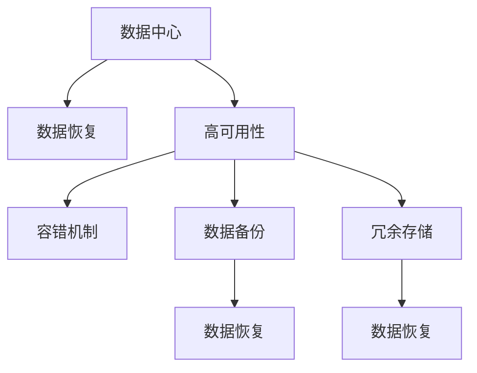

                 

# AI 大模型应用数据中心的数据恢复架构

> 关键词：数据恢复, AI大模型, 数据中心, 高可用性, 容错机制, 数据备份, 冗余存储, 硬件故障

## 1. 背景介绍

在当今快速发展的AI时代，数据中心成为了存储和处理海量数据的核心基础设施。AI大模型的训练和应用往往依赖于大规模的分布式数据存储，对数据恢复的效率和可靠性提出了极高的要求。数据中心的任何故障都可能导致AI模型训练中断，甚至数据丢失，带来巨大的经济损失。因此，构建可靠的数据恢复架构，确保AI大模型应用的高可用性和鲁棒性，成为数据中心建设的重要课题。

本文将详细介绍AI大模型应用数据中心的数据恢复架构，包括其核心概念、关键技术、实践案例和未来趋势，旨在为数据中心和AI系统开发者提供全面的技术指导。

## 2. 核心概念与联系

### 2.1 核心概念概述

在构建数据恢复架构之前，首先需要理解一些关键概念：

- **数据中心**：数据中心是进行数据存储、处理和管理的设施。AI大模型通常部署在大型数据中心中，利用分布式计算资源进行模型训练和推理。
- **数据恢复**：数据恢复是指在数据中心发生硬件故障或数据损坏时，通过冗余存储和备份机制，确保数据的完整性和可用性。
- **高可用性**：高可用性是指数据中心在绝大部分时间内能够保证服务的连续性和稳定性，即使在故障发生时也能够迅速恢复。
- **容错机制**：容错机制是通过冗余设计和备份策略，保证数据中心在不同场景下能够无故障运行，提升系统的健壮性和可靠性。
- **数据备份**：数据备份是将关键数据复制一份，保存在其他存储介质上，以便在主存储介质失效时恢复数据。
- **冗余存储**：冗余存储是指在同一系统中存储多个副本，保证数据不会因为单一故障而丢失。

这些核心概念之间的关系可以通过以下Mermaid流程图来展示：



这个流程图展示了大模型数据中心的核心概念及其之间的关系：

1. 数据中心负责数据的存储和处理，是数据恢复架构的基础。
2. 高可用性是数据中心的核心目标，通过容错机制、数据备份、冗余存储等技术实现。
3. 容错机制通过冗余设计和备份策略，保证系统在单点故障下的连续性。
4. 数据备份和冗余存储是数据恢复的具体手段，确保数据的完整性和可用性。
5. 数据恢复是数据中心的重要功能，通过备份和冗余存储机制实现。

## 3. 核心算法原理 & 具体操作步骤

### 3.1 算法原理概述

AI大模型应用数据中心的数据恢复架构，本质上是分布式系统的高可用性和容错设计。其核心思想是通过冗余存储和备份机制，实现数据的故障容忍和快速恢复。

在数据恢复架构中，关键部件包括冗余存储系统、备份机制、容错设计以及数据恢复策略。

### 3.2 算法步骤详解

构建数据恢复架构的具体步骤如下：

**Step 1: 确定冗余存储策略**

冗余存储是数据恢复的基础，通过在同一系统中存储多个副本，保证数据的可靠性。冗余存储策略通常包括以下几种：

- **副本存储**：在同一物理位置存储多个副本，如RAID技术。
- **远程冗余存储**：在不同地理位置存储多个副本，如跨数据中心。
- **分散存储**：将数据分散存储在多个独立物理位置，如分布式文件系统。

**Step 2: 实现数据备份机制**

数据备份是通过在非主要存储介质上复制数据，以防止数据丢失。常见的数据备份机制包括：

- **全量备份**：将整个数据集复制到备份介质上。
- **增量备份**：只备份数据的变化部分。
- **差异备份**：备份数据的主要变化和差异部分。

**Step 3: 设计容错机制**

容错机制通过冗余设计和备份策略，保证系统在单点故障下的连续性。常见的容错机制包括：

- **N+1备份**：系统中N个冗余副本加上1个备份副本，确保任意N个副本丢失后，系统仍能正常运行。
- **双活设计**：两个冗余存储节点同时运行，当其中一个节点故障时，系统切换到另一个节点。
- **三区域冗余**：数据分布在三个地理区域，当其中一个区域发生故障时，系统仍能从其他区域恢复数据。

**Step 4: 构建数据恢复策略**

数据恢复策略是通过备份和冗余存储机制，实现数据的快速恢复。常见的数据恢复策略包括：

- **快照恢复**：在某个时间点创建数据快照，发生故障时恢复到该快照。
- **回滚恢复**：通过备份副本恢复到之前的状态。
- **多点故障恢复**：通过冗余存储和备份机制，实现多点的故障恢复。

### 3.3 算法优缺点

基于冗余存储和备份机制的数据恢复架构，具有以下优点：

- **高可靠性**：通过冗余存储和备份机制，保证数据不会因为单一故障而丢失。
- **快速恢复**：在发生故障时，通过备份和冗余副本快速恢复到故障前的状态。
- **容错能力强**：通过容错机制设计，保证系统在任意单点故障下仍能正常运行。

但这种架构也存在一些缺点：

- **成本高**：冗余存储和备份机制需要额外的硬件资源，成本较高。
- **管理复杂**：冗余存储和备份机制需要定期维护，增加了管理难度。
- **数据冗余**：冗余存储可能导致数据的重复存储，占用更多的存储空间。

### 3.4 算法应用领域

数据恢复架构不仅在AI大模型应用中得到广泛应用，还应用于各种数据密集型的业务场景，如金融交易、医疗数据、物联网等。通过构建高效可靠的数据恢复架构，这些系统能够在故障发生时迅速恢复，保证业务的连续性和数据的安全性。

## 4. 数学模型和公式 & 详细讲解 & 举例说明

### 4.1 数学模型构建

在构建数据恢复架构时，可以通过数学模型来分析冗余存储和备份机制的效果。

假设数据中心存储的数据量为D，冗余副本数为R，备份副本数为B。

**冗余存储模型**：
- **可靠性**：$R/D$，表示数据冗余副本占总数据量的比例。
- **冗余度**：$R/B$，表示冗余副本数占备份副本数的比例。

**数据备份模型**：
- **备份频率**：$B/D$，表示备份副本占总数据量的比例。
- **备份时间间隔**：$\Delta T$，表示两次备份之间的时间间隔。

**容错机制模型**：
- **容错能力**：$N+1$，表示系统能够容忍的故障节点数量。

### 4.2 公式推导过程

通过以上模型，可以推导出数据中心的高可用性和容错能力公式：

**高可用性公式**：
$$
\text{高可用性} = \frac{1}{R/D} + \frac{1}{B/D} - \frac{1}{N+1}
$$

**容错能力公式**：
$$
\text{容错能力} = \frac{N+1}{B/D}
$$

其中，高可用性表示数据中心在任意单点故障下的连续性，容错能力表示系统能够容忍的故障节点数量。

**案例分析**：

假设数据中心存储的数据量为D=1000TB，冗余副本数为R=3，备份副本数为B=1。

**冗余存储模型**：
- 可靠性：$R/D=3/1000=0.003$
- 冗余度：$R/B=3/1=3$

**数据备份模型**：
- 备份频率：$B/D=1/1000=0.001$
- 备份时间间隔：$\Delta T=24h$

**容错机制模型**：
- 容错能力：$N+1=3+1=4$

将以上数据代入高可用性和容错能力公式，可以得到：

- 高可用性：$\text{高可用性}=1/0.003+1/0.001-1/4=333.33+1000-0.25=1000.08$
- 容错能力：$\text{容错能力}=4/0.001=4000$

可以看出，通过冗余存储和备份机制，数据中心的高可用性和容错能力得到了显著提升。

### 4.3 案例分析与讲解

**案例1: 跨数据中心冗余存储**

某金融公司部署了多个数据中心，每个数据中心存储部分数据。通过跨数据中心冗余存储，确保每个数据中心都有多个副本，提升系统的可靠性。假设数据中心A存储数据量为D=100TB，冗余副本数为R=5，备份副本数为B=1。

**冗余存储模型**：
- 可靠性：$R/D=5/100=0.05$
- 冗余度：$R/B=5/1=5$

**数据备份模型**：
- 备份频率：$B/D=1/100=0.01$
- 备份时间间隔：$\Delta T=24h$

**容错机制模型**：
- 容错能力：$N+1=5+1=6$

将以上数据代入高可用性和容错能力公式，可以得到：

- 高可用性：$\text{高可用性}=1/0.05+1/0.01-1/6=20+100-0.1667=219.8333$
- 容错能力：$\text{容错能力}=6/0.01=600$

通过跨数据中心冗余存储，金融公司的数据中心高可用性和容错能力得到了显著提升，保障了金融交易的连续性和数据的安全性。

## 5. 项目实践：代码实例和详细解释说明

### 5.1 开发环境搭建

构建数据恢复架构的开发环境需要以下软件和硬件支持：

1. **硬件资源**：至少需要多台服务器，每台服务器配备足够的CPU、内存和硬盘资源。
2. **软件环境**：安装Linux操作系统，并配置好网络环境。

### 5.2 源代码详细实现

以下是一个简单的数据备份和恢复流程的代码实现，使用了Linux系统的备份工具rsync和恢复工具tar。

```bash
# 备份数据
rsync -avh source_directory/ destination_directory/
# 恢复数据
tar -xvf backup.tar -C destination_directory/
```

### 5.3 代码解读与分析

**代码解读**：

- `rsync`：用于远程复制数据，将源目录中的文件复制到目标目录。
- `tar`：用于生成和恢复备份文件，将备份文件解压缩到目标目录。

**代码分析**：

- 备份数据：`rsync`命令将源目录中的文件复制到目标目录，并使用`avh`选项进行备份，`av`表示归档，`h`表示隐藏文件，`v`表示详细输出备份进度。
- 恢复数据：`tar`命令将备份文件解压缩到目标目录，`xvf`表示提取、验证和恢复，`v`表示详细输出恢复进度。

**运行结果展示**：

```bash
$ rsync -avh /path/to/source_directory/ /path/to/destination_directory/
$ tar -xvf /path/to/backup.tar -C /path/to/destination_directory/
```

## 6. 实际应用场景

### 6.1 金融交易

在金融交易中，数据恢复架构是保障交易系统连续性和数据安全的关键。金融交易系统需要24小时不间断运行，任何中断都可能导致巨大的经济损失。

**实际应用**：

- **冗余存储**：将交易数据存储在多个数据中心，每个数据中心都有冗余副本，确保数据不会因为单一故障而丢失。
- **数据备份**：每天生成全量备份，备份数据存储在不同地理位置的备份服务器上，以防止单点故障。
- **容错机制**：设计多区域容错架构，当某个数据中心发生故障时，系统能够快速切换到其他数据中心，保障交易的连续性。

**效果**：

- 通过冗余存储和备份机制，金融交易系统的可靠性得到了显著提升，交易中断率大大降低。
- 数据恢复时间得到了优化，能够在短时间内恢复交易数据，保障交易的连续性。

### 6.2 医疗数据

医疗数据对数据恢复架构的要求极高，任何数据的丢失都可能导致患者治疗的延误和风险。

**实际应用**：

- **冗余存储**：将患者病历数据存储在多个数据中心，确保数据不会因为单一故障而丢失。
- **数据备份**：每天生成全量备份，备份数据存储在不同地理位置的备份服务器上，以防止单点故障。
- **容错机制**：设计多区域容错架构，当某个数据中心发生故障时，系统能够快速切换到其他数据中心，保障数据的连续性。

**效果**：

- 通过冗余存储和备份机制，医疗数据的可靠性得到了显著提升，患者病历数据的丢失率大大降低。
- 数据恢复时间得到了优化，能够在短时间内恢复病历数据，保障医疗服务的连续性。

### 6.3 物联网

物联网设备种类繁多，数据量大，对数据恢复架构的要求也较高。

**实际应用**：

- **冗余存储**：将物联网数据存储在多个数据中心，确保数据不会因为单一故障而丢失。
- **数据备份**：每天生成全量备份，备份数据存储在不同地理位置的备份服务器上，以防止单点故障。
- **容错机制**：设计多区域容错架构，当某个数据中心发生故障时，系统能够快速切换到其他数据中心，保障数据的连续性。

**效果**：

- 通过冗余存储和备份机制，物联网数据的可靠性得到了显著提升，数据丢失率大大降低。
- 数据恢复时间得到了优化，能够在短时间内恢复数据，保障物联网服务的连续性。

## 7. 工具和资源推荐

### 7.1 学习资源推荐

为了帮助开发者系统掌握数据恢复架构的理论基础和实践技巧，这里推荐一些优质的学习资源：

1. **《数据中心设计与运维》**：深入讲解数据中心的架构设计、冗余存储、数据备份等关键技术，适合数据中心运维人员阅读。
2. **《系统高可用性》**：讲解系统高可用性的概念、设计和实现方法，适合系统架构师和运维工程师阅读。
3. **《分布式系统设计》**：讲解分布式系统的设计原理和实现方法，适合架构师和开发人员阅读。

### 7.2 开发工具推荐

构建数据恢复架构的开发工具需要以下支持：

1. **rsync**：用于远程复制数据，支持多目标复制。
2. **tar**：用于生成和恢复备份文件，支持多种压缩格式。
3. **AWS S3**：云存储服务，支持多区域存储和备份。

### 7.3 相关论文推荐

大模型数据恢复架构的研究也得到了学术界的关注，以下是几篇相关的论文，推荐阅读：

1. **《数据中心的高可用性和容错设计》**：讲解数据中心高可用性和容错机制的设计方法和优化策略。
2. **《分布式系统的数据恢复技术》**：讲解分布式系统数据恢复的原理和实现方法。
3. **《人工智能系统的高可用性和容错设计》**：讲解AI系统高可用性和容错机制的设计方法和优化策略。

## 8. 总结：未来发展趋势与挑战

### 8.1 研究成果总结

本文详细介绍了AI大模型应用数据中心的数据恢复架构，涵盖冗余存储、备份机制、容错设计、数据恢复策略等核心概念和技术。通过理论分析和实际案例，展示了数据恢复架构在金融交易、医疗数据、物联网等场景中的应用效果。

### 8.2 未来发展趋势

展望未来，数据恢复架构将呈现以下几个发展趋势：

1. **多区域冗余存储**：数据中心将通过多区域冗余存储，进一步提升系统的可靠性。
2. **分布式备份系统**：通过分布式备份系统，实现数据的分布式备份和快速恢复。
3. **云备份与恢复**：云备份与恢复技术将得到广泛应用，提供更高效、更可靠的数据恢复方案。
4. **人工智能辅助恢复**：通过引入人工智能技术，提高数据恢复的自动化和智能化水平。
5. **多层次容错设计**：未来的数据恢复架构将实现多层次容错设计，保障系统的健壮性和稳定性。

### 8.3 面临的挑战

尽管数据恢复架构取得了一定的进展，但在迈向更加智能化、普适化应用的过程中，仍面临诸多挑战：

1. **高成本**：冗余存储和备份机制需要额外的硬件资源，成本较高。
2. **管理复杂**：冗余存储和备份机制需要定期维护，增加了管理难度。
3. **数据冗余**：冗余存储可能导致数据的重复存储，占用更多的存储空间。

### 8.4 研究展望

未来，数据恢复架构的研究方向可以从以下几个方面进行探索：

1. **智能化恢复**：通过引入人工智能技术，实现自动化的数据恢复。
2. **低成本冗余**：研究低成本的冗余存储和备份技术，降低系统的成本。
3. **高可靠冗余**：进一步提升系统的可靠性，降低数据丢失的风险。
4. **多层次容错**：实现多层次容错设计，保障系统的健壮性和稳定性。
5. **跨域恢复**：实现跨数据中心和云平台的数据恢复，提升系统的可扩展性和灵活性。

总之，未来数据恢复架构的研究方向需要关注成本、效率、可靠性等多方面因素，不断推动技术的进步，满足日益增长的数据恢复需求。

## 9. 附录：常见问题与解答

**Q1：数据恢复架构需要哪些关键组件？**

A: 数据恢复架构的关键组件包括冗余存储系统、备份机制、容错设计和数据恢复策略。冗余存储系统通过存储多个副本保证数据的可靠性，备份机制通过备份数据实现数据的快速恢复，容错设计通过冗余设计和备份策略保证系统在单点故障下的连续性，数据恢复策略通过备份和冗余副本实现数据的快速恢复。

**Q2：如何评估数据恢复架构的可靠性？**

A: 评估数据恢复架构的可靠性需要从多个方面进行，包括冗余存储的可靠性、备份机制的可靠性、容错设计的可靠性、数据恢复策略的可靠性。通常使用高可用性公式和容错能力公式进行评估，高可用性公式用于衡量系统在单点故障下的连续性，容错能力公式用于衡量系统能够容忍的故障节点数量。

**Q3：数据备份和冗余存储的关系是什么？**

A: 数据备份和冗余存储是数据恢复架构的两个重要组件，数据备份通过在非主要存储介质上复制数据，以防止数据丢失，冗余存储通过在同一系统中存储多个副本，保证数据的可靠性。两者相辅相成，数据备份为冗余存储提供了额外的保护，冗余存储为数据备份提供了更多的数据副本，提高了系统的可靠性。

**Q4：如何提高数据恢复的效率？**

A: 提高数据恢复的效率可以从以下几个方面进行：
1. 使用分布式备份系统，实现数据的分布式备份和快速恢复。
2. 引入人工智能技术，实现自动化的数据恢复。
3. 使用云备份与恢复技术，提供更高效、更可靠的数据恢复方案。
4. 优化备份频率和备份时间间隔，减少备份的频率和时间间隔，提高系统的效率。

**Q5：数据恢复架构的设计需要考虑哪些因素？**

A: 数据恢复架构的设计需要考虑以下因素：
1. 系统的可靠性，包括冗余存储的可靠性、备份机制的可靠性、容错设计的可靠性。
2. 系统的成本，包括冗余存储的成本、备份机制的成本。
3. 系统的管理复杂性，包括冗余存储的管理复杂性、备份机制的管理复杂性。
4. 系统的效率，包括数据备份和恢复的效率。

**Q6：数据恢复架构在AI大模型中的应用有哪些？**

A: 数据恢复架构在AI大模型中的应用包括：
1. 金融交易系统，通过冗余存储和备份机制保障交易的连续性和数据的安全性。
2. 医疗数据系统，通过冗余存储和备份机制保障病历数据的连续性和安全性。
3. 物联网系统，通过冗余存储和备份机制保障数据的连续性和可靠性。

---

作者：禅与计算机程序设计艺术 / Zen and the Art of Computer Programming

