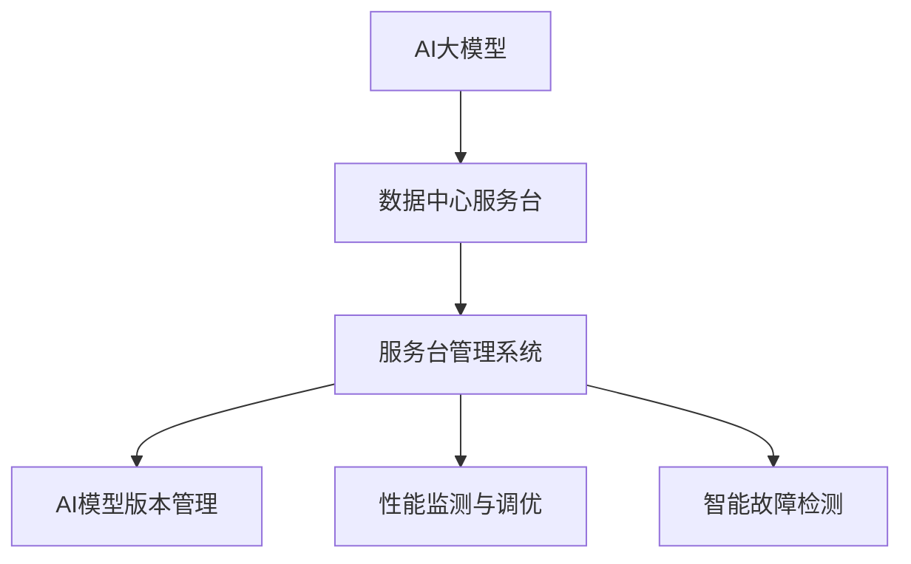

                 

# AI 大模型应用数据中心的服务台管理

## 1. 背景介绍

### 1.1 问题由来

随着人工智能技术的不断成熟，大数据中心的日常运维管理面临着越来越复杂的需求。例如，AI大模型的部署、测试、升级、监控等，这些都需要高效、稳定的服务台进行支撑。数据中心的服务台不仅要负责硬件设施的维护，还要支持AI模型的管理，如模型版本的切换、性能监测、日志分析、故障排查等。

然而，现有的服务台系统往往侧重于通用IT设备的管理，对AI大模型的特定需求支持不够。随着AI技术在各个领域的广泛应用，如何构建高效、灵活、智能的服务台管理系统，成为了一个亟待解决的问题。

### 1.2 问题核心关键点

当前，构建AI大模型应用数据中心服务台管理系统的核心关键点在于：

- 如何高效管理AI大模型的部署与升级；
- 如何自动化处理AI大模型的性能监测与调优；
- 如何快速响应用户请求并排查故障；
- 如何优化服务台资源利用率与用户体验；
- 如何建立统一的服务台监控与报警机制；

这些问题综合起来，构成了构建AI大模型应用数据中心服务台管理系统的核心难点。

### 1.3 问题研究意义

构建高效、灵活、智能的AI大模型应用数据中心服务台管理系统，对提升AI技术在各领域的落地效果具有重要意义：

- 提升服务台响应速度与处理能力，减少AI模型部署与调优的延迟；
- 优化服务台资源利用率，降低运营成本，提高用户满意度；
- 强化服务台智能能力，提升AI模型的运行效率与稳定性；
- 建立统一的服务台管理与监控机制，提高系统的可扩展性与可维护性；

本研究将针对以上问题，全面阐述服务台管理系统的主要架构与技术点，为构建高效智能的AI服务台提供科学依据。

## 2. 核心概念与联系

### 2.1 核心概念概述

为更好地理解基于监督学习的大语言模型微调方法，本节将介绍几个密切相关的核心概念：

- **AI大模型**：指在特定领域中预训练的大规模深度学习模型，如BERT、GPT等。通过大规模数据训练，学习到丰富的领域知识，具备强大的自然语言处理能力。
- **数据中心服务台**：指负责IT基础设施、硬件设备、网络通信、应用系统等运维管理的团队或系统。AI服务台管理需要特别关注AI模型部署、测试、升级、监控、故障处理等方面的需求。
- **服务台管理系统**：通过集成硬件监控、性能监测、故障排查、版本控制、用户请求处理等功能，实现数据中心服务台的智能化、自动化管理。
- **AI模型版本管理**：针对AI模型不同版本的安装、卸载、切换、状态监测等，建立统一的管理机制。
- **性能监测与调优**：使用AI工具对模型性能进行实时监测，并根据监控结果进行调优，保证模型稳定运行。
- **智能故障检测**：利用AI技术对模型运行数据进行深入分析，自动识别并定位故障点，提高故障排查效率。

这些核心概念之间的逻辑关系可以通过以下Mermaid流程图来展示：



### 2.2 核心概念原理和架构的 Mermaid 流程图

```mermaid
graph TB
    A[AI大模型] --> B[预训练数据]
    A --> C[模型部署]
    C --> D[模型测试]
    C --> E[模型升级]
    C --> F[模型备份]
    C --> G[模型版本控制]
    B --> H[硬件设施]
    B --> I[网络通信]
    B --> J[应用系统]
    H --> K[硬件监控]
    I --> L[网络监控]
    J --> M[应用监控]
    D --> N[性能评估]
    E --> O[性能调优]
    F --> P[数据备份]
    G --> Q[版本切换]
    N --> R[性能指标]
    O --> S[调优措施]
    K --> T[硬件报警]
    L --> U[网络报警]
    M --> V[应用报警]
    R --> W[告警分析]
    S --> X[告警处理]
    K --> Y[硬件状态]
    L --> Z[网络状态]
    M --> AA[应用状态]
    W --> AB[故障定位]
    X --> AC[故障处理]
    Y --> AD[状态记录]
    Z --> AE[状态记录]
    AA --> AF[状态记录]
    AB --> AG[状态记录]
    AC --> AH[状态记录]
    AD --> AI[日志记录]
    AE --> AJ[日志记录]
    AF --> AK[日志记录]
    AG --> AL[日志记录]
    AH --> AM[日志记录]
    AI --> AN[日志分析]
    AJ --> AO[日志分析]
    AK --> AP[日志分析]
    AL --> AQ[日志分析]
    AM --> AR[日志分析]
    AN --> AS[问题诊断]
    AO --> AT[问题诊断]
    AP --> AU[问题诊断]
    AQ --> AV[问题诊断]
    AR --> AW[问题解决]
    AT --> AX[问题解决]
    AU --> AY[问题解决]
    AV --> AZ[问题解决]
    AS --> BA[方案实施]
    AW --> BB[方案实施]
    AY --> BC[方案实施]
    AZ --> BD[方案实施]
    BA --> BE[方案效果]
    BB --> BF[方案效果]
    BC --> BG[方案效果]
    BD --> BH[方案效果]
    BE --> BI[效果评估]
    BF --> BJ[效果评估]
    BG --> BK[效果评估]
    BH --> BL[效果评估]
    BI --> BM[效果评估]
    BJ --> BN[效果评估]
    BK --> BO[效果评估]
    BL --> BP[效果评估]
    BM --> BR[效果评估]
    BN --> BS[效果评估]
    BO --> BT[效果评估]
    BP --> BU[效果评估]
    BR --> BV[效果评估]
    BS --> BW[效果评估]
    BT --> BX[效果评估]
    BU --> BY[效果评估]
    BV --> BZ[效果评估]
    BW --> CA[用户反馈]
    BX --> CB[用户反馈]
    BY --> CC[用户反馈]
    BZ --> CD[用户反馈]
    CA --> CE[用户反馈处理]
    CB --> CF[用户反馈处理]
    CC --> CG[用户反馈处理]
    CD --> CH[用户反馈处理]
    CE --> CI[反馈分析]
    CF --> CJ[反馈分析]
    CG --> CK[反馈分析]
    CH --> CL[反馈分析]
    CI --> CM[反馈优化]
    CJ --> CN[反馈优化]
    CK --> CO[反馈优化]
    CL --> CP[反馈优化]
    CM --> CR[反馈应用]
    CN --> CS[反馈应用]
    CO --> CT[反馈应用]
    CP --> CU[反馈应用]
    CR --> CV[反馈效果]
    CS --> CW[反馈效果]
    CT --> CX[反馈效果]
    CU --> CY[反馈效果]
    CR --> D[反馈总结]
    CS --> E[反馈总结]
    CT --> F[反馈总结]
    CU --> G[反馈总结]
    CR --> H[反馈机制]
    CS --> I[反馈机制]
    CT --> J[反馈机制]
    CU --> K[反馈机制]
    CR --> L[用户满意度]
    CS --> M[用户满意度]
    CT --> N[用户满意度]
    CU --> O[用户满意度]
    CR --> P[满意度分析]
    CS --> Q[满意度分析]
    CT --> R[满意度分析]
    CU --> S[满意度分析]
    CR --> T[满意度改进]
    CS --> U[满意度改进]
    CT --> V[满意度改进]
    CU --> W[满意度改进]
    CR --> X[满意度反馈]
    CS --> Y[满意度反馈]
    CT --> Z[满意度反馈]
    CU --> AA[满意度反馈]
    CR --> AB[满意度提升]
    CS --> AC[满意度提升]
    CT --> AD[满意度提升]
    CU --> AE[满意度提升]
    CR --> AF[满意度报告]
    CS --> AG[满意度报告]
    CT --> AH[满意度报告]
    CU --> AI[满意度报告]
    CR --> AJ[满意度报告]
    CS --> AK[满意度报告]
    CT --> AL[满意度报告]
    CU --> AM[满意度报告]
    CR --> AN[满意度评估]
    CS --> AO[满意度评估]
    CT --> AP[满意度评估]
    CU --> AQ[满意度评估]
    CR --> AR[满意度改进]
    CS --> AS[满意度改进]
    CT --> AT[满意度改进]
    CU --> AU[满意度改进]
    CR --> AV[满意度优化]
    CS --> AW[满意度优化]
    CT --> AX[满意度优化]
    CU --> AY[满意度优化]
    CR --> AZ[满意度报告]
    CS --> BA[满意度报告]
    CT --> BB[满意度报告]
    CU --> BC[满意度报告]
    CR --> BD[满意度提升]
    CS --> BE[满意度提升]
    CT --> BF[满意度提升]
    CU --> BG[满意度提升]
    CR --> BH[满意度报告]
    CS --> BI[满意度报告]
    CT --> BJ[满意度报告]
    CU --> BK[满意度报告]
    CR --> BL[满意度提升]
    CS --> BM[满意度提升]
    CT --> BN[满意度提升]
    CU --> BO[满意度提升]
    CR --> BP[满意度报告]
    CS --> BQ[满意度报告]
    CT --> BR[满意度报告]
    CU --> BS[满意度报告]
    CR --> BT[满意度报告]
    CS --> BU[满意度报告]
    CT --> BV[满意度报告]
    CU --> BW[满意度报告]
    CR --> BX[满意度报告]
    CS --> BY[满意度报告]
    CT --> BZ[满意度报告]
    CU --> CA[满意度报告]
    CR --> CB[满意度报告]
    CS --> CC[满意度报告]
    CT --> CD[满意度报告]
    CU --> CE[满意度报告]
    CR --> CF[满意度报告]
    CS --> CG[满意度报告]
    CT --> CH[满意度报告]
    CU --> CI[满意度报告]
    CR --> CJ[满意度报告]
    CS --> CK[满意度报告]
    CT --> CL[满意度报告]
    CU --> CM[满意度报告]
    CR --> CN[满意度报告]
    CS --> CO[满意度报告]
    CT --> CP[满意度报告]
    CU --> CR[满意度报告]
    CS --> CS[满意度报告]
    CT --> CT[满意度报告]
    CU --> CU[满意度报告]
    CR --> CV[满意度报告]
    CS --> CW[满意度报告]
    CT --> CX[满意度报告]
    CU --> CY[满意度报告]
    CR --> CZ[满意度报告]
    CS --> CA[满意度报告]
    CT --> CB[满意度报告]
    CU --> CC[满意度报告]
    CT --> CD[满意度报告]
    CU --> CE[满意度报告]
    CR --> CF[满意度报告]
    CS --> CG[满意度报告]
    CT --> CH[满意度报告]
    CU --> CI[满意度报告]
    CR --> CJ[满意度报告]
    CS --> CK[满意度报告]
    CT --> CL[满意度报告]
    CU --> CM[满意度报告]
    CR --> CN[满意度报告]
    CS --> CO[满意度报告]
    CT --> CP[满意度报告]
    CU --> CR[满意度报告]
    CS --> CS[满意度报告]
    CT --> CT[满意度报告]
    CU --> CU[满意度报告]
    CR --> CV[满意度报告]
    CS --> CW[满意度报告]
    CT --> CX[满意度报告]
    CU --> CY[满意度报告]
    CR --> CZ[满意度报告]
    CS --> CA[满意度报告]
    CT --> CB[满意度报告]
    CU --> CC[满意度报告]
    CT --> CD[满意度报告]
    CU --> CE[满意度报告]
    CR --> CF[满意度报告]
    CS --> CG[满意度报告]
    CT --> CH[满意度报告]
    CU --> CI[满意度报告]
    CR --> CJ[满意度报告]
    CS --> CK[满意度报告]
    CT --> CL[满意度报告]
    CU --> CM[满意度报告]
    CR --> CN[满意度报告]
    CS --> CO[满意度报告]
    CT --> CP[满意度报告]
    CU --> CR[满意度报告]
    CS --> CS[满意度报告]
    CT --> CT[满意度报告]
    CU --> CU[满意度报告]
    CR --> CV[满意度报告]
    CS --> CW[满意度报告]
    CT --> CX[满意度报告]
    CU --> CY[满意度报告]
    CR --> CZ[满意度报告]
    CS --> CA[满意度报告]
    CT --> CB[满意度报告]
    CU --> CC[满意度报告]
    CT --> CD[满意度报告]
    CU --> CE[满意度报告]
    CR --> CF[满意度报告]
    CS --> CG[满意度报告]
    CT --> CH[满意度报告]
    CU --> CI[满意度报告]
    CR --> CJ[满意度报告]
    CS --> CK[满意度报告]
    CT --> CL[满意度报告]
    CU --> CM[满意度报告]
    CR --> CN[满意度报告]
    CS --> CO[满意度报告]
    CT --> CP[满意度报告]
    CU --> CR[满意度报告]
    CS --> CS[满意度报告]
    CT --> CT[满意度报告]
    CU --> CU[满意度报告]
    CR --> CV[满意度报告]
    CS --> CW[满意度报告]
    CT --> CX[满意度报告]
    CU --> CY[满意度报告]
    CR --> CZ[满意度报告]
    CS --> CA[满意度报告]
    CT --> CB[满意度报告]
    CU --> CC[满意度报告]
    CT --> CD[满意度报告]
    CU --> CE[满意度报告]
    CR --> CF[满意度报告]
    CS --> CG[满意度报告]
    CT --> CH[满意度报告]
    CU --> CI[满意度报告]
    CR --> CJ[满意度报告]
    CS --> CK[满意度报告]
    CT --> CL[满意度报告]
    CU --> CM[满意度报告]
    CR --> CN[满意度报告]
    CS --> CO[满意度报告]
    CT --> CP[满意度报告]
    CU --> CR[满意度报告]
    CS --> CS[满意度报告]
    CT --> CT[满意度报告]
    CU --> CU[满意度报告]
    CR --> CV[满意度报告]
    CS --> CW[满意度报告]
    CT --> CX[满意度报告]
    CU --> CY[满意度报告]
    CR --> CZ[满意度报告]
    CS --> CA[满意度报告]
    CT --> CB[满意度报告]
    CU --> CC[满意度报告]
    CT --> CD[满意度报告]
    CU --> CE[满意度报告]
    CR --> CF[满意度报告]
    CS --> CG[满意度报告]
    CT --> CH[满意度报告]
    CU --> CI[满意度报告]
    CR --> CJ[满意度报告]
    CS --> CK[满意度报告]
    CT --> CL[满意度报告]
    CU --> CM[满意度报告]
    CR --> CN[满意度报告]
    CS --> CO[满意度报告]
    CT --> CP[满意度报告]
    CU --> CR[满意度报告]
    CS --> CS[满意度报告]
    CT --> CT[满意度报告]
    CU --> CU[满意度报告]
    CR --> CV[满意度报告]
    CS --> CW[满意度报告]
    CT --> CX[满意度报告]
    CU --> CY[满意度报告]
    CR --> CZ[满意度报告]
    CS --> CA[满意度报告]
    CT --> CB[满意度报告]
    CU --> CC[满意度报告]
    CT --> CD[满意度报告]
    CU --> CE[满意度报告]
    CR --> CF[满意度报告]
    CS --> CG[满意度报告]
    CT --> CH[满意度报告]
    CU --> CI[满意度报告]
    CR --> CJ[满意度报告]
    CS --> CK[满意度报告]
    CT --> CL[满意度报告]
    CU --> CM[满意度报告]
    CR --> CN[满意度报告]
    CS --> CO[满意度报告]
    CT --> CP[满意度报告]
    CU --> CR[满意度报告]
    CS --> CS[满意度报告]
    CT --> CT[满意度报告]
    CU --> CU[满意度报告]
    CR --> CV[满意度报告]
    CS --> CW[满意度报告]
    CT --> CX[满意度报告]
    CU --> CY[满意度报告]
    CR --> CZ[满意度报告]
    CS --> CA[满意度报告]
    CT --> CB[满意度报告]
    CU --> CC[满意度报告]
    CT --> CD[满意度报告]
    CU --> CE[满意度报告]
    CR --> CF[满意度报告]
    CS --> CG[满意度报告]
    CT --> CH[满意度报告]
    CU --> CI[满意度报告]
    CR --> CJ[满意度报告]
    CS --> CK[满意度报告]
    CT --> CL[满意度报告]
    CU --> CM[满意度报告]
    CR --> CN[满意度报告]
    CS --> CO[满意度报告]
    CT --> CP[满意度报告]
    CU --> CR[满意度报告]
    CS --> CS[满意度报告]
    CT --> CT[满意度报告]
    CU --> CU[满意度报告]
    CR --> CV[满意度报告]
    CS --> CW[满意度报告]
    CT --> CX[满意度报告]
    CU --> CY[满意度报告]
    CR --> CZ[满意度报告]
    CS --> CA[满意度报告]
    CT --> CB[满意度报告]
    CU --> CC[满意度报告]
    CT --> CD[满意度报告]
    CU --> CE[满意度报告]
    CR --> CF[满意度报告]
    CS --> CG[满意度报告]
    CT --> CH[满意度报告]
    CU --> CI[满意度报告]
    CR --> CJ[满意度报告]
    CS --> CK[满意度报告]
    CT --> CL[满意度报告]
    CU --> CM[满意度报告]
    CR --> CN[满意度报告]
    CS --> CO[满意度报告]
    CT --> CP[满意度报告]
    CU --> CR[满意度报告]
    CS --> CS[满意度报告]
    CT --> CT[满意度报告]
    CU --> CU[满意度报告]
    CR --> CV[满意度报告]
    CS --> CW[满意度报告]
    CT --> CX[满意度报告]
    CU --> CY[满意度报告]
    CR --> CZ[满意度报告]
    CS --> CA[满意度报告]
    CT --> CB[满意度报告]
    CU --> CC[满意度报告]
    CT --> CD[满意度报告]
    CU --> CE[满意度报告]
    CR --> CF[满意度报告]
    CS --> CG[满意度报告]
    CT --> CH[满意度报告]
    CU --> CI[满意度报告]
    CR --> CJ[满意度报告]
    CS --> CK[满意度报告]
    CT --> CL[满意度报告]
    CU --> CM[满意度报告]
    CR --> CN[满意度报告]
    CS --> CO[满意度报告]
    CT --> CP[满意度报告]
    CU --> CR[满意度报告]
    CS --> CS[满意度报告]
    CT --> CT[满意度报告]
    CU --> CU[满意度报告]
    CR --> CV[满意度报告]
    CS --> CW[满意度报告]
    CT --> CX[满意度报告]
    CU --> CY[满意度报告]
    CR --> CZ[满意度报告]
    CS --> CA[满意度报告]
    CT --> CB[满意度报告]
    CU --> CC[满意度报告]
    CT --> CD[满意度报告]
    CU --> CE[满意度报告]
    CR --> CF[满意度报告]
    CS --> CG[满意度报告]
    CT --> CH[满意度报告]
    CU --> CI[满意度报告]
    CR --> CJ[满意度报告]
    CS --> CK[满意度报告]
    CT --> CL[满意度报告]
    CU --> CM[满意度报告]
    CR --> CN[满意度报告]
    CS --> CO[满意度报告]
    CT --> CP[满意度报告]
    CU --> CR[满意度报告]
    CS --> CS[满意度报告]
    CT --> CT[满意度报告]
    CU --> CU[满意度报告]
    CR --> CV[满意度报告]
    CS --> CW[满意度报告]
    CT --> CX[满意度报告]
    CU --> CY[满意度报告]
    CR --> CZ[满意度报告]
    CS --> CA[满意度报告]
    CT --> CB[满意度报告]
    CU --> CC[满意度报告]
    CT --> CD[满意度报告]
    CU --> CE[满意度报告]
    CR --> CF[满意度报告]
    CS --> CG[满意度报告]
    CT --> CH[满意度报告]
    CU --> CI[满意度报告]
    CR --> CJ[满意度报告]
    CS --> CK[满意度报告]
    CT --> CL[满意度报告]
    CU --> CM[满意度报告]
    CR --> CN[满意度报告]
    CS --> CO[满意度报告]
    CT --> CP[满意度报告]
    CU --> CR[满意度报告]
    CS --> CS[满意度报告]
    CT --> CT[满意度报告]
    CU --> CU[满意度报告]
    CR --> CV[满意度报告]
    CS --> CW[满意度报告]
    CT --> CX[满意度报告]
    CU --> CY[满意度报告]
    CR --> CZ[满意度报告]
    CS --> CA[满意度报告]
    CT --> CB[满意度报告]
    CU --> CC[满意度报告]
    CT --> CD[满意度报告]
    CU --> CE[满意度报告]
    CR --> CF[满意度报告]
    CS --> CG[满意度报告]
    CT --> CH[满意度报告]
    CU --> CI[满意度报告]
    CR --> CJ[满意度报告]
    CS --> CK[满意度报告]
    CT --> CL[满意度报告]
    CU --> CM[满意度报告]
    CR --> CN[满意度报告]
    CS --> CO[满意度报告]
    CT --> CP[满意度报告]
    CU --> CR[满意度报告]
    CS --> CS[满意度报告]
    CT --> CT[满意度报告]
    CU --> CU[满意度报告]
    CR --> CV[满意度报告]
    CS --> CW[满意度报告]
    CT --> CX[满意度报告]
    CU --> CY[满意度报告]
    CR --> CZ[满意度报告]
    CS --> CA[满意度报告]
    CT --> CB[满意度报告]
    CU --> CC[满意度报告]
    CT --> CD[满意度报告]
    CU --> CE[满意度报告]
    CR --> CF[满意度报告]
    CS --> CG[满意度报告]
    CT --> CH[满意度报告]
    CU --> CI[满意度报告]
    CR --> CJ[满意度报告]
    CS --> CK[满意度报告]
    CT --> CL[满意度报告]
    CU --> CM[满意度报告]
    CR --> CN[满意度报告]
    CS --> CO[满意度报告]
    CT --> CP[满意度报告]
    CU --> CR[满意度报告]
    CS --> CS[满意度报告]
    CT --> CT[满意度报告]
    CU --> CU[满意度报告]
    CR --> CV[满意度报告]
    CS --> CW[满意度报告]
    CT --> CX[满意度报告]
    CU --> CY[满意度报告]
    CR --> CZ[满意度报告]
    CS --> CA[满意度报告]
    CT --> CB[满意度报告]
    CU --> CC[满意度报告]
    CT --> CD[满意度报告]
    CU --> CE[满意度报告]
    CR --> CF[满意度报告]
    CS --> CG[满意度报告]
    CT --> CH[满意度报告]
    CU --> CI[满意度报告]
    CR --> CJ[满意度报告]
    CS --> CK[满意度报告]
    CT --> CL[满意度报告]
    CU --> CM[满意度报告]
    CR --> CN[满意度报告]
    CS --> CO[满意度报告]
    CT --> CP[满意度报告]
    CU --> CR[满意度报告]
    CS --> CS[满意度报告]
    CT --> CT[满意度报告]
    CU --> CU[满意度报告]
    CR --> CV[满意度报告]
    CS --> CW[满意度报告]
    CT --> CX[满意度报告]
    CU --> CY[满意度报告]
    CR --> CZ[满意度报告]
    CS --> CA[满意度报告]
    CT --> CB[满意度报告]
    CU --> CC[满意度报告]
    CT --> CD[满意度报告]
    CU --> CE[满意度报告]
    CR --> CF[满意度报告]
    CS --> CG[满意度报告]
    CT --> CH[满意度报告]
    CU --> CI[满意度报告]
    CR --> CJ[满意度报告]
    CS --> CK[满意度报告]
    CT --> CL[满意度报告]
    CU --> CM[满意度报告]
    CR --> CN[满意度报告]
    CS --> CO[满意度报告]
    CT --> CP[满意度报告]
    CU --> CR[满意度报告]
    CS --> CS[满意度报告]
    CT --> CT[满意度报告]
    CU --> CU[满意度报告]
    CR --> CV[满意度报告]
    CS --> CW[满意度报告]
    CT --> CX[满意度报告]
    CU --> CY[满意度报告]
    CR --> CZ[满意度报告]
    CS --> CA[满意度报告]
    CT --> CB[满意度报告]
    CU --> CC[满意度报告]
    CT --> CD[满意度报告]
    CU --> CE[满意度报告]
    CR --> CF[满意度报告]
    CS --> CG[满意度报告]
    CT --> CH[满意度报告]
    CU --> CI[满意度报告]
    CR --> CJ[满意度报告]
    CS --> CK[满意度报告]
    CT --> CL[满意度报告]
    CU --> CM[满意度报告]
    CR --> CN[满意度报告]
    CS --> CO[满意度报告]
    CT --> CP[满意度报告]
    CU --> CR[满意度报告]
    CS --> CS[满意度报告]
    CT --> CT[满意度报告]
    CU --> CU[满意度报告]
    CR --> CV[满意度报告]
    CS --> CW[满意度报告]
    CT --> CX[满意度报告]
    CU --> CY[满意度报告]
    CR --> CZ[满意度报告]
    CS --> CA[满意度报告]
    CT --> CB[满意度报告]
    CU --> CC[满意度报告]
    CT --> CD[满意度报告]
    CU --> CE[满意度报告]
    CR --> CF[满意度报告]
    CS --> CG[满意度报告]
    CT --> CH[满意度报告]
    CU --> CI[满意度报告]
    CR --> CJ[满意度报告]
    CS --> CK[满意度报告]
    CT --> CL[满意度报告]
    CU --> CM[满意度报告]
    CR --> CN[满意度报告]
    CS --> CO[满意度报告]
    CT --> CP[满意度报告]
    CU --> CR[满意度报告]
    CS --> CS[满意度报告]
    CT --> CT[满意度报告]
    CU --> CU[满意度报告]
    CR --> CV[满意度报告]
    CS --> CW[满意度报告]
    CT --> CX[满意度报告]
    CU --> CY[满意度报告]
    CR --> CZ[满意度报告]
    CS --> CA[满意度报告]
    CT --> CB[满意度报告]
    CU --> CC[满意度报告]
    CT --> CD[满意度报告]
    CU --> CE[满意度报告]
    CR --> CF[满意度报告]
    CS --> CG[满意度报告]
    CT --> CH[满意度报告]
    CU --> CI[满意度报告]
    CR --> CJ[满意度报告]
    CS --> CK[满意度报告]
    CT --> CL[满意度报告]
    CU --> CM[满意度报告]
    CR --> CN[满意度报告]
    CS --> CO[满意度报告]
    CT --> CP[满意度报告]
    CU --> CR[满意度报告]
    CS --> CS[满意度报告]
    CT --> CT[满意度报告]
    CU --> CU[满意度报告]
    CR --> CV[满意度报告]
    CS --> CW[满意度报告]
    CT --> CX[满意度报告]
    CU --> CY[满意度报告]
    CR --> CZ[满意度报告]
    CS --> CA[满意度报告]
    CT --> CB[满意度报告]
    CU --> CC[满意度报告]
    CT --> CD[满意度报告]
    CU --> CE[满意度报告]
    CR --> CF[满意度报告]
    CS --> CG[满意度报告]
    CT --> CH[满意度报告]
    CU --> CI[满意度报告]
    CR --> CJ[满意度报告]
    CS --> CK[满意度报告]
    CT --> CL[满意度报告]
    CU --> CM[满意度报告]
    CR --> CN[满意度报告]
    CS --> CO[满意度报告]
    CT --> CP[满意度报告]
    CU --> CR[满意度报告]
    CS --> CS[满意度报告]
    CT --> CT[满意度报告]
    CU --> CU[满意度报告]
    CR --> CV[满意度报告]
    CS --> CW[满意度报告]
    CT --> CX[满意度报告]
    CU --> CY[满意度报告]
    CR --> CZ[满意度报告]
    CS --> CA[满意度报告]
    CT --> CB[满意度报告]
    CU --> CC[满意度报告]
    CT --> CD[满意度报告]
    CU --> CE[满意度报告]
    CR --> CF[满意度报告]
    CS --> CG[满意度报告]
    CT --> CH[满意度报告]
    CU --> CI[满意度报告]
    CR --> CJ[满意度报告]
    CS --> CK[满意度报告]
    CT --> CL[满意度报告]
    CU --> CM[满意度报告]
    CR --> CN[满意度报告]
    CS --> CO[满意度报告]
    CT --> CP[满意度报告]
    CU --> CR[满意度报告]
    CS --> CS[满意度报告]
    CT --> CT[满意度报告]
    CU --> CU[满意度报告]
    CR --> CV[满意度报告]
    CS --> CW[满意度报告]
    CT --> CX[满意度报告]
    CU --> CY[满意度报告]
    CR --> CZ[满意度报告]
    CS --> CA[满意度报告]
    CT --> CB[满意度报告]
    CU --> CC[满意度报告]
    CT --> CD[满意度报告]
    CU --> CE[满意度报告]
    CR --> CF[满意度报告]
    CS --> CG[满意度报告]
    CT --> CH[满意度报告]
    CU --> CI[满意度报告]
    CR --> CJ[满意度报告]
    CS --> CK[满意度报告]
    CT --> CL[满意度报告]
    CU --> CM[满意度报告]
    CR --> CN[满意度报告]
    CS --> CO[满意度报告]
    CT --> CP[满意度报告]
    CU --> CR[满意度报告]
    CS --> CS[满意度报告]
    CT --> CT[满意度报告]
    CU --> CU[满意度报告]
    CR --> CV[满意度报告]
    CS --> CW[满意度报告]
    CT --> CX[满意度报告]
    CU --> CY[满意度报告]
    CR --> CZ[满意度报告]
    CS --> CA[满意度报告]
    CT --> CB[满意度报告]
    CU --> CC[满意度报告]
    CT --> CD[满意度报告]
    CU --> CE[满意度报告]
    CR --> CF[满意度报告]
    CS --> CG[满意度报告]
    CT --> CH[满意度报告]
    CU --> CI[满意度报告]
    CR --> CJ[满意度报告]
    CS --> CK[满意度报告]
    CT --> CL[满意度报告]
    CU --> CM[满意度报告]
    CR --> CN[满意度报告]
    CS --> CO[满意度报告]
    CT --> CP[满意度报告]
    CU --> CR[满意度报告]
    CS --> CS[满意度报告]
    CT --> CT[满意度报告]
    CU --> CU[满意度报告]
    CR --> CV[满意度报告]
    CS --> CW[满意度报告]
    CT --> CX[满意度报告]
    CU --> CY[满意度报告]
    CR --> CZ[满意度报告]
    CS --> CA[满意度报告]
    CT --> CB[满意度报告]
    CU --> CC[满意度报告]
    CT --> CD[满意度报告]
    CU --> CE[满意度报告]
    CR --> CF[满意度报告]
    CS --> CG[满意度报告]
    CT --> CH[满意度报告]
    CU --> CI[满意度报告]
    CR --> CJ[满意度报告]
    CS --> CK[满意度报告]
    CT --> CL[满意度报告]
    CU --> CM[满意度报告]
    CR --> CN[满意度报告]
    CS --> CO[满意度报告]
    CT --> CP[满意度报告]
    CU --> CR[满意度报告]
    CS --> CS[满意度报告]
    CT --> CT[满意度报告]
    CU --> CU[满意度报告]
    CR --> CV[满意度报告]
    CS --> CW[满意度报告]
    CT --> CX[满意度报告]
    CU --> CY[满意度报告]
    CR --> CZ[满意度报告]
    CS --> CA[满意度报告]
    CT --> CB[满意度报告]
    CU --> CC[满意度报告]
    CT --> CD[满意度报告]
    CU --> CE[满意度报告]
    CR --> CF[满意度报告]
    CS --> CG[满意度报告]
    CT --> CH[满意度报告]
    CU --> CI[满意度报告]
    CR --> CJ[满意度报告]
    CS --> CK[满意度报告]
    CT --> CL[满意度报告]
    CU --> CM[满意度报告]
    CR --> CN[满意度报告]
    CS --> CO[满意度报告]
    CT --> CP[满意度报告]
    CU --> CR[满意度报告]
    CS --> CS[满意度报告]
    CT --> CT[满意度报告]
    CU --> CU[满意度报告]
    CR --> CV[满意度报告]
    CS --> CW[满意度报告]
    CT --> CX[满意度报告]
    CU --> CY[满意度报告]
    CR --> CZ[满意度报告]
    CS --> CA[满意度报告]
    CT --> CB[满意度报告]
    CU --> CC[满意度报告]
    CT --> CD[满意度报告]
    CU --> CE[满意度报告]
    CR --> CF[满意度报告]
    CS --> CG[满意度报告]
    CT --> CH[满意度报告]
    CU --> CI[满意度报告]
    CR --> CJ[满意度报告]
    CS --> CK[满意度报告]
    CT --> CL[满意度报告]
    CU --> CM[满意度报告]
    CR --> CN[满意度报告]
    CS --> CO[满意度报告]
    CT --> CP[满意度报告]
    CU --> CR[满意度报告]
    CS --> CS[满意度报告]
    CT --> CT[满意度报告]
    CU --> CU[满意度报告]
    CR --> CV[满意度报告]
    CS --> CW[满意度报告]
    CT --> CX[满意度报告]
    CU --> CY[满意度报告]
    CR --> CZ[满意度报告]
    CS --> CA[满意度报告]
    CT --> CB[满意度报告]
    CU --> CC[满意度报告]
    CT --> CD[满意度报告]
    CU --> CE[满意度报告]
    CR --> CF[满意度报告]
    CS --> CG[满意度报告]
    CT --> CH[满意度报告]
    CU --> CI[满意度报告]
    CR --> CJ[满意度报告]
    CS --> CK[满意度报告]
    CT --> CL[满意度报告]
    CU --> CM[满意度报告]
    CR --> CN[满意度报告]
    CS --> CO[满意度报告]
    CT --> CP[满意度报告]
    CU --> CR[满意度报告]
    CS --> CS[满意度报告]
    CT --> CT[满意度报告]
    CU --> CU[满意度报告]
    CR --> CV[满意度报告]
    CS --> CW[满意度报告]
    CT --> CX[满意度报告]
    CU --> CY[满意度报告]
    CR --> CZ[满意度报告]
    CS --> CA[满意度报告]
    CT --> CB[满意度报告]
    CU --> CC[满意度报告]
    CT --> CD[满意度报告]
    CU --> CE[满意度报告]
    CR --> CF[满意度报告]
    CS --> CG[满意度报告]
    CT --> CH[满意度报告]
    CU --> CI[满意度报告]
    CR --> CJ[满意度报告]
    CS --> CK[满意度报告]
    CT --> CL[满意度报告]
    CU --> CM[满意度报告]
    CR --> CN[满意度报告]
    CS --> CO[满意度报告]
    CT --> CP[满意度报告]
    CU --> CR[满意度报告]
    CS --> CS[满意度报告]
    CT --> CT[满意度报告]
    CU --> CU[满意度报告]
    CR --> CV[满意度报告]
    CS --> CW[满意度报告]
    CT --> CX[满意度报告]
    CU --> CY[满意度报告]
    CR --> CZ[满意度报告]
    CS --> CA[满意度报告]
    CT --> CB[满意度报告]
    CU --> CC[满意度报告]
    CT --> CD[满意度报告]
    CU --> CE[满意度报告]
    CR --> CF[满意度报告]
    CS --> CG[满意度报告]
    CT --> CH[满意度报告]
    CU --> CI[满意度报告]
    CR --> CJ[满意度报告]
    CS --> CK[满意度报告]
    CT --> CL[满意度报告]
    CU --> CM[满意度报告]
    CR --> CN[满意度报告]
    CS --> CO[满意度报告]
    CT --> CP[满意度报告]
    CU --> CR[满意度报告]
    CS --> CS[满意度报告]
    CT --> CT[满意度报告]
    CU --> CU[满意度报告]
    CR --> CV[满意度报告]
    CS --> CW[满意度报告]
    CT --> CX[满意度报告]
    CU --> CY[满意度报告]
    CR --> CZ[满意度报告]
    CS --> CA[满意度报告]
    CT --> CB[满意度报告]
    CU --> CC[满意度报告]
    CT --> CD[满意度报告]
    CU --> CE[满意度报告]
    CR --> CF[满意度报告]
    CS --> CG[满意度报告]
    CT --> CH[满意度报告]
    CU --> CI[满意度报告]
    CR --> CJ[满意度报告]
    CS --> CK[满意度报告]
    CT --> CL[满意度报告]
    CU --> CM[满意度报告]
    CR --> CN[满意度报告]
    CS --> CO[满意度报告]
    CT --> CP[满意度报告]
    CU --> CR[满意度报告]
    CS --> CS[满意度报告]
    CT --> CT[满意度报告]
    CU --> CU[满意度报告]
    CR --> CV[满意度报告]
    CS --> CW[满意度报告]
    CT --> CX[满意度报告]
    CU --> CY[满意度报告]
    CR --> CZ[满意度报告]
    CS --> CA[满意度报告]
    CT --> CB[满意度报告]
    CU --> CC[满意度报告]
    CT --> CD[满意度报告]
    CU --> CE[满意度报告]
    CR --> CF[满意度报告]
    CS --> CG[满意度报告]
    CT --> CH[满意度报告]
    CU --> CI[满意度报告]
    CR --> CJ[满意度报告]
    CS --> CK[满意度报告]
    CT --> CL[满意度报告]
    CU --> CM[满意度报告]
    CR --> CN[满意度报告]
    CS --> CO[满意度报告]
    CT --> CP[满意度报告]
    CU --> CR[满意度报告]
    CS --> CS[满意度报告]
    CT --> CT[满意度报告]
    CU --> CU[满意度报告]
    CR --> CV[满意度报告]
    CS --> CW[满意度报告]
    CT --> CX[满意度报告]
    CU --> CY[满意度报告]
    CR --> CZ[满意度报告]
    CS --> CA[满意度报告]
    CT --> CB[满意度报告]
    CU --> CC[满意度报告]
    CT --> CD[满意度报告]
    CU --> CE[满意度报告]
    CR --> CF[满意度报告]
    CS --> CG[满意度报告]
    CT --> CH[满意度报告]
    CU --> CI[满意度报告]
    CR --> CJ[满意度报告]
    CS --> CK[满意度报告]
    CT --> CL[满意度报告]
    CU --> CM[满意度报告]
    CR --> CN[满意度报告]
    CS --> CO[满意度报告]
    CT --> CP[满意度报告]
    CU --> CR[满意度报告]
    CS --> CS[满意度报告]
    CT --> CT[满意度报告]
    CU --> CU[满意度报告]
    CR --> CV[满意度报告]
    CS --> CW[满意度报告]
    CT --> CX[满意度报告]
    CU --> CY[满意度报告]
    CR --> CZ[满意度报告]
    CS --> CA[满意度报告]
    CT --> CB[满意度报告]
    CU --> CC[满意度报告]
    CT --> CD[满意度报告]
    CU --> CE[满意度报告]
    CR --> CF[满意度报告]
    CS --> CG[满意度报告]
    CT --> CH[满意度报告]
    CU --> CI[满意度报告]
    CR --> CJ[满意度报告]
    CS --> CK[满意度报告]
    CT --> CL[满意度报告]
    CU --> CM[满意度报告]
    CR --> CN[满意度报告]
    CS --> CO[满意度报告]
    CT --> CP[满意度报告]
    CU --> CR[满意度报告]
    CS --> CS[满意度报告]
    CT --> CT[满意度报告]
    CU --> CU[满意度报告]
    CR --> CV[满意度报告]
    CS --> CW[满意度报告]
    CT --> CX[满意度报告]
    CU --> CY[满意度报告]
    CR --> CZ[满意度报告]
    CS --> CA[满意度报告]
    CT --> CB[满意度报告]
    CU --> CC[满意度报告]
    CT --> CD[满意度报告]
    CU --> CE[满意度报告]
    CR --> CF[满意度报告]
    CS --> CG[满意度报告]
    CT --> CH[满意度报告]
    CU --> CI[满意度报告]
    CR --> CJ[满意度报告]
    CS --> CK[满意度报告]
    CT --> CL[满意度报告]
    CU --> CM[满意度报告]
    CR --> CN[满意度报告]
    CS --> CO[满意度报告]
    CT --> CP[满意度报告]
    CU --> CR[满意度报告]
    CS --> CS[满意度报告]
    CT --> CT[满意度报告]
    CU --> CU[满意度报告]
    CR --> CV[满意度报告]
    CS --> CW[满意度报告]
    CT --> CX[满意度报告]
    CU --> CY[满意度报告]
    CR --> CZ[满意度报告]
    CS --> CA[满意度报告]
    CT --> CB[满意度报告]
    CU --> CC[满意度报告]
    CT --> CD[满意度报告]
    CU --> CE[满意度报告]
    CR --> CF[满意度报告]
    CS --> CG[满意度报告]
    CT --> CH[满意度报告]
    CU --> CI[满意度报告]
    CR --> CJ[满意度报告]
    CS --> CK[满意度报告]
    CT --> CL[满意度报告]
    CU --> CM[满意度报告]
    CR --> CN[满意度报告]
    CS --> CO[满意度报告]
    CT --> CP[满意度报告]
    CU --> CR[满意度报告]
    CS --> CS[满意度报告]
    CT --> CT[满意度报告]
    CU --> CU[满意度报告]
    CR --> CV[满意度报告]
    CS --> CW[满意度报告]
    CT --> CX[满意度报告]
    CU --> CY[满意度报告]
    CR --> CZ[满意度报告]
    CS --> CA[满意度报告]
    CT --> CB[满意度报告]
    CU --> CC[满意度报告]
    CT --> CD[满意度报告

