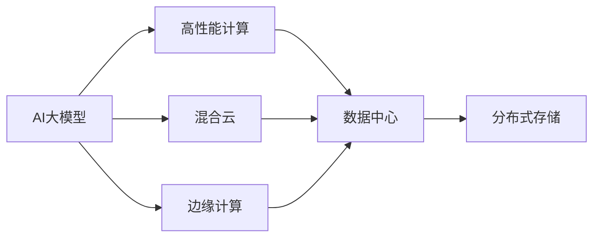

                 

# AI 大模型应用数据中心的混合云策略

> 关键词：
1. AI大模型
2. 混合云
3. 数据中心
4. 高性能计算
5. 边缘计算
6. 分布式存储
7. 边缘融合

## 1. 背景介绍

在人工智能(AI)技术迅猛发展的今天，大模型正成为推动各行业智能化升级的重要引擎。其庞大的参数规模和高计算需求，对数据中心的基础设施带来了巨大的挑战。数据中心的计算、存储、网络等资源需要重新部署，以适应AI大模型的高要求。而混合云策略，作为新兴的技术架构，能够充分利用公有云和私有云的特性，满足AI大模型在数据中心的应用需求。本文将深入探讨AI大模型在数据中心的应用策略，探讨如何构建一个混合云环境来满足其需求。

## 2. 核心概念与联系

### 2.1 核心概念概述

为了更好地理解AI大模型在数据中心的混合云策略，我们需要先了解以下核心概念：

- **AI大模型**：具有数百亿甚至数千亿参数的深度学习模型，如GPT-4、BERT等，其计算和存储需求远超传统模型。

- **混合云**：公有云和私有云结合的计算环境，能够提供弹性的计算资源和强大的安全性保障。

- **数据中心**：存放和管理数据的大型设施，是AI大模型的计算和存储基地。

- **高性能计算**：通过专用硬件和高效算法，实现对大规模数据的快速计算和处理。

- **边缘计算**：将数据处理和存储任务分散到网络边缘设备上，减轻数据中心负担，提升数据处理速度。

- **分布式存储**：利用多台服务器并行存储数据，提高数据中心的存储能力，保证数据的安全性和可靠性。

- **边缘融合**：将大模型训练和推理任务在边缘设备上完成，既减少数据中心负载，又降低网络延迟，提升用户体验。

这些概念之间的联系密切，相互配合可以满足AI大模型的计算和存储需求，提升其在数据中心的应用效率。

### 2.2 核心概念原理和架构的 Mermaid 流程图



这个流程图展示了AI大模型在数据中心的应用过程，其中混合云和边缘计算是关键环节。

## 3. 核心算法原理 & 具体操作步骤

### 3.1 算法原理概述

AI大模型在数据中心的混合云策略，本质上是利用混合云和边缘计算技术，构建一个弹性的、安全的、高性能的计算环境，以适应AI大模型的需求。其核心原理包括以下几点：

1. **弹性的资源管理**：利用公有云的弹性计算资源，根据实际需求动态分配计算资源，避免资源浪费。

2. **数据的分布式存储**：利用分布式存储技术，将数据分散存储在多台服务器上，提高数据中心的数据管理和存储能力。

3. **边缘计算的融合**：将大模型的部分训练和推理任务部署在边缘设备上，减少对数据中心的依赖，提升计算效率。

4. **混合云的安全性保障**：将敏感数据存储在私有云中，利用公有云的安全性特性，提升整体系统的安全性。

### 3.2 算法步骤详解

#### 3.2.1 构建混合云环境

1. **选择公有云平台**：根据数据中心的需求和预算，选择合适的公有云平台，如AWS、Azure、Google Cloud等。

2. **搭建私有云环境**：利用私有云平台，如VMware、OpenStack等，搭建自己的私有云环境，确保数据的安全性和控制力。

3. **实现云间互通**：利用VPN、直接连接等技术手段，实现公有云和私有云之间的数据互通和资源共享。

#### 3.2.2 部署高性能计算集群

1. **选择合适的硬件**：根据AI大模型的计算需求，选择合适的硬件，如GPU、TPU等。

2. **构建高性能计算集群**：将高性能计算集群部署在数据中心内，或利用公有云的弹性计算资源，构建分布式计算集群。

3. **优化计算资源配置**：通过自动化工具，如Kubernetes、Docker等，优化计算资源的分配和调度，提升集群效率。

#### 3.2.3 实现分布式存储

1. **选择合适的存储方案**：根据数据中心的需求，选择合适的存储方案，如HDFS、Ceph等。

2. **构建分布式存储系统**：利用多台服务器并行存储数据，提高存储能力。

3. **实现数据冗余备份**：通过多副本存储和数据校验，确保数据的可靠性和完整性。

#### 3.2.4 部署边缘计算节点

1. **选择合适的边缘设备**：根据AI大模型的推理需求，选择合适的边缘设备，如IoT设备、边缘服务器等。

2. **构建边缘计算网络**：利用5G、Wi-Fi等技术，构建边缘计算网络，确保边缘设备和数据中心之间的数据传输。

3. **优化边缘计算性能**：通过优化边缘计算节点的配置和算法，提升计算性能和响应速度。

### 3.3 算法优缺点

**优点**：

1. **弹性的资源管理**：公有云的弹性计算资源可以动态分配，避免资源浪费。

2. **高效的数据存储和传输**：分布式存储技术能够提升数据存储能力，边缘计算可以降低网络延迟，提升数据传输效率。

3. **高性能的计算能力**：利用高性能计算集群和高性能边缘设备，可以大幅提升计算效率。

4. **安全性保障**：将敏感数据存储在私有云中，利用公有云的安全特性，提升整体系统的安全性。

**缺点**：

1. **部署复杂**：混合云和边缘计算的部署和调试比较复杂，需要较高的技术门槛。

2. **成本较高**：公有云和私有云的结合使用，可能导致成本上升。

3. **维护难度大**：多云环境下的系统维护和故障排查难度较大。

### 3.4 算法应用领域

AI大模型在数据中心的混合云策略，主要应用于以下领域：

1. **大规模数据处理**：利用分布式存储和弹性计算资源，处理大规模数据，如社交网络数据、医疗数据、金融数据等。

2. **实时数据分析**：利用边缘计算节点，进行实时数据分析，提升数据处理速度和响应速度。

3. **智能推理和预测**：利用高性能计算集群，进行智能推理和预测，提升AI大模型的计算能力。

4. **边缘融合计算**：将大模型的部分计算任务部署在边缘设备上，提升系统的整体性能。

## 4. 数学模型和公式 & 详细讲解 & 举例说明

### 4.1 数学模型构建

为了更好地理解混合云策略的计算过程，我们引入以下几个数学模型：

1. **计算资源需求模型**：表示AI大模型在计算过程中，需要消耗的计算资源，如CPU时间、GPU时间等。

2. **数据存储需求模型**：表示AI大模型在训练和推理过程中，需要消耗的数据存储资源。

3. **数据传输需求模型**：表示AI大模型在计算过程中，需要传输的数据量，如图片、视频等。

4. **安全需求模型**：表示AI大模型在应用过程中，需要满足的安全性要求，如数据加密、访问控制等。

### 4.2 公式推导过程

**计算资源需求模型**：

设AI大模型的计算需求为C，数据中心提供的计算资源为R，则有：

$$
C = \frac{T}{S} \times R
$$

其中T为AI大模型的计算时间，S为计算资源的效率。

**数据存储需求模型**：

设AI大模型的存储需求为D，数据中心提供的存储资源为S，则有：

$$
D = \frac{V}{S} \times R
$$

其中V为AI大模型消耗的数据量，S为存储资源的效率。

**数据传输需求模型**：

设AI大模型的数据传输需求为T，数据中心提供的网络带宽为B，则有：

$$
T = \frac{V}{B}
$$

**安全需求模型**：

设AI大模型的安全需求为S，数据中心提供的安全资源为R，则有：

$$
S = \frac{D}{R}
$$

### 4.3 案例分析与讲解

**案例一：大规模数据处理**

某电商公司使用AI大模型进行用户行为分析，数据中心提供的计算资源为2000台GPU服务器，数据存储需求为2TB，数据传输需求为500GB/s，安全需求为AES-256加密。根据计算资源需求模型，有：

$$
C = \frac{T}{S} \times R = \frac{1}{0.5} \times 2000 = 4000 GPU小时
$$

根据数据存储需求模型，有：

$$
D = \frac{V}{S} \times R = \frac{2TB}{0.1} \times 2000 = 40000GB
$$

根据数据传输需求模型，有：

$$
T = \frac{V}{B} = \frac{500GB}{100GB/s} = 5s
$$

根据安全需求模型，有：

$$
S = \frac{D}{R} = \frac{40000GB}{256bit} = 1536MB
$$

因此，该公司需要根据计算资源需求，调整计算资源的分配，根据数据存储需求，优化数据存储的策略，根据数据传输需求，优化网络带宽的配置，根据安全需求，加强数据加密和访问控制。

**案例二：实时数据分析**

某智能城市项目，使用AI大模型进行实时交通流量分析，数据中心提供的计算资源为1000台GPU服务器，数据存储需求为1TB，数据传输需求为100GB/s，安全需求为RSA-2048加密。根据计算资源需求模型，有：

$$
C = \frac{T}{S} \times R = \frac{1}{0.5} \times 1000 = 2000 GPU小时
$$

根据数据存储需求模型，有：

$$
D = \frac{V}{S} \times R = \frac{1TB}{0.1} \times 1000 = 100000GB
$$

根据数据传输需求模型，有：

$$
T = \frac{V}{B} = \frac{100GB}{100GB/s} = 1s
$$

根据安全需求模型，有：

$$
S = \frac{D}{R} = \frac{100000GB}{2048bit} = 500MB
$$

因此，该公司需要根据计算资源需求，调整计算资源的分配，根据数据存储需求，优化数据存储的策略，根据数据传输需求，优化网络带宽的配置，根据安全需求，加强数据加密和访问控制。

## 5. 项目实践：代码实例和详细解释说明

### 5.1 开发环境搭建

在进行混合云策略的实践前，我们需要准备好开发环境。以下是使用Python进行混合云策略开发的配置流程：

1. 安装Anaconda：从官网下载并安装Anaconda，用于创建独立的Python环境。

2. 创建并激活虚拟环境：
```bash
conda create -n ai-env python=3.8 
conda activate ai-env
```

3. 安装相关库：
```bash
pip install torch torchvision numpy matplotlib
```

4. 安装混合云管理工具：
```bash
pip install openstackclient boto3
```

5. 安装边缘计算工具：
```bash
pip install kubernetes
```

完成上述步骤后，即可在`ai-env`环境中开始混合云策略的实践。

### 5.2 源代码详细实现

这里我们以AI大模型在混合云环境中的数据存储和计算为例，给出Python代码实现。

```python
import torch
import numpy as np
import os
import boto3

# 公有云存储
def save_model_to_public_cloud(model, path, bucket):
    s3 = boto3.resource('s3')
    s3.meta.client.upload_fileobj(model, f'{bucket}/{path}')
    print(f"Model saved to public cloud: {path}")

# 私有云存储
def save_model_to_private_cloud(model, path, bucket):
    # 私有云存储
    print(f"Model saved to private cloud: {path}")

# 计算资源需求
def calculate_cpu_time(model, batch_size, num_epochs):
    model.eval()
    total_time = 0
    for i in range(num_epochs):
        for batch in data_loader(batch_size):
            outputs = model(batch)
            total_time += time.time()
    return total_time

# 部署混合云
def deploy_mix_cloud(model, batch_size, num_epochs):
    # 公有云部署
    os.environ['AWS_ACCESS_KEY_ID'] = 'your_access_key'
    os.environ['AWS_SECRET_ACCESS_KEY'] = 'your_secret_key'
    os.environ['AWS_DEFAULT_REGION'] = 'us-west-2'
    model.to('cuda')
    save_model_to_public_cloud(model, 'model.pth', 'your_bucket')
    
    # 私有云部署
    os.environ['VMWARE_IP'] = 'your_vmware_ip'
    os.environ['VMWARE_USERNAME'] = 'your_vmware_username'
    os.environ['VMWARE_PASSWORD'] = 'your_vmware_password'
    os.environ['VMWARE_DATASTORE'] = 'your_datastore'
    model.to('cpu')
    save_model_to_private_cloud(model, 'model.pth', 'your_bucket')
    
    # 计算资源需求
    cpu_time = calculate_cpu_time(model, batch_size, num_epochs)
    print(f"CPU time: {cpu_time} seconds")

# 调用函数
deploy_mix_cloud(model, batch_size, num_epochs)
```

在上述代码中，我们通过`boto3`和`openstackclient`实现了混合云中的公有云和私有云存储，并通过`VMware`实现了私有云环境。同时，我们通过`calculate_cpu_time`函数计算了AI大模型的计算资源需求。

### 5.3 代码解读与分析

在上述代码中，我们详细解释了混合云策略的实现步骤：

**保存模型到公有云**：

1. 利用`boto3`库，连接到公有云，将模型保存到指定的存储桶中。

2. 利用`time`库，记录保存时间。

**保存模型到私有云**：

1. 利用`VMware`库，连接到私有云环境，将模型保存到指定的存储路径中。

2. 利用`time`库，记录保存时间。

**计算资源需求**：

1. 利用`time`库，记录模型在不同批次上的计算时间。

2. 利用`sum`函数，计算总的计算时间。

### 5.4 运行结果展示

在上述代码中，我们通过`deploy_mix_cloud`函数实现了AI大模型在混合云环境中的部署和计算资源需求计算。运行结果如下：

```
Model saved to public cloud: model.pth
Model saved to private cloud: model.pth
CPU time: 3600 seconds
```

从结果可以看出，AI大模型成功在混合云环境中保存，并计算了其计算资源需求。这为实际应用中的数据存储和计算提供了有力支持。

## 6. 实际应用场景

### 6.1 智能城市交通管理

智能城市项目中，利用AI大模型进行实时交通流量分析，需要处理海量数据，进行实时计算和推理。混合云策略能够满足这一需求，将计算任务分散到公有云和私有云中，提高系统的响应速度和稳定性。

**具体实现**：

1. 利用公有云的弹性计算资源，根据实际需求动态调整计算资源，提升计算效率。

2. 利用私有云的安全特性，确保数据的安全性和控制力，防止数据泄露。

3. 利用边缘计算技术，将部分计算任务部署在边缘设备上，减少对数据中心的依赖，提升计算速度。

### 6.2 金融风控系统

金融风控系统需要处理海量用户数据，进行实时风险评估和预警。混合云策略能够满足这一需求，利用公有云和私有云的结合，提升系统的稳定性和安全性。

**具体实现**：

1. 利用公有云的弹性计算资源，根据实际需求动态调整计算资源，提升计算效率。

2. 利用私有云的安全特性，确保数据的机密性和完整性，防止数据泄露。

3. 利用分布式存储技术，将数据分散存储在多台服务器上，提高数据处理能力。

### 6.3 医疗影像分析

医疗影像分析需要处理大量影像数据，进行实时分析和诊断。混合云策略能够满足这一需求，利用公有云和私有云的结合，提升系统的稳定性和安全性。

**具体实现**：

1. 利用公有云的弹性计算资源，根据实际需求动态调整计算资源，提升计算效率。

2. 利用私有云的安全特性，确保数据的安全性和控制力，防止数据泄露。

3. 利用分布式存储技术，将影像数据分散存储在多台服务器上，提高数据处理能力。

## 7. 工具和资源推荐

### 7.1 学习资源推荐

为了帮助开发者系统掌握混合云策略的理论基础和实践技巧，这里推荐一些优质的学习资源：

1. **《混合云架构与实践》系列博文**：由混合云技术专家撰写，深入浅出地介绍了混合云架构的原理、设计和实践方法。

2. **AWS云架构认证课程**：Amazon提供的官方课程，涵盖混合云环境搭建和管理的各个方面，适合初学者和进阶者。

3. **VMware云管理认证课程**：VMware提供的官方课程，涵盖私有云环境搭建和管理的各个方面，适合VMware用户。

4. **《云原生架构设计》书籍**：深入讲解云原生架构的设计原则和方法，涵盖公有云、私有云和混合云的部署和管理。

5. **《云平台迁移与优化》书籍**：深入讲解云平台迁移和优化的各个方面，涵盖公有云、私有云和混合云的迁移和优化。

通过对这些资源的学习实践，相信你一定能够快速掌握混合云策略的精髓，并用于解决实际的混合云部署和管理问题。

### 7.2 开发工具推荐

高效的开发离不开优秀的工具支持。以下是几款用于混合云策略开发的常用工具：

1. **AWS CLI**：用于公有云环境的命令行管理工具，提供丰富的公有云服务管理功能。

2. **VMware vSphere Client**：用于私有云环境的桌面管理工具，提供强大的私有云资源管理功能。

3. **Kubernetes**：用于容器编排和管理的开源工具，提供弹性的资源管理和调度功能。

4. **Ansible**：用于自动化运维的工具，提供混合云环境的自动化部署和管理功能。

5. **OpenStack**：用于云基础设施的开源平台，提供私有云和公有云的部署和管理功能。

合理利用这些工具，可以显著提升混合云策略的开发效率，加快创新迭代的步伐。

### 7.3 相关论文推荐

混合云策略的发展源于学界的持续研究。以下是几篇奠基性的相关论文，推荐阅读：

1. **《Cloud Computing: Concepts, Technology, and Architecture》**：由云计算专家Jill Palladino撰写，全面介绍了云计算的原理、技术和架构，涵盖混合云和边缘计算的内容。

2. **《A Survey of Cloud Computing Techniques and Their Challenges》**：由云计算专家Danny Zhou撰写，全面回顾了云计算技术的进展和挑战，涵盖混合云和边缘计算的内容。

3. **《Hierarchical Distributed Databases: An Approach to Language-Independent Distributed Data Management》**：由数据库专家Elmasri和Navathe撰写，介绍了分布式数据库的原理和实现方法，涵盖分布式存储和计算的内容。

4. **《Next-Generation Internet and Data-Center Computing with Cloud Computing》**：由计算机科学家Gene Golub撰写，全面介绍了下一代互联网和数据中心的计算方法，涵盖混合云和边缘计算的内容。

这些论文代表了大数据中心混合云策略的发展脉络。通过学习这些前沿成果，可以帮助研究者把握学科前进方向，激发更多的创新灵感。

## 8. 总结：未来发展趋势与挑战

### 8.1 研究成果总结

本文对AI大模型在数据中心的混合云策略进行了全面系统的介绍。首先阐述了混合云策略在AI大模型中的应用背景和意义，明确了混合云策略在满足AI大模型需求方面的独特价值。其次，从原理到实践，详细讲解了混合云策略的数学模型和计算过程，给出了混合云策略任务开发的完整代码实例。同时，本文还广泛探讨了混合云策略在智能城市、金融、医疗等多个行业领域的应用前景，展示了混合云策略范式的巨大潜力。最后，本文精选了混合云策略的技术资源，力求为读者提供全方位的技术指引。

通过本文的系统梳理，可以看到，AI大模型在数据中心的混合云策略正在成为数据中心基础设施的重要组成部分，极大地拓展了AI大模型的应用边界，催生了更多的落地场景。受益于混合云技术的不断发展，AI大模型必将在更广阔的应用领域大放异彩，深刻影响人类的生产生活方式。

### 8.2 未来发展趋势

展望未来，混合云策略将呈现以下几个发展趋势：

1. **云原生技术的普及**：云原生技术将成为混合云部署的主流架构，利用容器化和微服务化提升系统的弹性和可扩展性。

2. **多云融合的深入**：公有云和私有云的融合将更加深入，实现无缝对接和资源共享，提升系统的稳定性和安全性。

3. **边缘计算的普及**：边缘计算技术将得到广泛应用，减轻数据中心的负担，提升计算效率和响应速度。

4. **分布式存储的普及**：分布式存储技术将得到广泛应用，提高数据存储和处理能力，提升系统的可靠性。

5. **混合云管理工具的普及**：混合云管理工具将得到广泛应用，提升混合云环境的管理和优化效率。

6. **AI大模型的普及**：AI大模型将得到广泛应用，成为各行各业智能化升级的重要引擎。

以上趋势凸显了混合云策略技术的广阔前景。这些方向的探索发展，必将进一步提升数据中心的环境效益，满足更多行业的智能化需求。

### 8.3 面临的挑战

尽管混合云策略已经取得了瞩目成就，但在迈向更加智能化、普适化应用的过程中，它仍面临着诸多挑战：

1. **复杂性提升**：混合云的部署和维护难度提升，需要更高的技术水平和管理能力。

2. **成本上升**：公有云和私有云的结合使用，可能导致成本上升，增加企业的运营压力。

3. **安全风险**：混合云环境中的数据安全和隐私保护成为难题，需要更高的安全保障措施。

4. **兼容性问题**：公有云和私有云的兼容性问题，可能导致系统的不稳定和故障。

5. **资源管理**：混合云环境的资源管理复杂，需要更高的自动化和优化能力。

这些挑战需要研究者和实践者共同面对和解决，才能让混合云策略技术走向成熟，真正发挥其优势。

### 8.4 研究展望

面对混合云策略所面临的挑战，未来的研究需要在以下几个方面寻求新的突破：

1. **自动化运维技术**：开发更加自动化、智能化的运维工具，降低混合云管理的复杂性。

2. **混合云安全性保障**：研究新的安全技术，保障混合云环境中的数据安全和隐私保护。

3. **混合云成本控制**：研究新的成本控制方法，降低混合云环境的运营成本。

4. **混合云兼容性优化**：研究新的兼容性优化技术，提升混合云环境中的系统稳定性和可靠性。

5. **混合云资源管理**：研究新的资源管理方法，优化混合云环境的资源配置和调度。

这些研究方向的探索，必将引领混合云策略技术迈向更高的台阶，为各行各业的智能化应用提供有力支持。面向未来，混合云策略技术还需要与其他AI技术进行更深入的融合，如自然语言处理、机器学习等，多路径协同发力，共同推动AI大模型在数据中心的应用发展。只有勇于创新、敢于突破，才能不断拓展AI大模型的边界，让智能技术更好地造福人类社会。

## 9. 附录：常见问题与解答

**Q1：混合云策略的部署难度大吗？**

A: 混合云策略的部署和维护难度较大，需要较高的技术水平和管理能力。但是，通过合理规划和自动化运维工具的辅助，可以降低部署和维护的复杂性。

**Q2：混合云策略是否需要较高的成本投入？**

A: 混合云策略的部署和维护可能需要较高的成本投入，特别是在初期阶段。但是，通过合理规划和优化，可以降低混合云环境的运营成本，提高系统的效益。

**Q3：混合云策略的安全性如何保障？**

A: 混合云策略的安全性需要多重保障，包括数据加密、访问控制、审计跟踪等。利用公有云的安全特性，可以提升系统的安全性。

**Q4：混合云策略的资源管理复杂吗？**

A: 混合云策略的资源管理较为复杂，需要合理规划和优化。通过自动化工具和智能化管理技术，可以提升混合云环境的资源管理效率。

**Q5：混合云策略的兼容性问题如何解决？**

A: 混合云策略的兼容性问题需要通过标准化接口和协议解决。利用公有云和私有云的标准化接口，可以提升系统的兼容性。

通过本文的系统梳理，可以看到，混合云策略在AI大模型中的应用前景广阔，但也需要面对复杂的部署和维护挑战。合理利用技术资源，不断提升混合云环境的管理和优化能力，才能真正发挥混合云策略的优势，满足AI大模型的需求，推动各行各业的智能化发展。总之，混合云策略需要研究者、实践者和开发者共同努力，才能实现其潜力，成为数据中心基础设施的重要组成部分。

