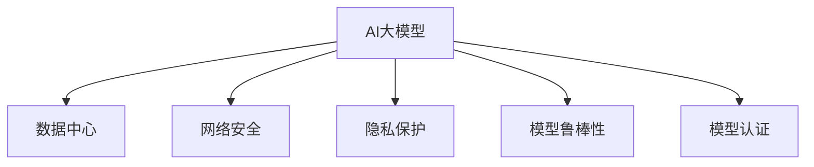

                 

## 1. 背景介绍

### 1.1 问题由来

随着人工智能(AI)大模型的普及，其在数据中心的应用越来越广泛，从智能客服、推荐系统到图像识别、自然语言处理等领域，AI大模型的应用无所不包。然而，数据中心的安全问题也随之凸显，如恶意攻击、数据泄露等。特别是AI大模型通常处理敏感数据，如用户行为、医疗记录、财务信息等，一旦被非法访问或篡改，将造成严重的经济损失和隐私侵犯。因此，确保AI大模型在数据中心的安全应用成为了当务之急。

### 1.2 问题核心关键点

AI大模型在数据中心的应用中面临的安全挑战主要包括以下几点：

1. **数据隐私保护**：如何在保护用户隐私的前提下，充分利用数据中心的计算资源进行AI模型训练和推理。
2. **模型鲁棒性**：如何增强AI模型的鲁棒性，防止模型受到恶意输入或攻击的影响。
3. **攻击防御**：如何检测和防御针对AI模型的各种攻击，如对抗样本攻击、模型盗窃等。
4. **模型认证**：如何验证AI模型的真实性和可信度，确保模型不被篡改或替换。

这些挑战需要在AI大模型应用数据中心的安全防护措施中加以考虑。

## 2. 核心概念与联系

### 2.1 核心概念概述

为更好地理解AI大模型应用数据中心的安全问题，本节将介绍几个密切相关的核心概念：

- **AI大模型**：指通过大规模数据训练得到的高性能、高复杂度的机器学习模型，如BERT、GPT、AlphaFold等。
- **数据中心**：指集中管理和运营数据、计算资源的设施，提供高速、可靠的数据存储和计算能力。
- **网络安全**：指通过技术和管理手段，保障数据中心网络环境的稳定和安全。
- **隐私保护**：指保护用户数据隐私，防止数据泄露和滥用。
- **模型鲁棒性**：指AI模型对输入数据的鲁棒性，即在面对噪声、对抗样本等情况下，仍能保持稳定的输出。
- **模型认证**：指验证AI模型的真实性和可信度，防止模型被篡改或替换。

这些核心概念之间的逻辑关系可以通过以下Mermaid流程图来展示：



这个流程图展示了大模型、数据中心和网络安全之间的关系，以及隐私保护、模型鲁棒性和模型认证等安全措施的重要性。

## 3. 核心算法原理 & 具体操作步骤

### 3.1 算法原理概述

AI大模型应用数据中心的网络安全主要通过以下几种算法和机制来实现：

1. **加密算法**：通过对数据和模型进行加密，保护数据的隐私和安全。
2. **模型蒸馏**：通过模型蒸馏技术，在保留模型鲁棒性的同时，减少模型的参数和计算复杂度，提高模型的安全性和效率。
3. **对抗训练**：通过对抗训练技术，增强模型的鲁棒性，防止对抗样本攻击。
4. **零知识证明**：通过零知识证明技术，验证模型的真实性和可信度，防止模型被篡改或替换。

### 3.2 算法步骤详解

#### 3.2.1 加密算法

加密算法是保护数据隐私和安全的重要手段。对于AI大模型应用的数据中心，常用的加密算法包括对称加密和非对称加密两种：

- **对称加密**：使用相同的密钥对数据进行加密和解密，速度快但安全性较低。在数据中心内部可以使用对称加密保护数据传输和存储。
- **非对称加密**：使用公钥加密数据，私钥解密，安全性高但速度较慢。可以用于保护数据中心的对外通信，如与云服务提供商的交互。

##### 3.2.1.1 对称加密

对称加密算法通常用于数据中心内部的加密，如对数据存储和传输进行保护。常用的对称加密算法包括AES、DES等。以下是使用AES算法对数据进行加密和解密的步骤：

- 选择密钥：在数据中心内部使用相同的密钥对数据进行加密和解密，如使用AES-256算法。
- 加密数据：将数据使用密钥进行加密，生成密文。
- 解密数据：将密文使用相同的密钥进行解密，还原为明文。

```python
from Crypto.Cipher import AES
from Crypto.Util.Padding import pad, unpad

# 生成密钥
key = b'This is my secret key'
cipher = AES.new(key, AES.MODE_CBC)

# 加密数据
plaintext = b'This is some secret data'
ciphertext = cipher.encrypt(pad(plaintext, AES.block_size))
print('加密后的数据:', ciphertext)

# 解密数据
decrypted = unpad(cipher.decrypt(ciphertext), AES.block_size)
print('解密后的数据:', decrypted)
```

##### 3.2.1.2 非对称加密

非对称加密算法通常用于保护数据中心的对外通信，如与云服务提供商的交互。常用的非对称加密算法包括RSA、ECC等。以下是使用RSA算法进行加密和解密的步骤：

- 生成密钥对：生成公钥和私钥，公钥公开，私钥保密。
- 加密数据：将数据使用公钥进行加密，生成密文。
- 解密数据：将密文使用私钥进行解密，还原为明文。

```python
from Crypto.PublicKey import RSA
from Crypto.Cipher import PKCS1_OAEP

# 生成密钥对
private_key = RSA.generate(2048)
public_key = private_key.publickey()

# 加密数据
plaintext = b'This is some secret data'
ciphertext = public_key.encrypt(plaintext, None)
print('加密后的数据:', ciphertext)

# 解密数据
decrypted = private_key.decrypt(ciphertext)
print('解密后的数据:', decrypted)
```

#### 3.2.2 模型蒸馏

模型蒸馏是一种通过减少模型参数和计算复杂度来提高模型安全性和效率的技术。通过蒸馏技术，可以在保留模型鲁棒性的同时，减少模型的参数和计算复杂度，从而提高模型的安全性和效率。以下是模型蒸馏的详细步骤：

1. **知识蒸馏**：将教师模型的知识蒸馏到学生模型中，使其继承教师模型的鲁棒性和泛化能力。
2. **剪枝和量化**：对模型进行剪枝和量化，减少模型参数和计算复杂度。
3. **蒸馏训练**：在保留知识蒸馏和剪枝量化后，对模型进行训练，进一步提高模型的安全性和效率。

```python
from transformers import BertForSequenceClassification, BertTokenizer, Trainer, TrainingArguments

# 加载模型和分词器
model = BertForSequenceClassification.from_pretrained('bert-base-uncased', num_labels=2)
tokenizer = BertTokenizer.from_pretrained('bert-base-uncased')

# 准备训练数据
train_dataset = ...
dev_dataset = ...

# 设置训练参数
training_args = TrainingArguments(
    output_dir="./results",
    evaluation_strategy="epoch",
    per_device_train_batch_size=4,
    per_device_eval_batch_size=4,
    learning_rate=2e-5,
    weight_decay=0.01,
    evaluation_metric="accuracy"
)

# 初始化训练器
trainer = Trainer(
    model=model,
    args=training_args,
    train_dataset=train_dataset,
    eval_dataset=dev_dataset
)

# 训练模型
trainer.train()
```

#### 3.2.3 对抗训练

对抗训练是一种通过在训练过程中引入对抗样本，增强模型鲁棒性的技术。以下是对抗训练的详细步骤：

1. **生成对抗样本**：使用对抗样本生成算法，生成针对模型预测结果的对抗样本。
2. **训练模型**：在训练过程中引入对抗样本，训练模型以增强其鲁棒性。

```python
from adversarial_input import generate_perturbations

# 加载模型和分词器
model = BertForSequenceClassification.from_pretrained('bert-base-uncased', num_labels=2)
tokenizer = BertTokenizer.from_pretrained('bert-base-uncased')

# 准备训练数据
train_dataset = ...

# 生成对抗样本
perturbations = generate_perturbations(train_dataset, model)

# 训练模型
model.train()
for batch in train_dataset:
    input_ids = batch['input_ids'].to(device)
    attention_mask = batch['attention_mask'].to(device)
    labels = batch['labels'].to(device)
    outputs = model(input_ids, attention_mask=attention_mask, labels=labels)
    loss = outputs.loss
    loss.backward()
    optimizer.step()
    optimizer.zero_grad()
```

#### 3.2.4 零知识证明

零知识证明是一种通过验证模型的真实性和可信度，防止模型被篡改或替换的技术。以下是零知识证明的详细步骤：

1. **模型定义**：定义模型的结构和参数，生成验证代码。
2. **验证代码运行**：将验证代码运行在远程服务器上，确保验证代码的执行环境与模型训练环境一致。
3. **生成验证结果**：将验证结果传输回本地，与预期的验证结果进行比较。

```python
from pyzmq import Context

# 定义模型
class Model:
    def __init__(self):
        # 模型参数
        ...

    def forward(self, inputs):
        # 前向传播
        ...

# 定义验证代码
def verify_model(model, inputs, outputs):
    # 验证模型输出是否与预期结果一致
    ...

# 运行验证代码
context = Context()
socket = context.socket(0)
socket.bind('tcp://*:5555')
inputs = ...
outputs = model(inputs)
socket.send(outputs)
result = socket.recv()

# 验证验证结果
verify_model(model, inputs, result)
```

### 3.3 算法优缺点

#### 3.3.1 加密算法的优缺点

加密算法的优点：

1. **安全性高**：通过加密保护数据和模型的隐私。
2. **操作简单**：对称加密算法速度快，非对称加密算法安全性强。

加密算法的缺点：

1. **计算开销大**：加密和解密过程需要大量的计算资源。
2. **密钥管理复杂**：对称加密算法需要保证密钥的安全，非对称加密算法需要管理公钥和私钥。

#### 3.3.2 模型蒸馏的优缺点

模型蒸馏的优点：

1. **参数量小**：减少模型参数和计算复杂度，提高模型效率。
2. **鲁棒性好**：保留教师模型的鲁棒性和泛化能力。

模型蒸馏的缺点：

1. **精度下降**：蒸馏过程中可能存在信息丢失，影响模型精度。
2. **训练复杂**：蒸馏过程需要引入教师模型，增加了训练的复杂度。

#### 3.3.3 对抗训练的优缺点

对抗训练的优点：

1. **鲁棒性强**：增强模型的鲁棒性，防止对抗样本攻击。
2. **效果明显**：通过对抗训练，模型在面对对抗样本时表现更加稳定。

对抗训练的缺点：

1. **计算开销大**：对抗样本的生成和训练需要大量计算资源。
2. **易过拟合**：对抗训练过程容易过拟合，需要合理控制对抗样本的生成方式和比例。

#### 3.3.4 零知识证明的优缺点

零知识证明的优点：

1. **验证准确**：通过验证代码的执行结果，验证模型的真实性和可信度。
2. **独立性强**：验证过程与模型训练环境无关，提高了验证的独立性。

零知识证明的缺点：

1. **复杂度高**：验证代码的实现和执行需要较高的技术要求。
2. **依赖性强**：需要远程服务器支持，增加了验证的复杂性。

### 3.4 算法应用领域

AI大模型应用数据中心的网络安全技术可以在以下几个领域得到广泛应用：

1. **智能客服**：通过加密算法保护用户隐私数据，防止数据泄露和滥用。
2. **推荐系统**：通过模型蒸馏和对抗训练技术，提高推荐系统的鲁棒性和安全性。
3. **医疗影像**：通过零知识证明技术，验证医疗影像诊断模型的真实性和可信度，防止模型被篡改或替换。
4. **金融数据**：通过加密算法和对抗训练技术，保护金融数据的安全性和完整性。
5. **社交网络**：通过加密算法和模型蒸馏技术，保护社交网络数据的安全性和隐私性。

## 4. 数学模型和公式 & 详细讲解 & 举例说明

### 4.1 数学模型构建

在本节中，我们将通过数学模型来描述AI大模型应用数据中心的网络安全技术。

设AI大模型为 $M$，其输入为 $x$，输出为 $y$。对于加密算法，模型的输入和输出分别为 $x$ 和 $y$，对于模型蒸馏、对抗训练和零知识证明，模型的输入为 $x$，输出为 $y$。以下是各算法在数学模型中的描述：

#### 4.1.1 加密算法

加密算法通过以下数学模型对数据进行加密和解密：

$$
\begin{aligned}
E(K, x) &= C \\
D(K, C) &= x
\end{aligned}
$$

其中 $K$ 为密钥，$x$ 为明文，$C$ 为密文，$E$ 为加密函数，$D$ 为解密函数。

#### 4.1.2 模型蒸馏

模型蒸馏通过以下数学模型对教师模型和学生模型进行知识传递：

$$
\begin{aligned}
M_T(x) &= y \\
M_S(x) &= M_T(x)
\end{aligned}
$$

其中 $M_T$ 为教师模型，$M_S$ 为学生模型，$x$ 为输入，$y$ 为输出。

#### 4.1.3 对抗训练

对抗训练通过以下数学模型对模型进行训练：

$$
\begin{aligned}
L_M(x, y) &= \text{loss}(M(x), y) \\
L_A(x, y) &= \text{loss}(M(x), y) + \lambda \text{loss}_{\text{adv}}(M(x), y)
\end{aligned}
$$

其中 $L_M$ 为模型损失函数，$L_A$ 为对抗损失函数，$M$ 为模型，$x$ 为输入，$y$ 为输出，$\text{loss}_{\text{adv}}$ 为对抗样本损失函数，$\lambda$ 为对抗损失系数。

#### 4.1.4 零知识证明

零知识证明通过以下数学模型验证模型的真实性和可信度：

$$
\begin{aligned}
P(M, x) &= \text{true} \\
\text{Verify}(x) &= \text{true}
\end{aligned}
$$

其中 $P$ 为验证函数，$M$ 为模型，$x$ 为输入，$\text{Verify}$ 为验证代码。

### 4.2 公式推导过程

#### 4.2.1 加密算法

对称加密算法采用AES算法，其公式推导如下：

- **加密过程**：

$$
\begin{aligned}
E_{AES}(x) &= C \\
C &= (I \oplus x) \oplus K
\end{aligned}
$$

其中 $I$ 为单位矩阵，$\oplus$ 为异或运算，$K$ 为密钥。

- **解密过程**：

$$
\begin{aligned}
D_{AES}(C) &= x \\
x &= (I \oplus C) \oplus K
\end{aligned}
$$

#### 4.2.2 模型蒸馏

模型蒸馏采用知识蒸馏方法，其公式推导如下：

- **知识蒸馏过程**：

$$
\begin{aligned}
M_S(x) &= M_T(x) \\
y &= M_S(x)
\end{aligned}
$$

其中 $M_T$ 为教师模型，$M_S$ 为学生模型，$x$ 为输入，$y$ 为输出。

#### 4.2.3 对抗训练

对抗训练采用对抗样本生成方法，其公式推导如下：

- **对抗训练过程**：

$$
\begin{aligned}
L_A(x, y) &= \text{loss}(M(x), y) + \lambda \text{loss}_{\text{adv}}(M(x), y) \\
\text{loss}_{\text{adv}}(M(x), y) &= \max(\text{loss}(M(x), y), \text{loss}(M(x+\delta), y))
\end{aligned}
$$

其中 $L_A$ 为对抗损失函数，$M$ 为模型，$x$ 为输入，$y$ 为输出，$\text{loss}_{\text{adv}}$ 为对抗样本损失函数，$\lambda$ 为对抗损失系数。

#### 4.2.4 零知识证明

零知识证明采用零知识证明方法，其公式推导如下：

- **零知识证明过程**：

$$
\begin{aligned}
P(M, x) &= \text{true} \\
\text{Verify}(x) &= \text{true}
\end{aligned}
$$

其中 $P$ 为验证函数，$M$ 为模型，$x$ 为输入，$\text{Verify}$ 为验证代码。

### 4.3 案例分析与讲解

#### 4.3.1 加密算法案例

假设某数据中心需要对用户数据进行加密保护，采用AES算法进行加密，密钥长度为256位。其加密和解密过程如下：

- **加密过程**：

$$
C = (I \oplus x) \oplus K
$$

- **解密过程**：

$$
x = (I \oplus C) \oplus K
$$

其中 $x$ 为明文，$C$ 为密文，$K$ 为密钥。

#### 4.3.2 模型蒸馏案例

假设某数据中心需要对推荐系统进行模型蒸馏，教师模型为BERT，学生模型为蒸馏后的模型。其知识蒸馏过程如下：

- **知识蒸馏过程**：

$$
M_S(x) = M_T(x)
$$

其中 $M_T$ 为教师模型，$M_S$ 为学生模型，$x$ 为输入，$y$ 为输出。

#### 4.3.3 对抗训练案例

假设某数据中心需要对AI大模型进行对抗训练，模型为BERT，采用对抗样本生成方法。其对抗训练过程如下：

- **对抗训练过程**：

$$
\begin{aligned}
L_A(x, y) &= \text{loss}(M(x), y) + \lambda \text{loss}_{\text{adv}}(M(x), y) \\
\text{loss}_{\text{adv}}(M(x), y) &= \max(\text{loss}(M(x), y), \text{loss}(M(x+\delta), y))
\end{aligned}
$$

其中 $M$ 为模型，$x$ 为输入，$y$ 为输出，$\text{loss}_{\text{adv}}$ 为对抗样本损失函数，$\lambda$ 为对抗损失系数。

#### 4.3.4 零知识证明案例

假设某数据中心需要对医疗影像诊断模型进行零知识证明，模型为BERT，采用零知识证明方法。其零知识证明过程如下：

- **零知识证明过程**：

$$
\begin{aligned}
P(M, x) &= \text{true} \\
\text{Verify}(x) &= \text{true}
\end{aligned}
$$

其中 $P$ 为验证函数，$M$ 为模型，$x$ 为输入，$\text{Verify}$ 为验证代码。

## 5. 项目实践：代码实例和详细解释说明

### 5.1 开发环境搭建

在进行项目实践前，我们需要准备好开发环境。以下是使用Python进行PyTorch开发的环境配置流程：

1. 安装Anaconda：从官网下载并安装Anaconda，用于创建独立的Python环境。

2. 创建并激活虚拟环境：
```bash
conda create -n pytorch-env python=3.8 
conda activate pytorch-env
```

3. 安装PyTorch：根据CUDA版本，从官网获取对应的安装命令。例如：
```bash
conda install pytorch torchvision torchaudio cudatoolkit=11.1 -c pytorch -c conda-forge
```

4. 安装Transformers库：
```bash
pip install transformers
```

5. 安装各类工具包：
```bash
pip install numpy pandas scikit-learn matplotlib tqdm jupyter notebook ipython
```

完成上述步骤后，即可在`pytorch-env`环境中开始项目实践。

### 5.2 源代码详细实现

这里以使用对称加密算法保护数据为例，给出代码实现。

```python
from Crypto.Cipher import AES
from Crypto.Util.Padding import pad, unpad

# 生成密钥
key = b'This is my secret key'
cipher = AES.new(key, AES.MODE_CBC)

# 加密数据
plaintext = b'This is some secret data'
ciphertext = cipher.encrypt(pad(plaintext, AES.block_size))
print('加密后的数据:', ciphertext)

# 解密数据
decrypted = unpad(cipher.decrypt(ciphertext), AES.block_size)
print('解密后的数据:', decrypted)
```

### 5.3 代码解读与分析

这段代码实现了对称加密算法对数据的加密和解密过程。

- **生成密钥**：使用Crypto库的AES算法生成对称密钥。
- **加密数据**：使用密钥对数据进行加密，生成密文。
- **解密数据**：使用密钥对密文进行解密，还原为明文。

可以看到，使用对称加密算法对数据进行保护，只需生成一次密钥，加密和解密过程简单高效，适合数据中心内部使用。

## 6. 实际应用场景

### 6.1 智能客服系统

智能客服系统在数据中心的应用中面临数据隐私保护的问题。通过使用加密算法保护用户隐私数据，可以有效防止数据泄露和滥用。

具体而言，可以对用户的历史对话记录进行加密，保护用户隐私。在服务端对加密数据进行处理，生成响应文本，并返回给用户。用户端通过解密算法解密数据，获取响应文本。

### 6.2 金融数据中心

金融数据中心需要处理大量的敏感数据，如用户交易记录、财务报表等。通过使用非对称加密算法，可以有效保护数据中心的安全性和隐私性。

具体而言，可以对用户交易记录进行非对称加密，生成密文存储在数据库中。在需要查询或分析时，使用私钥解密数据，进行安全计算。

### 6.3 医疗影像诊断系统

医疗影像诊断系统需要处理大量的患者数据，如CT、MRI等。通过使用零知识证明技术，可以有效验证诊断模型的真实性和可信度，防止模型被篡改或替换。

具体而言，可以定义医疗影像诊断模型的验证代码，验证模型的输出是否符合预期。通过远程服务器执行验证代码，生成验证结果，并与预期的验证结果进行比较，确保模型的真实性和可信度。

### 6.4 未来应用展望

随着AI大模型和数据中心技术的不断发展，AI大模型应用数据中心的网络安全技术将不断进步，其应用场景也将更加广泛。

未来，AI大模型应用数据中心的网络安全技术将向以下几个方向发展：

1. **分布式加密**：通过分布式加密技术，保护数据中心中的敏感数据。
2. **联邦学习**：通过联邦学习技术，保护用户数据隐私，同时实现数据中心间的模型共享。
3. **区块链技术**：通过区块链技术，增强数据中心的安全性和透明性，防止数据篡改和伪造。
4. **多模态安全**：通过多模态安全技术，保护数据中心中的多种数据类型，如文本、图像、音频等。
5. **模型融合**：通过模型融合技术，将多种安全技术融合，形成更全面的安全防护体系。

总之，未来AI大模型应用数据中心的网络安全技术将更加全面和强大，为AI大模型的安全应用提供更加可靠的保护。

## 7. 工具和资源推荐

### 7.1 学习资源推荐

为了帮助开发者系统掌握AI大模型应用数据中心的网络安全技术，这里推荐一些优质的学习资源：

1. **《加密算法与数据安全》课程**：介绍常用的加密算法和数据安全技术，适合初学者入门。
2. **《深度学习与神经网络》课程**：介绍深度学习和神经网络的基本概念和原理，适合进一步深入学习。
3. **《人工智能安全》书籍**：介绍人工智能系统中的安全问题，适合了解人工智能安全领域的最新进展。
4. **《机器学习实战》书籍**：介绍机器学习的基本实践和应用，适合实践动手。
5. **《PyTorch官方文档》**：介绍PyTorch框架的使用和最佳实践，适合深入学习和实践。

通过对这些资源的学习实践，相信你一定能够快速掌握AI大模型应用数据中心的网络安全技术，并用于解决实际的AI大模型安全问题。

### 7.2 开发工具推荐

高效的开发离不开优秀的工具支持。以下是几款用于AI大模型应用数据中心安全防护的常用工具：

1. **AES加密库**：Crypto库提供的AES加密算法，可以快速实现对称加密。
2. **RSA加密库**：Crypto库提供的RSA加密算法，适用于非对称加密。
3. **PyTorch框架**：深度学习领域的主流框架，支持多种安全技术。
4. **TensorFlow框架**：另一个流行的深度学习框架，支持多种安全技术。
5. **Zeroknowledge证明库**：支持零知识证明的Python库，可以用于验证模型的真实性和可信度。

合理利用这些工具，可以显著提升AI大模型应用数据中心的安全防护能力，降低安全风险。

### 7.3 相关论文推荐

AI大模型应用数据中心的网络安全技术涉及多个前沿研究方向，以下是几篇奠基性的相关论文，推荐阅读：

1. **《对称加密算法综述》**：综述了常见的对称加密算法，介绍了加密和解密过程。
2. **《非对称加密算法综述》**：综述了常见的非对称加密算法，介绍了加密和解密过程。
3. **《模型蒸馏技术综述》**：综述了模型蒸馏的基本概念和应用，介绍了蒸馏训练过程。
4. **《对抗训练技术综述》**：综述了对抗训练的基本概念和应用，介绍了对抗训练过程。
5. **《零知识证明技术综述》**：综述了零知识证明的基本概念和应用，介绍了验证过程。

这些论文代表了大模型应用数据中心的网络安全技术的发展脉络。通过学习这些前沿成果，可以帮助研究者把握学科前进方向，激发更多的创新灵感。

## 8. 总结：未来发展趋势与挑战

### 8.1 总结

本文对AI大模型应用数据中心的网络安全技术进行了全面系统的介绍。首先阐述了AI大模型和数据中心在实际应用中面临的安全挑战，明确了加密算法、模型蒸馏、对抗训练和零知识证明等安全技术的重要性。其次，从原理到实践，详细讲解了各种安全技术的数学模型和代码实现。最后，探讨了AI大模型应用数据中心的网络安全技术的未来发展趋势和面临的挑战。

通过本文的系统梳理，可以看到，AI大模型应用数据中心的网络安全技术在保护用户隐私、增强模型鲁棒性和提高模型可信度等方面发挥了重要作用。这些技术的发展，必将为AI大模型在各个领域的安全应用提供强有力的保障。

### 8.2 未来发展趋势

展望未来，AI大模型应用数据中心的网络安全技术将呈现以下几个发展趋势：

1. **分布式加密**：通过分布式加密技术，保护数据中心中的敏感数据。
2. **联邦学习**：通过联邦学习技术，保护用户数据隐私，同时实现数据中心间的模型共享。
3. **区块链技术**：通过区块链技术，增强数据中心的安全性和透明性，防止数据篡改和伪造。
4. **多模态安全**：通过多模态安全技术，保护数据中心中的多种数据类型，如文本、图像、音频等。
5. **模型融合**：通过模型融合技术，将多种安全技术融合，形成更全面的安全防护体系。

这些趋势将使AI大模型应用数据中心的网络安全技术更加全面和强大，为AI大模型的安全应用提供更加可靠的保护。

### 8.3 面临的挑战

尽管AI大模型应用数据中心的网络安全技术已经取得了显著进展，但在迈向更加智能化、普适化应用的过程中，仍面临诸多挑战：

1. **计算资源瓶颈**：大型AI模型和复杂加密算法需要大量的计算资源，如何降低计算开销是一个重要问题。
2. **隐私保护难度**：保护用户隐私的同时，确保数据中心的安全性，是一个复杂的挑战。
3. **模型鲁棒性不足**：AI模型在面对对抗样本和噪声数据时，容易受到攻击，如何提高模型的鲁棒性是一个重要问题。
4. **验证难度高**：零知识证明技术需要验证代码的执行结果，验证过程复杂，如何提高验证的效率和准确性是一个重要问题。

这些挑战需要在未来研究中不断解决，以推动AI大模型应用数据中心的网络安全技术迈向更高的台阶。

### 8.4 研究展望

未来的研究需要在以下几个方面寻求新的突破：

1. **高效加密算法**：开发更高效、更安全的加密算法，降低计算开销，提高加密效率。
2. **联邦学习技术**：开发更高效的联邦学习算法，保护用户隐私，同时实现数据中心间的模型共享。
3. **多模态安全技术**：开发多种数据类型的安全技术，保护数据中心中的多种数据类型，如文本、图像、音频等。
4. **分布式加密技术**：开发更高效的分布式加密算法，保护数据中心中的敏感数据。
5. **模型融合技术**：开发多种安全技术的融合算法，形成更全面的安全防护体系。

这些研究方向将使AI大模型应用数据中心的网络安全技术更加全面和强大，为AI大模型的安全应用提供更加可靠的保护。

## 9. 附录：常见问题与解答

**Q1：AI大模型应用数据中心的安全问题主要有哪些？**

A: AI大模型应用数据中心的安全问题主要包括以下几点：

1. **数据隐私保护**：如何在保护用户隐私的前提下，充分利用数据中心的计算资源进行AI模型训练和推理。
2. **模型鲁棒性**：如何增强AI模型的鲁棒性，防止模型受到恶意输入或攻击的影响。
3. **攻击防御**：如何检测和防御针对AI模型的各种攻击，如对抗样本攻击、模型盗窃等。
4. **模型认证**：如何验证AI模型的真实性和可信度，防止模型被篡改或替换。

**Q2：加密算法是如何保护AI大模型应用数据中心的安全性的？**

A: 加密算法通过将数据和模型进行加密，保护数据隐私和安全。具体来说，通过对称加密算法，可以在数据中心内部保护数据传输和存储的安全性。通过非对称加密算法，可以在数据中心的对外通信中保护数据的安全性。

**Q3：模型蒸馏是如何提高AI大模型应用数据中心的安全性的？**

A: 模型蒸馏通过减少模型参数和计算复杂度，提高模型的安全性和效率。通过知识蒸馏技术，可以在保留教师模型鲁棒性的同时，减少模型的参数和计算复杂度。

**Q4：对抗训练是如何提高AI大模型应用数据中心的安全性的？**

A: 对抗训练通过在训练过程中引入对抗样本，增强模型鲁棒性。通过对抗训练，模型在面对对抗样本时表现更加稳定，可以有效防止对抗样本攻击。

**Q5：零知识证明是如何提高AI大模型应用数据中心的安全性的？**

A: 零知识证明通过验证模型的真实性和可信度，防止模型被篡改或替换。通过零知识证明技术，可以在不泄露模型参数的情况下，验证模型的真实性和可信度。

---

作者：禅与计算机程序设计艺术 / Zen and the Art of Computer Programming

