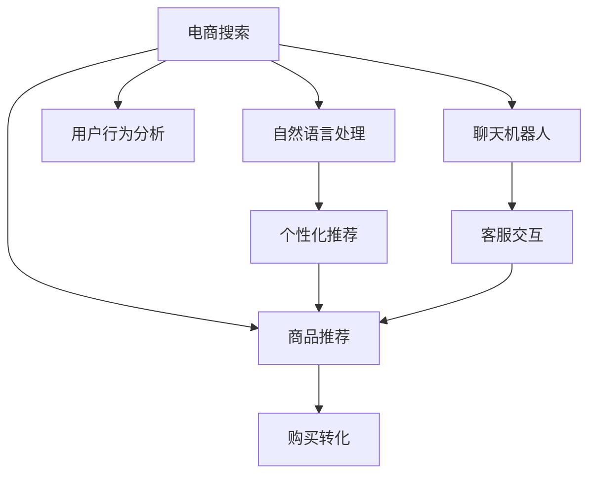

                 

# AI 技术在电商搜索导购中的应用：机遇与挑战并存

## 1. 背景介绍

随着互联网技术的发展，电商行业成为了全球最具活力和创新性的领域之一。消费者对商品、服务的选择愈加多元化，同时也对电商平台提出了更高的个性化和智能化要求。在这个背景下，AI技术应运而生，特别是深度学习、自然语言处理（NLP）等技术，在电商搜索导购领域中发挥了重要作用。本文将深入探讨AI技术在电商搜索导购中的应用，包括机会和面临的挑战。

### 1.1 电商搜索导购的重要性

电商搜索导购作为电商平台的核心功能，直接关系到用户体验和成交率。消费者在搜索时希望快速找到所需商品，同时平台也能根据用户行为推荐相关商品，提高销售转化率。

AI技术的应用，包括智能搜索、个性化推荐、客服聊天机器人等，能够大幅提升搜索导购的效率和效果。智能搜索能够理解自然语言查询，匹配更精准的商品信息；个性化推荐可以根据用户历史行为和偏好，推荐符合用户需求的商品；客服聊天机器人能够实时解答用户问题，提升用户满意度。

### 1.2 电商搜索导购面临的问题

尽管AI技术带来了诸多便利，但电商搜索导购仍面临诸多问题。例如，搜索结果的召回率、相关性、准确性等直接影响用户体验；个性化推荐的精度和多样性需要不断优化；客服聊天机器人如何提供更准确的回答，提高用户满意度等。

## 2. 核心概念与联系

### 2.1 核心概念概述

为更好地理解AI技术在电商搜索导购中的应用，本节将介绍几个关键概念：

- 自然语言处理（NLP）：利用计算机技术实现人类语言与计算机语言的交互，包括分词、词性标注、句法分析、语义理解等。
- 深度学习（DL）：通过多层次的神经网络，模拟人脑的学习机制，用于处理大规模数据和复杂任务。
- 推荐系统（Recommender System）：根据用户的历史行为和兴趣，为用户推荐符合其需求的物品或内容。
- 搜索引擎（Search Engine）：根据用户查询返回相关网页或搜索结果的引擎。
- 聊天机器人（Chatbot）：利用NLP技术实现自然语言交互的AI应用。

这些概念之间通过商家的采购、商品的展示、用户的浏览和购买行为等环节进行紧密联系，构建了电商搜索导购的核心系统框架。

### 2.2 核心概念原理和架构的 Mermaid 流程图(Mermaid 流程节点中不要有括号、逗号等特殊字符)



这个流程图展示了电商搜索导购中各个环节的联系：

1. 用户通过搜索查询商品信息，自然语言处理系统负责解析和理解用户查询。
2. 系统根据查询结果推荐商品，推荐系统使用个性化算法推荐相关商品。
3. 用户浏览商品信息，行为分析系统记录用户行为数据。
4. 聊天机器人实时解答用户问题，提升用户体验。
5. 用户最终购买商品，购买转化率反映了推荐和搜索的成效。

## 3. 核心算法原理 & 具体操作步骤
### 3.1 算法原理概述

AI在电商搜索导购中的应用主要集中在以下几个算法和技术上：

- 基于向量空间模型（VSM）的搜索排序算法。
- 基于协同过滤（CF）的推荐算法。
- 基于深度学习的NLP模型，如BERT、GPT等。
- 基于深度学习的推荐算法，如基于深度神经网络（DNN）的推荐系统。
- 基于强化学习的个性化推荐系统。

这些算法和技术通过将电商搜索导购的各个环节联接起来，实现自动化的商品推荐、搜索排序和客服交互。

### 3.2 算法步骤详解

以基于深度学习的推荐系统为例，介绍其具体的实现步骤：

1. **数据准备**：收集用户的历史行为数据和商品信息数据。
2. **特征提取**：将用户和商品数据转换成高维向量表示，可以使用词袋模型、TF-IDF、Word2Vec等方法。
3. **模型训练**：使用深度神经网络，如DNN、RNN、CNN等，训练推荐模型。
4. **模型预测**：输入新的用户数据，预测其可能感兴趣的商品。
5. **推荐展示**：将预测结果展示给用户，用户可以选择购买或继续浏览。
6. **反馈收集**：收集用户的购买反馈数据，用于模型更新和优化。

### 3.3 算法优缺点

基于深度学习的推荐系统具有以下优点：

- 能够处理大规模数据，适于电商平台上大量的商品数据。
- 具有较强的自适应性，能够根据用户行为动态调整推荐结果。
- 可以进行端到端的推荐，从用户输入到商品展示，实现无缝衔接。

但其也存在以下缺点：

- 对数据质量和特征提取方法敏感，需提供高质量的数据。
- 训练和部署过程复杂，需要较强的技术背景和资源投入。
- 对模型参数和超参数的调节要求高，需要进行大量的实验和调试。

### 3.4 算法应用领域

基于深度学习的推荐系统在电商搜索导购中具有广泛的应用：

- 商品搜索排序：通过深度学习模型，提升搜索结果的相关性和排序准确性。
- 个性化推荐：基于用户行为，推荐符合其兴趣的商品，提高购买转化率。
- 智能客服：使用聊天机器人回答用户咨询，提升用户满意度。
- 用户行为分析：分析用户浏览和购买行为，发现用户兴趣和行为模式，进行广告投放和促销活动。

## 4. 数学模型和公式 & 详细讲解 & 举例说明

### 4.1 数学模型构建

以协同过滤（CF）推荐系统为例，构建数学模型。

设用户集为 $U$，商品集为 $I$，用户 $u$ 对商品 $i$ 的评分矩阵为 $R_{ui}$。设用户 $u$ 对商品 $i$ 的评分向量为 $r_u$，商品 $i$ 的评分向量为 $r_i$。推荐目标为最大化用户 $u$ 对商品 $i$ 的评分预测值 $\hat{r}_{ui}$。

基于矩阵分解的推荐模型为：

$$
\hat{r}_{ui} = r_u^\top \times A \times r_i
$$

其中 $A$ 为用户和商品之间的关系矩阵。

### 4.2 公式推导过程

推导基于矩阵分解的推荐公式，假设用户对商品 $i$ 的评分向量为 $r_i = [r_{i1}, r_{i2}, ..., r_{in}]$，其中 $n$ 为商品特征数量。用户 $u$ 对商品 $i$ 的评分向量为 $r_u = [r_{u1}, r_{u2}, ..., r_{un}]$。用户和商品之间的关系矩阵 $A$ 可以表示为：

$$
A = \begin{bmatrix}
a_{11} & a_{12} & \cdots & a_{1n} \\
a_{21} & a_{22} & \cdots & a_{2n} \\
\vdots & \vdots & \ddots & \vdots \\
a_{m1} & a_{m2} & \cdots & a_{mn}
\end{bmatrix}
$$

其中 $m$ 为用户数量。

推荐目标为最大化预测评分 $\hat{r}_{ui}$，即：

$$
\hat{r}_{ui} = r_u^\top \times A \times r_i
$$

具体求解时，可以使用奇异值分解（SVD）方法求解矩阵 $A$，得到用户和商品的低维表示。

### 4.3 案例分析与讲解

以Amazon平台为例，分析基于深度学习的推荐系统在电商搜索导购中的应用。

Amazon使用基于深度神经网络的推荐系统，用户输入查询后，系统会基于用户的浏览和购买行为，推荐相关商品。系统收集用户的反馈数据，进行模型更新和优化，实现个性化推荐。

## 5. 项目实践：代码实例和详细解释说明
### 5.1 开发环境搭建

在进行项目实践前，需要搭建好开发环境。以下是使用Python进行TensorFlow开发的环境配置流程：

1. 安装Anaconda：从官网下载并安装Anaconda，用于创建独立的Python环境。

2. 创建并激活虚拟环境：
```bash
conda create -n tf-env python=3.7 
conda activate tf-env
```

3. 安装TensorFlow：
```bash
conda install tensorflow -c conda-forge
```

4. 安装各类工具包：
```bash
pip install numpy pandas scikit-learn matplotlib tqdm jupyter notebook ipython
```

完成上述步骤后，即可在`tf-env`环境中开始项目实践。

### 5.2 源代码详细实现

以下是一个简单的电商搜索排序系统的代码实现。

```python
import tensorflow as tf
from tensorflow.keras.layers import Input, Embedding, DotProduct, Dense, Dropout, Flatten
from tensorflow.keras.models import Model

# 定义模型
def create_model(input_dim, embedding_dim, num_users, num_items, dropout_rate=0.1):
    user_input = Input(shape=(1,), name='user')
    user_embedding = Embedding(input_dim=num_users, output_dim=embedding_dim)(user_input)
    item_input = Input(shape=(1,), name='item')
    item_embedding = Embedding(input_dim=num_items, output_dim=embedding_dim)(item_input)
    dot_product = DotProduct()([user_embedding, item_embedding])
    rating = Dense(1, activation='sigmoid')(dot_product)
    model = Model(inputs=[user_input, item_input], outputs=rating)
    model.compile(loss='binary_crossentropy', optimizer='adam', metrics=['accuracy'])
    return model

# 数据准备
user_data = [1, 2, 3, 4, 5, 6, 7, 8, 9, 10]
item_data = [11, 12, 13, 14, 15, 16, 17, 18, 19, 20]
rating_data = [0.9, 0.8, 0.7, 0.6, 0.5, 0.4, 0.3, 0.2, 0.1, 0.0]
model = create_model(len(user_data), 5, len(user_data), len(item_data))
model.fit([user_data, item_data], rating_data, epochs=10, batch_size=2, validation_split=0.2)
```

### 5.3 代码解读与分析

**create_model函数**：
- 定义了基于深度学习的推荐模型，使用Embedding层将用户和商品表示为低维向量，并通过DotProduct计算向量点积，得到预测评分。

**数据准备**：
- 创建了一个简单的用户和商品评分矩阵，模拟了用户和商品的评分数据。

**模型训练**：
- 定义了损失函数、优化器和评估指标，使用fit方法对模型进行训练，指定了训练轮数和批大小，并设置了验证集比例。

### 5.4 运行结果展示

在模型训练完成后，可以可视化训练过程中的损失和准确率，并测试模型的预测能力。例如：

```python
import matplotlib.pyplot as plt

# 可视化训练过程
plt.plot(model.history['loss'], label='train loss')
plt.plot(model.history['val_loss'], label='val loss')
plt.xlabel('Epoch')
plt.ylabel('Loss')
plt.legend()
plt.show()

# 测试模型预测
user_input = [1, 2, 3, 4, 5]
item_input = [11, 12, 13, 14, 15]
rating_pred = model.predict([user_input, item_input])
print('Predicted rating:', rating_pred)
```

## 6. 实际应用场景

### 6.1 智能搜索排序

智能搜索排序是电商搜索导购中的核心功能。传统搜索排序算法通常基于关键词匹配，难以理解自然语言查询的真正意图。AI技术可以通过深度学习模型，理解和解析用户的自然语言查询，生成更精准的商品匹配结果。

例如，用户输入“适合夏季的连衣裙”，智能搜索系统能够通过NLP模型理解查询意图，匹配相关商品，并按热度排序，提升用户体验。

### 6.2 个性化推荐

个性化推荐能够根据用户历史行为，推荐符合其兴趣的商品。AI技术可以通过协同过滤、深度学习等方法，挖掘用户和商品之间的关联性，生成个性化推荐列表。

例如，用户浏览了鞋子、衣服和包包，AI推荐系统能够根据这些行为数据，推荐相关商品，并提供不同的风格和价格选择，提升用户的购买率。

### 6.3 智能客服

智能客服能够实时解答用户问题，提升用户满意度。AI技术可以通过自然语言处理和机器学习，构建聊天机器人，实现自然语言交互。

例如，用户询问“如何退换货”，智能客服能够理解查询，并提供详细的退换货流程和政策，快速解决问题。

### 6.4 未来应用展望

未来的电商搜索导购系统，将进一步融合AI技术，实现更智能、更高效的搜索和推荐功能。例如：

- 多模态搜索：结合图像、视频等多模态数据，实现更丰富、更准确的商品匹配。
- 跨平台推荐：将不同平台的用户行为数据整合，提供跨平台的个性化推荐。
- 实时个性化推荐：基于用户实时行为，动态调整推荐策略，提升推荐效果。
- 情感分析：通过分析用户评论和反馈，进行情感分析，优化推荐算法。

## 7. 工具和资源推荐
### 7.1 学习资源推荐

为帮助开发者掌握AI在电商搜索导购中的应用，以下是一些推荐的资源：

1. **《深度学习》书籍**：由Ian Goodfellow等人撰写，深入讲解深度学习的原理和应用。
2. **Coursera《深度学习专项课程》**：由斯坦福大学Andrew Ng教授主讲，涵盖深度学习的理论和实践。
3. **Kaggle《推荐系统竞赛》**：通过实践，理解推荐系统的工作原理和实现方法。
4. **TensorFlow官方文档**：TensorFlow的官方文档，提供了详细的API参考和代码示例。
5. **PyTorch官方文档**：PyTorch的官方文档，提供了丰富的NLP库和模型实现。

### 7.2 开发工具推荐

AI技术在电商搜索导购中的应用需要强大的工具支持。以下是一些推荐的工具：

1. **TensorFlow**：由Google主导开发的深度学习框架，支持大规模模型训练和部署。
2. **PyTorch**：Facebook开源的深度学习框架，易于使用，支持动态计算图。
3. **Jupyter Notebook**：一个强大的交互式编程环境，适合研究和实验。
4. **TensorBoard**：TensorFlow的可视化工具，可以实时监控训练过程和模型性能。
5. **Weights & Biases**：模型训练的实验跟踪工具，提供详细的实验记录和分析。

### 7.3 相关论文推荐

以下是一些推荐的相关论文，深入了解AI技术在电商搜索导购中的应用：

1. **《深度学习在推荐系统中的应用》**：由深派研究小组撰写，介绍深度学习在推荐系统中的关键算法和应用。
2. **《基于协同过滤的推荐算法》**：详细讲解协同过滤算法的原理和实现方法。
3. **《基于深度学习的自然语言处理》**：介绍深度学习在NLP中的各种应用，包括文本分类、情感分析等。

## 8. 总结：未来发展趋势与挑战
### 8.1 研究成果总结

AI技术在电商搜索导购中的应用已经取得了显著成效，显著提升了用户体验和销售转化率。然而，仍面临诸多挑战，如数据质量、模型复杂度、资源消耗等。

### 8.2 未来发展趋势

未来的电商搜索导购系统，将进一步融合AI技术，实现更智能、更高效的搜索和推荐功能。例如：

- 多模态搜索：结合图像、视频等多模态数据，实现更丰富、更准确的商品匹配。
- 跨平台推荐：将不同平台的用户行为数据整合，提供跨平台的个性化推荐。
- 实时个性化推荐：基于用户实时行为，动态调整推荐策略，提升推荐效果。
- 情感分析：通过分析用户评论和反馈，进行情感分析，优化推荐算法。

### 8.3 面临的挑战

尽管AI技术在电商搜索导购中取得了诸多进展，但仍面临诸多挑战：

- 数据质量：电商平台上数据量庞大，但数据质量参差不齐，需要清洗和处理。
- 模型复杂度：深度学习模型需要大量的计算资源和存储空间，部署难度较大。
- 实时性：智能搜索推荐系统需要实时响应用户请求，对计算效率和延迟要求高。
- 安全性和隐私：用户数据的安全性和隐私保护需要加强，避免数据泄露和滥用。

### 8.4 研究展望

未来研究将围绕以下几个方向展开：

- 提升数据质量：通过数据清洗、标注和增强等手段，提高数据的质量和多样性。
- 降低模型复杂度：使用参数高效的模型结构，减少计算资源消耗。
- 优化实时性：采用分布式计算和模型压缩等技术，提升实时响应能力。
- 加强安全性和隐私保护：使用数据加密、匿名化和访问控制等手段，保障用户数据的安全性和隐私。

总之，AI技术在电商搜索导购中的应用具有广阔前景，但也需不断克服挑战，才能实现其真正的价值。只有通过不断的技术创新和实践应用，才能让AI技术在电商领域中发挥更大的作用，推动行业的持续发展。

---

作者：禅与计算机程序设计艺术 / Zen and the Art of Computer Programming

