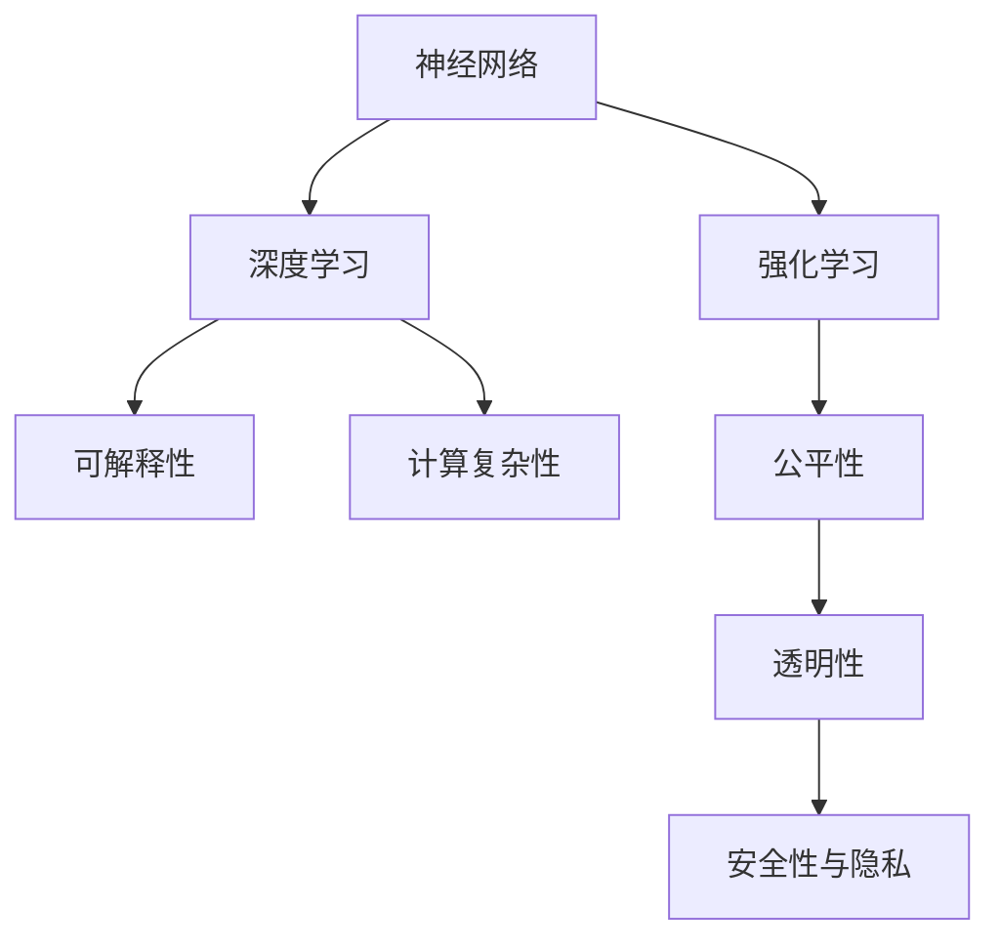

                 

# AI 神经网络计算艺术之禅：人类智能是地球环境培育出的最美丽的花朵

## 1. 背景介绍

### 1.1 问题由来

在过去的几十年里，人工智能(AI)和神经网络(NN)的迅猛发展，使我们能够从根本上理解和模仿人类智能。这种技术进步，无论是从理论研究还是实际应用，都极大地推动了计算机科学的发展。从深度学习到强化学习，AI技术已成为众多领域的利器。然而，在这背后，我们必须深思熟虑，谨慎地探索，以免我们失去了对这种技术的掌控，甚至落入无法预见的陷阱。

### 1.2 问题核心关键点

在AI的探索过程中，最重要的关键点包括以下几个方面：

- **可解释性**：解释AI如何做出决策，对增强用户信任、降低风险至关重要。
- **公平性与透明性**：确保AI系统对所有人公平对待，无歧视，是AI社会应用的基础。
- **效率与可扩展性**：AI模型需要高效运行，且能处理大规模数据，提高计算能力。
- **安全性与隐私**：保护用户数据安全，防止AI系统被恶意利用。

### 1.3 问题研究意义

研究AI和神经网络计算艺术的禅宗，对探索人类智能的起源和未来应用具有重大意义。通过理解AI如何模仿和超越人类智能，我们可以更好地设计AI系统，以实现更加高效、公平、透明和安全的目标。此外，探索AI的极限，也有助于我们更深入地了解人类认知的极限和潜力。

## 2. 核心概念与联系

### 2.1 核心概念概述

AI的计算艺术涉及多个核心概念，包括但不限于：

- **神经网络(NN)**：一种计算模型，由节点和边组成，能够处理复杂的数据结构。
- **深度学习(Deep Learning)**：一种通过多层次神经网络进行学习和推理的AI技术。
- **强化学习(Reinforcement Learning)**：通过试错学习，在环境中进行优化。
- **计算复杂性(Computational Complexity)**：衡量解决问题所需计算资源的多少。
- **可解释性(Explainability)**：提供对模型决策过程的合理解释。
- **公平性(Fairness)**：确保AI决策对所有用户公平。

### 2.2 核心概念原理和架构的 Mermaid 流程图



## 3. 核心算法原理 & 具体操作步骤

### 3.1 算法原理概述

AI计算艺术的核心算法包括神经网络和深度学习。深度学习模型由多层非线性变换组成，通过反向传播算法进行训练。其原理基于以下几个步骤：

1. **前向传播(Forward Propagation)**：将输入数据传递通过网络，计算输出结果。
2. **损失函数(Loss Function)**：评估模型输出与真实标签之间的差异。
3. **反向传播(Backward Propagation)**：根据损失函数计算梯度，调整模型参数。
4. **优化器(Optimizer)**：使用梯度下降等方法，更新模型参数。

### 3.2 算法步骤详解

#### 3.2.1 数据准备

1. **数据集收集**：收集训练、验证和测试数据集。
2. **数据预处理**：进行数据清洗、标准化和归一化。
3. **划分数据集**：将数据集划分为训练集、验证集和测试集。

#### 3.2.2 模型构建

1. **选择合适的模型**：根据任务选择合适的神经网络模型。
2. **模型初始化**：随机初始化模型参数。
3. **定义损失函数**：选择合适的损失函数，如交叉熵、均方误差等。

#### 3.2.3 模型训练

1. **前向传播**：将输入数据输入模型，计算输出结果。
2. **计算损失**：使用损失函数计算模型输出与真实标签之间的差异。
3. **反向传播**：根据损失函数计算梯度，调整模型参数。
4. **优化器更新**：使用优化器更新模型参数。

#### 3.2.4 模型评估

1. **验证集评估**：在验证集上评估模型性能。
2. **测试集评估**：在测试集上评估模型性能。
3. **模型保存**：保存最优模型参数。

### 3.3 算法优缺点

#### 3.3.1 优点

1. **模型高效**：深度学习模型可以处理大规模复杂数据。
2. **泛化能力强**：能够从数据中学习通用规律。
3. **可扩展性强**：易于并行处理和分布式训练。

#### 3.3.2 缺点

1. **计算资源需求高**：需要大量计算资源进行训练。
2. **数据需求大**：需要大量标注数据。
3. **可解释性差**：模型决策过程难以解释。

### 3.4 算法应用领域

AI计算艺术在多个领域都有广泛应用，包括但不限于：

- **计算机视觉**：图像分类、目标检测、图像生成等。
- **自然语言处理**：文本分类、机器翻译、情感分析等。
- **语音识别**：语音识别、语音合成等。
- **机器人学**：机器人导航、行为控制等。
- **游戏AI**：游戏智能、自动博弈等。
- **金融科技**：风险评估、投资决策等。

## 4. 数学模型和公式 & 详细讲解 & 举例说明

### 4.1 数学模型构建

假设我们有一个包含 $N$ 个样本的数据集 $D=\{(x_i, y_i)\}_{i=1}^N$，其中 $x_i$ 为输入，$y_i$ 为标签。我们希望构建一个深度学习模型 $M_\theta$，其中 $\theta$ 表示模型参数。模型的目标是学习一个映射 $f_\theta(x)$，使得 $f_\theta(x)$ 尽可能接近 $y_i$。

### 4.2 公式推导过程

我们将深度学习模型的构建分为以下几个步骤：

1. **输入层**：将输入数据映射到合适的高维空间。
2. **隐藏层**：通过多层非线性变换，将输入数据映射到更高维的空间。
3. **输出层**：将隐藏层的输出映射到标签空间。

假设隐藏层的神经元数为 $H$，神经元之间的权重矩阵为 $W$，激活函数为 $\sigma$。模型的前向传播过程如下：

$$
h^{(l)} = \sigma(\sum_{j=1}^H W^{(l)}_{i,j} h^{(l-1)} + b^{(l)})
$$

其中 $h^{(l)}$ 表示第 $l$ 层的输出，$b^{(l)}$ 为偏置项。

### 4.3 案例分析与讲解

我们以图像分类为例，介绍深度学习模型的构建和训练过程。

假设我们有一个图像分类任务，需要训练一个神经网络模型，将图像分类为 $C$ 个类别。输入数据为 $M\times N$ 的图像矩阵，标签为 $C$ 维向量。我们希望构建一个包含 $H$ 个隐藏层的深度神经网络，其中 $W$ 为权重矩阵，$b$ 为偏置项，$\sigma$ 为激活函数。

1. **输入层**：将图像矩阵 $x$ 展开为 $M\times N$ 的向量。
2. **隐藏层**：通过多层非线性变换，将输入向量 $x$ 映射到更高维的空间。
3. **输出层**：将隐藏层的输出映射到 $C$ 维标签空间。

模型训练过程如下：

1. **前向传播**：将输入向量 $x$ 输入模型，计算隐藏层的输出。
2. **计算损失**：使用交叉熵损失函数计算模型输出与真实标签之间的差异。
3. **反向传播**：根据损失函数计算梯度，调整权重和偏置。
4. **优化器更新**：使用优化器更新模型参数。

## 5. 项目实践：代码实例和详细解释说明

### 5.1 开发环境搭建

以下是使用 Python 和 TensorFlow 搭建深度学习模型的环境配置流程：

1. **安装 TensorFlow**：从官网下载并安装 TensorFlow。
2. **安装其他依赖库**：安装 NumPy、SciPy、Pillow 等常用库。
3. **配置环境变量**：设置环境变量，使 Python 能够找到 TensorFlow 库。

### 5.2 源代码详细实现

以下是一个简单的深度学习模型实现示例：

```python
import tensorflow as tf

# 定义输入和标签占位符
inputs = tf.placeholder(tf.float32, [None, 784])
labels = tf.placeholder(tf.float32, [None, 10])

# 定义神经网络结构
hidden_layer = tf.layers.dense(inputs, 256, activation=tf.nn.relu)
output_layer = tf.layers.dense(hidden_layer, 10)

# 定义损失函数
loss = tf.reduce_mean(tf.nn.softmax_cross_entropy_with_logits(labels=labels, logits=output_layer))

# 定义优化器
optimizer = tf.train.AdamOptimizer(learning_rate=0.001).minimize(loss)

# 定义评估指标
correct_prediction = tf.equal(tf.argmax(output_layer, 1), tf.argmax(labels, 1))
accuracy = tf.reduce_mean(tf.cast(correct_prediction, tf.float32))

# 训练模型
with tf.Session() as sess:
    sess.run(tf.global_variables_initializer())
    for i in range(1000):
        batch_xs, batch_ys = mnist.train.next_batch(100)
        sess.run(optimizer, feed_dict={inputs: batch_xs, labels: batch_ys})
        if i % 100 == 0:
            acc = sess.run(accuracy, feed_dict={inputs: mnist.test.images, labels: mnist.test.labels})
            print("Step %d, Accuracy: %f" % (i, acc))
```

### 5.3 代码解读与分析

**输入和标签占位符**：使用 `tf.placeholder` 定义输入和标签占位符，用于输入训练数据和标签。

**神经网络结构**：使用 `tf.layers.dense` 定义隐藏层和输出层，并设置激活函数为 ReLU。

**损失函数**：使用 `tf.nn.softmax_cross_entropy_with_logits` 计算交叉熵损失。

**优化器**：使用 Adam 优化器，设置学习率为 0.001。

**评估指标**：使用 `tf.equal` 和 `tf.reduce_mean` 计算准确率。

**训练模型**：使用 `tf.Session` 创建会话，运行优化器和评估指标。

## 6. 实际应用场景

### 6.4 未来应用展望

未来 AI 计算艺术将应用于更多领域，推动社会的全面进步。以下是几个可能的应用场景：

1. **智能医疗**：通过深度学习模型，辅助医生进行疾病诊断和治疗。
2. **智能交通**：通过计算机视觉技术，优化交通信号灯，提升交通效率。
3. **智能制造**：通过机器人学，实现智能化生产流程。
4. **智能城市**：通过 AI 技术，提高城市管理和公共服务的智能化水平。

## 7. 工具和资源推荐

### 7.1 学习资源推荐

为了帮助开发者掌握 AI 计算艺术，以下推荐一些优质学习资源：

1. **《深度学习》（Deep Learning）**：Ian Goodfellow 等人的经典教材，详细介绍了深度学习的理论基础和实践应用。
2. **Coursera 深度学习课程**：Andrew Ng 等人在 Coursera 开设的深度学习课程，涵盖了从基础到高级的内容。
3. **Kaggle 竞赛**：参加 Kaggle 数据科学竞赛，实战锻炼深度学习技能。
4. **ArXiv**：最新的 AI 研究论文和代码库，跟踪前沿研究进展。

### 7.2 开发工具推荐

以下是一些常用的 AI 开发工具：

1. **TensorFlow**：由 Google 开发的深度学习框架，支持分布式训练和推理。
2. **PyTorch**：由 Facebook 开发的深度学习框架，支持动态图和灵活的模型构建。
3. **Jupyter Notebook**：数据科学和机器学习的常用工具，支持代码编写和实时调试。
4. **GitHub**：开源社区，共享和协作开发 AI 项目。

### 7.3 相关论文推荐

以下是几篇奠基性的相关论文，推荐阅读：

1. **ImageNet Classification with Deep Convolutional Neural Networks**：Hinton 等人的论文，开创了深度学习在计算机视觉领域的先河。
2. **Deep Residual Learning for Image Recognition**：He 等人的论文，提出了深度残差网络，提升了深度学习的性能。
3. **Attention Is All You Need**：Vaswani 等人的论文，提出了 Transformer 模型，成为 NLP 领域的里程碑。

## 8. 总结：未来发展趋势与挑战

### 8.1 总结

本文对 AI 计算艺术的禅宗进行了全面系统介绍，涵盖了深度学习的原理、操作步骤和应用场景。通过理解这些核心概念和算法，我们可以更好地设计和应用 AI 模型，提升模型性能和可靠性。

### 8.2 未来发展趋势

未来 AI 计算艺术的发展趋势包括以下几个方面：

1. **模型规模持续增大**：随着计算资源和数据量的增长，深度学习模型的规模将持续增大，增强模型的表达能力。
2. **多模态融合**：结合图像、语音、文本等多种模态数据，构建多模态深度学习模型，提升模型的泛化能力。
3. **自动化调参**：开发更加高效的调参工具，自动化优化模型参数，减少人工干预。
4. **可解释性和透明性**：引入可解释性技术和透明性机制，增强用户信任和模型可信度。
5. **伦理和公平性**：确保 AI 系统的公平性和透明性，避免偏见和歧视。

### 8.3 面临的挑战

AI 计算艺术在发展过程中，仍面临诸多挑战：

1. **数据质量**：高质量数据集是深度学习的基础，数据采集和标注成本较高。
2. **计算资源**：深度学习模型需要大量计算资源，硬件成本较高。
3. **模型复杂性**：深度学习模型的结构复杂，难以解释和调试。
4. **公平性和透明性**：AI 系统需要公平对待所有用户，避免偏见和歧视。
5. **伦理和隐私**：保护用户数据隐私，避免滥用。

### 8.4 研究展望

未来的研究需要从以下几个方面进行探索：

1. **自动化调参**：开发自动化的调参工具，提高模型训练效率。
2. **多模态融合**：构建多模态深度学习模型，提升模型泛化能力。
3. **可解释性**：开发可解释性技术，增强模型的透明性和可信度。
4. **公平性和透明性**：确保 AI 系统的公平性和透明性，避免偏见和歧视。
5. **伦理和隐私**：保护用户数据隐私，避免滥用。

## 9. 附录：常见问题与解答

**Q1: 什么是深度学习？**

A: 深度学习是一种基于神经网络的学习范式，通过多层非线性变换，自动学习输入数据的高层次特征表示。

**Q2: 如何训练深度学习模型？**

A: 训练深度学习模型的过程包括数据准备、模型构建、模型训练和模型评估。数据准备阶段，需要收集和预处理训练数据；模型构建阶段，需要选择适合的网络结构；模型训练阶段，通过前向传播、损失函数计算、反向传播和优化器更新，不断调整模型参数；模型评估阶段，在验证集和测试集上评估模型性能。

**Q3: 如何优化深度学习模型？**

A: 深度学习模型的优化可以通过以下几种方式实现：
1. 选择合适的优化器（如 Adam、SGD 等）和超参数（如学习率、批大小等）。
2. 使用正则化技术（如 L2 正则、Dropout 等）避免过拟合。
3. 引入预训练模型，利用已有知识提升模型性能。
4. 使用模型压缩和剪枝技术，减少模型大小和计算资源消耗。

**Q4: 深度学习在 NLP 中的应用有哪些？**

A: 深度学习在 NLP 中的应用包括但不限于：
1. 文本分类和情感分析。
2. 机器翻译和语音识别。
3. 问答系统和对话系统。
4. 命名实体识别和关系抽取。
5. 文本摘要和生成。

**Q5: 如何提高深度学习模型的泛化能力？**

A: 提高深度学习模型的泛化能力可以从以下几个方面入手：
1. 收集更多数据，增强模型对数据多样性的适应能力。
2. 使用数据增强技术，如随机裁剪、回译等，扩充训练数据。
3. 引入正则化技术，如 L2 正则、Dropout 等，避免过拟合。
4. 使用多任务学习，增强模型的泛化能力。

通过本文的系统梳理，可以看到 AI 计算艺术的禅宗和深度学习的原理，理解这些概念和算法，对于设计和应用深度学习模型至关重要。在未来的研究中，我们需要不断探索和创新，提升 AI 系统的性能和可靠性，推动社会的全面进步。

