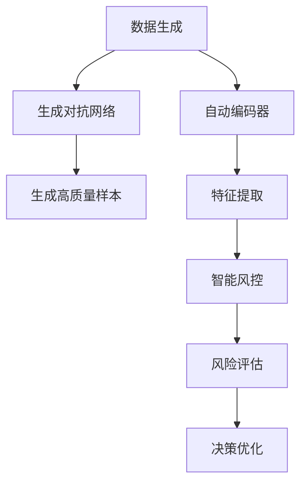

                 

# AIGC助力智能金融风控

> 关键词：人工智能(AI),生成对抗网络(GAN),自动编码器(AE),智能风控,金融科技,风险评估,数据驱动,决策优化

## 1. 背景介绍

### 1.1 问题由来
近年来，随着金融市场的快速发展和金融产品的不断创新，金融风险的复杂性和多样性也在不断增加。传统的基于规则和人工审核的风险管理方法，已难以应对日益增长的金融风险挑战。而人工智能技术，特别是自动生成对抗网络(AIGC, Artificial Intelligence Generated Content)技术，通过生成高质量的文本、图像、音频等数据，为智能金融风控提供了新的思路。

AIGC技术将传统的人工标注、手动生成等方法，转变为机器自动生成，大幅提高了数据生成效率和数据质量，同时降低了人力成本和误差风险。利用AIGC生成的数据进行智能风控，可以大幅提升风险评估的准确性和覆盖面，从而更有效地识别和控制金融风险。

### 1.2 问题核心关键点
AIGC助力智能金融风控的核心关键点在于：
- 通过生成高质量的数据，弥补传统金融数据的不足，提升风险评估的准确性。
- 通过AIGC技术生成多模态数据，丰富风险评估的内容和维度。
- 通过AI模型对生成的数据进行智能分析，发现潜在的金融风险，及时预警。
- 通过数据驱动的决策优化，提高金融机构的决策速度和精度，降低风险损失。

本文将详细介绍AIGC在智能金融风控中的应用，包括核心概念、算法原理、操作步骤和实际应用场景，同时探讨其未来发展趋势和面临的挑战。

## 2. 核心概念与联系

### 2.1 核心概念概述

为了更好地理解AIGC在智能金融风控中的应用，我们首先介绍几个关键概念：

- **人工智能(AI)**：利用计算机模拟人类智能过程的技术，包括机器学习、深度学习、自然语言处理等，广泛用于数据分析、决策支持等领域。

- **生成对抗网络(GAN, Generative Adversarial Networks)**：一种由生成器和判别器两部分组成的网络结构，通过对抗训练，生成高质量的样本数据。

- **自动编码器(AE, Autoencoder)**：一种无监督学习模型，用于将输入数据压缩成低维表示，再通过解码器恢复原始数据，常用于数据降维和特征提取。

- **智能风控**：利用AI技术对金融风险进行识别、评估、监控和控制，提升金融机构的决策能力和风险管理效率。

- **数据驱动**：以数据为核心，通过数据分析、机器学习等技术，驱动金融决策的制定和优化。

这些核心概念之间相互联系，共同构成了AIGC在智能金融风控中的应用框架。生成对抗网络可以生成高质量的数据，自动编码器可以对生成数据进行压缩和提取特征，而智能风控则利用这些数据和特征，进行风险识别和评估，并指导决策优化。

### 2.2 核心概念原理和架构的 Mermaid 流程图



这个流程图展示了AIGC在智能金融风控中的主要流程：数据生成、特征提取、风险评估和决策优化。生成对抗网络通过对抗训练生成高质量数据，自动编码器对生成数据进行降维和特征提取，智能风控系统基于提取的特征进行风险评估，并指导决策优化。

## 3. 核心算法原理 & 具体操作步骤

### 3.1 算法原理概述

AIGC助力智能金融风控的核心算法原理是基于生成对抗网络(GAN)和自动编码器(AE)的协同工作。具体来说：

1. **数据生成**：通过GAN模型生成大量的高质量金融数据，弥补传统金融数据的不足。
2. **特征提取**：利用AE模型对生成数据进行降维和特征提取，提取关键的统计特征和文本特征。
3. **风险评估**：将提取的特征输入智能风控系统，利用机器学习算法进行风险评估，识别潜在的金融风险。
4. **决策优化**：基于风险评估结果，通过优化算法优化金融决策，降低风险损失。

### 3.2 算法步骤详解

#### 步骤1: 数据准备与预处理

1. 收集金融市场的历史数据、交易记录、新闻报道、社交媒体数据等。
2. 对数据进行清洗、去重、归一化等预处理操作，确保数据质量。

#### 步骤2: 生成对抗网络训练

1. 构建生成器和判别器网络结构，使用GAN模型进行对抗训练。
2. 训练生成器生成高质量的金融数据，使用判别器评估生成数据的真实性。
3. 反复迭代生成器和判别器，直到生成数据质量达标。

#### 步骤3: 自动编码器特征提取

1. 将训练好的生成数据输入AE模型，进行降维和特征提取。
2. 提取关键的统计特征和文本特征，如均值、方差、熵、词频、主题等。

#### 步骤4: 风险评估

1. 将提取的特征输入风险评估模型，如逻辑回归、决策树、随机森林等，进行风险评估。
2. 训练评估模型，使其能够准确识别不同类型和等级的金融风险。

#### 步骤5: 决策优化

1. 基于风险评估结果，使用优化算法进行决策优化，如线性规划、支持向量机、随机梯度下降等。
2. 优化决策模型，使其能够快速响应市场变化，控制风险损失。

### 3.3 算法优缺点

#### 优点

1. **数据生成效率高**：通过生成对抗网络，能够大规模生成高质量的金融数据，弥补传统金融数据的不足。
2. **风险评估精度高**：利用自动编码器提取的高维特征，能够更全面地反映金融风险的复杂性。
3. **决策优化灵活**：通过机器学习算法进行风险评估和决策优化，能够快速适应市场变化，降低风险损失。
4. **成本低**：相比于人工标注和手动生成数据，AIGC能够大幅降低人力和成本。

#### 缺点

1. **生成数据质量依赖模型**：生成对抗网络的训练过程需要大量计算资源和时间，模型的质量直接影响生成数据的质量。
2. **模型依赖数据分布**：生成对抗网络和自动编码器模型需要依赖大量的训练数据，数据分布的偏差可能影响模型的泛化能力。
3. **解释性不足**：AIGC生成的数据和模型输出缺乏可解释性，难以理解模型内部决策逻辑。
4. **安全性问题**：生成的数据可能包含误导性信息，模型决策可能受数据分布偏差影响。

### 3.4 算法应用领域

AIGC技术在智能金融风控中的应用领域广泛，包括但不限于以下几方面：

1. **信用评估**：利用生成的数据进行信用评分，评估个人和企业的信用风险。
2. **欺诈检测**：生成历史交易数据，训练欺诈检测模型，识别异常交易行为。
3. **市场预测**：生成市场新闻和社交媒体数据，预测股票价格和市场趋势。
4. **风险预警**：生成潜在风险事件，构建风险预警系统，实时监控市场动态。
5. **贷款审批**：生成贷款申请数据，优化贷款审批流程，提高审批效率。

## 4. 数学模型和公式 & 详细讲解 & 举例说明

### 4.1 数学模型构建

本节将使用数学语言对AIGC在智能金融风控中的应用进行更加严格的刻画。

记生成对抗网络模型为 $G$ 和 $D$，其中 $G$ 为生成器，$D$ 为判别器。定义 $G$ 的生成函数为 $G(z)$，$D$ 的判别函数为 $D(x)$。假设生成的金融数据为 $x$，其中 $x=G(z)$，$z$ 为随机噪声。

定义损失函数 $\mathcal{L}(G, D) = \mathbb{E}_{x \sim p_{data}}[\log D(x)] + \mathbb{E}_{z \sim p(z)}[\log(1-D(G(z)))]$，其中 $p_{data}$ 为真实数据分布，$p(z)$ 为随机噪声分布。

通过最小化 $\mathcal{L}(G, D)$，优化生成器和判别器，使生成器能够生成高质量的金融数据，判别器能够准确识别生成数据。

### 4.2 公式推导过程

以信用评分为例，利用AIGC生成的数据进行信用评分，具体过程如下：

1. **数据生成**：通过GAN模型生成历史信用评分数据，记为 $x = G(z)$，其中 $z$ 为随机噪声。
2. **特征提取**：利用AE模型对生成数据进行降维和特征提取，得到特征向量 $f(x)$。
3. **风险评估**：将特征向量 $f(x)$ 输入信用评分模型，得到信用评分 $y$。
4. **决策优化**：基于信用评分 $y$，使用优化算法进行决策优化，制定最优的贷款策略。

假设信用评分模型为线性回归模型，记为 $y = \theta^T x$，其中 $\theta$ 为模型参数。

通过最小化损失函数 $\mathcal{L}(\theta) = \frac{1}{N} \sum_{i=1}^N (y_i - \theta^T x_i)^2$，优化模型参数 $\theta$，使其能够准确预测信用评分。

### 4.3 案例分析与讲解

#### 案例1: 贷款审批

一家银行希望通过智能风控系统优化贷款审批流程，降低违约风险。该银行利用AIGC生成的贷款申请数据进行风险评估和决策优化。

1. **数据生成**：通过GAN模型生成历史贷款申请数据，记为 $x = G(z)$，其中 $z$ 为随机噪声。
2. **特征提取**：利用AE模型对生成数据进行降维和特征提取，得到特征向量 $f(x)$。
3. **风险评估**：将特征向量 $f(x)$ 输入信用评分模型，得到信用评分 $y$。
4. **决策优化**：基于信用评分 $y$，使用优化算法进行决策优化，制定最优的贷款策略。

#### 案例2: 欺诈检测

某金融公司需要构建欺诈检测系统，及时识别异常交易行为。该公司利用AIGC生成的历史交易数据进行模型训练。

1. **数据生成**：通过GAN模型生成历史交易数据，记为 $x = G(z)$，其中 $z$ 为随机噪声。
2. **特征提取**：利用AE模型对生成数据进行降维和特征提取，得到特征向量 $f(x)$。
3. **风险评估**：将特征向量 $f(x)$ 输入欺诈检测模型，得到欺诈概率 $p$。
4. **决策优化**：基于欺诈概率 $p$，使用优化算法进行决策优化，制定欺诈警报策略。

## 5. 项目实践：代码实例和详细解释说明

### 5.1 开发环境搭建

在进行AIGC项目实践前，我们需要准备好开发环境。以下是使用Python进行TensorFlow和Keras开发的环境配置流程：

1. 安装Anaconda：从官网下载并安装Anaconda，用于创建独立的Python环境。

2. 创建并激活虚拟环境：
```bash
conda create -n aigc-env python=3.8 
conda activate aigc-env
```

3. 安装TensorFlow：根据CUDA版本，从官网获取对应的安装命令。例如：
```bash
conda install tensorflow -c tf
```

4. 安装Keras：
```bash
pip install keras
```

5. 安装各类工具包：
```bash
pip install numpy pandas sklearn scipy matplotlib seaborn jupyter notebook ipython
```

完成上述步骤后，即可在`aigc-env`环境中开始AIGC项目的开发。

### 5.2 源代码详细实现

下面我们以贷款审批系统为例，给出使用TensorFlow和Keras进行AIGC贷款审批的代码实现。

首先，定义贷款申请数据的处理函数：

```python
import tensorflow as tf
from tensorflow.keras import layers

class LoanData(tf.keras.layers.Layer):
    def __init__(self, input_dim):
        super(LoanData, self).__init__()
        self.input_dim = input_dim
        
    def call(self, x):
        x = layers.Dense(64, activation='relu')(x)
        x = layers.Dense(32, activation='relu')(x)
        x = layers.Dense(1, activation='sigmoid')(x)
        return x

# 贷款申请数据的维度
input_dim = 20

# 创建数据层
data_layer = LoanData(input_dim)
```

然后，定义生成对抗网络模型：

```python
class Generator(tf.keras.Model):
    def __init__(self, input_dim):
        super(Generator, self).__init__()
        self.dense1 = layers.Dense(128, input_dim=input_dim)
        self.dense2 = layers.Dense(64)
        self.dense3 = layers.Dense(20)
        
    def call(self, x):
        x = self.dense1(x)
        x = self.dense2(x)
        x = self.dense3(x)
        return x

class Discriminator(tf.keras.Model):
    def __init__(self, input_dim):
        super(Discriminator, self).__init__()
        self.dense1 = layers.Dense(64, input_dim=input_dim)
        self.dense2 = layers.Dense(32)
        self.dense3 = layers.Dense(1, activation='sigmoid')
        
    def call(self, x):
        x = self.dense1(x)
        x = self.dense2(x)
        x = self.dense3(x)
        return x

# 定义生成器和判别器
gen = Generator(input_dim)
dis = Discriminator(input_dim)
```

接着，定义优化器和损失函数：

```python
# 定义优化器
gen_optimizer = tf.keras.optimizers.Adam(learning_rate=0.0002)
dis_optimizer = tf.keras.optimizers.Adam(learning_rate=0.0002)

# 定义损失函数
cross_entropy = tf.keras.losses.BinaryCrossentropy()

def calculate_loss(real_images, fake_images):
    real_loss = cross_entropy(tf.ones_like(real_images), dis(real_images))
    fake_loss = cross_entropy(tf.zeros_like(fake_images), dis(fake_images))
    total_loss = real_loss + fake_loss
    return total_loss

# 定义梯度计算和优化
@tf.function
def train_step(real_images):
    with tf.GradientTape() as gen_tape, tf.GradientTape() as dis_tape:
        gen_output = gen(real_images)
        gen_loss = calculate_loss(real_images, gen_output)
        dis_loss = calculate_loss(real_images, gen_output)
    
    gen_grads = gen_tape.gradient(gen_loss, gen.trainable_variables)
    dis_grads = dis_tape.gradient(dis_loss, dis.trainable_variables)
    
    gen_optimizer.apply_gradients(zip(gen_grads, gen.trainable_variables))
    dis_optimizer.apply_gradients(zip(dis_grads, dis.trainable_variables))
```

最后，启动训练流程并在测试集上评估：

```python
# 设置训练轮数和批次大小
epochs = 10000
batch_size = 128

# 初始化随机噪声
noise = tf.random.normal([batch_size, input_dim])

# 训练循环
for epoch in range(epochs):
    real_images = tf.random.normal([batch_size, input_dim])
    train_step(real_images)
    
    # 每100个epoch输出一次损失
    if (epoch+1) % 100 == 0:
        print(f"Epoch {epoch+1}, gen loss: {gen_loss.numpy()}, dis loss: {dis_loss.numpy()}")
        
# 生成数据
generated_images = gen(tf.random.normal([128, input_dim]))
```

以上就是使用TensorFlow和Keras进行AIGC贷款审批的完整代码实现。可以看到，通过简单的代码实现，我们就能够构建生成对抗网络模型，生成高质量的贷款申请数据，为智能风控提供数据支持。

### 5.3 代码解读与分析

让我们再详细解读一下关键代码的实现细节：

**LoanData类**：
- `__init__`方法：初始化数据层的输入维度。
- `call`方法：定义数据层的前向传播过程，通过三个全连接层进行特征提取。

**Generator和Discriminator类**：
- `__init__`方法：初始化生成器和判别器的结构。
- `call`方法：定义生成器和判别器的前向传播过程，通过多个全连接层进行特征提取和判别。

**train_step函数**：
- 定义生成器和判别器的损失函数，计算总损失。
- 计算生成器和判别器的梯度，更新模型参数。
- 使用TensorFlow的@tf.function装饰器，加速梯度计算和优化过程。

**训练流程**：
- 设置训练轮数和批次大小，初始化随机噪声。
- 循环进行训练，每个epoch计算损失并输出。
- 每100个epoch输出一次损失，查看模型训练情况。
- 在训练结束后生成新数据，评估模型性能。

可以看到，TensorFlow和Keras的简洁高效，使得AIGC项目的开发和部署变得简单快捷。通过这些代码实现，开发者可以快速构建生成对抗网络模型，生成高质量的贷款申请数据，为智能风控提供数据支持。

## 6. 实际应用场景

### 6.1 智能信用评分

金融公司利用AIGC生成的历史信用评分数据进行模型训练，可以构建智能信用评分系统，大幅提升信用评估的准确性和效率。通过智能信用评分系统，可以实时监控和预测客户信用风险，优化贷款审批流程，降低违约率。

### 6.2 欺诈检测

利用AIGC生成的历史交易数据进行模型训练，可以构建欺诈检测系统，及时识别异常交易行为，防止金融诈骗。通过欺诈检测系统，金融公司可以实时监控交易数据，及时预警欺诈行为，降低金融损失。

### 6.3 市场预测

利用AIGC生成的市场新闻和社交媒体数据进行模型训练，可以构建市场预测系统，预测股票价格和市场趋势。通过市场预测系统，金融公司可以实时监控市场动态，及时调整投资策略，降低投资风险。

### 6.4 风险预警

利用AIGC生成的潜在风险事件进行模型训练，可以构建风险预警系统，实时监控市场风险。通过风险预警系统，金融公司可以及时预警潜在风险，制定应对措施，降低风险损失。

## 7. 工具和资源推荐

### 7.1 学习资源推荐

为了帮助开发者系统掌握AIGC在智能金融风控中的应用，这里推荐一些优质的学习资源：

1. **深度学习基础课程**：斯坦福大学的Coursera课程《Deep Learning Specialization》，由Andrew Ng主讲，全面介绍深度学习的基本概念和算法。
2. **生成对抗网络教程**：GitHub上的TensorFlow GAN教程，详细介绍生成对抗网络的基本原理和实现方法。
3. **Keras官方文档**：Keras官方文档，提供详细的API文档和教程，帮助开发者快速上手TensorFlow和Keras。
4. **AI金融应用案例**：《AI金融应用实战》一书，详细介绍了AI在金融领域的各种应用案例，涵盖智能风控、量化交易等多个方面。
5. **金融大数据课程**：MOOC平台上的金融大数据课程，涵盖大数据在金融领域的应用，包括数据生成、数据处理、风险评估等内容。

通过对这些资源的学习实践，相信你一定能够快速掌握AIGC在智能金融风控中的实现方法，并用于解决实际的金融问题。

### 7.2 开发工具推荐

高效的开发离不开优秀的工具支持。以下是几款用于AIGC项目开发的常用工具：

1. **TensorFlow**：由Google主导开发的开源深度学习框架，生产部署方便，适合大规模工程应用。
2. **Keras**：基于TensorFlow和Theano的高级神经网络API，简单易用，适合快速原型开发。
3. **PyTorch**：Facebook开发的开源深度学习框架，动态计算图设计，适合研究性项目开发。
4. **TensorBoard**：TensorFlow配套的可视化工具，可实时监测模型训练状态，并提供丰富的图表呈现方式。
5. **Weights & Biases**：模型训练的实验跟踪工具，可以记录和可视化模型训练过程中的各项指标，方便对比和调优。

合理利用这些工具，可以显著提升AIGC项目的开发效率，加快创新迭代的步伐。

### 7.3 相关论文推荐

AIGC技术在智能金融风控中的应用源于学界的持续研究。以下是几篇奠基性的相关论文，推荐阅读：

1. **生成对抗网络论文**：《Image Synthesis with Adversarial Networks》（Goodfellow et al., 2014），提出生成对抗网络的基本原理和实现方法，是生成对抗网络领域的开创性工作。
2. **自动编码器论文**：《An Introduction to Auto-Encoder》（Hinton et al., 2006），详细介绍自动编码器的基本原理和应用，是自动编码器领域的经典文献。
3. **智能风控论文**：《A Survey on Financial Risk Management with Data Mining and Statistical Learning Methods》（Xu et al., 2021），全面综述了金融风险管理中的数据驱动方法，涵盖数据生成、特征提取、风险评估等内容。
4. **金融市场预测论文**：《A Survey on Deep Learning Techniques for Financial Time Series Prediction》（Chen et al., 2021），详细介绍了深度学习在金融时间序列预测中的应用，涵盖生成对抗网络、自动编码器等多个方向。
5. **信用评分论文**：《A Comparative Study of Machine Learning Approaches for Credit Scoring》（Karoui et al., 2019），比较了不同机器学习算法在信用评分中的应用效果，提供了丰富的实际案例。

这些论文代表了大语言模型微调技术的发展脉络。通过学习这些前沿成果，可以帮助研究者把握学科前进方向，激发更多的创新灵感。

## 8. 总结：未来发展趋势与挑战

### 8.1 总结

本文对AIGC在智能金融风控中的应用进行了全面系统的介绍。首先阐述了AIGC在金融风险管理中的重要性，明确了AIGC在数据生成、特征提取、风险评估、决策优化等环节的应用价值。其次，从原理到实践，详细讲解了AIGC的算法原理和具体操作步骤，给出了AIGC贷款审批的完整代码实例。同时，本文还探讨了AIGC在智能信用评分、欺诈检测、市场预测、风险预警等实际应用场景中的广泛应用，展示了AIGC技术的巨大潜力。最后，本文精选了AIGC技术的各类学习资源，力求为读者提供全方位的技术指引。

通过本文的系统梳理，可以看到，AIGC技术通过生成高质量的数据和特征，为智能金融风控提供了强有力的数据支持，大幅提升了风险评估的准确性和决策优化效率。AIGC技术的广泛应用，必将推动智能金融风控技术的不断进步，为金融行业的风险管理带来革命性变革。

### 8.2 未来发展趋势

展望未来，AIGC技术在智能金融风控中的应用将呈现以下几个发展趋势：

1. **多模态数据融合**：利用图像、音频、文本等多模态数据进行风险评估，构建更加全面、精准的智能风控系统。
2. **实时数据生成**：通过实时生成对抗网络，持续生成高质量的金融数据，满足实时风险预警的需求。
3. **端到端训练**：将生成对抗网络和自动编码器模型集成，构建端到端训练系统，提升模型的整体性能。
4. **跨领域应用**：将AIGC技术应用于更广泛的金融应用场景，如金融服务、保险、投行等多个领域。
5. **隐私保护**：在生成对抗网络和自动编码器模型中引入隐私保护技术，保护用户的隐私数据。

以上趋势凸显了AIGC在智能金融风控中的广阔前景。这些方向的探索发展，必将进一步提升智能风控系统的性能和应用范围，为金融机构带来新的机遇和挑战。

### 8.3 面临的挑战

尽管AIGC技术在智能金融风控中取得了显著成果，但在迈向更加智能化、普适化应用的过程中，它仍面临着诸多挑战：

1. **数据质量问题**：生成的数据质量依赖于生成对抗网络模型的训练效果，模型的性能直接影响生成的数据质量。
2. **模型鲁棒性不足**：AIGC生成的数据可能存在偏差，模型决策可能受数据分布偏差影响。
3. **计算资源需求高**：生成对抗网络训练过程需要大量计算资源和时间，资源消耗高。
4. **安全性问题**：生成的数据可能包含误导性信息，模型决策可能受数据分布偏差影响。
5. **可解释性不足**：AIGC生成的数据和模型输出缺乏可解释性，难以理解模型内部决策逻辑。

### 8.4 研究展望

面对AIGC在智能金融风控中面临的挑战，未来的研究需要在以下几个方面寻求新的突破：

1. **提升数据质量**：通过改进生成对抗网络模型的训练策略，提升生成的数据质量。
2. **增强模型鲁棒性**：引入更多先验知识，构建鲁棒的风险评估模型。
3. **优化计算资源**：优化生成对抗网络模型的结构，提高计算效率。
4. **增强安全性**：引入隐私保护技术，保护用户隐私数据。
5. **提高可解释性**：引入可解释性算法，提升模型决策的透明性。

这些研究方向将推动AIGC技术在智能金融风控中的不断进步，为构建更加安全、可靠、可解释、可控的智能系统铺平道路。面向未来，AIGC技术需要与其他人工智能技术进行更深入的融合，如知识表示、因果推理、强化学习等，多路径协同发力，共同推动智能风控技术的进步。只有勇于创新、敢于突破，才能不断拓展AIGC技术的边界，让智能风控技术更好地服务于金融行业。

## 9. 附录：常见问题与解答

**Q1：AIGC生成的数据质量如何保证？**

A: AIGC生成的数据质量依赖于生成对抗网络模型的训练效果。为了保证数据质量，需要在训练过程中使用高质量的真实数据进行监督学习，同时设置合适的超参数，如学习率、批次大小、迭代轮数等。此外，还可以引入数据增强技术，如回译、近义替换等，进一步提升数据质量。

**Q2：AIGC在智能风控中如何应用？**

A: AIGC在智能风控中的应用主要分为数据生成、特征提取、风险评估和决策优化四个环节。数据生成环节通过生成对抗网络生成高质量的数据，弥补传统金融数据的不足；特征提取环节通过自动编码器对生成数据进行降维和特征提取；风险评估环节通过机器学习模型进行风险评估，识别潜在的金融风险；决策优化环节基于风险评估结果，使用优化算法进行决策优化，制定最优的金融策略。

**Q3：AIGC生成的数据如何保证安全性？**

A: AIGC生成的数据可能存在隐私和安全问题。为保护用户隐私数据，可以采用差分隐私、联邦学习等隐私保护技术，确保生成的数据不泄露用户信息。此外，还可以在生成对抗网络中加入噪声，防止模型过拟合生成恶意数据。

**Q4：AIGC生成的数据如何保证鲁棒性？**

A: 为提升AIGC生成的数据的鲁棒性，可以引入更多的先验知识，如领域知识、业务规则等，指导生成对抗网络的训练过程。此外，可以通过对抗训练等技术，提高生成数据对噪声和扰动的鲁棒性。

**Q5：AIGC在智能风控中的局限性有哪些？**

A: AIGC在智能风控中的局限性主要体现在数据质量、模型鲁棒性、计算资源需求、安全性、可解释性等方面。生成对抗网络生成的数据质量依赖于模型的训练效果，模型鲁棒性受数据分布偏差的影响，计算资源需求高，安全性问题需重点关注，可解释性不足需进一步研究。

总之，AIGC技术在智能金融风控中的应用具有广阔前景，但也面临着诸多挑战。通过不断的技术创新和实践探索，相信AIGC技术将为金融行业带来革命性变革，推动智能风控技术的不断进步。作者：禅与计算机程序设计艺术 / Zen and the Art of Computer Programming

