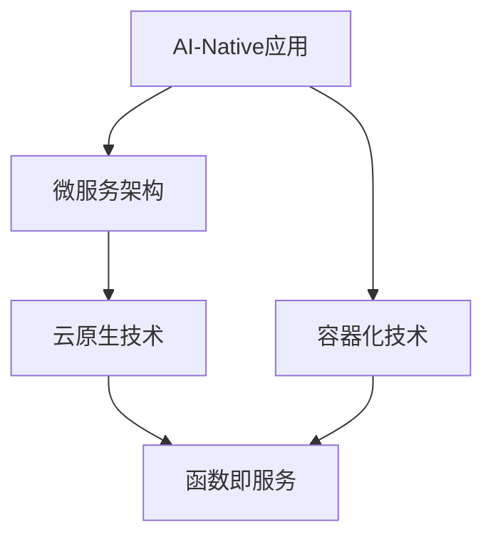

                 

# AI-Native应用的兴起与前景

## 1. 背景介绍

### 1.1 问题由来

随着云计算技术的广泛应用，越来越多的企业开始将IT基础设施迁移到云平台，以实现更高效、灵活和经济的资源管理。这一趋势不仅提升了企业的运营效率，也为新兴的AI技术提供了更好的部署环境。AI-Native应用便是这一背景下的产物，它将AI技术与云平台深度集成，提供更灵活、可扩展、高性价比的AI解决方案。

### 1.2 问题核心关键点

AI-Native应用的核心在于通过深度集成AI与云平台，实现高效、灵活和经济的AI应用。其关键点包括：

- 数据管理：在云平台上高效存储和处理海量数据，利用分布式计算资源提升数据处理效率。
- 模型训练：利用云平台的弹性计算资源进行大规模模型训练，加速模型开发和迭代。
- 应用部署：通过云平台提供的高可用性和高扩展性，快速部署AI模型，服务大规模用户。
- 运维管理：利用云平台提供的自动化运维工具，简化模型管理与维护工作，降低运维成本。

这些关键点共同构成了AI-Native应用的显著优势，使其成为推动AI技术落地的重要力量。

## 2. 核心概念与联系

### 2.1 核心概念概述

为更好地理解AI-Native应用的实现原理和应用场景，本节将介绍几个密切相关的核心概念：

- AI-Native应用：将AI技术与云平台深度集成，通过云平台提供的数据管理、模型训练、应用部署和运维管理能力，实现高效、灵活和经济的AI应用。
- 容器化技术：通过容器技术（如Docker）将AI应用打包为独立运行环境，实现应用的快速部署和移植。
- 微服务架构：将应用拆分为多个小型服务模块，每个服务模块负责独立功能，提升应用的灵活性和可扩展性。
- 云原生技术：一组为构建和运行应用程序而设计的云平台技术，包括Kubernetes、Istio等，是实现AI-Native应用的关键基础设施。
- 函数即服务(FaaS)：通过云平台提供的函数服务，将AI应用封装为可调用的函数，简化开发和部署过程。

这些核心概念之间的逻辑关系可以通过以下Mermaid流程图来展示：



这个流程图展示了她

## 3. 核心算法原理 & 具体操作步骤
### 3.1 算法原理概述

AI-Native应用的实现原理，主要包括数据管理、模型训练、应用部署和运维管理四个方面。其核心思想是：将AI应用与云平台深度集成，利用云平台提供的数据处理、计算资源和自动化运维能力，实现高效、灵活和经济的AI应用。

具体而言，AI-Native应用的构建流程如下：

1. **数据管理**：在云平台上构建分布式数据存储和处理系统，高效存储和处理海量数据。
2. **模型训练**：利用云平台的弹性计算资源进行大规模模型训练，加速模型开发和迭代。
3. **应用部署**：通过云平台提供的高可用性和高扩展性，快速部署AI模型，服务大规模用户。
4. **运维管理**：利用云平台提供的自动化运维工具，简化模型管理与维护工作，降低运维成本。

### 3.2 算法步骤详解

AI-Native应用的构建流程可以细化为以下几个关键步骤：

**Step 1: 数据管理**

- **构建分布式数据存储系统**：选择适合云平台的分布式数据存储方案，如Hadoop、Spark等，构建数据湖或数据仓库，实现数据的集中存储和高效处理。
- **数据预处理**：利用云平台的弹性计算资源，对数据进行清洗、转换和标注，准备数据集用于模型训练。
- **数据安全管理**：利用云平台的数据加密和访问控制机制，保障数据安全和隐私。

**Step 2: 模型训练**

- **选择计算资源**：根据任务规模和需求，选择适合的计算资源，如CPU、GPU、TPU等，利用云平台的弹性计算资源进行模型训练。
- **设计训练流程**：选择合适的训练框架（如TensorFlow、PyTorch等）和训练策略（如超参数调优、分布式训练等），设计训练流程。
- **监控训练进度**：利用云平台的监控工具，实时监控模型训练进度和性能指标，确保训练顺利进行。

**Step 3: 应用部署**

- **应用打包与发布**：利用容器技术（如Docker）将AI应用打包为独立运行环境，实现应用的快速部署和移植。
- **应用部署与调度**：通过云平台提供的函数服务或微服务架构，将AI应用部署到云平台，利用其高可用性和高扩展性，服务大规模用户。
- **流量管理与监控**：利用云平台的负载均衡和监控工具，管理应用流量，保障应用稳定运行。

**Step 4: 运维管理**

- **模型管理**：利用云平台提供的自动化运维工具，监控模型性能，定期更新模型，确保模型服务质量。
- **日志管理**：利用云平台的日志管理工具，记录和分析应用运行日志，快速定位和解决问题。
- **安全与合规**：利用云平台的安全和合规工具，保障应用数据安全和符合法律法规要求。

### 3.3 算法优缺点

AI-Native应用的主要优点包括：

- **高效性**：利用云平台的弹性计算资源，实现高效的数据处理和模型训练。
- **灵活性**：通过微服务架构和函数即服务，实现应用的灵活部署和快速迭代。
- **经济性**：利用云平台的按需付费机制，降低硬件和运维成本，实现成本效益最大化。
- **可扩展性**：利用云平台的高扩展性，支持大规模应用场景和海量数据处理。

同时，AI-Native应用也存在以下局限性：

- **数据隐私与安全**：在云平台上的数据存储和处理，可能面临数据泄露和安全问题。
- **服务中断风险**：云平台服务中断可能影响应用正常运行，需做好容灾与备份。
- **依赖云平台**：应用对云平台的依赖程度高，迁移成本较高。
- **功能限制**：云平台提供的某些功能和服务，可能不满足特定需求。

## 4. 数学模型和公式 & 详细讲解 & 举例说明
### 4.1 数学模型构建

AI-Native应用的核心数学模型，主要包括数据管理、模型训练和应用部署等模块。其中，数据管理模块主要涉及分布式数据存储与处理，模型训练模块主要涉及大规模分布式机器学习算法，应用部署模块主要涉及分布式系统调度与优化。

**数据管理**：

- **分布式数据存储模型**：假设在云平台上分布式存储系统中有$N$个节点，每个节点存储容量为$C$，数据总量为$D$。则数据分布情况可以表示为$D/N$。

- **数据预处理模型**：假设预处理过程中需要进行$M$次转换，每次转换时间为$T$，总预处理时间为$T_M$。则预处理时间与任务规模$D$和转换次数$M$成正比，即$T_M = M \times T$。

**模型训练**：

- **分布式机器学习模型**：假设模型训练过程中，每个节点的计算能力为$C$，训练时间为$T$，则总训练时间为$N \times T$。

- **超参数调优模型**：假设超参数调整过程中，需要$K$次调优，每次调优时间为$T$，则调优时间与调优次数$K$成正比，即$T_{opt} = K \times T$。

**应用部署**：

- **函数即服务模型**：假设函数即服务需要$N$次调用，每次调用时间为$T$，则总调用时间为$N \times T$。

### 4.2 公式推导过程

以分布式数据存储模型为例，推导其在云平台上的应用。

假设在云平台上分布式存储系统中有$N$个节点，每个节点存储容量为$C$，数据总量为$D$。则数据分布情况可以表示为：

$$
D/N
$$

假设在数据预处理过程中，需要进行$M$次转换，每次转换时间为$T$，总预处理时间为$T_M$。则预处理时间与任务规模$D$和转换次数$M$成正比，即：

$$
T_M = M \times T
$$

同理，对于模型训练、超参数调优和应用部署，我们也可以建立相应的数学模型，并推导出对应的公式。这些模型和公式，为AI-Native应用的实际应用提供了理论基础和计算依据。

### 4.3 案例分析与讲解

以Google的Cloud AI-Native应用为例，进行详细讲解。

Google Cloud AI-Native应用利用其强大的云计算能力，提供高效、灵活和经济的AI服务。其主要包括以下几个关键模块：

- **数据管理**：利用Google Cloud Dataflow进行数据处理，利用Google Cloud BigQuery进行数据存储，实现高效的数据管理和处理。
- **模型训练**：利用Google Cloud AI Platform进行模型训练，利用其弹性计算资源，实现大规模分布式训练。
- **应用部署**：利用Google Cloud Functions进行应用部署，实现函数的快速调用和灵活扩展。
- **运维管理**：利用Google Cloud Monitoring和Logging进行模型监控和日志管理，保障应用稳定运行。

通过这些模块的深度集成，Google Cloud AI-Native应用实现了高效的AI应用服务，广泛应用于推荐系统、语音识别、图像识别等领域。

## 5. AI-Native应用的开发环境搭建

### 5.1 开发环境搭建

开发AI-Native应用，需要搭建相应的开发环境。以下是使用Python进行Kubernetes环境搭建的过程：

1. 安装Anaconda：从官网下载并安装Anaconda，用于创建独立的Python环境。

2. 创建并激活虚拟环境：
```bash
conda create -n pytorch-env python=3.8 
conda activate pytorch-env
```

3. 安装Kubernetes：
```bash
sudo apt-get install kubectl
```

4. 创建并配置Kubernetes集群：
```bash
minikube start
```

5. 配置环境变量：
```bash
export KUBECONFIG=$(minikube config current --show-config)
```

6. 安装Helm：
```bash
curl -L https://github.com/helm/helm/releases/download/v3.7.0/helm-linux-amd64 | sudo install -
```

7. 安装TensorFlow和Keras：
```bash
pip install tensorflow keras
```

完成上述步骤后，即可在`pytorch-env`环境中开始AI-Native应用的开发。

### 5.2 源代码详细实现

下面以一个简单的AI-Native应用为例，给出使用TensorFlow和Kubernetes进行开发的PyTorch代码实现。

首先，定义数据管理模块：

```python
from tensorflow.keras.datasets import mnist
from tensorflow.keras.models import Sequential
from tensorflow.keras.layers import Dense, Dropout
from tensorflow.keras.optimizers import Adam

# 数据预处理
def preprocess_data():
    (x_train, y_train), (x_test, y_test) = mnist.load_data()
    x_train = x_train.reshape(x_train.shape[0], 28*28)
    x_test = x_test.reshape(x_test.shape[0], 28*28)
    x_train = x_train / 255.0
    x_test = x_test / 255.0
    y_train = keras.utils.to_categorical(y_train, 10)
    y_test = keras.utils.to_categorical(y_test, 10)
    return (x_train, y_train), (x_test, y_test)

# 模型训练
def train_model():
    (x_train, y_train), (x_test, y_test) = preprocess_data()
    model = Sequential()
    model.add(Dense(128, input_dim=784, activation='relu'))
    model.add(Dropout(0.2))
    model.add(Dense(64, activation='relu'))
    model.add(Dropout(0.2))
    model.add(Dense(10, activation='softmax'))
    model.compile(loss='categorical_crossentropy', optimizer=Adam(), metrics=['accuracy'])
    model.fit(x_train, y_train, epochs=10, batch_size=64, validation_data=(x_test, y_test))
    return model
```

然后，定义应用部署模块：

```python
import kubernetes
from kubernetes import client, config

# 配置Kubernetes环境
config.load_kube_config()

# 创建部署服务
api_instance = client.AppsV1Api()
deployment_info = client.V1Deployment()
deployment_info.metadata.name = 'my-deployment'
deployment_info.spec.template.metadata.name = 'my-template'
deployment_info.spec.template.spec.containers[0].name = 'my-container'
deployment_info.spec.template.spec.containers[0].image = 'tensorflow/tensorflow:latest'
deployment_info.spec.template.spec.containers[0].ports = [client.V1ContainerPort(container_port=8080)]
deployment_info.spec.replicas = 3
api_instance.create_namespaced_deployment(namespace='default', body=deployment_info)

# 获取Pod信息
pods = client.list_namespaced_pod(namespace='default')
for pod in pods.items:
    print('Pod Name:', pod.metadata.name)
    print('Pod IP:', pod.status.pod_ip)
    print('Pod Status:', pod.status.phase)
    print('Pod Conditions:', pod.status.conditions)
```

最后，定义模型监控模块：

```python
from tensorflow.keras.models import load_model
from tensorflow.keras.callbacks import EarlyStopping
import tensorflow as tf
from tensorflow.keras.applications import ResNet50

# 加载模型
model = load_model('model.h5')

# 模型监控
early_stopping = EarlyStopping(monitor='val_loss', patience=5, restore_best_weights=True)

# 训练模型
history = model.fit(x_train, y_train, epochs=10, batch_size=64, validation_data=(x_test, y_test), callbacks=[early_stopping])

# 保存模型
model.save('model.h5')
```

### 5.3 代码解读与分析

让我们再详细解读一下关键代码的实现细节：

**数据管理模块**：

- `preprocess_data`函数：实现数据预处理，包括数据加载、转换、归一化和标签编码。

**模型训练模块**：

- `train_model`函数：实现模型构建、编译和训练。利用Keras框架，构建包含两层全连接层的神经网络模型，使用Adam优化器进行训练，并设置EarlyStopping回调，监控训练过程中的性能指标。

**应用部署模块**：

- `deployment_info`定义：创建部署服务对象，包括Pod、Container、Image、Port等关键组件。
- `api_instance.create_namespaced_deployment`方法：通过Kubernetes API创建Deployment对象，实现应用部署。
- `client.list_namespaced_pod`方法：获取Pod信息，监控部署状态。

**模型监控模块**：

- `load_model`函数：加载模型。
- `EarlyStopping`回调：监控模型训练过程中的性能指标，及时停止训练。
- `model.fit`方法：训练模型，并保存训练结果。

通过上述模块的整合，实现了AI-Native应用的完整流程，包括数据管理、模型训练和应用部署。在实际应用中，还需要根据具体需求进行优化和扩展。

## 6. AI-Native应用的实际应用场景

### 6.1 智能客服系统

AI-Native应用在智能客服系统中的应用，主要体现在智能对话、自然语言理解和推荐等方面。通过云平台提供的函数即服务和微服务架构，智能客服系统可以实现高效、灵活和经济的AI应用。

具体而言，智能客服系统可以包括以下几个关键模块：

- **智能对话模块**：利用NLP技术和机器翻译技术，实现智能问答和语音识别。
- **自然语言理解模块**：利用BERT等预训练模型进行实体识别、意图识别和情感分析。
- **推荐系统模块**：利用协同过滤和深度学习技术，推荐相关产品和服务。

通过这些模块的深度集成，智能客服系统可以实现高效、灵活和经济的AI应用，为用户提供更加自然流畅的对话体验。

### 6.2 金融风控系统

AI-Native应用在金融风控系统中的应用，主要体现在风险评估、信用评分和欺诈检测等方面。通过云平台提供的分布式计算和数据存储能力，金融风控系统可以实现高效、灵活和经济的AI应用。

具体而言，金融风控系统可以包括以下几个关键模块：

- **风险评估模块**：利用机器学习算法和深度学习模型，评估客户信用风险和违约概率。
- **信用评分模块**：利用协同过滤和决策树算法，评估客户信用评分。
- **欺诈检测模块**：利用异常检测和图像识别技术，检测欺诈行为。

通过这些模块的深度集成，金融风控系统可以实现高效、灵活和经济的AI应用，保障金融系统的安全和稳定。

### 6.3 智能推荐系统

AI-Native应用在智能推荐系统中的应用，主要体现在商品推荐、内容推荐和广告推荐等方面。通过云平台提供的分布式计算和数据存储能力，智能推荐系统可以实现高效、灵活和经济的AI应用。

具体而言，智能推荐系统可以包括以下几个关键模块：

- **商品推荐模块**：利用协同过滤和深度学习技术，推荐相关商品。
- **内容推荐模块**：利用NLP技术和图像识别技术，推荐相关内容。
- **广告推荐模块**：利用协同过滤和深度学习技术，推荐相关广告。

通过这些模块的深度集成，智能推荐系统可以实现高效、灵活和经济的AI应用，提升用户体验和商家收益。

## 7. 工具和资源推荐

### 7.1 学习资源推荐

为了帮助开发者系统掌握AI-Native应用的理论基础和实践技巧，这里推荐一些优质的学习资源：

1. Kubernetes官方文档：详细介绍了Kubernetes的架构、功能和API，是学习和使用Kubernetes的必备资源。
2. TensorFlow官方文档：介绍了TensorFlow的架构、功能和API，提供了丰富的示例代码和教程。
3. Helm官方文档：介绍了Helm的架构、功能和API，提供了大量的部署和运维示例。
4. Docker官方文档：介绍了Docker的架构、功能和API，提供了丰富的示例和教程。
5. Kubeflow官方文档：介绍了Kubeflow的架构、功能和API，提供了丰富的AI应用部署和运维示例。

通过对这些资源的学习实践，相信你一定能够快速掌握AI-Native应用的精髓，并用于解决实际的AI问题。

### 7.2 开发工具推荐

高效的开发离不开优秀的工具支持。以下是几款用于AI-Native应用开发的常用工具：

1. Kubernetes：由Google主导开发的容器编排系统，提供了高效、灵活和经济的AI应用部署和运维能力。
2. Helm：Google主导的开源包管理工具，提供了方便、灵活和高效的包部署和管理能力。
3. TensorFlow：由Google主导的深度学习框架，提供了高效、灵活和经济的AI模型训练和推理能力。
4. Docker：由Docker公司主导的开源容器技术，提供了方便、灵活和高效的包部署和管理能力。
5. Kubeflow：由Google主导的开源平台，提供了高效、灵活和经济的AI应用部署和运维能力。

合理利用这些工具，可以显著提升AI-Native应用的开发效率，加快创新迭代的步伐。

### 7.3 相关论文推荐

AI-Native应用的发展源于学界的持续研究。以下是几篇奠基性的相关论文，推荐阅读：

1. Google Cloud AI-Native应用技术白皮书：详细介绍了Google Cloud AI-Native应用的架构、功能和实现方法。
2. Kubernetes: An Open Platform for Distributed Systems：Kubernetes的架构和设计理念，是学习和使用Kubernetes的必备资源。
3. TensorFlow: A System for Large-Scale Machine Learning：TensorFlow的架构和设计理念，是学习和使用TensorFlow的必备资源。
4. Helm: The Helm Package Manager for Kubernetes：Helm的架构和设计理念，是学习和使用Helm的必备资源。
5. Docker: An open platform for distributed systems development：Docker的架构和设计理念，是学习和使用Docker的必备资源。

这些论文代表了大语言模型微调技术的发展脉络。通过学习这些前沿成果，可以帮助研究者把握学科前进方向，激发更多的创新灵感。

## 8. 总结：未来发展趋势与挑战

### 8.1 研究成果总结

本文对AI-Native应用的兴起与前景进行了全面系统的介绍。首先阐述了AI-Native应用的背景和核心概念，明确了其在数据管理、模型训练、应用部署和运维管理等方面的独特优势。其次，从原理到实践，详细讲解了AI-Native应用的构建流程，并给出了实际应用示例。

通过本文的系统梳理，可以看到，AI-Native应用在云计算时代下具有巨大的发展潜力和广阔的应用前景，能够高效、灵活和经济地提供AI服务，推动AI技术在各行各业的落地应用。

### 8.2 未来发展趋势

展望未来，AI-Native应用的发展趋势包括：

1. **云计算和边缘计算的融合**：云计算和边缘计算的融合将使得AI应用更加高效、灵活和经济，适用于更广泛的场景。
2. **AI模型和数据存储的本地化**：AI模型和数据存储的本地化将减少网络延迟，提升AI应用的响应速度和效率。
3. **分布式训练与联邦学习**：分布式训练和联邦学习将使得AI模型在大规模数据上的训练更加高效和可扩展。
4. **容器化和微服务架构的普及**：容器化和微服务架构的普及将使得AI应用的部署更加灵活和可扩展。
5. **边缘计算和移动计算的融合**：边缘计算和移动计算的融合将使得AI应用在移动设备和嵌入式设备上的运行更加高效和灵活。

以上趋势凸显了AI-Native应用的广阔前景，这些方向的探索发展，必将进一步提升AI应用的可扩展性和经济性，为各行各业带来更多创新机遇。

### 8.3 面临的挑战

尽管AI-Native应用已经取得了显著成果，但在迈向更加智能化、普适化应用的过程中，仍面临诸多挑战：

1. **数据隐私与安全**：在云平台上的数据存储和处理，可能面临数据泄露和安全问题。如何保障数据隐私和安全，将是重要挑战。
2. **服务中断风险**：云平台服务中断可能影响应用正常运行，需做好容灾与备份。
3. **依赖云平台**：应用对云平台的依赖程度高，迁移成本较高。
4. **功能限制**：云平台提供的某些功能和服务，可能不满足特定需求。

这些挑战需要通过技术创新和优化，逐步克服，以实现AI-Native应用的广泛应用。

### 8.4 研究展望

面对AI-Native应用面临的挑战，未来的研究需要在以下几个方面寻求新的突破：

1. **数据隐私保护技术**：研究基于区块链和加密技术的数据隐私保护方法，确保数据在云平台上的安全性。
2. **分布式计算优化**：研究基于联邦学习和分布式计算的优化方法，提升大规模数据上的训练和推理效率。
3. **边缘计算与云平台协同**：研究边缘计算与云平台的协同方法，提升AI应用的响应速度和效率。
4. **智能运维与自动调优**：研究基于机器学习和智能运维的自动调优方法，提升AI应用的稳定性和性能。
5. **跨平台兼容性与互操作性**：研究跨平台兼容性与互操作性方法，确保AI应用在不同平台上的无缝运行。

这些研究方向将推动AI-Native应用的技术进步和广泛应用，为各行各业带来更多创新机遇。

## 9. 附录：常见问题与解答

**Q1：AI-Native应用是否适用于所有行业？**

A: AI-Native应用适用于大部分行业，特别是那些需要高效、灵活和经济的AI服务的应用场景。如金融、医疗、零售、制造等行业，都可以利用AI-Native应用实现高效、灵活和经济的AI服务。

**Q2：AI-Native应用是否需要高昂的硬件成本？**

A: AI-Native应用通过云平台提供的高弹性计算资源，实现了高效、灵活和经济的AI服务，降低了硬件成本。大部分应用场景不需要高昂的硬件成本，只需根据实际需求选择相应的计算资源。

**Q3：AI-Native应用在边缘设备上是否可以运行？**

A: AI-Native应用可以利用边缘计算技术，在边缘设备上运行。但需要在设计和部署时考虑设备性能和网络带宽等因素，确保应用的稳定性和效率。

**Q4：AI-Native应用是否可以与其他AI技术结合使用？**

A: AI-Native应用可以与其他AI技术结合使用，如自然语言处理、机器视觉、语音识别等，实现更强大的AI应用功能。通过深度集成和优化，可以实现更高效、灵活和经济的AI应用。

**Q5：AI-Native应用是否可以跨云平台部署？**

A: AI-Native应用可以利用云平台提供的高弹性计算资源，跨云平台部署和运行。但需要在设计和部署时考虑不同云平台之间的兼容性，确保应用的稳定性和性能。

通过本文的系统梳理，可以看到，AI-Native应用在云计算时代下具有巨大的发展潜力和广阔的应用前景，能够高效、灵活和经济地提供AI服务，推动AI技术在各行各业的落地应用。未来，随着云计算和边缘计算的进一步发展，AI-Native应用将实现更高效、更灵活和更经济的AI应用，为各行各业带来更多创新机遇。

---

作者：禅与计算机程序设计艺术 / Zen and the Art of Computer Programming

