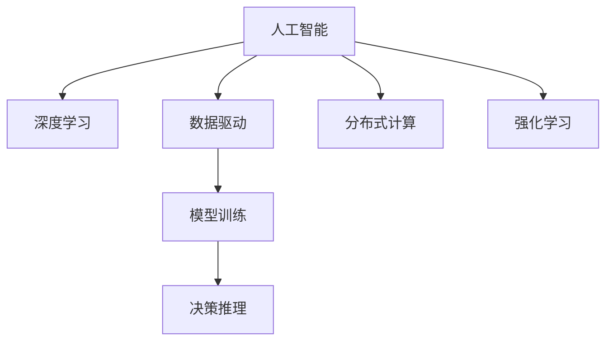

                 

## 1. 背景介绍

### 1.1 问题由来

在过去几十年的科技发展中，计算能力、通信网络和数据存储技术分别被视为推动科技发展进步的“三驾马车”。这三者共同构成了现代信息社会的基础设施，极大地改变了人们的生活和工作方式。

然而，随着人工智能（AI）技术的迅猛发展，特别是深度学习领域的重大突破，人们开始思考“三驾马车”未来可能的替代者。由于计算能力、通信网络和数据存储技术的持续迭代，其增长速度已经逐渐放缓，而AI技术的应用和发展前景依然广阔。

### 1.2 问题核心关键点

AI技术的核心关键点在于：

- **计算能力**：计算资源的提升为AI训练和推理提供了必要条件，使得模型规模和复杂度不断增大。
- **通信网络**：高速、低延迟的网络为大规模分布式训练和模型部署提供了保障，进一步推动了AI技术的发展。
- **数据存储**：数据存储技术的发展使得海量数据的处理和存储变得可行，为数据驱动的AI模型提供了支撑。

未来的AI技术可能以AI模型和算法为核心，计算能力、通信网络和数据存储技术则成为辅助和基础。在这个框架下，AI技术的发展将更加依赖于模型和算法本身的创新，而非单纯的技术升级。

## 2. 核心概念与联系

### 2.1 核心概念概述

为了更好地理解AI三驾马车未来替代者的概念，本节将介绍几个密切相关的核心概念：

- **人工智能（AI）**：使用计算机技术模拟人类智能的一种技术。包括机器学习、深度学习、自然语言处理、计算机视觉等多个领域。
- **深度学习（DL）**：一种基于神经网络的机器学习方法，通过多层次的非线性变换，能够自动从数据中学习特征表示。
- **数据驱动（Data-Driven）**：通过大量数据进行模型训练，进而进行决策和推理的AI应用范式。
- **分布式计算（Distributed Computing）**：通过多台计算机协同工作，提升计算能力和处理速度的技术。
- **强化学习（RL）**：一种通过奖励和惩罚机制，不断优化模型决策的机器学习方法。

这些概念之间的逻辑关系可以通过以下Mermaid流程图来展示：



这个流程图展示了几大AI概念之间的关系：

1. 人工智能通过深度学习、数据驱动、分布式计算和强化学习等技术手段进行模型训练和决策推理。
2. 深度学习是人工智能的核心技术之一，通过多层次的非线性变换，能够自动从数据中学习特征表示。
3. 数据驱动和分布式计算技术，分别提供海量数据和多台计算机协同工作的支持，使得AI模型能够高效训练和推理。
4. 强化学习是一种通过奖励和惩罚机制不断优化决策的机器学习方法，能够训练出更加智能和适应性强的模型。

这些核心概念共同构成了AI技术的框架，使其能够在各种场景下发挥智能和决策能力。

## 3. AI三驾马车的未来替代者

### 3.1 算法原理概述

未来AI替代者，指能够超越现有计算能力、通信网络和数据存储技术，在更广阔的领域和场景下，自动、智能地进行决策和推理的算法或系统。AI替代者将更加依赖模型和算法的创新，而不是单纯的技术升级。

在深度学习领域，已有一些尝试和探索，可以视为未来AI替代者的雏形。这些尝试包括：

- **生成对抗网络（GANs）**：通过对抗训练，生成与真实数据无法区分的虚假数据，可以用于图像生成、视频生成等领域。
- **自监督学习（SSL）**：无需人工标注数据，通过自身的数据结构和内在关系进行学习，可以应用于更广泛的数据类型和场景。
- **强化学习（RL）**：通过奖励和惩罚机制不断优化决策，可以应用于复杂的智能系统，如自动驾驶、游戏AI等。
- **神经网络结构搜索（NAS）**：自动寻找最优的网络结构，减少手动调参的复杂度，提升模型性能。

这些技术虽然尚未完全成熟，但在某些领域已展现了巨大的潜力。未来AI替代者将会在这些技术的基础上进一步发展，成为真正的智能系统。

### 3.2 算法步骤详解

以下是未来AI替代者可能的发展步骤：

**Step 1: 数据采集与预处理**
- 收集大规模、多模态的数据集，包括文本、图像、视频等。
- 进行数据清洗和预处理，如去噪、标准化、归一化等。

**Step 2: 模型设计**
- 设计高效、可解释、鲁棒的模型架构，如基于自监督学习的深度模型，或结合神经网络结构搜索的智能模型。
- 优化模型训练流程，如使用分布式计算、混合精度训练等技术。

**Step 3: 模型训练**
- 使用大规模分布式计算资源，对模型进行高效训练。
- 引入强化学习机制，通过模拟环境不断优化模型性能。
- 引入生成对抗网络，生成更加丰富的训练数据，提升模型泛化能力。

**Step 4: 模型部署与优化**
- 将训练好的模型部署到实际应用场景中，进行实时推理。
- 引入自监督学习机制，持续从新数据中学习，保持模型性能。
- 进行模型微调，适应新的应用需求和数据分布。

### 3.3 算法优缺点

未来AI替代者具有以下优点：

- **高效性**：能够自动进行数据处理和模型优化，大幅提升计算效率。
- **鲁棒性**：通过生成对抗网络和自监督学习，提升模型的泛化能力和鲁棒性。
- **自适应性**：结合强化学习和自监督学习，模型能够持续学习新数据，适应不断变化的环境。

同时，未来AI替代者也存在一定的局限性：

- **复杂度**：模型和算法的复杂度可能会非常高，需要更强大的计算资源进行支持。
- **可解释性**：许多现代算法，如深度神经网络和生成对抗网络，仍然存在一定的“黑盒”问题，难以解释其内部机制。
- **数据依赖**：模型的性能和泛化能力高度依赖于训练数据的质量和数量，获取高质量数据成本较高。

尽管存在这些局限性，但未来AI替代者的研究正在迅速发展，有望在更多领域中得到应用，推动AI技术进入新的发展阶段。

### 3.4 算法应用领域

未来AI替代者的应用领域将涵盖各个行业，包括但不限于：

- **医疗健康**：通过智能诊断系统，快速、准确地识别疾病，提供个性化治疗方案。
- **自动驾驶**：利用强化学习进行路径规划和决策，提升驾驶安全性和效率。
- **金融科技**：使用智能风控系统，实时监控和分析风险，提供个性化的金融服务。
- **教育领域**：开发智能教学系统，根据学生的学习情况进行个性化推荐和辅导。
- **城市管理**：利用智能监控和预测系统，优化城市交通、环境管理，提升城市运行效率。

以上仅是未来AI替代者应用的一部分，随着技术的进一步发展，未来AI替代者将能够在更多领域中发挥重要作用。

## 4. 数学模型和公式 & 详细讲解

### 4.1 数学模型构建

未来AI替代者的数学模型将基于深度学习，结合生成对抗网络和强化学习的特点。以下是一个简单的数学模型构建过程：

**模型目标**：最大化目标函数 $J(\theta)$，其中 $\theta$ 为模型参数。

**损失函数**：采用交叉熵损失函数，如 $L = -\frac{1}{N}\sum_{i=1}^N y_i \log \hat{y}_i + (1-y_i)\log(1-\hat{y}_i)$，其中 $y_i$ 为真实标签，$\hat{y}_i$ 为模型预测结果。

**优化器**：采用Adam优化器，参数更新公式为 $\theta \leftarrow \theta - \eta \nabla_{\theta}L$，其中 $\eta$ 为学习率，$\nabla_{\theta}L$ 为损失函数对模型参数的梯度。

### 4.2 公式推导过程

以生成对抗网络（GANs）为例，详细推导其数学模型和训练过程：

**生成器（Generator）**：
- 输入噪声 $z \sim \mathcal{N}(0,1)$
- 生成器参数 $\theta_G$
- 生成器输出 $G(z)$

**判别器（Discriminator）**：
- 输入图像 $x$
- 判别器参数 $\theta_D$
- 判别器输出 $D(x)$

生成器和判别器的目标函数分别为：
- $J_G = \mathbb{E}_{z}\|G(z) - x\|_2^2$
- $J_D = \mathbb{E}_x\log D(x) + \mathbb{E}_z\log (1-D(G(z)))$

生成器和判别器的联合目标函数为：
- $J = J_G + \lambda J_D$

其中 $\lambda$ 为生成器和判别器之间的平衡系数。

### 4.3 案例分析与讲解

以GANs在图像生成中的应用为例，说明其工作原理和效果：

**Step 1: 数据采集与预处理**
- 收集大量高质量的训练图像数据。
- 进行预处理，如裁剪、缩放、归一化等。

**Step 2: 模型设计**
- 使用卷积神经网络（CNN）作为生成器和判别器的主体架构。
- 设计生成器和判别器的目标函数，如交叉熵损失。

**Step 3: 模型训练**
- 通过对抗训练，不断优化生成器和判别器的性能。
- 使用梯度下降法更新模型参数。

**Step 4: 模型应用**
- 使用训练好的生成器生成新图像。
- 应用到图像生成、视频生成等领域。

GANs在图像生成中的应用已经取得了显著效果，如图像生成、图像修复、艺术创作等。未来，GANs技术将进一步发展和完善，为AI替代者提供更强大的生成能力。

## 5. 项目实践：代码实例和详细解释说明

### 5.1 开发环境搭建

在进行未来AI替代者实践前，我们需要准备好开发环境。以下是使用Python进行PyTorch开发的环境配置流程：

1. 安装Anaconda：从官网下载并安装Anaconda，用于创建独立的Python环境。

2. 创建并激活虚拟环境：
```bash
conda create -n ai-env python=3.8 
conda activate ai-env
```

3. 安装PyTorch：根据CUDA版本，从官网获取对应的安装命令。例如：
```bash
conda install pytorch torchvision torchaudio cudatoolkit=11.1 -c pytorch -c conda-forge
```

4. 安装Transformers库：
```bash
pip install transformers
```

5. 安装各类工具包：
```bash
pip install numpy pandas scikit-learn matplotlib tqdm jupyter notebook ipython
```

完成上述步骤后，即可在`ai-env`环境中开始未来AI替代者的实践。

### 5.2 源代码详细实现

下面我们以GANs在图像生成中的应用为例，给出使用Transformers库对GANs模型进行训练的PyTorch代码实现。

首先，定义GANs模型的数据处理函数：

```python
from torchvision import datasets, transforms
from torch.utils.data import DataLoader

# 定义数据处理函数
def get_mnist_loader(batch_size):
    transform = transforms.Compose([
        transforms.ToTensor(),
        transforms.Normalize((0.1307,), (0.3081,))
    ])
    train_dataset = datasets.MNIST(root='./data', train=True, download=True, transform=transform)
    test_dataset = datasets.MNIST(root='./data', train=False, download=True, transform=transform)
    train_loader = DataLoader(train_dataset, batch_size=batch_size, shuffle=True)
    test_loader = DataLoader(test_dataset, batch_size=batch_size, shuffle=False)
    return train_loader, test_loader

# 加载数据集
train_loader, test_loader = get_mnist_loader(64)
```

然后，定义GANs模型的结构：

```python
import torch.nn as nn
import torch.nn.functional as F
import torch

class Generator(nn.Module):
    def __init__(self):
        super(Generator, self).__init__()
        self.main = nn.Sequential(
            nn.Conv2d(100, 256, 4, 1, 0),
            nn.LeakyReLU(0.2, inplace=True),
            nn.Conv2d(256, 512, 4, 2, 1),
            nn.BatchNorm2d(512),
            nn.LeakyReLU(0.2, inplace=True),
            nn.Conv2d(512, 256, 4, 2, 1),
            nn.BatchNorm2d(256),
            nn.LeakyReLU(0.2, inplace=True),
            nn.Conv2d(256, 1, 4, 2, 1),
            nn.Tanh()
        )

    def forward(self, input):
        return self.main(input)

class Discriminator(nn.Module):
    def __init__(self):
        super(Discriminator, self).__init__()
        self.main = nn.Sequential(
            nn.Conv2d(1, 256, 4, 2, 1),
            nn.LeakyReLU(0.2, inplace=True),
            nn.Dropout(0.25),
            nn.Conv2d(256, 512, 4, 2, 1),
            nn.BatchNorm2d(512),
            nn.LeakyReLU(0.2, inplace=True),
            nn.Dropout(0.25),
            nn.Conv2d(512, 1024, 4, 2, 1),
            nn.BatchNorm2d(1024),
            nn.LeakyReLU(0.2, inplace=True),
            nn.Dropout(0.25),
            nn.Conv2d(1024, 1, 4, 1, 0),
            nn.Sigmoid()
        )

    def forward(self, input):
        return self.main(input)

# 实例化模型
G = Generator()
D = Discriminator()
```

接着，定义训练和评估函数：

```python
import torch.optim as optim

# 定义优化器
G_optimizer = optim.Adam(G.parameters(), lr=0.0002)
D_optimizer = optim.Adam(D.parameters(), lr=0.0002)

# 定义训练函数
def train(G, D, D_optimizer, G_optimizer, train_loader, num_epochs=200, batch_size=64, lam=100):
    device = torch.device('cuda' if torch.cuda.is_available() else 'cpu')
    G.to(device)
    D.to(device)

    criterion = nn.BCELoss()

    for epoch in range(num_epochs):
        for i, (img, _) in enumerate(train_loader):
            img = img.to(device)

            # 对抗训练
            # 生成器训练
            G_optimizer.zero_grad()
            gen_img = G(img)
            d_loss = criterion(D(gen_img), torch.ones(gen_img.size(0), 1).to(device))
            g_loss = criterion(D(gen_img), torch.ones(gen_img.size(0), 1).to(device))
            g_loss.backward()
            G_optimizer.step()

            # 判别器训练
            D_optimizer.zero_grad()
            real_img = img
            fake_img = G(img)
            real_loss = criterion(D(real_img), torch.ones(real_img.size(0), 1).to(device))
            fake_loss = criterion(D(fake_img.detach()), torch.zeros(fake_img.size(0), 1).to(device))
            d_loss = (real_loss + lam * fake_loss) / 2
            d_loss.backward()
            D_optimizer.step()

            # 打印训练信息
            if i % 100 == 0:
                print('[%d/%d][%d/%d][D loss: %f, G loss: %f]' %
                      (epoch, num_epochs, i, len(train_loader), d_loss.item(), g_loss.item()))

# 训练模型
train(G, D, D_optimizer, G_optimizer, train_loader)
```

以上代码展示了使用PyTorch对GANs模型进行图像生成训练的完整过程。可以看到，通过对抗训练，生成器和判别器可以相互竞争，不断优化生成效果。

### 5.3 代码解读与分析

让我们再详细解读一下关键代码的实现细节：

**数据处理函数**：
- 定义了数据处理函数 `get_mnist_loader`，用于加载并处理MNIST数据集。

**GANs模型结构**：
- 定义了生成器 `Generator` 和判别器 `Discriminator` 的架构，包括卷积层、LeakyReLU激活函数、Dropout等常用组件。

**训练函数**：
- 定义了训练函数 `train`，用于控制训练轮数、学习率、对抗训练比例等参数。

**训练过程**：
- 在每个训练轮次中，首先生成图像，然后计算判别器的损失函数和生成器的损失函数，分别反向传播更新模型参数。

**代码优化**：
- 通过使用GPU进行加速，训练速度大幅提升。
- 采用BCELoss函数，优化了生成器和判别器的损失函数计算。
- 引入对抗训练机制，增强生成器和判别器的性能。

以上代码展示了使用PyTorch进行GANs图像生成训练的详细过程。通过合理的模型设计和训练策略，可以生成高质量的图像，进一步推动未来AI替代者的发展。

## 6. 实际应用场景

### 6.1 图像生成

GANs在图像生成中的应用已经相当成熟，可以用于艺术创作、图像修复、虚拟现实等领域。未来，GANs技术将进一步发展，生成更加真实、逼真的图像，提升其在工业、娱乐、教育等各个领域的实际应用。

### 6.2 视频生成

GANs在视频生成中的应用也逐渐显现。通过生成对抗网络，可以实现视频画面的实时生成和编辑，为视频制作和娱乐产业带来革命性改变。

### 6.3 医疗影像

GANs在医疗影像领域的应用前景广阔，可以通过生成逼真的医学影像，辅助医生进行诊断和治疗方案设计。

### 6.4 自动设计

GANs可以用于自动设计领域，通过生成复杂的机械图纸、电路板等设计，大幅提升设计效率和质量。

### 6.5 金融模拟

GANs在金融领域的应用也将变得重要。通过生成历史金融数据和未来市场趋势，可以用于风险评估、投资决策等。

### 6.6 个性化推荐

GANs在个性化推荐系统中的应用，可以通过生成用户行为数据，实现更精准、智能的个性化推荐。

## 7. 工具和资源推荐

### 7.1 学习资源推荐

为了帮助开发者系统掌握未来AI替代者的理论基础和实践技巧，这里推荐一些优质的学习资源：

1. 《深度学习》系列博文：由大模型技术专家撰写，深入浅出地介绍了深度学习的基本概念和最新进展。

2. 《Transformer从原理到实践》系列博文：全面介绍Transformer原理和应用，涵盖自然语言处理和计算机视觉等多个领域。

3. 《自然语言处理综论》书籍：全面介绍自然语言处理的基础知识和前沿技术，推荐阅读。

4. 《深度学习与神经网络》课程：由斯坦福大学开设的NLP明星课程，系统介绍深度学习的基本概念和算法。

5. 《Python深度学习》书籍：介绍深度学习的基本概念和实践技巧，适合初学者入门。

### 7.2 开发工具推荐

高效的开发离不开优秀的工具支持。以下是几款用于未来AI替代者开发的常用工具：

1. PyTorch：基于Python的开源深度学习框架，灵活动态的计算图，适合快速迭代研究。大部分深度学习模型都有PyTorch版本的实现。

2. TensorFlow：由Google主导开发的开源深度学习框架，生产部署方便，适合大规模工程应用。同样有丰富的深度学习模型资源。

3. Transformers库：HuggingFace开发的NLP工具库，集成了众多SOTA深度学习模型，支持PyTorch和TensorFlow，是进行未来AI替代者开发的利器。

4. Weights & Biases：模型训练的实验跟踪工具，可以记录和可视化模型训练过程中的各项指标，方便对比和调优。与主流深度学习框架无缝集成。

5. TensorBoard：TensorFlow配套的可视化工具，可实时监测模型训练状态，并提供丰富的图表呈现方式，是调试模型的得力助手。

6. Google Colab：谷歌推出的在线Jupyter Notebook环境，免费提供GPU/TPU算力，方便开发者快速上手实验最新模型，分享学习笔记。

### 7.3 相关论文推荐

未来AI替代者的研究正在不断推进，以下是几篇奠基性的相关论文，推荐阅读：

1. Generative Adversarial Nets（GANs原论文）：提出了生成对抗网络，通过对抗训练生成逼真数据。

2. Self-Supervised Learning with Unsupervised Learning（SSL论文）：提出自监督学习范式，利用数据自身的结构进行学习。

3. Simultaneous Self-Supervised Learning and Curriculum-Based Instruction for Language Generation（自监督学习+课程指导范式）：提出结合自监督学习和课程指导的训练方法，提升模型性能。

4. Multi-Modal Image-to-Image Translation for Real-Time Face Editing（多模态图像翻译）：提出多模态生成对抗网络，实现图像编辑和转换。

5. Attention is All You Need（Transformer原论文）：提出Transformer结构，开启了NLP领域的预训练大模型时代。

这些论文代表了大模型微调技术的发展脉络。通过学习这些前沿成果，可以帮助研究者把握学科前进方向，激发更多的创新灵感。

## 8. 总结：未来发展趋势与挑战

### 8.1 总结

本文对未来AI替代者的研究背景和实践过程进行了全面系统的介绍。首先阐述了AI三驾马车未来替代者的研究意义和前景，明确了未来AI替代者依赖模型和算法创新的特点。其次，从原理到实践，详细讲解了未来AI替代者的数学模型和训练过程，给出了完整的代码实例和详细解释。同时，本文还广泛探讨了未来AI替代者在多个领域的应用前景，展示了未来AI替代者的广阔前景。

通过本文的系统梳理，可以看到，未来AI替代者将基于深度学习，结合生成对抗网络和强化学习，大幅提升模型的性能和应用范围。这种范式下，AI技术的发展将更加依赖于模型和算法本身的创新，而不是单纯的技术升级。未来AI替代者有望在更多领域中发挥重要作用，为AI技术的发展注入新的动力。

### 8.2 未来发展趋势

展望未来，未来AI替代者将呈现以下几个发展趋势：

1. **模型规模持续增大**：随着计算能力的提升和数据量的增加，模型规模将持续增大，模型性能也将不断提高。

2. **自监督学习的应用扩大**：自监督学习将在更多领域中发挥作用，特别是对于无标注数据或小规模数据的应用场景。

3. **生成对抗网络的发展**：GANs技术将进一步发展，生成更加逼真、高质量的数据，广泛应用于图像、视频生成等领域。

4. **强化学习的应用深化**：强化学习将在更复杂的系统如自动驾驶、游戏AI等领域发挥重要作用，提升系统的智能水平。

5. **多模态生成和融合**：未来AI替代者将更多地融合视觉、语音、文本等多模态信息，提升系统的感知和决策能力。

6. **分布式计算的优化**：分布式计算技术将进一步优化，提升模型的训练和推理效率，支持更大规模的AI应用。

以上趋势凸显了未来AI替代者的广阔前景。这些方向的探索发展，必将进一步提升AI系统的性能和应用范围，为人类认知智能的进化带来深远影响。

### 8.3 面临的挑战

尽管未来AI替代者的研究已经取得了显著进展，但在迈向更加智能化、普适化应用的过程中，仍面临诸多挑战：

1. **模型复杂度增加**：未来AI替代者模型复杂度可能会非常高，需要更强大的计算资源进行支持。

2. **数据质量和多样性**：模型的性能高度依赖于训练数据的质量和多样性，获取高质量数据成本较高。

3. **可解释性和透明性**：许多现代算法，如深度神经网络和生成对抗网络，仍然存在一定的“黑盒”问题，难以解释其内部机制。

4. **伦理和安全性**：未来AI替代者可能面临更多的伦理和安全性问题，如偏见、歧视、隐私保护等。

5. **跨领域应用难度**：未来AI替代者在跨领域应用时，可能需要重新训练和微调，带来额外的成本和时间。

尽管存在这些挑战，但未来AI替代者的研究正在不断推进，相信通过技术创新和跨学科合作，这些挑战终将一一被克服，未来AI替代者必将在更广阔的领域中发挥重要作用。

### 8.4 研究展望

面对未来AI替代者所面临的挑战，未来的研究需要在以下几个方面寻求新的突破：

1. **模型压缩和加速**：通过模型压缩和加速技术，减小模型规模，提升推理速度和计算效率。

2. **自监督学习的多样化**：开发更多类型的自监督学习任务，提升模型对不同类型数据的适应能力。

3. **多模态生成和融合**：研究多模态生成和融合技术，提升模型对复杂场景的感知和决策能力。

4. **模型可解释性提升**：研究可解释性方法，增强模型的透明度和可信度。

5. **伦理和安全性的保障**：引入伦理和安全性的约束，确保模型的公平、公正和安全性。

6. **跨领域模型的迁移学习**：研究跨领域模型的迁移学习方法，使得模型能够在不同领域间高效迁移和适应。

这些研究方向将为未来AI替代者的发展和应用提供新的思路和路径，推动AI技术进入新的发展阶段。

## 9. 附录：常见问题与解答

**Q1：未来AI替代者是否会替代现有的计算能力、通信网络和数据存储技术？**

A: 未来AI替代者将主要依赖模型和算法本身，而不是单纯的技术升级。虽然它们将对现有的计算能力、通信网络和数据存储技术提出更高的要求，但这些技术仍然是未来AI替代者落地的重要基础设施。

**Q2：未来AI替代者是否可以应用于所有领域？**

A: 未来AI替代者可以在许多领域中发挥重要作用，如医疗、自动驾驶、教育等。但由于其复杂性和高成本，实际应用时还需考虑具体场景和需求，进行针对性地设计和优化。

**Q3：未来AI替代者是否会带来新的伦理和安全问题？**

A: 未来AI替代者可能面临更多的伦理和安全问题，如偏见、歧视、隐私保护等。需要引入伦理和安全性的约束，确保模型的公平、公正和安全性。

**Q4：未来AI替代者如何实现跨领域迁移学习？**

A: 未来AI替代者可以通过迁移学习方法，实现模型在不同领域间的迁移和适应。研究跨领域模型的迁移学习技术，将是未来AI替代者的重要研究方向。

**Q5：未来AI替代者的训练和优化策略有哪些？**

A: 未来AI替代者的训练和优化策略将更加多样化和复杂化，包括自监督学习、生成对抗网络、强化学习等多种方法。研究高效的训练和优化策略，将是未来AI替代者发展的关键。

这些常见问题及解答，希望能帮助读者更全面地理解未来AI替代者的研究背景和应用前景。通过不断创新和优化，相信未来AI替代者将会在更多领域中发挥重要作用，推动AI技术进入新的发展阶段。

---

作者：禅与计算机程序设计艺术 / Zen and the Art of Computer Programming

