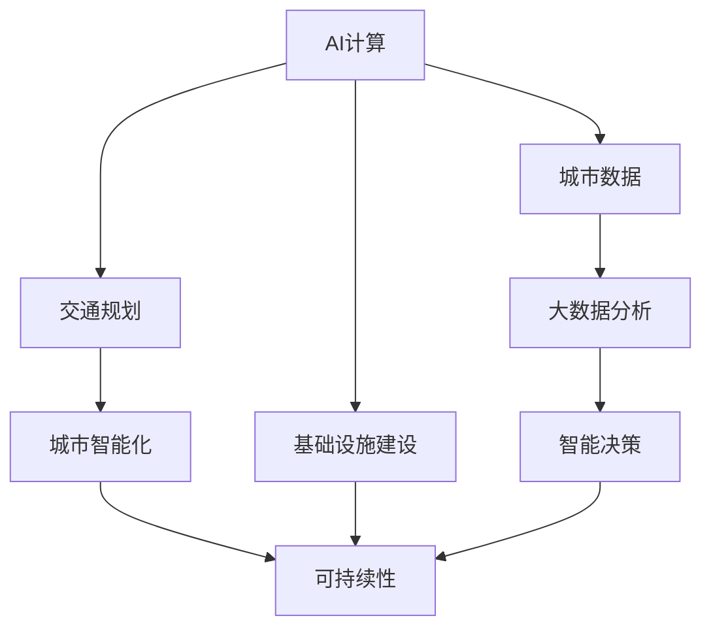

                 

# AI与人类计算：打造可持续发展的城市交通与基础设施建设规划建设

> 关键词：AI计算, 交通规划, 基础设施建设, 城市智能化, 可持续性, 绿色交通

## 1. 背景介绍

### 1.1 问题由来
随着城市化的飞速发展，交通拥堵、资源匮乏、环境污染等问题愈发凸显。传统的人类计算方法已经难以应对日益复杂的社会需求。人工智能（AI）技术的兴起，带来了全新的机遇和挑战。如何利用AI技术，实现城市交通与基础设施建设的智能化、可持续发展，成为了当下全球城市规划者和工程技术人员关注的焦点。

### 1.2 问题核心关键点
AI在城市交通与基础设施建设中的应用，本质上是将复杂的人类计算任务转化为可计算的、可自动化处理的算法问题。通过数据驱动和机器学习技术，AI能够在海量数据中提取模式和规律，辅助决策者制定更加科学合理的规划方案。AI的参与，不仅可以提升规划和建设的效率，还能促进资源的高效利用和环境的可持续性。

## 2. 核心概念与联系

### 2.1 核心概念概述

为更好地理解AI在城市交通与基础设施建设中的应用，本节将介绍几个密切相关的核心概念：

- **AI计算**：利用人工智能技术进行计算和推理，特别是通过机器学习、深度学习等方法，从数据中提取模式和规律，辅助决策。
- **交通规划**：城市交通的布局和设计，包括道路网络、交通信号、公交系统等，旨在最大化交通效率、减少拥堵和污染。
- **基础设施建设**：城市建设的物质基础，包括道路、桥梁、公共设施等，需要考虑土地使用、资源利用、环境保护等多方面因素。
- **城市智能化**：通过智能技术实现城市管理的自动化、信息化和智能化，提升城市运行效率和服务质量。
- **可持续性**：追求资源节约、环境友好、社会公平的发展模式，实现经济、社会、环境三者的和谐共存。

这些核心概念之间的逻辑关系可以通过以下Mermaid流程图来展示：



这个流程图展示了AI计算在城市交通与基础设施建设中的核心作用：

1. 通过大数据分析，从城市数据中提取有价值的信息。
2. 利用机器学习算法，辅助交通规划和基础设施建设。
3. 通过智能决策，优化城市管理和资源利用，促进可持续性发展。

## 3. 核心算法原理 & 具体操作步骤
### 3.1 算法原理概述

AI在城市交通与基础设施建设中的应用，主要基于数据驱动和模型驱动两种方法：

- **数据驱动**：利用传感器、摄像头、GPS等设备收集城市运行数据，通过大数据分析技术，发现交通流、交通模式等规律。
- **模型驱动**：建立数学模型或机器学习模型，预测交通需求、交通流、环境影响等，辅助决策。

在数据驱动方法中，常用的算法包括时间序列分析、空间分析、网络分析等，通过这些方法，可以预测交通流量、识别交通瓶颈、评估基础设施需求等。模型驱动方法则包括深度学习、强化学习等，通过这些方法，可以构建预测模型、优化路径、调整交通信号等。

### 3.2 算法步骤详解

AI在城市交通与基础设施建设中的应用流程，可以概括为以下五个步骤：

**Step 1: 数据收集与预处理**

1. **数据收集**：从交通监控、GPS数据、社交媒体、智能传感器等来源收集数据。
2. **数据清洗**：去除噪声数据，填补缺失值，标准化数据格式。
3. **特征提取**：提取有意义的特征，如交通流量、速度、拥堵情况等。

**Step 2: 模型建立与训练**

1. **模型选择**：根据具体问题选择合适的模型，如随机森林、神经网络、时间序列模型等。
2. **模型训练**：使用历史数据对模型进行训练，调整超参数。
3. **模型评估**：使用测试数据集评估模型性能，如准确率、召回率、F1分数等。

**Step 3: 预测与优化**

1. **预测**：利用训练好的模型对未来数据进行预测，如预测交通流量、优化路径等。
2. **优化**：根据预测结果，调整交通信号、规划基础设施建设等。

**Step 4: 实时监控与反馈**

1. **实时监控**：通过传感器、摄像头等设备实时监控城市交通状况。
2. **反馈机制**：根据实时监控数据，调整模型参数，进行动态优化。

**Step 5: 持续改进**

1. **持续学习**：使用新数据对模型进行持续训练，提升模型性能。
2. **模型更新**：根据新技术、新需求更新模型，保持模型的时效性。

### 3.3 算法优缺点

AI在城市交通与基础设施建设中的应用，具有以下优点：

1. **效率高**：AI可以处理海量数据，快速发现交通模式和规律，辅助决策。
2. **智能化**：AI可以构建智能决策系统，实现实时监控和动态优化。
3. **预测准确**：AI模型可以基于历史数据进行预测，提供准确的决策支持。

同时，也存在以下局限性：

1. **数据质量依赖**：AI模型的性能依赖于数据的质量和量，数据的偏差可能影响模型结果。
2. **模型复杂度**：构建和优化AI模型需要较高的技术和计算资源。
3. **解释性不足**：AI模型通常是"黑盒"系统，难以解释其内部决策过程。

尽管存在这些局限性，AI在城市交通与基础设施建设中的应用，依然展现了巨大的潜力，成为推动城市智能化发展的关键力量。

### 3.4 算法应用领域

AI在城市交通与基础设施建设中的应用，涵盖了多个领域，具体包括：

- **交通流量预测**：通过机器学习模型，预测未来交通流量，优化交通信号控制。
- **路径优化**：利用深度学习算法，优化路线和交通流，减少拥堵。
- **智能交通信号**：基于实时数据，动态调整交通信号，提升交通效率。
- **智能停车**：利用传感器和AI技术，实现停车场智能管理，提升停车效率。
- **环境监测**：通过AI分析城市环境数据，监测空气质量、噪音污染等。
- **基础设施管理**：利用AI优化道路、桥梁、公共设施等的建设和维护。

这些领域的应用，不仅提升了城市交通和基础设施的效率，还促进了城市的可持续发展。

## 4. 数学模型和公式 & 详细讲解 & 举例说明

### 4.1 数学模型构建

AI在城市交通与基础设施建设中的应用，涉及多种数学模型，包括时间序列模型、图网络模型、深度学习模型等。以时间序列模型为例，其基本结构如下：

$$
y_t = f(\alpha_0 + \alpha_1 x_{t-1} + \alpha_2 x_{t-2} + \ldots + \alpha_n x_{t-n} + \epsilon_t)
$$

其中，$y_t$ 表示时间$t$的预测值，$x_{t-k}$ 表示时间$t-k$的历史值，$\alpha_k$ 表示第$k$个历史值的权重，$\epsilon_t$ 表示误差项。

### 4.2 公式推导过程

以时间序列模型为例，其推导过程如下：

1. **数据收集**：收集时间序列数据 $x_{t-1}, x_{t-2}, \ldots, x_{t-n}$。
2. **特征提取**：提取有意义的特征，如交通流量、拥堵情况等。
3. **模型训练**：使用历史数据训练模型，得到系数 $\alpha_0, \alpha_1, \alpha_2, \ldots, \alpha_n$。
4. **预测**：使用训练好的模型对未来数据进行预测，得到 $y_t$。

### 4.3 案例分析与讲解

假设某城市某路段的交通流量数据如下：

| 时间 | 流量 |
|------|------|
| 9:00 | 1000 |
| 9:15 | 1200 |
| 9:30 | 1400 |
| ...  | ...  |

利用时间序列模型，可以预测该路段未来某个时间点的流量。设预测时间为9:45，根据模型公式，可以得到：

$$
y_{9:45} = \alpha_0 + \alpha_1 x_{9:00} + \alpha_2 x_{9:15} + \ldots + \alpha_n x_{9:00-n}
$$

其中，$\alpha_0, \alpha_1, \alpha_2, \ldots, \alpha_n$ 通过历史数据训练得到。

通过预测，可以提前调整交通信号，避免拥堵。

## 5. 项目实践：代码实例和详细解释说明
### 5.1 开发环境搭建

在进行AI计算实践前，我们需要准备好开发环境。以下是使用Python进行PyTorch开发的环境配置流程：

1. 安装Anaconda：从官网下载并安装Anaconda，用于创建独立的Python环境。

2. 创建并激活虚拟环境：
```bash
conda create -n pytorch-env python=3.8 
conda activate pytorch-env
```

3. 安装PyTorch：根据CUDA版本，从官网获取对应的安装命令。例如：
```bash
conda install pytorch torchvision torchaudio cudatoolkit=11.1 -c pytorch -c conda-forge
```

4. 安装各类工具包：
```bash
pip install numpy pandas scikit-learn matplotlib tqdm jupyter notebook ipython
```

完成上述步骤后，即可在`pytorch-env`环境中开始AI计算实践。

### 5.2 源代码详细实现

这里以交通流量预测为例，给出使用PyTorch进行AI计算的代码实现。

```python
import torch
import numpy as np
from torch import nn, optim
from torch.autograd import Variable

class LSTM(nn.Module):
    def __init__(self, input_size, hidden_size, output_size):
        super(LSTM, self).__init__()
        self.hidden_size = hidden_size
        self.lstm = nn.LSTM(input_size, hidden_size)
        self.linear = nn.Linear(hidden_size, output_size)

    def forward(self, input, hidden):
        lstm_out, hidden = self.lstm(input, hidden)
        predictions = self.linear(lstm_out)
        return predictions, hidden

def train(model, input_data, target_data, epochs, batch_size, learning_rate):
    criterion = nn.MSELoss()
    optimizer = optim.Adam(model.parameters(), lr=learning_rate)

    for epoch in range(epochs):
        for i in range(0, len(input_data), batch_size):
            batch_input = input_data[i:i+batch_size]
            batch_target = target_data[i:i+batch_size]

            # 将输入和目标数据转换为Tensor
            batch_input = Variable(torch.from_numpy(batch_input).float())
            batch_target = Variable(torch.from_numpy(batch_target).float())

            # 前向传播
            hidden = (Variable(torch.zeros(batch_size, model.hidden_size).float()), Variable(torch.zeros(batch_size, model.hidden_size).float()))
            outputs = model(batch_input, hidden)

            # 计算损失
            loss = criterion(outputs, batch_target)

            # 反向传播和优化
            optimizer.zero_grad()
            loss.backward()
            optimizer.step()

        print(f"Epoch {epoch+1}, loss: {loss.item()}")

# 示例数据
input_data = np.array([[1000, 1200, 1400], [1100, 1300, 1500], [1200, 1400, 1600]])
target_data = np.array([[1000, 1200, 1400], [1100, 1300, 1500], [1200, 1400, 1600]])

# 定义模型和训练参数
model = LSTM(3, 10, 3)
epochs = 10
batch_size = 1
learning_rate = 0.001

# 训练模型
train(model, input_data, target_data, epochs, batch_size, learning_rate)
```

以上代码展示了如何使用LSTM模型进行交通流量预测的实现。首先定义了LSTM模型和训练函数，然后通过示例数据训练模型。在训练过程中，使用MSE损失函数和Adam优化器，调整模型的权重。

### 5.3 代码解读与分析

让我们再详细解读一下关键代码的实现细节：

**LSTM模型定义**：
- `__init__`方法：初始化LSTM模型，定义模型的输入、隐藏和输出维度。
- `forward`方法：定义模型前向传播过程，接收输入和隐藏状态，输出预测结果。

**训练函数**：
- 定义损失函数和优化器，用于计算和更新模型权重。
- 遍历训练数据，每次取一个批次数据，进行前向传播、损失计算和反向传播。
- 在每个epoch结束后，输出当前损失，用于监控训练进度。

通过上述代码，我们可以看到，PyTorch提供了方便的API，使得AI计算的实现变得简单高效。开发者可以将更多精力放在模型设计和数据处理上，而不必过多关注底层的实现细节。

## 6. 实际应用场景
### 6.1 智能交通系统

AI计算在智能交通系统中的应用，主要体现在以下几个方面：

**智能信号控制**：通过实时监控交通流量，利用AI算法优化交通信号控制，减少交通拥堵。
**路径优化**：利用深度学习算法，预测交通流量和拥堵情况，优化路线和交通流，提升行车效率。
**事故预测与处理**：基于历史数据，预测交通事故的发生概率，提前预警和处理，减少事故发生率。

通过这些技术，智能交通系统可以实现交通流量预测、路径优化和智能信号控制等功能，提升城市交通的效率和安全性。

### 6.2 绿色交通与碳中和

AI计算在绿色交通和碳中和中的应用，主要体现在以下几个方面：

**能耗优化**：利用AI算法优化交通信号、路径规划等，降低车辆能耗和碳排放。
**电动汽车管理**：通过智能充电站和调度系统，实现电动汽车的高效充电和能源利用。
**公共交通优化**：利用AI技术优化公交线路和站点，减少能源消耗和碳排放。

通过这些技术，AI计算可以在交通领域推动绿色低碳发展，促进城市的可持续发展。

## 7. 工具和资源推荐
### 7.1 学习资源推荐

为了帮助开发者系统掌握AI在城市交通与基础设施建设中的应用，这里推荐一些优质的学习资源：

1. 《AI计算在交通领域的应用》系列博文：由AI计算领域专家撰写，深入浅出地介绍了AI在交通领域的应用实例。
2. CS224N《深度学习自然语言处理》课程：斯坦福大学开设的NLP明星课程，有Lecture视频和配套作业，带你入门AI计算的基本概念和经典模型。
3. 《AI计算与城市规划》书籍：介绍了AI在城市规划中的应用案例和实践方法，是从事城市智能化建设人员的必读书籍。
4. Weights & Biases：模型训练的实验跟踪工具，可以记录和可视化模型训练过程中的各项指标，方便对比和调优。
5. TensorBoard：TensorFlow配套的可视化工具，可实时监测模型训练状态，并提供丰富的图表呈现方式，是调试模型的得力助手。

通过对这些资源的学习实践，相信你一定能够快速掌握AI计算在城市交通与基础设施建设中的应用精髓，并用于解决实际的AI计算问题。

### 7.2 开发工具推荐

高效的开发离不开优秀的工具支持。以下是几款用于AI计算开发的常用工具：

1. PyTorch：基于Python的开源深度学习框架，灵活动态的计算图，适合快速迭代研究。大多数AI计算任务都有PyTorch版本的实现。
2. TensorFlow：由Google主导开发的开源深度学习框架，生产部署方便，适合大规模工程应用。同样有丰富的AI计算资源。
3. TensorFlow Lite：TensorFlow的移动端部署版本，支持模型压缩和优化，适合轻量级移动端应用。
4. Jupyter Notebook：免费的交互式计算环境，支持Python、R等多种语言，方便快速迭代和共享学习笔记。
5. Anaconda：开源的Python发行版，包含大量科学计算、机器学习、数据科学相关的工具包和库，适合科研和生产环境。

合理利用这些工具，可以显著提升AI计算的开发效率，加快创新迭代的步伐。

### 7.3 相关论文推荐

AI在城市交通与基础设施建设中的应用，源于学界的持续研究。以下是几篇奠基性的相关论文，推荐阅读：

1. D. Silver et al., "Mastering the Game of Go with Deep Neural Networks and Monte Carlo Tree Search"（AlphaGo论文）：展示了AI在复杂决策任务中的应用，如AlphaGo在围棋领域的胜利。
2. Y. LeCun et al., "Gradient-based Learning Applied to Document Recognition"：提出了卷积神经网络在图像识别领域的应用，推动了AI计算的发展。
3. I. Goodfellow et al., "Generative Adversarial Nets"：提出了生成对抗网络，在图像生成、视频生成等领域取得了显著成效。
4. M. Rabinovich et al., "Learning in Environments with Partial Observability"：探讨了强化学习在复杂环境中的应用，为AI计算提供了新的思路。
5. J. Gao et al., "Time-Series Prediction with Deep Learning: A Survey"：总结了深度学习在时间序列预测中的应用，为AI计算提供了全面的技术支持。

这些论文代表了大规模AI计算的发展脉络。通过学习这些前沿成果，可以帮助研究者把握学科前进方向，激发更多的创新灵感。

## 8. 总结：未来发展趋势与挑战
### 8.1 总结

本文对AI在城市交通与基础设施建设中的应用进行了全面系统的介绍。首先阐述了AI计算在城市交通与基础设施建设中的重要作用，明确了AI计算在提升交通效率、优化资源利用、促进可持续发展等方面的独特价值。其次，从原理到实践，详细讲解了AI计算的数学模型和算法实现，给出了具体的代码实例和分析。同时，本文还广泛探讨了AI计算在智能交通、绿色交通等领域的应用前景，展示了AI计算技术的巨大潜力。最后，本文精选了AI计算的相关学习资源和开发工具，力求为读者提供全方位的技术指引。

通过本文的系统梳理，可以看到，AI计算在城市交通与基础设施建设中的应用，正在成为推动城市智能化发展的关键力量。这些技术的广泛应用，不仅提升了城市交通的效率和安全性，还促进了资源的优化利用和环境的可持续性。未来，伴随AI计算技术的持续演进，相信城市交通与基础设施建设将迎来更加智能化、绿色化的发展新纪元。

### 8.2 未来发展趋势

展望未来，AI计算在城市交通与基础设施建设中的应用，将呈现以下几个发展趋势：

1. **智能化水平提升**：AI计算技术将进一步提升交通系统的智能化水平，实现更精准的交通预测、更高效的路径优化和更智能的信号控制。
2. **绿色交通发展**：AI计算将推动绿色低碳交通的发展，通过优化交通流量和能耗，减少碳排放。
3. **数据驱动决策**：基于大数据分析和AI计算，城市交通与基础设施建设将实现数据驱动的决策，提升规划和建设的科学性和合理性。
4. **跨领域融合**：AI计算将与物联网、大数据、云计算等技术进行更深层次的融合，推动智慧城市建设。
5. **多模态融合**：AI计算将实现多模态数据的融合，如交通流量数据、环境数据、社会数据等，提升综合分析和决策能力。
6. **自动驾驶普及**：AI计算将推动自动驾驶技术的发展，实现更安全、更高效的出行方式。

以上趋势凸显了AI计算在城市交通与基础设施建设中的应用前景，相信随着技术的不断进步，AI计算将为城市建设带来更加智能、绿色的发展新路径。

### 8.3 面临的挑战

尽管AI计算在城市交通与基础设施建设中的应用已经取得了显著成果，但在迈向更加智能化、绿色化的应用过程中，仍面临诸多挑战：

1. **数据质量和安全**：AI计算依赖于高质量、安全的数据，数据的偏差、缺失和不一致可能影响模型的性能。
2. **模型复杂度**：构建和优化AI模型需要较高的技术和计算资源，模型的复杂度可能带来高成本和高风险。
3. **隐私保护**：城市交通与基础设施建设涉及大量个人隐私数据，如何保护用户隐私，是AI计算面临的重要挑战。
4. **伦理和道德**：AI计算的决策过程可能带来伦理和道德问题，如算法偏见、歧视性输出等，需要规范和监管。
5. **技术壁垒**：AI计算需要跨学科的技术知识，如深度学习、优化算法、系统工程等，对从业者提出了较高的要求。
6. **社会接受度**：AI计算的应用需要社会各界的广泛接受和支持，如何推动社会共识，是一个重要的社会问题。

以上挑战需要从业者不断探索和突破，才能将AI计算技术应用于更广泛的领域，推动城市交通与基础设施建设向着更加智能化、绿色化的方向发展。

### 8.4 研究展望

面对AI计算在城市交通与基础设施建设中面临的挑战，未来的研究需要在以下几个方面寻求新的突破：

1. **数据质量提升**：通过数据清洗、数据增强、数据融合等技术，提升数据的质量和多样性，增强AI计算模型的性能。
2. **模型优化**：研究更高效、更灵活的AI计算模型，如轻量级模型、可解释性模型等，降低计算资源需求和提升模型可解释性。
3. **隐私保护**：研究隐私保护技术，如差分隐私、联邦学习等，保护用户隐私，提升数据安全。
4. **伦理监管**：制定AI计算的伦理规范和法律法规，保障AI计算的公平性、透明性和安全性。
5. **社会认知**：通过科普教育、公众参与等手段，提升社会对AI计算技术的认知和接受度，推动社会共识的形成。
6. **跨学科融合**：促进AI计算与其他学科的融合，如地理信息系统、环境科学、社会科学等，推动多学科交叉研究。

这些研究方向将有助于解决AI计算在城市交通与基础设施建设中面临的挑战，推动AI计算技术的持续发展和广泛应用。

## 9. 附录：常见问题与解答
----------------------------------------------------------------

**Q1: AI计算在城市交通与基础设施建设中的应用是否适用于所有领域？**

A: AI计算在城市交通与基础设施建设中的应用，主要集中在交通流量预测、路径优化、智能信号控制等领域。对于一些特定领域，如航空、铁路等，可能还需要考虑其他技术，如仿真模拟、系统优化等。

**Q2: 数据质量对AI计算的性能有怎样的影响？**

A: 数据质量对AI计算的性能有着至关重要的影响。数据中的偏差、缺失和不一致可能导致模型性能下降。因此，在实际应用中，需要采取数据清洗、数据增强等技术，提升数据的质量和多样性。

**Q3: 如何保护城市交通与基础设施建设中的数据隐私？**

A: 保护数据隐私是AI计算应用中一个重要的挑战。可以采用差分隐私、联邦学习等技术，对数据进行匿名化处理，保护用户隐私。

**Q4: 如何提升AI计算模型的可解释性？**

A: 提升AI计算模型的可解释性是当前研究的热点之一。可以采用模型压缩、模型可视化等技术，降低模型的复杂度，增强其可解释性。

**Q5: 未来AI计算在城市交通与基础设施建设中的应用前景如何？**

A: AI计算在城市交通与基础设施建设中的应用前景广阔。随着技术的不断进步，AI计算将推动智能交通、绿色交通、智慧城市建设，带来更加高效、安全、绿色的未来城市。

---

作者：禅与计算机程序设计艺术 / Zen and the Art of Computer Programming

