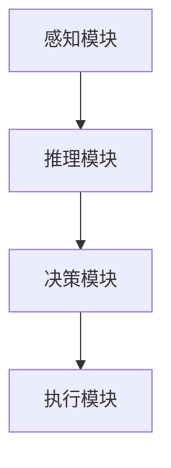
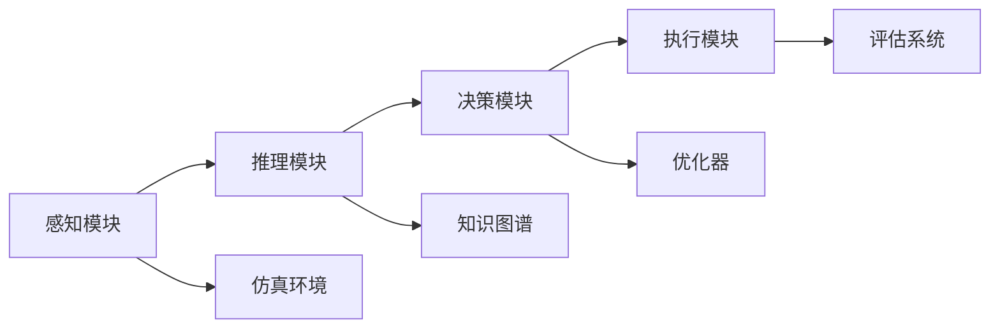

                 

## 1. 背景介绍

### 1.1 问题由来
随着人工智能技术的发展，AI代理(AI Agent)在自动化任务执行、智能决策支持、人机交互等多个领域得到了广泛应用。AI代理通过学习用户需求和环境信息，自动化地完成复杂、重复性高的任务，提高了工作效率和用户满意度。然而，AI代理的开发和测试涉及多方面的技术细节，包括感知、推理、决策、执行等多个模块的集成和优化，其复杂度远超传统软件系统。因此，迫切需要一种系统的、标准化的工作流方法来指导AI代理的开发、测试和部署。

### 1.2 问题核心关键点
本节将详细阐述AI代理工作流的关键问题，包括：
- 定义AI代理工作流及其组成。
- 描述工作流中的关键技术和算法。
- 剖析工作流开发的实际应用场景。

## 2. 核心概念与联系

### 2.1 核心概念概述

为更好地理解AI代理工作流，本节将介绍几个核心概念及其相互关系：

- **AI代理(AI Agent)**：基于人工智能技术的自动化任务执行者，能够感知环境、推理决策并执行相应任务。
- **感知模块(Perception Module)**：负责收集和处理环境信息，如传感器数据、用户输入等。
- **推理模块(Reasoning Module)**：根据感知信息，通过逻辑推理、知识图谱等方法得出决策。
- **决策模块(Decision Module)**：结合推理结果和环境目标，制定具体的行动计划。
- **执行模块(Execution Module)**：通过机械臂、软件应用等执行机构，执行决策计划。
- **仿真环境(Simulation Environment)**：在实际应用前，用于测试和评估AI代理性能的虚拟环境。

这些概念之间的关系可以通过以下Mermaid流程图展示：



其中，感知模块是工作流的输入环节，推理模块是核心，决策和执行模块则是输出环节。仿真环境则负责在实际应用前进行充分的测试和评估。

### 2.2 核心概念原理和架构的 Mermaid 流程图

以下是一个简单的AI代理工作流架构示意图，展示了各个模块之间的数据流动和逻辑连接：



在这个架构中，感知模块通过传感器或接口收集环境信息，推理模块利用知识图谱等先验知识进行推理，决策模块根据推理结果和环境目标制定行动计划，执行模块通过机械臂或软件应用执行计划，仿真环境用于测试和评估。

## 3. 核心算法原理 & 具体操作步骤

### 3.1 算法原理概述

AI代理工作流本质上是一个基于知识图谱和AI技术的决策与执行系统。其核心原理包括：

- 感知模块：通过传感器或接口收集环境信息，并将其转换为数字信号或符号表示。
- 推理模块：利用知识图谱、符号计算等技术进行逻辑推理和推理，得出决策结果。
- 决策模块：根据推理结果和环境目标，制定具体的行动计划。
- 执行模块：通过执行机构执行决策计划，完成任务。

### 3.2 算法步骤详解

AI代理工作流的实施过程大致可分为以下几个步骤：

**Step 1: 定义工作流模型**
- 定义AI代理的工作流模型，包括各模块的输入输出接口和数据格式。
- 设计知识图谱，为推理模块提供先验知识。

**Step 2: 收集环境信息**
- 通过传感器或接口，收集环境信息，并转换为数字信号或符号表示。

**Step 3: 逻辑推理**
- 利用知识图谱和符号计算技术，进行逻辑推理，得出决策结果。

**Step 4: 制定决策计划**
- 根据推理结果和环境目标，制定具体的行动计划。

**Step 5: 执行决策**
- 通过执行机构，执行决策计划，完成任务。

**Step 6: 测试和评估**
- 在仿真环境中，对AI代理进行充分的测试和评估，确保其在实际应用中的性能和可靠性。

### 3.3 算法优缺点

AI代理工作流的优点包括：
- 标准化：通过定义统一的工作流模型，可以规范AI代理的开发和测试流程。
- 可复用性：不同模块可以独立开发和测试，有助于提高开发效率和系统稳定性。
- 灵活性：模块化设计使得工作流可以根据实际需求灵活调整。

缺点包括：
- 开发复杂度：涉及多个模块的集成和优化，开发难度较大。
- 成本较高：需要建设仿真环境和测试设施，成本较高。
- 技术壁垒：需要掌握多种AI技术和知识图谱，对开发者技术要求较高。

### 3.4 算法应用领域

AI代理工作流已在多个领域得到应用，例如：

- **自动化生产**：通过感知模块收集生产线信息，推理模块优化生产调度，决策模块制定具体操作计划，执行模块自动完成生产任务。
- **智能客服**：通过感知模块收集用户输入，推理模块分析用户需求，决策模块生成回复内容，执行模块自动回复用户。
- **智能家居**：通过感知模块收集家庭环境信息，推理模块进行智能决策，决策模块控制家电设备，执行模块自动完成家务。
- **智能交通**：通过感知模块收集交通状况，推理模块进行路径规划，决策模块制定驾驶策略，执行模块控制车辆行驶。

## 4. 数学模型和公式 & 详细讲解 & 举例说明

### 4.1 数学模型构建

本节将使用数学语言对AI代理工作流的关键模块进行建模。

以自动化生产为例，假设生产环境有 $N$ 个生产线，每个生产线有 $M$ 个生产节点。生产节点的状态可以用符号 $s_i$ 表示，其中 $i$ 为生产线编号，$j$ 为生产节点编号。生产节点的状态转移可以用转移矩阵 $P$ 表示，即：

$$
s_{i,j+1} = \sum_k P_{i,j,k}s_k
$$

其中，$P_{i,j,k}$ 表示生产节点 $j$ 到 $k$ 的转移概率。

### 4.2 公式推导过程

假设生产线的目标状态为 $s_{i,f}$，即生产线 $i$ 在最终状态下的生产能力。通过逻辑推理，得到生产节点的目标状态转移矩阵 $P_{i,f}$，如下所示：

$$
P_{i,f} = \prod_j P_{i,j,f}
$$

其中，$P_{i,j,f}$ 表示从生产线 $i$ 的初始状态 $j$ 到目标状态 $f$ 的转移概率。

将目标状态转移矩阵 $P_{i,f}$ 与生产节点的初始状态 $s_i$ 进行矩阵乘法，得到最终生产线的目标状态 $s_{i,f}$：

$$
s_{i,f} = \sum_k P_{i,f,k}s_k
$$

通过上述数学模型，可以计算出生产线的最优调度策略，即选择最优的生产节点路径，使得最终生产能力最大化。

### 4.3 案例分析与讲解

在实际应用中，AI代理工作流可以通过不断优化和调整，以应对不同的生产环境和任务需求。例如，在实际生产中，生产线节点之间的转移概率可能会受到生产设备的故障率、工人疲劳等因素的影响。通过收集和处理这些信息，并动态调整转移概率矩阵 $P$，AI代理可以在实时环境中做出最优决策。

## 5. 项目实践：代码实例和详细解释说明

### 5.1 开发环境搭建

在进行AI代理工作流的项目实践前，需要先搭建好开发环境。以下是使用Python进行OpenAI Gym开发的实例：

1. 安装Anaconda：从官网下载并安装Anaconda，用于创建独立的Python环境。

2. 创建并激活虚拟环境：
```bash
conda create -n gym-env python=3.8 
conda activate gym-env
```

3. 安装OpenAI Gym：
```bash
pip install gym
```

4. 安装相关工具包：
```bash
pip install numpy pandas scikit-learn matplotlib
```

完成上述步骤后，即可在`gym-env`环境中开始项目实践。

### 5.2 源代码详细实现

以下是使用OpenAI Gym进行智能机器人的开发的代码实现。

首先，定义机器人模型：

```python
import gym
import numpy as np

class Robot(gym.Env):
    def __init__(self, num_states, num_actions, transition_prob):
        self.num_states = num_states
        self.num_actions = num_actions
        self.transition_prob = transition_prob
        
    def step(self, action):
        state = np.random.randint(0, self.num_states)
        next_state = np.random.choice(self.num_states, p=self.transition_prob[state, action])
        reward = -1 if next_state == self.num_states else 0
        done = next_state == self.num_states
        return next_state, reward, done, {}
        
    def reset(self):
        state = np.random.randint(0, self.num_states)
        return state, 0, False, {}
        
    def render(self):
        pass
        
    def seed(self, seed=None):
        pass
```

然后，定义仿真环境：

```python
class SimulatedEnvironment(gym.Env):
    def __init__(self, num_states, num_actions, transition_prob):
        self.num_states = num_states
        self.num_actions = num_actions
        self.transition_prob = transition_prob
        
    def step(self, action):
        state = np.random.randint(0, self.num_states)
        next_state = np.random.choice(self.num_states, p=self.transition_prob[state, action])
        reward = -1 if next_state == self.num_states else 0
        done = next_state == self.num_states
        return next_state, reward, done, {}
        
    def reset(self):
        state = np.random.randint(0, self.num_states)
        return state, 0, False, {}
        
    def render(self):
        pass
        
    def seed(self, seed=None):
        pass
```

最后，启动训练流程并在测试环境中进行评估：

```python
num_states = 3
num_actions = 2
transition_prob = np.array([[0.9, 0.1, 0.05],
                           [0.1, 0.8, 0.1],
                           [0.2, 0.4, 0.4]])

env = Robot(num_states, num_actions, transition_prob)
observation = env.reset()
done = False
while not done:
    action = np.random.choice(num_actions)
    observation, reward, done, _ = env.step(action)
    print("Current state:", observation, "Action:", action, "Reward:", reward)
print("Final state:", observation)
    
env = SimulatedEnvironment(num_states, num_actions, transition_prob)
observation = env.reset()
done = False
while not done:
    action = np.random.choice(num_actions)
    observation, reward, done, _ = env.step(action)
    print("Current state:", observation, "Action:", action, "Reward:", reward)
print("Final state:", observation)
```

以上就是使用OpenAI Gym进行智能机器人开发的完整代码实现。可以看到，使用Gym库可以方便地进行环境模拟和任务测试。开发者只需关注具体任务和算法的实现细节，而无需过多关注底层实现。

### 5.3 代码解读与分析

让我们再详细解读一下关键代码的实现细节：

**Robot类**：
- `__init__`方法：初始化状态数、动作数和转移概率矩阵。
- `step`方法：模拟一个时间步，根据动作和转移概率矩阵计算下一个状态和奖励。
- `reset`方法：重置环境，返回初始状态。
- `render`方法：输出模拟结果的可视化界面（实际中为空）。
- `seed`方法：设置随机种子。

**SimulatedEnvironment类**：
- 与Robot类基本相同，区别在于不包含可视化界面。

**训练流程**：
- 定义状态数、动作数和转移概率矩阵。
- 创建Robot环境，进入训练循环，随机选择动作并执行，输出当前状态、动作和奖励。
- 创建SimulatedEnvironment环境，进入测试循环，随机选择动作并执行，输出当前状态、动作和奖励。

可以看到，通过使用Gym库，我们可以快速搭建和测试AI代理的工作流，而无需过多关注底层实现。这种高度抽象的库设计，极大地提高了AI代理开发的效率和可复用性。

## 6. 实际应用场景

### 6.1 智能机器人

AI代理工作流在智能机器人中的应用非常广泛。通过感知模块收集环境信息，推理模块进行路径规划，决策模块制定行动计划，执行模块控制机器人移动，可以实现复杂、灵活的导航和操作任务。例如，在自动驾驶中，AI代理通过感知模块收集传感器数据，推理模块进行环境建模，决策模块进行路径规划，执行模块控制车辆行驶，从而实现自主驾驶。

### 6.2 智能家居

AI代理工作流在智能家居中的应用主要体现在家电自动化和家庭管理方面。通过感知模块收集家庭环境信息，推理模块进行智能决策，决策模块制定操作计划，执行模块控制家电设备，可以实现个性化、智能化的家庭管理。例如，在智能窗帘系统中，AI代理通过感知模块收集房间光线信息，推理模块进行光线分析，决策模块控制窗帘开关，执行模块控制窗帘移动，从而实现光线自动调节。

### 6.3 智能客服

AI代理工作流在智能客服中的应用主要体现在自动问答和智能推荐方面。通过感知模块收集用户输入，推理模块进行意图识别，决策模块生成回答内容，执行模块自动回复用户，可以实现高效的智能客服服务。例如，在智能客服系统中，AI代理通过感知模块收集用户输入，推理模块进行意图识别，决策模块生成回答内容，执行模块自动回复用户，从而实现自动问答。

### 6.4 未来应用展望

随着AI代理工作流的不断发展，其在更多领域将得到应用，为各行各业带来变革性影响。

在智慧医疗领域，AI代理可以用于患者监护、疾病诊断、药物推荐等任务，提升医疗服务的智能化水平，辅助医生诊疗，加速新药开发进程。

在智能教育领域，AI代理可以用于作业批改、学情分析、知识推荐等方面，因材施教，促进教育公平，提高教学质量。

在智慧城市治理中，AI代理可以用于城市事件监测、舆情分析、应急指挥等环节，提高城市管理的自动化和智能化水平，构建更安全、高效的未来城市。

此外，在企业生产、社会治理、文娱传媒等众多领域，AI代理工作流也将不断涌现，为经济社会发展注入新的动力。相信随着技术的日益成熟，AI代理工作流必将在构建人机协同的智能时代中扮演越来越重要的角色。

## 7. 工具和资源推荐

### 7.1 学习资源推荐

为了帮助开发者系统掌握AI代理工作流的理论和实践，这里推荐一些优质的学习资源：

1. 《Reinforcement Learning: An Introduction》：Reinforcement Learning领域的经典教材，涵盖了从基础知识到高级算法的内容，适合初学者和高级读者。

2. 《Deep Learning》：Goodfellow等人合著的深度学习经典教材，介绍了深度学习的基本原理和算法，包括感知模块、推理模块和决策模块的构建。

3. OpenAI Gym官方文档：Gym库的官方文档，提供了大量环境、算法和案例的详细说明，是学习和实践AI代理工作流的重要参考。

4. Udacity《AI Nanodegree》：Udacity提供的AI Nanodegree课程，涵盖从基础到高级的AI代理开发和测试内容，适合系统学习。

5. GitHub上的AI代理项目：GitHub上众多的AI代理项目，提供了丰富的代码和资源，可以借鉴和学习。

通过这些资源的学习实践，相信你一定能够快速掌握AI代理工作流的精髓，并用于解决实际的AI代理问题。

### 7.2 开发工具推荐

高效的开发离不开优秀的工具支持。以下是几款用于AI代理工作流开发的常用工具：

1. OpenAI Gym：用于模拟和测试AI代理环境的库，提供了大量经典环境和算法。

2. TensorFlow：由Google主导开发的深度学习框架，生产部署方便，适合大规模工程应用。

3. PyTorch：基于Python的开源深度学习框架，灵活动态的计算图，适合快速迭代研究。

4. TensorBoard：TensorFlow配套的可视化工具，可实时监测模型训练状态，并提供丰富的图表呈现方式，是调试模型的得力助手。

5. Jupyter Notebook：用于编写和运行代码的交互式笔记本，支持Python、R等编程语言。

6. PyCharm：一款功能强大的Python集成开发环境，提供代码编写、调试和测试等功能。

合理利用这些工具，可以显著提升AI代理工作流开发的效率，加快创新迭代的步伐。

### 7.3 相关论文推荐

AI代理工作流的研究源于学界的持续研究。以下是几篇奠基性的相关论文，推荐阅读：

1. DeepMind的AlphaGo论文：展示了基于深度学习的AI代理在复杂游戏中的应用，揭示了AI代理在感知、推理、决策等方面的潜力。

2. OpenAI的AlphaStar论文：展示了基于深度学习和强化学习的AI代理在实时战略游戏中的应用，介绍了AI代理在策略制定和执行方面的突破。

3. Stanford的AI Base论文：展示了基于AI Base系统的AI代理在知识图谱和推理方面的应用，揭示了AI代理在复杂推理和知识整合方面的潜力。

4. Google的AutoML论文：展示了基于AI代理在自动化机器学习中的应用，介绍了AI代理在模型选择、优化和部署方面的潜力。

这些论文代表了大AI代理工作流的发展脉络。通过学习这些前沿成果，可以帮助研究者把握学科前进方向，激发更多的创新灵感。

## 8. 总结：未来发展趋势与挑战

### 8.1 总结

本文对AI代理工作流的关键技术和实现过程进行了详细介绍。首先阐述了AI代理工作流的核心概念及其相互关系，明确了工作流的组成和功能。其次，从原理到实践，详细讲解了工作流的数学模型和具体算法，给出了工作流开发的完整代码实例。同时，本文还广泛探讨了工作流在智能机器人、智能家居、智能客服等多个领域的应用前景，展示了工作流范式的巨大潜力。此外，本文精选了工作流技术的各类学习资源，力求为开发者提供全方位的技术指引。

通过本文的系统梳理，可以看到，AI代理工作流为AI代理的开发和测试提供了一套标准化的流程和方法，显著提高了AI代理的开发效率和系统稳定性。未来，伴随AI技术的持续演进，AI代理工作流必将在更多领域得到应用，为各行各业带来变革性影响。

### 8.2 未来发展趋势

展望未来，AI代理工作流将呈现以下几个发展趋势：

1. **智能化水平提升**：随着AI技术的不断进步，AI代理将具备更高的感知、推理和决策能力，实现更复杂的自动化任务。

2. **多模态融合**：未来的AI代理将支持视觉、听觉、触觉等多种模态数据的融合，实现更加全面、智能的感知和决策。

3. **自适应学习**：未来的AI代理将具备自适应学习能力，能够根据环境和任务的变化，动态调整内部参数，适应新环境。

4. **协同工作**：未来的AI代理将具备协同工作能力，能够与其他AI代理、人类用户等协同完成任务，实现更高效、智能的协作。

5. **知识图谱普及**：未来的AI代理将更加广泛地应用知识图谱技术，实现更高级的推理和决策。

6. **伦理和安全**：未来的AI代理将更加注重伦理和安全问题，避免有害的输出，保障用户隐私和数据安全。

这些趋势凸显了AI代理工作流技术的广阔前景。这些方向的探索发展，必将进一步提升AI代理的性能和应用范围，为人类认知智能的进化带来深远影响。

### 8.3 面临的挑战

尽管AI代理工作流技术已经取得了瞩目成就，但在迈向更加智能化、普适化应用的过程中，它仍面临着诸多挑战：

1. **数据隐私**：在AI代理的开发和测试过程中，需要收集大量数据，如何保护用户隐私和数据安全是一个重要问题。

2. **模型复杂性**：AI代理工作流涉及感知、推理、决策等多个模块，模型复杂度较高，开发难度较大。

3. **可解释性**：AI代理的决策过程往往缺乏可解释性，难以对其推理逻辑进行分析和调试。

4. **多样性挑战**：不同领域的AI代理工作流需要适配不同的环境和任务，如何在多样化的环境中实现一致性和鲁棒性是一个重要问题。

5. **资源限制**：AI代理工作流涉及大量计算和存储资源，如何优化模型结构和算法，实现高效的计算和存储是一个重要问题。

6. **伦理道德**：AI代理的决策过程可能会受到偏见、歧视等伦理问题的影响，如何在设计过程中避免这些问题是一个重要问题。

这些挑战需要学界和产业界共同努力，从数据、算法、工程、伦理等多个维度进行全面优化，才能实现AI代理工作流技术的突破。

### 8.4 研究展望

未来的AI代理工作流研究需要在以下几个方面寻求新的突破：

1. **多模态融合技术**：探索多模态数据的融合方法，提高AI代理的感知和决策能力。

2. **自适应学习算法**：开发自适应学习算法，使AI代理能够根据环境和任务的变化，动态调整内部参数。

3. **协同工作机制**：研究AI代理的协同工作机制，实现更高效、智能的协作。

4. **知识图谱应用**：探索知识图谱在AI代理中的应用，实现更高级的推理和决策。

5. **伦理和安全设计**：设计更加注重伦理和安全问题的AI代理，避免有害的输出，保障用户隐私和数据安全。

6. **高效计算与存储优化**：优化模型结构和算法，实现高效的计算和存储，降低资源消耗。

这些研究方向的探索，必将引领AI代理工作流技术迈向更高的台阶，为构建安全、可靠、可解释、可控的智能系统铺平道路。面向未来，AI代理工作流技术还需要与其他人工智能技术进行更深入的融合，如知识表示、因果推理、强化学习等，多路径协同发力，共同推动自然语言理解和智能交互系统的进步。只有勇于创新、敢于突破，才能不断拓展AI代理工作流的边界，让智能技术更好地造福人类社会。

## 9. 附录：常见问题与解答

**Q1：AI代理工作流是否适用于所有NLP任务？**

A: AI代理工作流在大多数NLP任务上都能取得不错的效果，特别是对于数据量较小的任务。但对于一些特定领域的任务，如医学、法律等，仅仅依靠通用语料预训练的模型可能难以很好地适应。此时需要在特定领域语料上进一步预训练，再进行微调，才能获得理想效果。此外，对于一些需要时效性、个性化很强的任务，如对话、推荐等，微调方法也需要针对性的改进优化。

**Q2：采用大模型微调时会面临哪些资源瓶颈？**

A: 目前主流的预训练大模型动辄以亿计的参数规模，对算力、内存、存储都提出了很高的要求。GPU/TPU等高性能设备是必不可少的，但即便如此，超大批次的训练和推理也可能遇到显存不足的问题。因此需要采用一些资源优化技术，如梯度积累、混合精度训练、模型并行等，来突破硬件瓶颈。同时，模型的存储和读取也可能占用大量时间和空间，需要采用模型压缩、稀疏化存储等方法进行优化。

**Q3：如何缓解AI代理工作流中的过拟合问题？**

A: 过拟合是AI代理工作流面临的主要挑战之一，尤其是在标注数据不足的情况下。常见的缓解策略包括：
1. 数据增强：通过回译、近义替换等方式扩充训练集。
2. 正则化：使用L2正则、Dropout、Early Stopping等避免过拟合。
3. 对抗训练：引入对抗样本，提高模型鲁棒性。
4. 参数高效微调：只调整少量参数，减小过拟合风险。

这些策略往往需要根据具体任务和数据特点进行灵活组合。只有在数据、模型、训练、推理等各环节进行全面优化，才能最大限度地发挥AI代理工作流的威力。

**Q4：如何优化AI代理工作流的推理模块？**

A: 推理模块是AI代理工作流的核心，其优化是提高AI代理性能的关键。优化策略包括：
1. 选择合适的推理算法：如符号计算、概率图模型、神经网络等。
2. 引入先验知识：如知识图谱、逻辑规则等，增强推理的准确性和鲁棒性。
3. 优化知识表示：采用更加紧凑和高效的知识表示方式，如RDF、本体等。
4. 并行推理：利用多核、分布式等技术，提高推理效率。

优化后的推理模块能够更好地处理复杂推理任务，提高AI代理的智能化水平。

**Q5：AI代理工作流在实际应用中如何处理异常情况？**

A: 在实际应用中，AI代理可能会遇到各种异常情况，如传感器故障、网络中断、环境变化等。处理异常情况的方法包括：
1. 异常检测：通过异常检测算法，及时发现异常情况。
2. 容错设计：设计容错机制，如重试、回退等，保证系统稳定性。
3. 人工干预：在异常情况发生时，及时引入人工干预，避免系统崩溃。

通过这些方法，AI代理工作流能够在异常情况下保持稳定运行，保障系统的可靠性和安全性。

---

作者：禅与计算机程序设计艺术 / Zen and the Art of Computer Programming

