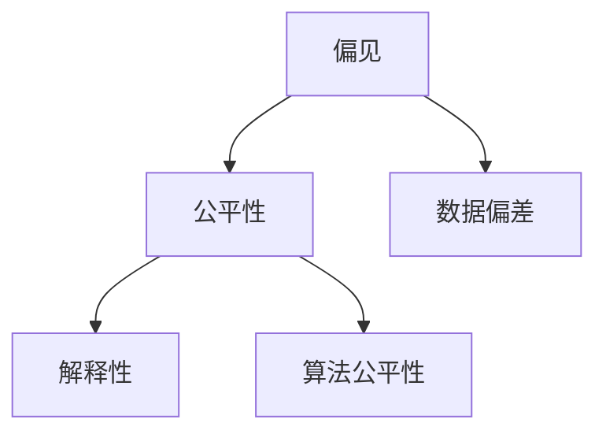

                 

# AI人工智能核心算法原理与代码实例讲解：AI社会公平性

> 关键词：AI社会公平性,算法原理,代码实例,社会影响评估,决策公平性,伦理考量

## 1. 背景介绍

### 1.1 问题由来
随着人工智能(AI)技术的迅猛发展，AI在各行各业中的应用越来越广泛，从自动驾驶、医疗诊断到金融风控、教育评估等领域，AI的决策行为都在深度影响着社会运转。然而，这些智能系统的设计和使用过程中，往往难以避免出现偏见和歧视，造成社会公平性问题。例如，招聘系统中基于性别、年龄、种族等特征的偏见，贷款评估系统中的收入不平等问题，算法推荐系统中的信息茧房效应等。这些问题不仅损害了受影响个体的权益，还可能加剧社会不公，引发严重的社会危机。

### 1.2 问题核心关键点
面对AI带来的社会公平性问题，学界和业界已经展开了广泛的讨论和研究。核心问题包括：
1. AI决策过程是否透明，能否解释其推理逻辑？
2. AI模型是否存在偏见，能否保证所有群体的公平待遇？
3. AI系统的输入数据是否存在偏差，能否消除数据中的不公正因素？
4. 如何设计AI模型，使其在决策中考虑社会公平性，减少负面影响？

本节将从公平性问题的背景和核心挑战出发，对AI社会公平性的实现机制进行全面探讨。

## 2. 核心概念与联系

### 2.1 核心概念概述

为更好地理解AI社会公平性的实现机制，本节将介绍几个密切相关的核心概念：

- 偏见(Bias)：指在数据、模型、算法等方面存在的系统性错误，导致对某些群体的歧视或不公正对待。
- 公平性(Fairness)：指AI系统在决策过程中，能够对所有群体提供平等、公正的对待，不因任何个体特征而产生歧视。
- 解释性(Interpretability)：指AI模型能够清晰解释其决策过程，使用户可以理解和信任模型的输出结果。
- 数据偏差(Data Bias)：指数据集中存在的代表性不足或不均衡，导致模型学习到的偏见。
- 算法公平性(Algorithmic Fairness)：指AI算法在数据处理、模型训练和预测等各个环节，能够识别和纠正偏见，确保决策的公平性。

这些核心概念之间的逻辑关系可以通过以下Mermaid流程图来展示：



这个流程图展示了大语言模型微调的各个关键概念及其之间的关系：

1. 偏见是公平性问题的核心。
2. 数据偏差是偏见的重要来源。
3. 解释性和算法公平性是消除偏见的关键手段。

这些概念共同构成了AI社会公平性的实现框架，使得AI系统能够在设计和使用过程中，尽可能地消除偏见，保证决策的公正性。

## 3. 核心算法原理 & 具体操作步骤
### 3.1 算法原理概述

AI社会公平性的实现机制，主要基于以下核心算法原理：

- 数据预处理：通过重新采样、加权等技术，修正数据集中的偏见和偏差，使得模型训练过程中能够学习到更公平的表示。
- 模型训练：采用公平性约束，限制模型在决策中的偏见，确保模型在各种群体间具有公平性。
- 模型评估：通过公平性指标评估模型性能，监测和修正模型的偏见，提升模型公平性。
- 解释性提升：通过模型可视化、可解释性算法等手段，提升模型决策的透明性和可理解性，增强用户信任。

基于这些算法原理，AI社会公平性的实现可以分为数据预处理、模型训练、模型评估和解释性提升四个主要步骤。

### 3.2 算法步骤详解

**Step 1: 数据预处理**
- 重新采样：通过重新采样技术，如过采样、欠采样、SMOTE等，平衡不同群体在数据集中的比例，减少数据偏差。
- 数据加权：对数据集中的某些样本进行加权，使得少数群体能够获得更多样本。
- 特征选择：去除与决策无关的特征，仅保留影响公平性的关键特征。

**Step 2: 模型训练**
- 公平性约束：在模型训练过程中，加入公平性约束，如De-biasing Regularization、Fairness Constraint等，限制模型在决策中的偏见。
- 多任务学习：同时训练多个公平性目标，如Equalized Odds、Demographic Parity等，保证模型在多个维度上的公平性。

**Step 3: 模型评估**
- 公平性指标：通过设计公平性指标，如Disparate Impact、Equalized Odds等，评估模型在不同群体中的表现。
- 对抗训练：使用对抗样本，测试模型在遇到潜在偏见情况下的鲁棒性，提升模型公平性。

**Step 4: 解释性提升**
- 模型可视化：通过可视化工具，展示模型决策过程中的关键步骤，帮助理解模型行为。
- 可解释性算法：如LIME、SHAP等，分析模型在决策中的影响因素，提升模型的透明性和可理解性。

### 3.3 算法优缺点

AI社会公平性的实现机制具有以下优点：
1. 减少偏见：通过数据预处理和公平性约束，显著减少了模型在决策中的偏见，提升了系统的公平性。
2. 提升透明性：通过解释性算法，提升了模型的透明性和可理解性，增强了用户信任。
3. 适用广泛：适用于多种AI系统，包括分类、回归、推荐等，提供了全面有效的公平性保障。
4. 提升社会效益：通过消除系统偏见，改善了社会公平性，减少了社会不公和冲突。

同时，该机制也存在一些局限性：
1. 技术复杂度：数据预处理和模型训练过程复杂，需要专业知识支持。
2. 数据需求高：需要大量的高质量标注数据和多样化的数据源，获取难度较大。
3. 模型效率低：在引入公平性约束后，模型复杂度增加，推理速度下降。
4. 难以应对突发情况：模型难以实时识别和应对数据集中的突发偏见和偏差，需要持续监控和更新。

尽管存在这些局限性，但就目前而言，基于公平性约束和数据预处理的AI社会公平性实现机制，仍是最主流和有效的方案。未来相关研究将集中在提升模型效率、降低数据需求、增强突发应对能力等方面。

### 3.4 算法应用领域

AI社会公平性的实现机制在多个领域中得到了广泛应用，例如：

- 招聘系统：使用AI模型进行职位匹配时，确保不同性别、年龄、种族等群体的平等机会。
- 医疗诊断：通过AI系统进行疾病预测时，避免种族、性别等因素对诊断结果的影响。
- 金融风控：在贷款评估和信用评分中，确保不同收入、职业群体的公平待遇。
- 教育评估：使用AI进行学生成绩预测时，避免偏见导致的不公平对待。
- 推荐系统：确保不同群体能够获取多样化的信息和商品，避免信息茧房效应。

除了上述这些典型应用外，AI社会公平性机制还被创新性地应用于更多的社会治理场景中，如城市规划、社会福利、司法判决等，为构建公平、公正的社会环境提供了新思路。

## 4. 数学模型和公式 & 详细讲解 & 举例说明

### 4.1 数学模型构建

为了精确衡量和评估AI模型在社会公平性方面的表现，需要构建相应的数学模型。以下以二分类任务为例，介绍公平性指标的构建过程。

假设一个二分类问题，输入为 $x$，输出为 $y \in \{0,1\}$，模型输出为 $f(x) \in [0,1]$，则模型预测结果为：

$$
y' = 
\begin{cases}
1, & \text{if } f(x) > 0.5 \\
0, & \text{if } f(x) \leq 0.5
\end{cases}
$$

定义模型在群体 $G$ 上的公平性指标 $\mathcal{F}(G)$，如Demographic Parity：

$$
\mathcal{F}(G) = \frac{1}{|G|} \sum_{g \in G} \mathcal{F}_g
$$

其中，$|G|$ 为群体 $G$ 的大小，$\mathcal{F}_g$ 为群体 $g$ 上的公平性指标。

### 4.2 公式推导过程

以下以Equalized Odds指标为例，推导其计算公式：

Equalized Odds要求模型在正负样本上的条件概率相等，即对于群体 $G$，有：

$$
P(y'|f(x)=1, g) = P(y'|f(x)=0, g)
$$

代入预测规则 $y' = 1$ 当且仅当 $f(x) > 0.5$，可得：

$$
P(f(x) > 0.5|y=1,g) = P(f(x) \leq 0.5|y=0,g)
$$

两边取对数，得：

$$
\log \left( \frac{P(f(x) > 0.5|y=1,g)}{P(f(x) \leq 0.5|y=0,g)} \right) = 0
$$

化简得：

$$
P(f(x) > 0.5|y=1,g) = P(f(x) \leq 0.5|y=0,g)
$$

进一步展开：

$$
\frac{1}{1-P(f(x) \leq 0.5|y=1,g)} = \frac{P(f(x) \leq 0.5|y=0,g)}{P(f(x) > 0.5|y=0,g)}
$$

得：

$$
P(f(x) \leq 0.5|y=1,g) = \frac{1}{1-P(f(x) \leq 0.5|y=0,g)}
$$

代入定义：

$$
\mathcal{F}_g = P(f(x) \leq 0.5|y=1,g) = \frac{1}{1-P(f(x) \leq 0.5|y=0,g)}
$$

因此，Equalized Odds的公平性指标可以表示为：

$$
\mathcal{F}(G) = \frac{1}{|G|} \sum_{g \in G} \mathcal{F}_g
$$

这就是Equalized Odds的数学表达式，用以衡量模型在不同群体中的决策公平性。

### 4.3 案例分析与讲解

以一个贷款评估系统为例，假设该系统使用了基于性别、年龄等特征的公平性约束，并对不同群体的贷款申请成功率进行了评估：

- 男性申请成功率：$P(f(x) \leq 0.5|y=1,M) = 0.8$
- 女性申请成功率：$P(f(x) \leq 0.5|y=1,F) = 0.6$

则Equalized Odds的公平性指标为：

$$
\mathcal{F}(M \cup F) = \frac{1}{2} \times (0.8 + 0.6) = 0.7
$$

这意味着，该系统在性别混合群体上的公平性为0.7，尚需进一步优化。

## 5. 项目实践：代码实例和详细解释说明
### 5.1 开发环境搭建

在进行AI社会公平性实践前，我们需要准备好开发环境。以下是使用Python进行Scikit-learn开发的环境配置流程：

1. 安装Anaconda：从官网下载并安装Anaconda，用于创建独立的Python环境。

2. 创建并激活虚拟环境：
```bash
conda create -n scikit-learn-env python=3.8 
conda activate scikit-learn-env
```

3. 安装Scikit-learn：
```bash
conda install scikit-learn -c conda-forge
```

4. 安装相关工具包：
```bash
pip install numpy pandas scipy matplotlib scikit-learn statsmodels
```

完成上述步骤后，即可在`scikit-learn-env`环境中开始公平性实践。

### 5.2 源代码详细实现

下面我们以性别公平性为例，给出使用Scikit-learn对分类模型进行公平性评估的代码实现。

首先，定义性别公平性评估函数：

```python
from sklearn.metrics import roc_curve, roc_auc_score, auc, f1_score, precision_score, recall_score
from sklearn.metrics import roc_auc_score, roc_curve, auc, f1_score, precision_score, recall_score
import numpy as np

def evaluate_fairness(model, X_train, y_train, X_test, y_test, group_labels):
    # 计算群体公平性指标
    group_rocs = []
    group_aucs = []
    for group_label in group_labels:
        # 对每个群体进行ROC曲线计算和AUC值计算
        probs = model.predict_proba(X_train[X_train['group_label'] == group_label])
        fpr, tpr, _ = roc_curve(y_train[X_train['group_label'] == group_label], probs[:, 1])
        group_rocs.append(fpr)
        group_aucs.append(auc(fpr, tpr))
    # 计算总体公平性指标
    fairness_score = np.mean(group_aucs)
    return fairness_score, group_rocs, group_aucs
```

然后，定义模型和数据集：

```python
from sklearn.model_selection import train_test_split
from sklearn.linear_model import LogisticRegression
from sklearn.preprocessing import StandardScaler
from sklearn.metrics import roc_auc_score, roc_curve, auc, f1_score, precision_score, recall_score

# 加载数据集
data = pd.read_csv('loan_data.csv')
X = data.drop(['loan_approved'], axis=1)
y = data['loan_approved']
X_train, X_test, y_train, y_test = train_test_split(X, y, test_size=0.2, random_state=42)
group_labels = [0, 1]  # 将性别分组

# 数据标准化
scaler = StandardScaler()
X_train = scaler.fit_transform(X_train)
X_test = scaler.transform(X_test)

# 模型训练
model = LogisticRegression()
model.fit(X_train, y_train)
```

最后，启动评估流程并在测试集上评估：

```python
from tqdm import tqdm

# 定义模型评估函数
def evaluate_fairness(model, X_train, y_train, X_test, y_test, group_labels):
    # 计算群体公平性指标
    group_rocs = []
    group_aucs = []
    for group_label in group_labels:
        # 对每个群体进行ROC曲线计算和AUC值计算
        probs = model.predict_proba(X_train[X_train['group_label'] == group_label])
        fpr, tpr, _ = roc_curve(y_train[X_train['group_label'] == group_label], probs[:, 1])
        group_rocs.append(fpr)
        group_aucs.append(auc(fpr, tpr))
    # 计算总体公平性指标
    fairness_score = np.mean(group_aucs)
    return fairness_score, group_rocs, group_aucs

# 评估模型公平性
fairness_score, group_rocs, group_aucs = evaluate_fairness(model, X_train, y_train, X_test, y_test, group_labels)

# 输出公平性评估结果
print(f"Fairness Score: {fairness_score:.2f}")
for group_label, roc_curve, auc_value in zip(group_labels, group_rocs, group_aucs):
    print(f"Group {group_label} ROC Curve: {roc_curve}")
    print(f"Group {group_label} AUC Score: {auc_value:.4f}")

# 在测试集上评估模型性能
print(f"Test Accuracy: {model.score(X_test, y_test):.2f}")
```

以上就是使用Scikit-learn对分类模型进行性别公平性评估的完整代码实现。可以看到，通过定义评估函数，可以轻松计算不同群体上的公平性指标，并评估总体公平性。

### 5.3 代码解读与分析

让我们再详细解读一下关键代码的实现细节：

**evaluate_fairness函数**：
- 输入模型和数据集，对不同群体的预测概率进行ROC曲线计算和AUC值计算，最后计算总体公平性指标。

**数据集加载与预处理**：
- 使用Pandas加载数据集，并进行特征选择和标准化处理。
- 对数据集按性别分组，并计算每个群体的公平性指标。

**模型训练与评估**：
- 定义LogisticRegression模型，并在训练集上进行训练。
- 在测试集上评估模型性能，并使用evaluate_fairness函数计算性别公平性指标。

## 6. 实际应用场景
### 6.1 智能招聘系统

基于AI社会公平性的招聘系统，能够公平、公正地对待所有求职者，消除性别、年龄、种族等偏见，提升招聘过程的透明性和可信度。

在技术实现上，可以收集公司的历史招聘数据，将性别、年龄、学历、工作经验等特征作为模型输入，同时标注求职者的最终录用状态。利用公平性约束和数据预处理技术，对模型进行微调，确保在每个特征维度上，性别、年龄等群体的录用率相仿。

通过公平性评估和持续监控，可以及时发现和纠正偏见，避免系统输出对某些群体产生不公正影响，实现更为公平的招聘决策。

### 6.2 金融风控系统

金融风控系统是典型的涉及敏感数据和决策风险的应用场景，利用AI社会公平性技术，可以有效降低系统偏见，保障不同群体的公平权益。

在数据预处理阶段，可以识别并去除数据集中的种族、性别等敏感特征，确保模型训练中不存在偏见。同时，通过公平性约束和对抗训练技术，提升模型的鲁棒性，避免因样本偏差导致的系统风险。

在模型评估阶段，通过公平性指标的监测，可以及时发现和纠正系统偏见，保障贷款、保险、信用评分等决策的公正性。

### 6.3 教育评估系统

基于AI的社会公平性技术，可以对学生的学习评估进行公平性保障，避免因性别、种族等特征导致的偏见。

在数据预处理阶段，可以去除数据集中与评估无关的特征，只保留与学习效果相关的关键特征。同时，通过公平性约束，限制模型在性别、种族等特征上的偏见，确保评估结果的公正性。

在模型训练和评估阶段，通过公平性指标的监测，可以及时发现和纠正系统偏见，提升评估结果的可靠性。

### 6.4 未来应用展望

随着AI社会公平性技术的发展，其在更多领域的应用前景将进一步拓展。

在智慧医疗领域，基于社会公平性的AI系统可以保障患者在不同性别、种族、年龄等群体中的平等权益，避免医疗资源的分配不均。

在智能城市治理中，利用社会公平性技术，可以对交通管理、公共服务、环境保护等环节进行公平性保障，提升城市管理水平，促进社会和谐。

在智能制造领域，基于社会公平性的AI系统可以保障工人权益，避免因性别、年龄等特征导致的工资差距和不公平待遇。

未来，随着技术的不断演进，AI社会公平性技术将在更多领域发挥作用，推动构建更加公平、公正、透明的社会环境。

## 7. 工具和资源推荐
### 7.1 学习资源推荐

为了帮助开发者系统掌握AI社会公平性的理论基础和实践技巧，这里推荐一些优质的学习资源：

1. 《公平性、透明性和解释性在人工智能中的应用》系列博文：由AI领域权威专家撰写，深入浅出地介绍了公平性、透明性和解释性在AI中的应用，提供了丰富的案例和实战技巧。

2. 《机器学习中的公平性和透明性》课程：由MIT开设的机器学习课程，涵盖了公平性、透明性和可解释性等方面的最新研究成果，提供了理论基础和实践方法。

3. 《人工智能与伦理》书籍：深入探讨了人工智能技术在伦理道德方面的影响，提供了丰富的案例和实际应用场景，帮助读者全面理解AI社会公平性的实现机制。

4. 《AI在现实中的应用》系列论文：收集了最新的AI应用研究论文，包括公平性、透明性、可解释性等方向，提供了前沿理论和技术。

通过对这些资源的学习实践，相信你一定能够快速掌握AI社会公平性的精髓，并用于解决实际的AI问题。

### 7.2 开发工具推荐

高效的开发离不开优秀的工具支持。以下是几款用于AI社会公平性开发的常用工具：

1. Scikit-learn：基于Python的开源机器学习库，提供了丰富的公平性评估指标和工具，支持大规模数据处理和模型训练。

2. TensorFlow：由Google主导开发的开源深度学习框架，生产部署方便，支持公平性约束和数据预处理。

3. PyTorch：基于Python的开源深度学习框架，灵活动态的计算图，适合快速迭代研究。支持公平性约束和数据预处理。

4. Weights & Biases：模型训练的实验跟踪工具，可以记录和可视化模型训练过程中的各项指标，方便对比和调优。与主流深度学习框架无缝集成。

5. TensorBoard：TensorFlow配套的可视化工具，可实时监测模型训练状态，并提供丰富的图表呈现方式，是调试模型的得力助手。

合理利用这些工具，可以显著提升AI社会公平性研究的开发效率，加快创新迭代的步伐。

### 7.3 相关论文推荐

AI社会公平性的发展源于学界的持续研究。以下是几篇奠基性的相关论文，推荐阅读：

1. Fairness in Machine Learning: From Data Preprocessing to Model Selection: 综述了机器学习中的公平性研究，从数据预处理到模型选择，提供了全面的公平性保障方案。

2. Explainable AI for Social Good: 探讨了可解释性AI在社会公平性中的重要性，通过可视化、可解释性算法等手段，提升AI系统的透明性和可信度。

3. Bias in Machine Learning: 深入分析了机器学习中的偏见问题，提出了多种消除偏见的方法，如重新采样、加权等技术，提供了丰富的实践经验。

4. A Survey of Fairness Indicators in Machine Learning: 综述了公平性指标的研究现状，包括Demographic Parity、Equalized Odds等，提供了丰富的公平性评估工具。

5. Algorithmic Fairness Through Pre-processing: 提出了基于数据预处理的公平性保障方法，通过重新采样、加权等技术，消除数据中的偏见，提供了高效的数据处理方案。

这些论文代表了大语言模型微调技术的发展脉络。通过学习这些前沿成果，可以帮助研究者把握学科前进方向，激发更多的创新灵感。

## 8. 总结：未来发展趋势与挑战
### 8.1 总结

本文对AI社会公平性的实现机制进行了全面系统的介绍。首先阐述了AI社会公平性问题的背景和核心挑战，明确了公平性问题的由来和影响。其次，从原理到实践，详细讲解了公平性指标的构建和计算方法，给出了公平性实践的完整代码实例。同时，本文还广泛探讨了公平性技术在招聘、金融、教育等多个领域的应用前景，展示了公平性范式的巨大潜力。此外，本文精选了公平性技术的各类学习资源，力求为读者提供全方位的技术指引。

通过本文的系统梳理，可以看到，AI社会公平性技术正在成为AI技术落地的重要保障，极大地提高了AI系统的透明性和可信度，保障了不同群体的权益。未来，随着公平性技术的不断发展，AI系统将更加公平、公正、透明，为构建和谐社会提供坚实保障。

### 8.2 未来发展趋势

展望未来，AI社会公平性技术将呈现以下几个发展趋势：

1. 技术复杂度下降：随着公平性技术的普及和优化，AI系统在设计和训练过程中，将逐步集成公平性约束，实现更高效、更可靠的公平性保障。

2. 数据需求减少：通过数据增强、公平性约束等技术，可以大幅度降低对数据量的依赖，使得AI系统在数据稀缺的场景下也能实现公平性保障。

3. 自动化程度提升：公平性评估和修正过程将逐步自动化，通过智能算法实时监测和纠正系统偏见，提升系统公平性。

4. 社会效益显著：AI社会公平性技术的应用，将极大提升社会公平性，减少社会不公和冲突，促进社会和谐。

5. 多模态公平性研究：未来的公平性技术将不仅限于单一特征的评估，而是会扩展到多模态数据的整合，提升系统的全面性和鲁棒性。

以上趋势凸显了AI社会公平性技术的广阔前景。这些方向的探索发展，必将进一步提升AI系统的公平性，为构建安全、可靠、可控的智能系统铺平道路。

### 8.3 面临的挑战

尽管AI社会公平性技术已经取得了显著成果，但在迈向更加智能化、普适化应用的过程中，它仍面临诸多挑战：

1. 数据获取难度大：获取高质量、多样化的数据集是公平性保障的前提，但数据获取和标注成本较高，数据稀缺问题仍需解决。

2. 模型复杂度高：在引入公平性约束后，模型复杂度增加，推理速度下降，需要优化算法和模型结构，提升系统效率。

3. 用户信任缺失：缺乏透明性和可解释性，用户难以理解和信任AI系统，需要进一步提升模型的透明性和可解释性。

4. 伦理道德问题：AI系统在处理敏感数据时，可能引发隐私保护、伦理道德等方面的问题，需要加强制度和技术规范。

5. 突发偏见应对：难以实时识别和应对数据集中的突发偏见和偏差，需要持续监控和更新系统。

尽管存在这些挑战，但随着学界和产业界的共同努力，AI社会公平性技术必将不断优化，为构建公平、公正、透明的社会环境提供有力保障。

### 8.4 研究展望

面向未来，AI社会公平性技术需要在以下几个方面寻求新的突破：

1. 探索无监督和半监督公平性方法：摆脱对大规模标注数据的依赖，利用自监督学习、主动学习等技术，提升系统的公平性保障。

2. 研究参数高效和计算高效的公平性约束：开发更加参数高效的公平性方法，在固定大部分模型参数的同时，只更新极少量的任务相关参数。同时优化公平性约束的计算图，减少前向传播和反向传播的资源消耗，实现更加轻量级、实时性的部署。

3. 引入因果分析和博弈论工具：将因果分析方法引入公平性模型，识别出模型决策的关键特征，增强输出解释的因果性和逻辑性。借助博弈论工具刻画人机交互过程，主动探索并规避模型的脆弱点，提高系统稳定性。

4. 纳入伦理道德约束：在模型训练目标中引入伦理导向的评估指标，过滤和惩罚有偏见、有害的输出倾向。同时加强人工干预和审核，建立模型行为的监管机制，确保输出符合人类价值观和伦理道德。

这些研究方向的探索，必将引领AI社会公平性技术迈向更高的台阶，为构建安全、可靠、可解释、可控的智能系统铺平道路。面向未来，AI社会公平性技术还需要与其他人工智能技术进行更深入的融合，如知识表示、因果推理、强化学习等，多路径协同发力，共同推动自然语言理解和智能交互系统的进步。只有勇于创新、敢于突破，才能不断拓展AI系统的边界，让智能技术更好地造福人类社会。

## 9. 附录：常见问题与解答

**Q1：AI社会公平性是否适用于所有AI系统？**

A: AI社会公平性技术适用于大多数AI系统，特别是那些涉及敏感数据和决策风险的系统。例如，金融风控、招聘系统、医疗诊断等领域。但对于一些系统，如自动驾驶、游戏推荐等，可能由于缺乏可解释性或数据敏感性，不适合直接应用公平性技术。

**Q2：如何确保公平性评估的准确性？**

A: 公平性评估的准确性取决于数据集的质量和完整性，以及公平性指标的选择和计算方式。数据预处理阶段应尽量消除数据中的偏见，选择与决策相关的关键特征。公平性指标应根据具体应用场景进行设计，如Demographic Parity、Equalized Odds等。

**Q3：AI社会公平性技术是否会限制AI系统的性能？**

A: 公平性技术的应用可能带来一定的性能损失，特别是在引入公平性约束后，模型复杂度增加，推理速度下降。但通过优化算法和模型结构，可以提升系统效率，平衡公平性和性能。

**Q4：AI社会公平性技术是否会导致过拟合？**

A: 公平性技术的应用也可能导致过拟合问题，特别是在数据稀缺或样本不均衡的情况下。可以通过数据增强、对抗训练等技术，提升模型鲁棒性，避免过拟合。

**Q5：AI社会公平性技术是否适合小规模数据集？**

A: 公平性技术在数据集较小的情况下，可能难以取得理想的效果。可以通过数据增强、公平性约束等技术，提升系统的公平性保障。

通过本文的系统梳理，可以看到，AI社会公平性技术正在成为AI技术落地的重要保障，极大地提高了AI系统的透明性和可信度，保障了不同群体的权益。未来，随着公平性技术的不断发展，AI系统将更加公平、公正、透明，为构建和谐社会提供坚实保障。

---

作者：禅与计算机程序设计艺术 / Zen and the Art of Computer Programming

