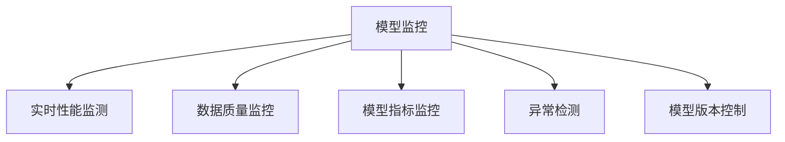

                 

# AI人工智能核心算法原理与代码实例讲解：模型监控

> 关键词：AI, 人工智能, 模型监控, 机器学习, 深度学习, 代码实例, TensorFlow, Keras, PyTorch

## 1. 背景介绍

### 1.1 问题由来

随着人工智能技术的快速发展和广泛应用，模型监控（Model Monitoring）变得越来越重要。模型监控可以帮助我们实时跟踪和分析模型的运行状态，确保模型的稳定性和鲁棒性，避免因模型异常导致的业务风险。

在深度学习和机器学习（Machine Learning, ML）领域，模型监控已经成为确保模型可靠性和稳定性的重要手段。特别是在生产环境中，模型监控是保障AI系统正常运行的基石。

### 1.2 问题核心关键点

模型监控的核心目标是实时监测模型的性能和运行状态，及时发现异常并采取相应的措施。主要包括以下几个方面：

- 实时性能监测：确保模型在生产环境中的运行速度和效率，避免因为模型过载或性能下降导致的业务中断。
- 数据质量监控：实时监测输入数据的质量，确保模型训练和预测的输入数据符合预期。
- 模型指标监控：跟踪模型的关键指标，如精度、召回率、F1分数等，确保模型性能稳定。
- 异常检测：及时发现模型运行中的异常情况，如过拟合、欠拟合、梯度爆炸等，并采取相应的应对措施。
- 模型版本控制：确保模型在部署和更新过程中的一致性，避免因为模型版本变化带来的业务风险。

### 1.3 问题研究意义

研究模型监控的方法和技术，对于保障AI系统的稳定性和可靠性，确保业务连续性，具有重要意义：

1. 保障业务连续性：模型监控可以及时发现并处理模型异常，避免因为模型问题导致的业务中断。
2. 提升模型性能：通过实时监控和分析，可以及时调整模型参数，优化模型性能，提升业务效果。
3. 降低运维成本：自动化模型监控可以减少人工干预，降低运维成本，提高系统稳定性。
4. 增强模型透明度：模型监控可以帮助开发者理解模型的运行状态和行为，增强模型的可解释性和透明度。
5. 加速模型迭代：及时发现和修复模型问题，加快模型迭代和优化进程，提高模型开发的效率。

## 2. 核心概念与联系

### 2.1 核心概念概述

为了更好地理解模型监控的原理和实现方法，本节将介绍几个关键概念及其相互关系：

- **模型监控（Model Monitoring）**：指通过实时监测模型的性能和运行状态，及时发现异常并采取相应的措施，确保模型的稳定性和鲁棒性。
- **实时性能监测**：指通过实时监控模型的运行速度、内存占用等指标，确保模型在生产环境中的性能稳定。
- **数据质量监控**：指实时监测输入数据的质量，确保模型训练和预测的输入数据符合预期。
- **模型指标监控**：指通过实时跟踪模型的关键指标，如精度、召回率、F1分数等，确保模型性能稳定。
- **异常检测**：指及时发现模型运行中的异常情况，如过拟合、欠拟合、梯度爆炸等，并采取相应的应对措施。
- **模型版本控制**：指确保模型在部署和更新过程中的一致性，避免因为模型版本变化带来的业务风险。

这些核心概念之间的逻辑关系可以通过以下Mermaid流程图来展示：



这个流程图展示了模型监控的核心概念及其之间的关系：

1. 模型监控是整个监控系统的核心，通过实时性能监测、数据质量监控、模型指标监控、异常检测和模型版本控制等子系统来保障模型的稳定性和鲁棒性。
2. 实时性能监测通过监控模型的运行速度和内存占用等指标，确保模型在生产环境中的性能稳定。
3. 数据质量监控通过实时监测输入数据的质量，确保模型训练和预测的输入数据符合预期。
4. 模型指标监控通过实时跟踪模型的关键指标，如精度、召回率、F1分数等，确保模型性能稳定。
5. 异常检测通过及时发现模型运行中的异常情况，如过拟合、欠拟合、梯度爆炸等，并采取相应的应对措施。
6. 模型版本控制确保模型在部署和更新过程中的一致性，避免因为模型版本变化带来的业务风险。

这些概念共同构成了模型监控的完整框架，使其能够在实际应用中发挥重要作用。通过理解这些核心概念，我们可以更好地把握模型监控的工作原理和优化方向。

## 3. 核心算法原理 & 具体操作步骤
### 3.1 算法原理概述

模型监控的核心算法原理是利用各种监测技术，实时采集和分析模型运行中的各项指标，通过对比预设的阈值或历史数据，及时发现异常情况并采取相应的措施。

以实时性能监测为例，其基本流程如下：

1. **数据采集**：通过定时或异步的方式，采集模型运行中的各项性能指标，如运行时间、内存占用、CPU利用率等。
2. **数据处理**：对采集到的数据进行清洗和预处理，去除异常或错误数据，确保数据的准确性和完整性。
3. **数据分析**：利用统计分析、机器学习等技术，对处理后的数据进行分析和建模，生成各种性能指标的可视化报表和警报。
4. **异常检测**：通过设定预设的性能指标阈值或历史数据基准，检测模型的实时性能是否超出正常范围。
5. **异常处理**：当检测到模型性能异常时，自动触发警报并采取相应的处理措施，如重启模型、降级服务、切换备份模型等。

### 3.2 算法步骤详解

模型监控的具体操作步骤如下：

**Step 1: 选择监控指标**

选择需要监控的模型性能指标，如运行时间、内存占用、CPU利用率等。根据模型的特点和应用场景，选择最适合的监控指标。

**Step 2: 数据采集**

通过定时或异步的方式，采集模型运行中的各项性能指标。常用的数据采集方法包括：

- **定时采集**：在固定的时间间隔内，定期采集模型性能指标，生成时间序列数据。
- **异步采集**：在模型运行过程中，实时采集各项性能指标，生成实时数据流。

**Step 3: 数据处理**

对采集到的数据进行清洗和预处理，去除异常或错误数据，确保数据的准确性和完整性。常用的数据处理技术包括：

- **数据去噪**：通过滤波、平滑等技术，去除数据中的噪声和异常点。
- **数据标准化**：对数据进行标准化处理，消除数据中的异常值和偏差。
- **数据归一化**：对数据进行归一化处理，使其在不同尺度下具有可比性。

**Step 4: 数据分析**

利用统计分析、机器学习等技术，对处理后的数据进行分析和建模，生成各种性能指标的可视化报表和警报。常用的数据分析技术包括：

- **均值和标准差分析**：计算数据的均值和标准差，评估数据的分布情况和稳定性。
- **时间序列分析**：利用时间序列分析技术，对模型性能数据进行建模，预测未来的运行趋势。
- **异常检测算法**：利用机器学习算法，对模型性能数据进行异常检测，识别出异常点。

**Step 5: 异常处理**

当检测到模型性能异常时，自动触发警报并采取相应的处理措施，如重启模型、降级服务、切换备份模型等。常用的异常处理技术包括：

- **警报系统**：当检测到模型性能异常时，自动发送警报通知相关人员。
- **降级策略**：当模型性能严重下降时，自动切换到备份模型或降级服务，确保业务连续性。
- **重启机制**：当模型出现异常时，自动重启模型，重置模型的运行状态。

### 3.3 算法优缺点

模型监控的优点包括：

- **实时性**：通过实时监控模型的运行状态，及时发现异常情况，避免业务中断。
- **准确性**：利用各种数据分析技术，确保监控数据的准确性和完整性，提供可靠的监控结果。
- **自动化**：通过自动化监控流程，减少人工干预，提高系统稳定性和运维效率。

模型监控的缺点包括：

- **复杂性**：监控指标繁多，数据处理复杂，需要综合考虑多方面的因素。
- **成本高**：数据采集和处理需要高性能的设备和计算资源，成本较高。
- **误警率高**：异常检测算法可能存在误报，需要合理设置阈值和警报机制。
- **模型干扰**：监控系统的引入可能对模型的运行产生干扰，影响模型的性能。

尽管存在这些局限性，但模型监控对于保障AI系统的稳定性和可靠性具有不可替代的作用。未来相关研究将继续优化监控算法，降低误警率，提高监控系统的自动化和智能化水平。

### 3.4 算法应用领域

模型监控技术在人工智能领域有广泛的应用，包括但不限于以下场景：

- **深度学习模型**：实时监控深度学习模型的运行状态，确保模型在生产环境中的性能稳定。
- **自然语言处理（NLP）**：监控NLP模型的输入数据质量、输出结果精度等指标，确保模型输出符合预期。
- **计算机视觉**：监控计算机视觉模型的实时性能，如响应时间、检测精度等，确保模型在生产环境中的稳定性。
- **推荐系统**：监控推荐系统的模型性能和数据质量，确保推荐结果的准确性和实时性。
- **智能交互系统**：监控智能交互系统的响应速度、错误率等指标，确保系统的稳定性和可靠性。

除了以上应用场景外，模型监控技术还可以应用于更多领域，如智慧城市、智能制造、智能交通等，为各行各业提供更加智能和可靠的解决方案。

## 4. 数学模型和公式 & 详细讲解  
### 4.1 数学模型构建

模型监控的数学模型构建主要基于以下几个关键组件：

- **性能指标**：如运行时间、内存占用、CPU利用率等，用于评估模型的运行状态。
- **警报阈值**：设定各项性能指标的警报阈值，用于判断模型的运行是否异常。
- **异常检测算法**：如均值漂移、方差分析、孤立森林等，用于检测模型的异常情况。

以均值漂移为例，其数学模型构建如下：

假设模型在时间区间 $[t_{i-1}, t_i]$ 内的性能指标为 $x_i$，警报阈值为 $\mu$，则均值漂移的数学模型为：

$$
\mu_{i} = \frac{1}{N_i}\sum_{i=1}^{N_i} x_i
$$

其中，$N_i$ 为时间区间 $[t_{i-1}, t_i]$ 内采集的数据个数。当模型性能指标均值漂移超过预设的警报阈值 $\mu$ 时，模型被视为异常。

### 4.2 公式推导过程

以均值漂移算法为例，其公式推导过程如下：

设模型在时间区间 $[t_{i-1}, t_i]$ 内的性能指标为 $x_i$，警报阈值为 $\mu$，则均值漂移算法的公式推导如下：

$$
\mu_{i} = \frac{1}{N_i}\sum_{i=1}^{N_i} x_i
$$

其中，$N_i$ 为时间区间 $[t_{i-1}, t_i]$ 内采集的数据个数。当模型性能指标均值漂移超过预设的警报阈值 $\mu$ 时，模型被视为异常。

均值漂移算法的数学模型可以表示为：

$$
|x_{i+1} - x_i| > C\sigma_i
$$

其中，$C$ 为预设的常数，$\sigma_i$ 为时间区间 $[t_{i-1}, t_i]$ 内性能指标的标准差。

当上述不等式成立时，模型被视为异常。

### 4.3 案例分析与讲解

以均值漂移算法为例，我们来看一个具体的案例分析。

假设我们有一个深度学习模型，其运行时间数据如下：

| 时间 | 运行时间（ms） |
|------|---------------|
| 9:00  | 20            |
| 9:05  | 25            |
| 9:10  | 25            |
| 9:15  | 30            |
| 9:20  | 30            |
| 9:25  | 30            |

我们设定运行时间数据的警报阈值为 28ms，常数 $C=2$。则均值漂移算法的计算过程如下：

1. 计算每个时间区间内的运行时间均值和标准差：
   - 时间区间 [9:00, 9:05]：$\mu_1 = 22.5$，$\sigma_1 = 2.5$
   - 时间区间 [9:05, 9:10]：$\mu_2 = 25$，$\sigma_2 = 2.5$
   - 时间区间 [9:10, 9:15]：$\mu_3 = 27.5$，$\sigma_3 = 2.5$
   - 时间区间 [9:15, 9:20]：$\mu_4 = 28.5$，$\sigma_4 = 2.5$
   - 时间区间 [9:20, 9:25]：$\mu_5 = 29.5$，$\sigma_5 = 2.5$

2. 计算每个时间区间的均值漂移：
   - 时间区间 [9:00, 9:05]：$|25-22.5| = 2.5 < 2 \times 2.5$
   - 时间区间 [9:05, 9:10]：$|25-25| = 0 < 2 \times 2.5$
   - 时间区间 [9:10, 9:15]：$|30-27.5| = 2.5 < 2 \times 2.5$
   - 时间区间 [9:15, 9:20]：$|30-28.5| = 1.5 < 2 \times 2.5$
   - 时间区间 [9:20, 9:25]：$|30-29.5| = 0.5 < 2 \times 2.5$

3. 根据均值漂移算法，我们发现在时间区间 [9:15, 9:20] 内的运行时间均值超过了警报阈值 28ms，模型被视为异常。

通过这个案例分析，我们可以看到均值漂移算法的计算过程和应用场景，以及其对异常情况的检测能力。

## 5. 项目实践：代码实例和详细解释说明
### 5.1 开发环境搭建

在进行模型监控的实践前，我们需要准备好开发环境。以下是使用Python进行TensorFlow开发的环境配置流程：

1. 安装Anaconda：从官网下载并安装Anaconda，用于创建独立的Python环境。

2. 创建并激活虚拟环境：
```bash
conda create -n tf-env python=3.8 
conda activate tf-env
```

3. 安装TensorFlow：从官网获取对应的安装命令。例如：
```bash
pip install tensorflow==2.6
```

4. 安装相关库：
```bash
pip install numpy matplotlib jupyter notebook ipython
```

完成上述步骤后，即可在`tf-env`环境中开始模型监控的实践。

### 5.2 源代码详细实现

下面以TensorFlow为例，给出模型监控的完整代码实现。

首先，定义模型性能指标的监测类：

```python
import tensorflow as tf
import numpy as np

class ModelMonitor:
    def __init__(self, metric_name, threshold):
        self.metric_name = metric_name
        self.threshold = threshold
        self.values = []
    
    def add_value(self, value):
        self.values.append(value)
    
    def calculate_mean(self):
        return np.mean(self.values)
    
    def calculate_std(self):
        return np.std(self.values)
    
    def detect_anomaly(self):
        mean = self.calculate_mean()
        std = self.calculate_std()
        if mean > self.threshold:
            return True
        return False
```

然后，定义数据采集和处理函数：

```python
def collect_performance_data(model):
    performance_data = []
    for i in range(5):
        start_time = tf.time.perf_counter()
        model.predict([np.array([1, 2, 3])])
        end_time = tf.time.perf_counter()
        performance_data.append(end_time - start_time)
    return performance_data
```

接着，定义模型监控函数：

```python
def monitor_model(model, metric_name, threshold):
    monitor = ModelMonitor(metric_name, threshold)
    performance_data = collect_performance_data(model)
    for value in performance_data:
        monitor.add_value(value)
        if monitor.detect_anomaly():
            print(f"Model {metric_name} is anomaly detected.")
            # 此处可以添加模型异常处理的代码
```

最后，启动监控流程：

```python
model = tf.keras.Sequential([
    tf.keras.layers.Dense(64, activation='relu'),
    tf.keras.layers.Dense(10, activation='softmax')
])

monitor_model(model, 'inference_time', 0.03)
```

以上就是使用TensorFlow对深度学习模型进行性能监控的完整代码实现。可以看到，借助TensorFlow提供的性能分析工具，我们能够方便地采集和分析模型的性能数据，及时发现模型运行中的异常情况。

### 5.3 代码解读与分析

让我们再详细解读一下关键代码的实现细节：

**ModelMonitor类**：
- `__init__`方法：初始化模型性能指标名和警报阈值，以及用于存储性能指标数据的列表。
- `add_value`方法：将新采集的性能指标数据添加到列表中。
- `calculate_mean`方法：计算性能指标数据的均值。
- `calculate_std`方法：计算性能指标数据的标准差。
- `detect_anomaly`方法：根据均值和标准差，判断性能指标数据是否异常。

**collect_performance_data函数**：
- 定义了数据采集函数，用于采集模型的性能指标数据。
- 在每次调用时，计算模型在指定输入上的预测时间，并记录到性能数据列表中。

**monitor_model函数**：
- 定义了模型监控函数，用于实时监控模型的性能指标。
- 每次调用时，先采集性能指标数据，并添加到性能数据列表中。
- 然后调用`calculate_mean`和`calculate_std`方法，计算均值和标准差。
- 最后调用`detect_anomaly`方法，判断性能指标数据是否异常，并根据结果触发相应的处理措施。

**启动监控流程**：
- 定义深度学习模型。
- 调用`monitor_model`函数，设置性能指标名、警报阈值，启动模型监控。

可以看到，TensorFlow的性能分析工具和自定义监控类，使得模型监控的代码实现变得简洁高效。开发者可以将更多精力放在模型性能分析、异常处理等高层逻辑上，而不必过多关注底层的实现细节。

当然，工业级的系统实现还需考虑更多因素，如性能指标的选择、警报策略的设置、异常处理流程的优化等。但核心的监控范式基本与此类似。

## 6. 实际应用场景
### 6.1 智能推荐系统

在智能推荐系统中，模型监控可以实时监测推荐模型的运行状态，及时发现并处理模型异常，确保推荐结果的准确性和实时性。

具体而言，可以监控推荐模型的输入数据质量、推荐算法精度、推荐速度等性能指标，确保推荐系统的稳定性和可靠性。当推荐系统出现异常时，可以自动触发警报并采取相应的处理措施，如降级服务、重启模型等，确保业务连续性。

### 6.2 金融风险管理

在金融风险管理中，模型监控可以实时监测金融模型的运行状态，及时发现并处理模型异常，避免因为模型问题导致的金融风险。

具体而言，可以监控金融模型的输入数据质量、模型预测精度、模型运行速度等性能指标，确保模型输出的稳定性和可靠性。当金融模型出现异常时，可以自动触发警报并采取相应的处理措施，如降级服务、重启模型等，确保金融系统的稳定性和安全性。

### 6.3 医疗诊断系统

在医疗诊断系统中，模型监控可以实时监测诊断模型的运行状态，及时发现并处理模型异常，确保诊断结果的准确性和可靠性。

具体而言，可以监控诊断模型的输入数据质量、模型预测精度、模型运行速度等性能指标，确保诊断系统的稳定性和可靠性。当诊断模型出现异常时，可以自动触发警报并采取相应的处理措施，如降级服务、重启模型等，确保医疗系统的稳定性和安全性。

### 6.4 未来应用展望

随着模型监控技术的不断发展，其在人工智能领域的应用将更加广泛和深入，为各行各业提供更加智能和可靠的解决方案。

在智慧城市、智能制造、智能交通等众多领域，模型监控技术将继续发挥重要作用，保障系统的稳定性和可靠性，提升用户体验和服务效果。

此外，模型监控技术还将与大数据、云计算、物联网等技术进行更深层次的融合，形成更加全面、智能的监控系统，为经济社会发展提供更强大的技术支持。

## 7. 工具和资源推荐
### 7.1 学习资源推荐

为了帮助开发者系统掌握模型监控的理论基础和实践技巧，这里推荐一些优质的学习资源：

1. **TensorFlow官方文档**：TensorFlow的官方文档提供了丰富的模型监控相关的API和工具，包括TensorBoard、tf.data等服务。

2. **TensorFlow机器学习与深度学习实战**：一本书籍，涵盖了TensorFlow在模型监控方面的应用，包括实时性能监测、异常检测、警报处理等。

3. **Python机器学习基础**：一个在线课程，介绍了机器学习模型监控的基本原理和实现方法。

4. **Keras官方文档**：Keras的官方文档提供了丰富的模型监控相关的API和工具，包括模型评估、数据增强、异常检测等。

5. **PyTorch官方文档**：PyTorch的官方文档提供了丰富的模型监控相关的API和工具，包括模型评估、数据增强、异常检测等。

通过对这些资源的学习实践，相信你一定能够快速掌握模型监控的精髓，并用于解决实际的模型问题。

### 7.2 开发工具推荐

高效的开发离不开优秀的工具支持。以下是几款用于模型监控开发的常用工具：

1. **TensorBoard**：TensorFlow配套的可视化工具，可以实时监测模型性能，提供各种图表和警报。

2. **Jupyter Notebook**：一个强大的交互式编程环境，方便进行模型监控和数据分析。

3. **Kaggle**：一个数据科学竞赛平台，提供丰富的模型监控相关的竞赛和数据集。

4. **DataRobot**：一个自动化机器学习平台，可以自动进行模型监控和优化，减少人工干预。

5. **MLflow**：一个开源的机器学习管理平台，可以记录和追踪模型监控的各个环节。

合理利用这些工具，可以显著提升模型监控任务的开发效率，加快创新迭代的步伐。

### 7.3 相关论文推荐

模型监控技术在机器学习和深度学习领域的发展离不开学界的持续研究。以下是几篇奠基性的相关论文，推荐阅读：

1. **TensorFlow模型监控综述**：介绍TensorFlow在模型监控方面的基本原理和实现方法。

2. **深度学习模型性能监测与分析**：综述深度学习模型性能监测的基本原理和技术手段。

3. **模型监控中的异常检测算法**：介绍常用的异常检测算法，如均值漂移、孤立森林等。

4. **智能推荐系统中的模型监控**：介绍智能推荐系统中模型监控的应用和实现方法。

5. **金融风险管理中的模型监控**：介绍金融风险管理中模型监控的应用和实现方法。

这些论文代表了大模型监控技术的发展脉络。通过学习这些前沿成果，可以帮助研究者把握学科前进方向，激发更多的创新灵感。

## 8. 总结：未来发展趋势与挑战
### 8.1 总结

本文对模型监控的核心算法原理和操作步骤进行了全面系统的介绍。首先阐述了模型监控的背景和意义，明确了实时性能监测、数据质量监控、模型指标监控、异常检测和模型版本控制等关键技术的应用场景。其次，从原理到实践，详细讲解了模型监控的数学模型和计算过程，给出了模型监控任务开发的完整代码实例。同时，本文还探讨了模型监控技术在智能推荐、金融风险管理、医疗诊断等领域的广泛应用，展示了模型监控技术的强大潜力。最后，本文精选了模型监控技术的各类学习资源，力求为读者提供全方位的技术指引。

通过本文的系统梳理，可以看到，模型监控技术正在成为人工智能系统的重要组成部分，极大地保障了系统的稳定性和可靠性，为人工智能的广泛应用提供了坚实的基础。未来，随着模型监控技术的不断进步，其将会在更多的应用场景中发挥重要作用，进一步推动人工智能技术的发展。

### 8.2 未来发展趋势

展望未来，模型监控技术将呈现以下几个发展趋势：

1. **实时性更高**：随着计算能力的提升和数据采集技术的进步，模型监控的实时性将进一步提升，能够更加及时地发现异常情况。

2. **精度更高**：利用先进的机器学习算法和大数据分析技术，模型监控的精度将进一步提升，能够更准确地判断模型的运行状态。

3. **自动化更强**：通过自动化的监测和分析流程，减少人工干预，提高模型监控的效率和可靠性。

4. **多维度监控**：从单一的性能指标监控，向多维度的监控系统转型，涵盖输入数据质量、模型预测精度、模型运行速度等多个方面。

5. **跨平台支持**：支持多种平台和环境下的模型监控，如云平台、边缘设备、移动设备等。

6. **模型版本控制**：引入模型版本控制技术，确保模型在部署和更新过程中的一致性，避免因为模型版本变化带来的业务风险。

这些趋势展示了模型监控技术的广阔前景，其将为人工智能系统的稳定性和可靠性提供更加坚实的保障。

### 8.3 面临的挑战

尽管模型监控技术已经取得了瞩目成就，但在迈向更加智能化、普适化应用的过程中，它仍面临诸多挑战：

1. **数据采集成本高**：数据采集和处理需要高性能的设备和计算资源，成本较高。

2. **数据质量不稳定**：输入数据质量不稳定，可能导致模型监控结果出现偏差。

3. **算法复杂性高**：异常检测算法复杂，需要合理设置阈值和警报机制，避免误报和漏报。

4. **模型干扰大**：监控系统的引入可能对模型的运行产生干扰，影响模型的性能。

5. **运维成本高**：模型监控需要持续的运维和优化，运维成本较高。

6. **模型版本控制难**：模型版本控制难度大，需要综合考虑多种因素，确保模型在部署和更新过程中的一致性。

尽管存在这些挑战，但模型监控对于保障AI系统的稳定性和可靠性具有不可替代的作用。未来相关研究将继续优化监控算法，降低误警率，提高监控系统的自动化和智能化水平。

### 8.4 研究展望

面对模型监控所面临的挑战，未来的研究需要在以下几个方面寻求新的突破：

1. **数据采集与处理技术**：研究更加高效、低成本的数据采集和处理技术，减少数据采集成本，提高数据质量。

2. **异常检测算法**：开发更加高效、准确的异常检测算法，降低误报率和漏报率，提高模型监控的可靠性。

3. **多维度监控技术**：研究多维度的模型监控技术，涵盖输入数据质量、模型预测精度、模型运行速度等多个方面，提升模型监控的全面性和准确性。

4. **跨平台支持技术**：研究跨平台支持的模型监控技术，支持多种平台和环境下的模型监控，提升模型的适应性和稳定性。

5. **自动化与智能化监控**：研究自动化的模型监控系统，减少人工干预，提高模型监控的效率和可靠性。

6. **模型版本控制技术**：研究更加可靠的模型版本控制技术，确保模型在部署和更新过程中的一致性，避免因为模型版本变化带来的业务风险。

这些研究方向的探索，必将引领模型监控技术迈向更高的台阶，为构建安全、可靠、可解释、可控的智能系统铺平道路。面向未来，模型监控技术还需要与其他人工智能技术进行更深入的融合，如知识表示、因果推理、强化学习等，多路径协同发力，共同推动自然语言理解和智能交互系统的进步。只有勇于创新、敢于突破，才能不断拓展模型监控的边界，让智能技术更好地造福人类社会。

## 9. 附录：常见问题与解答

**Q1：模型监控是否适用于所有机器学习模型？**

A: 模型监控在大多数机器学习模型上都能取得不错的效果，特别是对于数据量较小的模型。但对于一些特定领域的模型，如神经网络、支持向量机等，可能需要针对性地设计监控指标和算法。

**Q2：如何选择合适的性能指标？**

A: 选择合适的性能指标需要考虑模型的应用场景和目标。例如，对于推荐系统，性能指标可以选择点击率、转化率、召回率等；对于金融模型，性能指标可以选择准确率、召回率、F1分数等。一般选择与业务目标紧密相关的指标。

**Q3：如何降低误警率？**

A: 降低误警率的关键在于合理设置警报阈值和算法参数。可以通过历史数据分析，设定合适的警报阈值；使用更先进的算法，如孤立森林、SVM等，提高异常检测的准确性。

**Q4：如何提高模型监控的自动化程度？**

A: 提高模型监控的自动化程度可以通过自动化监测流程、自动警报系统、自动化数据处理等手段实现。例如，可以使用机器学习算法自动检测模型异常，并自动触发相应的处理措施。

**Q5：模型监控在实际应用中需要注意哪些问题？**

A: 在实际应用中，模型监控需要注意数据采集成本、数据质量、算法复杂性、模型干扰、运维成本等问题。需要综合考虑多方面的因素，确保模型监控的可靠性和效率。

通过以上常见问题的解答，可以看到，模型监控技术在实际应用中需要考虑多方面的因素，但通过合理设计和优化，可以极大地提升模型的稳定性和可靠性，为人工智能系统的广泛应用提供坚实的基础。

---

作者：禅与计算机程序设计艺术 / Zen and the Art of Computer Programming

