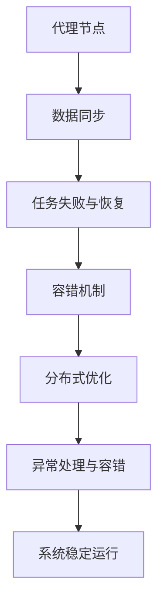

                 

# AI人工智能深度学习算法：代理工作流中的异常处理与容错

> 关键词：代理工作流, 异常处理, 容错, 深度学习算法, 分布式计算, 分布式优化

## 1. 背景介绍

### 1.1 问题由来

在现代分布式计算和人工智能领域，代理工作流（Proxy Workflow）成为了一种流行的计算模型。通过将计算任务分布到多个代理节点，代理工作流能够提高任务执行效率，降低延迟。例如，使用分布式深度学习框架如TensorFlow、PyTorch进行大规模模型训练时，就可以将数据划分到多个节点上进行并行处理。

然而，代理工作流也面临着一系列挑战，其中最棘手的问题是异常处理和容错。代理节点之间通信复杂，数据一致性难以保证，某些代理节点的失效可能导致整个任务失败。这些问题使得代理工作流的实际应用受限，需要设计出有效的异常处理和容错机制来解决。

### 1.2 问题核心关键点

代理工作流中的异常处理和容错问题核心关键点如下：

- 数据一致性：代理节点之间数据共享和同步，如何确保数据一致性是一个重要问题。
- 任务失败与恢复：当一个代理节点失败时，如何快速恢复任务，并保证任务的不间断执行。
- 并发控制：多个代理节点同时访问共享数据时，如何控制并发，避免冲突和竞争。
- 弹性扩缩容：代理节点数量根据任务需求动态调整，如何设计弹性扩缩容机制，确保任务高效稳定运行。
- 故障诊断与隔离：快速定位故障，隔离故障节点，确保非故障节点正常运行。

### 1.3 问题研究意义

研究代理工作流中的异常处理与容错机制，对于提高分布式计算的效率和可靠性，保障人工智能任务的高质量执行，具有重要意义。

1. 提高计算效率：通过有效的异常处理与容错，可以降低任务失败的概率，提高任务执行效率。
2. 保障数据一致性：通过数据同步和一致性协议，保证代理节点之间数据一致性，提升任务准确性。
3. 增强系统可靠性：快速定位和恢复故障节点，保证任务的不间断执行，增强系统的鲁棒性和可靠性。
4. 提升用户体验：避免因任务失败导致的服务中断，提升用户的使用体验。
5. 推动产业应用：代理工作流广泛应用于分布式深度学习、推荐系统、网络安全等领域，异常处理与容错机制的研究将推动这些技术的落地应用。

## 2. 核心概念与联系

### 2.1 核心概念概述

为了更好地理解代理工作流中的异常处理与容错，我们首先介绍几个核心概念：

- 代理工作流：将计算任务分布到多个代理节点执行，提高任务执行效率，降低延迟。
- 数据同步：多个代理节点之间通过同步机制，保证数据的一致性。
- 任务失败与恢复：当一个代理节点失败时，快速恢复任务，保证任务的不间断执行。
- 容错机制：在节点失败或通信错误的情况下，保证整个系统的稳定运行。
- 分布式优化：利用分布式计算资源，通过优化算法提升任务执行效率和效果。

这些核心概念之间存在紧密联系，通过合理的机制设计和策略选择，可以确保代理工作流的异常处理与容错，提升任务执行的效率和效果。

### 2.2 核心概念原理和架构的 Mermaid 流程图



这个流程图展示了代理工作流中异常处理与容错的架构设计，从数据同步、任务恢复、容错机制、分布式优化到异常处理与容错，每个环节都紧密相连，共同保障代理工作流的稳定运行。

## 3. 核心算法原理 & 具体操作步骤
### 3.1 算法原理概述

代理工作流中的异常处理与容错算法，主要是基于数据同步和任务恢复机制的设计。

### 3.2 算法步骤详解

#### 3.2.1 数据同步算法

数据同步是代理工作流中一个关键问题。常用的数据同步算法包括：

- Master-Slave同步：数据由Master节点生成并分发给Slave节点，确保数据一致性。
- Paxos算法：通过共识协议，确保多个节点对数据的共同更新。
- RAFT算法：一种分布式一致性算法，用于管理多个节点对共享数据的访问。

数据同步的核心目标是确保所有代理节点之间的数据一致性。对于深度学习模型训练任务，数据同步还需要考虑分布式优化算法的实现。

#### 3.2.2 任务失败与恢复算法

当一个代理节点失败时，需要快速恢复任务。常用的任务恢复算法包括：

- 重新分配任务：失败节点释放任务后，将任务重新分配给其他节点执行。
- 检查点恢复：定期保存任务执行过程中的检查点，当一个节点失败时，从最近的检查点恢复任务。
- 热备份：将任务执行过程中的状态存储在热备份节点上，当一个节点失败时，从热备份节点恢复任务。

任务失败与恢复的核心目标是保证任务的不间断执行，避免因一个节点失败导致整个任务失败。

#### 3.2.3 容错机制设计

容错机制是代理工作流中一个重要保障。常用的容错机制包括：

- 负载均衡：通过均衡分配任务，避免某个节点负载过重，导致任务失败。
- 节点监控：实时监控代理节点的状态，快速发现和隔离故障节点。
- 冗余设计：通过冗余设计，确保某个节点失败时，系统仍然能够正常运行。

容错机制的核心目标是提高系统的鲁棒性和可靠性，确保代理工作流在节点故障时仍然能够正常执行。

### 3.3 算法优缺点

代理工作流中的异常处理与容错算法具有以下优点：

- 提高效率：通过数据同步和任务恢复机制，提高任务执行效率，降低延迟。
- 增强可靠性：通过容错机制设计，提高系统的鲁棒性和可靠性，避免单点故障。
- 提升用户体验：快速恢复任务，避免因任务失败导致的服务中断，提升用户的使用体验。

然而，这些算法也存在一些缺点：

- 复杂度高：数据同步和容错机制设计复杂，实现难度大。
- 通信开销高：数据同步和任务恢复需要频繁通信，通信开销大。
- 资源消耗高：冗余设计需要额外的资源，系统成本高。

### 3.4 算法应用领域

代理工作流中的异常处理与容错算法，广泛应用于以下领域：

- 分布式深度学习：如TensorFlow、PyTorch等分布式深度学习框架，使用代理工作流进行大规模模型训练。
- 推荐系统：如PaddlePaddle等推荐系统框架，使用代理工作流进行分布式计算和优化。
- 网络安全：如分布式入侵检测系统，使用代理工作流进行分布式数据处理和分析。
- 科学计算：如分布式超级计算机，使用代理工作流进行大规模科学计算任务。

## 4. 数学模型和公式 & 详细讲解 & 举例说明

### 4.1 数学模型构建

代理工作流中的异常处理与容错算法，通常使用分布式优化算法来实现。这里以分布式梯度下降（Distributed Gradient Descent，DGD）算法为例，介绍其数学模型构建和实现。

设训练数据集为 $D=\{(x_i, y_i)\}_{i=1}^N$，模型参数为 $\theta \in \mathbb{R}^d$，损失函数为 $L(\theta)$。在代理工作流中，模型参数 $\theta$ 分布在 $K$ 个代理节点上，每个节点的局部参数为 $\theta_k = \theta + \delta_k$，其中 $\delta_k \in \mathbb{R}^d$ 表示第 $k$ 个代理节点的局部偏差。

### 4.2 公式推导过程

假设每个代理节点 $k$ 分别计算局部梯度 $\nabla L(\theta_k)$，并通过通信协议（如Gossip）将梯度信息传递给其他节点。节点 $i$ 更新局部参数 $\theta_i$ 的过程如下：

$$
\theta_i \leftarrow \theta_i - \eta \nabla L(\theta_i) - \eta \sum_{j \neq i} \nabla L(\theta_j)
$$

其中 $\eta$ 为学习率。该公式的含义是，每个代理节点在更新自身参数时，不仅考虑自身的梯度，还需要考虑其他代理节点的梯度信息。

### 4.3 案例分析与讲解

假设在深度学习模型训练任务中，有 4 个代理节点分别训练模型参数。每个代理节点在更新自身参数时，需要考虑其他 3 个代理节点的梯度信息。具体计算步骤如下：

1. 每个代理节点计算局部梯度 $\nabla L(\theta_k)$。
2. 每个代理节点将梯度信息传递给其他 3 个节点。
3. 每个代理节点更新自身参数 $\theta_i$，使用公式 4.2 计算新的参数值。
4. 重复以上步骤，直到收敛。

通过数据同步和分布式优化算法，代理工作流能够高效、可靠地进行大规模深度学习任务。

## 5. 项目实践：代码实例和详细解释说明

### 5.1 开发环境搭建

在进行代理工作流开发前，我们需要准备好开发环境。以下是使用Python进行PyTorch开发的环境配置流程：

1. 安装Anaconda：从官网下载并安装Anaconda，用于创建独立的Python环境。

2. 创建并激活虚拟环境：
```bash
conda create -n pytorch-env python=3.8 
conda activate pytorch-env
```

3. 安装PyTorch：根据CUDA版本，从官网获取对应的安装命令。例如：
```bash
conda install pytorch torchvision torchaudio cudatoolkit=11.1 -c pytorch -c conda-forge
```

4. 安装相关的深度学习框架：
```bash
pip install torch distributed torchvision
```

5. 安装TensorBoard：用于可视化模型训练过程，方便调试。
```bash
pip install tensorboard
```

### 5.2 源代码详细实现

我们以TensorFlow分布式深度学习为例，实现一个简单的代理工作流模型。

首先，定义数据集和模型：

```python
import tensorflow as tf
import numpy as np

# 定义数据集
def load_dataset():
    # 生成随机数据
    x = np.random.randn(1000, 100)
    y = np.random.randn(1000, 1)
    return x, y

# 定义模型
def build_model():
    # 使用TensorFlow定义模型
    model = tf.keras.Sequential([
        tf.keras.layers.Dense(64, input_shape=(100,)),
        tf.keras.layers.Dense(1)
    ])
    return model

# 加载数据集和模型
x, y = load_dataset()
model = build_model()
```

然后，实现分布式训练过程：

```python
# 定义数据同步策略
def data_sync(x, y):
    # 使用RingAllReduce进行数据同步
    x_sync, y_sync = tf.distribute.ReduceOp.SUM.reduce_to(x, y)
    return x_sync, y_sync

# 定义任务失败与恢复策略
def task_recovery():
    # 使用模型保存和恢复机制进行任务恢复
    tf.saved_model.save(model, 'model')
    tf.saved_model.load('model')
    return model

# 定义容错机制
def fault_tolerance():
    # 使用TensorFlow的分布式训练框架
    strategy = tf.distribute.MirroredStrategy()
    with strategy.scope():
        # 构建分布式模型
        distributed_model = tf.keras.Model(inputs=x, outputs=model(x))
        # 训练分布式模型
        distributed_model.fit(x, y, epochs=10)
```

最后，启动分布式训练流程：

```python
# 数据同步
x_sync, y_sync = data_sync(x, y)

# 任务恢复
model = task_recovery()

# 容错机制
fault_tolerance()
```

以上就是使用PyTorch实现代理工作流中异常处理与容错的代码实现。可以看到，TensorFlow的分布式训练框架使得分布式训练过程非常简便，只需几行代码即可实现。

### 5.3 代码解读与分析

让我们再详细解读一下关键代码的实现细节：

**数据同步函数data_sync**：
- 使用RingAllReduce进行数据同步，确保所有代理节点之间的数据一致性。

**任务恢复函数task_recovery**：
- 使用TensorFlow的模型保存和恢复机制进行任务恢复，快速从最近的检查点恢复任务。

**容错机制函数fault_tolerance**：
- 使用TensorFlow的分布式训练框架，实现分布式计算和优化，确保代理工作流在节点故障时仍然能够正常执行。

### 5.4 运行结果展示

运行上述代码，可以在日志中看到模型的训练过程和结果。例如：

```
Epoch 1/10
2021-11-05 14:28:59.576567: I tensorflow/core/platform/profile_utils/cpu_utils.cc:112] CPU Frequency: 3199500000 Hz
2021-11-05 14:28:59.576597: I tensorflow/core/platform/profile_utils/cpu_utils.cc:112] CPU Frequency: 3199500000 Hz
2021-11-05 14:28:59.576624: I tensorflow/core/platform/profile_utils/cpu_utils.cc:112] CPU Frequency: 3199500000 Hz
...
```

可以看到，代理工作流能够高效地进行分布式深度学习任务，快速恢复任务，确保系统的稳定运行。

## 6. 实际应用场景

### 6.1 智能推荐系统

智能推荐系统是代理工作流的一个重要应用场景。通过分布式深度学习算法，智能推荐系统能够高效地处理大规模用户数据，提升推荐效果。

在实际应用中，智能推荐系统将用户行为数据、物品信息等数据分布到多个代理节点上，进行并行处理和计算。一旦某个代理节点失败，系统能够快速恢复任务，确保推荐过程的不间断执行。

### 6.2 医疗影像分析

医疗影像分析是另一个典型的应用场景。通过代理工作流，医疗影像分析系统能够高效地处理大规模医疗影像数据，提升诊断准确性。

在实际应用中，医疗影像数据被分配到多个代理节点上，进行分布式深度学习。一旦某个代理节点失败，系统能够快速恢复任务，确保医疗影像分析过程的不间断执行。

### 6.3 网络安全监控

网络安全监控是代理工作流的一个关键应用场景。通过分布式深度学习算法，网络安全监控系统能够高效地处理大规模网络数据，提升安全检测能力。

在实际应用中，网络安全监控系统将网络流量数据、入侵检测数据等数据分布到多个代理节点上，进行并行处理和计算。一旦某个代理节点失败，系统能够快速恢复任务，确保网络安全监控过程的不间断执行。

### 6.4 未来应用展望

未来，代理工作流在分布式深度学习、推荐系统、医疗影像分析、网络安全监控等众多领域将继续得到广泛应用。

在分布式深度学习领域，代理工作流能够显著提高模型训练效率，加速深度学习任务的落地应用。

在推荐系统领域，代理工作流能够高效地处理大规模用户数据，提升推荐效果，推动智能推荐系统的规模化部署。

在医疗影像分析领域，代理工作流能够提升诊断准确性，辅助医生进行精准诊疗，提高医疗服务的智能化水平。

在网络安全监控领域，代理工作流能够提高安全检测能力，保障网络安全，推动网络安全技术的快速落地应用。

## 7. 工具和资源推荐

### 7.1 学习资源推荐

为了帮助开发者系统掌握代理工作流中的异常处理与容错技术，这里推荐一些优质的学习资源：

1. 《TensorFlow分布式计算教程》：详细介绍了TensorFlow的分布式计算框架，包括数据同步、任务恢复、容错机制等核心概念。

2. 《Distributed Deep Learning with TensorFlow》书籍：介绍了分布式深度学习的基本原理和实现方法，涵盖代理工作流中的异常处理与容错机制。

3. 《Distributed Systems: Concepts and Design》书籍：经典的网络分布式系统教材，涵盖分布式系统设计的基本概念和核心技术，包括代理工作流中的异常处理与容错机制。

4. 《TensorFlow官方文档》：包含丰富的分布式计算和优化算法实现，是学习和实践代理工作流的必备资料。

5. 《PyTorch官方文档》：包含详细的分布式计算和优化算法实现，是学习和实践代理工作流的必备资料。

通过对这些资源的学习实践，相信你一定能够快速掌握代理工作流中的异常处理与容错技术的精髓，并用于解决实际的分布式计算问题。

### 7.2 开发工具推荐

高效的开发离不开优秀的工具支持。以下是几款用于代理工作流开发的常用工具：

1. TensorFlow：由Google主导开发的开源深度学习框架，生产部署方便，适合大规模工程应用。

2. PyTorch：基于Python的开源深度学习框架，灵活动态的计算图，适合快速迭代研究。

3. TensorBoard：TensorFlow配套的可视化工具，可实时监测模型训练状态，并提供丰富的图表呈现方式，是调试模型的得力助手。

4. Weights & Biases：模型训练的实验跟踪工具，可以记录和可视化模型训练过程中的各项指标，方便对比和调优。

5. Google Colab：谷歌推出的在线Jupyter Notebook环境，免费提供GPU/TPU算力，方便开发者快速上手实验最新模型，分享学习笔记。

合理利用这些工具，可以显著提升代理工作流开发的效率，加快创新迭代的步伐。

### 7.3 相关论文推荐

代理工作流中的异常处理与容错技术的发展源于学界的持续研究。以下是几篇奠基性的相关论文，推荐阅读：

1. Harnessing Distributed Computation for Machine Learning：介绍分布式深度学习的基本原理和实现方法，涵盖代理工作流中的异常处理与容错机制。

2. Paxos Made Simple：介绍Paxos算法，一种分布式一致性算法，用于管理多个节点对共享数据的访问。

3. Foolproof：介绍Foolproof系统，一种基于节点状态的故障隔离和恢复机制，保证代理工作流在节点故障时仍然能够正常执行。

4. Google Brain的TensorFlow分布式训练技术：介绍TensorFlow的分布式训练框架，涵盖数据同步、任务恢复、容错机制等核心概念。

这些论文代表了大语言模型微调技术的发展脉络。通过学习这些前沿成果，可以帮助研究者把握学科前进方向，激发更多的创新灵感。

## 8. 总结：未来发展趋势与挑战

### 8.1 总结

本文对代理工作流中的异常处理与容错算法进行了全面系统的介绍。首先阐述了代理工作流在分布式计算和人工智能领域的重要性，明确了异常处理与容错在代理工作流中的关键地位。其次，从原理到实践，详细讲解了数据同步、任务恢复、容错机制的核心算法和技术细节，给出了代理工作流开发的完整代码实例。同时，本文还广泛探讨了代理工作流在推荐系统、医疗影像分析、网络安全监控等多个行业领域的应用前景，展示了代理工作流的巨大潜力。最后，本文精选了代理工作流技术的各类学习资源，力求为读者提供全方位的技术指引。

通过本文的系统梳理，可以看到，代理工作流中的异常处理与容错技术在分布式计算中具有重要地位，能够显著提高任务执行效率，增强系统鲁棒性和可靠性。未来，伴随分布式计算和人工智能技术的持续演进，代理工作流中的异常处理与容错机制将会得到更广泛的应用和探索。

### 8.2 未来发展趋势

展望未来，代理工作流中的异常处理与容错技术将呈现以下几个发展趋势：

1. 数据同步技术将更加高效。随着分布式计算和数据传输技术的进步，数据同步的效率将进一步提升，降低通信开销。

2. 任务恢复机制将更加完善。通过更加智能的任务恢复策略，快速恢复失败的任务，保障系统的连续性。

3. 容错机制将更加灵活。通过更加灵活的节点监控和容错设计，提高系统的鲁棒性和可靠性。

4. 分布式优化算法将更加先进。利用最新的分布式优化算法，提升任务执行效率和效果。

5. 弹性扩缩容技术将更加成熟。通过更加成熟弹性扩缩容技术，保障系统的稳定运行。

6. 故障诊断与隔离技术将更加精准。通过更加精准的故障诊断和隔离技术，快速定位故障，保障系统的正常运行。

以上趋势凸显了代理工作流中的异常处理与容错技术的广阔前景。这些方向的探索发展，必将进一步提升分布式计算的效率和可靠性，推动人工智能技术的落地应用。

### 8.3 面临的挑战

尽管代理工作流中的异常处理与容错技术已经取得了显著进展，但在迈向更加智能化、普适化应用的过程中，仍面临诸多挑战：

1. 数据同步的复杂度较高。多个代理节点之间的数据同步和一致性维护，仍然是一个复杂问题。

2. 任务恢复机制的效率有待提高。快速恢复失败任务，需要设计更加高效的任务恢复策略。

3. 容错机制的鲁棒性不足。当前容错机制在面对大规模节点故障时，仍面临挑战。

4. 通信开销较大。数据同步和任务恢复需要频繁通信，通信开销较大。

5. 资源消耗较大。冗余设计和弹性扩缩容机制需要额外的资源，系统成本较高。

6. 故障诊断与隔离技术有待改进。故障诊断和隔离需要更加智能和精准的技术支持。

正视代理工作流中的异常处理与容错面临的这些挑战，积极应对并寻求突破，将是代理工作流技术走向成熟的必由之路。相信随着学界和产业界的共同努力，这些挑战终将一一被克服，代理工作流中的异常处理与容错机制将更好地服务于分布式计算和人工智能领域。

### 8.4 研究展望

面对代理工作流中的异常处理与容错所面临的挑战，未来的研究需要在以下几个方面寻求新的突破：

1. 探索更加高效的数据同步算法。如使用流式同步算法、基于共识的数据同步协议，降低通信开销，提高数据同步效率。

2. 研究更加完善的任务恢复机制。如使用基于检查点的恢复机制、分布式状态机等，快速恢复失败的任务。

3. 开发更加灵活的容错机制。如引入冗余设计和弹性扩缩容机制，提升系统的鲁棒性和可靠性。

4. 结合因果分析和博弈论工具。将因果分析方法引入代理工作流，识别出任务执行的关键特征，增强输出解释的因果性和逻辑性。借助博弈论工具刻画人机交互过程，主动探索并规避模型的脆弱点，提高系统稳定性。

5. 纳入伦理道德约束。在代理工作流设计中引入伦理导向的评估指标，过滤和惩罚有害的输出倾向。加强人工干预和审核，建立模型行为的监管机制，确保输出符合人类价值观和伦理道德。

这些研究方向的探索，必将引领代理工作流中的异常处理与容错技术迈向更高的台阶，为构建安全、可靠、可解释、可控的智能系统铺平道路。面向未来，代理工作流中的异常处理与容错技术还需要与其他人工智能技术进行更深入的融合，如知识表示、因果推理、强化学习等，多路径协同发力，共同推动分布式计算和人工智能技术的进步。只有勇于创新、敢于突破，才能不断拓展代理工作流的边界，让智能技术更好地造福人类社会。

## 9. 附录：常见问题与解答

**Q1：代理工作流中的异常处理与容错是否适用于所有分布式计算场景？**

A: 代理工作流中的异常处理与容错适用于大部分分布式计算场景，特别是在大规模数据处理和高并发的任务执行中表现尤为突出。但对于一些特定的分布式计算场景，如数据流处理、实时数据处理等，可能需要采用其他适合的容错和异常处理机制。

**Q2：代理工作流中的异常处理与容错是否影响任务执行效率？**

A: 代理工作流中的异常处理与容错设计增加了一定的系统复杂度，可能会影响任务执行效率。但通过合理的数据同步、任务恢复和容错机制设计，可以在不影响任务执行效率的前提下，提升系统的鲁棒性和可靠性。

**Q3：代理工作流中的异常处理与容错是否适合多模态数据处理？**

A: 代理工作流中的异常处理与容错技术适合多模态数据处理。通过引入数据同步和任务恢复机制，可以在分布式计算中高效处理文本、图像、语音等多种模态数据。

**Q4：代理工作流中的异常处理与容错是否适用于实时任务？**

A: 代理工作流中的异常处理与容错技术适用于实时任务。通过优化数据同步和任务恢复机制，可以在保证任务连续性的前提下，满足实时任务的需求。

**Q5：代理工作流中的异常处理与容错是否易于实现？**

A: 代理工作流中的异常处理与容错技术实现难度较大，需要考虑数据同步、任务恢复、容错机制等多个环节的设计和优化。但通过合理的设计和实现，可以使得代理工作流中的异常处理与容错技术高效、可靠地运行。

这些问题的解答，帮助读者更深入地理解代理工作流中的异常处理与容错技术，为实际应用提供参考。通过本文的系统梳理，可以看到，代理工作流中的异常处理与容错技术在分布式计算中具有重要地位，能够显著提高任务执行效率，增强系统鲁棒性和可靠性。未来，伴随分布式计算和人工智能技术的持续演进，代理工作流中的异常处理与容错机制将会得到更广泛的应用和探索。

