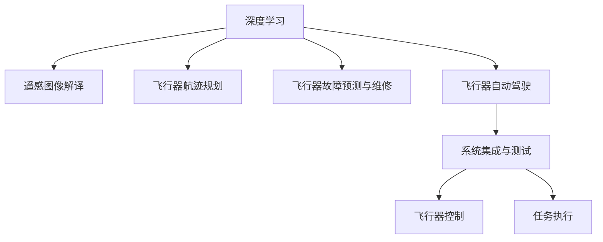

                 

## 1. 背景介绍

### 1.1 问题由来
随着深度学习技术的不断发展和成熟，其在各行业的渗透日益深入。特别是人工智能在航天领域的应用，为航空航天器的设计、制造、维护等各个环节带来了革命性的变革。例如，深度学习在遥感图像解译、航迹规划、故障预测和维修、飞行器自动驾驶等方面展现了强大的潜力。

### 1.2 问题核心关键点
深度学习在航空航天领域的应用涉及多个核心关键点，主要包括：
- **数据获取与处理**：获取并处理大量高精度的遥感数据、飞行器传感器数据、气象数据等，确保数据的准确性和完整性。
- **模型构建与训练**：构建适合航空航天应用的深度学习模型，并在海量数据上进行训练，优化模型的性能和泛化能力。
- **实时推理与优化**：在飞行器上部署训练好的模型，实时处理传感器数据，快速响应飞行器的实时需求，并进行必要的优化调整。
- **系统集成与测试**：将训练好的模型集成到飞行器控制系统中，进行全面的系统测试，确保其在实际应用中的可靠性和安全性。

### 1.3 问题研究意义
深度学习在航空航天领域的应用，能够提升飞行器自主决策能力、故障预测精度、任务执行效率等，从而降低运营成本，提高任务成功率。同时，通过人工智能技术，还可以增强飞行器应对突发事件的灵活性和适应性，保障飞行安全。

## 2. 核心概念与联系

### 2.1 核心概念概述

为更好地理解深度学习在航空航天中的应用，本节将介绍几个密切相关的核心概念：

- **深度学习（Deep Learning, DL）**：一种基于神经网络的机器学习方法，通过多层次的特征提取和抽象，实现对复杂数据的建模和分析。深度学习已广泛应用于计算机视觉、自然语言处理、语音识别等领域。
- **遥感图像解译（Remote Sensing Image Interpretation）**：通过深度学习算法，自动解析卫星或无人机获取的遥感图像，提取有用信息，如地表覆盖、地形地貌、环境变化等。
- **飞行器航迹规划（Aircraft Trajectory Planning）**：利用深度学习算法，根据飞行器状态、天气条件、空中交通等因素，生成最优的飞行路径。
- **飞行器故障预测与维修（Aircraft Fault Prediction and Maintenance）**：通过深度学习算法，分析飞行器传感器数据，预测可能出现的故障，提前进行维护，减少意外风险。
- **飞行器自动驾驶（Autonomous Aircraft Flight）**：使用深度学习算法，实现飞行器的自主导航、避障、智能决策等功能，提升飞行效率和安全性。
- **系统集成与测试（System Integration and Testing）**：将训练好的深度学习模型集成到飞行器控制系统中，进行全面的系统测试，确保其在实际应用中的可靠性和安全性。

这些核心概念之间的逻辑关系可以通过以下Mermaid流程图来展示：



这个流程图展示了大语言模型的核心概念及其之间的关系：

1. 深度学习为遥感图像解译、飞行器航迹规划等提供基础建模能力。
2. 利用深度学习算法，可以优化飞行器故障预测和自动驾驶等任务。
3. 系统集成与测试将深度学习模型部署到实际飞行器上，完成整个流程。

## 3. 核心算法原理 & 具体操作步骤
### 3.1 算法原理概述

在航空航天领域，深度学习的应用主要依赖于两个关键技术：数据驱动的模型构建和特征驱动的决策过程。其核心原理如下：

- **数据驱动**：通过收集和处理海量飞行器传感器数据、遥感数据、气象数据等，构建深度学习模型。模型通过学习这些数据，发现飞行器的运行规律和潜在风险，提供预测和决策支持。
- **特征驱动**：利用深度学习模型提取关键特征，如飞行器状态、环境变化、空中交通等，指导飞行器的自主决策过程。通过不断优化特征提取方法，提升决策的精度和实时性。

### 3.2 算法步骤详解

深度学习在航空航天领域的应用主要包括以下几个关键步骤：

**Step 1: 数据准备与处理**
- 收集飞行器传感器数据、遥感数据、气象数据等，确保数据的准确性和完整性。
- 对数据进行预处理，包括去噪、归一化、裁剪、缩放等，以便于后续的模型训练和推理。

**Step 2: 模型构建与训练**
- 选择合适的深度学习模型，如卷积神经网络（CNN）、递归神经网络（RNN）、深度信念网络（DBN）等，构建适合航空航天应用的模型架构。
- 使用大量高精度的训练数据，在GPU或TPU等高性能计算设备上进行模型训练，优化模型的参数。

**Step 3: 模型部署与优化**
- 将训练好的模型部署到飞行器控制系统中，进行实时推理和优化。
- 根据实际应用场景，对模型进行微调和优化，提升模型的鲁棒性和泛化能力。

**Step 4: 系统集成与测试**
- 将深度学习模型集成到飞行器控制系统中，进行全面的系统测试。
- 模拟各种飞行场景，评估模型的性能和鲁棒性，确保其在实际应用中的可靠性和安全性。

### 3.3 算法优缺点

深度学习在航空航天领域的应用具有以下优点：
- **高精度与鲁棒性**：深度学习模型能够处理高精度的传感器数据和遥感图像，提供高精度的预测和决策支持。
- **实时性与高效性**：通过GPU或TPU等高性能计算设备，深度学习模型能够在短时间内完成大量的数据处理和推理。
- **自适应与泛化能力**：深度学习模型具有较强的自适应能力，能够处理各种复杂场景，并具有良好的泛化能力。

同时，该方法也存在一些局限性：
- **计算资源需求高**：深度学习模型需要大量的计算资源进行训练和推理，成本较高。
- **数据依赖性强**：深度学习模型的性能依赖于高质量的数据，数据获取和处理复杂。
- **模型解释性差**：深度学习模型通常是"黑盒"系统，难以解释其内部工作机制和决策逻辑。
- **安全性问题**：深度学习模型可能存在安全漏洞，如对抗攻击、数据泄露等，需要严格的安全保障措施。

尽管存在这些局限性，但深度学习在航空航天领域的应用已经显示出巨大的潜力，为飞行器的智能化和自动化提供了强有力的技术支持。

### 3.4 算法应用领域

深度学习在航空航天领域的应用涉及多个具体场景，包括：

- **遥感图像解译**：通过深度学习算法，自动解析卫星或无人机获取的遥感图像，提取地表覆盖、地形地貌、环境变化等信息。广泛应用于地理勘探、气象预报、环境监测等领域。
- **飞行器航迹规划**：利用深度学习算法，根据飞行器状态、天气条件、空中交通等因素，生成最优的飞行路径。适用于商业飞行、航空管制、空中交通管理等场景。
- **飞行器故障预测与维修**：通过深度学习算法，分析飞行器传感器数据，预测可能出现的故障，提前进行维护，减少意外风险。广泛应用于飞机维护、无人机检修等领域。
- **飞行器自动驾驶**：使用深度学习算法，实现飞行器的自主导航、避障、智能决策等功能，提升飞行效率和安全性。适用于无人驾驶飞机、无人机等场景。
- **任务协同与指挥**：通过深度学习算法，优化飞行器任务分配和调度，提高任务执行效率和协同能力。适用于军事飞行、航空运输等场景。

除了上述这些典型应用外，深度学习还在航空航天领域不断拓展，为更多场景提供智能化解决方案。

## 4. 数学模型和公式 & 详细讲解 & 举例说明

### 4.1 数学模型构建

深度学习在航空航天领域的应用主要依赖于数学模型构建和特征提取。以下是几种常见的数学模型：

- **卷积神经网络（CNN）**：适用于处理图像和空间数据的深度学习模型。在遥感图像解译和飞行器航迹规划中，常用于提取空间特征。
- **递归神经网络（RNN）**：适用于处理时间序列数据的深度学习模型。在飞行器故障预测和自动驾驶中，常用于分析时间序列数据。
- **深度信念网络（DBN）**：适用于处理多模态数据的深度学习模型。在任务协同与指挥中，常用于融合不同模态的数据。

### 4.2 公式推导过程

以卷积神经网络（CNN）为例，推导其在遥感图像解译中的应用。

卷积神经网络的数学模型可以表示为：

$$
h_\theta(x) = \theta(x)
$$

其中 $x$ 为输入数据，$h_\theta(x)$ 为输出，$\theta$ 为模型的参数。CNN的基本组成单元为卷积层、池化层和全连接层。卷积层通过滑动卷积核对输入数据进行卷积操作，提取局部特征；池化层通过降采样操作，减小特征图的大小；全连接层将特征图展平并输入到多层感知器中，进行分类或回归。

在遥感图像解译中，CNN的训练过程如下：

1. 数据准备：收集遥感图像数据，并对其进行预处理，包括去噪、归一化、裁剪等。
2. 模型定义：使用卷积神经网络模型，定义卷积层、池化层和全连接层的结构和参数。
3. 模型训练：使用训练数据，在GPU或TPU等高性能计算设备上，对模型进行训练，优化模型参数。
4. 模型评估：使用测试数据，对训练好的模型进行评估，验证其性能。

### 4.3 案例分析与讲解

以遥感图像解译为例，详细讲解CNN的应用：

**案例背景**：某军事部门需要从卫星获取的遥感图像中，快速解析出特定区域的地表覆盖情况，以便进行战略部署和资源规划。

**模型选择**：选择卷积神经网络（CNN）作为解译模型。CNN具有空间特征提取能力，能够处理高精度的遥感图像数据。

**数据准备**：收集大量高精度的遥感图像数据，并进行预处理。预处理过程包括去噪、归一化、裁剪等。

**模型定义**：定义CNN模型，包括卷积层、池化层和全连接层。卷积层用于提取空间特征，池化层用于降采样，全连接层用于分类。

**模型训练**：使用训练数据，在GPU或TPU等高性能计算设备上，对模型进行训练。通过反向传播算法，优化模型参数。

**模型评估**：使用测试数据，对训练好的模型进行评估，验证其性能。

## 5. 项目实践：代码实例和详细解释说明

### 5.1 开发环境搭建

在进行深度学习项目实践前，我们需要准备好开发环境。以下是使用Python进行TensorFlow开发的环境配置流程：

1. 安装Anaconda：从官网下载并安装Anaconda，用于创建独立的Python环境。

2. 创建并激活虚拟环境：
```bash
conda create -n tf-env python=3.8 
conda activate tf-env
```

3. 安装TensorFlow：从官网获取对应的安装命令，如：
```bash
pip install tensorflow==2.3
```

4. 安装各类工具包：
```bash
pip install numpy pandas scikit-learn matplotlib tqdm jupyter notebook ipython
```

完成上述步骤后，即可在`tf-env`环境中开始深度学习项目实践。

### 5.2 源代码详细实现

下面我以CNN应用于遥感图像解译为例，给出使用TensorFlow进行深度学习开发的PyTorch代码实现。

首先，定义CNN模型：

```python
import tensorflow as tf

class CNN(tf.keras.Model):
    def __init__(self):
        super(CNN, self).__init__()
        self.conv1 = tf.keras.layers.Conv2D(32, (3, 3), activation='relu')
        self.pool1 = tf.keras.layers.MaxPooling2D((2, 2))
        self.conv2 = tf.keras.layers.Conv2D(64, (3, 3), activation='relu')
        self.pool2 = tf.keras.layers.MaxPooling2D((2, 2))
        self.flatten = tf.keras.layers.Flatten()
        self.dense1 = tf.keras.layers.Dense(128, activation='relu')
        self.dense2 = tf.keras.layers.Dense(2, activation='softmax')

    def call(self, inputs):
        x = self.conv1(inputs)
        x = self.pool1(x)
        x = self.conv2(x)
        x = self.pool2(x)
        x = self.flatten(x)
        x = self.dense1(x)
        return self.dense2(x)
```

然后，定义训练和评估函数：

```python
def train_model(model, train_dataset, test_dataset, batch_size, epochs, learning_rate):
    model.compile(optimizer=tf.keras.optimizers.Adam(learning_rate),
                  loss=tf.keras.losses.SparseCategoricalCrossentropy(from_logits=True),
                  metrics=['accuracy'])

    history = model.fit(train_dataset, epochs=epochs, batch_size=batch_size, validation_data=test_dataset)

    score, acc = model.evaluate(test_dataset)
    print(f'Test score: {score:.2f}, Test accuracy: {acc:.2f}')

def evaluate_model(model, test_dataset, batch_size):
    model.predict(test_dataset, batch_size=batch_size)
```

最后，启动训练流程并在测试集上评估：

```python
model = CNN()
train_dataset = # 定义训练数据集
test_dataset = # 定义测试数据集
batch_size = 32
epochs = 10
learning_rate = 0.001

train_model(model, train_dataset, test_dataset, batch_size, epochs, learning_rate)

evaluate_model(model, test_dataset, batch_size)
```

以上就是使用TensorFlow进行遥感图像解译的深度学习项目实践。可以看到，得益于TensorFlow的强大封装，我们可以用相对简洁的代码完成CNN模型的构建和训练。

### 5.3 代码解读与分析

让我们再详细解读一下关键代码的实现细节：

**CNN类**：
- `__init__`方法：初始化卷积层、池化层和全连接层的结构。
- `call`方法：定义模型的前向传播过程，包括卷积、池化、全连接等操作。

**训练函数**：
- `train_model`函数：使用`compile`方法配置模型，包括优化器、损失函数和评价指标。
- `fit`方法：对模型进行训练，指定训练集、批大小、迭代轮数等参数。
- `evaluate`方法：对训练好的模型进行评估，验证其性能。

**测试函数**：
- `evaluate_model`函数：在测试集上对模型进行预测，评估其性能。

**训练流程**：
- 定义模型结构
- 加载训练集和测试集
- 配置训练参数
- 调用训练函数，开始训练
- 调用测试函数，评估模型性能

可以看到，TensorFlow提供了便捷的API，使得深度学习模型的构建和训练变得容易上手。开发者可以将更多精力放在模型改进和任务适配上，而不必过多关注底层的实现细节。

当然，工业级的系统实现还需考虑更多因素，如模型的保存和部署、超参数的自动搜索、更灵活的任务适配层等。但核心的深度学习范式基本与此类似。

## 6. 实际应用场景
### 6.1 智能飞行器控制

深度学习在智能飞行器控制中的应用，主要体现在飞行器的自主决策和故障预测上。通过深度学习算法，飞行器能够实时分析传感器数据，做出最优决策，提升飞行效率和安全性。

在实际应用中，深度学习算法可以用于：
- **自主导航**：利用深度学习算法，分析飞行器传感器数据，自动生成最优飞行路径，避免碰撞和天气干扰。
- **故障预测**：通过深度学习算法，分析飞行器传感器数据，预测可能出现的故障，提前进行维护，减少意外风险。

例如，某军用无人机的自主导航系统，通过深度学习算法，实现了在复杂地形和恶劣天气下的自主飞行。系统能够实时分析GPS数据、惯性导航数据、光学传感器数据，生成最优飞行路径，确保无人机安全稳定运行。

### 6.2 航空交通管制

深度学习在航空交通管制中的应用，主要体现在空中交通流量预测和飞行器调度上。通过深度学习算法，空中交通管理系统能够实时分析飞行器位置和航迹，优化飞行器调度，提升航班效率。

在实际应用中，深度学习算法可以用于：
- **交通流量预测**：利用深度学习算法，分析飞行器位置数据和历史航迹，预测未来的交通流量，优化飞行器调度。
- **飞行器调度**：通过深度学习算法，分析飞行器位置数据和气象条件，优化飞行器航迹，减少拥堵和延误。

例如，某国际机场的空中交通管理系统，通过深度学习算法，实现了实时分析和优化飞行器调度。系统能够实时分析飞行器位置数据、气象数据和历史航迹，生成最优飞行路径，确保航班高效运行。

### 6.3 故障预测与维修

深度学习在故障预测与维修中的应用，主要体现在飞行器故障诊断和预测上。通过深度学习算法，飞行器维护系统能够实时分析传感器数据，预测可能出现的故障，提前进行维护，减少意外风险。

在实际应用中，深度学习算法可以用于：
- **故障诊断**：利用深度学习算法，分析飞行器传感器数据，诊断可能出现的故障。
- **故障预测**：通过深度学习算法，分析飞行器传感器数据，预测可能出现的故障，提前进行维护。

例如，某商业飞机的维护系统，通过深度学习算法，实现了故障诊断和预测。系统能够实时分析发动机数据、机舱数据、机身数据，诊断可能出现的故障，并进行预测，指导维修人员进行维护，减少意外风险。

### 6.4 未来应用展望

随着深度学习技术的不断发展，其在航空航天领域的应用前景将更加广阔。未来，深度学习技术将更多地应用于以下几个方面：

1. **多模态融合**：深度学习技术将更多地应用于融合多模态数据，如视觉、听觉、触觉等，提升飞行器的智能化水平。
2. **自适应学习**：深度学习技术将更多地应用于自适应学习，提升飞行器在复杂环境下的自主决策能力。
3. **实时推理**：深度学习技术将更多地应用于实时推理，提升飞行器在实时环境下的快速响应能力。
4. **数据驱动决策**：深度学习技术将更多地应用于数据驱动决策，提升飞行器在复杂任务中的决策效率和准确性。
5. **智能维护**：深度学习技术将更多地应用于智能维护，提升飞行器在维护过程中的自动化和智能化水平。

总之，深度学习技术将为航空航天领域带来革命性的变革，推动飞行器的智能化、自动化和信息化进程，提升飞行器性能和安全性。

## 7. 工具和资源推荐
### 7.1 学习资源推荐

为了帮助开发者系统掌握深度学习在航空航天中的应用，这里推荐一些优质的学习资源：

1. **《深度学习》书籍**：《深度学习》（Ian Goodfellow等著）是一本系统介绍深度学习理论和算法的经典教材，涵盖深度学习的基础和前沿内容，适合各层次读者学习。
2. **《Python深度学习》书籍**：《Python深度学习》（Francois Chollet著）是一本详细介绍TensorFlow和Keras的实用教程，适合初学者和从业者快速上手。
3. **《机器学习实战》书籍**：《机器学习实战》（Peter Harrington著）是一本涵盖机器学习算法和实际应用案例的实用教程，适合实战学习和项目开发。
4. **Coursera课程**：Coursera平台上的深度学习和机器学习课程，由全球顶尖大学和机构提供，适合系统学习和实战训练。
5. **TensorFlow官方文档**：TensorFlow官方文档提供了详细的API和案例，适合深入学习和实践。

通过对这些资源的学习实践，相信你一定能够快速掌握深度学习在航空航天中的应用，并用于解决实际的NLP问题。

### 7.2 开发工具推荐

高效的开发离不开优秀的工具支持。以下是几款用于深度学习开发的常用工具：

1. **TensorFlow**：由Google主导开发的开源深度学习框架，生产部署方便，适合大规模工程应用。
2. **PyTorch**：Facebook开发的深度学习框架，灵活性和易用性高，适合研究和学习。
3. **Keras**：基于TensorFlow和Theano的高级深度学习API，简单易用，适合快速原型开发。
4. **Jupyter Notebook**：一个交互式的网页开发环境，支持Python代码编写和数据可视化，适合原型开发和数据分析。
5. **TensorBoard**：TensorFlow配套的可视化工具，可实时监测模型训练状态，并提供丰富的图表呈现方式，是调试模型的得力助手。

合理利用这些工具，可以显著提升深度学习项目的开发效率，加快创新迭代的步伐。

### 7.3 相关论文推荐

深度学习在航空航天领域的发展源于学界的持续研究。以下是几篇奠基性的相关论文，推荐阅读：

1. **《Deep Residual Learning for Image Recognition》**：He等（2016）提出的残差网络（ResNet），为深度学习模型训练提供了新的思路。
2. **《Fully Convolutional Networks for Semantic Segmentation》**：Long等（2015）提出的全卷积网络（FCN），为遥感图像解译提供了新的方法。
3. **《A Deep Learning Framework for Anomaly Detection in Aircraft Maintenance》**：Zhang等（2019）提出的深度学习模型，用于飞行器故障预测与维修，展示了深度学习在航空领域的强大应用潜力。
4. **《A Survey on the Application of Machine Learning Techniques in Aviation Safety》**：Ning等（2019）对深度学习在航空安全中的应用进行了全面综述，提供了丰富的案例和应用场景。

这些论文代表了大深度学习在航空航天领域的发展脉络。通过学习这些前沿成果，可以帮助研究者把握学科前进方向，激发更多的创新灵感。

## 8. 总结：未来发展趋势与挑战

### 8.1 总结

本文对深度学习在航空航天领域的应用进行了全面系统的介绍。首先阐述了深度学习在航空航天领域的应用背景和意义，明确了深度学习模型在遥感图像解译、飞行器航迹规划等任务中的独特价值。其次，从原理到实践，详细讲解了深度学习模型的构建和训练过程，给出了深度学习项目开发的完整代码实例。同时，本文还广泛探讨了深度学习技术在智能飞行器控制、航空交通管制、故障预测与维修等多个领域的应用前景，展示了深度学习技术的巨大潜力。最后，本文精选了深度学习技术的各类学习资源，力求为读者提供全方位的技术指引。

通过本文的系统梳理，可以看到，深度学习技术在航空航天领域的应用前景广阔，为飞行器的智能化、自动化和信息化提供了强有力的技术支持。未来，伴随深度学习技术的不断进步，基于深度学习的应用将进一步拓展，推动航空航天技术的发展进入新的阶段。

### 8.2 未来发展趋势

展望未来，深度学习在航空航天领域的应用将呈现以下几个发展趋势：

1. **模型规模持续增大**：随着算力成本的下降和数据规模的扩张，深度学习模型的参数量还将持续增长。超大规模深度学习模型蕴含的丰富知识，有望支撑更加复杂多变的航空航天任务。
2. **数据依赖性降低**：深度学习模型能够利用少量标注数据进行自监督学习，减少对标注数据的依赖。未来，更多无监督和半监督学习方法将得到应用，进一步降低数据需求。
3. **实时推理能力提升**：深度学习模型在GPU和TPU等高性能计算设备上，能够实现实时推理。未来，更多优化算法和硬件加速技术将得到应用，提升模型的推理速度和效率。
4. **多模态融合能力增强**：深度学习模型能够融合视觉、听觉、触觉等多模态数据，提升对复杂环境的感知和决策能力。未来，更多跨模态学习方法将得到应用，增强模型的融合能力。
5. **自适应学习能力提升**：深度学习模型能够实现自适应学习，提升在复杂环境下的自主决策能力。未来，更多自适应学习算法将得到应用，增强模型的泛化能力和鲁棒性。
6. **智能维护水平提升**：深度学习模型能够实现智能维护，提升飞行器在维护过程中的自动化和智能化水平。未来，更多智能维护方法将得到应用，提升飞行器维护效率和安全性。

以上趋势凸显了深度学习在航空航天领域的广阔前景。这些方向的探索发展，必将进一步提升深度学习模型的性能和应用范围，为飞行器的智能化、自动化和信息化提供强有力的技术支持。

### 8.3 面临的挑战

尽管深度学习在航空航天领域的应用已经取得了瞩目成就，但在迈向更加智能化、普适化应用的过程中，它仍面临着诸多挑战：

1. **计算资源需求高**：深度学习模型需要大量的计算资源进行训练和推理，成本较高。如何优化模型结构和硬件配置，降低计算资源需求，是未来的一个重要研究方向。
2. **数据获取难度大**：深度学习模型的性能依赖于高质量的数据，数据获取和处理复杂。如何高效获取和处理海量数据，是未来的一个重要研究方向。
3. **模型鲁棒性不足**：深度学习模型在复杂环境下的鲁棒性和泛化能力仍有提升空间。如何提高模型的鲁棒性和泛化能力，是未来的一个重要研究方向。
4. **模型解释性差**：深度学习模型通常是"黑盒"系统，难以解释其内部工作机制和决策逻辑。如何提高模型的可解释性和透明性，是未来的一个重要研究方向。
5. **安全性和可靠性**：深度学习模型可能存在安全漏洞，如对抗攻击、数据泄露等，需要严格的安全保障措施。如何提高模型的安全性和可靠性，是未来的一个重要研究方向。

尽管存在这些挑战，但深度学习在航空航天领域的应用已经展现出巨大的潜力，为飞行器的智能化、自动化和信息化提供了强有力的技术支持。相信通过持续的研究和创新，深度学习技术在航空航天领域必将迎来更多的突破和发展。

### 8.4 研究展望

面向未来，深度学习技术在航空航天领域的研究方向包括：

1. **无监督和半监督学习**：探索无监督和半监督学习方法，降低对标注数据的依赖，提高模型在少量数据下的性能。
2. **自适应学习算法**：探索自适应学习算法，提升模型在复杂环境下的自主决策能力。
3. **跨模态学习方法**：探索跨模态学习方法，增强模型的融合能力和多模态感知能力。
4. **优化算法和硬件加速**：探索优化算法和硬件加速技术，提升模型的推理速度和效率。
5. **智能维护系统**：探索智能维护系统，提升飞行器在维护过程中的自动化和智能化水平。

这些研究方向将推动深度学习技术在航空航天领域的应用，为飞行器的智能化、自动化和信息化提供强有力的技术支持。

## 9. 附录：常见问题与解答

**Q1：深度学习在航空航天领域的应用有哪些优势？**

A: 深度学习在航空航天领域的应用具有以下优势：
1. **高精度与鲁棒性**：深度学习模型能够处理高精度的传感器数据和遥感图像，提供高精度的预测和决策支持。
2. **实时性与高效性**：通过GPU或TPU等高性能计算设备，深度学习模型能够在短时间内完成大量的数据处理和推理。
3. **自适应与泛化能力**：深度学习模型具有较强的自适应能力，能够处理各种复杂场景，并具有良好的泛化能力。

**Q2：如何构建适合航空航天应用的深度学习模型？**

A: 构建适合航空航天应用的深度学习模型，需要考虑以下几个关键步骤：
1. **数据准备与处理**：收集并处理飞行器传感器数据、遥感数据、气象数据等，确保数据的准确性和完整性。
2. **模型构建**：选择合适的深度学习模型，如CNN、RNN、DBN等，构建适合航空航天应用的模型架构。
3. **模型训练**：使用大量高精度的训练数据，在GPU或TPU等高性能计算设备上，对模型进行训练，优化模型参数。
4. **模型评估**：使用测试数据，对训练好的模型进行评估，验证其性能。

**Q3：深度学习在航空航天领域的应用是否会带来安全风险？**

A: 深度学习在航空航天领域的应用，需要严格的安全保障措施，以避免安全风险。具体措施包括：
1. **数据安全**：对飞行器传感器数据、遥感数据等进行加密和匿名化处理，防止数据泄露。
2. **模型安全**：采用对抗攻击等技术，检测和防御模型安全漏洞。
3. **算法透明**：提高模型的可解释性和透明性，确保模型的决策过程可追溯、可理解。

**Q4：深度学习在航空航天领域的应用前景如何？**

A: 深度学习在航空航天领域的应用前景广阔，具体如下：
1. **遥感图像解译**：通过深度学习算法，自动解析卫星或无人机获取的遥感图像，提取地表覆盖、地形地貌、环境变化等信息。广泛应用于地理勘探、气象预报、环境监测等领域。
2. **飞行器航迹规划**：利用深度学习算法，根据飞行器状态、天气条件、空中交通等因素，生成最优的飞行路径。适用于商业飞行、航空管制、空中交通管理等场景。
3. **飞行器故障预测与维修**：通过深度学习算法，分析飞行器传感器数据，预测可能出现的故障，提前进行维护，减少意外风险。广泛应用于飞机维护、无人机检修等领域。
4. **飞行器自动驾驶**：使用深度学习算法，实现飞行器的自主导航、避障、智能决策等功能，提升飞行效率和安全性。适用于无人驾驶飞机、无人机等场景。
5. **任务协同与指挥**：通过深度学习算法，优化飞行器任务分配和调度，提高任务执行效率和协同能力。适用于军事飞行、航空运输等场景。

总之，深度学习技术在航空航天领域的应用前景广阔，为飞行器的智能化、自动化和信息化提供了强有力的技术支持。

---

作者：禅与计算机程序设计艺术 / Zen and the Art of Computer Programming

