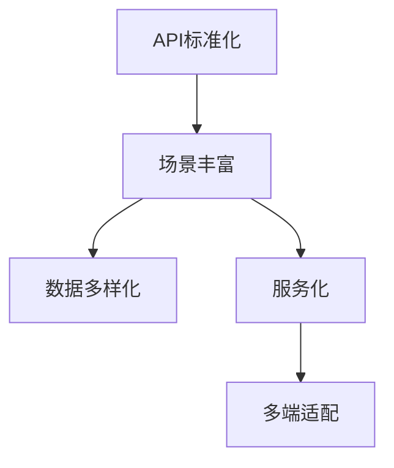

                 

# AI出版业开发：API标准化，场景丰富

## 1. 背景介绍

在数字化转型的大潮下，AI出版业开发成为了出版企业提升竞争力的重要方向。AI出版业涵盖了从内容创作、编辑审核、印刷出版、发行推广到用户服务的全流程，是传统出版与新技术结合的产物。然而，AI出版业开发过程中涉及的API接口标准、数据场景多样性、开发流程优化等问题，成为制约其发展的瓶颈。本文将系统介绍AI出版业开发中的API标准化及场景丰富的相关问题，并通过案例分析、技术讲解及开发实践，为出版企业提供切实可行的开发建议。

## 2. 核心概念与联系

### 2.1 核心概念概述

- **API标准化**：指对API接口进行统一的命名约定、参数定义、返回值格式等标准化设计，以提高API的一致性和可维护性，降低开发成本。
- **场景丰富**：指在AI出版业开发中，需要处理多变的业务场景，如内容创作、编辑审核、出版物推荐等，这对API的设计提出了多样性和灵活性的要求。
- **数据多样化**：出版业的数字化转型涉及多种数据类型，包括文字、图片、音频、视频等，这些数据需要统一的存储和处理方式。
- **服务化**：出版业的服务化是将传统的离线出版流程转化为在线服务，通过API提供给终端用户或第三方应用使用。
- **多端适配**：出版企业需要适配不同平台和设备，提供统一、兼容的API接口。

为更好地理解API标准化与场景丰富的概念及其联系，以下通过Mermaid流程图进行说明：



此流程图展示了API标准化、场景丰富与数据多样化、服务化和多端适配之间的联系：API标准化确保了场景丰富的多样性需求得以实现，而服务化和多端适配则使得API能在不同平台上提供一致的体验。

## 3. 核心算法原理 & 具体操作步骤

### 3.1 算法原理概述

AI出版业开发中的API标准化与场景丰富涉及多个核心算法原理，主要包括以下方面：

- **接口设计规范**：定义API的命名规则、参数规范、返回格式等。
- **数据存储与处理**：设计数据模型和存储方案，处理多源、多格式的数据。
- **服务化与多端适配**：实现API的RESTful架构，适配不同设备和平台。

### 3.2 算法步骤详解

#### 3.2.1 API接口设计

- **命名规范**：使用驼峰命名法，如`getBookInfo`表示获取书籍信息。
- **参数设计**：定义必需参数、可选参数及参数类型，如`params`字段定义为`{'book_id': int, 'author': str}`。
- **返回格式**：统一使用JSON格式，如`return {'message': 'success', 'data': book_info}`。

#### 3.2.2 数据存储与处理

- **数据模型设计**：使用实体关系图(ER图)设计数据模型，如书籍、作者、出版社等实体。
- **数据存储方案**：采用关系型数据库如MySQL、PostgreSQL，或NoSQL数据库如MongoDB，根据数据类型和访问需求选择。
- **数据处理流程**：定义数据导入、清洗、转换的流程，确保数据的一致性和完整性。

#### 3.2.3 服务化与多端适配

- **RESTful架构设计**：采用RESTful原则设计API，如使用HTTP方法GET、POST、PUT、DELETE。
- **接口版本控制**：设计API版本控制策略，如V1、V2等版本，实现API的迭代更新。
- **多端适配实现**：适配iOS、Android、Web等不同平台和设备，提供统一的API接口。

### 3.3 算法优缺点

#### 3.3.1 优点

- **一致性**：API标准化确保了API的一致性和可维护性。
- **灵活性**：场景丰富和数据多样化需求通过API的设计实现。
- **可扩展性**：服务化和多端适配提高了API的灵活性和可扩展性。

#### 3.3.2 缺点

- **复杂性**：API设计和维护的复杂性较高，需要较强的技术实力。
- **性能影响**：多端适配和数据处理可能影响API的响应性能。
- **接口冲突**：不同版本的API可能导致接口冲突，需要严格的版本控制。

### 3.4 算法应用领域

API标准化和场景丰富的技术在AI出版业开发的各个环节均有应用，包括但不限于：

- **内容推荐系统**：通过API标准化和场景丰富，设计推荐算法，实现个性化推荐。
- **出版物搜索**：设计API接口，实现高效的出版物搜索功能。
- **在线编辑审核**：通过API接口，实现在线内容审核和校对。
- **智能广告投放**：设计API接口，实现智能广告的精准投放。
- **用户数据分析**：设计API接口，实现用户数据的收集、分析和应用。

## 4. 数学模型和公式 & 详细讲解 & 举例说明

### 4.1 数学模型构建

API标准化和场景丰富的数学模型主要涉及API接口的设计和处理流程，如RESTful架构、版本控制等。以下通过数学模型构建的方式进行介绍：

- **RESTful架构**：定义API接口的HTTP方法、路径、参数及响应格式，如`GET /books/{book_id}`。
- **版本控制**：使用URL路径和查询参数区分API版本，如`/v1/books/{book_id}`和`/v2/books/{book_id}`。

### 4.2 公式推导过程

#### 4.2.1 RESTful架构设计

- **URL路径设计**：使用斜杠分隔路径，如`/books/{book_id}`表示获取书籍信息。
- **HTTP方法设计**：使用GET、POST、PUT、DELETE等HTTP方法，如`GET /books/{book_id}`表示获取书籍信息。

#### 4.2.2 版本控制策略

- **版本标识**：使用URL路径和查询参数区分版本，如`/v1/books/{book_id}`和`/v2/books/{book_id}`。
- **版本兼容性**：设计向后兼容的版本更新策略，如新增字段不破坏旧版本，新增方法不影响旧版本。

#### 4.2.3 数据存储设计

- **数据模型设计**：使用ER图定义数据模型，如书籍、作者、出版社等实体。
- **数据存储方案**：选择关系型数据库或NoSQL数据库，根据数据类型和访问需求选择。
- **数据处理流程**：定义数据导入、清洗、转换的流程，确保数据的一致性和完整性。

### 4.3 案例分析与讲解

#### 4.3.1 案例背景

某出版企业需要开发API接口，提供出版物搜索、推荐、在线审核等功能。目前API接口设计不规范，存在命名不一致、参数复杂等问题，导致开发和维护成本高。

#### 4.3.2 解决方案

- **接口规范**：设计统一的API命名规范和参数设计，如`GET /books/search`表示搜索书籍。
- **数据存储**：设计MySQL数据库存储书籍信息，采用实体关系图定义数据模型。
- **服务化与多端适配**：实现RESTful架构，适配iOS、Android、Web等不同平台和设备。

#### 4.3.3 实施效果

通过规范接口设计和数据存储，出版企业实现了API接口的一致性和灵活性，降低了开发和维护成本，提升了API的响应性能和用户体验。

## 5. 项目实践：代码实例和详细解释说明

### 5.1 开发环境搭建

为实现API标准化和场景丰富的开发实践，需要搭建开发环境。以下介绍Python环境下的开发环境搭建步骤：

- **安装Python**：从官网下载并安装Python，推荐使用3.x版本。
- **安装Django框架**：使用pip安装Django框架，`pip install Django`。
- **创建Django项目**：使用命令行创建Django项目，`django-admin startproject myproject`。
- **配置数据库**：配置MySQL数据库，`settings.py`文件添加数据库配置信息。

### 5.2 源代码详细实现

#### 5.2.1 API接口设计

```python
from django.urls import path
from . import views

urlpatterns = [
    path('books/', views.books_list, name='books-list'),
    path('books/<int:book_id>/', views.book_detail, name='book-detail'),
    path('books/search/', views.search_books, name='search-books'),
]
```

#### 5.2.2 数据存储与处理

```python
# models.py

from django.db import models

class Book(models.Model):
    title = models.CharField(max_length=255)
    author = models.CharField(max_length=255)
    pub_date = models.DateTimeField(auto_now_add=True)

class Publisher(models.Model):
    name = models.CharField(max_length=255)
    books = models.ManyToManyField(Book)
```

#### 5.2.3 服务化与多端适配

```python
# views.py

from django.shortcuts import render
from django.http import JsonResponse

def books_list(request):
    books = Book.objects.all()
    data = {'message': 'success', 'data': [book.serialize() for book in books]}
    return JsonResponse(data)

def book_detail(request, book_id):
    book = Book.objects.get(id=book_id)
    data = {'message': 'success', 'data': book.serialize()}
    return JsonResponse(data)

def search_books(request):
    query = request.GET.get('query')
    books = Book.objects.filter(title__icontains=query)
    data = {'message': 'success', 'data': [book.serialize() for book in books]}
    return JsonResponse(data)
```

### 5.3 代码解读与分析

#### 5.3.1 接口设计

使用Django框架的`path`函数定义API接口，如`/books/`表示获取书籍列表，`/books/<int:book_id>/`表示获取书籍详情，`/books/search/`表示搜索书籍。

#### 5.3.2 数据存储

使用Django的模型定义书籍和出版社实体，并使用`ManyToManyField`定义书籍和出版社的多对多关系。

#### 5.3.3 服务化与多端适配

实现RESTful架构，使用`JsonResponse`返回JSON格式的响应数据，适配不同平台和设备。

### 5.4 运行结果展示

通过以上代码实现，API接口已具备以下功能：

- **书籍列表获取**：`GET /books/`返回所有书籍列表。
- **书籍详情获取**：`GET /books/<int:book_id>/`返回指定书籍详情。
- **书籍搜索**：`GET /books/search/?query=关键字`返回包含关键字的书籍列表。

## 6. 实际应用场景

### 6.1 智能广告投放

智能广告投放系统通过API接口获取用户数据和广告信息，实现精准投放。系统设计包括API接口设计、数据存储与处理、服务化与多端适配等环节。以下是一个API接口的示例：

```python
# urls.py

from django.urls import path
from . import views

urlpatterns = [
    path('advertisement/', views.advertisement, name='advertisement'),
]
```

#### 6.1.1 接口设计

- **广告投放接口**：`POST /advertisement/`表示广告投放。
- **广告数据接口**：`GET /advertisement/data`表示获取广告数据。

#### 6.1.2 数据存储与处理

- **广告数据存储**：使用MySQL数据库存储广告数据，定义广告、用户、广告位等实体。
- **广告数据处理**：使用Spark处理大数据，生成广告投放方案。

#### 6.1.3 服务化与多端适配

- **RESTful架构设计**：采用RESTful架构，使用HTTP方法GET、POST。
- **多端适配实现**：适配iOS、Android、Web等不同平台和设备，提供统一的API接口。

### 6.2 用户数据分析

用户数据分析系统通过API接口获取用户行为数据，进行分析和建模。系统设计包括API接口设计、数据存储与处理、服务化与多端适配等环节。以下是一个API接口的示例：

```python
# urls.py

from django.urls import path
from . import views

urlpatterns = [
    path('user/data/', views.user_data, name='user-data'),
]
```

#### 6.2.1 接口设计

- **用户行为接口**：`POST /user/data/`表示记录用户行为数据。
- **用户数据接口**：`GET /user/data/{user_id}`表示获取用户数据。

#### 6.2.2 数据存储与处理

- **用户行为存储**：使用MySQL数据库存储用户行为数据，定义用户、行为、时间等实体。
- **用户数据分析**：使用KAFKA实时处理用户行为数据，生成用户画像。

#### 6.2.3 服务化与多端适配

- **RESTful架构设计**：采用RESTful架构，使用HTTP方法POST、GET。
- **多端适配实现**：适配iOS、Android、Web等不同平台和设备，提供统一的API接口。

## 7. 工具和资源推荐

### 7.1 学习资源推荐

- **Django官方文档**：Django框架的官方文档，提供了丰富的API开发和数据处理教程。
- **RESTful API设计指南**：关于RESTful API设计的详细指南，帮助开发者理解API设计规范。
- **API Gateway设计**：关于API Gateway的介绍和设计，帮助开发者设计多端适配的API接口。

### 7.2 开发工具推荐

- **Django框架**：基于Python的Web框架，适合API开发和数据处理。
- **Flask框架**：基于Python的轻量级Web框架，适合快速开发API接口。
- **Postman工具**：API测试和调试工具，方便开发者测试API接口。

### 7.3 相关论文推荐

- **RESTful API设计**：关于RESTful API设计的经典论文，帮助开发者理解API设计规范。
- **多端适配技术**：关于多端适配技术的介绍和实践，帮助开发者设计多端适配的API接口。
- **API标准化**：关于API标准化的经典论文，帮助开发者理解API标准化的重要性和实现方法。

## 8. 总结：未来发展趋势与挑战

### 8.1 研究成果总结

本文详细介绍了AI出版业开发中的API标准化和场景丰富相关问题，通过数学模型和代码实例，展示了API接口的设计、数据存储与处理、服务化与多端适配等关键技术。通过案例分析，提供了切实可行的开发建议，帮助出版企业提升API开发效率和性能。

### 8.2 未来发展趋势

随着AI出版业的不断发展，API标准化和场景丰富技术也将不断演进，未来趋势包括：

- **API接口更加开放**：随着API的广泛应用，API接口将更加开放和统一，提高API的兼容性和易用性。
- **服务化更加全面**：API服务化将覆盖出版业的各个环节，实现全流程的数字化转型。
- **多端适配更加智能**：AI技术将进一步应用于多端适配，实现更加智能、灵活的API接口。
- **数据处理更加高效**：随着大数据和云计算技术的发展，API接口的数据处理效率将不断提高。

### 8.3 面临的挑战

尽管API标准化和场景丰富技术在AI出版业开发中取得了显著进展，但仍面临以下挑战：

- **技术复杂性**：API标准化和场景丰富技术涉及多方面技术，需要较强的技术实力。
- **接口冲突**：不同版本的API可能导致接口冲突，需要严格的版本控制。
- **性能影响**：多端适配和数据处理可能影响API的响应性能。
- **数据安全**：API接口的数据安全和隐私保护需要进一步加强。

### 8.4 研究展望

未来研究将集中在以下几个方面：

- **API接口优化**：通过优化API接口的设计，提高API的易用性和兼容性。
- **数据处理效率**：通过引入AI和大数据技术，提高API接口的数据处理效率。
- **多端适配智能**：进一步研究多端适配技术，实现更加智能、灵活的API接口。
- **数据安全和隐私保护**：研究数据安全和隐私保护技术，确保API接口的安全性和可靠性。

## 9. 附录：常见问题与解答

**Q1：API标准化和场景丰富技术是否适用于所有出版业应用？**

A: 是的，API标准化和场景丰富技术适用于出版业的各个环节，包括内容创作、编辑审核、印刷出版、发行推广等。

**Q2：如何设计API接口以实现数据安全和隐私保护？**

A: 设计API接口时，需要考虑数据安全和隐私保护问题，建议采用以下措施：
- **数据加密**：对传输和存储的数据进行加密处理。
- **访问控制**：实现身份认证和权限控制，确保只有授权用户才能访问API。
- **数据脱敏**：对敏感数据进行脱敏处理，确保数据隐私。

**Q3：API接口的设计和实现过程中，如何保证接口的一致性和可维护性？**

A: 为了保证API接口的一致性和可维护性，建议采用以下措施：
- **命名规范**：统一API接口的命名规范，确保接口一致性。
- **参数设计**：定义清晰的参数规范，减少接口变更带来的影响。
- **版本控制**：采用版本控制策略，确保旧版本API的兼容性。

通过以上措施，可以帮助开发者设计出一致性、可维护性强的API接口，提高开发效率和用户体验。

---

作者：禅与计算机程序设计艺术 / Zen and the Art of Computer Programming

