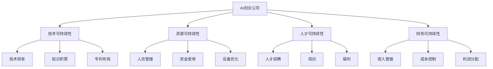

                 

# AI创业公司如何实现可持续发展？

## 1. 背景介绍

### 1.1 问题由来

在当今这个快速发展的时代，AI创业公司如雨后春笋般涌现。这些公司通过先进的技术和创新的商业模式，迅速占领了市场，为各行各业带来了巨大的变革和机会。然而，随着技术的不断进步和市场的变化，AI创业公司也面临着一系列挑战，包括技术瓶颈、市场竞争、人才流失、融资压力等。如何实现可持续性发展，成为每个AI创业公司必须面对的问题。

### 1.2 问题核心关键点

实现可持续发展的关键在于找到一条既能实现商业价值，又能保持技术创新和市场竞争力的发展路径。具体而言，需要解决以下几个核心问题：

- 如何保持技术的先进性和创新性，以应对快速变化的市场需求？
- 如何高效利用资源，降低成本，提升运营效率？
- 如何吸引和留住顶尖人才，保持团队稳定和活力？
- 如何平衡财务可持续性与快速扩张，实现健康增长？

### 1.3 问题研究意义

实现可持续发展对AI创业公司具有重要意义：

1. **提升市场竞争力**：保持技术先进性，才能在激烈的市场竞争中保持领先地位。
2. **降低运营风险**：提高资源利用效率，降低成本，提升公司的抗风险能力。
3. **吸引并留住人才**：为员工提供良好的工作环境和职业发展机会，吸引并留住优秀人才。
4. **实现长期价值**：平衡财务与创新，确保公司能够实现长期稳定的发展，而不是追求短期利益。

## 2. 核心概念与联系

### 2.1 核心概念概述

为更好地理解AI创业公司如何实现可持续发展，本节将介绍几个密切相关的核心概念：

- **AI创业公司**：利用AI技术开发产品或服务，提供智能化解决方案的公司。通常具有高度的创新性和技术密集度。
- **技术可持续性**：指公司持续创新，保持技术领先地位的能力，包括技术研发、知识积累、专利布局等。
- **资源可持续性**：指公司高效利用资源，降低成本，提升运营效率的能力，包括人员管理、资金使用、设备优化等。
- **人才可持续性**：指公司吸引、培养和保留顶尖人才，保持团队稳定和活力的能力，包括人才招聘、培训、福利等。
- **财务可持续性**：指公司在实现短期盈利的同时，保持长期健康发展的能力，包括收入、成本、利润等财务指标的平衡。

这些核心概念之间的逻辑关系可以通过以下Mermaid流程图来展示：



这个流程图展示了AI创业公司的各个关键领域及其之间的关系：

1. AI创业公司通过技术研发、知识积累、专利布局等，保持技术领先地位。
2. 通过高效的人员管理、资金使用、设备优化等，提高运营效率。
3. 通过人才招聘、培训、福利等，吸引并留住顶尖人才。
4. 通过收入管理、成本控制、利润分配等，实现财务可持续性。

## 3. 核心算法原理 & 具体操作步骤

### 3.1 算法原理概述

实现AI创业公司的可持续发展，涉及多个维度的优化和策略。以下是一些核心算法和操作步骤：

- **技术研发**：保持持续的技术创新和研发投入，保持技术领先。
- **资源优化**：通过高效的资源管理，降低成本，提升运营效率。
- **人才管理**：通过吸引、培养和保留顶尖人才，保持团队活力和稳定。
- **财务健康**：通过合理的财务管理和资本运作，实现长期价值。

### 3.2 算法步骤详解

#### 3.2.1 技术研发

1. **建立研发团队**：组建专业的技术团队，包括算法工程师、数据科学家、产品经理等。
2. **设定研发目标**：明确公司需要解决的核心技术问题，以及长远技术发展方向。
3. **选择技术路线**：根据市场需求和公司实力，选择适合的技术路线和工具。
4. **持续投入研发**：定期投入研发预算，保持技术团队的创新和研发活动。

#### 3.2.2 资源优化

1. **人员管理**：优化人员招聘、培训、绩效管理等，提升团队效率和士气。
2. **资金使用**：合理规划资金使用，控制成本，提升财务透明度。
3. **设备优化**：优化设备采购和维护，降低设备使用成本。

#### 3.2.3 人才管理

1. **人才招聘**：通过高效的人才招聘渠道，吸引顶尖人才。
2. **培训与发展**：提供全面的培训和发展机会，提升员工技能和职业发展。
3. **福利保障**：提供具有竞争力的薪酬福利，增强员工的归属感和忠诚度。

#### 3.2.4 财务健康

1. **收入管理**：优化收入结构，提升收入水平。
2. **成本控制**：严格控制成本，提升利润率。
3. **利润分配**：合理分配利润，保障公司健康发展。

### 3.3 算法优缺点

#### 3.3.1 技术研发的优点

1. **提升市场竞争力**：持续的技术创新可以提升公司的市场竞争力，保持领先地位。
2. **增加产品附加值**：通过技术创新，可以推出更具竞争力的产品和服务。

#### 3.3.2 技术研发的缺点

1. **高投入风险**：技术研发投入高，存在技术失败或市场接受度低的风险。
2. **竞争压力**：持续的技术创新需要不断投入，竞争压力较大。

#### 3.3.3 资源优化的优点

1. **降低成本**：通过优化资源管理，可以有效降低成本，提高利润率。
2. **提升运营效率**：优化资源使用，可以提高运营效率，提升公司的市场响应速度。

#### 3.3.4 资源优化的缺点

1. **短期效果有限**：优化资源管理的效果可能较慢，短期内可能难以见效。
2. **资源限制**：资源优化受到公司规模和实力的限制，难以在短时间内实现大幅度提升。

#### 3.3.5 人才管理的优点

1. **提升团队凝聚力**：通过吸引和留住顶尖人才，可以提升团队凝聚力和战斗力。
2. **增强公司创新能力**：顶尖人才的加入可以带来新的视角和创意，增强公司的创新能力。

#### 3.3.6 人才管理的缺点

1. **高成本**：顶尖人才的薪酬和福利往往较高，可能增加公司的成本压力。
2. **人才流失风险**：人才市场竞争激烈，顶尖人才流失风险较高。

#### 3.3.7 财务健康的优点

1. **保障公司长期发展**：合理的财务管理和资本运作可以保障公司的长期健康发展。
2. **提升股东价值**：健康的发展可以提升股东价值，增强公司的资本吸引力。

#### 3.3.8 财务健康的缺点

1. **短期收益压力**：财务健康需要平衡短期和长期利益，可能面临短期收益压力。
2. **风险控制难度大**：财务健康涉及多方面的管理和控制，风险控制难度较大。

### 3.4 算法应用领域

AI创业公司的可持续发展技术在不同领域的应用如下：

- **金融领域**：通过技术创新和资源优化，提升金融产品的创新力和市场竞争力，同时保持财务健康，降低风险。
- **医疗健康**：利用AI技术进行疾病预测、个性化治疗等，提升医疗服务的质量和效率，同时控制成本，实现健康发展。
- **零售电商**：通过技术创新和人才管理，提升客户体验和服务质量，同时优化资源管理，实现高效运营。
- **智能制造**：利用AI技术进行智能生产、质量控制等，提升生产效率和产品质量，同时控制成本，实现可持续发展。
- **智慧城市**：通过技术创新和资源优化，提升城市管理和服务水平，同时吸引并留住顶尖人才，实现健康发展。

## 4. 数学模型和公式 & 详细讲解 & 举例说明

### 4.1 数学模型构建

为了更好地理解AI创业公司的可持续发展，我们可以构建一个数学模型。假设公司的总收入为 \( R \)，总成本为 \( C \)，利润为 \( P \)，技术投入为 \( I \)，资源管理投入为 \( M \)，人才管理投入为 \( H \)，财务投入为 \( F \)。则公司可持续发展数学模型为：

$$
P = R - C = R - (I + M + H + F)
$$

其中，总收入 \( R \) 由产品销售、服务费用等组成；总成本 \( C \) 由技术研发投入、资源优化投入、人才管理投入和财务投入组成。

### 4.2 公式推导过程

我们将通过一个简化的例子来推导上述公式。假设公司有 \( n \) 个产品，每个产品的销售价格为 \( p \)，销量为 \( q \)，则总收入 \( R \) 为：

$$
R = n \times p \times q
$$

假设每个产品的成本为 \( c \)，则总成本 \( C \) 为：

$$
C = n \times c \times q
$$

技术投入 \( I \)、资源管理投入 \( M \)、人才管理投入 \( H \)、财务投入 \( F \) 分别为：

$$
I = \frac{R}{n} \times i, M = \frac{R}{n} \times m, H = \frac{R}{n} \times h, F = \frac{R}{n} \times f
$$

其中 \( i, m, h, f \) 分别为技术研发投入、资源优化投入、人才管理投入和财务投入的比例。

利润 \( P \) 为：

$$
P = R - C = R - (I + M + H + F)
$$

### 4.3 案例分析与讲解

假设公司有 100 个产品，每个产品的销售价格为 1000 元，销量为 1000 个，则总收入 \( R \) 为 1000 万元。假设每个产品的成本为 500 元，则总成本 \( C \) 为 500 万元。假设技术研发投入 \( I \)、资源管理投入 \( M \)、人才管理投入 \( H \)、财务投入 \( F \) 分别为总收益的 1%、2%、3%、4%，则：

$$
I = \frac{10000000}{100} \times 0.01 = 10000
$$
$$
M = \frac{10000000}{100} \times 0.02 = 20000
$$
$$
H = \frac{10000000}{100} \times 0.03 = 30000
$$
$$
F = \frac{10000000}{100} \times 0.04 = 40000
$$

则利润 \( P \) 为：

$$
P = 10000000 - (10000 + 20000 + 30000 + 40000) = 9430000
$$

通过上述计算，我们可以看到，合理分配技术投入、资源优化投入、人才管理投入和财务投入，可以有效提升公司利润，实现可持续发展。

## 5. 项目实践：代码实例和详细解释说明

### 5.1 开发环境搭建

在进行项目实践前，我们需要准备好开发环境。以下是使用Python进行开发的环境配置流程：

1. 安装Anaconda：从官网下载并安装Anaconda，用于创建独立的Python环境。

2. 创建并激活虚拟环境：
```bash
conda create -n dev-env python=3.9 
conda activate dev-env
```

3. 安装必要的Python包：
```bash
pip install numpy pandas scikit-learn matplotlib
```

4. 安装数据处理工具：
```bash
pip install pandas numpy
```

5. 安装机器学习框架：
```bash
pip install scikit-learn
```

6. 安装可视化工具：
```bash
pip install matplotlib seaborn
```

7. 安装Git版本控制工具：
```bash
git init
git clone https://github.com/example/repo.git
cd repo
```

完成上述步骤后，即可在`dev-env`环境中开始项目实践。

### 5.2 源代码详细实现

这里我们以一个简单的AI创业公司可持续发展案例为例，给出代码实现。

```python
import pandas as pd
import numpy as np
import matplotlib.pyplot as plt

# 假设公司有 100 个产品，每个产品的销售价格为 1000 元，销量为 1000 个
products = 100
price_per_product = 1000
sales_per_product = 1000

# 假设每个产品的成本为 500 元
cost_per_product = 500

# 假设技术研发投入、资源优化投入、人才管理投入、财务投入分别为总收益的 1%、2%、3%、4%
I_ratio = 0.01
M_ratio = 0.02
H_ratio = 0.03
F_ratio = 0.04

# 计算总收入、总成本、技术投入、资源优化投入、人才管理投入、财务投入
total_revenue = products * price_per_product * sales_per_product
total_cost = products * cost_per_product * sales_per_product
I = total_revenue * I_ratio
M = total_revenue * M_ratio
H = total_revenue * H_ratio
F = total_revenue * F_ratio

# 计算利润
profit = total_revenue - (I + M + H + F)

print(f"总收入：{total_revenue}")
print(f"总成本：{total_cost}")
print(f"技术投入：{I}")
print(f"资源优化投入：{M}")
print(f"人才管理投入：{H}")
print(f"财务投入：{F}")
print(f"利润：{profit}")
```

### 5.3 代码解读与分析

下面我们详细解读代码实现细节：

1. **数据定义**：
   - `products`：产品数量
   - `price_per_product`：每个产品的销售价格
   - `sales_per_product`：每个产品的销量
   - `cost_per_product`：每个产品的成本
   - `I_ratio`：技术研发投入的比例
   - `M_ratio`：资源优化投入的比例
   - `H_ratio`：人才管理投入的比例
   - `F_ratio`：财务投入的比例

2. **收入计算**：
   - `total_revenue`：总收入，即产品数量乘以销售价格乘以销量。

3. **成本计算**：
   - `total_cost`：总成本，即产品数量乘以成本乘以销量。

4. **投入计算**：
   - `I`：技术投入，即总收入乘以技术研发投入的比例。
   - `M`：资源优化投入，即总收入乘以资源优化投入的比例。
   - `H`：人才管理投入，即总收入乘以人才管理投入的比例。
   - `F`：财务投入，即总收入乘以财务投入的比例。

5. **利润计算**：
   - `profit`：利润，即总收入减去总成本、技术投入、资源优化投入、人才管理投入和财务投入。

6. **结果输出**：
   - 使用`print`函数输出总收入、总成本、技术投入、资源优化投入、人才管理投入、财务投入和利润。

通过上述代码，我们可以看到，合理分配各类投入，可以有效提升公司的利润，实现可持续发展。

## 6. 实际应用场景

### 6.1 智能制造

在智能制造领域，AI创业公司可以通过技术创新和资源优化，提升生产效率和产品质量。例如，通过引入自动化生产线和智能监控系统，提高生产效率，同时优化能源和材料使用，降低成本。此外，利用AI进行设备维护和故障预测，可以延长设备使用寿命，减少停机时间，提升生产稳定性。

### 6.2 医疗健康

在医疗健康领域，AI创业公司可以通过技术创新和人才管理，提升医疗服务的质量和效率。例如，利用AI进行疾病预测、个性化治疗和精准医疗，提高诊断准确率和治疗效果。同时，通过吸引顶尖医疗人才和医疗数据，提升公司的医疗技术和创新能力，为患者提供更好的医疗服务。

### 6.3 智慧城市

在智慧城市领域，AI创业公司可以通过技术创新和资源优化，提升城市管理和服务水平。例如，利用AI进行交通流量预测和优化，减少拥堵和污染。同时，通过优化城市公共服务设施的使用，提升城市居民的生活质量。此外，利用AI进行公共安全监控，提升城市治安水平。

### 6.4 未来应用展望

随着AI技术的发展和应用场景的扩展，AI创业公司将迎来更多的机会和挑战。未来，AI创业公司可以通过以下方式实现可持续发展：

1. **技术创新**：持续进行技术研发和创新，保持技术领先地位，提升产品附加值。
2. **资源优化**：通过高效的资源管理，降低成本，提升运营效率。
3. **人才管理**：通过吸引、培养和保留顶尖人才，保持团队活力和稳定。
4. **财务健康**：通过合理的财务管理和资本运作，实现长期价值。

## 7. 工具和资源推荐

### 7.1 学习资源推荐

为了帮助AI创业公司实现可持续发展，以下是一些优质的学习资源：

1. **Coursera《人工智能入门》课程**：由斯坦福大学提供，介绍AI的基本概念和应用场景，适合初学者入门。
2. **Udacity《AI创业》课程**：由Google和Udacity合作推出，涵盖AI创业的各个方面，包括技术、市场、融资等。
3. **《AI创业公司：从0到1》书籍**：一本系统介绍AI创业公司从起步到成长过程的书籍，涵盖技术、市场、团队管理等多个方面。
4. **GitHub上的AI创业公司案例**：通过阅读和分析GitHub上的AI创业公司案例，了解成功企业的经验和方法。

### 7.2 开发工具推荐

以下是一些常用的AI创业公司开发工具：

1. **Jupyter Notebook**：一个开源的Web应用程序，支持Python、R、Scala等多种编程语言，适合数据科学和机器学习开发。
2. **Google Colab**：一个免费的云端Jupyter Notebook环境，提供GPU、TPU等高性能计算资源，适合深度学习和AI开发。
3. **PyTorch**：一个开源的深度学习框架，支持动态计算图和静态计算图，适合AI模型开发。
4. **TensorFlow**：由Google开发的开源深度学习框架，支持分布式计算和GPU加速，适合大规模模型开发。
5. **Scikit-learn**：一个开源的机器学习库，提供各种常用的机器学习算法和工具，适合数据预处理和特征工程。

### 7.3 相关论文推荐

以下是一些关于AI创业公司可持续发展的相关论文：

1. **《AI创业公司：从0到1》论文**：总结了AI创业公司从起步到成长过程中的关键经验和教训，适合创业者和投资者阅读。
2. **《AI创业公司的技术可持续性》论文**：讨论了AI创业公司在技术创新和持续发展中的关键问题和解决方案。
3. **《AI创业公司的财务健康》论文**：分析了AI创业公司在财务管理和资本运作中的常见问题和解决方案。

## 8. 总结：未来发展趋势与挑战

### 8.1 研究成果总结

本文对AI创业公司如何实现可持续发展进行了详细探讨，提出了一套综合的技术和管理方案。具体内容包括：

1. **技术研发**：通过持续的技术创新，保持技术领先地位。
2. **资源优化**：通过高效的资源管理，降低成本，提升运营效率。
3. **人才管理**：通过吸引、培养和保留顶尖人才，保持团队活力和稳定。
4. **财务健康**：通过合理的财务管理和资本运作，实现长期价值。

### 8.2 未来发展趋势

未来，AI创业公司可持续发展将呈现以下几个趋势：

1. **技术持续创新**：随着技术的不断进步，AI创业公司需要持续进行技术研发和创新，保持技术领先地位。
2. **资源高效管理**：高效利用资源，降低成本，提升运营效率，将是未来AI创业公司的重要发展方向。
3. **人才吸引和保留**：通过吸引和留住顶尖人才，保持团队活力和稳定，将是AI创业公司竞争力的重要来源。
4. **财务健康发展**：合理的财务管理和资本运作，确保公司长期健康发展，将是AI创业公司实现可持续发展的关键。

### 8.3 面临的挑战

尽管AI创业公司可持续发展面临诸多挑战，但通过积极应对和创新，仍有望实现可持续发展的目标。以下是需要重点关注的问题：

1. **技术创新压力**：持续的技术研发和创新需要大量资金和人才投入，可能面临资源和市场的双重压力。
2. **市场竞争激烈**：AI创业公司面临着激烈的市场竞争，需要不断创新和优化，以保持市场竞争力。
3. **人才流失风险**：顶尖人才的市场需求旺盛，吸引和留住顶尖人才是一个长期挑战。
4. **财务健康管理**：财务健康需要平衡短期和长期利益，可能面临财务压力和风险。

### 8.4 研究展望

未来，AI创业公司在可持续发展方面需要重点关注以下几个方面：

1. **技术研发投入**：持续进行技术研发和创新，保持技术领先地位，提升产品附加值。
2. **资源管理优化**：通过高效的资源管理，降低成本，提升运营效率。
3. **人才吸引和保留**：通过吸引、培养和保留顶尖人才，保持团队活力和稳定。
4. **财务健康管理**：通过合理的财务管理和资本运作，实现长期价值。

## 9. 附录：常见问题与解答

**Q1：如何平衡技术投入和市场规模？**

A: 技术投入和市场规模之间存在一定的平衡关系。在初期阶段，技术研发投入可以占较大比例，以提升技术实力和产品竞争力。随着公司逐渐成长，市场规模和收入逐渐增加，可以逐渐减少技术研发投入，优化资源管理，提升运营效率，确保公司健康发展。

**Q2：如何吸引和留住顶尖人才？**

A: 吸引和留住顶尖人才需要综合考虑多个因素，包括薪酬福利、职业发展机会、工作环境等。可以通过高薪吸引顶尖人才，提供培训和发展机会，创造良好的工作氛围，提升员工的归属感和忠诚度。

**Q3：如何处理资源管理中的风险和成本？**

A: 资源管理中存在一定的风险和成本，需要合理规划和控制。可以通过优化流程、采用自动化工具、降低设备和能源消耗等手段，降低资源管理成本，提升运营效率。同时，制定应急预案，降低突发事件带来的影响。

**Q4：如何确保财务健康？**

A: 财务健康需要综合考虑收入、成本、利润等指标。可以通过合理的定价策略、成本控制、资金管理等手段，提升公司的财务状况。同时，制定详细的财务预算和风险管理策略，确保公司长期健康发展。

通过本文的系统梳理，可以看到，AI创业公司实现可持续发展需要全面考虑技术、资源、人才和财务等多个维度，积极应对和创新，方能在激烈的市场竞争中保持领先地位，实现长期健康发展。

