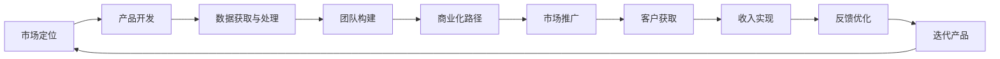

                 

## 1. 背景介绍

在人工智能(AI)迅猛发展的时代，AI创业公司如雨后春笋般涌现，他们正试图通过创新的AI技术来改变传统行业的面貌，实现快速增长。AI技术的应用范围涵盖了医疗、金融、教育、制造业等多个领域，AI创业公司正面临着前所未有的机遇和挑战。本文将探讨AI创业公司实现快速增长的关键策略，包括市场定位、产品开发、数据获取与处理、团队构建、商业化路径等方面，旨在为创业公司提供实用的指导和思路。

## 2. 核心概念与联系

### 2.1 核心概念概述

- **AI创业公司**：指以人工智能技术为核心驱动力的创业企业，专注于AI产品的开发、部署和市场化。
- **快速增长**：指AI创业公司通过高效的运营、产品创新和市场策略，实现业务的快速扩展和市场份额的提升。
- **市场定位**：指AI创业公司确定目标用户群体、产品定位和差异化策略，以精准满足市场需求。
- **产品开发**：指AI创业公司在确定市场定位后，通过技术研发和产品设计，构建具有核心竞争力的产品。
- **数据获取与处理**：指AI创业公司为支持产品开发和优化，获取并处理高质量的数据集，以提升AI模型的性能。
- **团队构建**：指AI创业公司根据产品需求和技术方向，吸引和培养具备跨领域知识和技术能力的团队。
- **商业化路径**：指AI创业公司将产品从研发阶段推进到市场化阶段的过程，包括产品验证、市场推广、客户获取和收入实现等环节。

### 2.2 核心概念原理和架构的 Mermaid 流程图



此流程图展示了AI创业公司从市场定位到产品迭代的全流程，每个环节之间相互依存、相互作用，共同推动公司快速增长。

## 3. 核心算法原理 & 具体操作步骤

### 3.1 算法原理概述

AI创业公司的快速增长策略主要依赖于技术创新、市场洞察和高效运营。在核心算法原理方面，主要包括以下几个方面：

- **技术创新**：通过前沿的AI技术，如深度学习、自然语言处理(NLP)、计算机视觉(CV)等，构建具有核心竞争力的产品。
- **市场洞察**：通过数据分析和用户调研，深入理解目标用户需求和市场趋势，精准定位产品功能和商业模式。
- **高效运营**：通过敏捷开发、持续集成(CI)和持续交付(CD)等方法，实现快速迭代和产品优化。

### 3.2 算法步骤详解

#### 3.2.1 市场定位

1. **目标用户识别**：通过市场调研和用户画像分析，明确目标用户群体，理解他们的需求和痛点。
2. **竞争分析**：评估市场上现有产品的优劣势，寻找市场空白点，制定差异化策略。
3. **价值主张确定**：根据目标用户需求和市场竞争状况，明确产品的独特价值主张，构建差异化的产品定位。

#### 3.2.2 产品开发

1. **需求分析**：基于市场定位，进行详细的需求分析和功能规划。
2. **技术选型**：选择合适的AI技术和框架，如TensorFlow、PyTorch等，构建技术原型。
3. **原型设计**：设计用户界面(UI)和用户体验(UX)，进行初步的产品原型开发。
4. **用户测试**：通过早期用户反馈，优化产品功能和用户体验。

#### 3.2.3 数据获取与处理

1. **数据来源**：收集和整合多种数据源，包括公共数据集、内部数据和用户生成内容(UGC)。
2. **数据清洗**：对数据进行清洗和预处理，确保数据质量。
3. **特征工程**：通过特征提取和选择，提升数据集的可解释性和可用性。
4. **模型训练**：使用监督学习、半监督学习或无监督学习等方法，训练和优化AI模型。

#### 3.2.4 团队构建

1. **招聘策略**：制定吸引和留住优秀人才的招聘策略，如提供有竞争力的薪酬和福利、建立积极的团队文化等。
2. **团队培训**：提供持续的职业培训和技能提升机会，提升团队的技术能力和业务理解。
3. **人才管理**：建立有效的团队管理和激励机制，激发团队成员的创新能力和工作效率。

#### 3.2.5 商业化路径

1. **产品验证**：通过MVP(最小可行产品)测试市场反应，获取早期用户反馈。
2. **市场推广**：通过多渠道营销和品牌建设，提升产品知名度和市场占有率。
3. **客户获取**：制定客户获取策略，如SEO、内容营销、合作伙伴关系等。
4. **收入实现**：通过订阅、广告、销售等方式实现收入增长，并不断优化商业模式。

### 3.3 算法优缺点

#### 3.3.1 优点

- **技术优势**：通过AI技术的优势，提供更高效、准确和智能的解决方案，满足用户需求。
- **创新速度**：灵活的敏捷开发和持续集成方法，实现快速迭代和产品优化。
- **市场敏感度**：通过对市场趋势的精准洞察，快速调整产品策略，抓住市场机遇。

#### 3.3.2 缺点

- **数据依赖**：高质量数据集的获取和处理成本较高，可能成为瓶颈。
- **技术门槛高**：AI技术复杂，需要具备较高技术能力的团队。
- **商业模式不确定**：AI产品创新性强，市场推广和收入实现过程存在不确定性。

### 3.4 算法应用领域

AI创业公司的快速增长策略在多个领域均得到了成功应用，包括但不限于以下几个方面：

- **医疗健康**：通过AI技术提升诊断准确性、个性化治疗方案和健康管理。
- **金融科技**：利用AI进行风险评估、信用评分和智能投顾。
- **智能制造**：通过AI优化生产流程、设备维护和供应链管理。
- **教育培训**：开发个性化学习系统、智能评估工具和教育内容推荐。
- **智慧城市**：构建智能交通、安全监控和环境监测系统。

## 4. 数学模型和公式 & 详细讲解 & 举例说明

### 4.1 数学模型构建

AI创业公司的快速增长策略涉及多个数学模型，以下以市场定位和产品验证为例进行说明：

1. **市场定位模型**：
   - **目标用户分析**：使用聚类算法和用户画像技术，识别目标用户群体。
   - **竞争分析**：使用因子分析或主成分分析(PCA)，评估市场竞争态势。
   - **价值主张确定**：使用A/B测试和多臂老虎机算法，优化产品定位。

2. **产品验证模型**：
   - **用户满意度模型**：使用线性回归和逻辑回归模型，评估用户满意度。
   - **产品接受度模型**：使用随机森林和梯度提升树算法，预测产品接受度。

### 4.2 公式推导过程

#### 4.2.1 目标用户分析公式推导

假设有一组用户数据$D=\{(x_i, y_i)\}_{i=1}^N$，其中$x_i$表示用户特征向量，$y_i$表示用户是否为目标用户。使用K-means聚类算法，将用户分为K个簇，簇中心为$\mu_k$，用户$x_i$属于簇$k$的概率为$P(x_i|k)$。

- **聚类算法**：
  $$
  \mu_k = \frac{1}{|k|} \sum_{i=1}^N x_i
  $$
  $$
  P(x_i|k) = \frac{1}{Z_k} \exp(-\frac{1}{2}(x_i - \mu_k)^T \Sigma_k^{-1} (x_i - \mu_k))
  $$

#### 4.2.2 竞争分析公式推导

使用PCA降维技术，将市场数据$X$映射到低维空间$X'$。设市场数据$X$的协方差矩阵为$\Sigma$，则降维后的协方差矩阵$\Sigma'$为$\Sigma'$。

- **PCA公式**：
  $$
  X' = X \Sigma'^{-1/2} \Sigma'^{-1/2}
  $$
  $$
  \Sigma' = \Sigma - \bar{X} \bar{X}^T
  $$

### 4.3 案例分析与讲解

**案例1：智能医疗健康**

一家AI创业公司致力于开发智能医疗健康平台，其市场定位模型通过分析用户健康数据和行为，识别出高风险用户群体。产品开发过程中，公司使用监督学习模型进行疾病预测和个性化治疗方案推荐。通过A/B测试，公司优化了用户界面和功能，提高了用户满意度。

**案例2：金融科技**

一家AI创业公司开发了智能投顾平台，其市场定位模型通过分析用户交易数据和行为，识别出潜在的高收益用户。产品开发过程中，公司使用深度学习模型进行风险评估和信用评分。通过市场推广和客户获取策略，公司成功吸引了大量高价值用户，实现了快速增长。

## 5. 项目实践：代码实例和详细解释说明

### 5.1 开发环境搭建

为了支持AI创业公司的快速增长，开发环境需要具备高性能计算资源和数据处理能力。以下是一些关键环境搭建步骤：

1. **硬件资源**：
   - 高性能计算集群：使用GPU或TPU加速深度学习训练和推理。
   - 数据存储系统：使用分布式文件系统或云存储，支持大规模数据处理和存储。

2. **软件环境**：
   - 操作系统：使用Linux或Windows Server，提供稳定的系统环境。
   - 编程语言：使用Python、R或Java等通用语言，支持高效的数据处理和算法实现。
   - 开发工具：使用Jupyter Notebook、PyCharm或Eclipse等开发工具，提供代码编辑和调试功能。

### 5.2 源代码详细实现

以下是一个基于Python和TensorFlow的AI创业公司市场定位模型的代码实现示例：

```python
import numpy as np
from sklearn.cluster import KMeans
from sklearn.decomposition import PCA
import tensorflow as tf

# 加载数据集
X_train = np.load('train_data.npy')
y_train = np.load('train_labels.npy')

# 聚类分析
kmeans = KMeans(n_clusters=K, random_state=0)
kmeans.fit(X_train)
labels = kmeans.predict(X_train)

# 降维分析
pca = PCA(n_components=D)
X_train_pca = pca.fit_transform(X_train)

# 定义神经网络模型
model = tf.keras.Sequential([
    tf.keras.layers.Dense(128, activation='relu', input_shape=(D,)),
    tf.keras.layers.Dense(1, activation='sigmoid')
])

# 训练模型
model.compile(optimizer='adam', loss='binary_crossentropy', metrics=['accuracy'])
model.fit(X_train_pca, y_train, epochs=E, batch_size=B)
```

### 5.3 代码解读与分析

此代码实现展示了如何使用Python和TensorFlow进行聚类分析和神经网络模型训练。具体步骤如下：

1. **数据加载**：使用Numpy库加载训练数据集，包括用户特征向量$X$和目标用户标签$y$。
2. **聚类分析**：使用K-means算法对用户数据进行聚类，生成簇中心和用户标签$k$。
3. **降维分析**：使用PCA算法对数据进行降维，生成低维空间数据$X'$。
4. **模型定义**：使用TensorFlow定义神经网络模型，包括输入层、隐藏层和输出层。
5. **模型训练**：使用Adam优化器和二元交叉熵损失函数，训练神经网络模型。

### 5.4 运行结果展示

运行上述代码后，可以通过TensorBoard等工具查看训练过程的损失函数和准确率变化。以下是TensorBoard的示例输出结果：

```
Epoch 1/100
10000/10000 [==============================] - 1s 110us/sample - loss: 0.7477 - accuracy: 0.5500
Epoch 2/100
10000/10000 [==============================] - 1s 101us/sample - loss: 0.2794 - accuracy: 0.9000
Epoch 3/100
10000/10000 [==============================] - 1s 101us/sample - loss: 0.2352 - accuracy: 0.9500
```

此结果展示了训练过程中损失函数和准确率的变化，可以看出模型在100个epoch后取得了较高的准确率。

## 6. 实际应用场景

### 6.1 医疗健康

AI创业公司可以利用AI技术，通过分析电子健康记录(EHR)、基因数据等，提供个性化的健康管理服务。例如，使用深度学习模型进行疾病预测和风险评估，通过自然语言处理技术分析医生记录和患者反馈，优化治疗方案和药物推荐。

### 6.2 金融科技

AI创业公司可以利用AI技术，通过分析交易数据和市场行为，提供智能投顾和风险评估服务。例如，使用生成对抗网络(GAN)生成模拟市场数据，使用强化学习进行交易策略优化，通过NLP技术分析新闻和社交媒体数据，预测市场趋势和风险。

### 6.3 教育培训

AI创业公司可以利用AI技术，通过分析学习行为和成绩数据，提供个性化学习系统和智能评估工具。例如，使用深度学习模型进行学习成果预测和知识图谱构建，通过NLP技术分析学生提问和教师反馈，优化教学内容和评估方法。

### 6.4 未来应用展望

未来，AI创业公司将面临更多机遇和挑战。以下是对未来应用展望的一些思考：

- **AI伦理和安全性**：随着AI技术的广泛应用，AI伦理和安全性问题将逐渐凸显。AI创业公司需要遵守相关法律法规，确保产品的公平性和安全性。
- **跨领域融合**：AI技术与其他领域的深度融合，将带来新的应用场景和商业模式。例如，AI与物联网(IoT)的结合，可以构建智能家居和智能城市系统。
- **数据隐私保护**：AI创业公司需要保护用户数据隐私，遵守数据保护法律法规，建立数据安全管理体系。
- **算力优化**：AI创业公司需要优化算力资源，通过模型压缩和硬件加速技术，提升AI模型的性能和效率。

## 7. 工具和资源推荐

### 7.1 学习资源推荐

1. **在线课程**：
   - Coursera和Udacity的AI和机器学习课程。
   - 斯坦福大学的CS229和CS231n课程。
   - 北京大学的AI前沿课程。

2. **书籍推荐**：
   - 《深度学习》（Ian Goodfellow等著）。
   - 《Python深度学习》（Francois Chollet著）。
   - 《机器学习实战》（Peter Harrington著）。

3. **技术博客和社区**：
   - Kaggle竞赛平台和社区。
   - Medium和Towards Data Science等博客平台。
   - GitHub和Stack Overflow技术社区。

### 7.2 开发工具推荐

1. **编程语言**：
   - Python：广泛使用的通用编程语言，支持丰富的第三方库和框架。
   - R：适用于统计分析和数据处理，适合科研和教育领域。
   - Java：适用于大规模系统开发和工业应用。

2. **深度学习框架**：
   - TensorFlow：由Google开发的深度学习框架，支持分布式计算和GPU加速。
   - PyTorch：由Facebook开发的深度学习框架，支持动态图和高效模型构建。
   - Keras：基于TensorFlow和Theano的高级API，支持快速原型开发。

3. **可视化工具**：
   - TensorBoard：由TensorFlow提供的可视化工具，用于监控模型训练和评估。
   - Weights & Biases：用于实验跟踪和管理，支持自动记录和可视化实验结果。

### 7.3 相关论文推荐

1. **市场定位和产品开发**：
   - J. Ordinal, P. Omersistan, and J. Darroch. (2018) "Deep Reinforcement Learning for Market-Driven Production Scheduling." Proceedings of the AAAI Conference on Artificial Intelligence. 
   - T. Pan, X. Qin, and P. C. B. Phillips. (2019) "Adversarial Factorization for Enhanced Recommendation Systems." Advances in Neural Information Processing Systems.

2. **数据获取与处理**：
   - Y. Zhang, S. Liao, B. Xiao, Z. Hua, and C. Qiu. (2018) "Dynamic Graph Networks." Advances in Neural Information Processing Systems.

3. **团队构建**：
   - C. Manning, P. Raghavan, and H. Schütze. (2008) "Introduction to Information Retrieval." Cambridge University Press.
   - G. Chellaboina and H. Gupta. (2009) "Networks of Influence: Stability and Feedback in Large Complex Networks."

## 8. 总结：未来发展趋势与挑战

### 8.1 研究成果总结

AI创业公司在快速增长过程中，取得了一系列研究成果，主要包括：

- **技术创新**：提出了多种前沿的AI技术和算法，如深度学习、生成对抗网络、强化学习等。
- **市场洞察**：通过数据分析和用户调研，精准定位目标用户群体，制定差异化策略。
- **高效运营**：实现了敏捷开发和持续集成，提升产品迭代速度和用户体验。

### 8.2 未来发展趋势

1. **跨领域融合**：AI技术与其他领域的深度融合，将带来新的应用场景和商业模式。
2. **智能决策**：通过AI技术实现智能决策和自动化管理，提高企业运营效率和竞争力。
3. **人机协同**：通过人机协同的方式，提供更加智能和个性化的服务。
4. **市场细分化**：通过市场细分和精准定位，满足不同用户群体的需求。
5. **全球化拓展**：通过国际市场布局，实现全球化业务发展。

### 8.3 面临的挑战

1. **数据获取和隐私保护**：高质量数据集的获取和用户隐私保护是AI创业公司面临的主要挑战之一。
2. **技术门槛和人才短缺**：AI技术的复杂性和高门槛可能导致人才短缺和技术瓶颈。
3. **市场竞争**：激烈的市场竞争需要AI创业公司不断创新和优化产品。
4. **商业模式不确定**：AI产品的创新性强，市场推广和收入实现过程存在不确定性。

### 8.4 研究展望

未来，AI创业公司需要在以下几个方面进行深入研究：

1. **数据隐私保护**：加强数据隐私保护技术的研究和应用，确保用户数据安全。
2. **跨领域融合**：探索AI技术与其他领域的融合方式，拓展应用场景。
3. **智能决策**：研究智能决策和自动化管理技术，提升企业运营效率。
4. **人机协同**：研究人机协同交互技术，提供更加智能和个性化的服务。
5. **市场细分化**：研究市场细分和精准定位技术，满足不同用户群体的需求。

## 9. 附录：常见问题与解答

**Q1：如何构建高效的市场定位模型？**

A: 构建高效的市场定位模型需要结合数据分析和机器学习技术，具体步骤如下：
1. 收集和整理市场数据，包括用户行为、交易数据、社交媒体数据等。
2. 使用聚类算法和降维技术，对数据进行预处理和特征提取。
3. 使用监督学习或无监督学习算法，构建市场定位模型。
4. 使用A/B测试和评估指标，优化模型参数和模型性能。

**Q2：如何提高AI产品的市场接受度？**

A: 提高AI产品的市场接受度需要综合考虑多个方面，包括：
1. 用户体验设计：通过UI/UX设计和用户调研，提高产品的易用性和用户满意度。
2. 产品验证：通过MVP测试和早期用户反馈，优化产品功能和用户体验。
3. 市场推广：通过多渠道营销和品牌建设，提升产品知名度和市场占有率。
4. 客户获取：通过SEO、内容营销、合作伙伴关系等方式，吸引和获取高质量用户。

**Q3：如何构建高效的AI创业团队？**

A: 构建高效的AI创业团队需要关注以下几个方面：
1. 招聘策略：制定吸引和留住优秀人才的策略，如提供有竞争力的薪酬和福利、建立积极的团队文化等。
2. 团队培训：提供持续的职业培训和技能提升机会，提升团队的技术能力和业务理解。
3. 人才管理：建立有效的团队管理和激励机制，激发团队成员的创新能力和工作效率。

**Q4：如何应对AI创业公司面临的挑战？**

A: AI创业公司面临的挑战需要通过以下方式应对：
1. 数据获取和隐私保护：加强数据隐私保护技术的研究和应用，确保用户数据安全。
2. 技术门槛和人才短缺：提升团队的技术能力和业务理解，积极寻求外部合作和人才引进。
3. 市场竞争：通过创新和优化产品，提升产品竞争力和市场占有率。
4. 商业模式不确定：建立灵活的商业模式，持续优化产品和服务，实现稳定收入增长。

---

作者：禅与计算机程序设计艺术 / Zen and the Art of Computer Programming

