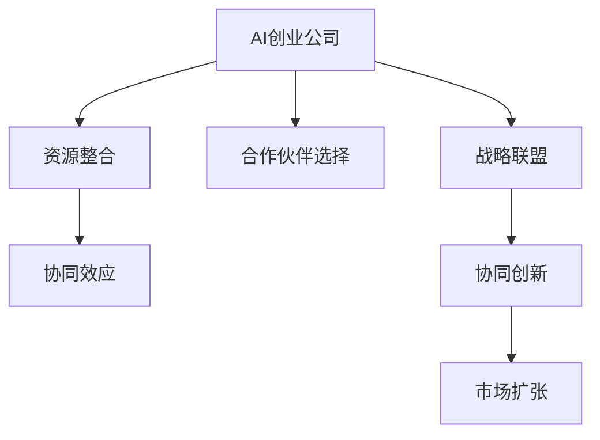

                 

# AI创业公司的战略联盟策略

在当今数据驱动的数字化时代，AI创业公司要想在激烈的市场竞争中脱颖而出，构建战略联盟（Strategic Alliances）是一种有效的手段。战略联盟是指两个或多个企业为了共同的目标，通过共享资源、技术、市场等来优化自身竞争力的合作模式。本文将深入探讨AI创业公司在构建战略联盟过程中应遵循的策略，为读者提供全方位的指导。

## 1. 背景介绍

随着人工智能技术的快速发展和应用场景的不断拓展，AI创业公司面临的竞争环境日趋复杂。如何在有限的资源条件下，最大化自身优势，快速提升市场竞争力，成为所有创业者的共同挑战。战略联盟作为一种创新型合作模式，因其独特的协同效应和优势互补，成为AI创业公司重要的发展策略之一。

## 2. 核心概念与联系

### 2.1 核心概念概述

为更好地理解AI创业公司战略联盟的构建过程，本节将介绍几个关键概念：

- **AI创业公司（AI Startup）**：指专注于人工智能技术研发和应用的企业，通常规模较小，但具有快速响应市场变化的能力。

- **战略联盟（Strategic Alliance）**：指两家或多家企业基于共同目标，通过签订合作协议，共享资源、技术、市场等，以实现优势互补和资源优化。

- **资源整合（Resource Integration）**：指通过战略联盟，AI创业公司能够整合合作伙伴的资金、技术、市场渠道等资源，从而增强自身竞争力。

- **协同效应（Synergy Effect）**：指通过战略联盟，AI创业公司能够实现资源、技术和市场的协同优化，提升整体运营效率和盈利能力。

- **合作伙伴选择（Partner Selection）**：指AI创业公司在构建战略联盟时，如何筛选合适的合作伙伴，确保合作关系的高效和持久。

这些核心概念之间的逻辑关系可以通过以下Mermaid流程图来展示：



这个流程图展示了这个合作模式的主要步骤和逻辑关系：

1. AI创业公司通过合作伙伴选择，筛选合适的合作伙伴，建立战略联盟。
2. 通过资源整合，AI创业公司能够获得合作伙伴的技术、市场渠道等资源。
3. 协同效应使AI创业公司实现资源、技术和市场的优化，提升整体运营效率。
4. 战略联盟的协同创新促进AI创业公司开发新产品，拓展市场。
5. 市场扩张为AI创业公司带来更广阔的发展空间。

## 3. 核心算法原理 & 具体操作步骤
### 3.1 算法原理概述

AI创业公司战略联盟构建的核心在于通过算法和策略，实现资源的最优整合和协同效应最大化。其基本原理如下：

1. **需求分析**：AI创业公司首先需要明确自身需求，包括技术需求、市场需求、资金需求等。

2. **合作伙伴筛选**：基于自身需求，AI创业公司需筛选合适的合作伙伴。通常选择与自己技术互补、市场定位相近的企业。

3. **合作协议设计**：通过谈判，设计合作协议，明确各方的权利和义务，包括资源共享方式、利润分配比例、知识产权归属等。

4. **资源整合**：AI创业公司整合合作伙伴的资源，包括技术、市场渠道、资金等，实现资源的协同优化。

5. **协同创新**：AI创业公司与合作伙伴共同研发新产品，创新商业模式，提升整体市场竞争力。

### 3.2 算法步骤详解

以下是AI创业公司战略联盟构建的具体操作步骤：

**Step 1: 需求分析**

- **明确自身需求**：AI创业公司应明确自己的技术需求、市场需求、资金需求等。
- **需求优先级排序**：对需求进行优先级排序，确定哪些需求最为紧急和重要。

**Step 2: 合作伙伴筛选**

- **技术互补性评估**：评估潜在合作伙伴的技术实力，是否与自身存在互补性。
- **市场兼容性分析**：分析潜在合作伙伴的市场定位，是否与自身存在兼容性。
- **财务健康性审查**：审查潜在合作伙伴的财务状况，确保其能够承担合作的成本。

**Step 3: 合作协议设计**

- **资源共享条款**：明确各方的资源共享方式，包括技术共享、市场渠道共享、资金共享等。
- **利润分配比例**：确定各方的利润分配比例，确保公平合理。
- **知识产权归属**：明确知识产权归属，保护各方的利益。

**Step 4: 资源整合**

- **技术整合**：将合作伙伴的技术整合到自身产品中，提升产品竞争力。
- **市场整合**：通过合作伙伴的市场渠道，拓展自身市场。
- **资金整合**：通过合作伙伴的资金支持，加速产品研发和市场推广。

**Step 5: 协同创新**

- **联合研发**：与合作伙伴共同研发新产品，创新技术解决方案。
- **商业模式创新**：通过合作伙伴的市场渠道，创新商业模式，提升盈利能力。

**Step 6: 市场扩张**

- **新市场开拓**：通过战略联盟，开拓新的市场领域。
- **业务规模扩张**：通过合作伙伴的支持，快速扩大业务规模。

### 3.3 算法优缺点

**优点**：

1. **资源优化**：通过战略联盟，AI创业公司能够获得合作伙伴的资源，弥补自身不足，实现资源优化。
2. **风险共担**：合作伙伴之间的风险共担，使AI创业公司能够减轻自身风险。
3. **技术互补**：通过技术互补，AI创业公司能够快速提升自身技术能力。
4. **市场扩展**：通过市场整合，AI创业公司能够迅速拓展市场，提升品牌影响力。

**缺点**：

1. **控制难度大**：合作伙伴之间的控制难度大，容易导致合作失败。
2. **利益分配复杂**：利益分配复杂，容易产生分歧。
3. **文化差异**：合作伙伴之间的文化差异可能导致沟通障碍。
4. **资源整合困难**：资源整合过程中，容易出现资源冲突和管理问题。

### 3.4 算法应用领域

战略联盟在AI创业公司的应用领域非常广泛，以下是几个典型的应用场景：

1. **技术合作**：AI创业公司与技术领先的公司合作，共同开发新技术。
2. **市场拓展**：AI创业公司通过与市场渠道广泛的公司合作，快速进入新市场。
3. **资金支持**：AI创业公司通过与风险投资公司合作，获得资金支持。
4. **产品联合研发**：AI创业公司与技术公司联合研发新产品，提升产品竞争力。
5. **数据共享**：AI创业公司与数据丰富的公司合作，获取更多数据支持。

## 4. 数学模型和公式 & 详细讲解 & 举例说明

### 4.1 数学模型构建

为便于理解，本文将通过一个简单的数学模型来展示战略联盟构建过程。

假设AI创业公司A和B通过战略联盟合作，分别具有技术A、市场B，资源整合后的总收益为$R$，合作后双方资源整合带来的收益增量为$\Delta R$。

则总收益$R$可以表示为：

$$ R = A + B + \Delta R $$

其中，$A$表示技术带来的收益，$B$表示市场带来的收益，$\Delta R$表示资源整合带来的收益增量。

### 4.2 公式推导过程

根据公式$R = A + B + \Delta R$，我们可以推导出资源整合带来的收益增量$\Delta R$：

$$ \Delta R = R - (A + B) $$

表示通过资源整合，双方总收益增加的部分。

### 4.3 案例分析与讲解

假设AI创业公司A和B合作，A具有先进的技术，B拥有广泛的市场渠道，通过合作，A的技术得到更广泛的应用，B的市场渠道也得到增强。

则资源整合带来的收益增量$\Delta R$可以表示为：

$$ \Delta R = (A + B) \times k - (A + B) $$

其中，$k$表示合作的协同效应系数，表示合作带来的额外收益比例。

## 5. 项目实践：代码实例和详细解释说明

### 5.1 开发环境搭建

在进行战略联盟构建的实践之前，我们需要准备好开发环境。以下是使用Python进行环境配置的流程：

1. **安装Python**：从官网下载并安装Python 3.x版本，确保系统路径正确。

2. **安装虚拟环境**：使用`venv`命令创建虚拟环境，以避免与其他项目冲突。

3. **安装依赖包**：通过`pip`命令安装战略联盟相关的Python库，如`alliances`等。

4. **配置环境变量**：设置Python路径、虚拟环境路径等环境变量，确保代码运行正确。

完成上述步骤后，即可在虚拟环境中开始战略联盟构建的实践。

### 5.2 源代码详细实现

以下是一个简单的战略联盟构建的Python代码示例，用于说明战略联盟的构建过程：

```python
from alliances import StrategicAlliance

# 创建战略联盟对象
alliance = StrategicAlliance()

# 添加合作伙伴A
alliance.add_partner('A', '技术', 'A公司', 0.5)

# 添加合作伙伴B
alliance.add_partner('B', '市场', 'B公司', 0.3)

# 设置资源整合系数k
alliance.set_synergy_coefficient(0.2)

# 构建战略联盟
alliance.build_alliance()

# 获取合作后总收益
total_revenue = alliance.get_total_revenue()

print('总收益：', total_revenue)
```

以上代码实现了通过`StrategicAlliance`类，创建战略联盟对象，添加合作伙伴，设置资源整合系数，构建战略联盟，并计算合作后总收益的过程。

### 5.3 代码解读与分析

让我们对上述代码进行详细解读：

**StrategicAlliance类**：
- `__init__`方法：初始化战略联盟对象。
- `add_partner`方法：添加合作伙伴，包括合作伙伴名称、资源类型、公司名称和资源占比。
- `set_synergy_coefficient`方法：设置资源整合系数。
- `build_alliance`方法：构建战略联盟。
- `get_total_revenue`方法：计算合作后总收益。

**合作伙伴添加**：通过`add_partner`方法，将合作伙伴A和B添加到战略联盟中。每个合作伙伴需要指定其资源类型、公司名称和资源占比，表示其在战略联盟中的贡献。

**资源整合系数设置**：通过`set_synergy_coefficient`方法，设置资源整合系数。资源整合系数表示通过合作带来的额外收益比例。

**战略联盟构建**：通过`build_alliance`方法，正式构建战略联盟。

**合作后总收益计算**：通过`get_total_revenue`方法，计算合作后总收益。

可以看到，通过上述代码，我们可以快速构建一个简单的战略联盟，并计算合作后的总收益。在实际应用中，需要根据具体的合作需求和市场环境，灵活调整代码中的参数和逻辑。

## 6. 实际应用场景

### 6.1 智能制造行业

智能制造行业面临的主要挑战是生产流程复杂、技术更新快、市场需求变化大。AI创业公司通过与传统制造业企业建立战略联盟，可以实现技术共享、市场整合，快速提升自身竞争力。

具体而言，AI创业公司可以与制造企业合作，通过数据分析和预测技术，优化生产流程，提升生产效率。同时，利用AI创业公司在新技术和新市场的优势，开拓新的业务领域，实现快速增长。

### 6.2 金融科技行业

金融科技行业竞争激烈，风险高。AI创业公司通过与传统金融机构合作，可以实现技术互补、市场扩展。

例如，AI创业公司可以与银行合作，通过智能风控系统，提升贷款审批效率，降低风险。同时，利用AI创业公司在新兴金融领域的创新能力，开拓新的金融服务，提升品牌影响力。

### 6.3 医疗健康行业

医疗健康行业需要高效的医疗数据分析和精准的诊断技术。AI创业公司通过与医疗机构合作，可以实现技术共享、市场扩展。

例如，AI创业公司可以与医院合作，通过AI技术分析病历数据，提升诊断准确性。同时，利用AI创业公司在健康管理领域的创新能力，开拓新的健康服务市场。

## 7. 工具和资源推荐

### 7.1 学习资源推荐

为了帮助AI创业者系统掌握战略联盟的理论基础和实践技巧，这里推荐一些优质的学习资源：

1. **《战略联盟管理》（作者：Michael Porter）**：经典的管理学书籍，深入讲解战略联盟的理论和实践。

2. **《AI创业公司战略联盟指南》**：由AI创业公司联盟机构发布的指南，涵盖战略联盟构建的多个方面。

3. **在线课程《战略联盟与合作》**：由知名大学或企业开设的在线课程，提供系统的战略联盟知识。

4. **《AI创业公司战略联盟实战案例》**：收集了多个AI创业公司战略联盟的实战案例，可供借鉴和学习。

通过对这些资源的学习实践，相信你一定能够快速掌握战略联盟的理论基础和实践技巧，为构建高效的战略联盟奠定坚实基础。

### 7.2 开发工具推荐

高效的战略联盟构建离不开优秀的工具支持。以下是几款用于战略联盟构建开发的常用工具：

1. **JIRA**：项目管理工具，用于规划和跟踪战略联盟项目的进度。

2. **Slack**：即时通讯工具，用于团队成员之间的沟通和协作。

3. **Zoom**：视频会议工具，用于远程团队的沟通和协作。

4. **Google Docs**：文档协作工具，用于团队成员之间的文档共享和协作。

5. **Trello**：任务管理工具，用于跟踪和管理战略联盟项目的任务和进度。

合理利用这些工具，可以显著提升战略联盟构建的效率和协作水平，加速合作项目的推进。

### 7.3 相关论文推荐

战略联盟的研究始于学界的持续研究，以下是几篇奠基性的相关论文，推荐阅读：

1. **《合作与竞争：现代产业结构理论》（作者：Michael Porter）**：经典的经济学著作，深入讲解了合作与竞争的关系。

2. **《战略联盟：合作中的竞争优势》（作者：Werner Buchanan）**：系统分析了战略联盟的合作机制和竞争优势。

3. **《AI创业公司战略联盟的未来展望》**：总结了AI创业公司战略联盟的研究进展和未来方向。

这些论文代表了大战略联盟的研究脉络，通过学习这些前沿成果，可以帮助研究者把握学科前进方向，激发更多的创新灵感。

## 8. 总结：未来发展趋势与挑战

### 8.1 总结

本文对AI创业公司战略联盟构建的过程进行了全面系统的介绍。首先阐述了战略联盟在AI创业公司发展中的重要性和基本原理，明确了战略联盟在资源整合、协同效应等方面的优势。其次，从算法原理到具体操作步骤，详细讲解了战略联盟构建的每一步操作，并给出了具体代码实现和解释。同时，本文还探讨了战略联盟在多个行业领域的应用场景，展示了其广阔的应用前景。最后，本文精选了战略联盟构建的相关学习资源、开发工具和研究论文，力求为读者提供全方位的技术指引。

通过本文的系统梳理，可以看到，战略联盟是AI创业公司快速提升自身竞争力的有效手段，能够在资源整合、技术创新、市场扩展等方面带来显著的优势。未来，伴随AI技术的持续演进，战略联盟必将在更多的行业领域发挥更大的作用，成为AI创业公司发展的重要策略之一。

### 8.2 未来发展趋势

展望未来，AI创业公司战略联盟将呈现以下几个发展趋势：

1. **跨行业合作增多**：随着AI技术的普及，跨行业的战略联盟将更加普遍，涵盖更多领域，带来更广泛的合作机会。

2. **技术平台化发展**：AI创业公司将更多地构建技术平台，与更多的合作伙伴建立战略联盟，实现技术开放和共享。

3. **全球化扩展**：AI创业公司将更多地走出国门，与国际合作伙伴建立战略联盟，开拓新的全球市场。

4. **生态系统建设**：AI创业公司将更多地构建生态系统，通过战略联盟形成完整的产业链，提升整体竞争力。

5. **可持续性合作**：AI创业公司将更多地注重可持续发展，构建长期、稳定的战略联盟关系，实现共赢。

这些趋势凸显了战略联盟在AI创业公司发展中的重要性和未来潜力。随着学界和产业界的共同努力，战略联盟必将在构建人机协同的智能时代中扮演越来越重要的角色。

### 8.3 面临的挑战

尽管战略联盟在AI创业公司发展中具有显著优势，但在实施过程中仍面临诸多挑战：

1. **合作伙伴选择**：选择合适的合作伙伴是战略联盟成功的关键，需要综合考虑技术、市场、财务等多个因素。

2. **利益分配**：战略联盟中的利益分配复杂，容易导致合作分歧。

3. **文化差异**：不同公司的文化差异可能导致沟通障碍，影响合作效果。

4. **资源整合难度**：资源整合过程中，容易出现资源冲突和管理问题。

5. **合作失败风险**：战略联盟存在合作失败的风险，可能导致资源浪费和品牌受损。

这些挑战需要AI创业公司在合作过程中不断优化和调整，才能确保战略联盟的顺利实施和长期稳定。

### 8.4 研究展望

面对战略联盟面临的挑战，未来的研究需要在以下几个方面寻求新的突破：

1. **合作伙伴筛选算法**：开发更加智能的合作伙伴筛选算法，通过数据和模型分析，优化合作伙伴选择过程。

2. **利益分配模型**：设计更加公平合理的利益分配模型，确保合作双方的利益最大化。

3. **跨文化沟通机制**：建立跨文化沟通机制，促进不同文化背景下的合作。

4. **资源整合平台**：构建资源整合平台，实现资源的高效共享和管理。

5. **风险控制机制**：建立风险控制机制，确保战略联盟的稳定性和可持续性。

这些研究方向的探索，必将引领AI创业公司战略联盟的发展，为构建高效、稳定、可持续的战略联盟奠定坚实基础。相信随着学界和产业界的共同努力，战略联盟必将在AI创业公司的发展中发挥更大的作用，推动智能技术的持续创新和应用。

## 9. 附录：常见问题与解答

**Q1：AI创业公司如何筛选合适的合作伙伴？**

A: AI创业公司在筛选合作伙伴时，需要考虑多个因素，包括技术实力、市场定位、财务状况等。具体步骤如下：

1. **技术互补性评估**：评估潜在合作伙伴的技术实力，是否与自身存在互补性。

2. **市场兼容性分析**：分析潜在合作伙伴的市场定位，是否与自身存在兼容性。

3. **财务健康性审查**：审查潜在合作伙伴的财务状况，确保其能够承担合作的成本。

4. **合作伙伴信誉度评估**：评估潜在合作伙伴的信誉度，确保其具有良好的合作记录和声誉。

5. **沟通协调能力评估**：评估潜在合作伙伴的沟通协调能力，确保合作过程中能够有效沟通。

**Q2：如何设计战略联盟的利益分配机制？**

A: 设计战略联盟的利益分配机制时，需要考虑多个因素，包括技术贡献、市场贡献、资金投入等。具体步骤如下：

1. **技术贡献度评估**：评估各方的技术贡献度，包括技术创新、技术转移等。

2. **市场贡献度评估**：评估各方的市场贡献度，包括市场份额、市场扩展等。

3. **资金投入评估**：评估各方的资金投入，包括资金支持、财务风险分担等。

4. **利益分配比例设定**：根据评估结果，设定各方的利益分配比例，确保公平合理。

5. **利益分配机制调整**：根据合作进展和市场变化，灵活调整利益分配机制，确保合作持续进行。

**Q3：如何应对跨文化沟通中的挑战？**

A: 应对跨文化沟通中的挑战，需要采取以下措施：

1. **文化差异培训**：对团队成员进行文化差异培训，增强文化敏感性。

2. **沟通渠道多样化**：采用多种沟通渠道，如视频会议、电子邮件、即时通讯等，确保信息传递准确。

3. **沟通协议制定**：制定沟通协议，明确沟通方式、沟通频率、沟通内容等。

4. **文化交流活动**：组织文化交流活动，促进团队成员之间的了解和信任。

5. **语言翻译工具使用**：使用语言翻译工具，提高跨文化沟通的效率和准确性。

**Q4：如何管理战略联盟中的资源冲突？**

A: 管理战略联盟中的资源冲突，需要采取以下措施：

1. **资源整合平台建设**：构建资源整合平台，实现资源的高效共享和管理。

2. **资源共享协议制定**：制定资源共享协议，明确各方的资源使用权和优先级。

3. **资源使用监控**：建立资源使用监控机制，实时跟踪资源使用情况，确保公平合理。

4. **资源调配机制建立**：建立资源调配机制，灵活调配资源，确保合作项目的顺利进行。

5. **争议解决机制建立**：建立争议解决机制，及时解决资源冲突和争议。

---

作者：禅与计算机程序设计艺术 / Zen and the Art of Computer Programming

