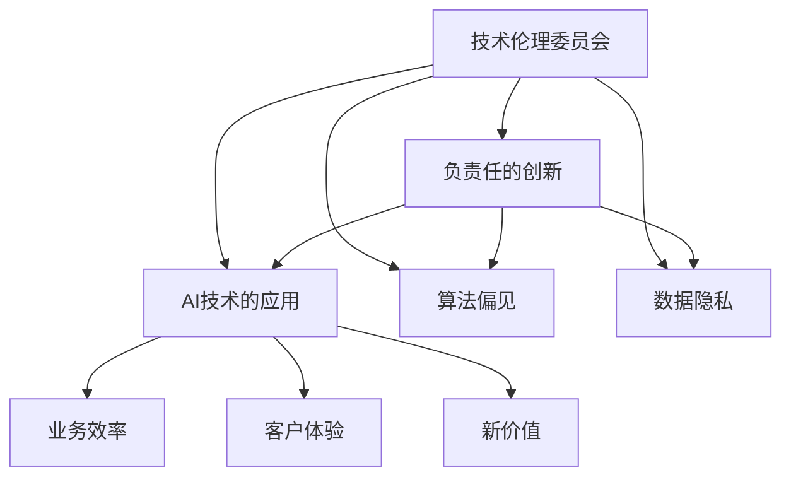

                 

# AI创业公司的技术伦理委员会：负责任的创新与应用

> 关键词：技术伦理,人工智能,创新,应用,负责任

## 1. 背景介绍

### 1.1 问题由来
随着人工智能(AI)技术的快速发展，越来越多的AI创业公司如雨后春笋般涌现，其在医疗、金融、教育、交通等多个领域的应用前景广阔。然而，AI技术的创新与应用也带来了一系列伦理问题，如数据隐私、算法偏见、决策透明性等，这些问题若得不到妥善解决，将对社会造成严重负面影响。因此，如何在AI创业公司中建立有效的技术伦理委员会，引导AI技术的负责任创新与应用，成为当前行业内的热点话题。

### 1.2 问题核心关键点
本文聚焦于AI创业公司中技术伦理委员会的构建与运作，重点探讨了以下关键问题：
- 技术伦理委员会的组成和职能。
- 技术伦理委员会在创新与应用中应遵循的基本原则。
- 技术伦理委员会如何在AI创业公司中实现落地和实践。

## 2. 核心概念与联系

### 2.1 核心概念概述

为更好地理解AI创业公司技术伦理委员会的构建与运作，本节将介绍几个密切相关的核心概念：

- **技术伦理委员会**：由公司内部成员和外部专家组成的专门机构，负责监督和指导AI技术的研发和应用，确保其符合伦理标准和法律规定。
- **负责任的创新**：在AI技术开发过程中，积极考虑社会、经济、环境等多方面因素，避免技术滥用，保障技术带来的社会利益最大化。
- **AI技术的应用**：指将AI技术应用于实际业务场景中，提升业务效率、优化客户体验、创造新价值等。
- **算法偏见**：AI算法在训练数据和模型设计中存在的歧视性或不公平性问题，可能导致模型输出结果偏离公平正义。
- **数据隐私**：涉及个人数据的收集、存储、使用和分享，保护数据隐私是AI技术应用中的重要环节。

这些核心概念之间的逻辑关系可以通过以下Mermaid流程图来展示：



这个流程图展示了一系列核心概念之间的相互关系和作用：

1. **技术伦理委员会**作为监督者和指导者，确保**负责任的创新**得到贯彻执行。
2. **负责任的创新**与**AI技术的应用**密切相关，推动技术向社会有益的方向发展。
3. **算法偏见**和**数据隐私**作为技术伦理的重要方面，需要特别关注，避免技术滥用。
4. **AI技术的应用**可提升**业务效率**、优化**客户体验**、创造**新价值**，但需在**负责任的创新**和**技术伦理**的框架下进行。

## 3. 核心算法原理 & 具体操作步骤
### 3.1 算法原理概述

AI创业公司的技术伦理委员会主要负责制定和执行技术伦理规范，监督AI技术的开发和应用。其核心任务包括：

- 制定符合伦理和法律规范的AI技术研发标准和应用指南。
- 对AI算法进行伦理审查，确保算法设计不包含偏见和歧视。
- 保护数据隐私，确保数据使用符合法律法规。
- 提升AI技术的透明性，使公众能够理解和监督AI决策过程。

### 3.2 算法步骤详解

技术伦理委员会的构建与运作主要包括以下几个关键步骤：

**Step 1: 委员会组建与职责明确**
- 组建技术伦理委员会，由公司高层领导、法律顾问、数据科学家、伦理学专家、行业代表等多方人员组成。
- 明确委员会的职责和权限，包括制定伦理规范、审查算法、监督数据使用等。

**Step 2: 制定伦理规范和操作规程**
- 根据国家法律法规和行业标准，结合公司实际情况，制定详细的技术伦理规范。
- 操作规程应涵盖数据处理、算法设计、模型训练、应用部署等各个环节的伦理要求。

**Step 3: 实施伦理审查与监督**
- 定期对AI技术研发项目进行伦理审查，确保项目符合既定规范。
- 在AI技术应用过程中，持续监督数据使用情况，确保数据隐私和安全。

**Step 4: 提升算法透明性和可解释性**
- 推动AI算法设计透明性，使决策过程可追溯、可解释。
- 提供算法可解释工具，帮助用户理解AI决策的依据和逻辑。

**Step 5: 伦理教育和培训**
- 定期对公司员工进行技术伦理教育，提高全员伦理意识。
- 开展针对数据科学家和工程师的专项培训，确保他们掌握必要的伦理知识。

### 3.3 算法优缺点

技术伦理委员会的构建与运作具有以下优点：
1. 推动负责任的创新，防止技术滥用，确保AI技术为社会带来积极影响。
2. 保护数据隐私，避免数据泄露和滥用，增强用户信任。
3. 提升算法透明性和可解释性，增强公众对AI技术的理解和信任。
4. 监督和指导AI技术应用，确保合规性和安全性。

同时，该机制也存在一定的局限性：
1. 需要投入大量人力物力，初期成本较高。
2. 委员会成员多样性和专业知识需不断更新，以适应快速变化的技术环境。
3. 伦理标准和规范的制定可能受到各方利益博弈的影响，难以完全达成共识。
4. 实际操作中，伦理委员会的决策和监督作用可能会受到内部权力结构的影响。

尽管存在这些局限性，但技术伦理委员会的构建与运作仍然是AI创业公司确保技术负责任创新的重要手段。未来相关研究的重点在于如何进一步优化伦理审查流程，提高伦理委员会的独立性和公正性，同时兼顾效率和成本。

### 3.4 算法应用领域

技术伦理委员会的应用领域非常广泛，几乎涵盖AI创业公司所有技术研发和应用的环节，例如：

- 数据收集与处理：确保数据收集过程合法合规，保护数据隐私。
- 算法设计与开发：对算法进行伦理审查，确保算法公平性和透明性。
- 模型训练与优化：在模型训练过程中遵循伦理规范，避免偏见和歧视。
- 应用部署与运营：监控应用过程中的数据使用情况，保护用户隐私。
- 技术交流与合作：在技术交流与合作中，推动负责任的创新实践，确保合规性和透明度。

## 4. 数学模型和公式 & 详细讲解 & 举例说明
### 4.1 数学模型构建

为更好地理解技术伦理委员会的运作机制，本节将从数学模型和公式的角度进行详细讲解。

假设一个AI技术项目需要经过伦理委员会的审查和监督。我们定义：
- $R$ 为伦理委员会的审查次数。
- $S$ 为监督检查频次。
- $C$ 为伦理委员会的组成人员。
- $F$ 为每次审查的期望成本。
- $M$ 为每次监督检查的期望成本。

技术伦理委员会的总体成本 $T$ 可表示为：

$$
T = R \times F + S \times M
$$

在实际操作中，需要根据具体项目的情况，对 $R$ 和 $S$ 进行合理的配置，以达到成本效益最大化。

### 4.2 公式推导过程

在公式 $T = R \times F + S \times M$ 的基础上，我们可以进一步分析不同配置方案对总成本的影响。例如，增加审查次数 $R$，虽然可以降低监督成本 $S$，但同时也增加了总体成本 $T$。

假设 $F = 10$，$M = 5$，不同的 $R$ 和 $S$ 配置对 $T$ 的影响如下：

| $R$ | $S$ | $T$ |
| --- | --- | --- |
| 3   | 1   | 35  |
| 4   | 1   | 45  |
| 3   | 2   | 40  |
| 4   | 2   | 50  |

通过分析可以看到，当 $R = 3$，$S = 2$ 时，总成本 $T$ 最低，即在保证审查和监督效果的前提下，最小化总体成本。

### 4.3 案例分析与讲解

**案例1: 算法偏见审查**
某AI创业公司开发了一款信用评分模型，用于评估贷款申请人的信用风险。该模型在数据集上表现优异，但在真实环境中却出现了严重的性别歧视。技术伦理委员会通过算法审查，发现模型在训练数据中存在性别偏见，通过调整数据采样策略和算法参数，有效减少了偏见，并提升了模型公平性。

**案例2: 数据隐私保护**
一家医疗AI创业公司，利用电子病历数据训练疾病预测模型。技术伦理委员会在审查过程中，发现数据处理和存储过程中存在隐私泄露风险，建议公司采用加密和匿名化技术，确保数据隐私安全。

## 5. 项目实践：代码实例和详细解释说明
### 5.1 开发环境搭建

在进行技术伦理委员会构建与运作的实践前，我们需要准备好开发环境。以下是使用Python进行代码开发的常见环境配置流程：

1. 安装Anaconda：从官网下载并安装Anaconda，用于创建独立的Python环境。

2. 创建并激活虚拟环境：
```bash
conda create -n ethics-env python=3.8 
conda activate ethics-env
```

3. 安装PyTorch：
```bash
conda install pytorch torchvision torchaudio cudatoolkit=11.1 -c pytorch -c conda-forge
```

4. 安装相关的伦理审查工具和库：
```bash
pip install ethics审查库，如Data privacy toolkits、Fairness toolkits等
```

5. 安装必要的IDE和版本控制工具：
```bash
pip install pycharm、git等
```

完成上述步骤后，即可在`ethics-env`环境中开始实践。

### 5.2 源代码详细实现

以下是一个基于Python实现的简化技术伦理委员会审查流程示例：

```python
from ethics审查库 import EthicsCommittee, EthicsReview

# 创建伦理委员会实例
committee = EthicsCommittee('AI技术伦理委员会', members=['李华', '王强', '张伟'], roles=['技术总监', '数据科学家', '法律顾问'])

# 启动审查流程
ethics_review = EthicsReview(committee, project_name='信用评分模型')
ethics_review.start()

# 提交审查申请
ethics_review.submit_application({
    '项目描述': '信用评分模型',
    '数据集': ['医院病历数据', '公共数据集'],
    '算法': '线性回归算法',
    '参数': {'学习率': 0.01, '迭代次数': 1000},
    '使用情况': '贷款申请审批'
})

# 伦理委员会审查结果
ethics_review.review_results()
```

在上述代码中，`EthicsCommittee`类表示伦理委员会的实例，`EthicsReview`类用于启动审查流程。通过调用`submit_application`方法提交项目申请，并使用`review_results`方法获取审查结果。

### 5.3 代码解读与分析

**EthicsCommittee类**：
- `__init__`方法：初始化伦理委员会的基本信息，包括成员和角色。
- `review_results`方法：获取伦理委员会的审查结果。

**EthicsReview类**：
- `start`方法：启动伦理审查流程。
- `submit_application`方法：提交项目申请，包括项目描述、数据集、算法、参数和使用情况等关键信息。
- `review_results`方法：获取伦理审查结果。

通过上述代码的实现，可以简单地模拟一个技术伦理委员会的审查流程。在实际应用中，需要根据公司实际情况进一步扩展和完善，如增加数据隐私保护措施、算法偏见检测等模块。

## 6. 实际应用场景
### 6.1 医疗AI系统

在医疗领域，AI系统涉及患者隐私和数据安全，技术伦理委员会的作用尤为关键。例如，某医疗AI创业公司开发了癌症诊断系统，通过分析电子病历数据，帮助医生进行疾病预测和治疗方案推荐。技术伦理委员会在项目审查过程中，确保数据处理和存储符合隐私保护法规，同时评估算法的公平性和透明性，确保系统输出公正客观，避免医疗歧视。

### 6.2 金融风控系统

金融领域的数据和算法具有高度敏感性，技术伦理委员会的作用在于保障系统公平性和透明性。例如，一家金融AI创业公司开发的信用评估系统，通过分析借贷数据，预测客户的违约风险。技术伦理委员会在审查过程中，确保数据使用符合法律法规，同时评估模型偏见，确保系统决策的公正性。

### 6.3 智能客服系统

智能客服系统的应用，涉及到用户隐私保护和算法偏见问题。技术伦理委员会在审查过程中，确保系统遵守数据隐私法规，同时评估算法决策的透明性，避免偏见和歧视。例如，一家电商企业的智能客服系统，通过分析用户行为数据，自动回复客户咨询。技术伦理委员会在审查过程中，确保系统行为透明、公平，避免对用户造成不利影响。

### 6.4 未来应用展望

随着AI技术在各个领域的应用不断深入，技术伦理委员会的作用将愈发重要。未来，技术伦理委员会将在以下方面发挥更大作用：

1. **数据隐私保护**：随着数据收集和处理量的增加，技术伦理委员会将加强对数据隐私的保护，确保数据使用合法合规。
2. **算法透明性**：提升算法的透明性和可解释性，使公众能够理解和监督AI决策过程。
3. **公平性审查**：对算法进行公平性审查，确保技术应用的公正性和公平性。
4. **伦理教育与培训**：通过教育和培训，提升全员伦理意识，确保AI技术的负责任创新。
5. **多领域应用**：随着AI技术在各个领域的应用不断深入，技术伦理委员会将涉及更多领域，如医疗、金融、教育等。

## 7. 工具和资源推荐
### 7.1 学习资源推荐

为了帮助开发者系统掌握技术伦理委员会的构建与运作的理论基础和实践技巧，这里推荐一些优质的学习资源：

1. **《AI伦理指南》书籍**：由伦理学家和技术专家共同撰写，涵盖AI技术的伦理问题，提供详细的伦理规范和操作指南。
2. **《AI伦理与法律》课程**：由知名大学开设的在线课程，涵盖AI伦理、法律、政策等多个方面，系统介绍技术伦理委员会的构建与运作。
3. **Data Privacy Toolkit**：开源数据隐私保护工具包，提供数据加密、匿名化等技术，帮助开发者保护数据隐私。
4. **Fairness Toolkit**：开源公平性检测工具包，提供算法偏见检测、公平性评估等功能，帮助开发者确保算法的公正性。

通过对这些资源的学习实践，相信你一定能够快速掌握技术伦理委员会的精髓，并用于解决实际的伦理问题。

### 7.2 开发工具推荐

高效的开发离不开优秀的工具支持。以下是几款用于技术伦理委员会构建与运作开发的常用工具：

1. **Jupyter Notebook**：强大的交互式编程环境，支持Python代码和伦理审查流程的展示和分享。
2. **Git**：版本控制工具，帮助团队协作和代码管理。
3. **Google Colab**：免费的云平台，提供GPU资源，支持快速实验和部署。
4. **AWS SageMaker**：云端AI服务平台，支持模型训练和部署，方便技术伦理委员会的落地应用。

合理利用这些工具，可以显著提升技术伦理委员会的构建与运作效率，加快创新迭代的步伐。

### 7.3 相关论文推荐

技术伦理委员会的研究源于学界的持续探索。以下是几篇奠基性的相关论文，推荐阅读：

1. **《AI伦理框架》论文**：提出AI技术的伦理框架，涵盖数据隐私、算法公平性等多个方面，为技术伦理委员会提供理论支持。
2. **《AI伦理审查机制》论文**：探讨AI伦理审查机制的设计和实施，提供实用的操作指南和案例分析。
3. **《AI伦理教育与培训》论文**：介绍AI伦理教育与培训的方法和实践，提升全员伦理意识。

这些论文代表了大语言模型微调技术的发展脉络。通过学习这些前沿成果，可以帮助研究者把握学科前进方向，激发更多的创新灵感。

## 8. 总结：未来发展趋势与挑战
### 8.1 总结

本文对AI创业公司技术伦理委员会的构建与运作进行了全面系统的介绍。首先阐述了技术伦理委员会的组成和职能，明确了在创新与应用中应遵循的基本原则。其次，从原理到实践，详细讲解了技术伦理委员会的运作机制，给出了代码实例和详细解释说明。同时，本文还探讨了技术伦理委员会在实际应用中的多个场景，展示了其广泛的适用性。此外，本文精选了相关的学习资源、开发工具和论文推荐，力求为读者提供全方位的技术指引。

通过本文的系统梳理，可以看到，技术伦理委员会在AI创业公司中扮演着重要角色，有助于推动负责任的创新，保护数据隐私，提升算法公平性，增强AI技术的透明性和可解释性。随着AI技术的不断深入应用，技术伦理委员会将成为确保技术负责任创新的重要保障，为构建安全、可靠、可解释、可控的智能系统铺平道路。

### 8.2 未来发展趋势

展望未来，技术伦理委员会的发展趋势将呈现以下几个方向：

1. **数据隐私保护**：随着数据收集和处理量的增加，技术伦理委员会将加强对数据隐私的保护，确保数据使用合法合规。
2. **算法透明性**：提升算法的透明性和可解释性，使公众能够理解和监督AI决策过程。
3. **公平性审查**：对算法进行公平性审查，确保技术应用的公正性和公平性。
4. **伦理教育与培训**：通过教育和培训，提升全员伦理意识，确保AI技术的负责任创新。
5. **多领域应用**：随着AI技术在各个领域的应用不断深入，技术伦理委员会将涉及更多领域，如医疗、金融、教育等。

以上趋势凸显了技术伦理委员会的重要性和广泛应用前景。这些方向的探索发展，必将进一步提升AI技术的社会价值，保障技术负责任创新。

### 8.3 面临的挑战

尽管技术伦理委员会在AI创业公司中发挥了重要作用，但在实践过程中，仍然面临一些挑战：

1. **成本和资源**：建立和运行技术伦理委员会需要投入大量人力物力，初期成本较高。
2. **多样性和专业知识**：委员会成员多样性和专业知识需不断更新，以适应快速变化的技术环境。
3. **独立性和公正性**：伦理委员会的决策和监督作用可能会受到内部权力结构的影响，难以完全独立公正。
4. **操作复杂性**：技术伦理委员会的操作复杂性较高，需与公司业务紧密结合，灵活应对各种伦理问题。

尽管存在这些挑战，但技术伦理委员会的构建与运作仍然是AI创业公司确保技术负责任创新的重要手段。未来相关研究的重点在于如何进一步优化伦理审查流程，提高伦理委员会的独立性和公正性，同时兼顾效率和成本。

### 8.4 研究展望

面对技术伦理委员会面临的挑战，未来的研究需要在以下几个方面寻求新的突破：

1. **优化审查流程**：探索更高效、更透明的伦理审查流程，确保技术伦理委员会的高效运作。
2. **增强独立性**：提高技术伦理委员会的独立性和公正性，确保其在决策过程中不受内部因素影响。
3. **数据隐私保护**：研究更先进的数据隐私保护技术，确保数据使用的安全性和合法性。
4. **算法透明性**：提升算法的透明性和可解释性，增强公众对AI技术的理解和信任。
5. **伦理教育与培训**：开发更系统、更全面的伦理教育与培训课程，提升全员伦理意识。

这些研究方向的探索，必将引领技术伦理委员会走向成熟，为构建安全、可靠、可解释、可控的智能系统铺平道路。面向未来，技术伦理委员会需要与其他AI技术进行更深入的融合，共同推动自然语言理解和智能交互系统的进步。只有勇于创新、敢于突破，才能不断拓展AI技术的边界，让智能技术更好地造福人类社会。

## 9. 附录：常见问题与解答

**Q1：技术伦理委员会的职责和权限是什么？**

A: 技术伦理委员会的职责包括制定和执行技术伦理规范，对AI技术研发和应用进行审查和监督，确保技术应用的公平性和透明性，保护数据隐私等。委员会的权限包括决策权、监督权和建议权，但不具备直接的决策执行权。

**Q2：技术伦理委员会如何确保算法的公平性和透明性？**

A: 技术伦理委员会通过以下措施确保算法的公平性和透明性：
1. 在算法设计阶段进行伦理审查，确保算法设计符合伦理标准。
2. 对算法进行公平性检测，评估算法在不同群体上的表现。
3. 提供算法可解释工具，帮助用户理解和监督算法决策过程。

**Q3：技术伦理委员会在AI创业公司中如何实现落地和实践？**

A: 技术伦理委员会的落地和实践需结合公司实际情况，具体步骤包括：
1. 组建委员会，明确职责和权限。
2. 制定伦理规范和操作规程，确保项目合规性。
3. 启动伦理审查和监督流程，确保项目符合伦理标准。
4. 提升算法透明性和可解释性，增强公众信任。
5. 定期对全员进行伦理教育和培训，提升伦理意识。

**Q4：技术伦理委员会如何应对数据隐私保护问题？**

A: 技术伦理委员会应对数据隐私保护问题需采取以下措施：
1. 制定数据隐私保护政策，确保数据使用合规。
2. 采用数据加密和匿名化技术，保护数据隐私。
3. 对数据处理和存储过程进行监督，确保数据安全。
4. 对数据泄露事件进行应急处理，减少损失。

**Q5：技术伦理委员会的组成和职责如何设计？**

A: 技术伦理委员会的组成和职责设计需考虑公司实际情况和业务需求，一般包括以下几个方面：
1. 组建委员会，包括公司高层领导、法律顾问、数据科学家、伦理学专家等。
2. 明确委员会的职责和权限，如制定伦理规范、审查算法、监督数据使用等。
3. 制定详细的伦理规范和操作规程，确保项目合规性。

通过以上详细说明，相信你对技术伦理委员会的构建与运作有了更加全面的理解，能够在其指导下，推动AI技术的负责任创新与应用。

---

作者：禅与计算机程序设计艺术 / Zen and the Art of Computer Programming

