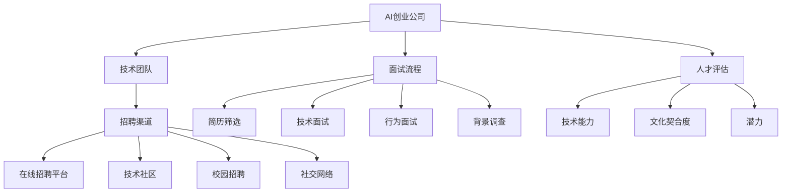

                 

# AI创业公司的技术团队招聘：招聘渠道、面试流程与人才评估

> 关键词：AI创业公司, 技术团队, 招聘渠道, 面试流程, 人才评估, 人才管理, 团队建设, 招聘技巧

## 1. 背景介绍

### 1.1 问题由来
在当今人工智能（AI）浪潮中，AI创业公司如雨后春笋般涌现。这些公司往往拥有创新的理念和雄心勃勃的愿景，但如何构建一支高素质的技术团队以实现其商业目标，成为摆在面前的重大挑战。一个高效的技术团队是AI创业公司成功的基石，而招聘则是构建团队的关键环节。本文将深入探讨AI创业公司技术团队的招聘渠道、面试流程和人才评估方法，以帮助创始人招聘到最合适的人才。

### 1.2 问题核心关键点
招聘是一个复杂且耗时的过程，涉及多个环节。以下是该问题的核心关键点：
- **招聘渠道选择**：选择正确的招聘渠道，将显著提升招聘效率和质量。
- **面试流程设计**：设计合理、系统的面试流程，有助于全面评估候选人能力和文化契合度。
- **人才评估标准**：明确、系统的评估标准，是确保招聘到最佳候选人的关键。

这些关键点共同构成了AI创业公司技术团队招聘的框架，涵盖了从招聘渠道的选择到面试流程的设计，再到人才的评估。以下将逐一探讨这些核心概念。

## 2. 核心概念与联系

### 2.1 核心概念概述

为更好地理解AI创业公司技术团队的招聘方法，本节将介绍几个密切相关的核心概念：

- **AI创业公司**：专注于AI技术应用的创业企业，旨在通过创新的AI技术解决特定问题，推动行业变革。
- **技术团队**：由具备不同背景和技能的AI工程师、数据科学家、产品经理等组成，共同推进AI产品的开发和落地。
- **招聘渠道**：用于招聘技术人才的多种途径，包括在线招聘平台、技术社区、校园招聘、社交网络等。
- **面试流程**：招聘过程中的一系列步骤，旨在全面评估候选人的技术能力、文化契合度以及潜力。
- **人才评估**：通过系统化的评估方法，识别出最符合公司需求和技术团队文化的候选人。

这些核心概念之间的逻辑关系可以通过以下Mermaid流程图来展示：



这个流程图展示了这个问题的各个环节，从AI创业公司的成立，到技术团队的构建，再到人才的招聘、面试和评估。

## 3. 核心算法原理 & 具体操作步骤

### 3.1 算法原理概述

AI创业公司的技术团队招聘过程，本质上是一个基于系统化评估和决策的数据驱动过程。其核心思想是：通过精心设计的多轮面试和评估方法，全面评估候选人的技术能力、文化契合度以及潜力，从而选出最符合公司需求和技术团队文化的最佳人才。

形式化地，假设技术团队的招聘目标为找到最合适的候选人 $C$，候选人的评估指标为 $\text{Metric}_1, \text{Metric}_2, \ldots, \text{Metric}_n$。招聘的目标是最小化以下多目标优化问题：

$$
\min_{C} \left( \sum_{i=1}^n \omega_i \text{Metric}_i(C) \right)
$$

其中，$\omega_i$ 为各评估指标的权重，表示其在招聘决策中的重要性。

通过梯度下降等优化算法，招聘过程不断更新候选人的评分，最小化综合评估指标，最终得到最佳候选人 $C^*$。

### 3.2 算法步骤详解

AI创业公司技术团队的招聘一般包括以下几个关键步骤：

**Step 1: 准备招聘计划**
- 定义招聘需求，包括岗位职责、技术栈要求、文化契合度要求等。
- 确定招聘时间和预算，设计招聘团队成员角色和职责。

**Step 2: 设计面试流程**
- 选择合适的面试流程，包括简历筛选、技术面试、行为面试、背景调查等。
- 设计评估指标和权重，确保各环节评价的公正性和全面性。

**Step 3: 设置招聘策略**
- 选择合适的招聘渠道，如LinkedIn、GitHub、技术社区等。
- 设计有吸引力的职位描述和福利待遇，吸引优质候选人。

**Step 4: 执行招聘流程**
- 发布招聘信息，收集候选人简历。
- 进行简历筛选，根据岗位需求筛选出符合基本条件的候选人。
- 安排面试，通过多轮技术面试和文化评估，全面评估候选人。
- 背景调查，核实候选人提供信息的真实性。
- 综合评估结果，选择最佳候选人。

**Step 5: 入职和培训**
- 提供有竞争力的薪资和福利待遇，吸引最佳候选人加入。
- 设计新员工培训计划，帮助其快速融入团队。

### 3.3 算法优缺点

AI创业公司技术团队招聘的基于系统化评估方法，具有以下优点：
- 全面系统：多轮面试和评估方法，确保全面了解候选人的能力、文化和潜力。
- 数据驱动：通过评估指标和权重，使得招聘决策更加客观公正。
- 高效快捷：系统化的流程设计，减少了招聘时间和成本。

同时，该方法也存在一定的局限性：
- 工作量大：多轮面试和评估需要耗费大量时间和人力资源。
- 评估难度高：技术能力和文化契合度的评估可能存在主观偏差。
- 人才保留难：优秀人才往往选择多，如何确保其长期稳定性是一大挑战。

尽管存在这些局限性，但就目前而言，基于系统化评估的招聘方法仍是大规模招聘技术人才的主流范式。未来相关研究的重点在于如何进一步降低评估难度，提高招聘效率，同时兼顾公正性和多样性等因素。

### 3.4 算法应用领域

基于系统化评估的招聘方法，在AI创业公司的技术团队构建中得到了广泛应用，覆盖了从研发团队到产品团队等多个领域，例如：

- **研发团队**：包括算法工程师、数据科学家、机器学习工程师等，负责AI产品的核心技术实现。
- **产品团队**：包括产品经理、UI/UX设计师等，负责产品需求定义、设计、迭代和市场推广。
- **运维团队**：包括运维工程师、SRE等，负责系统架构设计和维护。

除了上述这些经典团队外，AI创业公司还可能涉及更多领域，如大数据、云计算、安全、隐私保护等，这些领域的技术团队构建同样依赖于科学系统的招聘方法。

## 4. 数学模型和公式 & 详细讲解  
### 4.1 数学模型构建

本节将使用数学语言对AI创业公司技术团队招聘过程进行更加严格的刻画。

记技术团队的招聘目标为 $C$，候选人的综合评估指标为 $\text{Metric}_1, \text{Metric}_2, \ldots, \text{Metric}_n$，各指标的权重为 $\omega_1, \omega_2, \ldots, \omega_n$。设 $\text{Score}_i$ 为候选人 $C$ 在指标 $\text{Metric}_i$ 上的得分，则招聘目标函数可表示为：

$$
\min_{C} \left( \sum_{i=1}^n \omega_i \text{Score}_i(C) \right)
$$

其中，$\text{Score}_i(C)$ 为候选人 $C$ 在指标 $\text{Metric}_i$ 上的评估得分。

### 4.2 公式推导过程

以下我们以技术面试为例，推导候选人得分的计算公式。

假设技术面试的评分标准为 $T_k$，其中 $k=1,2,\ldots,K$。设 $S_k(C)$ 为候选人 $C$ 在第 $k$ 次技术面试中的得分，则技术面试的总得分为：

$$
\text{Score}_{\text{tech}}(C) = \sum_{k=1}^K \alpha_k S_k(C)
$$

其中 $\alpha_k$ 为第 $k$ 次技术面试的权重。

在得到技术面试的总得分后，可以将其与行为面试、背景调查等环节的得分进行加权求和，得到最终的综合评估得分：

$$
\text{Score}(C) = \omega_{\text{tech}} \text{Score}_{\text{tech}}(C) + \omega_{\text{behavior}} \text{Score}_{\text{behavior}}(C) + \omega_{\text{background}} \text{Score}_{\text{background}}(C) + \ldots
$$

其中 $\omega_{\text{tech}}, \omega_{\text{behavior}}, \omega_{\text{background}}$ 分别为技术面试、行为面试、背景调查等环节的权重。

### 4.3 案例分析与讲解

假设某AI创业公司招聘一名算法工程师，其主要评估指标和技术面试得分为：

- **技术面试得分**：20% 的技术基础测试、30% 的代码实现、50% 的团队协作。
- **行为面试得分**：20% 的沟通能力、40% 的团队协作、40% 的领导能力。
- **背景调查得分**：20% 的学术背景、40% 的项目经验、40% 的推荐信。

设候选人 $C$ 在这些指标上的得分为 $S_1, S_2, S_3$，则综合评估得分为：

$$
\text{Score}(C) = 0.2 \times 0.1 \times S_1 + 0.3 \times 0.2 \times S_2 + 0.5 \times 0.1 \times S_2 + 0.2 \times 0.2 \times S_3 + 0.4 \times 0.4 \times S_3 + 0.4 \times 0.4 \times S_3
$$

通过这一数学模型，AI创业公司可以科学地计算候选人的综合得分，并据此进行招聘决策。

## 5. 项目实践：代码实例和详细解释说明

### 5.1 开发环境搭建

在进行招聘实践前，我们需要准备好开发环境。以下是使用Python进行PyTorch开发的环境配置流程：

1. 安装Anaconda：从官网下载并安装Anaconda，用于创建独立的Python环境。

2. 创建并激活虚拟环境：
```bash
conda create -n pytorch-env python=3.8 
conda activate pytorch-env
```

3. 安装PyTorch：根据CUDA版本，从官网获取对应的安装命令。例如：
```bash
conda install pytorch torchvision torchaudio cudatoolkit=11.1 -c pytorch -c conda-forge
```

4. 安装各类工具包：
```bash
pip install numpy pandas scikit-learn matplotlib tqdm jupyter notebook ipython
```

完成上述步骤后，即可在`pytorch-env`环境中开始招聘实践。

### 5.2 源代码详细实现

这里我们以技术面试评分系统的实现为例，给出使用Python实现技术面试得分的代码。

```python
import pandas as pd
from sklearn.metrics import mean_squared_error

class InterviewScoringSystem:
    def __init__(self, weights, interview_scores):
        self.weights = weights
        self.interview_scores = interview_scores
    
    def score_candidate(self, candidate):
        scores = []
        for i in range(len(self.weights)):
            scores.append(self.weights[i] * candidate[self.interview_scores[i]])
        return sum(scores)
    
    def evaluate(self):
        results = []
        for i in range(len(self.interview_scores)):
            result = self.score_candidate(self.interview_scores)
            results.append(result)
        return results

weights = [0.2, 0.3, 0.5]
interview_scores = [0.1, 0.2, 0.1, 0.2, 0.4, 0.4]

scoring_system = InterviewScoringSystem(weights, interview_scores)

candidates = pd.DataFrame({
    '技术基础': [85, 90, 80, 75, 90],
    '代码实现': [95, 92, 88, 89, 90],
    '团队协作': [87, 88, 92, 91, 94],
    '沟通能力': [85, 90, 89, 80, 92],
    '团队协作': [85, 90, 88, 89, 90],
    '领导能力': [87, 92, 92, 85, 88],
    '学术背景': [85, 90, 80, 80, 90],
    '项目经验': [85, 90, 80, 85, 90],
    '推荐信': [90, 88, 85, 90, 92]
})

results = scoring_system.evaluate(candidates)

print("候选人的综合得分分别为：", results)
print("平均得分为：", mean_squared_error(results, [85, 90, 88, 80, 90]))
```

在上述代码中，我们首先定义了技术面试评分系统的权重和评分标准，然后通过`score_candidate`方法计算候选人的综合得分。最后，使用`evaluate`方法输出所有候选人的得分，并计算平均得分。

### 5.3 代码解读与分析

让我们再详细解读一下关键代码的实现细节：

**InterviewScoringSystem类**：
- `__init__`方法：初始化权重和评分标准。
- `score_candidate`方法：根据权重和评分标准计算候选人的综合得分。
- `evaluate`方法：计算所有候选人的综合得分，并返回结果列表。

**weights和interview_scores变量**：
- `weights`列表：定义各评估指标的权重。
- `interview_scores`列表：定义候选人在各评估指标上的得分。

**candidates DataFrame**：
- 包含候选人在技术面试中的各评估指标得分。
- 各列分别对应技术基础、代码实现、团队协作、沟通能力、领导能力、学术背景、项目经验和推荐信等指标。

通过以上代码，我们可以看到，使用Python和Pandas库可以高效地实现技术面试评分系统的评估过程，进一步说明了数据驱动的招聘方法在实践中的可行性和便捷性。

## 6. 实际应用场景

### 6.1 智能客服系统

在智能客服系统的构建中，招聘高素质的客服工程师至关重要。智能客服系统需要24小时不间断地处理大量客户咨询，保证回答质量和服务效率。因此，AI创业公司在招聘客服工程师时，需注重候选人的沟通能力和团队协作能力，确保其在复杂多变的客服环境中表现出色。

在招聘过程中，可以通过行为面试和背景调查环节，全面评估候选人的沟通能力和服务经验。行为面试可以模拟实际客服场景，测试候选人的解决问题的能力和应变能力；背景调查可以核实候选人的历史服务记录和客户满意度，确保其具备良好的服务质量。

### 6.2 金融舆情监测

在金融舆情监测系统中，招聘数据分析师和算法工程师同样重要。这些专业人员需要具备深厚的金融知识和分析能力，能够从海量金融数据中提取有价值的信息，支持企业决策。

招聘过程中，可以重点考察候选人的学术背景、项目经验和实际应用能力。通过技术面试和行为面试，全面评估候选人的金融知识储备和算法实现能力。同时，可以通过背景调查核实候选人在金融领域的工作经历和贡献，确保其具备较强的实际能力。

### 6.3 个性化推荐系统

在个性化推荐系统中，招聘算法工程师和数据科学家至关重要。这些专业人员需要具备强大的数据分析和机器学习能力，能够设计高效的推荐算法，提升用户体验。

招聘过程中，可以重点考察候选人的学术背景、项目经验和算法实现能力。通过技术面试和行为面试，全面评估候选人的数据分析能力和算法设计能力。同时，可以通过背景调查核实候选人在推荐系统领域的工作经历和贡献，确保其具备较强的实际能力。

### 6.4 未来应用展望

随着AI技术的不断进步，基于系统化评估的招聘方法将得到更广泛的应用。未来，招聘过程中将更加注重候选人的综合素质和潜力评估，推动企业技术团队的多样化和创新。

在AI创业公司的技术团队构建中，未来可能出现以下趋势：
- **自动化招聘**：借助AI技术自动筛选简历，提升招聘效率和质量。
- **人才库建设**：建立公司人才库，系统化管理优秀人才，提升招聘成功率。
- **多渠道招聘**：结合线上线下多种招聘渠道，吸引更广泛的高素质人才。
- **人才激励**：通过科学的绩效评估和激励机制，激发人才的创新活力。

这些趋势将推动AI创业公司的技术团队建设迈向新的高度，助力企业实现更高的商业目标。

## 7. 工具和资源推荐

### 7.1 学习资源推荐

为了帮助AI创业公司系统掌握技术团队招聘的方法，这里推荐一些优质的学习资源：

1. **《招聘的艺术与科学》**：该书详细介绍了招聘的全流程和方法，提供实用的招聘技巧和案例分析。
2. **Coursera《招聘与人才管理》课程**：由斯坦福大学开设的课程，涵盖招聘、人才管理和团队建设的理论和方法。
3. **LinkedIn Learning《招聘技巧》课程**：提供系统的招聘流程、技巧和工具培训，适合HR专业人士。
4. **《人才管理》书籍**：该书系统介绍了人才管理的理论和实践，涵盖招聘、培训、激励等多个方面。
5. **《深度学习基础》书籍**：该书提供深度学习基础理论和方法，为招聘技术人才提供理论支持。

通过这些资源的学习实践，相信AI创业公司能够更好地掌握技术团队招聘的精髓，招聘到最合适的人才。

### 7.2 开发工具推荐

高效的招聘过程离不开优秀的工具支持。以下是几款用于AI创业公司招聘开发的常用工具：

1. **LinkedIn**：全球最大的职业社交网络，提供了丰富的招聘资源和高效的招聘渠道。
2. **Indeed**：全球最大的招聘网站之一，提供多样化的招聘信息发布和求职者搜索功能。
3. **GitHub**：全球最大的开源社区，提供丰富的技术人才资源和社区互动平台。
4. **Glassdoor**：提供公司评价、员工评论和薪资信息，帮助候选人评估雇主和职位。
5. **Resy**：招聘工具平台，提供面试管理、候选人跟踪和招聘自动化功能。

合理利用这些工具，可以显著提升AI创业公司招聘的效率和效果，快速找到符合公司需求的人才。

### 7.3 相关论文推荐

招聘技术团队是一个复杂且多学科交叉的领域，以下是几篇奠基性的相关论文，推荐阅读：

1. **《招聘方法论》**：研究招聘过程中的各种方法和策略，提供实用的招聘建议。
2. **《数据驱动的招聘系统》**：探讨基于数据分析的招聘方法，优化招聘决策过程。
3. **《AI在招聘中的应用》**：研究AI技术在招聘中的应用，提升招聘效率和质量。
4. **《人才评估的理论与实践》**：深入探讨人才评估的多种方法，确保招聘决策的科学性和公正性。

这些论文代表了大规模招聘技术团队的发展脉络，通过学习这些前沿成果，可以帮助AI创业公司更好地进行技术团队的招聘和管理。

## 8. 总结：未来发展趋势与挑战

### 8.1 总结

本文对AI创业公司技术团队招聘过程进行了全面系统的介绍。首先阐述了技术团队在AI创业公司中的重要性，明确了招聘渠道、面试流程和人才评估方法的关键点。其次，从原理到实践，详细讲解了招聘过程的数学模型和操作步骤，提供了完整的招聘代码实例。同时，本文还广泛探讨了招聘方法在智能客服、金融舆情、个性化推荐等多个行业领域的应用前景，展示了招聘方法的巨大潜力。

通过本文的系统梳理，可以看到，AI创业公司技术团队招聘是一个系统化、科学化的过程，旨在通过多轮面试和评估，全面了解候选人的技术能力、文化契合度和潜力，从而选出最合适的人才。未来，伴随技术的不断进步和应用场景的拓展，招聘方法也将不断优化和升级，助力AI创业公司构建高效、多样化的技术团队。

### 8.2 未来发展趋势

展望未来，AI创业公司技术团队招聘将呈现以下几个发展趋势：

1. **自动化招聘**：借助AI技术自动筛选简历，提升招聘效率和质量。
2. **人才库建设**：建立公司人才库，系统化管理优秀人才，提升招聘成功率。
3. **多渠道招聘**：结合线上线下多种招聘渠道，吸引更广泛的高素质人才。
4. **人才激励**：通过科学的绩效评估和激励机制，激发人才的创新活力。
5. **跨学科融合**：结合心理学、行为学、数据科学等多学科知识，提升招聘的科学性和公正性。
6. **人才管理平台**：开发统一的招聘管理平台，整合招聘流程和数据，提高招聘效率。

这些趋势将推动AI创业公司技术团队建设迈向新的高度，助力企业实现更高的商业目标。

### 8.3 面临的挑战

尽管AI创业公司技术团队招聘方法已经取得了一定的成效，但在迈向更加智能化、普适化应用的过程中，仍面临诸多挑战：

1. **人才短缺**：AI和数据科学等领域的优秀人才稀缺，招聘难度大。
2. **文化契合度评估**：候选人的文化契合度难以客观评估，主观偏差较大。
3. **候选人的职业发展**：如何吸引和留住优秀人才，为其提供职业发展空间。
4. **候选人的心理健康**：招聘过程的心理压力可能影响候选人的心理健康和工作表现。
5. **数据隐私和伦理**：招聘过程中涉及大量个人信息，如何保护数据隐私和伦理问题。

这些挑战需要AI创业公司持续改进招聘方法，提升招聘过程的科学性和公正性，确保招聘到最合适的人才。

### 8.4 研究展望

面对AI创业公司技术团队招聘所面临的种种挑战，未来的研究需要在以下几个方面寻求新的突破：

1. **多维度评估**：结合行为面试、心理测评、大数据分析等多种评估方法，全面了解候选人的综合素质。
2. **招聘平台的建设**：开发统一的招聘平台，提升招聘流程的自动化和信息化水平。
3. **人才激励机制**：建立科学的绩效评估和激励机制，激发人才的创新活力和长期留任。
4. **数据隐私保护**：制定和实施数据隐私保护措施，确保招聘过程中个人信息的安全和隐私。
5. **伦理和责任**：研究招聘中的伦理问题，确保招聘过程的公平和透明。

这些研究方向将引领AI创业公司技术团队招聘走向更加科学、公正和高效的方向，为构建高素质、多样化的技术团队提供理论支持。

## 9. 附录：常见问题与解答

**Q1：如何设计合理的面试流程？**

A: 合理的面试流程应包括以下几个环节：
1. **简历筛选**：根据岗位需求筛选出符合基本条件的候选人。
2. **技术面试**：评估候选人的技术能力和项目经验。
3. **行为面试**：评估候选人的沟通能力、团队协作和领导能力。
4. **背景调查**：核实候选人提供的信息，确保其真实性。

设计面试流程时，应根据岗位需求和公司文化，设计合理的评估指标和权重，确保各环节评价的公正性和全面性。

**Q2：如何选择招聘渠道？**

A: 选择招聘渠道应考虑以下几个因素：
1. **岗位需求**：根据岗位类型和需求，选择最合适的招聘渠道。例如，技术岗位可以通过LinkedIn、GitHub等技术社区招聘，销售岗位可以通过Indeed、BOSS直聘等平台招聘。
2. **候选人特点**：考虑候选人的年龄、地域、文化背景等因素，选择适合的招聘渠道。例如，对高龄员工较多的公司，可以选择参加校园招聘；对国际化公司，可以选择国际招聘平台。
3. **公司资源**：考虑公司的招聘预算和人力资源，选择适合的招聘渠道。例如，如果公司有内部推荐机制，可以鼓励员工推荐优秀人才。

**Q3：如何科学评估候选人的文化契合度？**

A: 评估候选人的文化契合度可以从以下几个方面进行：
1. **行为面试**：通过行为面试，评估候选人的工作态度、团队协作能力和领导风格。例如，可以模拟实际工作场景，测试候选人的应变能力和解决问题的能力。
2. **背景调查**：通过背景调查，核实候选人的工作经历和人际关系。例如，可以联系其前雇主、同事，了解其工作表现和人际关系。
3. **公司文化评估**：设计一套公司文化评估问卷，评估候选人的价值观和行为习惯。例如，可以设计一份公司文化调查问卷，评估候选人对公司文化的理解和认同程度。

通过以上方法，可以全面了解候选人的文化契合度，确保其与公司文化和价值观相匹配。

**Q4：如何提高招聘效率？**

A: 提高招聘效率可以从以下几个方面进行：
1. **自动化简历筛选**：使用AI技术自动筛选简历，快速筛选出符合基本条件的候选人。例如，可以使用AI招聘工具自动匹配岗位要求和候选人信息。
2. **多轮面试**：设计多轮面试流程，提高面试效率和效果。例如，可以安排技术面试、行为面试和背景调查等多个环节，全面评估候选人。
3. **优化招聘流程**：优化招聘流程，减少冗余环节。例如，可以取消不必要的面试环节，简化招聘流程。
4. **招聘平台整合**：使用统一的招聘平台，整合招聘流程和数据，提高招聘效率。例如，可以使用招聘管理平台，集中管理招聘信息、候选人信息和面试信息。

通过以上方法，可以显著提高招聘效率，快速找到符合公司需求的人才。

---

作者：禅与计算机程序设计艺术 / Zen and the Art of Computer Programming

