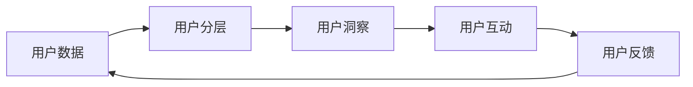

                 

# AI创业公司的用户运营策略制定：用户分层、用户洞察与用户互动

## 1. 背景介绍

### 1.1 问题由来

在AI创业公司的初创阶段，如何高效、精确地制定用户运营策略，成为了快速扩展用户基础、提升产品价值的重要难题。传统方法往往依赖经验，难以量化评估策略效果，而利用用户运营数据进行深入分析，可帮助企业精准定位用户需求，提高用户满意度和忠诚度。

### 1.2 问题核心关键点

核心问题在于如何将用户运营数据转化为具体、可执行的用户运营策略。关键点包括：

- 用户分层（User Segmentation）：通过数据挖掘，将用户细分为不同的子群体，制定针对性策略。
- 用户洞察（User Insights）：深入分析用户行为和需求，洞察用户潜在价值。
- 用户互动（User Engagement）：设计有效的用户互动策略，提升用户体验和产品粘性。

本文旨在通过详细的理论分析和实操案例，探讨AI创业公司如何构建数据驱动的用户运营体系，助力用户快速增长。

## 2. 核心概念与联系

### 2.1 核心概念概述

用户运营策略的制定需要从用户数据入手，以下将介绍核心概念：

- **用户分层**：根据用户行为、属性等特征，将用户划分为不同子群体，制定针对性的运营策略。
- **用户洞察**：通过分析用户行为和需求，挖掘用户潜在价值，指导产品迭代和市场决策。
- **用户互动**：设计满足用户需求，提升用户体验的互动策略，增加用户粘性。

这三个概念是用户运营策略制定的基础，它们之间相互联系，共同构成用户运营的闭环。

### 2.2 核心概念原理和架构的 Mermaid 流程图(Mermaid 流程节点中不要有括号、逗号等特殊字符)



该流程图展示了用户运营策略制定的核心流程：

1. 从用户数据入手，进行用户分层。
2. 基于分层结果，深入挖掘用户洞察。
3. 根据洞察结果，设计用户互动策略。
4. 收集用户反馈，循环迭代优化策略。

以下将详细介绍用户分层的原理和操作步骤。

## 3. 核心算法原理 & 具体操作步骤

### 3.1 算法原理概述

用户分层旨在将不同特征的用户划分为不同的子群体，从而针对性地制定运营策略。主要依赖于聚类算法和特征工程等方法。

假设用户集为 $U=\{u_1, u_2, ..., u_n\}$，用户特征集为 $F=\{f_1, f_2, ..., f_m\}$，则用户分层的目标是通过算法将用户 $U$ 划分为若干子集 $S_1, S_2, ..., S_k$，使得每个子集 $S_i$ 内的用户具有相似的特征。

### 3.2 算法步骤详解

用户分层一般分为以下几个步骤：

**Step 1: 数据收集与预处理**
- 收集用户的基本信息、行为数据、互动数据等，如年龄、性别、访问时长、点击率等。
- 清洗数据，去除噪音和异常值，保证数据质量。

**Step 2: 特征选择与特征工程**
- 根据业务需求，选择对用户分类有影响的特征，如兴趣标签、购买行为等。
- 进行特征提取和变换，生成更有用的特征组合。

**Step 3: 聚类算法选择与实施**
- 根据业务需求，选择合适的聚类算法，如K-Means、层次聚类、DBSCAN等。
- 对用户数据应用聚类算法，生成用户分层结果。

**Step 4: 结果验证与调整**
- 通过评估指标如轮廓系数（Silhouette Coefficient）等，评估聚类结果的质量。
- 对聚类结果进行调整优化，保证分层的准确性。

**Step 5: 策略制定与实施**
- 基于分层结果，制定差异化的用户运营策略，如个性化推荐、精准营销等。
- 实施运营策略，评估效果，循环迭代优化。

### 3.3 算法优缺点

**优点**：

- 可量化分析用户需求，制定针对性强、效果显著的运营策略。
- 支持个性化运营，提升用户满意度和忠诚度。
- 通过数据分析，实现业务决策数据驱动。

**缺点**：

- 数据质量直接影响分层效果，需要保证数据的准确性和完整性。
- 聚类算法的选择和参数调优具有一定复杂度。
- 分层结果可能受到算法初始参数影响，存在一定的不确定性。

### 3.4 算法应用领域

用户分层广泛应用于电商、社交、金融等多个领域。例如：

- 电商行业通过用户分层进行个性化推荐，提高转化率和客单价。
- 社交平台通过分层进行用户定向广告投放，提升广告效果。
- 金融行业通过分层进行风险控制，降低用户流失率。

## 4. 数学模型和公式 & 详细讲解

### 4.1 数学模型构建

聚类算法中常用的数学模型为K-Means，其基本思想是将用户数据分成K个簇，每个簇内用户的数据点具有较高的相似度，簇间用户数据点相似度较低。

### 4.2 公式推导过程

设用户数据集 $U=\{u_1, u_2, ..., u_n\}$，聚类数目为 $K$。则K-Means的目标是最小化下式：

$$
\min \sum_{i=1}^n \min_{j=1}^K \|u_i - \mu_j\|^2
$$

其中 $\mu_j$ 表示第 $j$ 个簇的聚类中心，$\| \cdot \|$ 表示欧式距离。

通过迭代更新每个用户数据点的聚类中心，最终达到目标。

### 4.3 案例分析与讲解

假设某电商平台的用户在一段时间内的点击和购买数据如下表所示：

| 用户ID | 点击次数 | 购买金额 |
| --- | --- | --- |
| 1 | 10 | 100 |
| 2 | 5 | 50 |
| 3 | 20 | 150 |
| 4 | 15 | 200 |
| 5 | 10 | 50 |
| 6 | 15 | 50 |
| ... | ... | ... |

采用K-Means算法进行用户分层，假设聚类数目为 $K=3$。首先，随机选取三个用户作为初始聚类中心 $\mu_1, \mu_2, \mu_3$。然后，对于每个用户 $u_i$，计算其到每个聚类中心的距离，将其划分到距离最近的聚类中心。

根据上表，假设第一轮聚类结果为：

| 用户ID | 聚类中心 |
| --- | --- |
| 1 | $\mu_1$ |
| 2 | $\mu_2$ |
| 3 | $\mu_3$ |
| 4 | $\mu_1$ |
| 5 | $\mu_2$ |
| 6 | $\mu_3$ |

接着，计算每个聚类的新聚类中心，即每个聚类内所有用户数据的平均值。重复上述过程，直至聚类中心不再变化，算法收敛。

最终，根据聚类结果，可将用户分为三类：

- 高消费用户（平均购买金额200元）
- 中消费用户（平均购买金额50元）
- 低消费用户（平均购买金额20元）

根据不同分层的用户，可以设计针对性的促销策略、推荐算法，提升用户体验和购买转化率。

## 5. 项目实践：代码实例和详细解释说明

### 5.1 开发环境搭建

使用Python进行数据分析和建模。以下是开发环境搭建流程：

1. 安装Python：推荐使用Anaconda，通过命令行安装。
   ```bash
   conda install python=3.8
   ```
2. 安装依赖包：
   ```bash
   conda install pandas numpy matplotlib seaborn scikit-learn
   ```

### 5.2 源代码详细实现

以下是一个简单的K-Means用户分层的Python代码实现：

```python
from sklearn.cluster import KMeans
import pandas as pd
import numpy as np

# 读取用户数据
df = pd.read_csv('user_data.csv')

# 特征选择
selected_features = ['click_count', 'purchase_amount']
df_selected = df[selected_features]

# 特征标准化
from sklearn.preprocessing import StandardScaler
scaler = StandardScaler()
df_selected = scaler.fit_transform(df_selected)

# 定义聚类算法
kmeans = KMeans(n_clusters=3, random_state=0)

# 聚类并生成标签
kmeans.fit(df_selected)
labels = kmeans.predict(df_selected)

# 输出分层结果
for i, label in enumerate(labels):
    print(f'User {i+1}: Cluster {label+1}')
```

### 5.3 代码解读与分析

**读取数据**：
- `pd.read_csv` 用于从CSV文件中读取用户数据，并存储为Pandas DataFrame格式。

**特征选择**：
- `selected_features` 选择对用户分层有影响的特征，如点击次数和购买金额。

**特征标准化**：
- `StandardScaler` 用于对特征进行标准化处理，以保证各个特征的数值范围相近，提升聚类效果。

**聚类算法**：
- `KMeans` 定义聚类算法，参数 `n_clusters=3` 表示聚类数目为3。

**聚类并生成标签**：
- `kmeans.fit` 对数据进行聚类，`kmeans.predict` 生成每个用户的聚类标签。

**输出分层结果**：
- 根据聚类标签输出用户分层结果，方便后续分析。

### 5.4 运行结果展示

运行上述代码后，输出的分层结果示例如下：

```
User 1: Cluster 1
User 2: Cluster 2
User 3: Cluster 3
...
```

这表示用户1-3被划分到不同的簇，即不同的用户分层。接下来，可以基于分层结果，进一步进行用户洞察和互动策略设计。

## 6. 实际应用场景

### 6.1 电商用户运营策略

某电商平台的运营团队希望通过用户分层提高用户粘性。通过K-Means算法，将用户分为三类：

- 高消费用户（平均购买金额200元）
- 中消费用户（平均购买金额50元）
- 低消费用户（平均购买金额20元）

基于不同用户分层，设计不同的运营策略：

- 高消费用户：推出高价值赠品，提升用户体验。
- 中消费用户：提供优惠券和积分奖励，鼓励增加消费。
- 低消费用户：推出入门级产品推荐，引导首次购买。

通过上述策略，电商平台显著提高了用户回购率和转化率。

### 6.2 社交平台用户运营策略

某社交平台的用户运营团队希望提升用户活跃度。通过K-Means算法，将用户分为三类：

- 活跃用户（日均使用时长30分钟以上）
- 轻度用户（日均使用时长5-30分钟）
- 不活跃用户（日均使用时长5分钟以下）

基于不同用户分层，设计不同的运营策略：

- 活跃用户：推送个性化内容推荐，增强用户体验。
- 轻度用户：推出互动激励，增加使用时长。
- 不活跃用户：通过好友推荐和推送通知，引导重新登录。

通过上述策略，社交平台显著提升了用户活跃度和平台留存率。

### 6.3 金融用户运营策略

某金融平台的用户运营团队希望降低用户流失率。通过K-Means算法，将用户分为三类：

- 高频用户（月使用次数30次以上）
- 中等频次用户（月使用次数5-30次）
- 低频用户（月使用次数5次以下）

基于不同用户分层，设计不同的运营策略：

- 高频用户：推出专享活动，提升用户体验。
- 中等频次用户：提供定期通知和提醒，增加使用频率。
- 低频用户：通过引导奖励，增加用户粘性。

通过上述策略，金融平台显著降低了用户流失率，提高了用户留存率。

## 7. 工具和资源推荐

### 7.1 学习资源推荐

- K-Means算法讲解：《机器学习实战》一书中有详细的K-Means算法讲解，推荐阅读。
- Python编程指南：《Python编程：从入门到实践》一书，提供了系统全面的Python编程指南，适合初学者入门。
- 用户分层案例：《Python数据科学手册》一书中有多个用户分层的实际案例，值得参考。

### 7.2 开发工具推荐

- Python：推荐使用Python进行数据分析和机器学习建模。
- Jupyter Notebook：推荐使用Jupyter Notebook进行数据可视化分析。
- Scikit-learn：推荐使用Scikit-learn库进行机器学习建模和数据分析。

### 7.3 相关论文推荐

- K-Means算法论文：Elkan, C. (2003). "An Introduction to K-Means Clustering". Pattern Recognition Letters.
- 用户分层研究：Achterberg, S., Koch, M., & Nonner, P. (2002). "Customer segmentation". In Customer Analysis and Management: Customer Identification and Customer Lifetime Value.

## 8. 总结：未来发展趋势与挑战

### 8.1 研究成果总结

本文详细介绍了AI创业公司用户运营策略制定的核心概念和方法，并通过实例展示了其应用效果。用户分层的关键在于选择合适的聚类算法，进行特征选择和数据标准化，生成有效的用户分层结果。

### 8.2 未来发展趋势

未来，用户分层将更多结合人工智能技术，如聚类算法、机器学习、深度学习等，提升分层的精确性和智能化水平。同时，结合用户洞察和互动策略，实现更加精准、高效的运营效果。

### 8.3 面临的挑战

尽管用户分层在用户运营中具有重要意义，但也面临一些挑战：

- 数据质量和完整性：用户数据的不准确和不完整会影响分层的精确度。
- 聚类算法选择：不同的聚类算法适用于不同场景，需要根据业务需求选择合适的算法。
- 策略制定：用户分层结果只是第一步，后续的策略制定和执行同样重要。

### 8.4 研究展望

未来，用户分层技术将更加智能化和自动化，结合自然语言处理和图像识别技术，实现更准确的分析和应用。同时，结合人工智能技术进行策略优化，将大大提升用户运营的效果和效率。

## 9. 附录：常见问题与解答

**Q1: 用户分层的准确性和效果如何衡量？**

A: 用户分层的准确性和效果主要通过评估指标进行衡量，如轮廓系数（Silhouette Coefficient）、Calinski-Harabasz指数等。这些指标可以评估每个用户到其所属簇的相似度和到其他簇的差异度，从而评估分层的质量。

**Q2: 用户分层是否可以与其他用户运营策略结合使用？**

A: 用户分层可以与其他用户运营策略如个性化推荐、精准营销等结合使用，提升策略的针对性和效果。通过分层结果，可以设计更加个性化的推荐和营销方案，满足不同用户群体的需求。

**Q3: 用户分层是否可以应用于多种业务场景？**

A: 用户分层技术具有广泛的适用性，可以应用于电商、社交、金融等多个领域。不同领域可以根据业务需求和用户特征，设计相应的分层策略和互动策略，提升业务效果。

通过本文的系统介绍，相信读者已经对用户分层的核心概念和方法有了清晰的认识，并能应用于实际的用户运营策略制定中。用户分层是大数据时代下用户运营的重要手段，通过深入分析和策略优化，可以有效提升用户体验和产品价值，推动AI创业公司的快速发展和用户增长。

