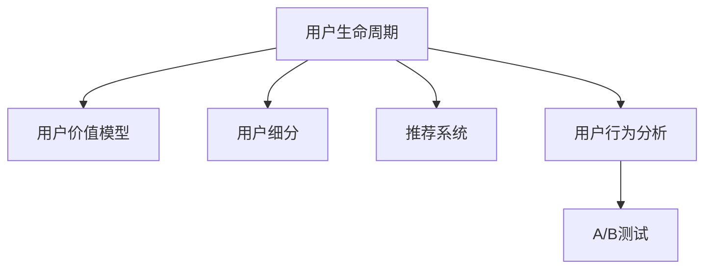

                 

# AI创业公司的用户运营策略：新用户运营、活跃用户运营与流失用户运营

## 1. 背景介绍

### 1.1 问题由来

AI创业公司面临的最大挑战之一是如何有效地运营用户。随着技术的快速发展，越来越多的AI应用涌现，用户获取成本也逐渐升高。如何吸引新用户，保留活跃用户，以及挽回流失用户，成为每个AI创业公司都必须面对的重要问题。

### 1.2 问题核心关键点

用户运营的核心在于如何构建一个持续增长的用户群体，确保用户在平台上的长期价值。具体包括以下几个方面：

- **新用户获取**：吸引潜在用户，扩大市场份额。
- **活跃用户运营**：提升用户粘性，增加平台使用频次。
- **流失用户挽回**：找回已经流失的用户，降低用户流失率。

### 1.3 问题研究意义

研究AI创业公司的用户运营策略，对于提升用户规模、增强用户体验、提高用户生命周期价值（LTV）、优化用户留存率等方面具有重要意义。具体体现在以下几个方面：

- **市场拓展**：通过有效的用户运营策略，吸引更多用户，拓展市场空间。
- **用户粘性**：通过持续互动和优化，提升用户对平台的依赖度，增加使用频率。
- **商业转化**：通过精准的用户运营，提高用户的付费转化率，增加公司收入。
- **品牌价值**：用户运营能够提升平台品牌知名度，增强用户信任感。

## 2. 核心概念与联系

### 2.1 核心概念概述

为了更好地理解AI创业公司用户运营策略的逻辑，本节将介绍几个密切相关的核心概念：

- **用户生命周期**：指一个用户在平台上的生命过程，从首次注册到最终流失的各个阶段。
- **用户价值模型**：基于用户行为和数据，评估用户对平台的价值，如LTV（生命周期总价值）、CAC（用户获取成本）等。
- **用户细分**：根据用户的行为、属性等特征，将用户划分为不同的群体，以便实施差异化的运营策略。
- **推荐系统**：基于用户行为数据，推荐用户感兴趣的内容，提升用户体验和留存率。
- **用户行为分析**：通过数据分析，理解用户行为模式，优化产品和运营策略。
- **A/B测试**：通过对比不同策略的效果，评估并优化运营方案。

这些核心概念之间的逻辑关系可以通过以下Mermaid流程图来展示：



这个流程图展示了一些核心概念及其之间的关系：

1. 用户生命周期是所有运营策略的基础，贯穿用户从获取到流失的整个过程。
2. 用户价值模型是评估用户对平台价值的重要工具，用于指导用户运营决策。
3. 用户细分帮助针对不同用户群体实施差异化运营，提高运营效率。
4. 推荐系统通过个性化推荐，提升用户体验，增加用户粘性。
5. 用户行为分析帮助理解用户行为模式，优化产品和运营策略。
6. A/B测试用于评估不同策略的效果，验证并优化运营方案。

## 3. 核心算法原理 & 具体操作步骤

### 3.1 算法原理概述

AI创业公司的用户运营策略主要包括以下几个核心算法原理：

- **新用户获取**：基于用户行为数据和市场调研，设计有吸引力的推广活动，吸引潜在用户注册和使用。
- **活跃用户运营**：通过推荐系统和个性化内容推送，提升用户体验和满意度，增加用户粘性。
- **流失用户挽回**：通过用户行为分析，识别流失用户特征，设计针对性的挽留策略。

### 3.2 算法步骤详解

#### 3.2.1 新用户获取

1. **用户行为分析**：通过分析用户行为数据，了解潜在用户的需求和兴趣，设计有针对性的推广活动。
2. **多渠道推广**：在官网、社交媒体、搜索引擎等渠道，投放有吸引力的广告，引导用户访问平台。
3. **优惠券和激励措施**：提供新用户专属优惠，激励用户注册和使用。
4. **用户体验优化**：简化注册流程，优化用户界面，提升首次体验。

#### 3.2.2 活跃用户运营

1. **用户价值模型**：评估用户对平台的价值，识别高价值用户，制定差异化运营策略。
2. **个性化推荐**：基于用户行为数据，推荐感兴趣的内容，提升用户体验。
3. **内容互动**：通过评论、点赞、分享等互动机制，增加用户粘性。
4. **活动和内容更新**：定期推出新活动和内容，保持用户新鲜感。

#### 3.2.3 流失用户挽回

1. **用户行为分析**：通过数据分析，识别流失用户特征和原因。
2. **个性化挽留策略**：针对流失用户，提供个性化挽留方案，如专属优惠、个性化推荐等。
3. **情感沟通**：通过情感沟通，了解用户流失原因，提升用户满意度。
4. **流失用户反馈**：收集流失用户反馈，优化产品和服务。

### 3.3 算法优缺点

**优点**：

- **灵活性高**：基于用户数据，灵活调整运营策略，适应不同市场和用户群体。
- **高效性**：通过数据分析和优化，提高运营效率，降低成本。
- **用户粘性强**：通过个性化推荐和互动，增加用户粘性，提高留存率。

**缺点**：

- **数据依赖**：运营策略高度依赖用户行为数据，数据质量直接影响策略效果。
- **策略调整复杂**：需要持续监控和调整策略，保持策略的有效性。
- **资源消耗大**：个性化推荐和互动需要大量的计算资源，可能增加运营成本。

### 3.4 算法应用领域

AI创业公司的用户运营策略可以应用于以下多个领域：

- **电商推荐**：通过个性化推荐，提升用户购物体验和留存率。
- **社交网络**：通过内容推荐和互动，增加用户粘性，提高用户活跃度。
- **在线教育**：通过个性化学习推荐，提升用户体验，提高学习效率。
- **健康管理**：通过个性化健康建议和互动，提升用户粘性，提高用户满意度。
- **金融服务**：通过个性化金融推荐，提升用户金融服务体验，增加用户粘性。

## 4. 数学模型和公式 & 详细讲解 & 举例说明

### 4.1 数学模型构建

为了更好地理解和量化用户运营策略，本节将使用数学模型来描述相关指标和计算公式。

设用户总数为 $U$，新用户数为 $N$，活跃用户数为 $A$，流失用户数为 $L$，每个用户生命周期总价值为 $LTV$，用户获取成本为 $CAC$。

#### 4.1.1 用户生命周期模型

用户生命周期模型用于描述用户从注册到流失的整个过程，可以表示为：

$$
\text{User Lifecycle} = \text{Registration} \rightarrow \text{Active} \rightarrow \text{Churn}
$$

其中，注册（Registration）表示新用户注册，活跃（Active）表示用户持续使用，流失（Churn）表示用户离开平台。

#### 4.1.2 用户价值模型

用户价值模型用于评估用户对平台的价值，可以表示为：

$$
LTV = \sum_{t=1}^{T} u_t
$$

其中，$u_t$ 表示第 $t$ 天的用户价值，$T$ 表示用户生命周期天数。

用户价值模型可以帮助公司评估不同用户群体的价值，指导差异化运营策略的制定。

#### 4.1.3 用户细分模型

用户细分模型用于将用户按照不同特征进行分组，可以表示为：

$$
\text{User Segmentation} = \{User Group_i\}_{i=1}^{N}
$$

其中，$User Group_i$ 表示第 $i$ 个用户群体，$N$ 表示用户群体的数量。

用户细分模型可以帮助公司识别不同用户群体的特征，制定更加精准的运营策略。

#### 4.1.4 个性化推荐模型

个性化推荐模型用于为用户推荐感兴趣的内容，可以表示为：

$$
\text{Personalized Recommendation} = f(X_u, Y_v)
$$

其中，$X_u$ 表示用户特征向量，$Y_v$ 表示内容特征向量，$f$ 表示推荐函数。

个性化推荐模型可以通过用户行为数据，生成个性化的内容推荐，提升用户体验。

### 4.2 公式推导过程

#### 4.2.1 用户生命周期模型推导

用户生命周期模型可以表示为：

$$
\text{User Lifecycle} = \text{Registration} \rightarrow \text{Active} \rightarrow \text{Churn}
$$

其中，注册（Registration）表示新用户注册，活跃（Active）表示用户持续使用，流失（Churn）表示用户离开平台。

#### 4.2.2 用户价值模型推导

用户价值模型可以表示为：

$$
LTV = \sum_{t=1}^{T} u_t
$$

其中，$u_t$ 表示第 $t$ 天的用户价值，$T$ 表示用户生命周期天数。

用户价值模型可以通过以下公式计算：

$$
u_t = \alpha \cdot \text{Conversion Rate}_t \cdot \text{Revenue}_t
$$

其中，$\alpha$ 表示转换率和收入的调整系数，$\text{Conversion Rate}_t$ 表示第 $t$ 天的用户转化率，$\text{Revenue}_t$ 表示第 $t$ 天的用户收入。

#### 4.2.3 用户细分模型推导

用户细分模型可以表示为：

$$
\text{User Segmentation} = \{User Group_i\}_{i=1}^{N}
$$

其中，$User Group_i$ 表示第 $i$ 个用户群体，$N$ 表示用户群体的数量。

用户细分模型可以通过以下步骤实现：

1. 收集用户行为数据。
2. 选择合适的特征维度，如年龄、性别、地域、消费行为等。
3. 使用聚类算法或分类算法，将用户分成不同的群体。

### 4.3 案例分析与讲解

**案例1：电商推荐系统的用户运营策略**

某电商公司通过分析用户行为数据，发现用户在购物前和购物后的行为特征有显著差异。因此，公司设计了以下用户运营策略：

1. 在用户浏览商品时，通过推荐系统推荐相似商品，增加用户购买决策的可选性。
2. 在用户下单后，通过个性化推荐系统推荐关联商品，增加购买机会。
3. 在用户收到商品后，通过情感分析，发送满意度调查，收集用户反馈，优化产品和服务。

**案例2：社交网络的用户运营策略**

某社交网络公司通过分析用户行为数据，发现用户活跃度和社交互动深度呈正相关关系。因此，公司设计了以下用户运营策略：

1. 在用户注册后，通过推荐系统推荐朋友，增加用户社交互动。
2. 定期推出社交活动，如话题讨论、直播互动等，增加用户活跃度。
3. 通过个性化推荐系统，为用户推荐感兴趣的内容，提升用户体验。

## 5. 项目实践：代码实例和详细解释说明

### 5.1 开发环境搭建

在进行用户运营策略的实践前，我们需要准备好开发环境。以下是使用Python进行项目开发的环境配置流程：

1. 安装Anaconda：从官网下载并安装Anaconda，用于创建独立的Python环境。

2. 创建并激活虚拟环境：
```bash
conda create -n user-op-env python=3.8 
conda activate user-op-env
```

3. 安装Python和相关库：
```bash
pip install pandas numpy scikit-learn seaborn matplotlib sklearn-datavisualization
```

4. 配置数据源和存储：
```bash
```

5. 启动Jupyter Notebook：
```bash
jupyter notebook
```

### 5.2 源代码详细实现

下面以用户价值模型（LTV）的计算为例，给出具体的代码实现。

```python
import pandas as pd
import numpy as np
import matplotlib.pyplot as plt

# 读取数据
data = pd.read_csv('user_data.csv')

# 计算用户生命周期总价值
user_id = data['user_id']
days = data['days']
revenue = data['revenue']
lifetime_value = revenue * days

# 绘制用户价值分布图
plt.hist(lifetime_value, bins=50)
plt.xlabel('Lifetime Value')
plt.ylabel('Frequency')
plt.title('User Lifetime Value Distribution')
plt.show()
```

### 5.3 代码解读与分析

以上代码展示了如何通过Pandas库读取用户数据，并计算每个用户的生命周期总价值（LTV）。具体步骤如下：

1. 读取用户数据，保存为Pandas DataFrame。
2. 计算每个用户的LTV，即其生命周期内的总收入。
3. 使用Matplotlib绘制LTV分布图，可视化用户价值分布情况。

## 6. 实际应用场景

### 6.1 智能客服系统

智能客服系统通过用户运营策略，实现了24小时不间断服务，显著提高了用户满意度。系统能够实时监测用户情绪，自动提供解决方案，减轻人工客服压力。同时，通过用户行为分析，系统可以识别高频问题，优化知识库，提升服务效率。

### 6.2 在线教育平台

在线教育平台通过个性化推荐系统，提升用户体验和学习效果。平台通过分析用户学习行为，为用户推荐适合的课程和资料，增加用户粘性。同时，通过情感分析，了解用户学习反馈，优化课程设计和内容更新。

### 6.3 健康管理应用

健康管理应用通过个性化健康建议，提升用户粘性和满意度。应用通过分析用户健康数据，生成个性化的健康建议，增加用户对平台的依赖度。同时，通过用户行为分析，了解用户健康需求，优化产品和服务。

## 7. 工具和资源推荐

### 7.1 学习资源推荐

为了帮助开发者系统掌握用户运营策略的理论基础和实践技巧，这里推荐一些优质的学习资源：

1. **《用户行为分析与运营优化》**：一本详细介绍用户行为分析、用户细分、个性化推荐等核心技术的书籍。
2. **《用户体验设计基础》**：一本介绍用户体验设计的经典书籍，帮助开发者设计更好的产品界面。
3. **《A/B测试实践指南》**：一本介绍A/B测试的书籍，帮助开发者评估和优化运营策略。
4. **Coursera《用户行为分析》课程**：斯坦福大学开设的课程，深入讲解用户行为分析的核心技术和方法。
5. **Kaggle《用户行为数据分析》竞赛**：通过实际数据集练习用户行为分析，提升实战能力。

### 7.2 开发工具推荐

高效的开发离不开优秀的工具支持。以下是几款用于用户运营策略开发的常用工具：

1. **Pandas**：Python数据分析库，支持高效的数据处理和分析。
2. **Matplotlib**：Python绘图库，支持绘制各种类型的图表。
3. **Jupyter Notebook**：交互式编程环境，支持代码调试和可视化。
4. **Hive**：分布式数据仓库，支持大数据量数据处理。
5. **Hadoop**：分布式计算框架，支持海量数据存储和计算。
6. **Kafka**：分布式消息队列，支持实时数据流处理。

合理利用这些工具，可以显著提升用户运营策略的开发效率，加快创新迭代的步伐。

### 7.3 相关论文推荐

用户运营策略的研究源于学界的持续研究。以下是几篇奠基性的相关论文，推荐阅读：

1. **《用户行为分析与个性化推荐》**：介绍了用户行为分析和个性化推荐的核心技术和方法。
2. **《用户细分与运营优化》**：介绍了用户分段的理论基础和实际应用。
3. **《A/B测试的理论与实践》**：介绍了A/B测试的理论基础和实际应用，帮助开发者评估和优化运营策略。
4. **《用户体验设计原则》**：介绍了用户体验设计的核心原则和最佳实践。

这些论文代表了大规模用户运营策略的研究进展，帮助研究者把握学科前进方向，激发更多的创新灵感。

## 8. 总结：未来发展趋势与挑战

### 8.1 研究成果总结

本节对用户运营策略的研究进行了系统总结。主要包括以下几个方面：

1. **新用户获取**：通过用户行为分析和市场调研，设计有吸引力的推广活动，吸引潜在用户注册和使用。
2. **活跃用户运营**：通过推荐系统和个性化内容推送，提升用户体验和满意度，增加用户粘性。
3. **流失用户挽回**：通过用户行为分析，识别流失用户特征，设计针对性的挽留策略。

这些策略已经在大规模AI创业公司的运营实践中得到了广泛应用，取得了显著的效果。

### 8.2 未来发展趋势

展望未来，用户运营策略将呈现以下几个发展趋势：

1. **数据驱动**：用户运营策略将更加依赖用户数据，通过数据分析和机器学习，实现更加精准的运营决策。
2. **个性化**：个性化推荐和互动将成为用户运营的核心，提升用户粘性和满意度。
3. **智能决策**：通过人工智能技术，实现自动化运营决策，提高运营效率。
4. **多渠道运营**：通过多渠道推广和互动，提升用户获取和留存率。
5. **实时分析**：通过实时数据分析，快速响应用户需求，提升用户满意度。

### 8.3 面临的挑战

尽管用户运营策略已经取得了显著进展，但在迈向更加智能化、普适化应用的过程中，仍面临诸多挑战：

1. **数据质量**：用户运营策略高度依赖用户数据，数据质量直接影响策略效果。
2. **策略调整复杂**：需要持续监控和调整策略，保持策略的有效性。
3. **资源消耗大**：个性化推荐和互动需要大量的计算资源，可能增加运营成本。
4. **隐私保护**：用户运营策略需要处理大量敏感数据，隐私保护成为重要挑战。
5. **用户信任**：用户运营策略需要建立用户信任，防止滥用用户数据。

### 8.4 研究展望

未来的研究需要在以下几个方面寻求新的突破：

1. **数据治理**：建立数据治理框架，确保数据质量和安全。
2. **智能算法**：开发更加智能化的算法，实现自动化运营决策。
3. **隐私保护**：加强隐私保护技术，防止用户数据滥用。
4. **用户体验**：提升用户体验设计，增强用户粘性。
5. **跨领域应用**：将用户运营策略应用于更多领域，提升行业应用水平。

## 9. 附录：常见问题与解答

**Q1：用户运营策略是否适用于所有AI应用？**

A: 用户运营策略适用于大多数AI应用，特别是在需要用户交互和持续使用的场景中。例如电商、在线教育、社交网络等。但对于不需要用户交互的AI应用，如自动驾驶、智能家居等，用户运营策略可能不适用。

**Q2：如何衡量用户运营策略的效果？**

A: 用户运营策略的效果可以通过以下指标衡量：

1. **用户获取成本（CAC）**：用户获取成本越低，策略效果越好。
2. **用户生命周期总价值（LTV）**：用户生命周期总价值越高，策略效果越好。
3. **用户留存率**：用户留存率越高，策略效果越好。
4. **用户活跃度**：用户活跃度越高，策略效果越好。
5. **用户满意度**：用户满意度越高，策略效果越好。

**Q3：用户运营策略需要多少数据？**

A: 用户运营策略需要根据具体场景和目标，收集相应的数据。通常情况下，收集的用户数据越多，策略效果越好。但在数据不足的情况下，可以通过用户行为分析和A/B测试等方法，最小化数据需求，提升策略效果。

**Q4：用户运营策略是否需要人工干预？**

A: 用户运营策略通常需要人工干预和调整，以适应市场和用户需求的变化。例如，通过A/B测试评估策略效果，及时调整运营策略。同时，定期进行用户行为分析，优化产品和服务。

**Q5：用户运营策略是否需要持续迭代？**

A: 用户运营策略需要持续迭代和优化，以适应市场和用户需求的变化。例如，通过用户行为分析和A/B测试，不断调整和优化策略。同时，定期进行用户满意度调查，了解用户需求，提升用户体验。

---

作者：禅与计算机程序设计艺术 / Zen and the Art of Computer Programming

