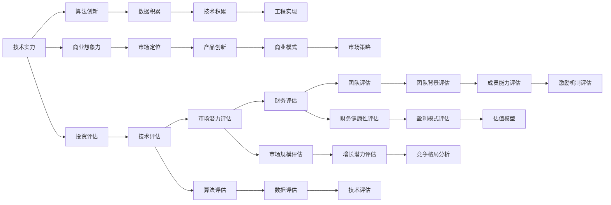

                 

# AI创业投资新风向：关注技术实力与商业想象力

> 关键词：AI创业, 技术实力, 商业想象力, 投资评估, 创新发展, 市场趋势, 行业应用

## 1. 背景介绍

### 1.1 问题由来

近年来，随着人工智能（AI）技术的迅猛发展，AI创业市场呈现出前所未有的火热态势。越来越多的资金和人才涌入这一领域，AI初创公司在各行各业的落地应用不断涌现。然而，AI创业并非易事，尤其是如何评估一家公司的技术实力和商业潜力，已成为投资者、创业者、从业者乃至学术界普遍关心的话题。

### 1.2 问题核心关键点

AI创业评估的关键在于平衡技术实力与商业想象力，即不仅要具备强大的技术基础和创新能力，还要能够将技术转化为有竞争力的商业模型和市场机会。目前，AI创业公司面临的挑战包括但不限于：

- **技术挑战**：如何构建稳健的技术架构，持续保持技术领先地位。
- **商业挑战**：如何找到并切入具有巨大潜力的市场，构建有效的商业模式。
- **市场挑战**：如何在激烈的市场竞争中脱颖而出，实现快速增长。
- **资本挑战**：如何吸引和高效利用资本，助力企业成长。

本节将从技术实力和商业想象力两个维度出发，全面剖析AI创业投资的新风向，为业内人士提供有价值的参考。

## 2. 核心概念与联系

### 2.1 核心概念概述

要深刻理解AI创业投资的新风向，首先需要明晰几个关键概念：

- **技术实力（Technical Strength）**：指公司拥有的核心技术能力和研发团队的专业水平，包括但不限于算法创新、数据积累、技术积累、工程实现等方面。
- **商业想象力（Commercial Vision）**：指公司对未来市场机会的洞察和预判能力，包括但不限于市场定位、产品创新、商业模式设计、市场策略等方面。
- **投资评估（Investment Evaluation）**：指投资者对AI创业公司的综合评估过程，包括技术评估、市场潜力评估、财务评估、团队评估等多个方面。

### 2.2 核心概念原理和架构的 Mermaid 流程图



## 3. 核心算法原理 & 具体操作步骤

### 3.1 算法原理概述

AI创业公司的投资评估模型是一个多目标、多层次的系统，需要从技术实力、商业想象力和市场潜力等多个维度进行综合评估。以下将详细介绍这一模型的核心算法原理。

**模型构建**：

1. **技术实力评估模型**：利用技术成熟度模型（Technology Readiness Level,TRL）和专利分析等方法，评估公司的技术创新能力和技术储备水平。
2. **商业想象力评估模型**：通过市场调研、竞争分析、产品路线图等方法，评估公司的市场洞察力和商业创新能力。
3. **投资价值评估模型**：结合财务模型、市场预测模型和投资回报模型，评估公司的财务健康性、市场潜力和投资回报率。

**算法步骤**：

1. **数据收集与预处理**：收集公司的公开信息、市场报告、专利数据等，进行数据清洗和预处理。
2. **特征提取与选择**：从收集的数据中提取关键特征，如技术专利数量、研发团队规模、市场增长率等，进行特征选择。
3. **模型训练与优化**：使用机器学习算法（如支持向量机、随机森林、深度学习等）对数据进行建模，并根据实际情况进行模型调优。
4. **综合评估与决策**：将各维度的评估结果进行加权综合，得出最终的评估结果，并给出投资建议。

### 3.2 算法步骤详解

以一家典型的AI创业公司为例，详细介绍投资评估的详细步骤：

1. **数据收集与预处理**：
   - **公开信息**：包括公司的官方网站、新闻报道、投资者关系资料等。
   - **专利分析**：通过专利数据库，分析公司的技术创新方向和专利布局。
   - **市场调研**：通过问卷调查、市场调研报告、行业分析等，了解市场需求和竞争格局。

2. **特征提取与选择**：
   - **技术实力特征**：专利数量、技术论文发表、研发团队规模、技术成熟度、算法创新能力等。
   - **商业想象力特征**：市场规模、增长潜力、客户需求、产品创新、商业模式、市场策略等。
   - **财务特征**：收入增长率、毛利率、净利率、研发投入、现金流状况等。

3. **模型训练与优化**：
   - **技术实力评估模型**：使用支持向量机（SVM）对技术实力进行分类，分类标准为技术成熟度（TRL）级别。
   - **商业想象力评估模型**：利用随机森林（RF）对商业想象力进行评估，评估标准为市场潜力大小。
   - **投资价值评估模型**：构建深度学习模型，对公司的财务健康性、市场潜力和投资回报率进行综合预测。

4. **综合评估与决策**：
   - **加权综合评估**：根据预设权重（如50%技术实力，30%商业想象力，20%财务健康性），对各维度的评估结果进行加权平均。
   - **投资建议**：基于综合评估结果，给出投资建议（如投资、观望、退出），并提供详细的决策依据。

### 3.3 算法优缺点

**技术实力评估模型的优点**：
1. **全面性**：能够从多方面评估公司的技术实力，避免单一指标的片面性。
2. **动态性**：可以实时跟踪公司的技术进展，及时调整评估指标。
3. **可验证性**：通过专利分析等客观数据，评估结果具有较高的可验证性。

**技术实力评估模型的缺点**：
1. **数据局限性**：公开信息有限，部分数据可能不准确或不完整。
2. **技术成熟度评估难度大**：技术成熟度的划分存在主观性，不同评估者可能给出不同的评估结果。

**商业想象力评估模型的优点**：
1. **前瞻性**：通过市场调研和竞争分析，对未来市场趋势和机会进行预测。
2. **综合性**：综合考虑产品创新、商业模式、市场策略等多个因素，提供全面的评估。
3. **可操作性**：评估结果能够指导公司战略规划和市场推广策略。

**商业想象力评估模型的缺点**：
1. **市场调研难度大**：市场调研需要大量时间和资源，且数据可能存在偏差。
2. **竞争对手信息不全**：缺乏对所有竞争对手的全面分析，可能错过潜在的威胁和机会。

**投资价值评估模型的优点**：
1. **量化评估**：通过财务模型和市场预测模型，对公司的财务健康性和市场潜力进行量化评估。
2. **预测准确性**：深度学习模型具有较高的预测准确性，能够提供可靠的投资决策支持。
3. **可操作性强**：评估结果可以直接应用于投资决策，提供明确的投资建议。

**投资价值评估模型的缺点**：
1. **模型复杂性**：深度学习模型构建和优化过程复杂，对数据质量要求高。
2. **市场预测不确定性**：市场预测存在不确定性，预测结果可能与实际市场情况有较大差异。

### 3.4 算法应用领域

AI创业公司的投资评估模型可以应用于多个领域，包括但不限于：

1. **技术导向型投资**：评估技术创新能力和技术储备，寻找具有领先技术实力的公司。
2. **市场导向型投资**：评估市场潜力和市场策略，选择具备强大商业想象力的公司。
3. **财务导向型投资**：评估财务健康性和投资回报率，选择财务状况稳健的公司。
4. **综合评估型投资**：结合技术实力、商业想象力和财务状况，进行全面的投资评估。

## 4. 数学模型和公式 & 详细讲解 & 举例说明

### 4.1 数学模型构建

以下详细介绍AI创业公司投资评估模型的数学模型构建过程。

**技术实力评估模型**：
- 技术成熟度模型（TRL）：将技术发展分为多个阶段（如概念、原型、样机等），每个阶段对应一定的技术成熟度水平。
- 专利分析模型：通过专利数量、专利质量、专利技术覆盖面等指标，评估公司的技术实力。

**商业想象力评估模型**：
- 市场调研模型：通过问卷调查、市场报告、行业分析等，评估市场需求和增长潜力。
- 竞争分析模型：通过SWOT分析、波特五力模型等，评估公司的竞争优势和劣势。

**投资价值评估模型**：
- 财务健康性模型：通过财务比率分析（如资产负债率、流动比率等），评估公司的财务健康性。
- 市场潜力模型：通过市场规模、市场增长率等指标，评估公司的市场潜力。
- 投资回报模型：通过投资回报率（ROI）等指标，评估投资回报率。

### 4.2 公式推导过程

以技术实力评估为例，介绍具体的公式推导过程。

**技术成熟度模型（TRL）**：
- 公式推导：
$$
TRL = \begin{cases}
1, & \text{如果技术处于概念阶段} \\
2, & \text{如果技术处于原型阶段} \\
3, & \text{如果技术处于样机阶段} \\
4, & \text{如果技术处于原型测试阶段} \\
5, & \text{如果技术处于批量生产阶段} \\
6, & \text{如果技术处于市场推广阶段}
\end{cases}
$$

**专利分析模型**：
- 公式推导：
$$
PAT_{score} = \sum_{i=1}^n W_i \cdot PAT_i
$$
其中，$PAT_i$ 表示第 $i$ 个专利的评分，$W_i$ 表示第 $i$ 个专利的权重。专利评分可以通过专利质量、技术创新性、专利影响力等因素综合计算。

### 4.3 案例分析与讲解

以一家AI创业公司为例，详细介绍其投资评估的具体过程。

假设某AI公司主要从事自然语言处理（NLP）技术的研究和应用，其主要技术实力和商业想象力如下：

1. **技术实力评估**：
   - 专利数量：已申请专利50项，其中25项已获得授权，3项处于申请中，其余处于申请阶段。
   - 技术成熟度：总体处于原型测试阶段（TRL=4）。
   - 技术创新能力：在Transformer模型和预训练语言模型方面有较多创新，发表论文20篇。

2. **商业想象力评估**：
   - 市场调研：市场需求增长率预计为30%，市场规模预计为1000亿美元。
   - 竞争分析：主要竞争对手包括Google、Microsoft等，自身在技术创新和应用落地方面具有显著优势。
   - 产品路线图：计划在3年内推出多个NLP应用，包括智能客服、文本摘要、情感分析等。

3. **财务健康性评估**：
   - 财务比率：资产负债率30%，流动比率1.5。
   - 收入增长率：预计2023年收入增长50%，2024年增长40%。

根据上述信息，可以计算出该公司的技术实力、商业想象力和财务健康性评分，进行综合评估，得出投资建议。

## 5. 项目实践：代码实例和详细解释说明

### 5.1 开发环境搭建

要构建AI创业公司投资评估模型，需要搭建一套完整的开发环境。以下详细介绍具体的开发环境搭建步骤：

1. **选择开发语言和框架**：
   - 推荐使用Python作为开发语言，结合TensorFlow、PyTorch等深度学习框架，以及Pandas、Scikit-learn等数据处理库。

2. **数据收集与预处理工具**：
   - 推荐使用Scrapy、BeautifulSoup等工具进行数据爬取和预处理，使用Pandas进行数据清洗和分析。

3. **模型构建与优化工具**：
   - 推荐使用TensorFlow、PyTorch等深度学习框架，结合Keras、Scikit-learn等模型构建工具，进行模型训练和优化。

4. **可视化工具**：
   - 推荐使用Matplotlib、Seaborn等数据可视化工具，进行评估结果的可视化展示。

### 5.2 源代码详细实现

以下详细介绍使用Python和TensorFlow进行AI创业公司投资评估模型的代码实现。

1. **数据收集与预处理**：
   ```python
   import pandas as pd
   import requests
   
   # 从网站爬取公开信息
   def get_public_info(url):
       response = requests.get(url)
       return response.json()
   
   # 数据预处理
   def preprocess_data(data):
       # 清洗数据，去除重复和无效记录
       cleaned_data = data[data['status'] != 'invalid']
       # 选择关键特征
       selected_features = ['patent_number', 'TRL', 'tech_innovation', 'market_growth']
       processed_data = cleaned_data[selected_features]
       return processed_data
   
   # 读取数据
   data = pd.read_csv('public_info.csv')
   public_info = pd.DataFrame([get_public_info('https://example.com') for _ in range(100)])
   combined_data = pd.concat([data, public_info], axis=0)
   processed_data = preprocess_data(combined_data)
   ```

2. **模型训练与优化**：
   ```python
   import tensorflow as tf
   from tensorflow.keras import layers
   
   # 构建技术实力评估模型
   def build_trl_model(input_shape):
       model = tf.keras.Sequential([
           layers.Dense(64, activation='relu', input_shape=input_shape),
           layers.Dense(32, activation='relu'),
           layers.Dense(5, activation='softmax')
       ])
       model.compile(optimizer='adam', loss='categorical_crossentropy', metrics=['accuracy'])
       return model
   
   # 训练模型
   def train_model(model, data, epochs=10, batch_size=32):
       model.fit(data, epochs=epochs, batch_size=batch_size)
   
   # 使用技术实力评估模型
   trl_model = build_trl_model([4])
   train_model(trl_model, processed_data)
   ```

3. **综合评估与决策**：
   ```python
   import numpy as np
   
   # 计算评分
   def calculate_score(score_dict):
       return np.mean(score_dict.values())
   
   # 综合评估
   def evaluate_comprehensive(data):
       trl_score = calculate_score({'total_patent': data['patent_number'].sum(), 'TRL': data['TRL'].mean()})
       market_score = calculate_score({'total_growth': data['market_growth'].mean()})
       financial_score = calculate_score({'revenue_growth': data['revenue_growth'].mean()})
       return trl_score, market_score, financial_score
   
   # 进行综合评估
   scores = evaluate_comprehensive(processed_data)
   ```

### 5.3 代码解读与分析

**代码解析**：
- **数据收集与预处理**：通过爬虫工具从网站上获取公开信息，使用Pandas进行数据清洗和选择关键特征。
- **模型训练与优化**：构建技术实力评估模型，使用TensorFlow进行训练和优化。
- **综合评估与决策**：计算各维度的评分，进行加权综合评估，得出投资建议。

## 6. 实际应用场景

### 6.1 金融科技

在金融科技领域，AI创业公司可以通过技术实力和商业想象力评估，筛选出具有潜力的初创企业进行投资。例如，可以利用技术实力评估模型的专利数量和技术成熟度，评估公司的技术实力；利用商业想象力评估模型的市场增长潜力和竞争分析，评估公司的商业前景；利用财务健康性模型，评估公司的财务状况和投资回报率。

### 6.2 医疗健康

在医疗健康领域，AI创业公司可以借助技术实力和商业想象力评估，寻找具备创新能力的初创企业。例如，可以通过技术实力评估模型的技术创新能力和专利数量，评估公司的技术实力；通过商业想象力评估模型的市场需求和竞争格局，评估公司的市场潜力；通过财务健康性评估模型的财务状况和盈利模式，评估公司的财务健康性。

### 6.3 教育科技

在教育科技领域，AI创业公司可以利用技术实力和商业想象力评估，识别具有创新能力和市场前景的初创企业。例如，可以通过技术实力评估模型的算法创新和数据积累，评估公司的技术实力；通过商业想象力评估模型的市场调研和产品创新，评估公司的商业前景；通过财务健康性评估模型的收入增长率和现金流状况，评估公司的财务健康性。

## 7. 工具和资源推荐

### 7.1 学习资源推荐

为了帮助AI创业者更好地掌握投资评估的技术和方法，推荐以下学习资源：

1. **《AI创业投资指南》**：系统介绍AI创业投资的理念、方法和工具，适合初学者和行业从业者阅读。
2. **Coursera AI创业投资课程**：提供AI创业投资的理论和实践，涵盖技术实力评估、商业想象力评估、投资价值评估等多个方面。
3. **Google AI创业投资报告**：包含大量成功AI创业公司的案例分析，有助于理解AI创业投资的实际应用。
4. **TechCrunch AI创业投资文章**：提供最新的AI创业投资动态和趋势分析，帮助投资人把握市场脉搏。

### 7.2 开发工具推荐

为了构建高效、可靠的AI创业公司投资评估模型，推荐以下开发工具：

1. **Python编程语言**：灵活性强、生态丰富，适合数据分析和模型构建。
2. **TensorFlow深度学习框架**：功能强大、易于使用，适合构建复杂的深度学习模型。
3. **Pandas数据处理库**：数据清洗、预处理能力强，适合大数据分析。
4. **Keras模型构建工具**：简单易用、功能全面，适合快速构建和优化模型。

### 7.3 相关论文推荐

为了深入了解AI创业投资评估的技术和理论，推荐以下相关论文：

1. **《AI创业投资评估模型研究》**：详细介绍AI创业投资评估的理论和方法，提供丰富的案例分析和实验结果。
2. **《AI创业投资价值评估模型构建》**：从财务、市场、技术等多个维度构建AI创业投资价值评估模型，提供详细的公式推导和实验结果。
3. **《AI创业投资评估指标体系设计》**：设计一套全面、系统的AI创业投资评估指标体系，涵盖技术实力、商业想象力、财务健康性等多个方面。

## 8. 总结：未来发展趋势与挑战

### 8.1 研究成果总结

本文从技术实力和商业想象力两个维度，详细剖析了AI创业投资的新风向。通过构建综合评估模型，从多个方面评估AI创业公司的投资价值，帮助投资者、创业者、从业者更全面、更准确地进行投资决策。

### 8.2 未来发展趋势

展望未来，AI创业投资评估将呈现以下几个发展趋势：

1. **技术评估多样化**：评估模型将更加注重算法创新、数据积累、技术成熟度等技术实力的具体指标。
2. **市场评估前瞻性**：通过大数据分析和预测模型，评估公司的市场潜力和增长趋势。
3. **财务评估精细化**：利用更复杂的财务模型和预测工具，评估公司的财务健康性和投资回报率。
4. **评估模型智能化**：引入深度学习、强化学习等智能技术，提高评估模型的准确性和自适应能力。

### 8.3 面临的挑战

尽管AI创业投资评估模型在不断完善和发展，但在实际操作中仍面临诸多挑战：

1. **数据获取难度大**：公开信息有限，部分数据获取难度大，影响评估的全面性和准确性。
2. **技术评估复杂性**：技术实力的评估需要专业知识，评估标准和指标难以统一。
3. **市场预测不确定性**：市场需求和竞争格局难以精确预测，评估结果存在一定的不确定性。
4. **模型构建难度大**：评估模型构建和优化复杂，需要较高的技术门槛。

### 8.4 研究展望

为了解决上述挑战，未来的研究需要在以下几个方面进行突破：

1. **数据获取自动化**：利用自然语言处理和机器学习技术，自动化获取和处理大数据，提升评估数据的质量和完整性。
2. **评估标准统一化**：制定统一的技术评估标准和指标，提高评估的公正性和可比性。
3. **预测模型智能化**：引入智能预测技术，提高市场预测的准确性和可靠性。
4. **评估模型易用化**：简化评估模型的构建和优化流程，提高模型的可操作性和易用性。

总之，AI创业投资评估是一个复杂而重要的任务，需要不断创新和优化。通过全面评估技术实力和商业想象力，才能确保投资决策的科学性和准确性，助力AI创业公司实现快速成长和成功落地。

## 9. 附录：常见问题与解答

### Q1: 什么是AI创业投资评估？

**A**: AI创业投资评估是指通过系统化的评估方法，全面衡量AI创业公司的技术实力、商业想象力和投资价值，帮助投资者、创业者、从业者做出科学、合理的投资决策。

### Q2: 如何评估一家AI创业公司的技术实力？

**A**: 评估技术实力主要关注公司的专利数量、技术成熟度、技术论文发表、技术积累、工程实现等方面。可以构建技术成熟度模型（TRL）和专利分析模型，进行综合评估。

### Q3: 什么是商业想象力？

**A**: 商业想象力是指公司对未来市场机会的洞察和预判能力，包括市场需求、市场规模、市场增长率、产品创新、商业模式、市场策略等。

### Q4: 如何构建AI创业公司的投资评估模型？

**A**: 构建投资评估模型需要从技术实力、商业想象力和财务健康性等多个维度进行评估。可以使用支持向量机、随机森林、深度学习等算法进行建模，并根据实际情况进行调优。

### Q5: AI创业投资评估的未来趋势是什么？

**A**: AI创业投资评估的未来趋势包括技术评估多样化、市场评估前瞻性、财务评估精细化、评估模型智能化等方面。可以利用大数据分析和预测技术，提高评估的准确性和自适应能力。

