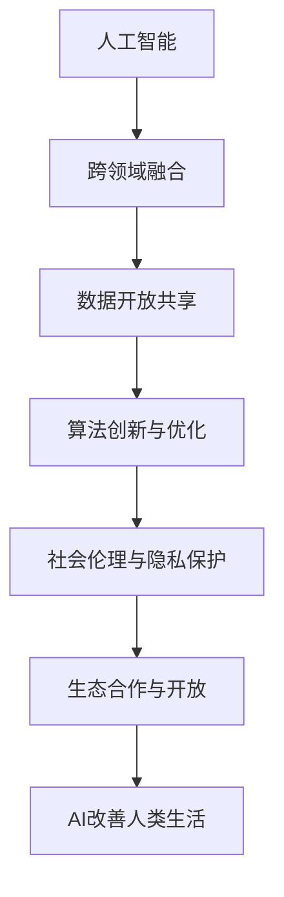

                 

## 1. 背景介绍

### 1.1 问题由来

随着人工智能技术的迅猛发展，AI在多个领域的应用已经深入到人们的生活各个方面。从智能家居、自动驾驶到医疗健康、教育培训，AI正以前所未有的速度改变着世界。然而，尽管AI技术的发展日新月异，但其落地的广度和深度仍显不足。当前，AI技术主要集中在数据丰富、算法成熟的领域，如计算机视觉、自然语言处理等，而对于那些数据稀缺、算法复杂、涉及伦理安全的领域，如智能制造、无人驾驶、精准医疗等，AI技术的落地仍存在很大障碍。

### 1.2 问题核心关键点

AI创业码头愿景的核心是利用AI技术解决人类面临的重大问题，提升人类生活质量。该愿景聚焦于以下几个关键点：

- **跨领域融合**：通过跨学科、跨领域的知识融合，推动AI技术在不同领域的应用和落地。
- **数据开放共享**：建立数据开放平台，促进数据共享，打破数据孤岛，为AI研究提供更多数据支持。
- **算法创新与优化**：不断探索和优化AI算法，提升AI系统的性能和可靠性。
- **社会伦理与隐私保护**：关注AI技术的社会影响和伦理问题，确保AI技术的健康发展和应用。
- **生态合作与开放**：构建开放、包容的AI生态，促进AI技术创新和应用。

## 2. 核心概念与联系

### 2.1 核心概念概述

为了更好地理解AI创业码头愿景，我们首先需要明确一些关键概念：

- **人工智能**：通过模拟人类智能行为，使机器能够自主完成复杂任务的计算系统。
- **跨领域融合**：将不同领域的知识和技术融合在一起，形成新的应用场景和解决方案。
- **数据开放共享**：通过数据共享平台，让数据能够被更广泛地使用，促进科学研究和创新。
- **算法创新与优化**：对现有算法进行改进和优化，提升其效率和效果。
- **社会伦理与隐私保护**：确保AI技术应用不会对社会造成负面影响，同时保护用户隐私。
- **生态合作与开放**：通过建立开放、协作的AI生态系统，促进AI技术的广泛应用。

这些概念之间的逻辑关系可以通过以下Mermaid流程图来展示：



该流程图展示了人工智能在各个领域的渗透和影响，以及数据开放、算法创新、伦理保护、生态合作等关键因素对AI技术落地应用的重要性。

## 3. AI创业码头愿景的核心目标与步骤

### 3.1 核心目标概述

AI创业码头愿景的核心目标是构建一个开放、共享、协作的AI生态系统，通过AI技术解决人类面临的重大问题，提升人类生活质量。该愿景的具体目标包括：

1. **提升医疗健康水平**：通过AI技术提升诊断准确率、治疗效率和个性化医疗服务。
2. **促进智能制造发展**：利用AI技术实现智能生产、智能运维和智能质量控制。
3. **推动精准农业发展**：通过AI技术优化农业生产管理，提升农产品质量和产量。
4. **助力智能交通与物流**：利用AI技术优化交通和物流系统，减少交通拥堵和环境污染。
5. **改善教育培训质量**：通过AI技术提升教育资源分配和个性化教育服务。
6. **支持智慧城市建设**：通过AI技术提升城市治理效率和服务水平。
7. **推动智能家居与物联网**：利用AI技术实现智能家居设备互联互通和自动化控制。

### 3.2 核心步骤详解

实现AI创业码头愿景需要分阶段、分步骤地推进，具体步骤如下：

#### Step 1: 建立数据开放共享平台

构建一个开放、共享、协作的数据平台，收集和整理各类数据资源，包括医疗、制造、农业、交通、教育等领域的数据，为AI研究提供数据支持。

#### Step 2: 推进算法创新与优化

针对不同领域的应用需求，不断探索和优化AI算法，提升其效率和效果，例如利用强化学习、深度学习、迁移学习等技术，提升AI系统在复杂环境下的适应能力和鲁棒性。

#### Step 3: 实施跨领域融合策略

通过跨学科、跨领域的知识融合，推动AI技术在不同领域的应用和落地。例如，将计算机视觉与医学影像结合，实现疾病的早期诊断；将自然语言处理与智能客服结合，提升客户服务质量。

#### Step 4: 关注社会伦理与隐私保护

关注AI技术的社会影响和伦理问题，确保AI技术的健康发展和应用，例如制定AI伦理指南，保护用户隐私，避免算法偏见等。

#### Step 5: 构建开放、包容的AI生态

通过建立开放、协作的AI生态系统，促进AI技术的广泛应用和创新。例如，建立AI开源社区，促进AI技术共享和交流；举办AI创业比赛，鼓励创新创业。

#### Step 6: 实现AI改善人类生活

通过上述步骤，实现AI技术在医疗健康、智能制造、精准农业、智能交通、教育培训、智慧城市、智能家居与物联网等领域的应用，提升人类生活质量。

### 3.3 算法优缺点

AI创业码头愿景中的核心算法包括深度学习、强化学习、迁移学习等。这些算法的优点和缺点如下：

#### 优点

- **深度学习**：能够自动提取特征，适用于大规模数据集，在图像、语音、自然语言处理等领域表现优异。
- **强化学习**：通过试错机制学习最优策略，适用于动态环境下的决策问题。
- **迁移学习**：通过知识迁移，提升在不同任务上的性能，减少训练时间。

#### 缺点

- **深度学习**：需要大量标注数据和计算资源，训练过程复杂。
- **强化学习**：收敛速度慢，需要大量实验数据，难以应用于复杂系统。
- **迁移学习**：对数据质量和任务相关性要求高，跨领域迁移能力有限。

### 3.4 算法应用领域

AI创业码头愿景中的算法在多个领域都有广泛的应用：

- **医疗健康**：利用深度学习进行医学影像分析、病理学诊断，利用强化学习进行手术模拟，利用迁移学习进行个性化医疗推荐。
- **智能制造**：利用深度学习进行缺陷检测、品质控制，利用强化学习进行生产调度、设备维护，利用迁移学习进行智能设计。
- **精准农业**：利用深度学习进行图像识别、病虫害预测，利用强化学习进行农业机器人控制，利用迁移学习进行作物种植优化。
- **智能交通与物流**：利用深度学习进行交通流量预测、路径规划，利用强化学习进行自动驾驶、交通管理，利用迁移学习进行交通信号优化。
- **教育培训**：利用深度学习进行个性化学习推荐、情感识别，利用强化学习进行智能辅导、模拟考试，利用迁移学习进行知识迁移、技能训练。
- **智慧城市**：利用深度学习进行城市规划、能源管理，利用强化学习进行交通优化、环境监测，利用迁移学习进行城市应急响应、资源调度。
- **智能家居与物联网**：利用深度学习进行智能家居设备互联、行为识别，利用强化学习进行设备控制、智能推荐，利用迁移学习进行家居自动化、环境感知。

## 4. 数学模型和公式 & 详细讲解 & 举例说明

### 4.1 数学模型构建

为了实现AI创业码头愿景，我们需要构建一系列数学模型，以下是其中的核心模型：

#### 4.1.1 深度学习模型

深度学习模型通常采用多层神经网络结构，其中每层都有多个神经元，每个神经元接收来自前一层的输出，并经过激活函数进行处理，最终输出结果。

##### 4.1.1.1 前向传播

前向传播是指从输入到输出的计算过程，具体步骤如下：

1. 输入数据 $x$ 通过多层神经网络，每层都会得到一个中间结果 $h_i$。
2. 将 $h_i$ 作为下一层的输入，得到 $h_{i+1}$。
3. 重复上述过程，直到得到输出结果 $y$。

数学公式表示为：

$$
y = f(h_0)
$$

##### 4.1.1.2 反向传播

反向传播是指从输出到输入的计算过程，具体步骤如下：

1. 计算输出结果 $y$ 与真实值 $y'$ 的误差 $e$。
2. 将误差 $e$ 反向传播到每层神经元，计算每层的梯度。
3. 更新神经元权重，最小化误差 $e$。

数学公式表示为：

$$
\frac{\partial e}{\partial w} = \frac{\partial e}{\partial y} \frac{\partial y}{\partial h} \frac{\partial h}{\partial w}
$$

### 4.2 公式推导过程

#### 4.2.1 前向传播公式

前向传播公式为：

$$
y = f(h_0)
$$

其中 $f$ 为激活函数，$h_0$ 为输入数据，$y$ 为输出结果。

#### 4.2.2 反向传播公式

反向传播公式为：

$$
\frac{\partial e}{\partial w} = \frac{\partial e}{\partial y} \frac{\partial y}{\partial h} \frac{\partial h}{\partial w}
$$

其中 $e$ 为误差，$w$ 为神经元权重，$\frac{\partial e}{\partial y}$ 为误差对输出的梯度，$\frac{\partial y}{\partial h}$ 为输出对中间结果的梯度，$\frac{\partial h}{\partial w}$ 为中间结果对权重的梯度。

### 4.3 案例分析与讲解

#### 4.3.1 图像分类任务

以图像分类任务为例，假设输入数据为 $x$，输出结果为 $y$，模型结构为 $f(x;w)$，则前向传播和反向传播过程如下：

1. 前向传播：
   $$
   h_0 = x, h_1 = f(h_0;w), h_2 = f(h_1;w), y = f(h_2;w)
   $$

2. 反向传播：
   $$
   \frac{\partial e}{\partial w} = \frac{\partial e}{\partial y} \frac{\partial y}{\partial h_2} \frac{\partial h_2}{\partial w}, \frac{\partial e}{\partial w} = \frac{\partial e}{\partial y} \frac{\partial y}{\partial h_1} \frac{\partial h_1}{\partial w}, \frac{\partial e}{\partial w} = \frac{\partial e}{\partial y} \frac{\partial y}{\partial h_0} \frac{\partial h_0}{\partial w}
   $$

通过不断迭代上述公式，即可训练出高精度的图像分类模型。

## 5. 项目实践：代码实例和详细解释说明

### 5.1 开发环境搭建

要实现上述数学模型，需要搭建相应的开发环境。以下是使用Python进行TensorFlow开发的流程：

1. 安装Anaconda：从官网下载并安装Anaconda，用于创建独立的Python环境。

2. 创建并激活虚拟环境：
```bash
conda create -n tf-env python=3.8 
conda activate tf-env
```

3. 安装TensorFlow：根据CUDA版本，从官网获取对应的安装命令。例如：
```bash
conda install tensorflow
```

4. 安装各类工具包：
```bash
pip install numpy pandas scikit-learn matplotlib tqdm jupyter notebook ipython
```

完成上述步骤后，即可在`tf-env`环境中开始TensorFlow代码的实现。

### 5.2 源代码详细实现

下面以图像分类任务为例，给出使用TensorFlow实现卷积神经网络模型的代码：

```python
import tensorflow as tf
from tensorflow.keras import layers, models

# 定义模型
model = models.Sequential([
    layers.Conv2D(32, (3, 3), activation='relu', input_shape=(28, 28, 1)),
    layers.MaxPooling2D((2, 2)),
    layers.Conv2D(64, (3, 3), activation='relu'),
    layers.MaxPooling2D((2, 2)),
    layers.Conv2D(64, (3, 3), activation='relu'),
    layers.Flatten(),
    layers.Dense(64, activation='relu'),
    layers.Dense(10)
])

# 编译模型
model.compile(optimizer='adam', loss=tf.keras.losses.SparseCategoricalCrossentropy(from_logits=True), metrics=['accuracy'])

# 训练模型
model.fit(train_images, train_labels, epochs=10, validation_data=(test_images, test_labels))
```

### 5.3 代码解读与分析

让我们再详细解读一下关键代码的实现细节：

1. `tf.keras.Sequential`：用于创建序列模型，将多个层按顺序堆叠起来。
2. `layers.Conv2D`：卷积层，用于提取图像特征。
3. `layers.MaxPooling2D`：池化层，用于降维。
4. `layers.Flatten`：展平层，将高维特征向量展平为一维向量。
5. `layers.Dense`：全连接层，用于输出分类结果。
6. `model.compile`：编译模型，设置优化器、损失函数和评估指标。
7. `model.fit`：训练模型，输入训练集和测试集，设置训练轮数。

## 6. 实际应用场景

### 6.1 医疗健康

AI创业码头愿景在医疗健康领域的应用主要包括疾病诊断、医学影像分析、个性化医疗等方面。以医学影像分析为例，通过深度学习模型对CT、MRI等医学影像进行自动分析和诊断，可以显著提高诊断效率和准确率。例如，Google Health的DeepMind已经推出了基于深度学习的肺癌筛查系统，能够自动检测肺部影像中的异常区域。

### 6.2 智能制造

AI创业码头愿景在智能制造领域的应用主要包括生产自动化、质量控制、设备维护等方面。以生产自动化为例，通过深度学习模型对生产数据进行分析和优化，可以实现智能生产调度和优化。例如，SAP的XAI项目已经推出了基于深度学习的生产优化系统，能够实时监控生产线和设备状态，自动调整生产参数，提升生产效率和质量。

### 6.3 精准农业

AI创业码头愿景在精准农业领域的应用主要包括图像识别、病虫害预测、智能灌溉等方面。以智能灌溉为例，通过深度学习模型对农田图像进行分析和识别，能够自动检测和识别作物生长状态和病虫害情况，并根据分析结果进行精准灌溉，提升农业生产效率和农产品质量。例如，SenseTime的Agriculture AI项目已经推出了基于深度学习的智能灌溉系统，能够实现农田的精准灌溉和水资源优化。

### 6.4 智能交通与物流

AI创业码头愿景在智能交通与物流领域的应用主要包括交通流量预测、路径规划、自动驾驶等方面。以自动驾驶为例，通过深度学习模型对交通数据进行分析和预测，可以实现自动驾驶车辆的控制和调度，提升交通安全和运输效率。例如，Waymo的自动驾驶系统已经实现了基于深度学习的自动驾驶功能，能够在复杂交通环境中安全行驶。

### 6.5 教育培训

AI创业码头愿景在教育培训领域的应用主要包括个性化学习推荐、情感识别、智能辅导等方面。以个性化学习推荐为例，通过深度学习模型对学生的学习数据进行分析和预测，能够实现个性化学习资源的推荐，提升学习效果和效率。例如，Khan Academy已经推出了基于深度学习的个性化学习推荐系统，能够根据学生的学习情况和偏好，推荐最适合的学习资源。

### 6.6 智慧城市

AI创业码头愿景在智慧城市领域的应用主要包括城市规划、能源管理、智能交通等方面。以智能交通为例，通过深度学习模型对交通数据进行分析和预测，可以实现智能交通管理和优化，提升城市交通效率和环境质量。例如，CityAI的智能交通系统已经实现了基于深度学习的交通管理功能，能够实时监测交通流量和拥堵情况，自动调整交通信号和车辆调度。

### 6.7 智能家居与物联网

AI创业码头愿景在智能家居与物联网领域的应用主要包括智能家居设备互联、行为识别、自动化控制等方面。以智能家居设备互联为例，通过深度学习模型对家庭环境数据进行分析和处理，可以实现智能家居设备的互联和自动化控制，提升家居生活和用户体验。例如，Google Home已经实现了基于深度学习的智能家居设备互联功能，能够自动控制家电设备和智能家居设备，提升用户生活便捷性。

## 7. 工具和资源推荐

### 7.1 学习资源推荐

为了帮助开发者系统掌握深度学习和TensorFlow的理论基础和实践技巧，这里推荐一些优质的学习资源：

1. 《深度学习》书籍：Ian Goodfellow、Yoshua Bengio、Aaron Courville等人合著，全面介绍了深度学习的基本概念和算法。
2. TensorFlow官方文档：TensorFlow的官方文档，提供了详细的API和使用指南，是学习TensorFlow的必备资料。
3. DeepLearning.AI课程：由Andrew Ng主持的深度学习课程，覆盖了深度学习的基本概念和应用。
4. Kaggle竞赛：Kaggle平台提供了大量数据集和比赛，是实践深度学习和TensorFlow的绝佳场所。
5. TensorFlow Hub：TensorFlow的模型库，提供了大量的预训练模型和代码示例，方便开发者快速上手。

通过对这些资源的学习实践，相信你一定能够快速掌握深度学习和TensorFlow的精髓，并用于解决实际的AI问题。

### 7.2 开发工具推荐

高效的开发离不开优秀的工具支持。以下是几款用于深度学习和TensorFlow开发的常用工具：

1. PyTorch：基于Python的开源深度学习框架，灵活、易用，适合快速迭代研究。
2. TensorFlow：由Google主导开发的深度学习框架，功能强大、生产部署方便。
3. TensorFlow Hub：TensorFlow的模型库，提供大量的预训练模型和代码示例，方便开发者快速上手。
4. Weights & Biases：模型训练的实验跟踪工具，可以记录和可视化模型训练过程中的各项指标，方便对比和调优。
5. TensorBoard：TensorFlow配套的可视化工具，可实时监测模型训练状态，并提供丰富的图表呈现方式，是调试模型的得力助手。
6. Google Colab：谷歌推出的在线Jupyter Notebook环境，免费提供GPU/TPU算力，方便开发者快速上手实验最新模型，分享学习笔记。

合理利用这些工具，可以显著提升深度学习和TensorFlow的开发效率，加快创新迭代的步伐。

### 7.3 相关论文推荐

深度学习和TensorFlow的发展源于学界的持续研究。以下是几篇奠基性的相关论文，推荐阅读：

1. AlexNet: ImageNet Classification with Deep Convolutional Neural Networks（ImageNet大规模视觉识别挑战赛）：提出了深度卷积神经网络，开启了深度学习时代。
2. Yoshua Bengio, Ian Goodfellow, Aaron Courville. Deep Learning（深度学习）：全面介绍了深度学习的基本概念和算法，是深度学习的经典教材。
3. TensorFlow: A System for Large-Scale Machine Learning（TensorFlow系统设计）：介绍了TensorFlow系统的设计原理和实现细节，是TensorFlow的权威指南。
4. End-to-End Training for Neural Architecture Search with Reinforcement Learning（基于强化学习的神经网络结构搜索）：提出了一种基于强化学习的神经网络结构搜索算法，提升了深度学习的自动化设计能力。
5. Weight Normalization: A Simple Reparameterization to Accelerate Training of Deep Neural Networks（权重归一化）：提出了一种新的深度学习优化算法，加快了深度神经网络的训练速度。
6. Batch Normalization: Accelerating Deep Network Training by Reducing Internal Covariate Shift（批量归一化）：提出了一种新的深度学习优化算法，提高了深度神经网络的训练速度和稳定性。

这些论文代表了大深度学习和TensorFlow的发展脉络。通过学习这些前沿成果，可以帮助研究者把握学科前进方向，激发更多的创新灵感。

## 8. 总结：未来发展趋势与挑战

### 8.1 总结

本文对AI创业码头愿景进行了全面系统的介绍。首先阐述了AI技术在医疗健康、智能制造、精准农业、智能交通、教育培训、智慧城市、智能家居与物联网等领域的广泛应用前景，明确了AI创业码头愿景的重要意义。其次，从原理到实践，详细讲解了深度学习和TensorFlow的数学模型和算法步骤，给出了深度学习模型的代码实例和详细解读。同时，本文还探讨了AI创业码头愿景在实际应用场景中的具体实现，展示了AI技术在各个领域的应用潜力。

通过本文的系统梳理，可以看到，AI创业码头愿景是一个宏大的目标，通过AI技术解决人类面临的重大问题，提升人类生活质量。实现这一愿景需要跨学科、跨领域的合作与创新，需要不断探索和优化算法，需要构建开放、共享的AI生态系统。相信随着学界和产业界的共同努力，AI创业码头愿景必将在构建人机协同的智能时代中扮演越来越重要的角色。

### 8.2 未来发展趋势

展望未来，深度学习和TensorFlow技术将呈现以下几个发展趋势：

1. 深度学习模型的复杂度将持续增大。随着算力成本的下降和数据规模的扩张，深度学习模型的复杂度将不断增加，能够处理更复杂、更庞大的数据集。
2. TensorFlow将进一步集成更多AI算法和工具。TensorFlow的生态系统将更加丰富，涵盖更多的AI算法和工具，方便开发者进行AI研究和应用。
3. AI创业码头愿景将拓展到更多垂直领域。AI技术将在医疗、制造、农业、交通、教育、城市等更多领域得到应用，实现跨领域融合和创新。
4. 数据开放共享将更加普及。数据开放平台将提供更多的数据资源，促进科学研究和创新，打破数据孤岛。
5. 社会伦理与隐私保护将更加重视。AI技术的应用将更加注重社会伦理和隐私保护，确保技术应用的合法性和安全性。
6. 开放、包容的AI生态将更加成熟。AI创业码头愿景将构建更加开放、包容的AI生态系统，促进AI技术的广泛应用和创新。

以上趋势凸显了AI创业码头愿景的广阔前景。这些方向的探索发展，必将进一步提升AI系统的性能和可靠性，为构建人机协同的智能时代提供更多可能。

### 8.3 面临的挑战

尽管深度学习和TensorFlow技术已经取得了瞩目成就，但在迈向更加智能化、普适化应用的过程中，它们仍面临着诸多挑战：

1. 数据依赖性强。深度学习和TensorFlow技术需要大量标注数据和高质量数据，获取数据成本高、难度大。
2. 算法复杂度高。深度学习模型的训练和优化过程复杂，需要大量的计算资源和时间。
3. 应用场景多样化。AI创业码头愿景需要在多个领域进行应用，不同领域的应用场景和需求差异大。
4. 社会伦理问题。AI技术的应用可能涉及隐私保护、算法偏见等问题，需要制定相应的政策和规范。
5. 计算资源需求高。深度学习模型的训练和推理需要高性能计算资源，成本高、资源占用大。
6. 模型可解释性差。深度学习模型的内部机制复杂，难以解释和理解其决策过程。

这些挑战需要在技术、社会、政策等多个层面进行综合考虑和应对，才能更好地推动AI创业码头愿景的实现。

### 8.4 研究展望

面对深度学习和TensorFlow技术面临的挑战，未来的研究需要在以下几个方面寻求新的突破：

1. 探索更高效的数据获取和处理方式。利用自动化数据标注、数据增强、生成对抗网络等技术，降低数据获取成本，提高数据质量。
2. 优化深度学习模型的训练和优化算法。开发更高效的模型训练和优化算法，如稀疏化、量化、剪枝等技术，提升深度学习模型的性能和效率。
3. 拓展AI创业码头愿景的应用场景。在更多领域进行AI技术的应用，如智慧医疗、精准农业、智能交通等，推动AI技术的普适化和普及。
4. 加强社会伦理与隐私保护。制定AI伦理指南，保护用户隐私，确保AI技术应用的安全性和合法性。
5. 提高模型的可解释性。引入可解释性方法，增强深度学习模型的透明度和可理解性，促进AI技术的应用和推广。

这些研究方向的探索，必将引领深度学习和TensorFlow技术迈向更高的台阶，为构建人机协同的智能时代铺平道路。面向未来，深度学习和TensorFlow技术还需要与其他AI技术进行更深入的融合，如知识表示、因果推理、强化学习等，多路径协同发力，共同推动自然语言理解和智能交互系统的进步。只有勇于创新、敢于突破，才能不断拓展AI系统的边界，让AI技术更好地造福人类社会。

## 9. 附录：常见问题与解答

**Q1：AI创业码头愿景是否适用于所有AI领域？**

A: AI创业码头愿景适用于AI技术在医疗健康、智能制造、精准农业、智能交通、教育培训、智慧城市、智能家居与物联网等领域的落地应用。虽然AI技术在数据丰富、算法成熟的领域表现出色，但在数据稀缺、算法复杂、涉及伦理安全的领域，如智能制造、无人驾驶、精准医疗等，AI技术的落地仍存在很大障碍。

**Q2：如何构建开放、共享的AI生态系统？**

A: 构建开放、共享的AI生态系统需要以下步骤：
1. 建立数据开放平台，提供更多的数据资源，促进科学研究和创新。
2. 推动开源社区的发展，鼓励开发者分享代码和模型，促进技术共享和交流。
3. 举办AI创业比赛，鼓励创新创业，促进AI技术的应用和推广。
4. 加强与企业的合作，推动AI技术的商业化应用，实现技术的产业化。
5. 制定AI伦理指南，保护用户隐私，确保技术应用的合法性和安全性。

**Q3：如何提升深度学习模型的可解释性？**

A: 提升深度学习模型的可解释性需要以下方法：
1. 引入可解释性方法，如LIME、SHAP等，解释模型的决策过程。
2. 引入对抗样本，分析模型在不同样本上的表现。
3. 引入因果分析方法，分析模型的因果关系，提高模型的透明度和可理解性。
4. 引入知识表示方法，如符号化推理、逻辑推理等，增强模型的知识表示能力。

通过这些方法，可以提升深度学习模型的可解释性，促进AI技术的应用和推广。

**Q4：如何优化深度学习模型的训练和优化算法？**

A: 优化深度学习模型的训练和优化算法需要以下方法：
1. 引入稀疏化、量化、剪枝等技术，减少模型参数量，提升模型效率。
2. 引入混合精度训练、梯度累积等技术，优化模型训练过程，提升模型效果。
3. 引入自适应优化算法，如AdaMax、AdaBound等，提高模型的收敛速度和稳定性。
4. 引入自适应学习率算法，如AdaGrad、RMSprop等，优化学习率调整策略，提高模型性能。

通过这些方法，可以优化深度学习模型的训练和优化算法，提升模型的性能和效率。

**Q5：如何在医疗健康领域应用AI技术？**

A: 在医疗健康领域应用AI技术需要以下步骤：
1. 收集医疗数据，如病历、影像等，进行数据清洗和标注。
2. 利用深度学习模型对医疗数据进行分析和诊断，如医学影像分析、病理学诊断等。
3. 利用强化学习模型进行手术模拟和优化，提高手术成功率和安全性。
4. 利用迁移学习模型进行个性化医疗推荐，提高医疗服务的精准度和效率。

通过这些步骤，可以在医疗健康领域应用AI技术，提升医疗水平和患者体验。

**Q6：如何在智能制造领域应用AI技术？**

A: 在智能制造领域应用AI技术需要以下步骤：
1. 收集生产数据，如设备状态、生产参数等，进行数据清洗和标注。
2. 利用深度学习模型进行缺陷检测和质量控制，提高生产效率和产品质量。
3. 利用强化学习模型进行生产调度和设备维护，提高生产效率和设备利用率。
4. 利用迁移学习模型进行智能设计优化，提高设计效率和创新能力。

通过这些步骤，可以在智能制造领域应用AI技术，推动生产自动化和智能化。

**Q7：如何在精准农业领域应用AI技术？**

A: 在精准农业领域应用AI技术需要以下步骤：
1. 收集农业数据，如农田图像、气象数据等，进行数据清洗和标注。
2. 利用深度学习模型进行图像识别和病虫害预测，提高农业生产效率。
3. 利用强化学习模型进行智能灌溉和施肥，优化农业资源利用。
4. 利用迁移学习模型进行作物种植优化，提高农产品质量和产量。

通过这些步骤，可以在精准农业领域应用AI技术，提升农业生产效率和农产品质量。

**Q8：如何在智能交通与物流领域应用AI技术？**

A: 在智能交通与物流领域应用AI技术需要以下步骤：
1. 收集交通数据，如车辆位置、交通流量等，进行数据清洗和标注。
2. 利用深度学习模型进行交通流量预测和路径规划，提高交通效率和安全性。
3. 利用强化学习模型进行自动驾驶和交通管理，提高交通效率和环境质量。
4. 利用迁移学习模型进行交通信号优化，提高交通管理和控制效率。

通过这些步骤，可以在智能交通与物流领域应用AI技术，推动交通智能化和物流优化。

**Q9：如何在教育培训领域应用AI技术？**

A: 在教育培训领域应用AI技术需要以下步骤：
1. 收集教育数据，如学生成绩、学习行为等，进行数据清洗和标注。
2. 利用深度学习模型进行个性化学习推荐和情感识别，提高学习效果和效率。
3. 利用强化学习模型进行智能辅导和模拟考试，提升教学质量和学生能力。
4. 利用迁移学习模型进行知识迁移和技能训练，提高教学资源利用效率。

通过这些步骤，可以在教育培训领域应用AI技术，提升教育质量和教学效率。

**Q10：如何在智慧城市领域应用AI技术？**

A: 在智慧城市领域应用AI技术需要以下步骤：
1. 收集城市数据，如交通流量、能源消耗等，进行数据清洗和标注。
2. 利用深度学习模型进行城市规划和能源管理，提高城市治理效率和服务水平。
3. 利用强化学习模型进行交通优化和环境监测，提高城市交通效率和环境质量。
4. 利用迁移学习模型进行城市应急响应和资源调度，提高城市应急管理能力。

通过这些步骤，可以在智慧城市领域应用AI技术，提升城市治理效率和服务水平。

**Q11：如何在智能家居与物联网领域应用AI技术？**

A: 在智能家居与物联网领域应用AI技术需要以下步骤：
1. 收集家居数据，如环境数据、设备状态等，进行数据清洗和标注。
2. 利用深度学习模型进行智能家居设备互联和行为识别，提高家居生活便捷性。
3. 利用强化学习模型进行智能家居设备控制和推荐，提升家居生活品质。
4. 利用迁移学习模型进行智能家居自动化和环境感知，提高家居生活效率和舒适度。

通过这些步骤，可以在智能家居与物联网领域应用AI技术，提升家居生活品质和智能化水平。

**Q12：如何在多模态数据融合中应用AI技术？**

A: 在多模态数据融合中应用AI技术需要以下步骤：
1. 收集多模态数据，如图像、语音、文本等，进行数据清洗和标注。
2. 利用深度学习模型进行多模态数据融合和特征提取，提高数据融合效果和应用效果。
3. 利用强化学习模型进行多模态数据融合和决策支持，提升决策效果和应用效果。
4. 利用迁移学习模型进行多模态数据融合和知识迁移，提高数据融合效果和应用效果。

通过这些步骤，可以在多模态数据融合中应用AI技术，提升数据融合效果和应用效果。

**Q13：如何避免AI技术中的偏见和歧视？**

A: 避免AI技术中的偏见和歧视需要以下方法：
1. 在数据收集和标注过程中，注意数据的多样性和代表性，避免数据偏见。
2. 在模型设计和训练过程中，引入公平性指标和约束，避免模型偏见。
3. 在模型应用过程中，进行公平性评估和监控，避免应用偏见。
4. 引入多模态数据融合和知识表示，增强模型的公平性和鲁棒性。

通过这些方法，可以避免AI技术中的偏见和歧视，确保AI技术应用的公平性和合法性。

**Q14：如何提高AI技术的安全性和可靠性？**

A: 提高AI技术的安全性和可靠性需要以下方法：
1. 在模型设计和训练过程中，引入安全性指标和约束，确保模型安全性。
2. 在模型应用过程中，进行安全性评估和监控，确保应用安全性。
3. 引入知识表示和因果分析方法，增强模型的鲁棒性和安全性。
4. 引入对抗样本和鲁棒性测试方法，提高模型的鲁棒性和安全性。

通过这些方法，可以提高AI技术的安全性和可靠性，确保AI技术应用的合法性和安全性。

**Q15：如何在多领域AI应用中推广AI技术？**

A: 在多领域AI应用中推广AI技术需要以下方法：
1. 在各领域进行AI技术应用和推广，推动AI技术的普适化和普及。
2. 在各领域进行AI技术合作和交流，促进AI技术的共享和创新。
3. 在各领域进行AI技术教育与培训，提升AI技术的应用能力和水平。
4. 在各领域进行AI技术标准和规范制定，推动AI技术的应用和推广。

通过这些方法，可以在多领域AI应用中推广AI技术，推动AI技术的普适化和普及。

**Q16：如何构建AI创业码头愿景的生态系统？**

A: 构建AI创业码头愿景的生态系统需要以下方法：
1. 建立数据开放平台，提供更多的数据资源，促进科学研究和创新。
2. 推动开源社区的发展，鼓励开发者分享代码和模型，促进技术共享和交流。
3. 举办AI创业比赛，鼓励创新创业，促进AI技术的应用和推广。
4. 加强与企业的合作，推动AI技术的商业化应用，实现技术的产业化。
5. 制定AI伦理指南，保护用户隐私，确保技术应用的合法性和安全性。

通过这些方法，可以构建AI创业码头愿景的生态系统，促进AI技术的广泛应用和创新。

**Q17：如何推动AI创业码头愿景的实现？**

A: 推动AI创业码头愿景的实现需要以下方法：
1. 在各领域进行AI技术应用和推广，推动AI技术的普适化和普及。
2. 在各领域进行AI技术合作和交流，促进AI技术的共享和创新。
3. 在各领域进行AI技术教育与培训，提升AI技术的应用能力和水平。
4. 在各领域进行AI技术标准和规范制定，推动AI技术的应用和推广。
5. 加强与企业的合作，推动AI技术的商业化应用，实现技术的产业化。

通过这些方法，可以推动AI创业码头愿景的实现，构建人机协同的智能时代。

---

作者：禅与计算机程序设计艺术 / Zen and the Art of Computer Programming

