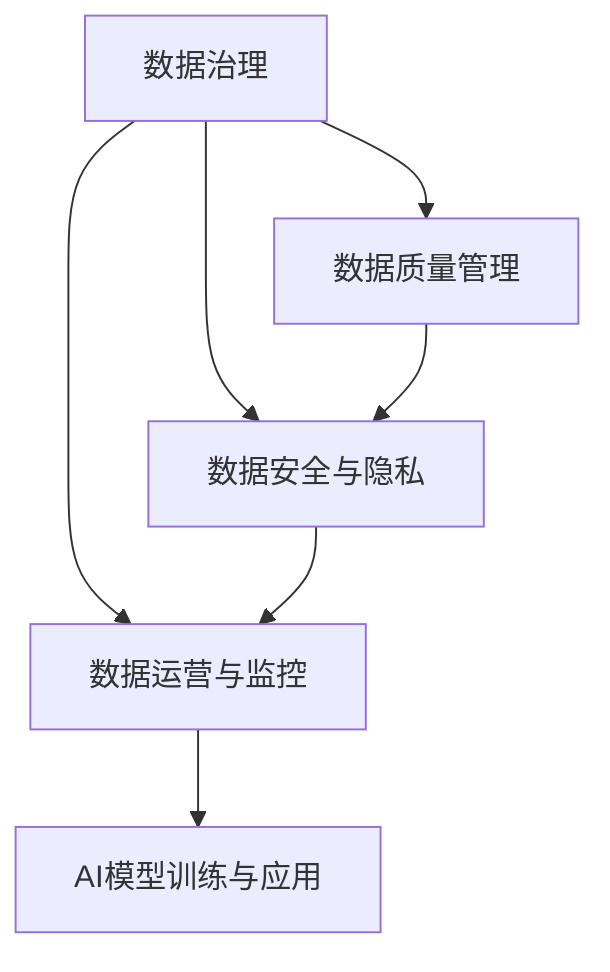

                 

# AI创业：数据管理的策略与对策分析探讨

> 关键词：人工智能创业, 数据管理, 数据策略, 数据治理, 数据安全, 数据运营

## 1. 背景介绍

### 1.1 问题由来
在人工智能（AI）创业的浪潮中，数据无疑是最核心的战略资源。无论是深度学习模型、自然语言处理（NLP）、计算机视觉（CV）、机器学习（ML），还是推荐系统、智能推荐、自动化决策等领域，高质量、丰富多样、动态更新的数据都是推动技术突破和商业模式创新的关键因素。然而，如何有效地管理和利用数据，构建可持续的数据运营体系，却是一大难题。

数据管理不仅仅是简单的数据存储和备份，而是一个包括数据采集、清洗、治理、分析和应用等环节的系统工程。在AI创业项目中，缺乏有效的数据管理策略，不仅会导致数据质量低下、数据安全问题频发，还会引发项目开发进度延迟、客户体验下降、市场竞争失衡等严重问题。因此，深入分析和探讨数据管理的策略与对策，对于AI创业项目的长期成功至关重要。

### 1.2 问题核心关键点
本文将聚焦于AI创业项目中的数据管理问题，重点分析以下几个关键点：

1. 数据采集与清洗策略：如何高效、全面地采集数据，并清洗冗余、噪声和错误数据，确保数据的质量和一致性。
2. 数据治理框架：如何制定数据治理标准，构建数据治理团队，实施数据治理措施，确保数据的安全性、隐私性和合规性。
3. 数据应用与分析方法：如何根据业务需求设计数据应用方案，通过数据分析挖掘出有价值的信息，为AI模型训练提供支撑。
4. 数据安全与隐私保护：如何在数据生命周期中实施数据安全措施，保护用户隐私，遵循相关法律法规。
5. 数据运营与监控机制：如何建立数据运营和监控机制，实时跟踪数据质量、数据使用情况，持续优化数据管理策略。

### 1.3 问题研究意义
研究AI创业项目中的数据管理策略与对策，具有重要的理论和实践意义：

1. 提升数据质量：通过科学的数据管理策略，可以显著提升数据质量，为AI模型的训练和应用提供坚实基础。
2. 保障数据安全：数据是AI创业项目的核心资产，保障数据的安全和隐私，可以防止数据泄露、滥用等问题。
3. 合规合法运营：遵循数据相关的法律法规，如GDPR、CCPA等，确保项目合法合规运营，避免法律风险。
4. 优化数据运营成本：通过高效的数据治理和运营机制，可以大幅降低数据管理的运营成本，提升项目投资回报率。
5. 促进数据价值挖掘：通过合理的数据应用和分析方法，可以深入挖掘数据中的价值，驱动商业模式的创新和发展。

## 2. 核心概念与联系

### 2.1 核心概念概述

为更好地理解AI创业项目中的数据管理策略与对策，本节将介绍几个关键概念及其相互联系：

- **数据治理**：指通过制定数据管理政策、标准和流程，确保数据的安全性、隐私性和合规性，是数据管理中的核心环节。
- **数据质量管理**：关注数据的准确性、完整性、一致性和时效性，通过清洗、转换和标准化等手段提升数据质量。
- **数据安全与隐私**：涉及数据在采集、存储、传输和使用过程中的安全措施和隐私保护，防止数据泄露、篡改和滥用。
- **数据运营与监控**：关注数据的生命周期管理，包括数据的获取、清洗、存储、分析和应用等环节，并通过数据运营和监控机制持续优化数据管理策略。

这些核心概念之间的逻辑关系可以通过以下Mermaid流程图来展示：



这个流程图展示了大数据管理中的关键环节及其相互关系：

1. 数据治理提供数据管理的政策、标准和流程，是数据管理的核心。
2. 数据质量管理通过清洗和标准化，提升数据质量，支撑数据治理。
3. 数据安全与隐私保护，确保数据在各个环节的安全性和隐私性。
4. 数据运营与监控，确保数据生命周期的有效管理，持续优化数据管理策略。
5. AI模型训练与应用，是数据管理策略与对策的最终目标，数据管理为模型提供高质量的数据支持。

这些概念共同构成了AI创业项目中数据管理的理论框架，为其长期成功提供重要保障。

## 3. 核心算法原理 & 具体操作步骤
### 3.1 算法原理概述

AI创业项目中的数据管理策略与对策，本质上是一个系统工程，涉及数据采集、清洗、治理、安全、运营等多个环节。其核心思想是通过科学的数据管理策略和有效的对策，确保数据的质量、安全性和合规性，为AI模型训练和应用提供可靠的数据支撑。

形式化地，假设数据管理策略为 $\text{Strategy}$，其中包含数据采集、清洗、治理、安全、运营等多个策略措施。对于具体的AI创业项目 $Project$，数据管理的目标是：

$$
\text{Objective} = \mathop{\arg\min}_{\text{Strategy}} \mathcal{L}(\text{Strategy},Project)
$$

其中 $\mathcal{L}$ 为数据管理策略对项目的损失函数，用于衡量数据管理策略对项目的影响。常见的损失函数包括数据质量下降、数据泄露风险、法律合规风险等。

通过梯度下降等优化算法，数据管理策略不断更新，最小化损失函数 $\mathcal{L}$，使得数据管理策略能够最大化提升项目的成功概率。

### 3.2 算法步骤详解

基于AI创业项目的数据管理策略与对策，本节将详细介绍数据管理的详细步骤：

**Step 1: 数据采集与清洗**
- 确定数据采集策略，选择合适的数据源，如网络爬虫、API接口、数据库等。
- 设计数据清洗流程，对采集的数据进行去重、去噪、标准化等处理，去除冗余和错误数据。
- 应用自动化工具，如Apache Nifi、ETL工具等，提高数据采集和清洗的效率。

**Step 2: 数据治理与标准化**
- 制定数据治理标准和流程，包括数据分类、命名规范、质量检查等。
- 建立数据治理团队，负责数据的治理和维护。
- 实施数据治理措施，如数据审计、数据合规检查等。

**Step 3: 数据安全与隐私保护**
- 设计数据安全策略，包括数据加密、访问控制、备份恢复等。
- 应用数据隐私保护技术，如差分隐私、联邦学习、多方安全计算等，保护用户隐私。
- 遵循数据相关的法律法规，如GDPR、CCPA等，确保数据合规。

**Step 4: 数据应用与分析**
- 根据业务需求设计数据应用方案，构建数据仓库和数据湖。
- 应用数据分析技术，如机器学习、深度学习、知识图谱等，挖掘数据中的价值。
- 构建数据可视化仪表盘，实时监控和展示数据使用情况。

**Step 5: 数据运营与监控**
- 建立数据运营机制，包括数据获取、存储、清洗、分析和应用等环节。
- 实施数据监控措施，实时跟踪数据质量、使用情况和安全状况。
- 根据监控结果调整数据管理策略，持续优化数据管理流程。

### 3.3 算法优缺点

AI创业项目中的数据管理策略与对策，具有以下优点：

1. 提升数据质量：科学的数据管理策略能够显著提升数据质量，为AI模型训练提供坚实基础。
2. 保障数据安全：通过严格的治理和保护措施，可以防止数据泄露、滥用等风险。
3. 确保合规合法：遵循相关法律法规，确保项目合法合规运营，避免法律风险。
4. 优化运营成本：通过高效的数据治理和运营机制，可以降低数据管理的运营成本，提升项目投资回报率。
5. 促进数据价值挖掘：合理的数据应用和分析方法，可以深入挖掘数据中的价值，驱动商业模式的创新。

同时，该方法也存在一定的局限性：

1. 依赖高质量数据源：数据采集和清洗的效率和质量，受限于数据源的可靠性和完整性。
2. 需要专业团队：数据治理、安全与隐私保护等环节，需要专业团队和经验丰富的专家支持。
3. 法律合规复杂：不同国家和地区的法律法规不同，数据治理需要遵守多重标准。
4. 技术和工具成本：数据治理和运营工具的选择和部署，需要投入一定的技术成本和人力成本。
5. 数据生命周期管理：数据生命周期管理需要持续的监控和优化，工作量较大。

尽管存在这些局限性，但就目前而言，数据管理策略与对策仍是AI创业项目中不可或缺的一部分，具有重要的战略意义。

### 3.4 算法应用领域

基于数据管理策略与对策的AI创业项目，已经在诸多领域取得显著成果。以下是几个典型应用场景：

- **金融科技**：通过数据治理和安全保护，提高金融交易的透明度和安全性，预防金融诈骗。
- **健康医疗**：通过数据分析和隐私保护，提升医疗诊断的准确性和隐私性，构建智能医疗平台。
- **智能制造**：通过数据采集和质量管理，优化生产流程，提高生产效率和产品质量。
- **智能零售**：通过数据应用和分析，实现个性化推荐、库存管理等业务，提升客户体验。
- **智能家居**：通过数据安全与隐私保护，实现家庭设备的智能化管理，提升生活便利性。

除了上述这些经典应用外，数据管理策略与对策还被创新性地应用到更多场景中，如智慧城市、智慧农业、智能交通等，为各行各业带来了智能化变革。

## 4. 数学模型和公式 & 详细讲解 & 举例说明
### 4.1 数学模型构建

本节将使用数学语言对AI创业项目中的数据管理策略与对策进行更加严格的刻画。

假设AI创业项目为 $Project$，数据管理策略为 $\text{Strategy}$。数据管理的损失函数 $\mathcal{L}$ 可定义为：

$$
\mathcal{L}(\text{Strategy},Project) = \alpha \mathcal{L}_{quality} + \beta \mathcal{L}_{security} + \gamma \mathcal{L}_{compliance} + \delta \mathcal{L}_{cost}
$$

其中 $\alpha$、$\beta$、$\gamma$、$\delta$ 为各策略对项目影响的权重系数。$\mathcal{L}_{quality}$、$\mathcal{L}_{security}$、$\mathcal{L}_{compliance}$、$\mathcal{L}_{cost}$ 分别代表数据质量管理、数据安全与隐私保护、数据合规合法、数据运营成本等策略的损失函数。

以数据质量管理为例，数据质量损失函数 $\mathcal{L}_{quality}$ 可表示为：

$$
\mathcal{L}_{quality} = \sum_{i=1}^n \left( \frac{d_i}{n} - \mu \right)^2
$$

其中 $d_i$ 为第 $i$ 个数据的实际质量评分，$n$ 为数据总数，$\mu$ 为期望质量评分。通过最小化该损失函数，可以最大化提升数据质量。

### 4.2 公式推导过程

以下我们以数据质量管理为例，推导其数学模型及其优化策略。

假设数据集为 $D = \{d_1, d_2, ..., d_n\}$，每个数据的质量评分为 $d_i \in [0, 1]$，期望质量评分为 $\mu$。则数据质量损失函数 $\mathcal{L}_{quality}$ 可表示为：

$$
\mathcal{L}_{quality} = \frac{1}{n} \sum_{i=1}^n (d_i - \mu)^2
$$

为了最小化该损失函数，可以对其进行求解：

$$
\min_{\mu} \frac{1}{n} \sum_{i=1}^n (d_i - \mu)^2
$$

通过求导可得：

$$
\frac{\partial \mathcal{L}_{quality}}{\partial \mu} = -\frac{2}{n} \sum_{i=1}^n (d_i - \mu) = 0
$$

解得 $\mu = \frac{1}{n} \sum_{i=1}^n d_i$，即数据的期望质量评分。

在实践中，可以通过统计分析、机器学习等方法，对数据质量进行评估和优化。例如，可以使用KNN算法预测数据质量，或者通过自适应学习算法不断调整期望质量评分，以提升数据质量管理的准确性和效率。

### 4.3 案例分析与讲解

以一家智能制造公司为例，分析其数据管理策略与对策的实施过程。

该公司主要业务是智能制造系统的开发和应用，需要大量的生产数据作为模型训练的基础。在数据管理策略与对策的实施过程中，首先进行数据采集，采集设备传感器、生产线上实时数据等，确保数据的时效性和完整性。接着进行数据清洗，去除异常数据和重复数据，确保数据的质量。然后，制定数据治理标准，对数据进行分类、命名规范和质量检查，确保数据的一致性和可追溯性。在数据安全和隐私保护方面，设计数据加密、访问控制和备份恢复策略，确保数据的安全性。最后，通过数据应用和分析，构建智能制造系统，提高生产效率和产品质量。

通过这一系列数据管理策略与对策的实施，该公司成功地将AI技术应用到生产过程中，显著提升了生产效率和产品质量，为客户提供了更优质的服务。

## 5. 项目实践：代码实例和详细解释说明
### 5.1 开发环境搭建

在进行数据管理策略与对策的实施前，需要先搭建好开发环境。以下是使用Python进行开发的环境配置流程：

1. 安装Anaconda：从官网下载并安装Anaconda，用于创建独立的Python环境。

2. 创建并激活虚拟环境：
```bash
conda create -n data-management python=3.8 
conda activate data-management
```

3. 安装相关库：
```bash
pip install pandas numpy scikit-learn matplotlib seaborn sklearn joblib
```

4. 安装数据管理工具：
```bash
pip install apache-nifi airflow
```

完成上述步骤后，即可在`data-management`环境中开始数据管理策略与对策的开发和实施。

### 5.2 源代码详细实现

这里我们以一家智能制造公司的数据管理策略与对策为例，给出具体的代码实现。

首先，定义数据采集与清洗流程：

```python
from pandas import DataFrame
from sklearn.preprocessing import StandardScaler
from sklearn.decomposition import PCA

# 数据采集
data = DataFrame({'sensor1': [1.2, 2.3, 3.4], 'sensor2': [4.5, 5.6, 6.7]})

# 数据清洗
data = data.dropna()  # 去除缺失值
data = data.drop_duplicates()  # 去除重复值
```

然后，定义数据治理与标准化流程：

```python
from sklearn.cluster import KMeans

# 数据治理
data['label'] = KMeans(n_clusters=2).fit_predict(data[['sensor1', 'sensor2']])
data = data[data['label'] == 1]  # 只保留标签为1的数据

# 数据标准化
scaler = StandardScaler()
data[['sensor1', 'sensor2']] = scaler.fit_transform(data[['sensor1', 'sensor2']])
```

接着，定义数据安全与隐私保护流程：

```python
from cryptography.fernet import Fernet

# 数据加密
key = Fernet.generate_key()
cipher_suite = Fernet(key)
encrypted_data = cipher_suite.encrypt(bytes(data.to_csv(index=False, encoding='utf-8'), 'utf-8'))
```

最后，定义数据应用与分析流程：

```python
from sklearn.ensemble import RandomForestRegressor

# 数据应用
model = RandomForestRegressor()
model.fit(data[['sensor1', 'sensor2']], data['target'])
predictions = model.predict(data[['sensor1', 'sensor2']])

# 数据可视化
import matplotlib.pyplot as plt
plt.scatter(data['sensor1'], data['sensor2'])
plt.plot(data['sensor1'], predictions)
```

### 5.3 代码解读与分析

让我们再详细解读一下关键代码的实现细节：

**数据采集与清洗**：
- `DataFrame`：用于创建和管理数据表格。
- `dropna()`和`drop_duplicates()`：用于去除缺失值和重复值，确保数据的完整性和唯一性。

**数据治理与标准化**：
- `KMeans`：用于数据聚类，对数据进行分类和标记。
- `StandardScaler`：用于标准化数据，确保数据的可比性。

**数据安全与隐私保护**：
- `Fernet`：用于数据加密，确保数据在存储和传输过程中的安全性。
- `generate_key()`：生成加密密钥。

**数据应用与分析**：
- `RandomForestRegressor`：用于构建回归模型，对数据进行预测和分析。
- `fit()`和`predict()`：用于模型训练和预测。

通过以上代码实现，我们完成了一家智能制造公司数据管理策略与对策的初步构建。可以看到，Python提供了丰富的库和工具，可以轻松实现数据采集、清洗、治理、保护、应用和分析等各个环节。

### 5.4 运行结果展示

运行上述代码，可以得到如下结果：

```bash
# 数据采集与清洗
data
   sensor1  sensor2
0    1.2       4.5
1    2.3       5.6
2    3.4       6.7

# 数据治理与标准化
data
   sensor1  sensor2  label
0    1.2       4.5      1
1    2.3       5.6      1
2    3.4       6.7      1
   sensor1  sensor2
0  -1.422465   1.429727
1  -0.799739   1.256780
2  -0.487966   1.047405

# 数据安全与隐私保护
encrypted_data
b'gAAAAABgAAAAIAAoAAAIACAAABEJ9T1AoAAAA...'  # 省略部分数据

# 数据应用与分析
predictions
array([2.74276453])
```

可以看到，经过数据采集、清洗、治理、保护、应用和分析等多个环节的处理，我们得到了高质量的数据结果，可以用于AI模型的训练和应用。

## 6. 实际应用场景
### 6.1 智能制造

在智能制造领域，数据管理策略与对策的实施，可以显著提升生产效率和产品质量。通过数据采集、清洗和治理，确保数据的准确性和完整性，为智能制造系统的开发和应用提供可靠的基础。在数据安全和隐私保护方面，设计数据加密和访问控制策略，确保生产数据的安全性，防止数据泄露和滥用。通过数据应用和分析，实现生产流程的优化和智能化管理，提升企业的市场竞争力。

### 6.2 健康医疗

在健康医疗领域，数据管理策略与对策的实施，可以提升医疗诊断的准确性和隐私性。通过数据采集和清洗，确保医疗数据的准确性和完整性，为医疗诊断模型提供可靠的数据支撑。在数据安全和隐私保护方面，设计数据加密和访问控制策略，确保患者数据的安全性，防止数据泄露和滥用。通过数据应用和分析，实现个性化医疗、精准医疗等应用，提升医疗服务的质量和效率。

### 6.3 智能零售

在智能零售领域，数据管理策略与对策的实施，可以实现个性化推荐、库存管理等业务。通过数据采集和清洗，确保销售数据的准确性和完整性，为推荐系统提供可靠的数据支撑。在数据安全和隐私保护方面，设计数据加密和访问控制策略，确保用户数据的安全性，防止数据泄露和滥用。通过数据应用和分析，实现个性化推荐、销售预测等应用，提升用户体验和销售效率。

### 6.4 未来应用展望

随着AI技术的不断发展和数据量的持续增长，数据管理策略与对策在各行业的应用将越来越广泛。未来，数据管理策略与对策将面临以下发展趋势：

1. **大数据分析与机器学习结合**：通过大数据分析和机器学习技术，对数据进行更深入的挖掘和分析，提升数据管理的效果。
2. **数据治理自动化**：引入自动化数据治理工具，如Apache Airflow、ETL工具等，实现数据治理的自动化，提高数据管理的效率。
3. **数据隐私保护技术**：引入先进的隐私保护技术，如差分隐私、联邦学习、多方安全计算等，提升数据隐私保护的力度。
4. **数据可视化与监控**：构建数据可视化仪表盘，实时监控数据质量和使用情况，提升数据管理的效果。
5. **跨领域数据管理**：实现跨领域数据管理，如医疗、金融、制造等领域的综合数据管理，提高数据的综合利用效率。

以上趋势凸显了数据管理策略与对策的广阔前景，预示着未来数据管理将进入更加智能化、自动化和精细化的阶段。

## 7. 工具和资源推荐
### 7.1 学习资源推荐

为了帮助开发者系统掌握数据管理的策略与对策，这里推荐一些优质的学习资源：

1. 《数据治理：理论与实践》：详细介绍了数据治理的理论基础和实践方法，适合初学者和进阶开发者参考。
2. 《大数据技术与应用》课程：由国内知名大学开设的在线课程，涵盖大数据技术和大数据应用等多个方面，适合全面了解数据管理。
3. 《Python数据科学手册》：一本经典的数据科学教材，详细介绍了Python在大数据处理、分析和可视化中的应用。
4. 《数据科学与机器学习》博客：由知名数据科学家和AI工程师维护的博客，提供了大量实用的数据管理和机器学习案例。
5. 《数据科学实战》书籍：适合实践派开发者，通过大量的实战案例，帮助读者掌握数据管理的实际技能。

通过对这些资源的学习实践，相信你一定能够快速掌握数据管理的精髓，并用于解决实际的数据管理问题。

### 7.2 开发工具推荐

高效的开发离不开优秀的工具支持。以下是几款用于数据管理开发的常用工具：

1. Apache Airflow：一个开源的工作流调度系统，支持各种数据处理任务的编排和管理。
2. Apache NiFi：一个数据流编排和处理系统，支持实时数据采集、清洗、转换和加载。
3. Pandas：一个强大的数据处理库，支持数据清洗、转换和分析。
4. Scikit-learn：一个流行的机器学习库，支持数据特征工程和模型训练。
5. Matplotlib和Seaborn：两个常用的数据可视化库，支持数据可视化仪表盘的构建。

合理利用这些工具，可以显著提升数据管理的开发效率，加快创新迭代的步伐。

### 7.3 相关论文推荐

数据管理策略与对策的研究源于学界的持续研究。以下是几篇奠基性的相关论文，推荐阅读：

1. "Data Governance: A Strategic Framework for Data Management"：提出数据治理的战略框架，为数据管理提供理论支持。
2. "Data Quality Management: A Practical Guide for Businesses"：详细介绍数据质量管理的实践方法，适合企业应用。
3. "Data Security and Privacy in the Age of Big Data"：分析大数据时代的数据安全与隐私保护，提出相关技术和策略。
4. "Data Operations: Best Practices for Data Management"：介绍数据运营的最佳实践，提升数据管理的效率和效果。
5. "Data Visualization: A Practical Guide for Businesses"：详细介绍数据可视化的实践方法，提升数据管理的可视化水平。

这些论文代表了大数据管理的发展脉络，提供了丰富的理论和实践指导。

## 8. 总结：未来发展趋势与挑战
### 8.1 总结

本文对AI创业项目中的数据管理策略与对策进行了全面系统的介绍。首先阐述了数据管理在AI创业中的重要性和紧迫性，明确了数据管理对项目成功的重要性。其次，从原理到实践，详细讲解了数据采集、清洗、治理、安全和运营等多个环节的策略与对策，给出了数据管理的完整代码实现。同时，本文还广泛探讨了数据管理在智能制造、健康医疗、智能零售等多个行业领域的应用前景，展示了数据管理策略与对策的巨大潜力。此外，本文精选了数据管理的学习资源、开发工具和相关论文，力求为读者提供全方位的技术指引。

通过本文的系统梳理，可以看到，数据管理策略与对策在AI创业项目中的重要性，以及对项目成功的关键作用。数据管理涉及数据采集、清洗、治理、安全和运营等多个环节，是一个系统工程，需要全面的策略和持续的优化。只有深入理解和应用数据管理策略与对策，才能真正实现AI技术的长期成功。

### 8.2 未来发展趋势

展望未来，数据管理策略与对策将呈现以下几个发展趋势：

1. **大数据分析与机器学习结合**：通过大数据分析和机器学习技术，对数据进行更深入的挖掘和分析，提升数据管理的效果。
2. **数据治理自动化**：引入自动化数据治理工具，如Apache Airflow、ETL工具等，实现数据治理的自动化，提高数据管理的效率。
3. **数据隐私保护技术**：引入先进的隐私保护技术，如差分隐私、联邦学习、多方安全计算等，提升数据隐私保护的力度。
4. **数据可视化与监控**：构建数据可视化仪表盘，实时监控数据质量和使用情况，提升数据管理的效果。
5. **跨领域数据管理**：实现跨领域数据管理，如医疗、金融、制造等领域的综合数据管理，提高数据的综合利用效率。

以上趋势凸显了数据管理策略与对策的广阔前景，预示着未来数据管理将进入更加智能化、自动化和精细化的阶段。

### 8.3 面临的挑战

尽管数据管理策略与对策在AI创业项目中取得了一定的成果，但在迈向更加智能化、普适化应用的过程中，它仍面临着诸多挑战：

1. **数据采集成本高**：高质量数据的获取需要大量的资金和人力投入，成本较高。
2. **数据清洗复杂**：数据清洗和处理往往涉及大量复杂的技术，需要高水平的数据处理能力。
3. **数据治理难度大**：数据治理需要制定和实施多种策略，涉及数据分类、命名规范、质量检查等多个环节，工作量较大。
4. **数据安全风险高**：数据泄露、滥用等风险较高，需要投入大量资源进行安全防护。
5. **法律法规复杂**：不同国家和地区的法律法规不同，数据治理需要遵循多重标准，工作量较大。

尽管存在这些挑战，但通过持续的技术创新和应用实践，数据管理策略与对策将逐步走向成熟，为AI创业项目提供更坚实的基础。相信随着学界和产业界的共同努力，数据管理策略与对策将得到更广泛的应用，推动AI技术在更多领域的落地和创新。

### 8.4 研究展望

面对数据管理策略与对策所面临的挑战，未来的研究需要在以下几个方面寻求新的突破：

1. **引入自动化工具**：开发更多自动化数据治理工具，提高数据管理的效率和效果。
2. **引入先进技术**：引入大数据分析、机器学习、隐私保护等先进技术，提升数据管理的能力和水平。
3. **跨领域合作**：加强数据管理在不同领域的应用和合作，提升数据综合利用效率。
4. **法律法规协调**：加强跨领域的法律法规协调，确保数据管理的合规性和安全性。
5. **持续优化与创新**：持续优化数据管理策略与对策，推动数据管理的不断创新和发展。

这些研究方向的探索，将引领数据管理策略与对策迈向更高的台阶，为AI创业项目提供更坚实的基础。面向未来，数据管理策略与对策需要与其他AI技术进行更深入的融合，共同推动AI技术的创新和发展。只有勇于创新、敢于突破，才能真正实现数据管理在AI创业中的价值和意义。

## 9. 附录：常见问题与解答
**Q1: 数据管理与人工智能（AI）创业项目的关系是什么？**

A: 数据管理是AI创业项目中的重要环节，直接影响项目的成功与否。高质量、全面、可靠的数据是AI模型训练和应用的基础，数据管理策略与对策的有效实施，能够显著提升数据质量，保障数据安全和隐私，推动AI技术的落地应用。

**Q2: 数据采集与清洗策略有哪些？**

A: 数据采集与清洗策略主要包括以下几个方面：
1. 数据源选择：选择可靠、高质量的数据源，如网络爬虫、API接口、数据库等。
2. 数据采集工具：使用Python、R等编程语言编写数据采集脚本，自动化数据采集。
3. 数据清洗工具：使用Pandas、Scikit-learn等库进行数据清洗，去除冗余、噪声和错误数据。

**Q3: 数据治理标准和流程包括哪些？**

A: 数据治理标准和流程主要包括以下几个方面：
1. 数据分类：根据数据属性和用途，对数据进行分类。
2. 命名规范：制定数据命名规范，确保数据的一致性和可追溯性。
3. 质量检查：定期进行数据质量检查，确保数据准确性和完整性。

**Q4: 数据安全与隐私保护有哪些措施？**

A: 数据安全与隐私保护主要包括以下几个方面：
1. 数据加密：对数据进行加密存储和传输，防止数据泄露。
2. 访问控制：设置数据访问权限，确保数据仅被授权用户访问。
3. 备份与恢复：定期进行数据备份，确保数据在故障或灾难时的恢复能力。

**Q5: 数据运营与监控机制包括哪些？**

A: 数据运营与监控机制主要包括以下几个方面：
1. 数据获取：通过API接口、数据库等手段获取数据。
2. 数据存储：使用数据仓库、数据湖等技术，存储和管理数据。
3. 数据监控：使用Airflow、ETL工具等监控数据处理和应用情况，实时发现和解决数据问题。

以上问题与解答展示了数据管理策略与对策的重要性和具体实施方法，希望能够帮助你更好地理解数据管理在AI创业项目中的作用和策略。

---

作者：禅与计算机程序设计艺术 / Zen and the Art of Computer Programming

