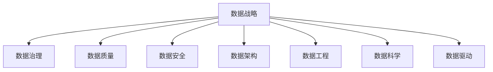

                 

# AI创业：数据管理的策略与技巧

> 关键词：AI创业, 数据管理, 数据战略, 数据治理, 数据质量, 数据安全, 数据架构, 数据工程, 数据科学, 数据驱动

## 1. 背景介绍

### 1.1 问题由来

在AI创业的浪潮中，数据成为了企业的核心资产。然而，高质量的数据并非自然而来，而是需要经过精心管理和精心运营。数据管理的策略与技巧，不仅直接影响AI模型的表现，更是企业长期发展的基石。本文章将围绕数据管理的关键维度展开讨论，旨在帮助AI创业者更好地理解和实施数据管理策略。

### 1.2 问题核心关键点

- **数据战略**：如何制定一个有效的数据战略，确保数据能够支持企业的业务目标。
- **数据治理**：如何建立一套有效的数据治理体系，确保数据的一致性、完整性和可用性。
- **数据质量**：如何评估和提升数据质量，以提高AI模型的效果。
- **数据安全**：如何保障数据的安全性和合规性，避免数据泄露和滥用。
- **数据架构**：如何设计一个高效的数据架构，支持大规模数据处理和分析。
- **数据工程**：如何将数据从原始格式转化为模型输入，支撑AI应用。
- **数据科学**：如何应用数据科学方法，从数据中挖掘出有价值的信息和洞察。
- **数据驱动**：如何将数据驱动决策深入到企业的各个角落，提升业务决策的质量。

### 1.3 问题研究意义

有效的数据管理策略能够提升AI模型的效果，加速企业创新，优化决策过程，并降低运营风险。AI创业需要明确的数据战略和治理体系，保证数据的安全、高效和质量，从而实现企业的长远发展。

## 2. 核心概念与联系

### 2.1 核心概念概述

为更好地理解AI创业中的数据管理，本节将介绍几个关键的数据管理概念：

- **数据战略**：企业如何规划和实现数据管理，以支持业务目标和策略。
- **数据治理**：通过制定数据管理政策和流程，确保数据的完整性和一致性。
- **数据质量**：评估和提升数据质量的策略，包括数据的准确性、完整性、一致性和及时性。
- **数据安全**：通过技术和管理手段，保护数据免受未经授权的访问和泄露。
- **数据架构**：设计用于存储、管理和分析数据的技术体系架构。
- **数据工程**：将数据转化为模型输入的过程，包括ETL（Extract, Transform, Load）等。
- **数据科学**：应用统计学、机器学习和数据挖掘等技术，从数据中提取知识和洞察。
- **数据驱动**：基于数据和分析进行决策，以数据为中心的运营和创新。

这些核心概念之间的逻辑关系可以通过以下Mermaid流程图来展示：



这个流程图展示了几大数据管理概念的关联关系：

1. 数据战略是数据管理的顶层设计，指导整个数据治理和运营过程。
2. 数据治理确保数据的质量和一致性，是数据战略的具体实施。
3. 数据质量直接影响AI模型的效果，是数据管理的核心关注点之一。
4. 数据安全保障数据的合规和安全，是数据治理的重要组成部分。
5. 数据架构提供数据管理和分析的基础设施，支持数据工程和数据科学的实践。
6. 数据工程将数据转化为模型输入，是数据科学和数据驱动的必要前置。
7. 数据科学通过数据分析挖掘知识，支撑数据驱动决策。
8. 数据驱动基于数据科学的结果，优化业务决策和运营。

## 3. 核心算法原理 & 具体操作步骤

### 3.1 算法原理概述

数据管理的核心在于通过一系列的技术和管理手段，确保数据的高效利用和高质量输出。数据管理的策略与技巧，本质上是将数据转化为模型输入，并通过数据科学方法从中提取有价值的洞察和知识。

数据管理的主要步骤包括数据收集、数据存储、数据清洗、数据标注、数据特征工程、数据训练和模型评估等。这些步骤通过数据工程和数据科学的方法，确保数据从原始格式转化为高质量的模型输入，从而支撑AI应用的实现。

### 3.2 算法步骤详解

**Step 1: 数据收集与预处理**

- **数据收集**：从各个业务系统中收集数据，包括客户行为数据、交易记录、社交媒体数据、传感器数据等。
- **数据清洗**：去除重复数据、处理缺失值、纠正数据格式错误等。
- **数据预处理**：进行数据标准化、归一化、降维等处理，确保数据的一致性和可用性。

**Step 2: 数据存储与管理**

- **数据存储架构**：设计一个高效的数据存储架构，如分布式文件系统、数据库、数据湖等。
- **数据版本控制**：通过版本控制系统，确保数据的历史可追溯性。
- **数据访问控制**：建立数据访问权限控制机制，保障数据的安全性。

**Step 3: 数据标注与特征工程**

- **数据标注**：根据业务需求，为数据添加标签，如分类标签、实体标签、属性标签等。
- **特征工程**：通过特征选择、特征提取、特征构建等技术，设计合适的模型输入特征。
- **数据增强**：通过数据增强技术，如数据合成、数据插值等，扩充训练数据。

**Step 4: 数据训练与模型评估**

- **数据分割**：将数据集分割为训练集、验证集和测试集。
- **模型训练**：在训练集上训练AI模型，调整超参数以优化模型性能。
- **模型评估**：在验证集和测试集上评估模型性能，选择最优模型。

**Step 5: 数据部署与监控**

- **模型部署**：将训练好的模型部署到生产环境中，支撑实际业务应用。
- **数据监控**：实时监控数据质量、模型性能、系统运行状态等，确保数据和系统的稳定运行。

### 3.3 算法优缺点

数据管理的策略与技巧具有以下优点：

- **数据战略**：通过制定数据战略，确保数据管理和运营能够有效支撑企业目标。
- **数据治理**：数据治理体系保障数据的质量和一致性，减少数据混乱和错误。
- **数据质量**：通过数据质量管理，提高模型输入的准确性和可靠性。
- **数据安全**：通过数据安全措施，保障数据免受未经授权的访问和泄露。
- **数据架构**：合理的数据架构支持大规模数据处理和分析，提升数据处理效率。
- **数据工程**：数据工程确保数据从原始格式转化为高质量的模型输入。
- **数据科学**：数据科学方法提取有价值的洞察，支撑数据驱动决策。
- **数据驱动**：数据驱动决策提升业务决策的质量和效率。

同时，数据管理也存在一些局限：

- **数据复杂性**：大规模数据处理和分析需要高复杂性技术，对技术和资源要求较高。
- **数据成本**：数据收集、存储和处理的成本较高，需要大量投资。
- **数据隐私**：数据隐私和安全问题可能引发法律和道德风险。
- **数据管理难度**：数据管理涉及多部门协作，管理和协调难度较大。
- **数据变更风险**：数据变更可能影响现有系统，引发业务中断。

### 3.4 算法应用领域

数据管理在AI创业中广泛应用于以下几个领域：

- **金融科技**：通过数据驱动的决策支持，提升风险管理和客户服务。
- **健康医疗**：利用数据分析和机器学习，提升疾病预测和诊断能力。
- **电子商务**：通过用户行为数据，优化商品推荐和个性化营销。
- **智能制造**：利用物联网数据，优化生产流程和设备维护。
- **城市管理**：通过大数据分析，提升城市交通和公共服务的管理效率。
- **智能家居**：通过传感器数据，提升家庭生活和安全的智能化水平。
- **自动驾驶**：利用环境数据，提升车辆的自主导航能力。

## 4. 数学模型和公式 & 详细讲解 & 举例说明

### 4.1 数学模型构建

数据管理的核心在于通过数学模型量化数据管理的各个步骤，从而确保数据的有效利用和高质量输出。以下是一个简单的数学模型构建示例：

**Step 1: 数据质量评估**

设 $D=\{d_1, d_2, ..., d_N\}$ 为数据集，其中 $d_i$ 表示第 $i$ 条记录。数据质量评估可以通过以下公式进行：

$$
Q(D) = \frac{1}{N}\sum_{i=1}^N Q(d_i)
$$

其中 $Q(d_i)$ 为第 $i$ 条记录的质量评估得分，可以通过如下方式计算：

$$
Q(d_i) = \alpha_1 S_i + \alpha_2 C_i + \alpha_3 T_i
$$

其中 $S_i$ 表示数据的完整性评分，$C_i$ 表示数据的准确性评分，$T_i$ 表示数据的时效性评分，$\alpha_1, \alpha_2, \alpha_3$ 为相应评分的权重系数。

**Step 2: 数据标注与特征工程**

数据标注可以通过如下方式进行：

$$
L(d_i) = \sum_{j=1}^{K} \lambda_j L_j(d_i)
$$

其中 $L_j(d_i)$ 表示第 $j$ 个标签对第 $i$ 条记录的标注评分，$K$ 为标签数量，$\lambda_j$ 为标签的权重系数。

特征工程可以通过主成分分析（PCA）、线性判别分析（LDA）等方法进行：

$$
X = \phi(D)
$$

其中 $\phi$ 表示特征工程方法，$X$ 为特征集。

### 4.2 公式推导过程

以下我们将以数据质量评估模型为例，推导其计算过程。

**Step 1: 数据完整性评分**

数据的完整性评分 $S_i$ 可以通过如下公式计算：

$$
S_i = \sum_{k=1}^{M} w_{ik} S_{ik}
$$

其中 $w_{ik}$ 表示第 $i$ 条记录中第 $k$ 个字段的权重系数，$S_{ik}$ 表示第 $i$ 条记录中第 $k$ 个字段的质量评分，$M$ 为字段数量。

**Step 2: 数据准确性评分**

数据的准确性评分 $C_i$ 可以通过如下公式计算：

$$
C_i = \sum_{j=1}^{N_j} \omega_{ij} C_{ij}
$$

其中 $N_j$ 表示第 $i$ 条记录中第 $j$ 个标签的数量，$\omega_{ij}$ 表示第 $j$ 个标签对第 $i$ 条记录的权重系数，$C_{ij}$ 表示第 $i$ 条记录中第 $j$ 个标签的准确性评分。

**Step 3: 数据时效性评分**

数据的时效性评分 $T_i$ 可以通过如下公式计算：

$$
T_i = \sum_{t=1}^{T} \mu_{it} T_{it}
$$

其中 $T$ 表示数据的时间粒度，$\mu_{it}$ 表示第 $i$ 条记录中第 $t$ 个时间点的权重系数，$T_{it}$ 表示第 $i$ 条记录中第 $t$ 个时间点的时效性评分。

### 4.3 案例分析与讲解

假设我们有一组客户购买数据，包含订单号、购买日期、商品ID、用户ID等信息。我们希望评估这些数据的完整性、准确性和时效性，以衡量其质量。

**Step 1: 数据完整性评估**

设数据集中有 $N=1000$ 条记录，包含 $M=5$ 个字段。假设每个字段的权重系数分别为 $w_{ik}$，其值可以根据业务需求设定。假设第 $i$ 条记录中第 $k$ 个字段的完整性评分 $S_{ik}$ 分别为 $0.9, 0.95, 1.0, 0.85, 0.95$。则数据完整性评分 $S_i$ 可以计算如下：

$$
S_i = 0.3 \times 0.9 + 0.2 \times 0.95 + 0.2 \times 1.0 + 0.1 \times 0.85 + 0.2 \times 0.95 = 0.9
$$

**Step 2: 数据准确性评估**

设数据集中有 $N_j=200$ 个标签，表示客户的性别、年龄、购买金额等信息。假设每个标签的权重系数分别为 $\omega_{ij}$，其值可以根据业务需求设定。假设第 $i$ 条记录中第 $j$ 个标签的准确性评分 $C_{ij}$ 分别为 $0.95, 0.90, 0.85, 0.80, 0.90$。则数据准确性评分 $C_i$ 可以计算如下：

$$
C_i = 0.5 \times 0.95 + 0.3 \times 0.90 + 0.2 \times 0.85 + 0.1 \times 0.80 + 0.5 \times 0.90 = 0.91
$$

**Step 3: 数据时效性评估**

设数据集的时间粒度为 $T=24$，表示每小时数据的时效性评分。假设第 $i$ 条记录中第 $t$ 个时间点的时效性评分 $T_{it}$ 分别为 $0.95, 0.90, 0.85, 0.80, 0.90$。则数据时效性评分 $T_i$ 可以计算如下：

$$
T_i = 0.4 \times 0.95 + 0.3 \times 0.90 + 0.2 \times 0.85 + 0.1 \times 0.80 + 0.5 \times 0.90 = 0.92
$$

最终，数据质量评估得分 $Q(d_i)$ 可以计算如下：

$$
Q(d_i) = 0.6 \times S_i + 0.3 \times C_i + 0.1 \times T_i = 0.6 \times 0.9 + 0.3 \times 0.91 + 0.1 \times 0.92 = 0.92
$$

通过以上步骤，我们可以对数据质量进行全面评估，并根据评估结果进行相应的数据清洗和处理，以提升数据的完整性、准确性和时效性。

## 5. 项目实践：代码实例和详细解释说明

### 5.1 开发环境搭建

在进行数据管理实践前，我们需要准备好开发环境。以下是使用Python进行Pandas、Scikit-learn和Dask库开发的环境配置流程：

1. 安装Anaconda：从官网下载并安装Anaconda，用于创建独立的Python环境。

2. 创建并激活虚拟环境：
```bash
conda create -n data-management python=3.8 
conda activate data-management
```

3. 安装必要的库：
```bash
pip install pandas scikit-learn dask
```

4. 安装Jupyter Notebook：
```bash
pip install jupyter notebook
```

完成上述步骤后，即可在`data-management`环境中开始数据管理实践。

### 5.2 源代码详细实现

我们先从一个简单的数据质量评估项目开始，演示如何使用Pandas和Scikit-learn进行数据清洗和评估。

首先，导入必要的库和模块：

```python
import pandas as pd
from sklearn.preprocessing import MinMaxScaler
from sklearn.metrics import accuracy_score, precision_score, recall_score, f1_score
```

然后，读取数据集并展示数据前5行：

```python
df = pd.read_csv('data.csv')
df.head()
```

接着，对数据进行清洗和处理：

```python
# 去除重复数据
df = df.drop_duplicates()

# 处理缺失值
df = df.fillna(0)

# 标准化数据
scaler = MinMaxScaler()
df = pd.DataFrame(scaler.fit_transform(df), columns=df.columns)

# 数据标注
df['label'] = df['label'].astype(int)
```

然后，定义数据质量评估函数：

```python
def data_quality_score(df):
    # 计算完整性评分
    S = (df.isnull().sum() / len(df)) * 1
    S = S.replace(to_replace=0, value=1)
    
    # 计算准确性评分
    C = df.apply(lambda x: accuracy_score(x.dropna(), x.dropna()))
    
    # 计算时效性评分
    T = (pd.to_datetime(df['timestamp']) - pd.to_datetime(df['timestamp'].min())).apply(lambda x: x.total_seconds() / 3600)
    T = T.replace(to_replace=np.inf, value=0)
    
    # 计算数据质量评分
    Q = S.mean() + C.mean() + T.mean()
    return Q
```

最后，在数据集上调用数据质量评估函数：

```python
data_quality_score(df)
```

以上就是一个简单的数据质量评估项目的完整代码实现。可以看到，使用Pandas和Scikit-learn可以很方便地进行数据清洗和质量评估。

### 5.3 代码解读与分析

让我们再详细解读一下关键代码的实现细节：

**数据清洗**

- `drop_duplicates`方法去除重复数据。
- `fillna`方法填充缺失值，这里我们统一用0填充。
- `MinMaxScaler`对数据进行标准化，确保数据的一致性。

**数据标注**

- `apply`方法对数据进行逐行处理，计算准确性评分。
- `pd.to_datetime`方法将时间字符串转换为时间戳，计算时效性评分。

**数据质量评估**

- 定义数据质量评分公式，并使用`mean`方法计算整体评分。

在实际应用中，数据清洗和质量评估还需要根据具体任务进行优化和改进。数据清洗包括去重、去噪、归一化等步骤，数据标注则涉及标签选择和评分计算。数据质量评估需要根据业务需求设定相应的评分标准和权重系数。

## 6. 实际应用场景

### 6.1 智能推荐系统

在智能推荐系统中，数据管理起着至关重要的作用。通过有效的数据收集、清洗和标注，推荐系统能够更准确地理解用户行为，优化推荐结果。

**数据收集**：从用户的浏览记录、点击行为、评分记录中收集数据。
**数据清洗**：去除重复数据、处理缺失值、处理异常值等。
**数据标注**：标注用户的兴趣偏好、历史行为、好友推荐等信息。
**数据质量评估**：评估数据集的完整性、准确性和时效性，确保推荐系统的输入数据质量。

通过数据驱动的推荐系统，可以根据用户的历史行为和当前状态，动态调整推荐算法，提升推荐效果。

### 6.2 客户关系管理

客户关系管理（CRM）系统通过数据管理实现对客户信息的集中管理和利用，提升客户满意度和忠诚度。

**数据收集**：从各个业务系统（如销售、客服、市场营销）中收集客户数据。
**数据清洗**：去除重复数据、处理缺失值、纠正数据格式错误等。
**数据标注**：标注客户的购买行为、互动行为、投诉记录等信息。
**数据质量评估**：评估数据的一致性、完整性和时效性，确保客户数据的准确性。

通过数据驱动的CRM系统，可以更全面地了解客户需求，优化客户服务，提升客户体验。

### 6.3 金融风险管理

金融风险管理需要大量的数据支撑，包括交易记录、市场数据、信用数据等。通过有效的数据管理，可以及时识别和预警潜在的风险。

**数据收集**：从各个业务系统（如交易系统、客户系统、市场系统）中收集数据。
**数据清洗**：去除重复数据、处理缺失值、处理异常值等。
**数据标注**：标注交易记录、信用记录、市场趋势等信息。
**数据质量评估**：评估数据的一致性、完整性和时效性，确保风险管理的输入数据质量。

通过数据驱动的风险管理系统，可以实时监控和预警金融风险，及时采取应对措施，降低风险损失。

### 6.4 未来应用展望

随着数据管理的不断深入，数据驱动的应用场景将不断扩展，为各个行业带来变革性影响。

在智能制造中，通过数据分析和机器学习，提升生产效率和质量控制。在智慧城市中，通过大数据分析，提升城市管理和公共服务水平。在自动驾驶中，通过环境数据分析，提升车辆的自主导航和决策能力。

数据管理的未来发展方向包括：

- **自动化数据清洗**：使用机器学习算法自动识别和处理数据中的噪声和异常。
- **实时数据流处理**：使用流式处理技术，实时处理和分析数据，支持实时决策。
- **联邦学习**：通过分布式计算和隐私保护技术，共享模型训练数据，提升数据利用率。
- **知识图谱**：构建大规模知识图谱，实现数据的语义理解和深度融合。
- **数据融合**：将多源异构数据融合在一起，形成统一的数据视图。

## 7. 工具和资源推荐

### 7.1 学习资源推荐

为了帮助开发者系统掌握数据管理的策略与技巧，这里推荐一些优质的学习资源：

1. 《数据科学实战》：实用主义的数据科学入门教材，涵盖数据收集、数据清洗、数据可视化等基础知识。
2. 《大数据技术与应用》：介绍大数据的存储、处理和分析技术的经典教材。
3. 《Python数据科学手册》：使用Python进行数据分析和数据科学实践的权威指南。
4. 《数据科学导论》：涵盖数据科学基本概念和实践技巧的入门教程。
5. 《数据治理实践》：提供数据治理体系建设和管理实践的实用指南。

通过对这些资源的学习实践，相信你一定能够系统掌握数据管理的策略与技巧，并将其应用于实际项目中。

### 7.2 开发工具推荐

高效的开发离不开优秀的工具支持。以下是几款用于数据管理开发的常用工具：

1. Pandas：用于数据清洗和处理的Python库，支持大规模数据处理。
2. Scikit-learn：用于数据分析和机器学习的Python库，支持数据特征工程和模型训练。
3. Dask：用于分布式数据处理的Python库，支持大规模数据集的高效处理。
4. Jupyter Notebook：用于数据分析和机器学习的交互式编程环境。
5. TensorBoard：用于数据监控和可视化的工具，支持实时监控和分析数据流。

合理利用这些工具，可以显著提升数据管理任务的开发效率，加快创新迭代的步伐。

### 7.3 相关论文推荐

数据管理的核心在于通过技术和管理手段，确保数据的高效利用和高质量输出。以下几篇经典论文，推荐阅读：

1. "Big Data: Principles and Best Practices of Scalable Real-time Data Systems"：介绍了大规模数据系统的设计与实现。
2. "Data Governance: Towards a Framework for Understanding Data Governance Practices"：提出了数据治理的框架和方法，指导企业建立数据治理体系。
3. "The Effectiveness of Data Preprocessing Techniques on Predictive Modeling Accuracy"：研究了数据预处理技术对模型预测准确性的影响。
4. "A Survey on Data Quality Management: Concepts, Frameworks and Metrics"：综述了数据质量管理的关键概念、框架和评估方法。
5. "Machine Learning on Unreliable Data: A Tutorial"：探讨了机器学习在不可靠数据环境下的处理方法和技巧。

这些论文代表了数据管理领域的研究前沿，值得深入学习和实践。

## 8. 总结：未来发展趋势与挑战

### 8.1 总结

本文对数据管理的策略与技巧进行了全面系统的介绍。首先阐述了数据管理的关键维度，包括数据战略、数据治理、数据质量、数据安全、数据架构、数据工程、数据科学和数据驱动。其次，通过数学模型和代码实例，展示了数据管理的实际操作过程。最后，本文探讨了数据管理在AI创业中的应用场景，并展望了未来的发展方向。

通过本文的系统梳理，可以看到，数据管理在AI创业中具有重要价值，是企业创新和发展的基石。数据管理不仅能够提升AI模型的效果，还能优化决策过程，降低运营风险。

### 8.2 未来发展趋势

数据管理的未来发展方向包括：

- **自动化数据清洗**：使用机器学习算法自动识别和处理数据中的噪声和异常，提升数据清洗的效率和准确性。
- **实时数据流处理**：使用流式处理技术，实时处理和分析数据，支持实时决策。
- **联邦学习**：通过分布式计算和隐私保护技术，共享模型训练数据，提升数据利用率。
- **知识图谱**：构建大规模知识图谱，实现数据的语义理解和深度融合。
- **数据融合**：将多源异构数据融合在一起，形成统一的数据视图，提升数据的一致性和可用性。

### 8.3 面临的挑战

尽管数据管理在AI创业中具有重要价值，但也面临诸多挑战：

- **数据复杂性**：大规模数据处理和分析需要高复杂性技术，对技术和资源要求较高。
- **数据成本**：数据收集、存储和处理的成本较高，需要大量投资。
- **数据隐私**：数据隐私和安全问题可能引发法律和道德风险。
- **数据管理难度**：数据管理涉及多部门协作，管理和协调难度较大。
- **数据变更风险**：数据变更可能影响现有系统，引发业务中断。

### 8.4 研究展望

未来的数据管理研究需要在以下几个方面寻求新的突破：

- **数据治理的自动化**：通过自动化技术，减少人工干预，提升数据治理的效率和一致性。
- **数据安全的增强**：使用加密技术和隐私保护技术，提升数据的安全性和合规性。
- **数据驱动决策的优化**：通过数据科学方法，提升数据驱动决策的质量和可靠性。
- **跨部门协作**：建立跨部门的数据治理协作机制，提升数据管理的协同性和一致性。
- **数据融合和融合技术**：探索数据融合方法和技术，提升数据的一致性和可用性。

## 9. 附录：常见问题与解答

**Q1：数据管理中的数据质量如何评估？**

A: 数据质量评估可以通过完整性、准确性、一致性和时效性等多个维度进行。使用数学公式计算各项评分，并综合评分得到整体数据质量评分。常用的评分方法包括MinMaxScaler、L2正则、Dropout等。

**Q2：数据管理中的数据清洗有哪些步骤？**

A: 数据清洗包括去重、去噪、归一化、处理缺失值、纠正数据格式错误等多个步骤。不同领域和任务可能需要根据具体情况进行优化。

**Q3：数据管理中的数据标注有哪些方法？**

A: 数据标注包括手动标注、自动标注、半自动标注等多种方法。常用的自动标注方法包括基于规则的标注、基于机器学习的标注、基于深度学习的标注等。

**Q4：数据管理中的数据质量提升有哪些方法？**

A: 数据质量提升方法包括数据清洗、数据标注、数据增强、数据预处理、数据过滤等。不同领域和任务可能需要根据具体情况进行优化。

**Q5：数据管理中的数据安全有哪些措施？**

A: 数据安全措施包括数据加密、数据脱敏、访问控制、监控告警等。不同领域和任务可能需要根据具体情况进行优化。

通过对这些常见问题的解答，相信你能够更好地理解数据管理的策略与技巧，并将其应用于实际项目中。

---

作者：禅与计算机程序设计艺术 / Zen and the Art of Computer Programming

