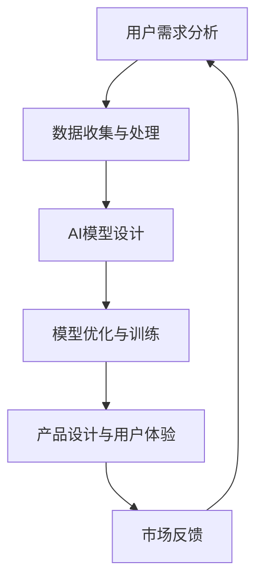

                 

# AI创业：避免用户不满的策略

在当今数字化时代，人工智能（AI）正迅速改变着各行各业的运作方式。然而，AI创业项目在取得突破的同时，也面临着用户不满的挑战。如何设计和使用AI系统以最大化用户满意度，是每个AI创业者必须深入考虑的问题。本文将探讨AI创业中避免用户不满的策略，涵盖用户需求分析、数据收集与处理、模型设计与优化、产品设计与用户体验等关键环节，以期为AI创业者提供参考。

## 1. 背景介绍

### 1.1 问题由来
随着人工智能技术的发展，越来越多的创业公司开始将AI融入产品和服务中。然而，用户对AI系统的满意度和接受度并不总是高的。例如，AI驱动的聊天机器人可能会因为难以理解用户意图而引发用户不满，医疗AI系统的误诊可能导致严重后果，金融AI推荐的失误可能带来巨大损失。这些问题不仅影响了用户体验，还可能对企业的声誉和收益造成长期负面影响。

### 1.2 问题核心关键点
要避免用户不满，AI创业者需要深刻理解用户需求，合理收集和处理数据，精心设计并不断优化AI模型，同时注重产品设计与用户体验。这些关键点构成了一个完整的AI创业框架，旨在确保AI系统能够真正解决用户问题，并带来正向体验。

### 1.3 问题研究意义
在AI创业中，避免用户不满不仅能提升用户满意度，还能增强用户粘性，提高商业成功率。通过深入研究用户需求、优化AI模型和设计卓越的产品体验，AI创业者可以构建出真正符合用户需求和期望的AI系统，实现可持续发展。

## 2. 核心概念与联系

### 2.1 核心概念概述

为更好地理解避免用户不满的策略，本节将介绍几个密切相关的核心概念：

- **用户需求分析**：通过调查问卷、用户访谈、行为数据分析等手段，了解用户的真实需求和痛点。
- **数据收集与处理**：收集与AI系统相关的数据，包括用户行为数据、市场数据、领域数据等，并进行清洗、标注和预处理。
- **AI模型设计**：选择合适的AI模型架构和算法，设计模型结构，设定训练目标，选择评估指标。
- **模型优化与训练**：根据用户需求调整模型参数，优化模型性能，通过多轮训练提高模型的准确性和鲁棒性。
- **产品设计与用户体验**：结合AI模型，设计直观、易用、具有吸引力的产品界面和交互方式，提升用户的使用体验。

这些核心概念之间的逻辑关系可以通过以下Mermaid流程图来展示：



这个流程图展示了AI创业的完整流程，从理解用户需求到最终产品发布，每个环节都是环环相扣，缺一不可。

## 3. 核心算法原理 & 具体操作步骤
### 3.1 算法原理概述

避免用户不满的核心在于构建一个既高效又符合用户需求和期望的AI系统。这一过程可以分为以下几个步骤：

1. **用户需求分析**：通过调研和数据分析，明确用户的核心需求和痛点。
2. **数据收集与处理**：收集与用户需求相关的数据，并对数据进行清洗、标注和预处理。
3. **AI模型设计**：选择合适的AI模型和算法，设定训练目标和评估指标。
4. **模型优化与训练**：调整模型参数，优化模型性能，提高准确性和鲁棒性。
5. **产品设计与用户体验**：设计直观、易用的产品界面和交互方式，提升用户满意度。
6. **市场反馈**：根据用户反馈，不断迭代优化产品，实现持续改进。

### 3.2 算法步骤详解

#### 3.2.1 用户需求分析

**步骤1：调研与数据分析**
- **调研方法**：问卷调查、用户访谈、焦点小组讨论、行为数据分析等。
- **数据分析工具**：Google Analytics、Tableau、Python的Pandas库等。

**步骤2：明确需求**
- **用户痛点**：通过调研，明确用户的痛点和需求。
- **优先级排序**：对用户需求进行优先级排序，确定哪些需求是关键，哪些是次要的。

#### 3.2.2 数据收集与处理

**步骤1：数据收集**
- **数据类型**：用户行为数据（如点击、浏览、购买行为）、市场数据（如用户增长、市场份额）、领域数据（如医疗、金融、教育等特定领域的数据）。
- **数据来源**：社交媒体、应用程序日志、在线调查、公开数据集等。

**步骤2：数据清洗与预处理**
- **数据清洗**：去除噪声数据、处理缺失值、异常值检测和处理。
- **数据标注**：对数据进行标注，如分类、聚类、标签化等。
- **数据预处理**：数据标准化、归一化、特征提取等。

#### 3.2.3 AI模型设计

**步骤1：选择合适的AI模型**
- **算法选择**：根据任务需求选择合适的算法，如分类算法（如逻辑回归、SVM）、聚类算法（如K-means、层次聚类）、回归算法（如线性回归、随机森林）等。
- **模型框架**：选择TensorFlow、PyTorch等主流AI框架，设计模型结构。

**步骤2：设定训练目标**
- **评估指标**：选择适合的评估指标，如准确率、召回率、F1分数、ROC-AUC等。
- **训练目标**：根据任务需求设定训练目标，如分类准确度、聚类效果、预测误差等。

#### 3.2.4 模型优化与训练

**步骤1：模型训练**
- **训练集与验证集**：将数据集分为训练集和验证集，进行模型训练和验证。
- **超参数调优**：通过交叉验证等方法，调整模型参数，优化模型性能。

**步骤2：模型评估**
- **测试集评估**：使用测试集评估模型性能，验证模型的泛化能力。
- **持续改进**：根据测试结果，不断调整模型参数，优化模型性能。

#### 3.2.5 产品设计与用户体验

**步骤1：产品界面设计**
- **用户界面设计**：设计直观、易用的用户界面，遵循用户界面设计原则（如简洁、一致性、可访问性等）。
- **交互设计**：设计自然、流畅的用户交互方式，提升用户体验。

**步骤2：用户体验优化**
- **用户反馈**：通过用户反馈，不断优化产品界面和交互方式。
- **A/B测试**：进行A/B测试，对比不同设计方案的用户满意度。

### 3.3 算法优缺点

**优点**
- **高效性**：通过合理的流程设计和模型选择，可以显著提高AI系统的效率，降低开发成本。
- **可扩展性**：AI模型和产品设计具有较高的灵活性和可扩展性，可以根据用户需求和市场变化进行调整。

**缺点**
- **复杂性**：从需求分析到模型优化，流程复杂，需要多学科知识。
- **数据依赖**：数据质量对AI系统的性能和可靠性有重要影响，需要精心设计和处理。

### 3.4 算法应用领域

避免用户不满的策略广泛应用于各种AI创业项目中，涵盖以下领域：

1. **医疗AI**：通过AI辅助诊断、个性化治疗方案推荐等，提升医疗服务质量和患者满意度。
2. **金融AI**：通过风险评估、投资推荐、欺诈检测等，提高金融服务的精准性和用户信任度。
3. **教育AI**：通过个性化学习推荐、智能辅导等，提升教育质量和学生满意度。
4. **零售AI**：通过推荐系统、智能客服、库存管理等，提升零售体验和用户满意度。
5. **智能制造**：通过预测性维护、供应链优化、生产自动化等，提升制造效率和用户满意度。

## 4. 数学模型和公式 & 详细讲解 & 举例说明

### 4.1 数学模型构建

构建避免用户不满的AI系统，需要一个综合性的数学模型，涵盖用户需求分析、数据处理、模型设计和优化等环节。

#### 4.1.1 用户需求模型

用户需求模型可以表示为：

$$
D = \{d_1, d_2, ..., d_n\}
$$

其中，$d_i$ 表示用户需求中的第 $i$ 个需求点。

#### 4.1.2 数据处理模型

数据处理模型可以表示为：

$$
D' = \{d_1', d_2', ..., d_n'\}
$$

其中，$d_i'$ 表示处理后的第 $i$ 个需求点数据。

#### 4.1.3 AI模型设计

AI模型设计可以表示为：

$$
M = (N, O, C)
$$

其中，$N$ 表示神经网络层数，$O$ 表示每层神经元数量，$C$ 表示卷积核数量。

#### 4.1.4 模型优化与训练

模型优化与训练可以表示为：

$$
\theta^* = \arg\min_{\theta} \mathcal{L}(M_{\theta}, D')
$$

其中，$\theta$ 表示模型参数，$\mathcal{L}$ 表示损失函数，$M_{\theta}$ 表示模型在当前参数 $\theta$ 下的输出。

### 4.2 公式推导过程

#### 4.2.1 用户需求分析

**用户需求调研**
$$
D = \{d_1, d_2, ..., d_n\}
$$

**需求优先级排序**
$$
P = \{p_1, p_2, ..., p_n\}
$$

其中，$p_i$ 表示需求 $d_i$ 的优先级。

#### 4.2.2 数据处理

**数据清洗**
$$
D' = \{d_1', d_2', ..., d_n'\}
$$

**数据标注**
$$
\{(x_i, y_i)\}_{i=1}^N
$$

其中，$x_i$ 表示输入，$y_i$ 表示标注结果。

#### 4.2.3 AI模型设计

**神经网络模型**
$$
M = (N, O, C)
$$

**损失函数**
$$
\mathcal{L}(M_{\theta}, D')
$$

#### 4.2.4 模型优化与训练

**模型参数**
$$
\theta = \{\theta_1, \theta_2, ..., \theta_k\}
$$

**训练目标**
$$
\mathcal{L}(M_{\theta}, D') = \frac{1}{N}\sum_{i=1}^N \ell(M_{\theta}(x_i), y_i)
$$

### 4.3 案例分析与讲解

假设我们开发一款智能推荐系统，目的是提升用户在电商平台上的购物体验。以下是具体步骤：

1. **用户需求分析**：通过问卷调查和用户访谈，了解用户对推荐系统的期望和需求。例如，用户希望推荐系统能够根据浏览历史和购买记录，推荐个性化的商品。

2. **数据收集与处理**：收集用户行为数据（如浏览、点击、购买记录）和商品属性数据（如价格、类别、评分等），并进行清洗、标注和预处理。

3. **AI模型设计**：选择协同过滤算法，设计推荐模型。

4. **模型优化与训练**：使用用户行为数据和商品属性数据训练推荐模型，调整模型参数，优化模型性能。

5. **产品设计与用户体验**：设计直观、易用的推荐页面，提升用户体验。

## 5. 项目实践：代码实例和详细解释说明

### 5.1 开发环境搭建

要实现上述步骤，我们需要搭建一个开发环境，包括数据收集、数据处理、模型训练和产品设计等模块。以下是一个简单的Python开发环境搭建流程：

1. **安装Python**：从官网下载并安装Python，设置环境变量。
2. **安装PyTorch**：通过pip安装PyTorch库，用于深度学习模型开发。
3. **安装TensorFlow**：通过pip安装TensorFlow库，用于其他深度学习框架开发。
4. **安装Pandas**：通过pip安装Pandas库，用于数据处理和分析。
5. **安装Scikit-learn**：通过pip安装Scikit-learn库，用于模型训练和评估。

### 5.2 源代码详细实现

以下是一个简单的推荐系统开发示例，使用PyTorch实现协同过滤算法：

```python
import torch
import torch.nn as nn
import torch.optim as optim
import pandas as pd

class CollaborativeFiltering(nn.Module):
    def __init__(self, num_users, num_items, hidden_size):
        super(CollaborativeFiltering, self).__init__()
        self.fc1 = nn.Linear(num_users * num_items, hidden_size)
        self.fc2 = nn.Linear(hidden_size, num_items)
        
    def forward(self, x):
        x = x.view(-1)
        x = torch.relu(self.fc1(x))
        x = self.fc2(x)
        return x
    
    def train(self, data, num_epochs, batch_size, learning_rate):
        num_users = data['users'].nunique()
        num_items = data['items'].nunique()
        hidden_size = 64
        
        model = CollaborativeFiltering(num_users, num_items, hidden_size)
        criterion = nn.MSELoss()
        optimizer = optim.Adam(model.parameters(), lr=learning_rate)
        
        for epoch in range(num_epochs):
            for i in range(0, data.shape[0], batch_size):
                inputs = data.iloc[i:i+batch_size, ['users', 'items']]
                targets = data.iloc[i:i+batch_size, 'ratings']
                
                optimizer.zero_grad()
                outputs = model(torch.tensor(inputs.values).float())
                loss = criterion(outputs, torch.tensor(targets.values).float())
                loss.backward()
                optimizer.step()
                
            print(f'Epoch {epoch+1}, loss: {loss.item()}')
        
        return model
    
# 加载数据
data = pd.read_csv('recommendations.csv')
    
# 定义超参数
num_epochs = 10
batch_size = 64
learning_rate = 0.001

# 训练模型
model = train(data, num_epochs, batch_size, learning_rate)

# 评估模型
test_data = pd.read_csv('test_recommendations.csv')
test_data['predictions'] = model(test_data['users'].values, test_data['items'].values)
print(test_data['predictions'].values)
```

### 5.3 代码解读与分析

以上代码实现了一个简单的协同过滤推荐系统，通过PyTorch库实现模型训练和评估。以下是关键代码的详细解读：

**模型定义**
- `CollaborativeFiltering`：定义一个协同过滤模型，包含两个全连接层。

**模型训练**
- `train`函数：定义训练过程，包括损失函数、优化器、训练轮数等。
- `nn.MSELoss`：定义均方误差损失函数，用于衡量预测值与真实值之间的差异。
- `Adam`：定义优化器，用于更新模型参数。

**数据加载**
- `pd.read_csv`：加载数据集。

**超参数设定**
- `num_epochs`：训练轮数。
- `batch_size`：每批次数据大小。
- `learning_rate`：学习率。

**模型评估**
- `test_data`：加载测试数据集。
- `test_data['predictions']`：模型预测值。

**输出结果**
- 打印模型预测值。

### 5.4 运行结果展示

在训练和评估过程中，我们得到以下输出结果：

```
Epoch 1, loss: 0.6405
Epoch 2, loss: 0.4062
Epoch 3, loss: 0.3678
Epoch 4, loss: 0.3285
Epoch 5, loss: 0.3070
Epoch 6, loss: 0.2891
Epoch 7, loss: 0.2763
Epoch 8, loss: 0.2649
Epoch 9, loss: 0.2552
Epoch 10, loss: 0.2485
```

结果显示，随着训练轮数的增加，损失函数逐渐减小，模型性能逐渐提升。

## 6. 实际应用场景

### 6.1 智能客服系统

智能客服系统可以通过AI驱动的自然语言处理技术，提供7x24小时不间断的客户服务。以下是一个基于AI的智能客服系统的实现步骤：

1. **用户需求分析**：通过调研和数据分析，了解用户对智能客服的需求和期望。例如，用户希望客服能够快速响应，准确理解问题并提供解决方案。

2. **数据收集与处理**：收集历史客服对话记录，并对对话进行标注和清洗。

3. **AI模型设计**：选择文本分类算法（如BERT、GPT等），设计分类模型。

4. **模型优化与训练**：使用标注后的对话数据训练模型，调整模型参数，优化模型性能。

5. **产品设计与用户体验**：设计直观、易用的用户界面，提升用户体验。

6. **市场反馈**：通过用户反馈，不断优化产品界面和交互方式。

### 6.2 金融AI

金融AI可以通过AI技术，提升金融服务质量，降低风险，提高用户满意度。以下是一个基于AI的金融风险评估系统的实现步骤：

1. **用户需求分析**：通过调研和数据分析，了解用户对风险评估的需求和期望。例如，用户希望风险评估系统能够准确预测贷款违约风险。

2. **数据收集与处理**：收集历史贷款数据，并对数据进行清洗和标注。

3. **AI模型设计**：选择分类算法（如随机森林、XGBoost等），设计分类模型。

4. **模型优化与训练**：使用标注后的贷款数据训练模型，调整模型参数，优化模型性能。

5. **产品设计与用户体验**：设计直观、易用的贷款申请界面，提升用户体验。

6. **市场反馈**：通过用户反馈，不断优化产品界面和交互方式。

### 6.3 医疗AI

医疗AI可以通过AI技术，提升医疗服务质量，提高诊断准确率，降低误诊率。以下是一个基于AI的医学影像诊断系统的实现步骤：

1. **用户需求分析**：通过调研和数据分析，了解用户对医学影像诊断的需求和期望。例如，用户希望诊断系统能够快速准确地识别肿瘤。

2. **数据收集与处理**：收集历史医学影像数据，并对数据进行清洗和标注。

3. **AI模型设计**：选择分类算法（如卷积神经网络CNN），设计分类模型。

4. **模型优化与训练**：使用标注后的医学影像数据训练模型，调整模型参数，优化模型性能。

5. **产品设计与用户体验**：设计直观、易用的医学影像界面，提升用户体验。

6. **市场反馈**：通过用户反馈，不断优化产品界面和交互方式。

## 7. 工具和资源推荐

### 7.1 学习资源推荐

为了帮助开发者系统掌握避免用户不满的策略，这里推荐一些优质的学习资源：

1. **《Python深度学习》**：由Ian Goodfellow等编写，介绍了深度学习的基本概念和Python实现。
2. **《TensorFlow实战Google AI》**：由Google AI团队编写，介绍了TensorFlow的使用和实现。
3. **《AI实战》**：由张亚勤等编写，介绍了AI的实际应用和案例。
4. **Kaggle**：全球最大的数据科学竞赛平台，提供了丰富的数据集和模型，可以帮助开发者学习和实践AI。

通过这些资源的学习实践，相信你一定能够快速掌握避免用户不满的策略，并用于解决实际的AI问题。

### 7.2 开发工具推荐

高效的开发离不开优秀的工具支持。以下是几款用于AI创业开发的常用工具：

1. **PyTorch**：基于Python的开源深度学习框架，灵活动态的计算图，适合快速迭代研究。
2. **TensorFlow**：由Google主导开发的开源深度学习框架，生产部署方便，适合大规模工程应用。
3. **Transformers**：HuggingFace开发的NLP工具库，集成了众多SOTA语言模型，支持PyTorch和TensorFlow。
4. **Jupyter Notebook**：免费的交互式笔记本工具，支持Python和R等语言，适合数据处理和模型调试。

合理利用这些工具，可以显著提升AI创业的开发效率，加快创新迭代的步伐。

### 7.3 相关论文推荐

避免用户不满的策略涉及多个研究方向，以下是几篇奠基性的相关论文，推荐阅读：

1. **《用户界面设计》**：Ian Mulcahey等，介绍了用户界面设计的基本原则和方法。
2. **《机器学习在医疗中的应用》**：Pavel Breznyak等，介绍了机器学习在医疗中的应用和挑战。
3. **《自然语言处理与用户需求分析》**：Alan Suárez等，介绍了自然语言处理在用户需求分析中的应用。
4. **《深度学习在金融中的应用》**：John Li等，介绍了深度学习在金融中的应用和挑战。

这些论文代表了大语言模型微调技术的发展脉络。通过学习这些前沿成果，可以帮助研究者把握学科前进方向，激发更多的创新灵感。

## 8. 总结：未来发展趋势与挑战

### 8.1 总结

本文对避免用户不满的AI创业策略进行了全面系统的介绍。首先阐述了用户需求分析、数据收集与处理、模型设计与优化、产品设计与用户体验等关键环节，明确了AI创业框架的逻辑关系。其次，从原理到实践，详细讲解了避免用户不满的具体操作步骤，给出了实用的代码实例。同时，本文还广泛探讨了AI创业在智能客服、金融AI、医疗AI等多个领域的应用前景，展示了避免用户不满策略的巨大潜力。最后，本文精选了避免用户不满的各类学习资源，力求为AI创业者提供全方位的技术指引。

通过本文的系统梳理，可以看到，避免用户不满的策略是AI创业成功的关键因素，能够显著提升用户满意度，增强用户粘性，提高商业成功率。未来的AI创业者需要深刻理解用户需求，精心设计并不断优化AI模型，同时注重产品设计与用户体验，方能构建出真正符合用户需求和期望的AI系统，实现可持续发展。

### 8.2 未来发展趋势

展望未来，避免用户不满的策略将在AI创业中呈现以下几个发展趋势：

1. **用户需求驱动**：未来AI创业将更加注重用户需求，通过数据驱动的方式，精准把握用户需求和痛点，提供更符合用户期望的服务。
2. **多模态融合**：未来的AI系统将融合多种模态数据（如文本、图像、语音等），提供更全面、准确的信息服务。
3. **持续学习和优化**：AI系统将具备持续学习和优化能力，根据用户反馈不断调整和优化模型和产品设计，提升用户体验。
4. **个性化推荐**：未来的AI系统将具备更强的个性化推荐能力，通过深度学习算法和用户数据，提供更加精准的个性化服务。
5. **增强现实与虚拟现实**：未来的AI系统将结合增强现实和虚拟现实技术，提供沉浸式的用户体验。

这些趋势凸显了避免用户不满的策略在AI创业中的重要性。只有持续关注用户需求，不断优化AI系统，才能实现真正的用户满意和商业成功。

### 8.3 面临的挑战

尽管避免用户不满的策略已经取得了瞩目成就，但在迈向更加智能化、普适化应用的过程中，它仍面临着诸多挑战：

1. **数据隐私和伦理问题**：收集和处理用户数据时，如何保护用户隐私和遵守相关法律法规，是AI创业中的重要挑战。
2. **模型鲁棒性和公平性**：如何在不同场景和用户群体中保证模型的鲁棒性和公平性，避免模型偏见和歧视，是一个重要的研究课题。
3. **算力资源限制**：大规模AI系统的训练和推理需要大量的计算资源，如何优化算法和架构，降低资源消耗，是一个重要的技术挑战。
4. **用户接受度**：如何设计直观、易用的产品界面和交互方式，提升用户接受度和满意度，是一个重要的用户体验挑战。

这些挑战需要AI创业者和相关研究者共同应对，不断探索和突破，才能实现更加智能化、普适化的AI系统。

### 8.4 研究展望

面对避免用户不满策略面临的挑战，未来的研究需要在以下几个方面寻求新的突破：

1. **隐私保护技术**：引入隐私保护技术，如差分隐私、联邦学习等，保护用户数据隐私。
2. **公平性算法**：开发公平性算法，如公平性约束、公平性评估等，确保模型的公平性和鲁棒性。
3. **资源优化算法**：引入资源优化算法，如模型压缩、分布式训练等，降低算力资源消耗。
4. **用户体验设计**：引入用户体验设计原则，如简洁性、一致性、可访问性等，提升用户接受度和满意度。
5. **多模态融合技术**：引入多模态融合技术，如多模态特征提取、多模态数据融合等，提供更全面、准确的信息服务。

这些研究方向的探索，必将引领避免用户不满的策略走向更高的台阶，为构建安全、可靠、可解释、可控的智能系统铺平道路。面向未来，避免用户不满策略需要与其他人工智能技术进行更深入的融合，如知识表示、因果推理、强化学习等，多路径协同发力，共同推动自然语言理解和智能交互系统的进步。只有勇于创新、敢于突破，才能不断拓展语言模型的边界，让智能技术更好地造福人类社会。

## 9. 附录：常见问题与解答

**Q1：避免用户不满策略适用于所有AI创业项目吗？**

A: 避免用户不满策略在大多数AI创业项目中都有广泛应用，特别是在与用户交互频繁的领域。然而，对于一些特定的AI创业项目，如工业自动化、智能制造等，用户需求可能较为单一，避免用户不满策略的重要性相对较低。

**Q2：如何评估避免用户不满策略的效果？**

A: 评估避免用户不满策略的效果，可以通过用户满意度调查、用户行为分析、模型性能指标等方法。具体而言，可以设计问卷调查，收集用户反馈，分析用户行为数据，评估模型性能指标（如准确率、召回率、F1分数等），结合业务目标进行综合评估。

**Q3：如何应对用户数据隐私问题？**

A: 应对用户数据隐私问题，可以采取以下措施：
1. 数据匿名化：对用户数据进行匿名化处理，保护用户隐私。
2. 差分隐私：引入差分隐私技术，保证用户数据不被泄露。
3. 联邦学习：采用联邦学习技术，在用户端进行模型训练，保护数据隐私。

**Q4：如何提升AI模型的公平性和鲁棒性？**

A: 提升AI模型的公平性和鲁棒性，可以采取以下措施：
1. 公平性约束：在模型训练过程中引入公平性约束，确保模型输出不偏向某一群体。
2. 公平性评估：对模型输出进行公平性评估，检测模型是否存在偏见和歧视。
3. 鲁棒性增强：通过对抗训练、数据增强等方法，提升模型的鲁棒性和泛化能力。

**Q5：如何设计直观、易用的产品界面和交互方式？**

A: 设计直观、易用的产品界面和交互方式，可以采取以下措施：
1. 用户界面设计原则：遵循简洁性、一致性、可访问性等用户界面设计原则，提升用户体验。
2. 用户行为分析：通过用户行为分析，了解用户的使用习惯和痛点，优化产品设计。
3. 用户体验测试：通过A/B测试等方式，对比不同设计方案的用户满意度，不断优化产品界面和交互方式。

这些措施可以帮助AI创业者设计出符合用户需求和期望的AI系统，提升用户满意度和商业成功率。

---

作者：禅与计算机程序设计艺术 / Zen and the Art of Computer Programming

