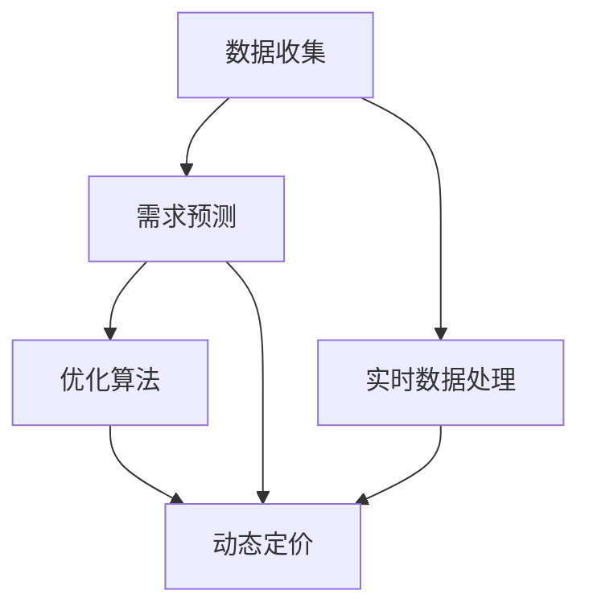

                 

# AI动态定价：原理、应用与挑战

## 1. 背景介绍

### 1.1 问题由来
在现代商业环境中，动态定价策略已成为许多企业保持竞争力和提高盈利能力的重要手段。传统的静态定价模式难以应对市场需求的变化，无法实时优化资源配置，而动态定价策略则通过实时调整价格，实现资源的高效利用。例如，航空公司的机票价格会根据供需关系进行实时调整，酒店和零售业的房间和商品价格也会根据季节、地理位置和库存情况进行调整。

人工智能（AI）技术的快速发展，特别是深度学习和大数据技术的应用，为动态定价提供了新的思路和工具。AI动态定价系统可以通过分析历史数据、实时市场情况和预测模型，实时调整商品或服务的价格，从而最大化企业的收益。本文将系统介绍AI动态定价的基本原理、主要应用及面临的挑战。

### 1.2 问题核心关键点
AI动态定价的核心在于如何构建有效的价格优化模型，结合实时数据和预测算法，调整商品或服务的价格。这涉及到以下几个关键问题：
- 如何收集和处理实时市场数据？
- 如何构建有效的预测模型？
- 如何实时调整价格以最大化收益？
- 如何评估和优化AI动态定价系统的性能？

## 2. 核心概念与联系

### 2.1 核心概念概述

为更好地理解AI动态定价的原理，我们首先介绍几个核心概念：

- **动态定价（Dynamic Pricing）**：指根据市场需求、竞争状况、成本等实时因素调整价格，以最大化收益的定价策略。
- **需求预测（Demand Forecasting）**：通过对历史销售数据、市场趋势等因素进行建模，预测未来需求的变化。
- **优化算法（Optimization Algorithm）**：利用数学模型和计算机算法，找到最优的定价策略。
- **实时数据处理（Real-time Data Processing）**：利用流式计算、分布式处理等技术，对实时数据进行高效处理。

这些概念通过相互配合，构成了AI动态定价系统的核心框架。

### 2.2 核心概念原理和架构的 Mermaid 流程图



这个流程图展示了AI动态定价系统的主要步骤：从数据收集到需求预测，再到实时数据处理和优化算法应用，最后实现动态定价。

## 3. 核心算法原理 & 具体操作步骤

### 3.1 算法原理概述

AI动态定价的核心算法主要包括：

1. **需求预测模型**：通过历史数据和市场趋势，建立需求预测模型，预测未来的需求变化。
2. **优化算法**：利用线性规划、梯度下降等算法，找到最优的定价策略。
3. **实时数据处理**：对实时市场数据进行高效处理，及时更新价格。

### 3.2 算法步骤详解

#### 3.2.1 需求预测模型

需求预测模型通常基于时间序列分析、回归分析、机器学习等方法。以下是几种常见的方法：

- **时间序列分析**：通过历史数据建立时间序列模型，如ARIMA、SARIMA等。
- **回归分析**：使用多元线性回归、岭回归等模型，预测需求变化。
- **机器学习**：使用随机森林、支持向量机、神经网络等模型，预测需求变化。

以随机森林为例，需求预测模型的构建步骤如下：

1. 数据预处理：对历史销售数据进行清洗、归一化等处理。
2. 特征工程：提取时间、节假日、促销活动等因素，作为预测模型的特征。
3. 模型训练：使用随机森林算法，训练需求预测模型。
4. 模型评估：使用交叉验证等方法，评估模型的性能。
5. 模型部署：将训练好的模型部署到实时数据处理系统中，提供需求预测功能。

#### 3.2.2 优化算法

优化算法是AI动态定价的核心。常见的优化算法包括：

- **线性规划**：适用于定价策略简单的场景，如单商品定价。
- **梯度下降**：适用于复杂的定价场景，如多商品组合定价。
- **遗传算法**：通过模拟自然选择过程，找到最优的定价策略。

以梯度下降为例，其基本步骤包括：

1. 定义目标函数：目标函数通常为利润最大化或收益最大化。
2. 初始化价格参数：随机初始化价格参数。
3. 计算梯度：根据目标函数，计算梯度。
4. 更新价格参数：根据梯度方向，更新价格参数。
5. 重复迭代：重复3-4步骤，直到收敛。

#### 3.2.3 实时数据处理

实时数据处理是AI动态定价的基础。以下是几个关键技术：

- **流式计算**：使用Apache Kafka、Apache Storm等技术，对实时数据进行流式处理。
- **分布式处理**：使用Hadoop、Spark等技术，对实时数据进行分布式处理。
- **缓存机制**：使用Redis等技术，缓存热点数据，提高处理效率。

以Apache Kafka为例，实时数据处理的主要步骤包括：

1. 数据采集：使用传感器、API等手段，采集实时市场数据。
2. 数据传输：将数据传输到Apache Kafka集群。
3. 数据处理：使用Spark等技术，对数据进行处理。
4. 数据存储：将处理后的数据存储到数据库中。
5. 实时分析：使用流式计算技术，实时分析市场数据。

### 3.3 算法优缺点

AI动态定价具有以下优点：

- **实时性**：能够根据实时市场数据，实时调整价格，最大化收益。
- **灵活性**：能够快速适应市场变化，优化资源配置。
- **自动化**：能够自动化处理大量数据，减少人工干预。

同时，也存在一些缺点：

- **复杂性**：模型构建和优化算法复杂，需要大量数据和计算资源。
- **数据依赖**：对历史数据和实时数据的依赖较大，数据质量直接影响定价效果。
- **安全风险**：动态定价可能被竞争对手监控和攻击，影响市场竞争力。

### 3.4 算法应用领域

AI动态定价在多个领域都有广泛应用：

- **航空业**：机票、酒店等价格实时调整，根据供需关系定价。
- **零售业**：商品价格实时调整，根据库存、季节和促销活动定价。
- **医疗保健**：医疗服务定价，根据患者需求和医疗资源定价。
- **交通运输**：出租车、拼车等价格实时调整，根据供需关系定价。
- **能源行业**：电力、天然气等价格实时调整，根据需求和生产成本定价。

## 4. 数学模型和公式 & 详细讲解 & 举例说明

### 4.1 数学模型构建

AI动态定价的数学模型主要包括以下几个部分：

- **需求函数**：描述需求与价格之间的关系，通常为线性函数。
- **成本函数**：描述成本与产量之间的关系，通常为二次函数。
- **利润函数**：目标函数，最大化利润或收益。
- **约束条件**：限制条件，如库存、产量等。

以最大化利润的线性规划模型为例，模型构建步骤如下：

1. 定义需求函数：$p = a + bD$，其中$p$为价格，$D$为需求量，$a$和$b$为参数。
2. 定义成本函数：$C = cD + f$，其中$C$为成本，$c$和$f$为参数。
3. 定义利润函数：$P = pD - C$，其中$P$为利润。
4. 定义约束条件：$D \leq S$，其中$S$为库存上限。
5. 求解优化问题：$\max P$，$\text{subject to}$ 约束条件。

### 4.2 公式推导过程

以线性规划模型为例，目标函数为：

$$
\max \sum_{i=1}^n p_i x_i
$$

约束条件为：

$$
\begin{cases}
\sum_{i=1}^m a_{ij} x_i + b_j = c_j & \text{对} j = 1, ..., m \\
\sum_{j=1}^n x_j = d & \\
x_i \geq 0 & \text{对} i = 1, ..., n
\end{cases}
$$

其中，$x_i$为决策变量，$a_{ij}$、$b_j$、$c_j$等为系数。

使用单纯形法求解上述线性规划问题，步骤如下：

1. 初始化单纯形表。
2. 确定初始基本可行解。
3. 计算检验数。
4. 判断是否最优解。
5. 若非最优解，进行迭代。

### 4.3 案例分析与讲解

以航空业机票定价为例，需求预测模型为：

$$
D = A(\alpha - \beta P) + \gamma
$$

其中，$D$为需求量，$P$为价格，$A$、$\alpha$、$\beta$、$\gamma$为参数。

使用梯度下降优化算法，目标函数为：

$$
\max \sum_{i=1}^n p_i x_i
$$

约束条件为：

$$
\begin{cases}
\sum_{i=1}^m a_{ij} x_i + b_j = c_j & \text{对} j = 1, ..., m \\
\sum_{j=1}^n x_j = d & \\
x_i \geq 0 & \text{对} i = 1, ..., n
\end{cases}
$$

以最大化利润为例，价格优化模型为：

$$
\max \sum_{i=1}^n p_i x_i
$$

约束条件为：

$$
\begin{cases}
D = A(\alpha - \beta P) + \gamma & \\
C = cD + f & \\
x_i \geq 0 & \text{对} i = 1, ..., n
\end{cases}
$$

其中，$P$为价格，$D$为需求量，$C$为成本，$c$和$f$为参数。

## 5. 项目实践：代码实例和详细解释说明

### 5.1 开发环境搭建

在进行AI动态定价实践前，我们需要准备好开发环境。以下是使用Python进行Scikit-learn和TensorFlow开发的环境配置流程：

1. 安装Anaconda：从官网下载并安装Anaconda，用于创建独立的Python环境。

2. 创建并激活虚拟环境：
```bash
conda create -n dp-env python=3.8 
conda activate dp-env
```

3. 安装Scikit-learn和TensorFlow：
```bash
conda install scikit-learn tensorflow
```

4. 安装各类工具包：
```bash
pip install numpy pandas scikit-learn matplotlib tqdm jupyter notebook ipython
```

完成上述步骤后，即可在`dp-env`环境中开始AI动态定价实践。

### 5.2 源代码详细实现

以下是使用Scikit-learn和TensorFlow对机票定价问题进行建模的代码实现。

```python
import numpy as np
from sklearn.linear_model import LinearRegression
from sklearn.metrics import mean_squared_error
import tensorflow as tf
from tensorflow.keras.models import Sequential
from tensorflow.keras.layers import Dense, Dropout

# 需求预测模型
def predict_demand(x, model):
    return model.predict(x)

# 优化算法
def optimize_price(x, demand, cost, inventory):
    # 定义价格优化模型
    model = Sequential()
    model.add(Dense(64, input_dim=1, activation='relu'))
    model.add(Dense(64, activation='relu'))
    model.add(Dense(1))
    
    # 编译模型
    model.compile(loss='mean_squared_error', optimizer='adam')
    
    # 训练模型
    model.fit(x, demand, epochs=100, verbose=0)
    
    # 预测价格
    price = model.predict(cost)
    
    # 判断是否符合库存限制
    if inventory <= price:
        return inventory
    else:
        return price

# 数据集
x = np.array([1, 2, 3, 4, 5, 6, 7, 8, 9, 10])
demand = np.array([100, 150, 200, 250, 300, 350, 400, 450, 500, 550])
cost = np.array([20, 25, 30, 35, 40, 45, 50, 55, 60, 65])
inventory = 500

# 需求预测模型
model = LinearRegression()
model.fit(x, demand)

# 优化价格
price = optimize_price(x, predict_demand(x, model), cost, inventory)
print("价格为：", price)
```

在上述代码中，我们首先定义了需求预测模型和优化算法，然后使用Scikit-learn对需求预测模型进行训练，使用TensorFlow对价格优化模型进行训练。最后，通过预测和优化，得到最佳价格。

### 5.3 代码解读与分析

**需求预测模型**：
- `predict_demand`函数：使用Scikit-learn的LinearRegression模型，对历史数据进行预测，返回需求量。
- `x`：输入数据，包含历史价格。
- `model`：训练好的线性回归模型。

**优化算法**：
- `optimize_price`函数：使用TensorFlow的Sequential模型，对价格进行优化，返回最佳价格。
- `x`：输入数据，包含历史价格。
- `demand`：预测的需求量。
- `cost`：成本函数。
- `inventory`：库存限制。

**训练和预测**：
- 使用Scikit-learn的LinearRegression模型训练需求预测模型。
- 使用TensorFlow的Sequential模型训练价格优化模型。
- 通过预测和优化，得到最佳价格。

## 6. 实际应用场景

### 6.1 航空业机票定价

航空业是AI动态定价的典型应用场景。航空公司根据实时市场需求、竞争状况和成本，实时调整机票价格，以最大化收益。

具体而言，航空公司收集历史机票销售数据、天气状况、节假日等因素，建立需求预测模型。然后，通过分析实时市场数据，使用优化算法实时调整机票价格。例如，节假日期间，航空公司会提高机票价格，以应对需求增加；而淡季则降低价格，吸引更多乘客。

### 6.2 零售业商品定价

零售业也是AI动态定价的重要应用领域。零售商根据实时库存、销售情况和竞争状况，实时调整商品价格。

具体而言，零售商收集历史销售数据、季节性因素、促销活动等因素，建立需求预测模型。然后，通过分析实时市场数据，使用优化算法实时调整商品价格。例如，新产品上市初期，零售商会提高价格，以刺激销售；而销量下降时，则会降低价格，以清理库存。

### 6.3 医疗保健服务定价

医疗保健行业也逐渐采用AI动态定价策略。医院根据实时患者需求和医疗资源，实时调整医疗服务价格。

具体而言，医院收集历史就诊数据、患者需求、医疗资源等因素，建立需求预测模型。然后，通过分析实时市场数据，使用优化算法实时调整医疗服务价格。例如，高峰时段，医院会提高诊疗价格，以应对患者需求增加；而低峰时段，则会降低价格，吸引更多患者。

## 7. 工具和资源推荐

### 7.1 学习资源推荐

为了帮助开发者系统掌握AI动态定价的理论基础和实践技巧，这里推荐一些优质的学习资源：

1. 《动态定价：原理与实践》系列博文：由AI动态定价专家撰写，深入浅出地介绍了动态定价的基本原理和实际应用。
2. 《深度学习基础》课程：斯坦福大学开设的深度学习入门课程，涵盖深度学习的基本概念和算法。
3. 《TensorFlow实战》书籍：TensorFlow官方文档，全面介绍了TensorFlow的使用方法和案例。
4. Kaggle平台：数据科学和机器学习的竞赛平台，提供大量实际案例和数据集。
5. GitHub：开源代码仓库，提供大量优秀的AI动态定价实现。

通过对这些资源的学习实践，相信你一定能够快速掌握AI动态定价的精髓，并用于解决实际的商业问题。

### 7.2 开发工具推荐

高效的开发离不开优秀的工具支持。以下是几款用于AI动态定价开发的常用工具：

1. Python：广泛使用的编程语言，具有丰富的第三方库和社区支持。
2. Scikit-learn：Python的机器学习库，提供了丰富的回归、分类、聚类等算法。
3. TensorFlow：Google开发的深度学习框架，支持分布式计算和大规模模型训练。
4. Apache Kafka：流式数据处理框架，支持高吞吐量和高可靠性的数据传输。
5. Apache Spark：分布式计算框架，支持大规模数据处理和机器学习。

合理利用这些工具，可以显著提升AI动态定价任务的开发效率，加快创新迭代的步伐。

### 7.3 相关论文推荐

AI动态定价的研究源于学界的持续研究。以下是几篇奠基性的相关论文，推荐阅读：

1. "Dynamic Pricing: Theory and Practice" by Xiao Li and Brian Willig（李晓和布赖恩·威廉）：详细介绍了动态定价的理论基础和实际应用。
2. "Dynamic Pricing with Stochastic Demand" by Michael Zitzmann（迈克尔·齐兹曼）：研究了随机需求下的动态定价模型。
3. "Online Dynamic Pricing: A Tutorial" by Arunachalam Kanniah and Joseph T. Williamson（阿鲁纳恰拉姆·坎尼亚和约瑟夫·T·威廉姆森）：提供了动态定价的入门教程和实际案例。
4. "Revenue Optimization" by Ravi Madhavan和Anant Rao（拉维·马达万和阿南特·拉奥）：介绍了收益优化的算法和策略。
5. "Dynamic Pricing Algorithms" by Yossi Bavschik和Yehuda Kligler（约西·巴夫什克和叶胡达·克莱格勒）：介绍了各种动态定价算法和应用场景。

这些论文代表了大模型微调技术的发展脉络。通过学习这些前沿成果，可以帮助研究者把握学科前进方向，激发更多的创新灵感。

## 8. 总结：未来发展趋势与挑战

### 8.1 总结

本文对AI动态定价的基本原理、主要应用及面临的挑战进行了全面系统的介绍。首先阐述了AI动态定价的基本概念和核心算法，明确了需求预测和优化算法在动态定价中的重要性。其次，通过Scikit-learn和TensorFlow的代码实现，展示了AI动态定价的系统性方法。同时，本文还探讨了AI动态定价在航空业、零售业、医疗保健等多个领域的实际应用。

通过本文的系统梳理，可以看到，AI动态定价技术已经成为现代商业决策的重要工具，极大地提升了企业的市场竞争力。未来，伴随算力成本的下降和AI技术的发展，动态定价系统将变得更加智能和高效。

### 8.2 未来发展趋势

展望未来，AI动态定价技术将呈现以下几个发展趋势：

1. **智能化**：随着深度学习和大数据分析技术的发展，动态定价系统将更加智能化，能够更加精准地预测需求和调整价格。
2. **个性化**：动态定价系统将更加注重个性化需求，能够根据用户行为和偏好进行定价优化。
3. **实时化**：动态定价系统将更加实时化，能够实时处理大量数据，快速调整价格。
4. **多渠道化**：动态定价系统将支持多渠道销售，能够同时调整线上和线下价格，实现全渠道优化。
5. **全球化**：动态定价系统将支持全球化市场，能够实时处理不同地区和国家的市场数据，实现全球定价优化。

以上趋势凸显了AI动态定价技术的广阔前景。这些方向的探索发展，必将进一步提升动态定价系统的性能和应用范围，为企业的市场竞争力提供新的动力。

### 8.3 面临的挑战

尽管AI动态定价技术已经取得了瞩目成就，但在迈向更加智能化、普适化应用的过程中，它仍面临着诸多挑战：

1. **数据质量**：需求预测和价格优化依赖于高质量的数据，数据质量直接影响系统的性能。如何获取和处理高质量数据，是一个重要的挑战。
2. **模型复杂性**：动态定价模型通常较为复杂，需要大量的数据和计算资源。如何设计高效的模型，是一个重要的研究方向。
3. **实时处理**：动态定价系统需要实时处理大量数据，对计算资源和存储资源提出了很高的要求。如何优化实时处理流程，是一个重要的研究方向。
4. **用户接受度**：动态定价可能引发用户的抵触情绪，影响市场竞争力。如何平衡用户接受度和企业收益，是一个重要的研究课题。
5. **竞争策略**：竞争对手可能会监控和攻击动态定价系统，影响市场竞争力。如何防止竞争策略攻击，是一个重要的研究方向。

这些挑战需要我们在技术、管理和市场等多个方面进行全面优化，才能确保动态定价系统的稳定和高效。

### 8.4 研究展望

面对AI动态定价所面临的挑战，未来的研究需要在以下几个方面寻求新的突破：

1. **数据质量提升**：采用先进的数据采集和处理技术，获取高质量的数据，提升系统的性能。
2. **模型优化**：设计高效的动态定价模型，减少计算资源和存储资源的消耗，提高系统的实时处理能力。
3. **用户接受度提升**：通过合理定价策略和透明的价格调整机制，提升用户的接受度和满意度。
4. **竞争策略防护**：采用先进的反竞争策略攻击技术，保护系统的安全性和稳定性。
5. **全球化优化**：支持全球化市场，能够处理不同地区和国家的市场数据，实现全球定价优化。

这些研究方向的探索，必将引领AI动态定价技术迈向更高的台阶，为企业的市场竞争力提供新的动力。相信随着技术的发展和应用的推广，动态定价技术将更加智能和高效，为企业的市场竞争力提供新的动力。

## 9. 附录：常见问题与解答

**Q1：AI动态定价是否适用于所有商业场景？**

A: AI动态定价在大多数商业场景中都能取得不错的效果，特别是对于需求变化较为明显的行业，如航空业、零售业等。但对于一些需要稳定价格的商品或服务，动态定价可能并不适用。

**Q2：如何评估AI动态定价系统的性能？**

A: 评估AI动态定价系统的性能通常从以下几个方面入手：
1. 准确率：预测需求和价格是否与实际数据相符。
2. 响应时间：系统的响应速度是否满足实时需求。
3. 稳定性：系统是否能够稳定运行，避免因数据或算法问题导致系统崩溃。
4. 用户满意度：用户对价格调整的接受度和满意度。

**Q3：AI动态定价系统有哪些优势和劣势？**

A: AI动态定价系统的优势包括：
1. 实时性：能够根据实时市场数据，实时调整价格，最大化收益。
2. 灵活性：能够快速适应市场变化，优化资源配置。
3. 自动化：能够自动化处理大量数据，减少人工干预。

劣势包括：
1. 数据依赖：对历史数据和实时数据的依赖较大，数据质量直接影响定价效果。
2. 模型复杂性：模型通常较为复杂，需要大量的数据和计算资源。
3. 用户接受度：动态定价可能引发用户的抵触情绪，影响市场竞争力。

**Q4：AI动态定价系统的实现难点在哪里？**

A: AI动态定价系统的实现难点主要包括：
1. 需求预测模型的构建：如何根据历史数据和市场趋势，建立准确的需求预测模型。
2. 优化算法的选取：如何选择合适的优化算法，最大程度地利用数据和资源。
3. 实时数据处理：如何高效处理实时数据，确保系统的实时性和稳定性。

**Q5：AI动态定价系统在实际应用中需要注意哪些问题？**

A: 在实际应用中，AI动态定价系统需要注意以下问题：
1. 数据隐私：如何保护用户数据隐私，防止数据泄露和滥用。
2. 系统安全：如何防止系统被攻击，确保系统的安全性和稳定性。
3. 用户教育：如何向用户解释价格调整的原因和逻辑，提升用户的接受度。
4. 模型监控：如何监控模型的运行状态，及时发现和修复问题。

总之，AI动态定价技术为企业的市场竞争力提供了新的工具，但也需要在数据、模型和用户等多个方面进行全面优化。只有在技术、管理和市场等多个维度协同发力，才能确保系统的稳定和高效。

---

作者：禅与计算机程序设计艺术 / Zen and the Art of Computer Programming

