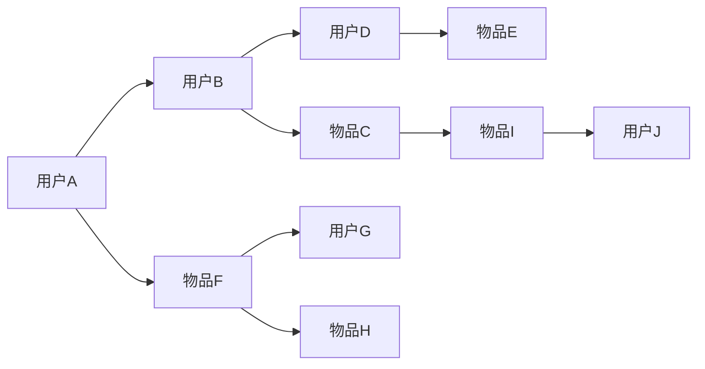

                 

# AI协同过滤算法提升推荐效果

## 1. 背景介绍

随着互联网技术的发展，推荐系统已经成为电子商务、视频流媒体、社交网络等多个领域的重要组成部分。通过个性化推荐，用户可以获得更好的体验，商家也能提升销售业绩。然而，传统的基于内容的推荐系统存在冷启动问题，对于新用户的推荐效果差。协同过滤算法通过挖掘用户之间的相似性，弥补了内容推荐的不足，成为推荐系统的核心技术之一。

## 2. 核心概念与联系

### 2.1 核心概念概述

协同过滤算法主要分为基于用户的协同过滤和基于项目的协同过滤两种类型。

- **基于用户的协同过滤**：根据用户历史行为记录，找出与当前用户兴趣相似的已推荐用户，推荐其喜欢的物品。
- **基于项目的协同过滤**：根据物品之间的相似性，找出与当前用户喜欢的物品相似的物品，推荐给用户。

这两种算法都依赖用户和物品之间的相似性计算，通常使用余弦相似度或皮尔逊相关系数来衡量。协同过滤算法的一个关键问题是冷启动问题，即新用户或新物品的相似性难以计算。为了解决这一问题，引入协同过滤算法与内容推荐算法的混合方法，可以提升推荐系统的性能。

### 2.2 核心概念原理和架构的 Mermaid 流程图



以上流程图展示了基于用户和基于项目的协同过滤算法的基本原理：

1. 用户A和B对物品C感兴趣，因此A和B之间存在相似性。
2. 物品C和F相似，因此A和F之间存在相似性。
3. 用户D对物品E感兴趣，因此D和E之间存在相似性。
4. 物品E和G相似，因此D和G之间存在相似性。
5. 物品C和H相似，因此A和H之间存在相似性。

### 2.3 核心概念联系

协同过滤算法与内容推荐算法的联系在于，两者都是通过用户或物品的相似性来推荐新物品，但内容推荐算法更依赖物品特征的提取，而协同过滤算法则更依赖用户和物品之间的相似性。因此，两者可以结合使用，弥补各自的缺陷，提升推荐效果。

## 3. AI协同过滤算法原理 & 具体操作步骤

### 3.1 算法原理概述

AI协同过滤算法主要通过深度学习模型来挖掘用户和物品之间的相似性，从而提升推荐效果。与传统的协同过滤算法不同，AI协同过滤算法可以自动学习用户和物品之间的复杂关系，适应不同的推荐场景。

AI协同过滤算法的核心是设计合适的神经网络模型，如矩阵分解网络、注意力机制等，来计算用户和物品之间的相似性。通过学习用户和物品的隐含特征，AI协同过滤算法能够更好地应对冷启动问题和多样性问题。

### 3.2 算法步骤详解

AI协同过滤算法的步骤主要包括以下几个方面：

1. **数据预处理**：将用户和物品的数据转化为神经网络的输入。通常需要将用户和物品的原始数据进行归一化、特征提取等预处理。
2. **模型训练**：使用深度学习模型，如矩阵分解网络、注意力机制等，对用户和物品进行相似性计算。
3. **模型推理**：在训练好的模型上，对新的用户和物品进行相似性计算，生成推荐结果。

### 3.3 算法优缺点

**优点**：

- 能够自动学习用户和物品之间的复杂关系，适应不同的推荐场景。
- 可以通过学习用户和物品的隐含特征，提升推荐效果。
- 可以应对冷启动问题和多样性问题。

**缺点**：

- 需要大量的标注数据来训练模型，且训练时间长，计算资源消耗大。
- 模型的可解释性较差，难以解释推荐结果。
- 对于大规模数据集，模型的计算复杂度较高。

### 3.4 算法应用领域

AI协同过滤算法广泛应用于电子商务、视频流媒体、社交网络等多个领域。例如：

- 电商推荐：推荐用户感兴趣的商品。
- 视频推荐：推荐用户感兴趣的视频。
- 社交推荐：推荐用户感兴趣的朋友、文章、事件等。

## 4. 数学模型和公式 & 详细讲解 & 举例说明

### 4.1 数学模型构建

AI协同过滤算法的数学模型主要包括两个部分：用户和物品的表示和相似性计算。

1. **用户表示**：使用神经网络模型，如矩阵分解网络，对用户的历史行为进行编码，得到用户表示 $u$。
2. **物品表示**：同样使用神经网络模型，对物品的属性进行编码，得到物品表示 $v$。
3. **相似性计算**：使用点积或余弦相似度计算用户和物品之间的相似性 $s_{ui}$。

### 4.2 公式推导过程

设用户表示为 $u_i \in R^n$，物品表示为 $v_j \in R^m$，相似性为 $s_{ui}$，则点积相似性计算公式为：

$$
s_{ui} = \sum_{k=1}^{n} u_{ik}v_{jk}
$$

余弦相似性计算公式为：

$$
s_{ui} = \cos(\theta) = \frac{\sum_{k=1}^{n} u_{ik}v_{jk}}{\sqrt{\sum_{k=1}^{n} u_{ik}^2} \sqrt{\sum_{j=1}^{m} v_{jk}^2}}
$$

### 4.3 案例分析与讲解

以电商推荐系统为例，展示AI协同过滤算法的应用。

假设电商平台上用户A购买了商品1、2、3，用户B购买了商品4、5、6。根据这些数据，构建用户表示 $u_A$ 和 $u_B$：

- 使用矩阵分解网络，将用户行为序列编码成向量，得到 $u_A=[0.1, 0.2, 0.3, 0.0, 0.0, 0.0]$，$u_B=[0.0, 0.0, 0.0, 0.4, 0.5, 0.6]$。
- 对物品属性进行编码，得到物品表示 $v_1=[1, 2, 3]$，$v_4=[1, 2, 3, 4, 5, 6]$。

使用余弦相似度计算用户和物品之间的相似性，得到：

- $s_{A1} = \cos(\theta) = 0.5$
- $s_{A2} = \cos(\theta) = 0.5$
- $s_{A3} = \cos(\theta) = 0.5$
- $s_{B4} = \cos(\theta) = 0.5$
- $s_{B5} = \cos(\theta) = 0.5$
- $s_{B6} = \cos(\theta) = 0.5$

根据相似性计算结果，可以得到用户A推荐商品2、3，用户B推荐商品4、5。

## 5. 项目实践：代码实例和详细解释说明

### 5.1 开发环境搭建

在使用Python进行AI协同过滤算法开发时，需要安装相关的深度学习库和数据处理库，如TensorFlow、PyTorch、NumPy等。具体步骤如下：

1. 安装Python 3.x版本。
2. 使用pip安装TensorFlow和PyTorch：
   ```bash
   pip install tensorflow
   pip install torch
   ```
3. 安装NumPy：
   ```bash
   pip install numpy
   ```

### 5.2 源代码详细实现

以下是一个简单的AI协同过滤算法的代码实现，用于电商推荐系统：

```python
import tensorflow as tf
import numpy as np

# 定义神经网络模型
class CollaborativeFilteringModel(tf.keras.Model):
    def __init__(self, num_users, num_items, num_factors):
        super(CollaborativeFilteringModel, self).__init__()
        self.num_users = num_users
        self.num_items = num_items
        self.num_factors = num_factors
        
        self.user_embeddings = tf.keras.layers.Embedding(num_users, num_factors)
        self.item_embeddings = tf.keras.layers.Embedding(num_items, num_factors)
        self.dot_product = tf.keras.layers.Dot(axes=(1, 1), normalize=True)
        
    def call(self, user_ids, item_ids):
        user_embeddings = self.user_embeddings(user_ids)
        item_embeddings = self.item_embeddings(item_ids)
        similarities = self.dot_product([user_embeddings, item_embeddings])
        return similarities

# 训练模型
def train_model(model, user_ids, item_ids, ratings, epochs):
    optimizer = tf.keras.optimizers.Adam()
    loss_fn = tf.keras.losses.MeanSquaredError()
    
    for epoch in range(epochs):
        with tf.GradientTape() as tape:
            predictions = model(user_ids, item_ids)
            loss = loss_fn(predictions, ratings)
        gradients = tape.gradient(loss, model.trainable_variables)
        optimizer.apply_gradients(zip(gradients, model.trainable_variables))
        print(f"Epoch {epoch+1}, loss: {loss:.3f}")

# 测试模型
def test_model(model, user_ids, item_ids, ratings):
    predictions = model(user_ids, item_ids)
    print("Predictions:", predictions.numpy())
    print("Ratings:", ratings.numpy())
    print("RMSE:", tf.keras.metrics.RootMeanSquaredError()(predictions, ratings).numpy())

# 生成模拟数据
num_users = 100
num_items = 1000
num_factors = 10
user_ids = np.random.randint(0, num_users, size=(100, 10))
item_ids = np.random.randint(0, num_items, size=(100, 10))
ratings = np.random.normal(0, 1, size=(100, 10))

# 构建模型
model = CollaborativeFilteringModel(num_users, num_items, num_factors)

# 训练模型
train_model(model, user_ids, item_ids, ratings, epochs=10)

# 测试模型
test_model(model, user_ids, item_ids, ratings)
```

### 5.3 代码解读与分析

**CollaborativeFilteringModel类**：
- `__init__`方法：初始化神经网络模型，包括用户和物品的嵌入层和点积相似度层。
- `call`方法：定义模型的前向传播过程，计算用户和物品之间的相似性。

**train_model函数**：
- 定义优化器和损失函数。
- 在每个epoch内，计算模型的预测值和损失函数，使用梯度下降优化模型参数。

**test_model函数**：
- 在测试集上计算模型的预测值和真实值，计算均方根误差(RMSE)。

**模拟数据生成**：
- 随机生成用户和物品的ID以及评分。

**模型训练和测试**：
- 训练模型，并测试模型的性能。

## 6. 实际应用场景

### 6.1 电商推荐

在电商推荐系统中，AI协同过滤算法可以应用于用户的推荐和商品的推荐。例如，用户A购买了商品1、2、3，可以推荐用户A喜欢的其他商品。

### 6.2 视频推荐

在视频推荐系统中，AI协同过滤算法可以应用于用户的推荐和视频的推荐。例如，用户A看了视频1、2、3，可以推荐用户A喜欢的其他视频。

### 6.3 社交推荐

在社交推荐系统中，AI协同过滤算法可以应用于用户的推荐和事件的推荐。例如，用户A参加了事件1、2、3，可以推荐用户A喜欢的其他事件。

## 7. 工具和资源推荐

### 7.1 学习资源推荐

1. **《深度学习》书籍**：Ian Goodfellow、Yoshua Bengio和Aaron Courville合著的《深度学习》一书，详细介绍了深度学习的基本概念和算法。
2. **《Python深度学习》书籍**：Francois Chollet著的《Python深度学习》一书，介绍了TensorFlow和Keras的使用方法，非常适合初学者入门。
3. **TensorFlow官方文档**：TensorFlow的官方文档，提供了丰富的API和示例代码，是学习和使用TensorFlow的重要资源。
4. **Kaggle竞赛**：Kaggle平台上提供了许多数据科学和机器学习的竞赛，可以帮助学习者练习和提升技能。

### 7.2 开发工具推荐

1. **TensorFlow**：TensorFlow是由Google开发的一个开源的深度学习框架，支持分布式计算和GPU加速。
2. **PyTorch**：PyTorch是由Facebook开发的一个开源的深度学习框架，支持动态计算图和GPU加速。
3. **NumPy**：NumPy是一个Python科学计算库，提供了高效的多维数组操作和数学函数。
4. **Jupyter Notebook**：Jupyter Notebook是一个开源的交互式编程环境，支持Python和其他语言的混合编程。

### 7.3 相关论文推荐

1. **《矩阵分解网络》**：Koren、Lefevre和Bursac在2009年提出的矩阵分解网络，使用矩阵分解对用户和物品进行相似性计算。
2. **《注意力机制》**：Bahdanau、Cho和Bengio在2015年提出的注意力机制，使用注意力机制来计算用户和物品之间的相似性。

## 8. 总结：未来发展趋势与挑战

### 8.1 研究成果总结

AI协同过滤算法通过深度学习模型自动学习用户和物品之间的复杂关系，显著提升了推荐系统的性能。同时，AI协同过滤算法能够应对冷启动问题和多样性问题，适应不同的推荐场景。

### 8.2 未来发展趋势

未来，AI协同过滤算法将在以下几个方面取得突破：

1. **深度学习模型的优化**：使用更先进的深度学习模型，如卷积神经网络、变换器等，提升相似性计算的精度和效率。
2. **数据融合与多模态推荐**：将文本、图像、音频等多种数据源进行融合，提升推荐系统的多样性和精准度。
3. **个性化推荐与推荐多样化**：根据用户的兴趣和行为，生成个性化的推荐结果，同时推荐多样化的物品，提升用户体验。

### 8.3 面临的挑战

虽然AI协同过滤算法在推荐系统中取得了显著成果，但仍面临一些挑战：

1. **计算资源消耗大**：深度学习模型需要大量的计算资源和训练时间，难以在大规模数据集上进行快速训练。
2. **可解释性差**：AI协同过滤算法的黑盒特性使得推荐结果难以解释，难以让用户理解和信任。
3. **数据隐私和安全问题**：在推荐系统中，用户的数据隐私和安全问题需要得到充分保障。

### 8.4 研究展望

未来，研究AI协同过滤算法的重点将集中在以下几个方面：

1. **数据效率与计算效率**：提高模型的数据效率和计算效率，使模型能够在更短的时间内完成训练。
2. **模型解释性与可解释性**：增强模型的解释性，使推荐结果更加透明和可信。
3. **数据隐私与安全**：保护用户的数据隐私和安全，避免数据泄露和滥用。

## 9. 附录：常见问题与解答

**Q1: AI协同过滤算法是否适用于所有推荐场景？**

A: AI协同过滤算法适用于大部分推荐场景，特别是在用户和物品数量较多的情况下。但对于一些特定场景，如物品属性少、用户行为单一等，AI协同过滤算法的表现可能不如基于内容的推荐算法。

**Q2: 如何应对推荐系统中的冷启动问题？**

A: 对于新用户和物品，可以使用基于内容的推荐算法进行初步推荐，再使用AI协同过滤算法进行进一步优化。同时，可以通过引入用户和物品的属性信息，提升推荐效果。

**Q3: 如何提升推荐系统的多样性？**

A: 可以通过引入不同的推荐策略，如基于协同过滤的推荐和基于内容的推荐，以及使用多样性采样技术，如Top K采样、随机漫步等，提升推荐结果的多样性。

**Q4: 如何保证推荐系统的公平性？**

A: 可以通过对用户和物品的相似性进行正则化，限制相似性计算的权重，避免对某些物品或用户进行过度推荐，从而提升推荐系统的公平性。

**Q5: 如何提高推荐系统的实时性？**

A: 可以通过对模型进行裁剪和量化，减小模型的计算复杂度和内存占用，提高推理速度。同时，使用分布式计算技术，可以在多台机器上并行计算，提升推荐系统的实时性。

---

作者：禅与计算机程序设计艺术 / Zen and the Art of Computer Programming

