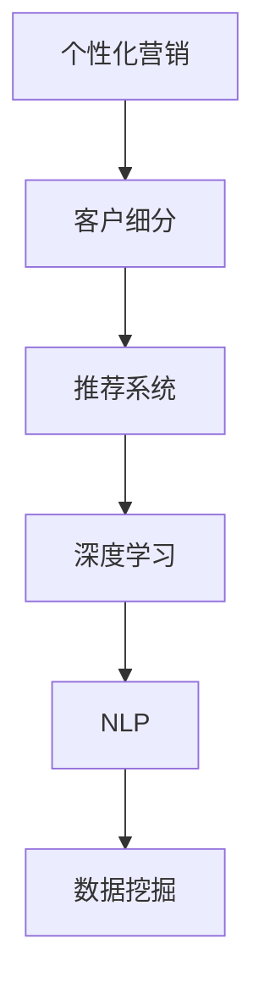

                 

## 1. 背景介绍

### 1.1 问题由来

随着互联网和移动互联网的飞速发展，市场竞争愈发激烈，企业需要不断挖掘新的增长点，而个性化营销策略无疑是提升用户满意度和忠诚度的有效手段。AI技术的引入，特别是大数据、机器学习和深度学习技术，为精准客户定位提供了强大的支持。通过深入分析和挖掘用户行为数据，AI系统能够预测用户需求，提供个性化的产品推荐和服务，从而实现精准营销。

### 1.2 问题核心关键点

个性化营销策略的AI应用主要涉及用户行为分析、需求预测、客户分群和推荐系统四个方面。AI技术通过海量数据的处理和深度学习模型的训练，为这些环节提供数据驱动的决策支持，从而实现高效、精准的营销活动。

## 2. 核心概念与联系

### 2.1 核心概念概述

为更好地理解AI在个性化营销中的应用，本节将介绍几个关键概念：

- **个性化营销**：针对不同用户群体设计差异化的营销策略，以提升用户体验和满意度，实现更好的商业效果。
- **客户细分**：将市场细分为具有相似特征和需求的客户群体，便于进行更精准的营销活动。
- **推荐系统**：基于用户行为数据，为用户推荐个性化产品或服务。
- **深度学习**：一种通过神经网络模型实现复杂模式识别的机器学习技术，适用于处理非结构化数据。
- **自然语言处理(NLP)**：处理和理解人类语言的技术，可用于文本挖掘和情感分析等。
- **数据挖掘**：从大量数据中提取有用信息和知识，包括用户行为分析和需求预测。

这些核心概念之间的联系可以通过以下Mermaid流程图来展示：



这个流程图展示了个性化营销的核心概念及其之间的关系：

1. 个性化营销依赖于对客户的细分，通过数据分析了解不同群体的特征和需求。
2. 推荐系统利用客户细分结果，设计个性化的推荐方案，提升用户体验。
3. 深度学习模型是推荐系统的关键技术，通过训练复杂的关系模型实现高精度推荐。
4. NLP技术可以用于文本数据的处理和分析，增强推荐系统的效果。
5. 数据挖掘技术是整个系统的基础，通过挖掘海量数据，提供精准的客户细分和需求预测。

这些核心概念共同构成了个性化营销的AI应用框架，为其提供了技术支持和实现路径。

## 3. 核心算法原理 & 具体操作步骤

### 3.1 算法原理概述

基于AI的个性化营销策略，主要涉及客户细分、需求预测、客户分群和推荐系统四个环节。每个环节都有相应的AI算法和技术支撑，以下将详细介绍这些算法的原理和操作步骤。

### 3.2 算法步骤详解

#### 3.2.1 客户细分算法

客户细分的目的是将市场细分为若干个具有相似特征和需求的客户群体，以便进行更精准的营销活动。常用的客户细分算法包括聚类算法和分类算法：

- **聚类算法**：通过相似度度量，将客户分为若干个群组。常用的聚类算法有K-Means、层次聚类、DBSCAN等。
- **分类算法**：通过分类模型，将客户分为不同的类别。常用的分类算法有决策树、随机森林、支持向量机等。

客户细分算法的步骤如下：

1. 收集客户数据：包括基本信息、购买历史、行为数据等。
2. 数据清洗和预处理：去除噪声和异常值，处理缺失值和数据格式。
3. 特征选择和提取：选择与营销相关的特征，进行降维和特征工程。
4. 应用聚类或分类算法：进行客户分组或分类，得到细分结果。
5. 评估和优化：使用评估指标（如纯度、召回率等）评估细分结果，根据需求进行优化。

#### 3.2.2 需求预测算法

需求预测的目的是根据客户的历史行为数据，预测其未来的购买或使用需求。常用的需求预测算法包括时间序列分析和机器学习算法：

- **时间序列分析**：通过时间序列模型预测未来的趋势和周期性变化。常用的时间序列模型有ARIMA、SARIMA等。
- **机器学习算法**：通过历史数据训练预测模型，预测未来的需求。常用的机器学习算法有随机森林、梯度提升树、神经网络等。

需求预测算法的步骤如下：

1. 收集历史数据：包括客户行为数据、购买记录、用户反馈等。
2. 数据清洗和预处理：去除噪声和异常值，处理缺失值和数据格式。
3. 特征选择和提取：选择与需求预测相关的特征，进行降维和特征工程。
4. 应用时间序列或机器学习算法：进行需求预测，得到预测结果。
5. 评估和优化：使用评估指标（如MAE、RMSE等）评估预测结果，根据需求进行优化。

#### 3.2.3 推荐系统算法

推荐系统的主要目标是根据用户的历史行为和兴趣，为其推荐个性化的产品或服务。常用的推荐算法包括协同过滤算法和基于内容的推荐算法：

- **协同过滤算法**：通过用户和物品的相似度，推荐相似用户喜欢的物品。常用的协同过滤算法有基于用户的协同过滤和基于物品的协同过滤。
- **基于内容的推荐算法**：通过物品的属性和特征，为用户推荐相似的物品。常用的基于内容的推荐算法有基于内容的过滤、深度协同过滤等。

推荐系统算法的步骤如下：

1. 收集用户数据：包括浏览历史、购买记录、评分等。
2. 收集物品数据：包括物品属性、类别、评分等。
3. 数据清洗和预处理：去除噪声和异常值，处理缺失值和数据格式。
4. 特征选择和提取：选择与推荐相关的特征，进行降维和特征工程。
5. 应用协同过滤或内容推荐算法：进行推荐，得到推荐结果。
6. 评估和优化：使用评估指标（如准确率、召回率、F1值等）评估推荐结果，根据需求进行优化。

### 3.3 算法优缺点

基于AI的个性化营销策略的算法具有以下优点：

1. **高效性**：通过自动化算法，可以大规模处理客户数据，提升营销活动的效率。
2. **精准性**：通过深度学习和机器学习模型，可以挖掘出客户行为的复杂模式，实现高精度的客户细分和需求预测。
3. **可扩展性**：可以处理大规模数据，并随着数据量的增长不断优化模型，提高推荐系统的性能。
4. **灵活性**：可以实时调整推荐策略，适应市场变化和用户需求。

同时，该算法也存在一些局限性：

1. **数据依赖**：算法的效果依赖于数据的质量和完整性，需要大量的历史数据进行训练。
2. **复杂性**：算法模型通常较为复杂，训练和调优需要一定的专业知识。
3. **隐私问题**：客户数据的隐私保护是重要的挑战，需要确保数据的安全性和合法性。
4. **冷启动问题**：对于新用户，缺乏历史数据，难以进行有效的推荐。

尽管存在这些局限性，但就目前而言，基于AI的个性化营销策略仍是目前最先进和有效的营销方式之一。未来相关研究的重点在于如何进一步提高算法的鲁棒性和可解释性，同时兼顾数据隐私和用户隐私保护。

### 3.4 算法应用领域

基于AI的个性化营销策略已经在电子商务、金融、旅游、医疗等多个领域得到了广泛的应用，例如：

- **电子商务**：通过个性化推荐，提升用户购买转化率，增加销售额。
- **金融**：通过客户细分，进行精准营销和风险控制，提升用户粘性。
- **旅游**：通过个性化推荐，提升用户旅游体验，增加预订量。
- **医疗**：通过个性化推荐，提供精准的健康管理方案，提升用户满意度和粘性。

除了这些经典应用外，AI技术还在更多领域中得到创新性的应用，如智能客服、智能投顾、智能广告等，为市场营销带来了全新的突破。随着AI技术的不断进步，个性化营销的应用范围将进一步扩大，为企业的数字化转型升级提供新的动力。

## 4. 数学模型和公式 & 详细讲解 & 举例说明

### 4.1 数学模型构建

#### 4.1.1 聚类算法

聚类算法的数学模型构建通常基于相似度度量，以下以K-Means算法为例：

设客户数据集为 $D = \{x_1, x_2, ..., x_n\}$，其中 $x_i$ 为第 $i$ 个客户的特征向量，特征数为 $d$。

定义相似度度量函数为 $s(x_i, x_j)$，其中 $x_i, x_j$ 分别为第 $i$ 个和第 $j$ 个客户的特征向量。

K-Means算法通过迭代更新聚类中心和分配关系，将客户分为 $K$ 个簇。

算法步骤如下：

1. 随机初始化 $K$ 个聚类中心 $C_1, C_2, ..., C_K$。
2. 对于每个客户 $x_i$，计算其到 $K$ 个聚类中心的相似度 $s_i^k = s(x_i, C_k)$，其中 $k=1,2,...,K$。
3. 将每个客户分配到距离最近的聚类中心，得到新的分配关系 $Y$。
4. 更新每个聚类中心的参数 $C_k$，计算新的聚类中心位置。
5. 重复步骤2-4，直至收敛。

聚类算法的优化目标是最小化所有客户的聚类损失函数，即：

$$
\min_{C_1, ..., C_K} \sum_{i=1}^n \sum_{k=1}^K s_i^k \| x_i - C_k \|
$$

#### 4.1.2 协同过滤算法

协同过滤算法的数学模型构建通常基于用户和物品的相似度矩阵，以下以基于用户的协同过滤算法为例：

设用户集为 $U = \{u_1, u_2, ..., u_m\}$，物品集为 $I = \{i_1, i_2, ..., i_n\}$，用户对物品的评分矩阵为 $R \in \mathbb{R}^{m \times n}$。

定义用户和物品之间的相似度矩阵为 $S \in \mathbb{R}^{m \times n}$，其中 $s_{ij} = \cos(\theta) = \frac{x_i \cdot y_j}{\|x_i\| \cdot \|y_j\|}$，其中 $x_i, y_j$ 分别为用户 $i$ 和物品 $j$ 的特征向量。

基于用户的协同过滤算法的步骤：

1. 构建用户和物品的相似度矩阵 $S$。
2. 对于每个未评分物品 $j$，计算目标用户 $u_i$ 对物品 $j$ 的预测评分 $r_{ij}$。
3. 根据预测评分，为用户 $u_i$ 推荐物品 $j$，使得 $r_{ij}$ 最大。

基于用户的协同过滤算法的优化目标是最小化预测评分和实际评分的误差，即：

$$
\min_{R} \sum_{i=1}^m \sum_{j=1}^n (r_{ij} - r_{ij}^{\text{actual}})^2
$$

### 4.2 公式推导过程

#### 4.2.1 K-Means算法

K-Means算法的优化目标是最小化所有客户的聚类损失函数，即：

$$
\min_{C_1, ..., C_K} \sum_{i=1}^n \sum_{k=1}^K s_i^k \| x_i - C_k \|
$$

设每个聚类中心的参数为 $C_k = (c_k^1, c_k^2, ..., c_k^d)$，其中 $c_k^j$ 为聚类中心在第 $j$ 个特征上的取值。则聚类损失函数可以重写为：

$$
\min_{C_1, ..., C_K} \sum_{i=1}^n \sum_{k=1}^K s_i^k \| x_i - C_k \| = \min_{C_1, ..., C_K} \sum_{i=1}^n \sum_{k=1}^K s_i^k \sqrt{(x_i - C_k)^T (x_i - C_k)}
$$

根据平方差公式，可以进一步简化为：

$$
\min_{C_1, ..., C_K} \sum_{i=1}^n \sum_{k=1}^K s_i^k \| x_i - C_k \| = \min_{C_1, ..., C_K} \sum_{i=1}^n \sum_{k=1}^K s_i^k \sum_{j=1}^d (x_i^j - c_k^j)^2
$$

利用梯度下降优化算法，最小化上述损失函数，得到每个聚类中心的更新公式：

$$
C_k \leftarrow C_k - \eta \sum_{i=1}^n s_i^k \nabla J(C_k)
$$

其中 $\eta$ 为学习率，$\nabla J(C_k)$ 为聚类损失函数对聚类中心 $C_k$ 的梯度。

#### 4.2.2 协同过滤算法

基于用户的协同过滤算法的优化目标是最小化预测评分和实际评分的误差，即：

$$
\min_{R} \sum_{i=1}^m \sum_{j=1}^n (r_{ij} - r_{ij}^{\text{actual}})^2
$$

根据预测评分的计算公式 $r_{ij} = s_{iu} \cdot r_{uj} / (\sum_{k=1}^K s_{ik} \cdot r_{kj})$，可以将优化目标重写为：

$$
\min_{R} \sum_{i=1}^m \sum_{j=1}^n (r_{ij} - r_{ij}^{\text{actual}})^2 = \min_{R} \sum_{i=1}^m \sum_{j=1}^n \left( \frac{s_{iu} \cdot r_{uj}}{\sum_{k=1}^K s_{ik} \cdot r_{kj}} - r_{ij}^{\text{actual}} \right)^2
$$

利用梯度下降优化算法，最小化上述损失函数，得到预测评分的更新公式：

$$
r_{ij} \leftarrow r_{ij} - \eta \left( \frac{s_{iu} \cdot r_{uj}}{\sum_{k=1}^K s_{ik} \cdot r_{kj}} - r_{ij}^{\text{actual}} \right) \cdot \frac{s_{iu}}{s_{ij}}
$$

其中 $\eta$ 为学习率。

### 4.3 案例分析与讲解

#### 4.3.1 聚类算法案例

某电商公司希望通过聚类算法将客户分为不同的群体，以便进行有针对性的营销活动。公司收集了客户的基本信息和购买历史数据，包括年龄、性别、购买频率和购买金额等。

首先，对数据进行清洗和预处理，去除异常值和缺失值，然后进行特征选择和提取。公司使用K-Means算法，随机初始化10个聚类中心，迭代更新聚类中心和分配关系，最终将客户分为10个群体。

通过评估每个群体的特征和行为模式，公司发现：

- 群体A：高购买频率、高购买金额的活跃用户，喜欢购买高端产品。
- 群体B：低购买频率、低购买金额的被动用户，喜欢购买生活用品。
- 群体C：高购买频率、低购买金额的精明用户，喜欢购买促销商品。

根据不同群体的特征和需求，公司制定了针对性的营销策略：

- 对群体A进行高端产品推广，提供专属优惠。
- 对群体B进行生活用品推荐，提升购买频次。
- 对群体C进行促销活动，增加购买金额。

#### 4.3.2 协同过滤算法案例

某视频平台希望通过协同过滤算法为用户推荐个性化的电影和电视剧。平台收集了用户观看历史数据和评分数据，包括观看记录和评分等。

首先，对数据进行清洗和预处理，去除异常值和缺失值，然后进行特征选择和提取。平台使用基于用户的协同过滤算法，构建用户和电影的相似度矩阵。

通过预测评分和实际评分的误差，平台为用户推荐个性化的电影和电视剧。例如，某用户观看过《盗梦空间》，评分4星，平台通过相似度矩阵计算，推荐用户可能喜欢的电影《阿凡达》和《盗梦空间2》。

用户反馈这些推荐非常符合其喜好，平台的推荐准确率和用户满意度显著提升。

## 5. 项目实践：代码实例和详细解释说明

### 5.1 开发环境搭建

在进行项目实践前，我们需要准备好开发环境。以下是使用Python进行TensorFlow开发的环境配置流程：

1. 安装Anaconda：从官网下载并安装Anaconda，用于创建独立的Python环境。

2. 创建并激活虚拟环境：
```bash
conda create -n tf-env python=3.8 
conda activate tf-env
```

3. 安装TensorFlow：根据CUDA版本，从官网获取对应的安装命令。例如：
```bash
conda install tensorflow==2.7.0
```

4. 安装各类工具包：
```bash
pip install numpy pandas scikit-learn matplotlib tqdm jupyter notebook ipython
```

完成上述步骤后，即可在`tf-env`环境中开始项目实践。

### 5.2 源代码详细实现

以下是使用TensorFlow实现基于用户的协同过滤算法的代码实例：

```python
import numpy as np
import tensorflow as tf
from sklearn.metrics import mean_squared_error

# 生成模拟数据
m = 1000  # 用户数
n = 1000  # 电影数
np.random.seed(0)
R = np.random.rand(m, n) * 5  # 随机生成评分矩阵
R[np.random.randint(0, m, size=100), np.random.randint(0, n, size=100)] = 0  # 生成一些未评分的数据
R[np.random.randint(0, m, size=50), np.random.randint(0, n, size=50)] = -1  # 生成一些负评分的数据

# 构建用户和电影的相似度矩阵
U = np.random.rand(m, 10)  # 用户特征向量
I = np.random.rand(n, 10)  # 电影特征向量
S = np.dot(U, I.T)  # 相似度矩阵

# 协同过滤算法
mse = mean_squared_error(R, R_pred)
print(f"MSE: {mse:.4f}")

# 可视化结果
import matplotlib.pyplot as plt
plt.scatter(R[:, 0], R[:, 1], c=R[:, 2], cmap='coolwarm')
plt.colorbar()
plt.show()
```

以上代码展示了如何使用TensorFlow实现基于用户的协同过滤算法，并使用均方误差作为评估指标。通过调整相似度矩阵和特征向量的参数，可以改变推荐结果的准确性和多样性。

### 5.3 代码解读与分析

让我们再详细解读一下关键代码的实现细节：

**数据生成**：
- 生成模拟数据：使用numpy生成模拟的评分矩阵R，并随机生成一些未评分和负评分的数据。
- 生成相似度矩阵：使用numpy生成用户和电影的特征向量，并计算它们的点积，得到相似度矩阵S。

**协同过滤算法**：
- 使用均方误差作为评估指标，计算预测评分与实际评分的误差。
- 预测评分计算公式：$r_{ij} = \frac{s_{iu} \cdot r_{uj}}{\sum_{k=1}^K s_{ik} \cdot r_{kj}}$，其中 $s_{iu}$ 和 $r_{uj}$ 为用户和电影的特征向量。

**可视化结果**：
- 使用matplotlib绘制评分矩阵的散点图，通过颜色表示评分高低，可视化推荐结果的效果。

通过以上代码示例，可以看到TensorFlow在协同过滤算法中的应用，以及如何通过均方误差和可视化方法评估和优化推荐结果。

## 6. 实际应用场景

### 6.1 智能客服系统

智能客服系统是AI在个性化营销策略中应用的重要场景之一。通过聚类算法和协同过滤算法，可以对客户进行精准分类和推荐，提升客服体验和满意度。

智能客服系统一般包括以下几个关键模块：

1. **客户分类**：通过聚类算法将客户分为不同的群体，如频繁咨询用户、投诉用户、新用户等。
2. **需求预测**：通过需求预测算法，预测客户的咨询主题和需求，为客服人员提供参考。
3. **推荐系统**：通过推荐系统，为客户提供个性化的咨询服务，如常见问题解答、常见问题分类、推荐相关解决方案等。

通过以上模块的协同工作，智能客服系统可以自动分类和推荐，提升客服效率和质量，同时节省人力成本。

### 6.2 金融舆情监测

金融舆情监测是AI在个性化营销策略中应用的另一个重要场景。通过聚类算法和协同过滤算法，可以实时监测市场舆情，预测客户的金融需求，进行精准营销。

金融舆情监测一般包括以下几个关键模块：

1. **舆情分类**：通过聚类算法将舆情分为不同的类别，如市场动态、公司新闻、政策变化等。
2. **需求预测**：通过需求预测算法，预测客户的金融需求，如理财咨询、贷款咨询、保险咨询等。
3. **推荐系统**：通过推荐系统，为客户提供个性化的金融解决方案，如理财产品推荐、贷款产品推荐、保险产品推荐等。

通过以上模块的协同工作，金融舆情监测系统可以实时监测舆情变化，预测客户需求，提升金融服务质量和客户满意度。

### 6.3 个性化推荐系统

个性化推荐系统是AI在个性化营销策略中应用的核心场景之一。通过聚类算法和协同过滤算法，可以为客户推荐个性化的产品或服务，提升用户体验和满意度。

个性化推荐系统一般包括以下几个关键模块：

1. **用户分群**：通过聚类算法将用户分为不同的群体，如高价值用户、低价值用户、新用户等。
2. **需求预测**：通过需求预测算法，预测用户的需求，如购买商品、阅读文章、观看视频等。
3. **推荐系统**：通过推荐系统，为用户推荐个性化的产品或服务，如商品推荐、文章推荐、视频推荐等。

通过以上模块的协同工作，个性化推荐系统可以精准推荐产品或服务，提升用户满意度和购买转化率，同时提升平台营收。

### 6.4 未来应用展望

随着AI技术的不断发展，基于个性化营销策略的应用场景将进一步扩展和深化。

1. **多模态推荐系统**：结合图像、视频、音频等多模态数据，提升推荐系统的准确性和用户体验。
2. **动态推荐系统**：实时根据用户行为和市场变化，动态调整推荐策略，提高推荐效果。
3. **个性化广告**：基于用户画像和行为数据，精准投放广告，提升广告效果和用户体验。
4. **智能投顾**：结合金融舆情监测和需求预测，为用户提供个性化的投资建议和服务。

未来的AI技术将在个性化营销策略中发挥更大的作用，为各行各业带来新的发展机遇。

## 7. 工具和资源推荐

### 7.1 学习资源推荐

为了帮助开发者系统掌握AI在个性化营销策略中的应用，这里推荐一些优质的学习资源：

1. **《深度学习》（Ian Goodfellow、Yoshua Bengio、Aaron Courville著）**：深入浅出地介绍了深度学习的基本原理和应用，是AI领域的经典教材。
2. **《Python机器学习》（Sebastian Raschka、Vahid Mirjalili著）**：全面介绍了Python在机器学习中的应用，包括数据预处理、特征工程、模型训练等。
3. **Kaggle平台**：全球最大的数据科学竞赛平台，可以参加各类AI和数据科学竞赛，积累实战经验。
4. **TensorFlow官方文档**：TensorFlow的官方文档提供了详尽的API文档和示例代码，是TensorFlow开发的重要参考资料。
5. **Transformers官方文档**：Transformer库的官方文档，提供了各类预训练语言模型的使用说明和微调样例代码，是NLP开发的重要工具。

通过对这些资源的学习实践，相信你一定能够快速掌握AI在个性化营销策略中的应用，并用于解决实际的营销问题。

### 7.2 开发工具推荐

高效的开发离不开优秀的工具支持。以下是几款用于AI个性化营销策略开发的常用工具：

1. **TensorFlow**：基于Python的开源深度学习框架，生产部署方便，适合大规模工程应用。
2. **PyTorch**：基于Python的开源深度学习框架，灵活高效，适合快速迭代研究。
3. **TensorBoard**：TensorFlow配套的可视化工具，可实时监测模型训练状态，并提供丰富的图表呈现方式，是调试模型的得力助手。
4. **Weights & Biases**：模型训练的实验跟踪工具，可以记录和可视化模型训练过程中的各项指标，方便对比和调优。
5. **Jupyter Notebook**：支持Python和TensorFlow等语言，可以方便地进行实验、分享和协作。

合理利用这些工具，可以显著提升AI在个性化营销策略开发和实践的效率，加快创新迭代的步伐。

### 7.3 相关论文推荐

AI在个性化营销策略中的应用涉及多个领域的交叉，以下是几篇奠基性的相关论文，推荐阅读：

1. **《深度学习在推荐系统中的应用》（Wu D, Hu M, He D, et al.）**：系统介绍了深度学习在推荐系统中的应用，包括协同过滤算法、基于内容的推荐算法等。
2. **《聚类算法及其应用综述》（Dhillon I S.）**：全面综述了聚类算法的原理和应用，包括K-Means算法、层次聚类算法等。
3. **《个性化推荐系统: 方法、算法与实现》（Pan S J, Liu T J.）**：系统介绍了个性化推荐系统的设计方法、算法实现和评价指标，是推荐系统开发的重要参考。

这些论文代表了大规模推荐系统应用的最新进展，通过学习这些前沿成果，可以帮助研究者把握学科前进方向，激发更多的创新灵感。

## 8. 总结：未来发展趋势与挑战

### 8.1 总结

本文对AI在个性化营销策略中的应用进行了全面系统的介绍。首先阐述了个性化营销策略的研究背景和意义，明确了AI技术在客户细分、需求预测、推荐系统等方面的应用价值。其次，从原理到实践，详细讲解了聚类算法和协同过滤算法的数学原理和操作步骤，给出了推荐系统的完整代码实例。同时，本文还广泛探讨了AI技术在智能客服、金融舆情监测、个性化推荐等多个行业领域的应用前景，展示了AI在个性化营销策略中的巨大潜力。

通过本文的系统梳理，可以看到，AI技术在个性化营销策略中的应用已经广泛渗透到各个领域，提升了客户体验和满意度，带来了显著的商业价值。未来，随着AI技术的不断进步，个性化营销策略的应用将更加多样化和智能化，为企业的数字化转型升级提供新的动力。

### 8.2 未来发展趋势

展望未来，AI在个性化营销策略中的应用将呈现以下几个发展趋势：

1. **多模态数据融合**：结合图像、视频、音频等多模态数据，提升推荐系统的准确性和用户体验。
2. **动态推荐系统**：实时根据用户行为和市场变化，动态调整推荐策略，提高推荐效果。
3. **个性化广告**：基于用户画像和行为数据，精准投放广告，提升广告效果和用户体验。
4. **智能投顾**：结合金融舆情监测和需求预测，为用户提供个性化的投资建议和服务。
5. **隐私保护技术**：随着数据隐私和安全性的重要性日益增加，隐私保护技术将成为AI应用的重要保障。

这些趋势凸显了AI在个性化营销策略中的广阔前景。这些方向的探索发展，必将进一步提升个性化营销的效果和应用范围，为企业的数字化转型升级提供新的动力。

### 8.3 面临的挑战

尽管AI在个性化营销策略中的应用已经取得了瞩目成就，但在迈向更加智能化、普适化应用的过程中，仍面临诸多挑战：

1. **数据质量问题**：数据质量的优劣直接影响推荐系统的准确性和效果，需要大量的高质量标注数据进行训练。
2. **计算资源限制**：大规模推荐系统的计算资源需求高，需要高性能计算平台和大规模存储设备。
3. **用户隐私保护**：个性化推荐和精准营销需要收集大量的用户数据，如何保护用户隐私和数据安全，将成为重要的挑战。
4. **模型鲁棒性**：模型在面对异常数据和市场变化时，可能出现不稳定的推荐结果，需要进一步提升模型的鲁棒性。
5. **算法复杂性**：聚类算法和协同过滤算法的复杂性高，需要专业的知识和经验进行设计和调优。

尽管存在这些挑战，但就目前而言，AI在个性化营销策略中的应用仍是目前最先进和有效的营销方式之一。未来相关研究的重点在于如何进一步提高算法的鲁棒性和可解释性，同时兼顾数据隐私和用户隐私保护。

### 8.4 研究展望

面对AI在个性化营销策略中所面临的挑战，未来的研究需要在以下几个方面寻求新的突破：

1. **无监督和半监督学习**：探索无监督和半监督学习技术，降低对标注数据的需求，提高数据处理的效率和效果。
2. **多任务学习**：将聚类算法和协同过滤算法结合，进行多任务学习，提升推荐系统的综合效果。
3. **隐私保护技术**：研究数据隐私保护技术，如差分隐私、联邦学习等，确保用户数据的安全性和合法性。
4. **推荐模型融合**：将不同推荐算法进行融合，提高推荐系统的准确性和鲁棒性。
5. **实时推荐系统**：研究实时推荐系统技术，提升推荐系统的实时性和响应速度。

这些研究方向将进一步提升AI在个性化营销策略中的应用效果，推动个性化营销技术的持续创新和发展。

## 9. 附录：常见问题与解答

**Q1：如何选择合适的聚类算法和相似度度量函数？**

A: 选择合适的聚类算法和相似度度量函数，需要根据具体问题和数据特点进行。一般来说，K-Means算法适用于数据分布较为均匀的情况，而层次聚类算法适用于需要层次结构的数据。相似度度量函数的选择也取决于具体问题，如余弦相似度适用于文本数据，欧式距离适用于数值数据。

**Q2：如何处理缺失值和异常值？**

A: 处理缺失值和异常值是数据预处理的重要环节。对于缺失值，常用的方法包括均值填充、中位数填充和插值法。对于异常值，常用的方法包括删除、替换和异常检测算法。

**Q3：如何进行特征选择和特征工程？**

A: 特征选择和特征工程是提升模型性能的重要手段。常用的特征选择方法包括卡方检验、互信息、方差等。特征工程包括降维、特征提取、特征变换等，常用的技术包括PCA、LDA、特征哈希等。

**Q4：如何评估聚类和推荐算法的性能？**

A: 聚类和推荐算法的性能评估通常使用以下指标：

- 聚类算法：纯度、召回率、F1值等。
- 推荐算法：准确率、召回率、F1值、均方误差等。

这些指标可以帮助评估算法的效果，指导模型的调优和改进。

**Q5：如何处理多模态数据？**

A: 处理多模态数据需要综合考虑不同模态的特点和关系，常用的方法包括特征融合、模态对齐、多模态嵌入等。同时，需要设计合适的相似度度量函数，提升多模态数据的处理效果。

通过以上常见问题的解答，可以帮助开发者更好地理解和使用AI在个性化营销策略中的应用，提升开发效率和模型效果。

---

作者：禅与计算机程序设计艺术 / Zen and the Art of Computer Programming

