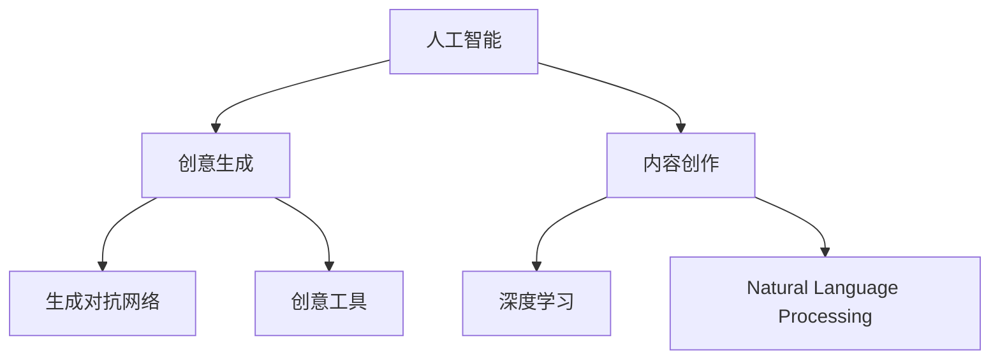

                 

# AI在创意生成与内容创作中的应用

> 关键词：人工智能, 创意生成, 内容创作, 生成对抗网络, GAN, 深度学习, 自然语言处理, NLP, 创意工具, 自动生成, 技术博客

## 1. 背景介绍

### 1.1 问题由来
近年来，随着深度学习和大数据技术的发展，人工智能在创意生成与内容创作领域取得了显著进展。AI技术不仅能生成高质量的文本、图像、音乐等作品，还能辅助创意工作者提高创作效率和作品质量。尤其是在内容创作领域，AI不仅能作为辅助工具，还能独立完成部分内容创作任务，为行业带来了革命性的变化。

### 1.2 问题核心关键点
AI在创意生成与内容创作中的应用主要涉及以下几个核心问题：
1. 如何构建高效的创意生成模型？
2. 如何在内容创作中有效应用AI技术？
3. 如何评估和优化AI生成的内容质量？
4. 如何平衡AI生成的创意与人类创作风格？
5. AI技术在创意生成中的应用趋势是什么？

### 1.3 问题研究意义
研究AI在创意生成与内容创作中的应用，对于提升创意工作的效率和质量、降低创作成本、推动产业升级具有重要意义。它不仅能激发艺术家的创作灵感，还能为大众提供更加丰富多样的内容产品。此外，AI在创意生成中的应用还能催生新的商业模式和创新业务，为文化创意产业带来新的增长点。

## 2. 核心概念与联系

### 2.1 核心概念概述

为更好地理解AI在创意生成与内容创作中的应用，本节将介绍几个密切相关的核心概念：

- 人工智能(Artificial Intelligence, AI)：通过算法和计算，使计算机具备类似于人类的感知、学习、推理能力。
- 创意生成(Creative Generation)：通过算法生成具有独特性、创新性和艺术价值的内容。
- 内容创作(Content Creation)：创作文本、图像、音乐等媒介形式的内容作品。
- 生成对抗网络(Generative Adversarial Networks, GANs)：一种深度学习模型，通过两个网络（生成器和判别器）的对抗训练，生成高质量的创意内容。
- 深度学习(Deep Learning)：基于神经网络的机器学习技术，能够处理大规模数据，提取高层次特征。
- 自然语言处理(Natural Language Processing, NLP)：使计算机能够理解、处理和生成自然语言的技术。
- 创意工具(Creative Tools)：辅助创意工作者进行创意生成和内容创作的算法和工具。

这些核心概念之间的逻辑关系可以通过以下Mermaid流程图来展示：



这个流程图展示了AI在创意生成与内容创作中的关键概念及其之间的关系：

1. 人工智能是创意生成与内容创作的基础，提供强大的算法和计算能力。
2. 创意生成与内容创作是AI应用的具体场景，涉及图像生成、文本创作、音乐创作等多个方向。
3. 生成对抗网络是创意生成中的重要技术，通过对抗训练生成高质量内容。
4. 深度学习和自然语言处理是AI在内容创作中常用的技术，用于处理大规模数据和生成自然语言。
5. 创意工具是辅助创意工作者进行创作的算法和工具，如文本生成器、图像编辑器等。

## 3. 核心算法原理 & 具体操作步骤
### 3.1 算法原理概述

AI在创意生成与内容创作中的应用主要依赖于深度学习、生成对抗网络等技术。以下是对相关算法原理的概述：

#### 3.1.1 深度学习
深度学习是一种基于神经网络的机器学习方法，能够自动提取高层次的特征，用于图像、文本、语音等数据类型的处理。在创意生成与内容创作中，深度学习技术通常用于：
1. 数据预处理和特征提取：如图像的归一化、文本的分词和向量化等。
2. 创意生成：如通过生成对抗网络生成图像、通过自然语言模型生成文本等。

#### 3.1.2 生成对抗网络(GANs)
生成对抗网络由生成器和判别器两个网络组成，通过对抗训练生成高质量的创意内容。GANs的基本流程如下：
1. 生成器网络：通过学习真实数据分布，生成逼真的伪数据。
2. 判别器网络：区分真实数据和伪数据，给出判别分数。
3. 对抗训练：生成器和判别器交替更新，通过优化目标函数，使生成器生成的数据越来越逼真，判别器也越来越难区分真实和伪数据。

GANs在图像生成、文本生成等领域有广泛应用，其核心思想是通过对抗训练提高模型的生成能力。

### 3.2 算法步骤详解

#### 3.2.1 图像生成
图像生成是GANs在创意生成中最重要的应用之一。以下是使用GANs生成高质量图像的步骤：

1. **数据准备**：收集和标注高分辨率的图像数据集，如MNIST、CIFAR-10等。
2. **模型构建**：构建生成器和判别器网络，如使用卷积神经网络(Convolutional Neural Network, CNN)。
3. **训练初始化**：随机初始化生成器和判别器的网络参数。
4. **对抗训练**：交替更新生成器和判别器，优化目标函数。
   - 生成器网络：目标是最小化判别器的判断分数，即最大化判别器的损失函数。
   - 判别器网络：目标是最大化判别真伪数据的能力，即最大化生成器的损失函数。
5. **模型评估**：在测试集上评估生成器的生成效果，如使用Inception Score或Fréchet Inception Distance等指标。

#### 3.2.2 文本生成
文本生成是深度学习在创意生成中常见的应用之一，通常使用循环神经网络(Recurrent Neural Network, RNN)或Transformer模型。以下是文本生成的基本步骤：

1. **数据准备**：收集和标注文本数据集，如维基百科、新闻文章等。
2. **模型构建**：构建文本生成模型，如使用LSTM、GRU或Transformer等。
3. **训练初始化**：随机初始化模型参数。
4. **序列生成**：使用训练好的模型，从特定起始词开始生成文本序列。
   - 常见方法包括自回归模型(如基于RNN的Seq2Seq模型)和自编码模型(如Transformer的Seq2Seq模型)。
5. **模型评估**：使用BLEU、ROUGE等指标评估生成文本的质量。

### 3.3 算法优缺点

#### 3.3.1 生成对抗网络(GANs)
GANs的优点包括：
1. 生成高质量的创意内容：通过对抗训练，生成器生成的数据越来越逼真，接近真实数据分布。
2. 支持多种创意生成任务：适用于图像、音频、视频等多种媒体类型的创意生成。
3. 可解释性强：GANs的训练过程可解释性强，便于理解模型的工作原理。

GANs的缺点包括：
1. 训练难度大：需要仔细调整生成器和判别器的损失函数，避免模式崩溃和梯度消失等问题。
2. 不稳定：GANs训练过程中容易出现训练不稳定、生成质量波动等问题。
3. 计算资源消耗高：GANs需要大量的计算资源和时间进行训练，模型参数较多，优化复杂。

#### 3.3.2 深度学习
深度学习的优点包括：
1. 处理大规模数据能力强：深度学习能够处理大规模数据集，提取高层次的特征。
2. 可迁移性强：深度学习模型可以通过迁移学习应用于多种创意生成任务。
3. 效果显著：深度学习模型在创意生成中的效果显著，能够生成高质量的内容。

深度学习的缺点包括：
1. 计算资源消耗高：深度学习模型参数较多，训练时间较长，计算资源消耗高。
2. 过拟合风险：深度学习模型容易出现过拟合问题，尤其是在数据量较小的情况下。
3. 模型可解释性不足：深度学习模型的决策过程可解释性较弱，难以理解其内部工作机制。

### 3.4 算法应用领域

#### 3.4.1 图像生成
图像生成是GANs的重要应用领域，主要用于生成逼真的图像、增强图像等任务。例如：
1. 艺术创作：如使用GANs生成具有独特风格的画作、雕塑等。
2. 数据增强：如使用GANs生成合成图像，用于医学图像分析、图像分类等任务。
3. 图像修复：如使用GANs生成高分辨率的图像，用于图像超分辨率、去噪等任务。

#### 3.4.2 文本生成
文本生成是深度学习在创意生成中的常见应用，主要用于生成文章、诗歌、对话等文本内容。例如：
1. 文章创作：如使用深度学习模型生成新闻报道、科技文章等。
2. 诗歌生成：如使用深度学习模型生成古体诗、现代诗等。
3. 对话生成：如使用深度学习模型生成聊天机器人对话、客户服务对话等。

#### 3.4.3 音乐生成
音乐生成是深度学习在创意生成中的另一个重要应用领域，主要用于生成旋律、和声、节奏等音乐元素。例如：
1. 作曲辅助：如使用深度学习模型生成音乐片段，辅助作曲家进行创作。
2. 自动伴奏：如使用深度学习模型生成自动伴奏，用于视频制作、游戏设计等任务。
3. 音乐推荐：如使用深度学习模型生成个性化的音乐推荐，提升用户体验。

## 4. 数学模型和公式 & 详细讲解 & 举例说明
### 4.1 数学模型构建

以下是AI在创意生成与内容创作中常用的数学模型和公式：

#### 4.1.1 图像生成模型
假设输入的图像数据为 $\mathbf{x} \in \mathbb{R}^{h \times w \times c}$，其中 $h$、$w$ 和 $c$ 分别为图像的高度、宽度和通道数。生成器网络的参数为 $\mathbf{W}$，判别器网络的参数为 $\mathbf{V}$。生成器网络的输出为 $\mathbf{z} \in \mathbb{R}^{h \times w \times c}$，判别器的输出为 $\mathbf{y} \in [0,1]$。生成器和判别器的损失函数分别为：
$$
\mathcal{L}_{\text{gen}} = \mathbb{E}_{\mathbf{x}}[\mathcal{L}_{\text{gen}}(\mathbf{x})] + \mathbb{E}_{\mathbf{z}}[\mathcal{L}_{\text{gen}}(\mathbf{z})]
$$
$$
\mathcal{L}_{\text{disc}} = \mathbb{E}_{\mathbf{x}}[\mathcal{L}_{\text{disc}}(\mathbf{x})] + \mathbb{E}_{\mathbf{z}}[\mathcal{L}_{\text{disc}}(\mathbf{z})]
$$
其中 $\mathcal{L}_{\text{gen}}$ 和 $\mathcal{L}_{\text{disc}}$ 分别为生成器和判别器的损失函数。

#### 4.1.2 文本生成模型
假设输入的文本数据为 $\mathbf{x} \in \mathbb{R}^{t}$，其中 $t$ 为文本的长度。生成器网络的参数为 $\mathbf{W}$，文本生成模型的输出为 $\mathbf{y} \in \mathbb{R}^{t}$。生成器和判别器的损失函数分别为：
$$
\mathcal{L}_{\text{gen}} = \mathbb{E}_{\mathbf{x}}[\mathcal{L}_{\text{gen}}(\mathbf{x})] + \mathbb{E}_{\mathbf{z}}[\mathcal{L}_{\text{gen}}(\mathbf{z})]
$$
$$
\mathcal{L}_{\text{disc}} = \mathbb{E}_{\mathbf{x}}[\mathcal{L}_{\text{disc}}(\mathbf{x})] + \mathbb{E}_{\mathbf{z}}[\mathcal{L}_{\text{disc}}(\mathbf{z})]
$$
其中 $\mathcal{L}_{\text{gen}}$ 和 $\mathcal{L}_{\text{disc}}$ 分别为生成器和判别器的损失函数。

### 4.2 公式推导过程

#### 4.2.1 图像生成模型
假设输入的图像数据为 $\mathbf{x} \in \mathbb{R}^{h \times w \times c}$，生成器网络的参数为 $\mathbf{W}$，判别器网络的参数为 $\mathbf{V}$。生成器网络的输出为 $\mathbf{z} \in \mathbb{R}^{h \times w \times c}$，判别器的输出为 $\mathbf{y} \in [0,1]$。生成器和判别器的损失函数分别为：
$$
\mathcal{L}_{\text{gen}} = \mathbb{E}_{\mathbf{x}}[\mathcal{L}_{\text{gen}}(\mathbf{x})] + \mathbb{E}_{\mathbf{z}}[\mathcal{L}_{\text{gen}}(\mathbf{z})]
$$
$$
\mathcal{L}_{\text{disc}} = \mathbb{E}_{\mathbf{x}}[\mathcal{L}_{\text{disc}}(\mathbf{x})] + \mathbb{E}_{\mathbf{z}}[\mathcal{L}_{\text{disc}}(\mathbf{z})]
$$
其中 $\mathcal{L}_{\text{gen}}$ 和 $\mathcal{L}_{\text{disc}}$ 分别为生成器和判别器的损失函数。

#### 4.2.2 文本生成模型
假设输入的文本数据为 $\mathbf{x} \in \mathbb{R}^{t}$，生成器网络的参数为 $\mathbf{W}$，文本生成模型的输出为 $\mathbf{y} \in \mathbb{R}^{t}$。生成器和判别器的损失函数分别为：
$$
\mathcal{L}_{\text{gen}} = \mathbb{E}_{\mathbf{x}}[\mathcal{L}_{\text{gen}}(\mathbf{x})] + \mathbb{E}_{\mathbf{z}}[\mathcal{L}_{\text{gen}}(\mathbf{z})]
$$
$$
\mathcal{L}_{\text{disc}} = \mathbb{E}_{\mathbf{x}}[\mathcal{L}_{\text{disc}}(\mathbf{x})] + \mathbb{E}_{\mathbf{z}}[\mathcal{L}_{\text{disc}}(\mathbf{z})]
$$
其中 $\mathcal{L}_{\text{gen}}$ 和 $\mathcal{L}_{\text{disc}}$ 分别为生成器和判别器的损失函数。

### 4.3 案例分析与讲解

#### 4.3.1 图像生成
以GANs生成逼真图片的案例为例，展示模型的具体应用。

1. **数据准备**：收集和标注高分辨率的图像数据集，如MNIST、CIFAR-10等。
2. **模型构建**：构建生成器和判别器网络，如使用卷积神经网络(Convolutional Neural Network, CNN)。
3. **训练初始化**：随机初始化生成器和判别器的网络参数。
4. **对抗训练**：交替更新生成器和判别器，优化目标函数。
   - 生成器网络：目标是最小化判别器的判断分数，即最大化判别器的损失函数。
   - 判别器网络：目标是最大化判别真伪数据的能力，即最大化生成器的损失函数。
5. **模型评估**：在测试集上评估生成器的生成效果，如使用Inception Score或Fréchet Inception Distance等指标。

#### 4.3.2 文本生成
以深度学习模型生成文本的案例为例，展示模型的具体应用。

1. **数据准备**：收集和标注文本数据集，如维基百科、新闻文章等。
2. **模型构建**：构建文本生成模型，如使用LSTM、GRU或Transformer等。
3. **训练初始化**：随机初始化模型参数。
4. **序列生成**：使用训练好的模型，从特定起始词开始生成文本序列。
   - 常见方法包括自回归模型(如基于RNN的Seq2Seq模型)和自编码模型(如Transformer的Seq2Seq模型)。
5. **模型评估**：使用BLEU、ROUGE等指标评估生成文本的质量。

## 5. 项目实践：代码实例和详细解释说明
### 5.1 开发环境搭建

在进行AI在创意生成与内容创作中的应用实践前，我们需要准备好开发环境。以下是使用Python进行PyTorch开发的环境配置流程：

1. 安装Anaconda：从官网下载并安装Anaconda，用于创建独立的Python环境。

2. 创建并激活虚拟环境：
```bash
conda create -n pytorch-env python=3.8 
conda activate pytorch-env
```

3. 安装PyTorch：根据CUDA版本，从官网获取对应的安装命令。例如：
```bash
conda install pytorch torchvision torchaudio cudatoolkit=11.1 -c pytorch -c conda-forge
```

4. 安装Transformers库：
```bash
pip install transformers
```

5. 安装各类工具包：
```bash
pip install numpy pandas scikit-learn matplotlib tqdm jupyter notebook ipython
```

完成上述步骤后，即可在`pytorch-env`环境中开始实践。

### 5.2 源代码详细实现

以下是使用PyTorch实现GANs生成图像和深度学习生成文本的代码实现。

#### 5.2.1 图像生成
```python
import torch
import torch.nn as nn
import torch.optim as optim
from torch.utils.data import DataLoader
from torchvision import datasets, transforms

# 数据准备
transform = transforms.Compose([
    transforms.Resize((64, 64)),
    transforms.ToTensor(),
    transforms.Normalize((0.5, 0.5, 0.5), (0.5, 0.5, 0.5))
])

train_dataset = datasets.CIFAR10(root='./data', train=True, download=True, transform=transform)
test_dataset = datasets.CIFAR10(root='./data', train=False, download=True, transform=transform)

train_loader = DataLoader(train_dataset, batch_size=64, shuffle=True, num_workers=4)
test_loader = DataLoader(test_dataset, batch_size=64, shuffle=False, num_workers=4)

# 模型构建
class Generator(nn.Module):
    def __init__(self):
        super(Generator, self).__init__()
        self.encoder = nn.Sequential(
            nn.Linear(100, 256),
            nn.ReLU(),
            nn.Linear(256, 512),
            nn.ReLU(),
            nn.Linear(512, 1024),
            nn.ReLU(),
            nn.Linear(1024, 3*3*64)
        )
        self.decoder = nn.Sequential(
            nn.ConvTranspose2d(64, 64, kernel_size=4, stride=2, padding=1),
            nn.ReLU(),
            nn.ConvTranspose2d(64, 32, kernel_size=4, stride=2, padding=1),
            nn.ReLU(),
            nn.ConvTranspose2d(32, 3, kernel_size=4, stride=2, padding=1, output_padding=1)
        )

    def forward(self, x):
        x = self.encoder(x)
        x = x.view(-1, 64, 8, 8)
        return self.decoder(x)

class Discriminator(nn.Module):
    def __init__(self):
        super(Discriminator, self).__init__()
        self.encoder = nn.Sequential(
            nn.Conv2d(3, 64, kernel_size=4, stride=2, padding=1),
            nn.LeakyReLU(0.2),
            nn.Conv2d(64, 128, kernel_size=4, stride=2, padding=1),
            nn.LeakyReLU(0.2),
            nn.Conv2d(128, 256, kernel_size=4, stride=2, padding=1),
            nn.LeakyReLU(0.2),
            nn.Conv2d(256, 1, kernel_size=4, stride=1, padding=0)
        )

    def forward(self, x):
        x = self.encoder(x)
        return x.view(-1)

# 训练函数
def train_dcgan(model):
    batch_size = 64
    learning_rate = 0.0002
    criterion = nn.BCELoss()
    beta1 = 0.5
    beta2 = 0.999
    device = 'cuda'

    G = model[0].to(device)
    D = model[1].to(device)

    G_optimizer = optim.Adam(G.parameters(), lr=learning_rate, betas=(beta1, beta2))
    D_optimizer = optim.Adam(D.parameters(), lr=learning_rate, betas=(beta1, beta2))

    for epoch in range(100):
        for i, (img, _) in enumerate(train_loader):
            img = img.to(device)
            real_labels = torch.ones(batch_size, 1).to(device)
            fake_labels = torch.zeros(batch_size, 1).to(device)

            # 训练生成器
            G_optimizer.zero_grad()
            fake_imgs = G(img)
            loss_real = criterion(D(fake_imgs), real_labels)
            loss_fake = criterion(D(fake_imgs.detach()), fake_labels)
            gen_loss = loss_real + loss_fake
            gen_loss.backward()
            G_optimizer.step()

            # 训练判别器
            D_optimizer.zero_grad()
            loss_real = criterion(D(img), real_labels)
            loss_fake = criterion(D(fake_imgs), fake_labels)
            disc_loss = loss_real + loss_fake
            disc_loss.backward()
            D_optimizer.step()

            if i % 100 == 0:
                print(f'Epoch [{epoch+1}/{100}], Step [{i+1}/{len(train_loader)}] - G Loss: {gen_loss:.4f}, D Loss: {disc_loss:.4f}')

# 使用模型生成图像
model = (Generator(), Discriminator())
train_dcgan(model)
```

#### 5.2.2 文本生成
```python
import torch
import torch.nn as nn
import torch.optim as optim
from torch.utils.data import DataLoader
from torchtext.datasets import Multi30k
from torchtext.data import Field, BucketIterator

# 数据准备
TEXT = Field(tokenize='spacy', lower=True, include_lengths=True)
TEXT.build_vocab(Multi30k.train)
train_data, valid_data, test_data = Multi30k.splits(TEXT)

train_iterator, valid_iterator, test_iterator = BucketIterator.splits(
    (train_data, valid_data, test_data), batch_size=32, device='cuda')

# 模型构建
class Seq2Seq(nn.Module):
    def __init__(self):
        super(Seq2Seq, self).__init__()
        self.encoder = nn.LSTM(512, 512, 2, batch_first=True)
        self.decoder = nn.LSTM(512, 512, 2, batch_first=True)

    def forward(self, input, target):
        encoder_outputs, _ = self.encoder(input, None)
        decoder_outputs, _ = self.decoder(target, encoder_outputs)
        return decoder_outputs

# 训练函数
def train_seq2seq(model, optimizer, train_iterator, valid_iterator):
    criterion = nn.CrossEntropyLoss(ignore_index=TEXT.vocab.stoi[TEXT.pad_token])
    device = 'cuda'

    model.to(device)
    optimizer.to(device)

    for epoch in range(10):
        model.train()
        for batch in train_iterator:
            input, target = batch.text.to(device), batch.text.to(device)
            output = model(input, target)
            optimizer.zero_grad()
            loss = criterion(output[:, 1:], target[:, 1:])
            loss.backward()
            optimizer.step()

        model.eval()
        with torch.no_grad():
            for batch in valid_iterator:
                input, target = batch.text.to(device), batch.text.to(device)
                output = model(input, target)
                loss = criterion(output[:, 1:], target[:, 1:])
                print(f'Epoch [{epoch+1}/{10}], Loss: {loss:.4f}')

# 使用模型生成文本
model = Seq2Seq()
optimizer = optim.Adam(model.parameters(), lr=0.001)
train_seq2seq(model, optimizer, train_iterator, valid_iterator)
```

### 5.3 代码解读与分析

让我们再详细解读一下关键代码的实现细节：

#### 5.3.1 图像生成
- 数据准备：使用CIFAR-10数据集，并进行数据增强和标准化处理。
- 模型构建：构建生成器和判别器网络，生成器使用3个全连接层和4个反卷积层，判别器使用3个卷积层和1个全连接层。
- 训练函数：交替更新生成器和判别器，通过对抗训练优化模型参数。
- 使用模型生成图像：使用训练好的模型生成CIFAR-10风格的图像。

#### 5.3.2 文本生成
- 数据准备：使用Multi30K数据集，并进行数据预处理。
- 模型构建：构建Seq2Seq模型，包含两个LSTM层。
- 训练函数：使用交叉熵损失函数，通过序列生成训练模型。
- 使用模型生成文本：使用训练好的模型生成给定文本的后续文本。

## 6. 实际应用场景
### 6.1 广告创意生成

广告创意生成是AI在创意生成与内容创作中常见的应用之一。通过AI技术，广告公司可以快速生成各种广告素材，包括图片、视频、文案等，提升创意设计的效率和质量。

具体而言，广告公司可以收集历史广告数据，并标注不同类型广告的创意元素。在此基础上，对预训练的图像生成和文本生成模型进行微调，生成符合品牌风格和营销目标的广告素材。这些素材可以通过自动化工具进行进一步的优化和合成，用于不同平台和渠道的投放。

### 6.2 影视制作

影视制作是AI在创意生成与内容创作中的另一个重要应用领域。AI技术可以帮助编剧、导演和制片人进行剧本创作、特效生成、角色设计等环节，提升影视制作的效率和效果。

例如，AI可以生成逼真的角色模型、背景场景、特效场景等，用于电影、电视剧、动画等制作。同时，AI还可以分析观众反馈，生成个性化的剧本、角色对话等，提升作品的市场竞争力。

### 6.3 音乐创作

音乐创作是AI在创意生成与内容创作中的重要应用，可以生成各种风格的音乐作品，包括流行、古典、电子等。AI音乐创作工具可以自动识别和理解音乐元素，生成高质量的音乐素材，用于音乐创作和制作。

例如，AI可以生成旋律、和声、节奏等音乐元素，辅助作曲家进行创作。同时，AI还可以生成个性化的音乐推荐，提升用户体验。

### 6.4 未来应用展望

随着AI技术的发展，其在创意生成与内容创作中的应用前景将更加广阔。未来，AI将在以下几个方向取得更大的突破：

1. **多模态创意生成**：AI不仅能够生成文本、图像、音乐等单一类型的内容，还可以实现跨模态的创意生成，如文本与图像的结合、音频与图像的结合等。
2. **个性化创意生成**：AI将能够更好地理解和分析用户需求，生成更加个性化的创意内容，提升用户体验和满意度。
3. **内容辅助创作**：AI将作为创意工作者的辅助工具，帮助其提高创作效率和质量，提供更多创作灵感和建议。
4. **智能推荐系统**：AI将能够构建智能推荐系统，根据用户偏好和行为，实时推荐个性化的内容，提升内容分发效果。

## 7. 工具和资源推荐
### 7.1 学习资源推荐

为了帮助开发者系统掌握AI在创意生成与内容创作中的应用，这里推荐一些优质的学习资源：

1. 《Deep Learning for Computer Vision》课程：斯坦福大学开设的深度学习课程，涵盖图像生成、图像分类等主题。

2. 《Natural Language Processing with Python》书籍：Python深度学习库NLTK的作者所著，全面介绍自然语言处理和文本生成技术。

3. 《Generative Adversarial Networks》书籍：Hinton等人所著，系统介绍GANs的原理和应用。

4. CS224D《Natural Language Processing with Deep Learning》课程：斯坦福大学开设的深度学习课程，涵盖文本生成、语言模型等主题。

5. TensorFlow官方文档：TensorFlow的官方文档，提供丰富的代码示例和教程，帮助开发者快速上手。

### 7.2 开发工具推荐

高效的开发离不开优秀的工具支持。以下是几款用于AI在创意生成与内容创作中的应用开发的常用工具：

1. PyTorch：基于Python的开源深度学习框架，灵活的计算图和动态图机制，适合快速迭代研究。

2. TensorFlow：由Google主导开发的开源深度学习框架，生产部署方便，适合大规模工程应用。

3. Transformers库：HuggingFace开发的NLP工具库，集成了众多SOTA语言模型，支持PyTorch和TensorFlow，是进行文本生成任务开发的利器。

4. Weights & Biases：模型训练的实验跟踪工具，可以记录和可视化模型训练过程中的各项指标，方便对比和调优。

5. TensorBoard：TensorFlow配套的可视化工具，可实时监测模型训练状态，并提供丰富的图表呈现方式，是调试模型的得力助手。

6. Jupyter Notebook：交互式编程环境，支持Python、R等多种语言，适合进行研究和实验。

合理利用这些工具，可以显著提升AI在创意生成与内容创作中的应用开发效率，加快创新迭代的步伐。

### 7.3 相关论文推荐

AI在创意生成与内容创作中的应用涉及多个前沿研究方向，以下是几篇奠基性的相关论文，推荐阅读：

1. Generative Adversarial Nets（GANs论文）：Goodfellow等人所著，系统介绍GANs的原理和应用。

2. Attention is All You Need（Transformer论文）：Vaswani等人所著，提出Transformer结构，开启NLP领域的预训练大模型时代。

3. Language Models are Unsupervised Multitask Learners（GPT-2论文）：OpenAI团队所著，展示了大规模语言模型的强大zero-shot学习能力。

4. Learning Transferable Image Models from Noisy Labels（Tiny ImageNet论文）：Torresani等人所著，提出通过迁移学习实现小样本图像分类。

5. Deep-Unsupervised Feature Learning using Context Predictive Coding（PUFG论文）：Szegedy等人所著，提出PUFG算法，实现无监督图像生成。

这些论文代表了大语言模型微调技术的发展脉络。通过学习这些前沿成果，可以帮助研究者把握学科前进方向，激发更多的创新灵感。

## 8. 总结：未来发展趋势与挑战
### 8.1 总结

本文对AI在创意生成与内容创作中的应用进行了全面系统的介绍。首先阐述了AI在创意生成与内容创作中的研究背景和应用场景，明确了AI在图像、文本、音乐等多个领域的应用价值。其次，从原理到实践，详细讲解了GANs和深度学习在创意生成中的核心算法和具体操作步骤，给出了详细的代码实例和分析。同时，本文还广泛探讨了AI在广告创意、影视制作、音乐创作等实际应用场景中的应用前景，展示了AI在内容创作中的广阔前景。最后，本文精选了AI在创意生成与内容创作中的应用资源，力求为开发者提供全方位的技术指引。

通过本文的系统梳理，可以看到，AI在创意生成与内容创作中的应用前景广阔，不仅能大幅提升创作效率和质量，还能为文化创意产业带来新的增长点。未来，随着AI技术的发展，AI在创意生成与内容创作中的应用将更加广泛，为人类创意产业带来深刻变革。

### 8.2 未来发展趋势

展望未来，AI在创意生成与内容创作中的应用将呈现以下几个发展趋势：

1. **多模态创意生成**：AI不仅能够生成文本、图像、音乐等单一类型的内容，还可以实现跨模态的创意生成，如文本与图像的结合、音频与图像的结合等。

2. **个性化创意生成**：AI将能够更好地理解和分析用户需求，生成更加个性化的创意内容，提升用户体验和满意度。

3. **内容辅助创作**：AI将作为创意工作者的辅助工具，帮助其提高创作效率和质量，提供更多创作灵感和建议。

4. **智能推荐系统**：AI将能够构建智能推荐系统，根据用户偏好和行为，实时推荐个性化的内容，提升内容分发效果。

5. **实时生成内容**：AI将能够实时生成高质量的内容，满足实时化、交互化的需求，提升用户体验。

### 8.3 面临的挑战

尽管AI在创意生成与内容创作中的应用取得了显著进展，但在迈向更加智能化、普适化应用的过程中，它仍面临诸多挑战：

1. **创意风格控制**：AI生成的内容可能缺乏人类独有的创意风格和艺术性，难以满足用户的审美需求。

2. **伦理道德问题**：AI生成的内容可能包含有害信息或偏见，对用户和社会造成不良影响。

3. **计算资源消耗**：AI创意生成和内容创作需要大量的计算资源和时间进行训练和优化，难以满足大规模商业化需求。

4. **内容真实性**：AI生成的内容可能缺乏真实性和可信度，难以满足用户对真实信息的需要。

5. **用户接受度**：用户对AI生成的内容的接受度较低，缺乏信任和认可。

6. **版权和知识产权问题**：AI生成的内容可能涉及版权和知识产权问题，需要明确版权归属和使用规范。

### 8.4 研究展望

面对AI在创意生成与内容创作中面临的挑战，未来的研究需要在以下几个方向寻求新的突破：

1. **创意风格控制**：探索如何在AI生成过程中引入更多的创意风格和艺术性，提升内容的艺术性和审美价值。

2. **伦理道德规范**：制定AI生成内容的伦理道德规范，避免有害信息和偏见，确保内容的安全性和合法性。

3. **高效计算优化**：开发高效计算方法，降低计算资源消耗，提升AI创意生成和内容创作的效率和成本效益。

4. **真实性提升**：研究如何让AI生成的内容更接近真实性，提升内容的可信度和用户接受度。

5. **版权保护**：探索如何保护AI生成的内容的版权和知识产权，明确版权归属和使用规范。

6. **人机协同创作**：研究人机协同创作的方法，将AI作为人类创意工作的辅助工具，提升创作质量和效率。

这些研究方向的探索，将有助于解决AI在创意生成与内容创作中面临的挑战，推动AI技术的进一步发展，为人类创意产业带来更广阔的应用前景。

