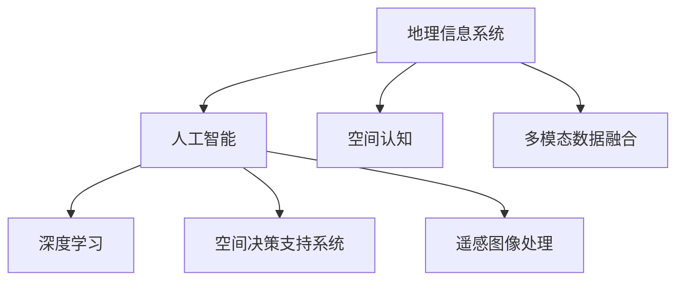

                 

# AI在地理信息系统中的应用:增强空间分析

> 关键词：地理信息系统(GIS), 人工智能(AI), 空间分析, 空间认知, 多模态数据融合, 深度学习, 空间决策支持系统, 遥感图像处理

## 1. 背景介绍

地理信息系统（GIS）是一个专门处理地理空间数据的软件系统，广泛应用于城市规划、环境监测、灾害预警、自然资源管理等领域。随着人工智能（AI）技术的迅速发展，AI在GIS中的应用越来越广泛，极大地提升了空间数据的处理能力。

### 1.1 问题的由来

在GIS领域，传统的数据分析主要依赖于人工处理，耗费大量时间和人力资源。同时，GIS数据通常具有高维度、复杂性等特点，传统方法难以有效地处理这些数据。而AI，尤其是深度学习，在处理高维度数据时具有独特的优势，可以大大提高空间分析的效率和准确性。

### 1.2 问题核心关键点

AI在GIS中的应用主要集中在以下几个关键点：
- **数据预处理**：AI能够自动完成复杂的数据预处理工作，包括缺失值填充、异常值处理、归一化等。
- **特征提取**：AI可以自动学习数据的潜在特征，提升模型的泛化能力。
- **空间预测**：AI在空间数据上具有强大的预测能力，可用于进行地理空间的预测。
- **模式识别**：AI能够识别出复杂数据中的潜在模式，辅助决策分析。
- **交互式分析**：AI可以通过自然语言理解技术，实现交互式空间分析。

## 2. 核心概念与联系

### 2.1 核心概念概述

为更好地理解AI在GIS中的应用，本节将介绍几个密切相关的核心概念：

- **地理信息系统(GIS)**：一种集成、存储、管理和分析地理空间数据的计算机系统。GIS的核心技术包括数据采集、处理、分析和可视化。

- **人工智能(AI)**：一种模拟人类智能的计算机技术，涵盖机器学习、深度学习、自然语言处理等多个子领域。AI在GIS中的应用主要集中在数据处理、空间预测、模式识别等方面。

- **空间认知**：指对地理空间数据的理解和分析能力，包括空间位置、形状、大小、距离等的认知。

- **多模态数据融合**：指将多种类型的数据（如遥感图像、地面测量数据、气象数据等）融合，提升空间数据的综合利用率。

- **深度学习**：一种基于神经网络的机器学习方法，能够处理高维度的复杂数据，尤其适合于图像、语音、文本等数据类型。

- **空间决策支持系统(SDSS)**：一种集成GIS和AI技术，为决策者提供空间分析和预测的辅助系统。

- **遥感图像处理**：指对遥感卫星或无人机拍摄的图像进行预处理、特征提取和分类等。

这些核心概念之间的逻辑关系可以通过以下Mermaid流程图来展示：



这个流程图展示了大语言模型的核心概念及其之间的关系：

1. 地理信息系统(GIS)是基础，提供空间数据的存储和管理。
2. 人工智能(AI)为GIS提供技术支持，增强了数据处理和分析能力。
3. 空间认知指GIS对空间数据的理解能力，是GIS的核心功能之一。
4. 多模态数据融合将多种类型的数据整合，提升数据的综合利用率。
5. 深度学习在大规模数据处理方面具有优势，适合用于图像和文本等复杂数据。
6. 空间决策支持系统综合了GIS和AI技术，提供决策辅助。
7. 遥感图像处理是GIS的重要组成部分，通过AI提升图像分类和分析能力。

## 3. 核心算法原理 & 具体操作步骤

### 3.1 算法原理概述

AI在GIS中的主要算法原理可以归纳为以下几点：

- **数据预处理**：利用AI进行缺失值填充、异常值处理、归一化等预处理工作，提升数据质量。
- **特征提取**：通过深度学习算法，自动学习数据的潜在特征，提升模型的泛化能力。
- **空间预测**：利用AI在空间数据上的预测能力，进行地理空间的预测和分析。
- **模式识别**：AI能够识别出复杂数据中的潜在模式，辅助决策分析。
- **交互式分析**：利用自然语言处理技术，实现交互式空间分析。

### 3.2 算法步骤详解

AI在GIS中的应用通常分为以下几个步骤：

**Step 1: 数据收集与预处理**
- 收集地理空间数据，如遥感图像、地面测量数据、气象数据等。
- 利用AI进行数据预处理，包括缺失值填充、异常值处理、归一化等。

**Step 2: 特征提取**
- 利用深度学习算法，自动学习数据的潜在特征，提升模型的泛化能力。
- 对提取的特征进行编码和降维，提升模型的计算效率。

**Step 3: 空间预测**
- 利用深度学习算法，对地理空间数据进行预测，如土地利用变化、洪涝灾害预警等。
- 对预测结果进行验证和优化，提高预测的准确性和可靠性。

**Step 4: 模式识别**
- 利用深度学习算法，识别出复杂数据中的潜在模式，如城市扩张、农业种植等。
- 对识别出的模式进行分类和分析，辅助决策分析。

**Step 5: 交互式分析**
- 利用自然语言处理技术，实现交互式空间分析。
- 用户可以通过自然语言描述地理空间问题，系统自动生成分析结果。

### 3.3 算法优缺点

AI在GIS中的应用具有以下优点：
1. **自动化处理**：AI能够自动完成数据预处理和特征提取工作，提高处理效率。
2. **高维度处理**：AI能够处理高维度的复杂数据，提升模型的泛化能力。
3. **空间预测**：AI在空间数据上具有强大的预测能力，可用于进行地理空间的预测。
4. **模式识别**：AI能够识别出复杂数据中的潜在模式，辅助决策分析。
5. **交互式分析**：利用自然语言处理技术，实现交互式空间分析，提升用户体验。

同时，该方法也存在一定的局限性：
1. **依赖标注数据**：AI模型的训练需要大量的标注数据，获取高质量标注数据的成本较高。
2. **模型复杂度高**：深度学习模型复杂度较高，训练和推理耗时较长。
3. **可解释性不足**：AI模型的决策过程通常缺乏可解释性，难以对其推理逻辑进行分析和调试。
4. **数据隐私问题**：在处理敏感数据时，数据隐私问题需特别关注。
5. **计算资源需求高**：AI在GIS中的应用对计算资源的需求较高，需要高性能的计算设备和算法支持。

### 3.4 算法应用领域

AI在GIS中的应用领域非常广泛，涵盖城市规划、环境监测、灾害预警、自然资源管理等多个领域。以下是几个典型的应用场景：

- **城市规划**：利用AI进行城市交通分析、人口密度预测、土地利用规划等。
- **环境监测**：利用AI进行森林覆盖变化监测、水质监测、空气质量预测等。
- **灾害预警**：利用AI进行洪水、地震、火灾等自然灾害的预警和评估。
- **自然资源管理**：利用AI进行土地利用变化监测、农业种植预测、矿产资源勘探等。

此外，AI还在智慧城市、数字农业、地理安全等更多领域得到广泛应用，为GIS技术的发展提供了新的动力。

## 4. 数学模型和公式 & 详细讲解 & 举例说明

### 4.1 数学模型构建

AI在GIS中的应用，通常利用深度学习模型进行空间数据的处理和分析。以遥感图像分类为例，模型的输入为遥感图像，输出为分类的类别标签。假设模型为 $M_{\theta}$，输入为 $x$，输出为 $y$，损失函数为 $\ell(y,\hat{y})$，则模型的训练目标可以表示为：

$$
\mathcal{L}(\theta) = \frac{1}{N}\sum_{i=1}^N \ell(y_i, M_{\theta}(x_i))
$$

其中 $N$ 为样本数量，$y_i$ 为真实标签，$\hat{y}$ 为模型预测结果。

### 4.2 公式推导过程

以遥感图像分类为例，深度学习模型 $M_{\theta}$ 的输出可以表示为：

$$
\hat{y} = M_{\theta}(x)
$$

其中 $x$ 为遥感图像，$M_{\theta}$ 为深度学习模型，$\theta$ 为模型参数。假设模型为卷积神经网络，则输出层通常为全连接层，输出每个类别的概率分布。对于二分类问题，可以表示为：

$$
\hat{y} = \sigma(\sum_{i=1}^N w_i x_i + b)
$$

其中 $w$ 和 $b$ 为模型参数，$\sigma$ 为激活函数。损失函数为二元交叉熵损失：

$$
\ell(y,\hat{y}) = -(y\log \hat{y} + (1-y)\log(1-\hat{y}))
$$

在训练过程中，使用梯度下降算法更新模型参数 $\theta$：

$$
\theta \leftarrow \theta - \eta \nabla_{\theta} \mathcal{L}(\theta)
$$

其中 $\eta$ 为学习率，$\nabla_{\theta} \mathcal{L}(\theta)$ 为损失函数对模型参数的梯度。

### 4.3 案例分析与讲解

以遥感图像分类为例，假设我们有一组遥感图像，标签为森林、非森林两类。我们可以使用卷积神经网络进行模型训练，步骤如下：

1. **数据准备**：将遥感图像和标签组成训练集 $D$，进行预处理，如归一化、图像增强等。

2. **模型构建**：构建卷积神经网络模型，包括卷积层、池化层、全连接层等。

3. **训练模型**：使用训练集 $D$ 进行模型训练，最小化损失函数 $\mathcal{L}(\theta)$。

4. **模型评估**：在验证集上评估模型性能，调整模型参数。

5. **模型应用**：利用训练好的模型对新的遥感图像进行分类预测。

在实践中，可以通过TensorFlow、PyTorch等深度学习框架，利用丰富的预训练模型和工具库，快速实现遥感图像分类的模型训练和应用。

## 5. 项目实践：代码实例和详细解释说明

### 5.1 开发环境搭建

在进行GISAI项目开发前，我们需要准备好开发环境。以下是使用Python进行PyTorch开发的环境配置流程：

1. 安装Anaconda：从官网下载并安装Anaconda，用于创建独立的Python环境。

2. 创建并激活虚拟环境：
```bash
conda create -n gisai-env python=3.8 
conda activate gisai-env
```

3. 安装PyTorch：根据CUDA版本，从官网获取对应的安装命令。例如：
```bash
conda install pytorch torchvision torchaudio cudatoolkit=11.1 -c pytorch -c conda-forge
```

4. 安装TensorFlow：
```bash
conda install tensorflow -c pytorch -c conda-forge
```

5. 安装各类工具包：
```bash
pip install numpy pandas scikit-learn matplotlib tqdm jupyter notebook ipython
```

完成上述步骤后，即可在`gisai-env`环境中开始GISAI项目的开发。

### 5.2 源代码详细实现

下面我们以遥感图像分类为例，给出使用TensorFlow对卷积神经网络进行GISAI项目开发的PyTorch代码实现。

首先，定义遥感图像分类数据集：

```python
from tensorflow import keras
from tensorflow.keras.preprocessing.image import ImageDataGenerator

train_generator = ImageDataGenerator(rescale=1./255)
train_generator.fit(X_train)

test_generator = ImageDataGenerator(rescale=1./255)
test_generator.fit(X_test)
```

然后，定义卷积神经网络模型：

```python
model = keras.Sequential([
    keras.layers.Conv2D(32, (3,3), activation='relu', input_shape=(256,256,3)),
    keras.layers.MaxPooling2D((2,2)),
    keras.layers.Conv2D(64, (3,3), activation='relu'),
    keras.layers.MaxPooling2D((2,2)),
    keras.layers.Flatten(),
    keras.layers.Dense(128, activation='relu'),
    keras.layers.Dense(1, activation='sigmoid')
])
```

接着，定义损失函数和优化器：

```python
model.compile(optimizer='adam', loss='binary_crossentropy', metrics=['accuracy'])
```

最后，训练模型并进行评估：

```python
history = model.fit(train_generator, epochs=10, validation_data=test_generator)
model.evaluate(test_generator)
```

以上就是使用TensorFlow对卷积神经网络进行遥感图像分类的GISAI项目开发的完整代码实现。可以看到，借助TensorFlow强大的数据流图和层化结构，可以快速实现遥感图像分类的模型训练和应用。

### 5.3 代码解读与分析

让我们再详细解读一下关键代码的实现细节：

**ImageDataGenerator**：
- 用于数据增强和预处理，如图像归一化、随机裁剪等。

**Sequential模型构建**：
- 使用Sequential模型进行卷积神经网络的设计，包含卷积层、池化层、全连接层等。

**训练模型**：
- 使用fit函数进行模型训练，最小化损失函数，并记录训练过程。

**评估模型**：
- 使用evaluate函数在测试集上评估模型性能。

可以看到，TensorFlow提供了丰富的工具库和预训练模型，极大地简化了GISAI项目的开发流程。开发者可以将更多精力放在数据处理、模型改进等高层逻辑上，而不必过多关注底层的实现细节。

当然，工业级的系统实现还需考虑更多因素，如模型的保存和部署、超参数的自动搜索、更灵活的任务适配层等。但核心的GISAI范式基本与此类似。

## 6. 实际应用场景

### 6.1 智能交通

在智能交通领域，AI可以用于交通流量分析、交通信号优化、路径规划等。利用AI对交通数据进行空间分析，可以实时监测交通状况，预测交通流量，优化交通信号控制，从而缓解交通拥堵，提高出行效率。

### 6.2 城市安全

在城市安全领域，AI可以用于视频监控、公共安全事件监测、社会治安分析等。利用AI对视频监控数据进行空间分析，可以实时监测公共场所，识别异常行为，提高公共安全防范能力。

### 6.3 资源管理

在资源管理领域，AI可以用于森林覆盖监测、水资源管理、能源分布优化等。利用AI对遥感数据进行空间分析，可以实时监测资源变化，优化资源分布，提高资源管理效率。

### 6.4 农业生产

在农业生产领域，AI可以用于农作物监测、土壤分析、农业气象预测等。利用AI对农业数据进行空间分析，可以实时监测农作物生长状况，优化农业生产，提高农业生产效率。

### 6.5 健康监测

在健康监测领域，AI可以用于疾病预测、流行病监测、健康风险评估等。利用AI对医疗数据进行空间分析，可以实时监测疾病传播趋势，评估健康风险，提高公共卫生水平。

### 6.6 环境监测

在环境监测领域，AI可以用于水质监测、空气质量预测、灾害预警等。利用AI对环境数据进行空间分析，可以实时监测环境变化，预测环境风险，提高环境监测水平。

## 7. 工具和资源推荐

### 7.1 学习资源推荐

为了帮助开发者系统掌握AI在GIS中的应用，这里推荐一些优质的学习资源：

1. 《Python地理信息系统与机器学习》书籍：详细介绍了GIS和机器学习的基础知识和应用实践，涵盖数据预处理、特征提取、模型训练等多个方面。

2. 《深度学习在遥感图像处理中的应用》课程：斯坦福大学开设的深度学习与遥感图像处理课程，涵盖了深度学习在遥感图像分类、目标检测等方面的应用。

3. 《AI在GIS中的应用》在线课程：Coursera平台提供的AI在GIS中的应用课程，详细介绍了AI在地理空间数据分析中的应用，包括数据预处理、空间预测、模式识别等。

4. 《GISAI技术手册》书籍：全面的GISAI技术手册，涵盖数据预处理、模型构建、训练评估等多个环节，适合GISAI初学者和从业者参考。

5. 《AI在GIS中的应用》博客：涵盖AI在GIS中的各种应用案例和实践经验，帮助开发者快速掌握AI在GIS中的使用技巧。

通过对这些资源的学习实践，相信你一定能够快速掌握AI在GIS中的应用精髓，并用于解决实际的GIS问题。

### 7.2 开发工具推荐

高效的开发离不开优秀的工具支持。以下是几款用于GISAI开发的常用工具：

1. TensorFlow：基于Python的开源深度学习框架，支持动态计算图和静态计算图，适合构建复杂模型。

2. PyTorch：基于Python的开源深度学习框架，支持动态计算图，适合快速迭代研究。

3. GeoPandas：基于Pandas的地理空间数据处理库，支持地理数据的导入、处理和分析。

4. GDAL：开源的地理空间数据处理库，支持多种地理空间数据格式和操作。

5. QGIS：开源的地理信息系统软件，支持地理数据的可视化、分析和共享。

合理利用这些工具，可以显著提升GISAI任务的开发效率，加快创新迭代的步伐。

### 7.3 相关论文推荐

AI在GIS中的应用源于学界的持续研究。以下是几篇奠基性的相关论文，推荐阅读：

1. Deep Learning for Earth Observation: A Review （《遥感数据的深度学习：综述》）：综述了深度学习在遥感图像分类、目标检测、变化监测等方面的应用。

2. Geospatial deep learning for the visual geologist: using artificial neural networks to automate geological field mapping（《深度学习在地质学家中的应用：使用人工神经网络自动地质田野映射》）：介绍了深度学习在地质田野映射中的应用。

3. Spatial cognition and natural language processing（《空间认知和自然语言处理》）：探讨了自然语言处理在空间认知中的应用，如交互式空间分析、空间问题描述等。

4. A review of using artificial intelligence in environmental science and management: Integrating AI in decision support systems for water management（《人工智能在环境科学与管理中的应用综述：将AI集成到水资源管理决策支持系统中》）：综述了人工智能在水资源管理中的应用。

这些论文代表了大语言模型微调技术的发展脉络。通过学习这些前沿成果，可以帮助研究者把握学科前进方向，激发更多的创新灵感。

## 8. 总结：未来发展趋势与挑战

### 8.1 总结

本文对AI在GIS中的应用进行了全面系统的介绍。首先阐述了AI在GIS中的研究背景和意义，明确了AI在GIS中的应用优势和面临的挑战。其次，从原理到实践，详细讲解了AI在GIS中的应用算法和具体操作步骤，给出了GISAI项目开发的完整代码实例。同时，本文还广泛探讨了AI在GIS中的各种应用场景，展示了AI在GIS中的巨大潜力。此外，本文精选了GISAI技术的各类学习资源，力求为读者提供全方位的技术指引。

通过本文的系统梳理，可以看到，AI在GIS中的应用已经成为GIS领域的重要范式，极大地提升了GIS数据的处理能力和应用效果。未来，伴随AI技术的不断进步，GISAI技术必将在更多领域得到应用，为GIS技术的发展提供新的动力。

### 8.2 未来发展趋势

展望未来，AI在GIS中的应用将呈现以下几个发展趋势：

1. **多模态数据融合**：未来的GISAI系统将更加注重多模态数据的融合，包括遥感数据、地面测量数据、气象数据等，提升数据的综合利用率。

2. **深度学习模型的优化**：未来的GISAI系统将更加注重深度学习模型的优化，如模型压缩、模型并行、知识蒸馏等，提高模型的计算效率和精度。

3. **空间预测的精细化**：未来的GISAI系统将更加注重空间预测的精细化，通过引入更多的先验知识和数据，提升预测的准确性和可靠性。

4. **交互式分析的智能化**：未来的GISAI系统将更加注重交互式分析的智能化，通过自然语言处理技术，实现更加智能化的空间分析。

5. **数据隐私保护**：未来的GISAI系统将更加注重数据隐私保护，通过数据加密、差分隐私等技术，保障数据的隐私和安全。

以上趋势凸显了GISAI技术的广阔前景。这些方向的探索发展，必将进一步提升GISAI系统的性能和应用范围，为GIS技术的发展提供新的动力。

### 8.3 面临的挑战

尽管AI在GIS中的应用已经取得了显著成就，但在迈向更加智能化、普适化应用的过程中，仍面临诸多挑战：

1. **数据质量和标注成本**：获取高质量标注数据的成本较高，尤其是对于一些长尾应用场景，数据标注难度大。

2. **计算资源需求**：AI在GIS中的应用对计算资源的需求较高，需要高性能的计算设备和算法支持。

3. **模型解释性不足**：AI模型的决策过程通常缺乏可解释性，难以对其推理逻辑进行分析和调试。

4. **数据隐私问题**：在处理敏感数据时，数据隐私问题需特别关注，数据泄露风险较高。

5. **计算效率问题**：AI在GIS中的应用计算效率较低，尤其是在处理大规模数据时，推理速度较慢，推理资源占用较高。

6. **数据格式兼容性**：不同的GIS系统可能采用不同的数据格式和标准，AI模型难以直接进行应用。

以上挑战需要从数据、算法、工程、业务等多个维度进行综合考虑，才能更好地解决。

### 8.4 研究展望

面对GISAI所面临的种种挑战，未来的研究需要在以下几个方面寻求新的突破：

1. **数据预处理和增强**：开发更高效的数据预处理和增强技术，降低数据标注成本，提升数据质量。

2. **模型压缩和优化**：开发更高效的深度学习模型压缩和优化技术，提升模型的计算效率和精度。

3. **多模态数据的融合**：开发更高效的多模态数据融合技术，提升数据的综合利用率。

4. **交互式分析的智能化**：开发更智能的交互式分析技术，实现更加智能化的空间分析。

5. **数据隐私保护**：开发更高效的数据隐私保护技术，保障数据的隐私和安全。

6. **跨系统兼容性**：开发更灵活的跨系统兼容性技术，实现不同GIS系统之间的数据交换和应用。

这些研究方向的探索，必将引领GISAI技术迈向更高的台阶，为GIS技术的发展提供新的动力。

## 9. 附录：常见问题与解答

**Q1：AI在GIS中的应用是否适用于所有GIS任务？**

A: AI在GIS中的应用，适用于大多数GIS任务，尤其是对于需要大规模数据处理和复杂数据分析的任务。但对于一些特定领域，如军事地理信息、国家安全地理信息等，AI的应用需要特别注意数据隐私和安全问题。

**Q2：AI在GIS中的应用如何应对数据质量和标注成本的问题？**

A: 为了应对数据质量和标注成本的问题，可以采用以下策略：
- 数据增强：利用数据增强技术，通过旋转、缩放、裁剪等方式，生成更多的训练样本。
- 半监督学习：利用少量标注数据，结合无监督学习技术，提高模型的泛化能力。
- 主动学习：通过主动选择样本进行标注，提高标注数据的利用效率。

**Q3：AI在GIS中的应用如何提升数据隐私保护？**

A: 为了提升数据隐私保护，可以采用以下策略：
- 数据加密：在数据传输和存储过程中，采用加密技术保护数据隐私。
- 差分隐私：在数据处理过程中，采用差分隐私技术，保护数据隐私。
- 联邦学习：利用联邦学习技术，在本地设备上进行模型训练，避免数据泄露。

**Q4：AI在GIS中的应用如何提升计算效率？**

A: 为了提升计算效率，可以采用以下策略：
- 模型压缩：通过模型压缩技术，减小模型参数量，降低计算资源需求。
- 模型并行：利用模型并行技术，将计算任务分配到多个设备上，提高计算效率。
- 数据分片：通过数据分片技术，减少模型计算的数据量，降低计算资源需求。

**Q5：AI在GIS中的应用如何实现跨系统兼容性？**

A: 为了实现跨系统兼容性，可以采用以下策略：
- 标准化数据格式：采用标准化的数据格式，实现不同GIS系统之间的数据交换。
- 统一API接口：采用统一的API接口，实现不同GIS系统之间的功能调用。
- 模型微调：在目标GIS系统中，对AI模型进行微调，提升模型适应性。

这些策略可以帮助AI在GIS中的应用更好地应对数据质量和标注成本、计算资源需求、数据隐私保护、计算效率和跨系统兼容性等问题，提升GISAI技术的实用性。

---

作者：禅与计算机程序设计艺术 / Zen and the Art of Computer Programming

