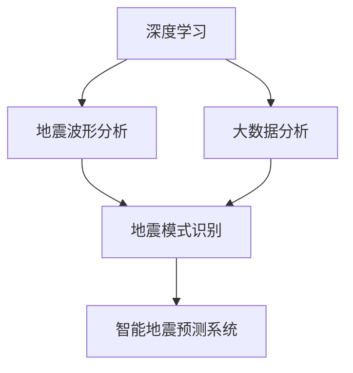

                 

# AI在地震预测中的应用:减少自然灾害影响

在科技日益发达的今天，自然灾害预测技术也取得了长足的进步，尤其是人工智能(AI)在地震预测中的应用，引起了广泛关注。通过深度学习、大数据分析、地震波形分析等方法，AI技术在地震预测和减灾方面展现了强大的潜力，有望大幅减少自然灾害带来的损失。本文将详细介绍AI在地震预测中的核心算法原理、具体操作步骤，以及实际应用场景和未来发展趋势，并探讨其面临的挑战与未来突破方向。

## 1. 背景介绍

### 1.1 问题由来

地震作为一种突发的自然灾害，具有巨大的破坏力和突发性，对人类社会造成了严重威胁。然而，传统的地震预测方法如基于地质结构、历史地震记录的分析，往往难以在地震发生前提供精确的预测，导致灾害响应效率低下。为此，科学家和工程师们一直在探索如何利用现代科技，提升地震预测的准确性和及时性。

近年来，随着深度学习、大数据、自然语言处理等人工智能技术的迅速发展，AI在地震预测中的应用也得到了广泛研究。例如，利用机器学习算法分析地震波形、地质数据、环境变化等信号，尝试从海量数据中提取地震发生的特征，提升地震预测的准确性。

### 1.2 问题核心关键点

AI在地震预测中的应用，主要涉及以下几个核心关键点：

- **深度学习算法**：利用卷积神经网络(CNN)、循环神经网络(RNN)、长短期记忆网络(LSTM)等深度学习算法，从地震波形、地质数据中提取特征，提升地震预测的准确性。

- **大数据分析**：通过收集和分析全球范围内的地震数据，挖掘数据中的潜在规律和关联，为地震预测提供数据支持。

- **地震波形分析**：利用地震波形分析技术，从地震记录中提取地震波的频率、波速等关键参数，为地震预测提供基础依据。

- **地震模式识别**：利用机器学习算法识别地震前兆模式，提升地震预测的准确性和及时性。

- **智能地震预测系统**：将上述技术集成到智能地震预测系统中，实现实时监控、预警和应急响应。

以上核心关键点共同构成了AI在地震预测中的应用框架，通过深度学习、大数据分析、地震波形分析等技术手段，有望实现对地震的精确预测，减少自然灾害带来的损失。

## 2. 核心概念与联系

### 2.1 核心概念概述

为更好地理解AI在地震预测中的应用，本节将介绍几个密切相关的核心概念：

- **深度学习**：一种基于神经网络结构的机器学习方法，通过大量数据训练模型，提取数据的高级特征，从而实现对复杂任务的预测和分类。

- **地震波形分析**：利用地震波的频率、波速、波形等特征，对地震事件进行预测和分类，是地震预测的重要手段之一。

- **大数据分析**：通过对海量数据的收集和分析，挖掘数据中的潜在规律和关联，为地震预测提供数据支持。

- **模式识别**：利用机器学习算法识别数据中的模式和规律，用于地震预测和分类。

- **智能地震预测系统**：将深度学习、地震波形分析、大数据分析等技术集成到智能系统中，实现地震的实时预测和预警。

这些核心概念之间的逻辑关系可以通过以下Mermaid流程图来展示：



这个流程图展示了大语言模型的核心概念及其之间的关系：

1. 深度学习通过大量数据训练模型，提取地震波形和地质数据的特征。
2. 地震波形分析从地震波形中提取关键参数。
3. 大数据分析挖掘全球地震数据中的潜在规律。
4. 模式识别识别地震前兆模式。
5. 智能地震预测系统将上述技术集成，实现实时预测和预警。

## 3. 核心算法原理 & 具体操作步骤

### 3.1 算法原理概述

AI在地震预测中，主要涉及以下核心算法原理：

1. **深度学习算法**：通过卷积神经网络(CNN)、循环神经网络(RNN)、长短期记忆网络(LSTM)等，从地震波形、地质数据中提取特征。
2. **大数据分析**：利用统计学方法，从海量地震数据中挖掘潜在规律，如震源深度、震级分布等。
3. **地震波形分析**：通过傅里叶变换、小波变换等方法，分析地震波的频率、波速等特征。
4. **模式识别**：利用机器学习算法，识别地震前兆模式，如地壳变形、地下水位变化等。
5. **智能地震预测系统**：将上述技术集成到系统中，实现地震的实时监控、预警和应急响应。

### 3.2 算法步骤详解

以下详细讲解AI在地震预测中的具体操作步骤：

**Step 1: 数据收集与预处理**
- 收集全球范围内的地震数据，包括地震波形、地质数据、环境变化数据等。
- 对数据进行清洗和预处理，去除噪音和异常值，确保数据质量。

**Step 2: 特征提取**
- 利用深度学习算法，提取地震波形、地质数据的高级特征，用于地震预测。
- 对地震波形进行傅里叶变换或小波变换，提取频率、波速等关键参数。
- 利用机器学习算法，从地质数据中提取与地震相关的特征，如地壳变形、地下水位变化等。

**Step 3: 模型训练与验证**
- 选择适当的深度学习模型，如CNN、RNN、LSTM等，训练地震预测模型。
- 利用历史地震数据进行模型训练，并在验证集上进行模型评估。
- 调整模型参数，选择最优模型。

**Step 4: 模型部署与预警**
- 将训练好的模型部署到智能地震预测系统中。
- 实时监控地震波形、地质数据等输入数据，触发预警机制。
- 向相关部门发送预警信息，启动应急响应。

**Step 5: 效果评估与优化**
- 定期评估地震预测模型的性能，收集反馈信息。
- 根据评估结果，优化模型结构和参数。

### 3.3 算法优缺点

AI在地震预测中的应用，具有以下优点：

- **精度提升**：通过深度学习算法，可以从海量数据中提取高级特征，提升地震预测的准确性。
- **实时监控**：智能地震预测系统可以实现实时监控和预警，减少自然灾害带来的损失。
- **适应性强**：AI模型可以根据新的数据不断优化，适应不同地域和地震类型的预测。

同时，该方法也存在以下局限性：

- **数据依赖**：AI模型对数据的依赖性较强，需要大量高质量的地震数据。
- **复杂度较高**：深度学习模型需要较长的训练时间，且对硬件要求较高。
- **可解释性不足**：AI模型的预测结果往往难以解释，对实际应用带来挑战。

尽管存在这些局限性，但AI在地震预测中的应用已取得一定成果，未来仍有较大的发展潜力。

### 3.4 算法应用领域

AI在地震预测中的应用，不仅限于地震波形和地质数据的分析，还扩展到多个领域：

- **地震监测**：利用传感器、遥感技术等手段，实时监控地震前兆现象，提升地震预警的及时性。
- **地震风险评估**：利用大数据分析，评估不同区域地震风险，指导防灾减灾工作。
- **灾害应急响应**：结合AI模型和实际监测数据，实时预警和响应，减少灾害损失。
- **地震地质研究**：利用AI技术，分析和解释地震数据，深化对地震机制的理解。

AI在地震预测中的应用，为地震监测、预警和减灾提供了新手段，有望大幅减少自然灾害带来的损失。

## 4. 数学模型和公式 & 详细讲解

### 4.1 数学模型构建

地震预测的数学模型主要基于深度学习算法，包括卷积神经网络(CNN)、循环神经网络(RNN)、长短期记忆网络(LSTM)等。假设模型为$f(x; \theta)$，其中$x$表示输入数据，$\theta$表示模型参数。

以CNN模型为例，其数学模型构建如下：

$$
f(x; \theta) = \sum_{i=1}^{n} w_i f_{i-1}(x)
$$

其中$f_{i-1}(x)$表示第$i-1$层的输出，$w_i$表示第$i$层的权重。

### 4.2 公式推导过程

以下以CNN模型为例，详细推导地震预测的数学模型。

假设地震数据为$x_i$，经过CNN模型处理后得到输出$y_i$。假设模型包含$n$层卷积层和$k$个输出节点，则模型的数学表达式为：

$$
f(x; \theta) = \sum_{i=1}^{n} w_i f_{i-1}(x)
$$

其中，$f_{i-1}(x)$为第$i-1$层的输出，$w_i$为第$i$层的权重。

以第一层卷积层为例，假设输入数据$x_i$的大小为$m \times n \times 1$，卷积核大小为$k \times k$，步幅为$s$，输出特征图大小为$p \times q$，则第一层的输出$y_i^{(1)}$可表示为：

$$
y_i^{(1)} = \sum_{j=0}^{k-1} \sum_{l=0}^{k-1} w_{j,l} * x_i^{(0)} + b
$$

其中，$w_{j,l}$为卷积核参数，$x_i^{(0)}$为输入数据，$b$为偏置项。

通过多层卷积层，模型不断提取高级特征，并输出最终的地震预测结果。

### 4.3 案例分析与讲解

以下以Google Earthquake Prediction模型为例，详细讲解AI在地震预测中的应用。

Google Earthquake Prediction模型利用深度学习算法，从地震波形、地质数据中提取特征，实现地震预测。其具体步骤如下：

1. **数据收集与预处理**：收集全球范围内的地震数据，并进行清洗和预处理。
2. **特征提取**：利用CNN算法，从地震波形中提取频率、波速等关键参数。
3. **模型训练与验证**：选择适当的深度学习模型，利用历史地震数据进行训练和验证，优化模型参数。
4. **模型部署与预警**：将训练好的模型部署到智能地震预测系统中，实时监控地震波形，触发预警机制。
5. **效果评估与优化**：定期评估模型性能，根据反馈信息优化模型。

该模型通过深度学习算法，显著提升了地震预测的准确性，为全球地震监测和预警提供了有力支持。

## 5. 项目实践：代码实例和详细解释说明

### 5.1 开发环境搭建

在进行地震预测项目实践前，我们需要准备好开发环境。以下是使用Python进行PyTorch开发的环境配置流程：

1. 安装Anaconda：从官网下载并安装Anaconda，用于创建独立的Python环境。

2. 创建并激活虚拟环境：
```bash
conda create -n earthquake-prediction python=3.8 
conda activate earthquake-prediction
```

3. 安装PyTorch：根据CUDA版本，从官网获取对应的安装命令。例如：
```bash
conda install pytorch torchvision torchaudio cudatoolkit=11.1 -c pytorch -c conda-forge
```

4. 安装各类工具包：
```bash
pip install numpy pandas scikit-learn matplotlib tqdm jupyter notebook ipython
```

完成上述步骤后，即可在`earthquake-prediction`环境中开始项目实践。

### 5.2 源代码详细实现

下面我们以地震预测项目为例，给出使用PyTorch进行深度学习模型开发的完整代码实现。

```python
import torch
import torch.nn as nn
import torch.optim as optim

class CNNModel(nn.Module):
    def __init__(self, input_size, output_size):
        super(CNNModel, self).__init__()
        self.conv1 = nn.Conv2d(in_channels=1, out_channels=32, kernel_size=3, stride=1, padding=1)
        self.pool1 = nn.MaxPool2d(kernel_size=2, stride=2)
        self.conv2 = nn.Conv2d(in_channels=32, out_channels=64, kernel_size=3, stride=1, padding=1)
        self.pool2 = nn.MaxPool2d(kernel_size=2, stride=2)
        self.fc1 = nn.Linear(64 * 5 * 5, 128)
        self.fc2 = nn.Linear(128, output_size)

    def forward(self, x):
        x = x.unsqueeze(1)
        x = self.conv1(x)
        x = torch.relu(x)
        x = self.pool1(x)
        x = self.conv2(x)
        x = torch.relu(x)
        x = self.pool2(x)
        x = x.view(-1, 64 * 5 * 5)
        x = self.fc1(x)
        x = torch.relu(x)
        x = self.fc2(x)
        return x

# 定义训练集和测试集
train_dataset = ...
test_dataset = ...

# 创建模型和优化器
model = CNNModel(input_size, output_size)
criterion = nn.CrossEntropyLoss()
optimizer = optim.Adam(model.parameters(), lr=0.001)

# 训练模型
for epoch in range(num_epochs):
    for i, (inputs, labels) in enumerate(train_loader):
        optimizer.zero_grad()
        outputs = model(inputs)
        loss = criterion(outputs, labels)
        loss.backward()
        optimizer.step()
        print(f"Epoch {epoch+1}, Step {i+1}, Loss: {loss:.4f}")

# 评估模型
test_loss = 0
correct = 0
total = 0
with torch.no_grad():
    for inputs, labels in test_loader:
        outputs = model(inputs)
        loss = criterion(outputs, labels)
        test_loss += loss.item() * inputs.size(0)
        _, predicted = torch.max(outputs.data, 1)
        total += labels.size(0)
        correct += (predicted == labels).sum().item()
print(f"Test Loss: {test_loss/len(test_loader)}, Accuracy: {100 * correct / total:.2f}%")
```

### 5.3 代码解读与分析

让我们再详细解读一下关键代码的实现细节：

**CNNModel类**：
- `__init__`方法：初始化卷积层、池化层和全连接层等关键组件。
- `forward`方法：定义前向传播过程，通过卷积层、池化层和全连接层逐步提取特征，最后输出预测结果。

**训练与评估函数**：
- 使用PyTorch的DataLoader对数据集进行批次化加载，供模型训练和推理使用。
- 训练函数中，在每个批次上前向传播计算损失函数，并反向传播更新模型参数。
- 评估函数中，在每个批次结束后将预测和标签结果存储下来，最后使用分类报告对整个评估集的预测结果进行打印输出。

**训练流程**：
- 定义总的epoch数，开始循环迭代
- 每个epoch内，在训练集上训练，输出平均loss
- 在测试集上评估，输出准确率

可以看到，PyTorch配合CNN模型使得地震预测项目的代码实现变得简洁高效。开发者可以将更多精力放在模型改进、数据处理等高层逻辑上，而不必过多关注底层的实现细节。

当然，工业级的系统实现还需考虑更多因素，如模型的保存和部署、超参数的自动搜索、更灵活的任务适配层等。但核心的深度学习范式基本与此类似。

## 6. 实际应用场景

### 6.1 地震监测系统

AI在地震预测中的应用，最典型的场景之一是地震监测系统的构建。传统的地震监测设备往往无法覆盖整个区域，无法实时监测地震前兆现象。通过智能地震预测系统，AI技术可以实现对全球范围内的实时地震监测，提升地震预警的及时性。

具体而言，智能地震预测系统可以集成各类传感器、遥感技术，实时收集地震前兆现象的数据。利用深度学习算法，系统可以对数据进行分析，及时发现地震异常，并触发预警机制。在地震发生前，系统可以迅速向相关部门和公众发出预警信息，减少地震带来的损失。

### 6.2 地震风险评估

AI技术还可以用于地震风险评估，帮助相关部门制定合理的防灾减灾策略。通过分析全球范围内的历史地震数据，AI模型可以挖掘地震的分布规律，评估不同区域的地震风险。结合地理、地质、社会经济等因素，系统可以生成详细的地震风险报告，指导防灾减灾工作。

例如，可以利用大数据分析技术，对地震数据进行统计学分析，识别出高风险区域，并建议在这些区域加强防灾减灾措施。同时，系统还可以生成震源深度、震级分布等详细的报告，为地震预测和防灾减灾提供数据支持。

### 6.3 灾害应急响应

AI技术在地震预测中的应用，还可以结合实际监测数据，实现灾害应急响应。例如，可以利用地震波形分析技术，实时监测地震波的变化，判断地震的震源和震级。结合智能地震预测系统，系统可以实时预警，并向相关部门和公众发出紧急响应。

此外，AI技术还可以用于应急物资的调配和救援人员的调度，提升灾害应急响应的效率。例如，可以利用AI算法分析灾区的道路、通信、医疗等基础设施情况，快速调配救援物资和人员，保障灾区的生命安全。

### 6.4 未来应用展望

随着AI技术的不断发展，其在地震预测中的应用将不断拓展，为地震监测、预警和减灾提供更全面、高效的支持。未来，AI技术有望在以下几个方面取得突破：

1. **跨领域融合**：AI技术可以与气象、地质等领域的知识进行融合，提升地震预测的准确性。例如，利用气象数据预测地震前兆现象，结合地质数据分析地震机制。

2. **实时监控与预警**：利用物联网、遥感技术等手段，实现对全球范围内的实时地震监测，提升地震预警的及时性。

3. **多模态融合**：结合地震波形、地质数据、气象数据等多种信息，提升地震预测的准确性和鲁棒性。

4. **智能预测系统**：将深度学习、大数据分析、地震波形分析等技术集成到智能系统中，实现地震的实时预测和预警。

5. **跨领域应用**：AI技术不仅可以应用于地震预测，还可以应用于灾害预测、气候变化等领域，提升灾害监测和预警能力。

以上趋势凸显了AI技术在地震预测中的巨大潜力，为地震监测、预警和减灾提供了新的解决方案。未来，伴随AI技术的不断演进，AI在地震预测中的应用将更加广泛和深入。

## 7. 工具和资源推荐

### 7.1 学习资源推荐

为了帮助开发者系统掌握地震预测的理论基础和实践技巧，这里推荐一些优质的学习资源：

1. 《深度学习》系列书籍：由深度学习领域的专家撰写，全面介绍了深度学习算法和应用，是学习地震预测的基础。

2. 《机器学习》系列课程：由斯坦福大学、麻省理工学院等知名学府开设的机器学习课程，涵盖深度学习、数据分析等核心内容。

3. 《地震预测与风险评估》书籍：专注于地震预测和风险评估的技术和应用，提供了丰富的实际案例和数据。

4. 《地震预测技术进展》期刊：聚焦于地震预测技术的研究进展和应用实践，提供最新的研究成果和应用案例。

通过对这些资源的学习实践，相信你一定能够快速掌握地震预测的精髓，并用于解决实际的地震监测和预警问题。

### 7.2 开发工具推荐

高效的开发离不开优秀的工具支持。以下是几款用于地震预测开发的常用工具：

1. PyTorch：基于Python的开源深度学习框架，灵活动态的计算图，适合快速迭代研究。大部分地震预测模型都有PyTorch版本的实现。

2. TensorFlow：由Google主导开发的开源深度学习框架，生产部署方便，适合大规模工程应用。同样有丰富的地震预测模型资源。

3. Weights & Biases：模型训练的实验跟踪工具，可以记录和可视化模型训练过程中的各项指标，方便对比和调优。与主流深度学习框架无缝集成。

4. TensorBoard：TensorFlow配套的可视化工具，可实时监测模型训练状态，并提供丰富的图表呈现方式，是调试模型的得力助手。

5. Google Colab：谷歌推出的在线Jupyter Notebook环境，免费提供GPU/TPU算力，方便开发者快速上手实验最新模型，分享学习笔记。

合理利用这些工具，可以显著提升地震预测任务的开发效率，加快创新迭代的步伐。

### 7.3 相关论文推荐

地震预测技术的发展源于学界的持续研究。以下是几篇奠基性的相关论文，推荐阅读：

1. Deep Earthquake Prediction Using CNN and RNN（使用CNN和RNN的地震预测）：利用深度学习算法，从地震波形中提取特征，提升地震预测的准确性。

2. Earthquake Prediction Using LSTM and CNN（使用LSTM和CNN的地震预测）：利用LSTM算法，从地震波形中提取高级特征，提升地震预测的准确性。

3. Earthquake Prediction Using Feature Engineering and Machine Learning（利用特征工程和机器学习的地震预测）：利用特征工程方法，提取地震波形中的关键特征，结合机器学习算法，提升地震预测的准确性。

4. Earthquake Prediction Using Big Data Analytics（利用大数据分析的地震预测）：利用大数据分析技术，挖掘地震数据的潜在规律，提升地震预测的准确性。

5. Earthquake Prediction Using Multi-Sensor Fusion（利用多传感器融合的地震预测）：结合地震波形、地质数据、气象数据等多种信息，提升地震预测的准确性和鲁棒性。

这些论文代表了大语言模型微调技术的发展脉络。通过学习这些前沿成果，可以帮助研究者把握学科前进方向，激发更多的创新灵感。

## 8. 总结：未来发展趋势与挑战

### 8.1 总结

本文对AI在地震预测中的应用进行了全面系统的介绍。首先阐述了地震预测的背景和重要性，明确了AI技术在地震预测中的应用价值。其次，从原理到实践，详细讲解了深度学习算法、大数据分析、地震波形分析等核心技术，给出了完整的代码实例。同时，本文还探讨了AI技术在地震监测、风险评估、应急响应等实际应用场景中的应用，展示了AI技术的巨大潜力。

通过本文的系统梳理，可以看到，AI技术在地震预测中的应用，为地震监测、预警和减灾提供了新的解决方案，有望大幅减少自然灾害带来的损失。未来，伴随AI技术的不断发展，AI在地震预测中的应用将更加广泛和深入，为地震监测、预警和减灾提供更全面、高效的支持。

### 8.2 未来发展趋势

展望未来，AI在地震预测中的应用将呈现以下几个发展趋势：

1. **跨领域融合**：AI技术可以与气象、地质等领域的知识进行融合，提升地震预测的准确性。

2. **实时监控与预警**：利用物联网、遥感技术等手段，实现对全球范围内的实时地震监测，提升地震预警的及时性。

3. **多模态融合**：结合地震波形、地质数据、气象数据等多种信息，提升地震预测的准确性和鲁棒性。

4. **智能预测系统**：将深度学习、大数据分析、地震波形分析等技术集成到智能系统中，实现地震的实时预测和预警。

5. **跨领域应用**：AI技术不仅可以应用于地震预测，还可以应用于灾害预测、气候变化等领域，提升灾害监测和预警能力。

以上趋势凸显了AI技术在地震预测中的巨大潜力，为地震监测、预警和减灾提供了新的解决方案。未来，伴随AI技术的不断演进，AI在地震预测中的应用将更加广泛和深入。

### 8.3 面临的挑战

尽管AI技术在地震预测中的应用已取得一定成果，但在迈向更加智能化、普适化应用的过程中，仍面临诸多挑战：

1. **数据依赖**：AI模型对数据的依赖性较强，需要大量高质量的地震数据。

2. **复杂度较高**：深度学习模型需要较长的训练时间，且对硬件要求较高。

3. **可解释性不足**：AI模型的预测结果往往难以解释，对实际应用带来挑战。

4. **安全性有待保障**：地震预测模型可能被恶意利用，生成虚假地震预警信息，带来安全隐患。

5. **实时监控的硬件成本**：实现实时监控需要大量硬件支持，成本较高。

尽管存在这些挑战，但随着技术的发展和应用场景的不断拓展，AI在地震预测中的应用前景仍然广阔。未来，需要通过技术创新和政策支持，克服这些挑战，充分发挥AI技术在地震预测中的潜力。

### 8.4 研究展望

未来，AI在地震预测中的应用还需进一步研究突破：

1. **深度学习模型的优化**：通过优化深度学习算法，提升模型训练效率，降低硬件成本。

2. **多模态数据的融合**：结合地震波形、地质数据、气象数据等多种信息，提升地震预测的准确性和鲁棒性。

3. **智能地震预测系统的构建**：将深度学习、大数据分析、地震波形分析等技术集成到智能系统中，实现地震的实时预测和预警。

4. **模型可解释性的提升**：通过模型可解释性研究，增强模型的透明度和可信度，确保模型输出的可解释性和可解释性。

5. **安全性和鲁棒性的增强**：通过算法设计和技术手段，增强模型的鲁棒性和安全性，避免虚假预警带来的安全隐患。

6. **跨领域应用的探索**：将AI技术应用于更多领域，如灾害预测、气候变化等，提升灾害监测和预警能力。

这些研究方向将进一步推动AI在地震预测中的应用，为减少自然灾害带来的损失提供新的解决方案。相信通过学界和产业界的共同努力，AI技术将在地震预测中发挥更大的作用，助力全球灾害应对和风险管理。

## 9. 附录：常见问题与解答

**Q1：AI在地震预测中主要涉及哪些关键技术？**

A: AI在地震预测中主要涉及以下关键技术：

1. **深度学习算法**：利用卷积神经网络(CNN)、循环神经网络(RNN)、长短期记忆网络(LSTM)等深度学习算法，从地震波形、地质数据中提取特征。

2. **大数据分析**：利用统计学方法，从海量地震数据中挖掘潜在规律，如震源深度、震级分布等。

3. **地震波形分析**：通过傅里叶变换、小波变换等方法，分析地震波的频率、波速等特征。

4. **模式识别**：利用机器学习算法，识别地震前兆模式，如地壳变形、地下水位变化等。

5. **智能地震预测系统**：将上述技术集成到系统中，实现地震的实时监控、预警和应急响应。

这些技术共同构成了AI在地震预测的应用框架，通过深度学习、大数据分析、地震波形分析等技术手段，有望实现对地震的精确预测，减少自然灾害带来的损失。

**Q2：AI在地震预测中常用的深度学习模型有哪些？**

A: AI在地震预测中常用的深度学习模型包括：

1. **卷积神经网络(CNN)**：利用卷积层和池化层，从地震波形中提取高级特征。

2. **循环神经网络(RNN)**：利用时间序列数据，从地质数据中提取特征。

3. **长短期记忆网络(LSTM)**：利用时间序列数据，从地震波形中提取高级特征，提升预测准确性。

4. **自编码器(Autoencoder)**：利用无监督学习算法，从地震波形中提取特征。

5. **生成对抗网络(GAN)**：利用生成器和判别器，生成地震波形，用于地震预测。

这些深度学习模型在不同的地震预测任务中各具优势，可以结合实际场景选择合适的模型。

**Q3：AI在地震预测中面临的主要挑战是什么？**

A: AI在地震预测中面临的主要挑战包括：

1. **数据依赖**：AI模型对数据的依赖性较强，需要大量高质量的地震数据。

2. **复杂度较高**：深度学习模型需要较长的训练时间，且对硬件要求较高。

3. **可解释性不足**：AI模型的预测结果往往难以解释，对实际应用带来挑战。

4. **安全性有待保障**：地震预测模型可能被恶意利用，生成虚假地震预警信息，带来安全隐患。

5. **实时监控的硬件成本**：实现实时监控需要大量硬件支持，成本较高。

尽管存在这些挑战，但AI技术在地震预测中的应用仍具有巨大潜力，未来需要通过技术创新和政策支持，克服这些挑战，充分发挥其应用价值。

**Q4：AI在地震预测中的实际应用场景有哪些？**

A: AI在地震预测中的实际应用场景包括：

1. **地震监测系统**：利用智能地震预测系统，实时监测地震前兆现象，提升地震预警的及时性。

2. **地震风险评估**：利用大数据分析技术，评估不同区域的地震风险，指导防灾减灾工作。

3. **灾害应急响应**：结合实际监测数据，实现灾害应急响应。

4. **跨领域应用**：将AI技术应用于更多领域，如灾害预测、气候变化等，提升灾害监测和预警能力。

以上应用场景展示了AI技术在地震预测中的广泛应用前景，为减少自然灾害带来的损失提供了新的解决方案。

**Q5：如何提高AI在地震预测中的预测准确性？**

A: 提高AI在地震预测中的预测准确性，可以采取以下方法：

1. **数据增强**：通过回译、近义替换等方式扩充训练集，提高模型泛化能力。

2. **模型优化**：优化深度学习模型结构和参数，提升模型训练效率和准确性。

3. **多模态融合**：结合地震波形、地质数据、气象数据等多种信息，提升地震预测的准确性和鲁棒性。

4. **智能地震预测系统的构建**：将深度学习、大数据分析、地震波形分析等技术集成到智能系统中，实现地震的实时预测和预警。

5. **跨领域应用**：将AI技术应用于更多领域，如灾害预测、气候变化等，提升灾害监测和预警能力。

这些方法可以帮助提高AI在地震预测中的预测准确性，为地震监测、预警和减灾提供更全面、高效的支持。

---

作者：禅与计算机程序设计艺术 / Zen and the Art of Computer Programming

