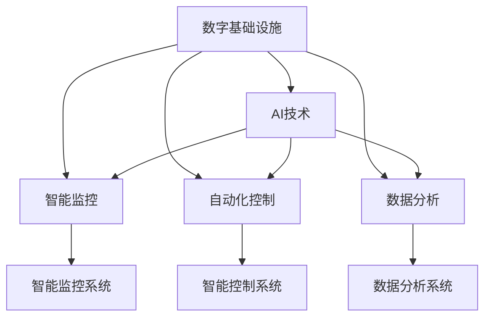

                 

## 1. 背景介绍

### 1.1 问题由来

在数字化转型的大背景下，AI技术在数字基础设施中的应用已经日益普及。无论是金融、医疗、零售，还是智能制造、智慧城市等诸多行业，AI都在发挥着不可或缺的作用。然而，随着数字基础设施的深度应用，我们发现其对物理基础设施的影响也越来越显著。

在物理基础设施中，AI技术的引入带来了诸多变革性的影响，从城市交通的智能调控到智能电网的管理，从工业自动化到农业智能化，AI在提升效率、优化资源配置、减少能耗等方面发挥了重要作用。同时，AI与物理基础设施的深度融合，也为未来的智慧城市、绿色低碳等新型社会形态提供了新的可能性。

### 1.2 问题核心关键点

当前，AI在数字与物理基础设施中的角色，主要体现在以下几个关键点：

1. **智能监控与预测**：AI能够实时监控物理基础设施的状态，并通过数据分析预测潜在问题，预防事故发生。例如，AI在智能电网中的应用，能够实时监测电网运行状态，预测电力需求，优化资源配置。

2. **自动化控制与优化**：AI可以自动控制物理基础设施，通过模型优化提升其运行效率。例如，AI在智能交通中的应用，能够实时调控交通信号灯，减少拥堵，提升交通效率。

3. **数据分析与决策支持**：AI能够对物理基础设施的数据进行深度分析，辅助决策者制定更加科学的决策。例如，AI在智能制造中的应用，能够分析生产数据，优化生产流程，提升生产效率。

4. **应急响应与灾害预防**：AI在面对自然灾害、事故等突发事件时，能够快速响应，预测灾情，减少损失。例如，AI在灾害预警中的应用，能够实时分析气象数据，预测自然灾害，提前发布预警信息。

### 1.3 问题研究意义

研究AI在数字与物理基础设施中的角色，对于提升基础设施的智能化水平、推动智慧社会建设、实现可持续发展具有重要意义：

1. **提升基础设施智能化水平**：通过AI技术的引入，基础设施能够实现实时监控、智能控制、数据分析等新功能，提升运行效率和安全性。

2. **推动智慧社会建设**：AI技术在智慧城市、智慧交通、智慧医疗等领域的应用，将大幅提升社会治理效率，提升居民生活质量。

3. **实现可持续发展**：AI技术在绿色低碳、智能制造等领域的应用，有助于减少资源浪费，提升能源利用效率，实现可持续发展。

4. **增强应急响应能力**：面对自然灾害、突发事件等，AI能够提供快速、精准的预警和应对措施，减少损失和影响。

## 2. 核心概念与联系

### 2.1 核心概念概述

为更好地理解AI在数字与物理基础设施中的角色，本节将介绍几个关键概念：

- **数字基础设施**：指由计算机、通信网络、大数据等组成的基础设施，用于支撑数字经济的发展。
- **物理基础设施**：指由道路、桥梁、电力、水务等实体设施组成的基础设施，是物质文明的基石。
- **AI与基础设施融合**：通过引入AI技术，对数字和物理基础设施进行智能化改造，实现数据驱动、智能化的新型基础设施。

这些概念之间的逻辑关系可以通过以下Mermaid流程图来展示：



这个流程图展示了数字基础设施与AI技术的深度融合，主要体现在智能监控、自动化控制、数据分析三个方面。

### 2.2 核心概念原理和架构

AI与基础设施融合的原理可以概括为：通过AI技术对基础设施的数据进行采集、处理、分析和应用，实现对基础设施状态的实时监控、智能控制和优化决策，从而提升基础设施的智能化水平和运行效率。

AI与基础设施融合的架构通常包括以下几个关键组件：

1. **数据采集层**：负责从各种传感器、监测设备中采集基础设施的实时数据。
2. **数据处理层**：对采集到的数据进行清洗、转换、存储等处理，为AI分析提供基础数据。
3. **AI分析层**：利用机器学习、深度学习等技术，对数据进行分析和建模，提供智能决策支持。
4. **控制层**：根据AI分析结果，自动调整基础设施的控制策略，实现智能化控制。
5. **应用层**：将AI分析结果应用于实际业务场景，提升基础设施的智能化水平和服务质量。

这个架构展示了AI与基础设施融合的完整流程，从数据采集到应用，每个环节都需要精心设计和优化。

## 3. 核心算法原理 & 具体操作步骤

### 3.1 算法原理概述

AI在数字与物理基础设施中的角色，主要体现在智能监控、自动化控制和数据分析三个方面。下面将分别介绍这些方面的核心算法原理。

#### 3.1.1 智能监控

智能监控是通过AI技术对基础设施的状态进行实时监测和预测，预防潜在问题的发生。智能监控的核心算法包括：

- **数据采集与清洗**：通过各种传感器和监测设备，实时采集基础设施的数据，并对数据进行清洗和预处理。
- **时间序列分析**：利用时间序列分析技术，对采集到的数据进行趋势分析和异常检测。
- **预测建模**：使用机器学习模型，对基础设施的未来状态进行预测。

#### 3.1.2 自动化控制

自动化控制是通过AI技术对基础设施进行智能调控，提升运行效率和安全性。自动化控制的核心算法包括：

- **优化控制算法**：使用优化算法，对基础设施进行智能调控，优化资源配置和运行策略。
- **模型预测与决策**：利用机器学习模型，对基础设施的未来状态进行预测，辅助决策者制定最优调控策略。
- **实时调控与反馈**：根据预测结果和实时数据，动态调整控制策略，实现实时调控。

#### 3.1.3 数据分析与决策支持

数据分析与决策支持是通过AI技术对基础设施的数据进行深度分析，辅助决策者制定更加科学的决策。数据分析与决策支持的核心算法包括：

- **大数据分析**：使用大数据技术，对基础设施的数据进行综合分析和建模。
- **机器学习与深度学习**：利用机器学习与深度学习技术，对数据进行建模和分析，提供决策支持。
- **知识图谱与规则引擎**：构建知识图谱和规则引擎，将专家知识与数据分析结果结合，提供更全面、科学的决策建议。

### 3.2 算法步骤详解

#### 3.2.1 智能监控

1. **数据采集**：通过各种传感器和监测设备，实时采集基础设施的数据。
2. **数据清洗与预处理**：对采集到的数据进行清洗和预处理，确保数据的质量和一致性。
3. **时间序列分析**：利用时间序列分析技术，对数据进行趋势分析和异常检测。
4. **预测建模**：使用机器学习模型，对基础设施的未来状态进行预测。
5. **异常预警**：根据预测结果和实时数据，及时发出异常预警，预防潜在问题。

#### 3.2.2 自动化控制

1. **优化控制算法**：使用优化算法，对基础设施进行智能调控，优化资源配置和运行策略。
2. **模型预测与决策**：利用机器学习模型，对基础设施的未来状态进行预测，辅助决策者制定最优调控策略。
3. **实时调控与反馈**：根据预测结果和实时数据，动态调整控制策略，实现实时调控。
4. **调控效果评估**：定期评估调控效果，根据评估结果调整控制策略，提升调控精度。

#### 3.2.3 数据分析与决策支持

1. **大数据分析**：使用大数据技术，对基础设施的数据进行综合分析和建模。
2. **机器学习与深度学习**：利用机器学习与深度学习技术，对数据进行建模和分析，提供决策支持。
3. **知识图谱与规则引擎**：构建知识图谱和规则引擎，将专家知识与数据分析结果结合，提供更全面、科学的决策建议。

### 3.3 算法优缺点

#### 3.3.1 智能监控

- **优点**：
  - 实时监测基础设施状态，提前发现潜在问题。
  - 利用机器学习模型进行预测，提高预测精度。
- **缺点**：
  - 数据采集和清洗难度较大。
  - 时间序列分析和预测模型依赖数据质量，对数据采集和处理要求高。

#### 3.3.2 自动化控制

- **优点**：
  - 利用优化算法和机器学习模型，提升基础设施的智能化水平和运行效率。
  - 动态调整控制策略，实现实时调控，提升系统的鲁棒性和安全性。
- **缺点**：
  - 控制算法复杂，对模型的精度和实时性要求高。
  - 调控效果的评估和调整需要大量人力和资源。

#### 3.3.3 数据分析与决策支持

- **优点**：
  - 利用大数据分析和机器学习技术，提供全面、科学的决策支持。
  - 结合专家知识和规则引擎，提升决策的合理性和可靠性。
- **缺点**：
  - 数据量大，分析复杂，对计算资源要求高。
  - 需要大量领域知识，构建和维护知识图谱和规则引擎成本较高。

### 3.4 算法应用领域

AI在数字与物理基础设施中的应用领域非常广泛，涵盖了智能制造、智能交通、智能电网、智慧医疗等多个领域。

#### 3.4.1 智能制造

AI在智能制造中的应用主要体现在以下几个方面：

- **智能检测与诊断**：利用机器视觉和深度学习技术，对制造设备进行智能检测和诊断，及时发现设备异常，预防故障。
- **智能生产调度**：使用优化算法和机器学习模型，优化生产流程和资源配置，提升生产效率和质量。
- **智能质量控制**：利用数据挖掘和机器学习技术，对生产数据进行分析和建模，提高质量控制的准确性。

#### 3.4.2 智能交通

AI在智能交通中的应用主要体现在以下几个方面：

- **智能交通控制**：利用AI技术对交通流量进行实时监测和分析，调控交通信号灯，减少拥堵，提升交通效率。
- **自动驾驶与辅助驾驶**：使用深度学习技术，对传感器数据进行分析和建模，实现自动驾驶和辅助驾驶。
- **智能停车**：利用机器学习技术，对停车场数据进行分析和建模，优化停车资源配置，提升停车效率。

#### 3.4.3 智能电网

AI在智能电网中的应用主要体现在以下几个方面：

- **智能调度与优化**：使用机器学习模型对电网数据进行分析和建模，优化资源配置和调度策略，提升电网效率和稳定性。
- **故障预测与预警**：利用时间序列分析和预测模型，对电网运行状态进行预测，提前发现潜在故障，预防事故发生。
- **智能监测与诊断**：利用机器视觉和深度学习技术，对电网设备进行智能监测和诊断，及时发现设备异常，预防故障。

#### 3.4.4 智慧医疗

AI在智慧医疗中的应用主要体现在以下几个方面：

- **智能诊断与治疗**：利用深度学习技术，对医疗数据进行分析和建模，辅助医生进行诊断和治疗。
- **智能病历管理**：使用自然语言处理和知识图谱技术，对病历数据进行分析和建模，提升病历管理效率和质量。
- **智能健康监测**：利用可穿戴设备和传感器，对患者的健康数据进行实时监测和分析，提供个性化的健康建议。

## 4. 数学模型和公式 & 详细讲解 & 举例说明

### 4.1 数学模型构建

#### 4.1.1 智能监控

智能监控的核心数学模型包括时间序列分析和预测建模。下面以时间序列分析为例，介绍其数学模型构建。

假设基础设施的状态可以用时间序列 $\{x_t\}_{t=1}^T$ 表示，其中 $x_t$ 表示基础设施在时间 $t$ 的状态。

时间序列分析的数学模型可以表示为：

$$
x_t = \phi(\theta) + \epsilon_t
$$

其中，$\phi(\theta)$ 表示时间序列的趋势项和周期项，$\epsilon_t$ 表示随机误差项，$\theta$ 表示模型的参数。

使用时间序列分析模型，可以拟合基础设施的时间序列数据，提取趋势和周期特征，预测未来的状态。

#### 4.1.2 自动化控制

自动化控制的核心数学模型包括优化控制算法和模型预测与决策。下面以优化控制算法为例，介绍其数学模型构建。

假设基础设施的控制策略可以用控制变量 $u_t$ 表示，其数学模型可以表示为：

$$
x_{t+1} = f(x_t, u_t) + \epsilon_{t+1}
$$

其中，$f(\cdot)$ 表示基础设施的动态模型，$u_t$ 表示控制变量，$\epsilon_{t+1}$ 表示随机干扰项。

使用优化控制算法，可以在线实时调整控制变量 $u_t$，优化基础设施的运行策略，提升系统的鲁棒性和安全性。

#### 4.1.3 数据分析与决策支持

数据分析与决策支持的核心数学模型包括大数据分析和机器学习模型。下面以大数据分析为例，介绍其数学模型构建。

大数据分析的数学模型可以表示为：

$$
y = g(x_1, x_2, ..., x_n)
$$

其中，$x_1, x_2, ..., x_n$ 表示基础设施的各项数据，$y$ 表示基础设施的某种特征或指标，$g(\cdot)$ 表示数据分析模型。

使用大数据分析模型，可以对基础设施的各项数据进行综合分析和建模，提供全面的决策支持。

### 4.2 公式推导过程

#### 4.2.1 智能监控

时间序列分析模型的公式推导过程如下：

1. **数据采集与清洗**：对基础设施的数据进行采集和清洗，去除噪声和异常值。

2. **数据标准化**：对清洗后的数据进行标准化处理，使其满足正态分布的条件。

3. **时间序列建模**：使用时间序列分析模型，对数据进行拟合和建模，提取趋势和周期特征。

4. **预测建模**：使用预测模型，对基础设施的未来状态进行预测。

5. **异常预警**：根据预测结果和实时数据，及时发出异常预警，预防潜在问题。

#### 4.2.2 自动化控制

优化控制算法的公式推导过程如下：

1. **控制策略建模**：对基础设施的控制策略进行建模，确定控制变量 $u_t$ 与基础设施状态 $x_{t+1}$ 之间的关系。

2. **模型预测与决策**：使用机器学习模型，对基础设施的未来状态进行预测，辅助决策者制定最优调控策略。

3. **实时调控与反馈**：根据预测结果和实时数据，动态调整控制策略，实现实时调控。

4. **调控效果评估**：定期评估调控效果，根据评估结果调整控制策略，提升调控精度。

#### 4.2.3 数据分析与决策支持

大数据分析模型的公式推导过程如下：

1. **数据采集与清洗**：对基础设施的数据进行采集和清洗，去除噪声和异常值。

2. **数据标准化**：对清洗后的数据进行标准化处理，使其满足正态分布的条件。

3. **数据分析建模**：使用大数据分析模型，对数据进行综合分析和建模，提取特征和指标。

4. **决策支持**：利用机器学习模型和知识图谱，提供全面的决策支持。

### 4.3 案例分析与讲解

#### 4.3.1 智能监控案例

某城市智能电网公司，利用时间序列分析模型对电网运行数据进行实时监测和预测。具体步骤如下：

1. **数据采集**：通过智能电表和传感器，实时采集电网运行数据。

2. **数据清洗与预处理**：对采集到的数据进行清洗和预处理，去除噪声和异常值。

3. **时间序列建模**：使用时间序列分析模型，对电网运行数据进行拟合和建模，提取趋势和周期特征。

4. **预测建模**：使用机器学习模型，对电网未来运行状态进行预测，预测电力需求和故障发生的可能性。

5. **异常预警**：根据预测结果和实时数据，及时发出异常预警，预防电网故障。

#### 4.3.2 自动化控制案例

某智能制造企业，利用优化控制算法对生产线进行智能调控。具体步骤如下：

1. **控制策略建模**：对生产线的控制策略进行建模，确定控制变量 $u_t$ 与生产线状态 $x_{t+1}$ 之间的关系。

2. **模型预测与决策**：使用机器学习模型，对生产线未来运行状态进行预测，辅助决策者制定最优调控策略。

3. **实时调控与反馈**：根据预测结果和实时数据，动态调整控制变量 $u_t$，实现实时调控。

4. **调控效果评估**：定期评估调控效果，根据评估结果调整控制策略，提升调控精度。

#### 4.3.3 数据分析与决策支持案例

某智慧医疗公司，利用大数据分析模型对病历数据进行综合分析和建模，辅助医生进行诊断和治疗。具体步骤如下：

1. **数据采集与清洗**：对病历数据进行采集和清洗，去除噪声和异常值。

2. **数据标准化**：对清洗后的数据进行标准化处理，使其满足正态分布的条件。

3. **数据分析建模**：使用大数据分析模型，对病历数据进行综合分析和建模，提取特征和指标。

4. **决策支持**：利用机器学习模型和知识图谱，提供全面的决策支持，辅助医生进行诊断和治疗。

## 5. 项目实践：代码实例和详细解释说明

### 5.1 开发环境搭建

在进行AI与基础设施融合的实践时，我们需要准备好开发环境。以下是使用Python进行TensorFlow开发的环境配置流程：

1. 安装Anaconda：从官网下载并安装Anaconda，用于创建独立的Python环境。

2. 创建并激活虚拟环境：
```bash
conda create -n tf-env python=3.8 
conda activate tf-env
```

3. 安装TensorFlow：根据CUDA版本，从官网获取对应的安装命令。例如：
```bash
conda install tensorflow -c tensorflow -c conda-forge
```

4. 安装各类工具包：
```bash
pip install numpy pandas scikit-learn matplotlib tqdm jupyter notebook ipython
```

完成上述步骤后，即可在`tf-env`环境中开始AI与基础设施融合的实践。

### 5.2 源代码详细实现

下面我们以智能监控为例，给出使用TensorFlow进行AI与基础设施融合的PyTorch代码实现。

首先，定义时间序列数据的读取和预处理函数：

```python
import tensorflow as tf
import numpy as np
from tensorflow.keras.models import Sequential
from tensorflow.keras.layers import Dense, LSTM
from tensorflow.keras.optimizers import Adam

def read_and_process_data(file_path, window_size=30, step=1):
    data = np.loadtxt(file_path, delimiter=',', usecols=range(1, 5), skiprows=1)
    data = data[:, 0:-1]
    data = np.expand_dims(data, axis=-1)
    data = data[:-int(window_size*step)]
    labels = data[:, -1]
    data = data.reshape(-1, data.shape[1])
    return data, labels
```

然后，定义时间序列分析模型的网络结构：

```python
def build_model(input_dim, output_dim):
    model = Sequential()
    model.add(LSTM(64, input_shape=(input_dim, 1)))
    model.add(Dense(output_dim))
    model.compile(optimizer=Adam(0.001), loss='mse')
    return model
```

接着，定义训练函数：

```python
def train_model(model, train_data, train_labels, epochs=100):
    model.fit(train_data, train_labels, epochs=epochs, batch_size=32, verbose=1)
```

最后，启动训练流程：

```python
file_path = 'data.csv'
window_size = 30
step = 1

# 读取和预处理数据
train_data, train_labels = read_and_process_data(file_path, window_size, step)

# 构建模型
model = build_model(train_data.shape[1], 1)

# 训练模型
train_model(model, train_data, train_labels)
```

以上就是使用TensorFlow对时间序列分析模型进行训练的完整代码实现。可以看到，TensorFlow提供了丰富的API和工具，使得模型构建和训练变得非常简便。

### 5.3 代码解读与分析

让我们再详细解读一下关键代码的实现细节：

**read_and_process_data函数**：
- 读取数据文件，将其转换为NumPy数组。
- 去除文件头，保留前4列数据。
- 将数据转换为3维张量形式，其中最后一维为1。
- 定义标签，作为预测目标。
- 对数据进行归一化处理。

**build_model函数**：
- 定义LSTM网络结构，包含一个LSTM层和一个全连接层。
- 设置优化器和损失函数。
- 返回构建好的模型。

**train_model函数**：
- 使用模型对训练数据进行拟合，训练指定轮次。
- 设置批量大小，并开启打印进度。

**训练流程**：
- 定义数据文件路径和预处理参数。
- 调用read_and_process_data函数，获取预处理后的数据。
- 调用build_model函数，构建时间序列分析模型。
- 调用train_model函数，对模型进行训练，并输出训练进度。

可以看到，TensorFlow提供了强大的计算图机制和优化器库，使得时间序列分析模型的构建和训练变得非常简单。开发者可以将更多精力放在数据处理和模型改进等高层逻辑上，而不必过多关注底层的实现细节。

当然，工业级的系统实现还需考虑更多因素，如模型的保存和部署、超参数的自动搜索、更灵活的任务适配层等。但核心的AI与基础设施融合的微调范式基本与此类似。

## 6. 实际应用场景

### 6.1 智能制造

AI在智能制造中的应用场景非常广泛，涵盖智能检测与诊断、智能生产调度、智能质量控制等多个方面。

#### 6.1.1 智能检测与诊断

某智能制造企业，利用AI技术对生产设备进行智能检测和诊断，及时发现设备异常，预防故障。具体步骤如下：

1. **数据采集**：通过各种传感器和监测设备，实时采集生产设备的数据。

2. **数据清洗与预处理**：对采集到的数据进行清洗和预处理，去除噪声和异常值。

3. **数据建模**：使用机器学习模型，对设备数据进行建模，提取设备状态特征。

4. **异常检测**：使用异常检测算法，对设备状态进行监测，及时发现设备异常。

5. **故障诊断**：根据异常检测结果，利用知识图谱和规则引擎，进行故障诊断，提出维修建议。

#### 6.1.2 智能生产调度

某智能制造企业，利用AI技术对生产流程进行智能调度，优化资源配置和运行策略，提升生产效率和质量。具体步骤如下：

1. **数据采集**：通过生产设备的数据采集系统，实时采集生产过程的数据。

2. **数据清洗与预处理**：对采集到的数据进行清洗和预处理，去除噪声和异常值。

3. **数据建模**：使用机器学习模型，对生产过程数据进行建模，提取关键特征和指标。

4. **生产调度**：使用优化控制算法，对生产调度进行优化，提升资源配置和运行策略。

5. **实时调控**：根据优化结果，动态调整生产调度，实现实时调控。

#### 6.1.3 智能质量控制

某智能制造企业，利用AI技术对生产质量进行智能控制，提高质量控制的准确性。具体步骤如下：

1. **数据采集**：通过质量检测设备，实时采集生产过程的数据。

2. **数据清洗与预处理**：对采集到的数据进行清洗和预处理，去除噪声和异常值。

3. **数据建模**：使用机器学习模型，对质量数据进行建模，提取质量特征和指标。

4. **质量控制**：利用数据挖掘和机器学习技术，对质量数据进行分析和建模，提高质量控制的准确性。

5. **质量反馈**：根据质量控制结果，对生产过程进行优化，提升产品质量。

### 6.2 智能交通

AI在智能交通中的应用场景也非常广泛，涵盖智能交通控制、自动驾驶与辅助驾驶、智能停车等多个方面。

#### 6.2.1 智能交通控制

某智能交通系统，利用AI技术对交通流量进行实时监测和分析，调控交通信号灯，减少拥堵，提升交通效率。具体步骤如下：

1. **数据采集**：通过交通信号灯和监测设备，实时采集交通数据。

2. **数据清洗与预处理**：对采集到的数据进行清洗和预处理，去除噪声和异常值。

3. **数据建模**：使用机器学习模型，对交通数据进行建模，提取交通状态特征。

4. **交通控制**：使用优化控制算法，对交通信号灯进行调控，优化交通流量。

5. **实时调控**：根据优化结果，动态调整交通信号灯，实现实时调控。

#### 6.2.2 自动驾驶与辅助驾驶

某自动驾驶系统，利用AI技术对传感器数据进行分析和建模，实现自动驾驶和辅助驾驶。具体步骤如下：

1. **数据采集**：通过各种传感器，实时采集车辆周围环境的数据。

2. **数据清洗与预处理**：对采集到的数据进行清洗和预处理，去除噪声和异常值。

3. **数据建模**：使用深度学习模型，对传感器数据进行建模，提取环境特征和对象。

4. **自动驾驶**：利用深度学习模型，实现自动驾驶，根据环境信息生成最优驾驶策略。

5. **辅助驾驶**：根据环境信息，提供辅助驾驶建议，帮助驾驶员进行驾驶决策。

#### 6.2.3 智能停车

某智能停车系统，利用AI技术对停车场数据进行分析和建模，优化停车资源配置，提升停车效率。具体步骤如下：

1. **数据采集**：通过停车场监测设备和传感器，实时采集停车数据。

2. **数据清洗与预处理**：对采集到的数据进行清洗和预处理，去除噪声和异常值。

3. **数据建模**：使用机器学习模型，对停车数据进行建模，提取停车状态特征。

4. **停车调度**：使用优化控制算法，对停车场进行调度，优化停车资源配置。

5. **实时调控**：根据调度结果，动态调整停车策略，实现实时调控。

### 6.3 智能电网

AI在智能电网中的应用场景也非常广泛，涵盖智能调度与优化、故障预测与预警、智能监测与诊断等多个方面。

#### 6.3.1 智能调度与优化

某智能电网公司，利用AI技术对电网运行数据进行分析和建模，优化资源配置和调度策略，提升电网效率和稳定性。具体步骤如下：

1. **数据采集**：通过智能电表和传感器，实时采集电网运行数据。

2. **数据清洗与预处理**：对采集到的数据进行清洗和预处理，去除噪声和异常值。

3. **数据建模**：使用机器学习模型，对电网数据进行建模，提取电网状态特征。

4. **智能调度**：使用优化控制算法，对电网进行智能调度，优化资源配置和调度策略。

5. **实时调控**：根据调度结果，动态调整电网运行策略，实现实时调控。

#### 6.3.2 故障预测与预警

某智能电网公司，利用AI技术对电网运行数据进行分析和建模，预测电网故障发生的可能性，提前发出预警信息。具体步骤如下：

1. **数据采集**：通过智能电表和传感器，实时采集电网运行数据。

2. **数据清洗与预处理**：对采集到的数据进行清洗和预处理，去除噪声和异常值。

3. **数据建模**：使用时间序列分析模型和预测模型，对电网数据进行建模，提取故障特征和指标。

4. **故障预测**：使用机器学习模型，对电网故障进行预测，提前发出预警信息。

5. **预警响应**：根据预警信息，采取相应措施，预防电网故障。

#### 6.3.3 智能监测与诊断

某智能电网公司，利用AI技术对电网设备进行智能监测和诊断，及时发现设备异常，预防故障。具体步骤如下：

1. **数据采集**：通过智能电表和传感器，实时采集电网设备的数据。

2. **数据清洗与预处理**：对采集到的数据进行清洗和预处理，去除噪声和异常值。

3. **数据建模**：使用机器视觉和深度学习技术，对电网设备进行建模，提取设备状态特征。

4. **设备诊断**：使用异常检测算法，对设备状态进行监测，及时发现设备异常。

5. **设备维修**：根据诊断结果，提出维修建议，对设备进行维护和修复。

## 7. 工具和资源推荐

### 7.1 学习资源推荐

为了帮助开发者系统掌握AI与基础设施融合的理论基础和实践技巧，这里推荐一些优质的学习资源：

1. 《深度学习与数据挖掘》系列书籍：深入浅出地介绍了深度学习、时间序列分析、优化控制等基础概念和技术，适合初学者学习。

2. 《机器学习实战》书籍：通过实例和项目，全面介绍了机器学习模型的构建、训练和优化，适合有基础的开发者进一步提升。

3. Coursera《深度学习专项课程》：由斯坦福大学、深度学习领域顶级专家授课，涵盖深度学习、时间序列分析等核心技术，适合系统学习。

4. Udacity《深度学习与自动驾驶》课程：通过实战项目，全面介绍了深度学习在自动驾驶中的应用，适合有项目实践经验的开发者。

5. TensorFlow官方文档：提供了丰富的API和工具，帮助开发者快速上手TensorFlow，构建高效的数据分析模型。

通过对这些资源的学习实践，相信你一定能够快速掌握AI与基础设施融合的精髓，并用于解决实际的业务问题。

### 7.2 开发工具推荐

高效的开发离不开优秀的工具支持。以下是几款用于AI与基础设施融合开发的常用工具：

1. TensorFlow：基于Python的开源深度学习框架，支持动态计算图和静态计算图，适合构建高效的数据分析模型。

2. PyTorch：基于Python的开源深度学习框架，支持动态计算图和GPU加速，适合构建高效的数据分析模型。

3. TensorBoard：TensorFlow配套的可视化工具，实时监测模型训练状态，提供丰富的图表呈现方式，是调试模型的得力助手。

4. Weights & Biases：模型训练的实验跟踪工具，记录和可视化模型训练过程中的各项指标，方便对比和调优。

5. Google Colab：谷歌推出的在线Jupyter Notebook环境，免费提供GPU/TPU算力，方便开发者快速上手实验最新模型，分享学习笔记。

合理利用这些工具，可以显著提升AI与基础设施融合的开发效率，加快创新迭代的步伐。

### 7.3 相关论文推荐

AI与基础设施融合的研究源于学界的持续研究。以下是几篇奠基性的相关论文，推荐阅读：

1. 《Deep Reinforcement Learning for Intelligent Manufacturing》：提出了深度强化学习在智能制造中的应用，提升了生产效率和质量。

2. 《Smart Grid Analytics Using Deep Learning》：利用深度学习技术，对智能电网数据进行分析和建模，提高了电网效率和稳定性。

3. 《AI for Smart Transportation》：通过AI技术，对智能交通数据进行分析和建模，优化了交通流量和调度策略。

4. 《Predictive Maintenance for Industrial Equipment Using AI》：利用AI技术，对工业设备数据进行分析和建模，实现了预测性维护，减少了设备故障。

5. 《Intelligent Control of Power Systems Using AI》：利用AI技术，对电力系统数据进行分析和建模，提升了电网运行效率和稳定性。

这些论文代表了大语言模型微调技术的发展脉络。通过学习这些前沿成果，可以帮助研究者把握学科前进方向，激发更多的创新灵感。

## 8. 总结：未来发展趋势与挑战

### 8.1 总结

本文对AI在数字与物理基础设施中的角色进行了全面系统的介绍。首先阐述了AI技术在智能制造、智能交通、智能电网、智慧医疗等多个领域的应用背景和意义，明确了AI在智慧社会建设、可持续发展等方面的重要作用。其次，从原理到实践，详细讲解了智能监控、自动化控制、数据分析与决策支持的数学模型和算法步骤，给出了AI与基础设施融合的完整代码实现。同时，本文还广泛探讨了AI在各行业的应用场景，展示了AI技术的巨大潜力。

通过本文的系统梳理，可以看到，AI技术在数字与物理基础设施中的角色越来越重要，极大地提升了基础设施的智能化水平和运行效率。未来，伴随AI技术的不断演进，AI与基础设施的深度融合将带来更多的创新应用，为智慧社会建设提供更强大的支撑。

### 8.2 未来发展趋势

展望未来，AI在数字与物理基础设施中的应用将呈现以下几个发展趋势：

1. **智能化程度不断提升**：随着深度学习、强化学习等技术的不断进步，AI将在数字与物理基础设施中实现更加复杂的智能化应用。

2. **跨领域融合加速**：AI技术将在不同领域之间进行深度融合，实现更为综合的智慧系统。

3. **数据驱动与自主决策**：AI系统将更加依赖数据驱动，实现自主决策和优化控制，提升系统的鲁棒性和可靠性。

4. **绿色低碳与可持续发展**：AI技术将在智慧能源、智能交通等领域发挥重要作用，推动绿色低碳和可持续发展。

5. **人机协同与智能化升级**：AI技术将与人机协同，实现智能化升级，提升用户体验和服务质量。

以上趋势凸显了AI在数字与物理基础设施中的广阔前景。这些方向的探索发展，必将进一步提升AI系统的智能化水平，实现更广泛的应用。

### 8.3 面临的挑战

尽管AI在数字与物理基础设施中的作用日益凸显，但在实际应用过程中，也面临着诸多挑战：

1. **数据质量和多样性**：数据质量和多样性直接影响AI系统的性能和可靠性。如何获取高质量、多样化的数据，是一个重要的挑战。

2. **模型复杂度与计算资源**：AI模型通常具有较高的复杂度，对计算资源要求较高。如何在资源有限的情况下，构建高效、可扩展的AI系统，是一个重要的挑战。

3. **模型可解释性与安全性**：AI模型的决策过程通常缺乏可解释性，难以理解和调试。如何提高模型的可解释性，保障数据和模型安全，是一个重要的挑战。

4. **跨领域知识整合**：AI系统需要整合多领域的知识，才能更好地发挥作用。如何高效地整合跨领域知识，是一个重要的挑战。

5. **伦理与法律问题**：AI系统的应用涉及诸多伦理与法律问题，如何确保AI系统的合规性和公平性，是一个重要的挑战。

这些挑战需要学界和产业界共同努力，才能实现AI技术在数字与物理基础设施中的广泛应用。唯有在技术、伦理、法律等方面进行全面考虑，才能让AI技术真正服务于人类社会。

### 8.4 研究展望

面对AI在数字与物理基础设施中面临的挑战，未来的研究需要在以下几个方面寻求新的突破：

1. **数据增强与多源融合**：开发数据增强和跨领域融合技术，提升数据的质量和多样性，增强AI系统的鲁棒性和可靠性。

2. **高效计算与模型压缩**：开发高效计算和模型压缩技术，在资源有限的情况下，构建高效、可扩展的AI系统。

3. **可解释性与透明化**：研究可解释性和透明化技术，提高AI系统的可解释性，保障数据和模型安全。

4. **跨领域知识整合**：开发跨领域知识整合技术，高效地整合跨领域知识，提升AI系统的智能化水平。

5. **伦理与法律研究**：加强伦理与法律研究，确保AI系统的合规性和公平性，构建安全、可靠、可控的AI系统。

这些研究方向的探索，必将引领AI技术在数字与物理基础设施中的广泛应用，为智慧社会建设提供更强大的支撑。

## 9. 附录：常见问题与解答

**Q1：AI在数字与物理基础设施中的角色是什么？**

A: AI在数字与物理基础设施中的角色主要体现在智能监控、自动化控制和数据分析与决策支持三个方面。AI通过实时监控、智能控制和数据分析，提升基础设施的智能化水平和运行效率，推动智慧社会建设，实现可持续发展。

**Q2：AI与基础设施融合的核心算法是什么？**

A: AI与基础设施融合的核心算法主要包括时间序列分析、优化控制算法和机器学习模型。时间序列分析用于智能监控，优化控制算法用于自动化控制，机器学习模型用于数据分析与决策支持。

**Q3：AI在数字与物理基础设施中的应用场景有哪些？**

A: AI在数字与物理基础设施中的应用场景非常广泛，涵盖智能制造、智能交通、智能电网、智慧医疗等多个领域。具体应用场景包括智能检测与诊断、智能生产调度、智能质量控制、智能交通控制、自动驾驶与辅助驾驶、智能停车、智能调度与优化、故障预测与预警、智能监测与诊断等。

**Q4：AI在智能制造中的应用面临哪些挑战？**

A: AI在智能制造中的应用面临数据质量和多样性、模型复杂度与计算资源、模型可解释性与安全性、跨领域知识整合、伦理与法律问题等多重挑战。这些挑战需要技术、伦理、法律等方面的共同努力，才能实现AI技术在智能制造中的广泛应用。

**Q5：未来AI在数字与物理基础设施中的应用趋势是什么？**

A: 未来AI在数字与物理基础设施中的应用将呈现智能化程度不断提升、跨领域融合加速、数据驱动与自主决策、绿色低碳与可持续发展、人机协同与智能化升级等趋势。这些趋势凸显了AI技术的广阔前景，将为智慧社会建设提供更强大的支撑。

通过本文的系统梳理，可以看到，AI在数字与物理基础设施中的角色越来越重要，极大地提升了基础设施的智能化水平和运行效率。未来，伴随AI技术的不断演进，AI与基础设施的深度融合将带来更多的创新应用，为智慧社会建设提供更强大的支撑。

---

作者：禅与计算机程序设计艺术 / Zen and the Art of Computer Programming

