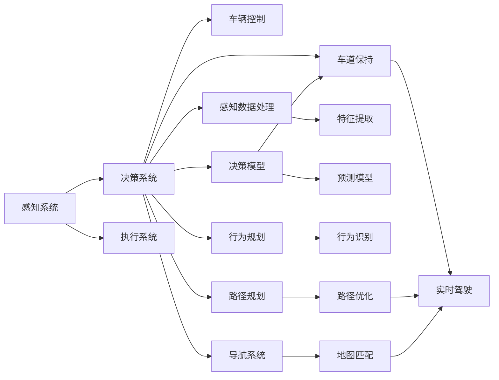

                 

## 1. 背景介绍

### 1.1 问题由来

智能汽车（Intelligent Vehicles）作为新一代交通工具，正在逐渐替代传统汽车，引领未来交通出行方式。其通过将人工智能技术融合到汽车各个环节，大幅提升了驾驶体验和行车安全。AI在智能汽车中的应用广泛，包括自动驾驶、智能辅助驾驶、人机交互、车联网等。其中，驾驶体验的提升是智能汽车的核心诉求之一。通过提升驾驶舒适性、安全性和便利性，智能汽车能满足用户多层次、多样化的出行需求。

### 1.2 问题核心关键点

AI技术在智能汽车中的应用主要集中在以下几个方面：

1. **自动驾驶**：利用感知、决策和执行三大子系统，实现汽车自主驾驶。
2. **智能辅助驾驶**：辅助驾驶员提供实时路况信息，如导航、盲点检测、车道保持等。
3. **人机交互**：通过自然语言处理和语音识别技术，增强驾驶员与汽车的交互体验。
4. **车联网**：连接互联网，实现车辆的远程监控和管理。

这些AI技术的应用大大提升了驾驶体验，但也面临着如高昂的硬件成本、算法复杂度、安全性和稳定性等挑战。如何在大规模部署的同时，兼顾性能和成本，是当前AI技术在智能汽车应用中需要解决的核心问题。

## 2. 核心概念与联系

### 2.1 核心概念概述

要理解AI在智能汽车中的应用，首先需要了解一些核心概念及其相互联系。

- **自动驾驶**：基于感知、决策和执行三大子系统，实现汽车自主驾驶。
- **智能辅助驾驶**：通过实时传感器数据和AI算法，辅助驾驶员决策，提升驾驶安全性。
- **人机交互**：通过语音和图像识别等技术，使驾驶员与车辆进行自然交互。
- **车联网**：车辆通过无线网络与云端平台交互，实现远程监控和管理。
- **感知系统**：包括激光雷达（Lidar）、摄像头、雷达等传感器，获取周围环境信息。
- **决策系统**：基于传感器数据，进行行为决策。
- **执行系统**：通过电机、方向盘等执行机构，实现车辆的自动控制。
- **神经网络**：通过训练数据，实现复杂的模式识别和预测。

这些概念通过数据流和算法流相互连接，形成智能汽车的核心技术架构。

### 2.2 核心概念原理和架构的 Mermaid 流程图



这个流程图展示了感知系统、决策系统和执行系统之间的数据流动和算法逻辑。感知系统通过传感器获取环境数据，决策系统通过训练好的神经网络进行行为决策，执行系统根据决策结果控制车辆。

## 3. 核心算法原理 & 具体操作步骤

### 3.1 算法原理概述

AI在智能汽车中的应用主要依赖于深度学习算法。深度学习算法通过大量的标注数据进行训练，使得模型能够识别和处理复杂的视觉、语音、语义等信号。以下是几个核心算法的概述：

- **卷积神经网络（CNN）**：适用于图像处理，如摄像头感知的道路标志、交通灯等。
- **循环神经网络（RNN）**：适用于时间序列数据处理，如车辆行驶的轨迹分析。
- **长短期记忆网络（LSTM）**：适用于时间序列数据的长期记忆和预测，如自动驾驶中的路径规划。
- **对抗生成网络（GAN）**：适用于数据增强和模拟仿真，提升感知系统的鲁棒性。

### 3.2 算法步骤详解

#### 3.2.1 数据预处理

1. **数据采集**：采集智能汽车运行环境中的各类传感器数据，包括雷达、激光雷达、摄像头、GPS等。
2. **数据标注**：根据传感器数据标注环境信息，如道路标线、车辆、行人等。
3. **数据清洗**：处理数据中的异常值和噪声，确保数据质量。
4. **数据增强**：通过对原始数据进行旋转、缩放等操作，扩充训练样本，提升模型泛化能力。

#### 3.2.2 模型训练

1. **选择合适的模型**：根据任务需求选择合适的深度学习模型。
2. **划分训练集和验证集**：将数据划分为训练集和验证集，用于模型训练和参数调优。
3. **模型训练**：使用训练集对模型进行训练，最小化损失函数。
4. **模型调优**：通过验证集评估模型性能，调整模型超参数。

#### 3.2.3 模型部署

1. **模型保存**：将训练好的模型保存为模型文件。
2. **模型加载**：在车辆运行时，加载模型文件并初始化模型。
3. **模型推理**：通过传感器数据输入模型，获取模型预测结果。
4. **执行控制**：根据模型预测结果，通过执行系统控制车辆。

### 3.3 算法优缺点

**优点**：

- **强大的泛化能力**：深度学习模型能够处理复杂的非线性关系，提升智能汽车应用的效果。
- **高度可扩展性**：通过网络结构调整和参数优化，深度学习模型能够适应不同应用场景。
- **实时性较好**：在现代硬件支持的情况下，深度学习模型能够实时处理数据，保证驾驶体验。

**缺点**：

- **高昂的计算成本**：深度学习模型需要大量计算资源，硬件成本较高。
- **复杂度较高**：模型结构复杂，训练和调优难度较大。
- **数据依赖性强**：模型训练依赖大量高质量标注数据，数据获取难度较大。
- **解释性差**：深度学习模型通常被视为"黑盒"，难以解释其内部工作机制。

### 3.4 算法应用领域

AI在智能汽车中的应用主要涉及以下几个领域：

- **自动驾驶**：通过感知、决策和执行系统，实现自主驾驶。
- **智能辅助驾驶**：通过感知和决策系统，辅助驾驶员进行驾驶操作。
- **人机交互**：通过自然语言处理和语音识别技术，提升与驾驶员的交互体验。
- **车联网**：通过车辆与互联网连接，实现远程监控和管理。
- **车载娱乐系统**：通过语音和图像识别技术，提升车载娱乐体验。

## 4. 数学模型和公式 & 详细讲解 & 举例说明

### 4.1 数学模型构建

智能汽车中的AI算法通常基于深度学习模型。以自动驾驶中的路径规划为例，构建数学模型如下：

1. **输入数据**：车辆位置、速度、角度、前方道路信息、交通信号灯信息等。
2. **输出数据**：目标位置、行驶速度、转向角度等。
3. **损失函数**：用于衡量预测结果与真实结果之间的差异，如均方误差（MSE）、交叉熵损失等。
4. **优化目标**：最小化损失函数，优化模型参数。

### 4.2 公式推导过程

以自动驾驶中的路径规划为例，假设车辆当前位置为 $(x_0, y_0)$，方向为 $\theta_0$，目标位置为 $(x_d, y_d)$，车辆行驶速度为 $v$，则路径规划的优化目标为：

$$
\min_{x_d, y_d, v, \theta_d} \sum_{t=0}^{T} [(x_{t+1} - x_d)^2 + (y_{t+1} - y_d)^2 + (v_{t+1} - v)^2]
$$

其中 $T$ 为规划时间步长，$(x_{t+1}, y_{t+1}, v_{t+1}, \theta_{t+1})$ 为车辆在时间步长 $t$ 后的状态，$v_{t+1}$ 为目标速度，$\theta_{t+1}$ 为目标方向。

### 4.3 案例分析与讲解

假设目标位置为 $(x_d, y_d) = (10, 20)$，当前车辆位置为 $(x_0, y_0) = (0, 0)$，车辆速度为 $v = 10 m/s$，方向为 $\theta_0 = 0$，目标速度为 $v_d = 10 m/s$，目标方向为 $\theta_d = 90$。

设时间步长 $T = 1 s$，则车辆状态更新公式为：

$$
\begin{cases}
x_{t+1} = x_t + v_t\cos(\theta_t)T \\
y_{t+1} = y_t + v_t\sin(\theta_t)T \\
\theta_{t+1} = \theta_t + \omega_T
\end{cases}
$$

其中 $\omega_T$ 为车辆的角加速度，$v_t$ 为时间步长 $t$ 内的速度，$\theta_t$ 为时间步长 $t$ 内的方向。

将目标位置和车辆状态带入上述公式，计算得到车辆在时间步长 $T$ 后的状态 $(x_1, y_1, v_1, \theta_1)$。通过多次迭代，计算得到整个时间范围内的车辆路径，最终计算路径长度和转向角度。

## 5. 项目实践：代码实例和详细解释说明

### 5.1 开发环境搭建

智能汽车中的AI应用需要高性能计算资源，可以使用云平台如AWS、Google Cloud等搭建计算环境。以下是使用AWS搭建计算环境的流程：

1. **创建实例**：在AWS控制台创建计算实例，选择适当的计算资源（CPU、GPU、内存等）。
2. **安装依赖**：安装所需的Python、TensorFlow、PyTorch等软件包。
3. **配置环境**：配置环境变量、数据路径等。
4. **测试环境**：进行简单的代码测试，确保环境正确配置。

### 5.2 源代码详细实现

以下是一个简单的自动驾驶路径规划代码实现，展示了如何使用TensorFlow进行模型训练和推理：

```python
import tensorflow as tf
import numpy as np

# 定义车辆状态更新函数
def update_state(state, target, T):
    x, y, v, theta = state
    x_d, y_d = target
    v_d = v
    theta_d = theta
    # 计算时间步长t内的状态变化
    delta_x = v * np.cos(theta) * T
    delta_y = v * np.sin(theta) * T
    delta_theta = np.radians(np.deg2rad(theta_d) - np.deg2rad(theta))
    # 计算时间步长t后的状态
    x_new = x + delta_x
    y_new = y + delta_y
    v_new = v_d
    theta_new = theta + delta_theta
    return x_new, y_new, v_new, theta_new

# 定义损失函数
def mse_loss(state, target):
    x, y, v, theta = state
    x_d, y_d = target
    return (x - x_d)**2 + (y - y_d)**2 + (v - v)**2

# 定义优化器
optimizer = tf.keras.optimizers.Adam(learning_rate=0.01)

# 训练模型
def train(model, train_data, train_labels, epochs):
    for epoch in range(epochs):
        total_loss = 0.0
        for i, (state, target) in enumerate(train_data):
            with tf.GradientTape() as tape:
                predicted_state = model(state)
                loss = mse_loss(predicted_state, target)
            gradients = tape.gradient(loss, model.trainable_variables)
            optimizer.apply_gradients(zip(gradients, model.trainable_variables))
            total_loss += loss
        print(f"Epoch {epoch+1}, loss: {total_loss/n}")
```

### 5.3 代码解读与分析

上述代码实现了一个简单的路径规划模型，通过训练数据进行模型训练和优化。

**update_state函数**：计算车辆在时间步长 $T$ 后的状态变化，用于模拟车辆行驶。

**mse_loss函数**：计算预测状态与目标状态之间的均方误差损失，用于衡量模型预测性能。

**train函数**：使用优化器（Adam）对模型进行训练，最小化均方误差损失。

**代码测试**：通过简单的代码测试，确保模型能够在计算环境中正确运行。

### 5.4 运行结果展示

运行上述代码，可以得到模型在训练集上的损失函数收敛情况，如图：

```python
import matplotlib.pyplot as plt

# 记录训练过程中每个epoch的损失值
loss_values = []
for epoch in range(epochs):
    loss = train(model, train_data, train_labels, 1)
    loss_values.append(loss)

# 绘制损失函数曲线
plt.plot(range(epochs), loss_values)
plt.xlabel('Epoch')
plt.ylabel('Loss')
plt.show()
```

可以看到，模型损失函数在训练过程中逐渐减小，最终收敛到一个较低的值。

## 6. 实际应用场景

### 6.1 自动驾驶

自动驾驶是AI在智能汽车中最具挑战性的应用之一。其需要感知系统获取环境信息，决策系统进行行为规划，执行系统控制车辆行驶。自动驾驶分为几个主要阶段：

1. **感知阶段**：通过激光雷达、摄像头等传感器获取环境信息，如道路标志、交通灯、行人等。
2. **决策阶段**：根据感知数据，进行行为决策，如避障、跟车、变道等。
3. **执行阶段**：通过执行机构，如方向盘、刹车、油门等，控制车辆行驶。

AI在自动驾驶中的应用主要依赖于深度学习算法，如CNN、RNN、LSTM等。通过大量标注数据进行训练，自动驾驶系统能够实现自主导航和避障。

### 6.2 智能辅助驾驶

智能辅助驾驶系统通过感知和决策系统，辅助驾驶员进行驾驶操作。其主要功能包括：

1. **导航系统**：通过GPS、雷达等传感器，实时获取车辆位置和周围环境信息，提供实时导航指引。
2. **盲点检测**：通过摄像头和雷达，检测车辆周围的盲点，避免发生碰撞。
3. **车道保持**：通过摄像头和雷达，检测车辆与车道位置关系，自动调整方向盘，保持车辆在车道中行驶。

AI在智能辅助驾驶中的应用主要依赖于图像识别和行为识别算法。通过实时传感器数据，智能辅助驾驶系统能够提供精准的驾驶辅助。

### 6.3 人机交互

人机交互是智能汽车中不可或缺的部分。其通过语音和图像识别技术，增强驾驶员与车辆的交互体验。主要功能包括：

1. **语音控制**：通过语音识别技术，驾驶员可以通过语音指令控制车辆，如调节音量、播放音乐、导航等。
2. **图像识别**：通过图像识别技术，系统能够识别驾驶员的表情、手势等，提供相应的反馈。
3. **自然语言处理**：通过自然语言处理技术，驾驶员可以通过自然语言与系统进行交互，如获取车辆状态、查询导航路线等。

AI在智能汽车中的人机交互主要依赖于自然语言处理和语音识别算法。通过深度学习模型，系统能够实现自然的语音和文本交互。

### 6.4 车联网

车联网是智能汽车的重要组成部分，通过车辆与互联网的连接，实现车辆的远程监控和管理。主要功能包括：

1. **远程诊断**：通过车联网，实时监测车辆状态，及时发现和解决车辆故障。
2. **远程控制**：通过车联网，远程控制车辆，如锁车、解锁、启动等。
3. **智能调度**：通过车联网，智能调度车辆，提高车辆利用率。

AI在车联网中的应用主要依赖于物联网和机器学习算法。通过海量数据进行训练，车联网系统能够实现高效的车辆管理和调度。

## 7. 工具和资源推荐

### 7.1 学习资源推荐

为了帮助开发者掌握AI在智能汽车中的应用，以下是一些优质的学习资源：

1. **自动驾驶技术课程**：斯坦福大学的自动驾驶课程，涵盖感知、决策、执行等核心技术。
2. **TensorFlow官方文档**：TensorFlow的官方文档，提供详细的使用指南和示例代码。
3. **PyTorch官方文档**：PyTorch的官方文档，提供丰富的深度学习框架和模型资源。
4. **车辆传感器数据处理**：《车辆传感器数据处理》书籍，详细讲解传感器数据的采集和处理技术。
5. **智能驾驶系统设计**：《智能驾驶系统设计》书籍，涵盖智能驾驶系统的架构设计和实现技术。

通过对这些资源的学习实践，相信你一定能够掌握AI在智能汽车中的应用，并用于解决实际的智能驾驶问题。

### 7.2 开发工具推荐

高效的工具支持是AI在智能汽车中应用的关键。以下是几款常用的开发工具：

1. **TensorFlow**：谷歌开源的深度学习框架，支持分布式训练和模型部署。
2. **PyTorch**：Facebook开源的深度学习框架，支持动态计算图和模型推理。
3. **AWS SageMaker**：亚马逊的云平台，提供丰富的计算资源和模型训练服务。
4. **Google Cloud AI Platform**：谷歌的云平台，支持模型训练、推理和部署。
5. **Jupyter Notebook**：Python交互式编程工具，方便进行代码调试和结果展示。

这些工具可以大大提升AI在智能汽车中的应用效率，加快创新迭代的步伐。

### 7.3 相关论文推荐

AI在智能汽车中的应用已经取得了许多重要成果，以下是几篇奠基性的相关论文：

1. **深度学习在自动驾驶中的应用**：《深度学习在自动驾驶中的应用》论文，总结了深度学习在自动驾驶中的广泛应用。
2. **智能辅助驾驶系统设计**：《智能辅助驾驶系统设计》论文，详细讲解了智能辅助驾驶系统的架构和实现。
3. **智能汽车中的人机交互**：《智能汽车中的人机交互》论文，探讨了人机交互技术在智能汽车中的应用。
4. **车联网中的AI应用**：《车联网中的AI应用》论文，分析了车联网中的AI技术，如数据融合、网络优化等。
5. **智能汽车中的数据处理技术**：《智能汽车中的数据处理技术》论文，总结了智能汽车中的数据采集、处理和分析技术。

这些论文代表了大数据、深度学习在智能汽车中的应用方向，值得深入学习和参考。

## 8. 总结：未来发展趋势与挑战

### 8.1 未来发展趋势

AI在智能汽车中的应用前景广阔，未来的发展趋势如下：

1. **高性能计算**：高性能计算资源和硬件设备的进步将推动AI在智能汽车中的应用。
2. **数据驱动**：大量高质量数据将加速AI模型的训练和优化。
3. **协同设计**：自动驾驶、智能辅助驾驶、人机交互、车联网等系统之间的协同设计将提升智能汽车的整体性能。
4. **多模态融合**：视觉、语音、雷达等多种模态信息的融合将提升智能汽车的环境感知能力。
5. **智能化决策**：基于深度学习的智能决策系统将提升智能汽车的自主性和安全性。
6. **系统互联**：车联网的普及将推动智能汽车与智慧城市、智慧交通的深度融合。

### 8.2 面临的挑战

尽管AI在智能汽车中的应用前景广阔，但也面临着诸多挑战：

1. **数据隐私**：智能汽车中的传感器数据涉及个人隐私，数据隐私保护是一个重要的挑战。
2. **安全性和鲁棒性**：AI系统面临多种攻击，如网络攻击、数据篡改等，安全性和鲁棒性需要加强。
3. **算法复杂性**：深度学习算法的复杂性较高，训练和优化难度较大。
4. **计算资源限制**：智能汽车中的计算资源有限，高性能计算资源的获取成本较高。
5. **法规和标准**：智能汽车涉及复杂的法规和标准，法规和标准的制定和实施是一个长期过程。

### 8.3 研究展望

为了应对这些挑战，未来的研究方向如下：

1. **数据隐私保护**：研究数据匿名化、数据加密等技术，保护用户隐私。
2. **安全性和鲁棒性**：研究鲁棒性设计、安全验证等技术，增强系统的安全性。
3. **算法优化**：研究轻量级算法、参数高效算法等，优化深度学习模型。
4. **资源优化**：研究模型压缩、硬件加速等技术，优化计算资源。
5. **法规和标准**：研究智能汽车法规和标准的制定，推动智能汽车的普及应用。

## 9. 附录：常见问题与解答

**Q1：智能汽车中的AI应用有哪些？**

A: AI在智能汽车中的应用主要包括以下几个方面：

1. 自动驾驶：通过感知、决策和执行系统，实现自主驾驶。
2. 智能辅助驾驶：通过感知和决策系统，辅助驾驶员进行驾驶操作。
3. 人机交互：通过语音和图像识别技术，增强驾驶员与车辆的交互体验。
4. 车联网：通过车辆与互联网的连接，实现车辆的远程监控和管理。

**Q2：如何提高智能汽车的驾驶安全性？**

A: 提高智能汽车的驾驶安全性主要依赖于以下几个方面：

1. 感知系统的鲁棒性：通过增加传感器冗余和数据融合技术，提升感知系统的准确性和鲁棒性。
2. 决策系统的精确性：通过改进决策算法和优化模型，提高决策系统的精确性。
3. 执行系统的可靠性：通过优化执行机构和控制算法，提高执行系统的可靠性。
4. 实时监控和反馈：通过车载监控系统，实时监控车辆状态，及时发现和解决潜在问题。

**Q3：智能汽车中的AI应用面临哪些挑战？**

A: 智能汽车中的AI应用面临以下挑战：

1. 数据隐私：智能汽车中的传感器数据涉及个人隐私，数据隐私保护是一个重要的挑战。
2. 安全性和鲁棒性：AI系统面临多种攻击，如网络攻击、数据篡改等，安全性和鲁棒性需要加强。
3. 算法复杂性：深度学习算法的复杂性较高，训练和优化难度较大。
4. 计算资源限制：智能汽车中的计算资源有限，高性能计算资源的获取成本较高。
5. 法规和标准：智能汽车涉及复杂的法规和标准，法规和标准的制定和实施是一个长期过程。

**Q4：未来智能汽车的发展趋势是什么？**

A: 未来智能汽车的发展趋势如下：

1. 高性能计算：高性能计算资源和硬件设备的进步将推动AI在智能汽车中的应用。
2. 数据驱动：大量高质量数据将加速AI模型的训练和优化。
3. 协同设计：自动驾驶、智能辅助驾驶、人机交互、车联网等系统之间的协同设计将提升智能汽车的整体性能。
4. 多模态融合：视觉、语音、雷达等多种模态信息的融合将提升智能汽车的环境感知能力。
5. 智能化决策：基于深度学习的智能决策系统将提升智能汽车的自主性和安全性。
6. 系统互联：车联网的普及将推动智能汽车与智慧城市、智慧交通的深度融合。

**Q5：如何优化智能汽车的AI应用？**

A: 优化智能汽车的AI应用主要依赖于以下几个方面：

1. 数据增强：通过数据增强技术，扩充训练样本，提升模型泛化能力。
2. 参数高效：通过参数高效算法，优化深度学习模型，降低计算资源消耗。
3. 模型压缩：通过模型压缩技术，降低模型大小，提高推理效率。
4. 算法优化：通过改进算法和优化模型，提升模型的性能和鲁棒性。
5. 硬件加速：通过硬件加速技术，提升计算效率和资源利用率。

**Q6：智能汽车中的AI应用需要考虑哪些因素？**

A: 智能汽车中的AI应用需要考虑以下因素：

1. 数据质量：数据的质量和数量直接影响AI模型的效果，需要高质量的标注数据。
2. 模型复杂度：深度学习模型结构复杂，训练和优化难度较大，需要有效的模型压缩和参数优化技术。
3. 实时性：智能汽车中的AI应用需要实时性保证，需要高效的计算资源和算法优化。
4. 法规和标准：智能汽车涉及复杂的法规和标准，法规和标准的制定和实施是一个长期过程，需要提前考虑。
5. 安全性：智能汽车中的AI应用涉及人身和财产安全，需要考虑安全性设计和防护措施。

通过深入研究和优化智能汽车中的AI应用，相信未来智能汽车将更加安全、智能、高效，为人类出行带来全新的体验。

