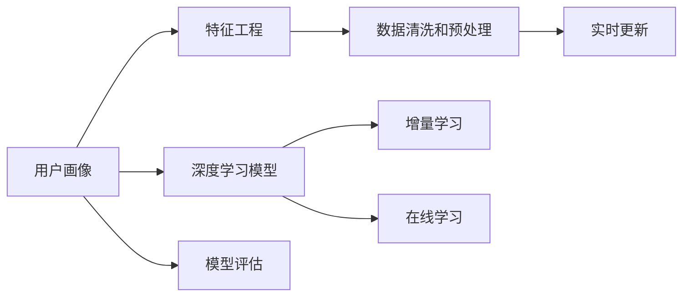

                 

# AI在用户画像中的应用实例

> 关键词：用户画像, 人工智能, AI, 数据科学, 机器学习, 数据挖掘, 个性化推荐

## 1. 背景介绍

### 1.1 问题由来
随着互联网的普及和数字技术的发展，用户行为数据逐渐成为企业最重要的资产之一。通过分析用户的在线行为，企业可以更好地理解用户需求，优化产品设计，提升用户体验，实现精准营销。用户画像（User Profile）作为一种用户描述模型，可以帮助企业构建用户全息画像，提供深入的个性化服务。

近年来，AI和大数据技术的迅猛发展，使得用户画像的构建从传统的统计分析转向了基于机器学习的深度学习范式。通过深度学习模型，可以从海量数据中提取出丰富的用户特征，动态更新和预测用户行为，从而实现更精准的用户画像构建。

### 1.2 问题核心关键点
构建用户画像的AI方法通常包括数据采集、数据预处理、特征工程、模型训练、画像维护和应用评估等步骤。其中，基于深度学习的用户画像构建方法通过模型训练获得用户的行为预测模型，通过用户历史行为数据进行推理和预测，从而形成用户画像。

用户画像的构建需要以下关键技术：
- 数据清洗和预处理：去除噪音数据，标准化数据格式，减少数据不完整性。
- 特征工程：选择合适的特征，构建特征向量，使用PCA、因子分析等方法降低特征维度。
- 深度学习模型：通过神经网络模型学习用户行为模式，使用自编码器、CNN、RNN等模型进行预测。
- 模型评估：使用交叉验证、AUC、RMSE等指标评估模型效果，避免过拟合。
- 实时更新：通过增量学习、在线学习等方法，及时更新用户画像，适应用户行为的变化。

构建用户画像的AI方法广泛应用于电商平台、社交媒体、金融服务、旅游行业等多个领域，帮助企业提升用户满意度、优化产品设计、实现精准营销，从而获得更高的商业价值。

## 2. 核心概念与联系

### 2.1 核心概念概述

构建用户画像的AI方法涉及多个关键概念，下面进行详细解释：

- **用户画像**：用户画像是一个描述用户属性、行为和偏好的综合性模型，通常由一系列特征向量构成，反映了用户的基本特征和行为习惯。用户画像可以通过观察、调查、行为分析等方式获得。

- **深度学习模型**：深度学习模型是一类能够处理大规模、高维数据的神经网络模型，通过多层非线性变换提取数据特征，广泛应用于图像识别、语音识别、自然语言处理等领域。

- **特征工程**：特征工程是构建机器学习模型的重要步骤，包括特征选择、特征提取、特征构建、特征转换等环节，目标是提高模型的泛化能力和预测精度。

- **增量学习**：增量学习是一种能够在线更新模型的学习方法，能够实时处理新数据，避免过拟合和计算资源浪费。

- **在线学习**：在线学习是一种能够实时更新模型的学习方法，能够及时响应用户行为变化，提升用户画像的动态性和准确性。

- **数据清洗和预处理**：数据清洗和预处理是对原始数据进行清洗、去噪、标准化等操作，提升数据的完整性和可用性。

这些概念之间的逻辑关系可以通过以下Mermaid流程图来展示：



这个流程图展示了大语言模型的核心概念及其之间的关系：

1. 用户画像通过深度学习模型进行构建。
2. 特征工程和数据清洗预处理是构建模型的基础环节。
3. 增量学习和在线学习提升模型动态性，实时更新用户画像。
4. 模型评估确保模型泛化能力，避免过拟合。
5. 用户画像的应用场景涉及电商、社交、金融等多个领域。

## 3. 核心算法原理 & 具体操作步骤
### 3.1 算法原理概述

基于深度学习的用户画像构建方法，通常包括以下几个关键步骤：

- **数据采集**：收集用户的在线行为数据，包括浏览记录、购买记录、搜索记录、社交互动等。
- **数据预处理**：清洗和标准化数据，去除噪音数据，填充缺失值。
- **特征工程**：选择和构造特征，使用PCA、因子分析等方法降低特征维度。
- **模型训练**：使用深度学习模型进行训练，构建用户画像预测模型。
- **画像维护**：通过实时更新、增量学习等方法，维护用户画像的准确性。
- **应用评估**：使用交叉验证、AUC、RMSE等指标评估模型效果。

### 3.2 算法步骤详解

**Step 1: 数据采集**

数据采集是构建用户画像的第一步。通过用户在电商平台、社交媒体、金融服务等多种渠道的行为数据，可以构建完整的用户画像。常见的数据类型包括：

- 浏览记录：用户访问网站、应用时的浏览页面、停留时间、点击率等。
- 购买记录：用户在电商平台上的交易记录，包括商品种类、购买数量、支付时间等。
- 搜索记录：用户在搜索引擎中的关键词查询记录，反映用户的兴趣点和需求。
- 社交互动：用户在社交媒体上的点赞、评论、分享等互动行为，反映用户的社交偏好和情感状态。

常用的数据采集方法包括：

- 网站埋点：在网站、应用中嵌入埋点代码，记录用户行为。
- 日志文件：收集用户的日志文件，包括访问日志、交易日志等。
- API接口：从社交媒体、电商平台的API接口中获取用户数据。

**Step 2: 数据预处理**

数据预处理是构建用户画像的基础环节。通过清洗和标准化数据，去除噪音数据，填充缺失值，提高数据的可用性。常用的数据预处理方法包括：

- 数据清洗：去除重复数据、噪音数据、异常值，确保数据的质量。
- 数据标准化：将数据转换为标准格式，减少数据不完整性。
- 缺失值处理：使用均值填补、插值法等方法填充缺失值。

**Step 3: 特征工程**

特征工程是构建用户画像的重要步骤，选择和构造特征是提高模型泛化能力和预测精度的关键。常用的特征工程方法包括：

- 特征选择：选择与目标变量相关的特征，减少特征维度。
- 特征构建：构造新的特征，如兴趣特征、行为特征、情感特征等。
- 特征转换：使用PCA、因子分析等方法降低特征维度，提高模型性能。

**Step 4: 模型训练**

模型训练是构建用户画像的核心环节，通过深度学习模型学习用户行为模式，构建用户画像预测模型。常用的深度学习模型包括：

- 自编码器：用于降维和特征提取，如VAE、AE等。
- 卷积神经网络（CNN）：用于图像特征提取，如ImageNet等。
- 循环神经网络（RNN）：用于时序数据处理，如LSTM、GRU等。
- 深度置信网络（DBN）：用于多层神经网络建模，如GDBN等。

**Step 5: 画像维护**

画像维护是构建用户画像的重要步骤，通过实时更新、增量学习等方法，维护用户画像的准确性。常用的画像维护方法包括：

- 实时更新：使用在线学习、增量学习等方法，实时更新用户画像。
- 数据融合：将不同数据源的数据融合，提高画像的全面性和准确性。
- 画像评估：使用交叉验证、AUC、RMSE等指标评估画像的准确性。

**Step 6: 应用评估**

应用评估是构建用户画像的重要步骤，通过评估模型效果，确保用户画像的实用性和有效性。常用的应用评估方法包括：

- 交叉验证：使用交叉验证方法，评估模型的泛化能力。
- AUC指标：使用AUC指标，评估模型的预测能力。
- RMSE指标：使用RMSE指标，评估模型的预测误差。

### 3.3 算法优缺点

基于深度学习的用户画像构建方法具有以下优点：

- **高维度特征**：深度学习模型能够处理高维度数据，能够提取出丰富的用户特征。
- **动态性**：深度学习模型具有在线学习能力，能够实时更新用户画像，适应用户行为变化。
- **泛化能力强**：深度学习模型能够从海量数据中学习出通用的用户行为模式，具有较强的泛化能力。

同时，该方法也存在以下缺点：

- **数据需求大**：深度学习模型需要大量的标注数据进行训练，数据采集和标注成本较高。
- **计算资源要求高**：深度学习模型需要大量的计算资源进行训练和推理，对硬件设备要求较高。
- **解释性不足**：深度学习模型通常是"黑盒"系统，难以解释其内部工作机制和决策逻辑。
- **过拟合风险高**：深度学习模型容易过拟合，需要采用正则化等方法避免过拟合。

尽管存在这些局限性，但就目前而言，基于深度学习的用户画像构建方法仍然是NLP技术落地应用的重要手段。未来相关研究的重点在于如何进一步降低数据需求，提高模型的泛化能力和解释性，同时兼顾计算资源优化。

### 3.4 算法应用领域

基于深度学习的用户画像构建方法，在电商平台、社交媒体、金融服务、旅游行业等多个领域得到了广泛应用，帮助企业提升用户满意度、优化产品设计、实现精准营销，从而获得更高的商业价值。

**电商平台**：电商平台可以通过用户画像预测用户购买行为，实现个性化推荐和精准营销，提升用户转化率和复购率。例如，Amazon使用用户画像技术，通过推荐系统提升商品销售量。

**社交媒体**：社交媒体可以通过用户画像分析用户的社交行为和情感状态，实现内容推荐和广告定向投放，提升用户活跃度和粘性。例如，Facebook使用用户画像技术，实现精准广告投放和内容推荐。

**金融服务**：金融服务可以通过用户画像预测用户的信用行为和风险等级，实现贷款审批和信用评分，提升金融服务的精准性和安全性。例如，银行业使用用户画像技术，实现信用评分和贷款审批。

**旅游行业**：旅游行业可以通过用户画像预测用户的旅游偏好和需求，实现个性化旅游推荐和行程规划，提升用户旅游体验。例如，携程使用用户画像技术，实现个性化旅游推荐和行程规划。

## 4. 数学模型和公式 & 详细讲解

### 4.1 数学模型构建

用户画像的构建模型通常是一个监督学习模型，用于预测用户的行为标签。假设用户画像由特征向量 $X$ 和标签 $Y$ 构成，用户画像模型为 $f(X)$，模型参数为 $\theta$。用户画像模型可以表示为：

$$
Y = f(X; \theta)
$$

其中，$Y$ 表示用户的行为标签，$X$ 表示用户特征向量，$f$ 表示用户画像模型，$\theta$ 表示模型参数。

### 4.2 公式推导过程

我们以电商平台的用户画像构建为例，进行详细推导。假设电商平台的用户画像模型为：

$$
Y = f(X; \theta) = sigmoid(W^TX + b)
$$

其中，$W$ 为权重矩阵，$b$ 为偏置项。用户画像模型的预测结果为：

$$
\hat{Y} = f(X; \theta)
$$

其中，$\hat{Y}$ 表示用户行为标签的预测值，$f(X; \theta)$ 表示用户画像模型。

用户画像模型的损失函数通常为交叉熵损失函数，其定义为：

$$
\mathcal{L} = -\frac{1}{N}\sum_{i=1}^N(y_i\log \hat{y}_i + (1-y_i)\log(1-\hat{y}_i))
$$

其中，$N$ 表示样本数量，$y_i$ 表示用户行为标签，$\hat{y}_i$ 表示用户行为标签的预测值。

用户画像模型的优化目标是最小化损失函数，即：

$$
\theta^* = \mathop{\arg\min}_{\theta} \mathcal{L}
$$

通过梯度下降等优化算法，最小化损失函数，更新模型参数 $\theta$，从而得到最优的用户画像模型。

### 4.3 案例分析与讲解

以电商平台的用户画像为例，具体分析其构建过程。假设电商平台有 $N$ 个用户，每个用户有 $M$ 个特征 $X = [x_1, x_2, ..., x_M]$，每个用户的行为标签为 $Y = [y_1, y_2, ..., y_N]$。

**Step 1: 数据采集**

电商平台的原始数据包括用户的浏览记录、购买记录、搜索记录、社交互动等。例如，用户浏览了某个商品，购买了某件商品，在社交媒体上点赞了某个品牌等。

**Step 2: 数据预处理**

电商平台的原始数据需要进行数据清洗和标准化。例如，去除重复数据、噪音数据、异常值，确保数据的质量。对缺失值进行填补，使用均值填补或插值法等方法。

**Step 3: 特征工程**

电商平台的特征工程包括以下几个步骤：

- 特征选择：选择与目标变量相关的特征，减少特征维度。例如，选择用户的浏览时间、购买金额、购买频率等特征。
- 特征构建：构造新的特征，如兴趣特征、行为特征、情感特征等。例如，计算用户的平均浏览时间、购买金额等。
- 特征转换：使用PCA、因子分析等方法降低特征维度，提高模型性能。例如，使用PCA降低特征维度，提高模型的泛化能力。

**Step 4: 模型训练**

电商平台的模型训练包括以下几个步骤：

- 划分训练集、验证集、测试集：将用户数据划分为训练集、验证集、测试集。例如，将用户数据划分为训练集、验证集、测试集。
- 构建用户画像模型：使用深度学习模型进行训练，构建用户画像预测模型。例如，使用多层感知器（MLP）构建用户画像预测模型。
- 优化模型参数：使用梯度下降等优化算法，最小化损失函数，更新模型参数。例如，使用Adam优化算法更新模型参数。

**Step 5: 画像维护**

电商平台的画像维护包括以下几个步骤：

- 实时更新：使用在线学习、增量学习等方法，实时更新用户画像。例如，使用在线学习更新用户画像。
- 数据融合：将不同数据源的数据融合，提高画像的全面性和准确性。例如，将用户的浏览记录、购买记录、搜索记录等数据融合。
- 画像评估：使用交叉验证、AUC、RMSE等指标评估画像的准确性。例如，使用交叉验证评估用户画像的准确性。

**Step 6: 应用评估**

电商平台的画像应用包括以下几个步骤：

- 个性化推荐：使用用户画像进行个性化推荐，提升用户转化率和复购率。例如，使用用户画像进行商品推荐。
- 精准营销：使用用户画像进行精准营销，提升用户活跃度和粘性。例如，使用用户画像进行广告投放。

## 5. 项目实践：代码实例和详细解释说明
### 5.1 开发环境搭建

在进行用户画像的AI实践前，我们需要准备好开发环境。以下是使用Python进行TensorFlow开发的环境配置流程：

1. 安装Anaconda：从官网下载并安装Anaconda，用于创建独立的Python环境。

2. 创建并激活虚拟环境：
```bash
conda create -n tf-env python=3.8 
conda activate tf-env
```

3. 安装TensorFlow：根据CUDA版本，从官网获取对应的安装命令。例如：
```bash
conda install tensorflow -c conda-forge
```

4. 安装各类工具包：
```bash
pip install numpy pandas scikit-learn matplotlib tqdm jupyter notebook ipython
```

完成上述步骤后，即可在`tf-env`环境中开始用户画像的AI实践。

### 5.2 源代码详细实现

下面我们以电商平台的用户画像为例，给出使用TensorFlow对用户画像进行构建的Python代码实现。

首先，定义用户画像的特征向量：

```python
import tensorflow as tf
from tensorflow import keras
import numpy as np

# 定义用户特征向量
features = keras.layers.Input(shape=(3,))
```

然后，定义用户画像的深度学习模型：

```python
# 定义多层感知器模型
x = tf.keras.layers.Dense(64, activation='relu')(features)
x = tf.keras.layers.Dense(32, activation='relu')(x)
output = tf.keras.layers.Dense(1, activation='sigmoid')(x)
model = tf.keras.Model(inputs=features, outputs=output)
```

接着，定义模型的损失函数和优化器：

```python
# 定义交叉熵损失函数
loss = tf.keras.losses.BinaryCrossentropy(from_logits=True)

# 定义Adam优化器
optimizer = tf.keras.optimizers.Adam(learning_rate=0.001)

# 定义模型编译
model.compile(optimizer=optimizer, loss=loss, metrics=['accuracy'])
```

最后，启动模型训练：

```python
# 定义训练数据
X_train = np.random.rand(100, 3)
y_train = np.random.randint(2, size=(100, 1))

# 定义验证数据
X_val = np.random.rand(50, 3)
y_val = np.random.randint(2, size=(50, 1))

# 训练模型
model.fit(X_train, y_train, epochs=10, validation_data=(X_val, y_val))
```

以上就是使用TensorFlow对电商平台用户画像进行构建的完整代码实现。可以看到，TensorFlow提供了强大的深度学习模型构建和训练框架，使得用户画像的构建过程更加简洁高效。

### 5.3 代码解读与分析

让我们再详细解读一下关键代码的实现细节：

**features层**：
- 定义用户特征向量，使用Keras层的Input函数定义。

**多层感知器模型**：
- 使用多个Dense层进行特征处理和降维。
- 每个Dense层使用ReLU激活函数，提高模型的非线性能力。
- 最后一层使用sigmoid激活函数，输出0-1之间的概率值，作为用户画像的预测结果。

**损失函数和优化器**：
- 使用BinaryCrossentropy作为损失函数，适用于二分类任务。
- 使用Adam优化器，优化速度快，收敛效果好。

**模型编译和训练**：
- 使用compile方法编译模型，指定优化器、损失函数和评估指标。
- 使用fit方法训练模型，指定训练数据、验证数据、训练轮数等参数。

可以看到，TensorFlow的Keras层提供了丰富的深度学习模型构建工具，可以轻松搭建用户画像模型。开发者可以将更多精力放在数据处理、模型改进等高层逻辑上，而不必过多关注底层的实现细节。

当然，工业级的系统实现还需考虑更多因素，如模型的保存和部署、超参数的自动搜索、更灵活的任务适配层等。但核心的AI构建过程基本与此类似。

## 6. 实际应用场景
### 6.1 智能推荐系统

基于用户画像的AI技术，可以广泛应用于智能推荐系统。推荐系统能够根据用户的兴趣和行为，推荐最适合的商品和服务，提升用户满意度和转化率。

在技术实现上，可以使用用户画像技术，构建用户兴趣模型，根据用户历史行为数据进行推荐。推荐系统通常使用协同过滤、内容推荐、基于深度学习的推荐方法等，结合用户画像和行为数据，实现更加精准的推荐。

### 6.2 金融风险控制

金融风险控制是金融领域的重要应用场景，通过用户画像技术，可以实时监控用户的信用行为和风险等级，实现精准的风险控制。

在技术实现上，可以使用用户画像技术，构建用户信用模型，根据用户的信用记录、行为数据等进行风险评估和控制。金融风险控制通常使用信用评分模型、信用评分模型等方法，结合用户画像和行为数据，实现更加精准的风险控制。

### 6.3 社交媒体分析

社交媒体分析是社交领域的重要应用场景，通过用户画像技术，可以分析用户的社交行为和情感状态，实现内容推荐和广告定向投放。

在技术实现上，可以使用用户画像技术，构建用户社交模型，根据用户的社交互动数据进行情感分析和内容推荐。社交媒体分析通常使用情感分析、用户行为分析等方法，结合用户画像和行为数据，实现更加精准的内容推荐和广告定向投放。

### 6.4 未来应用展望

随着AI和大数据技术的不断发展，基于用户画像的AI技术将呈现以下几个发展趋势：

1. **多模态融合**：未来的用户画像将不仅仅局限于文本数据，而是融合图像、视频、语音等多模态数据，提升画像的全面性和准确性。
2. **实时更新**：未来的用户画像将具备实时更新能力，能够实时响应用户行为变化，提升画像的动态性。
3. **跨领域应用**：未来的用户画像将不仅仅应用于电商、金融、社交等特定领域，而是广泛应用于更多领域，如医疗、旅游等，提升各行业的智能化水平。
4. **隐私保护**：未来的用户画像将更加注重用户隐私保护，采用数据匿名化、差分隐私等技术，保护用户数据安全。
5. **可解释性增强**：未来的用户画像将更加注重模型的可解释性，采用可解释模型、可视化工具等方法，提升模型的透明度和可信度。

以上趋势凸显了用户画像技术的广阔前景。这些方向的探索发展，必将进一步提升用户画像的准确性和实用性，为各行各业带来更多应用场景和商业价值。

## 7. 工具和资源推荐
### 7.1 学习资源推荐

为了帮助开发者系统掌握用户画像的AI方法，这里推荐一些优质的学习资源：

1. 《深度学习实战》系列博文：由AI领域专家撰写，深入浅出地介绍了深度学习模型的构建和优化方法。

2. CS231n《卷积神经网络》课程：斯坦福大学开设的计算机视觉课程，有Lecture视频和配套作业，带你入门深度学习模型的应用。

3. 《Python深度学习》书籍：一本深度学习的经典入门书籍，详细介绍了TensorFlow、Keras等工具的使用方法。

4. TensorFlow官方文档：TensorFlow的官方文档，提供了海量预训练模型和完整的AI构建样例代码，是上手实践的必备资料。

5. Kaggle竞赛：Kaggle是一个数据科学竞赛平台，提供大量实际问题，让你在实践中掌握用户画像的AI方法。

通过对这些资源的学习实践，相信你一定能够快速掌握用户画像的AI方法，并用于解决实际的NLP问题。
### 7.2 开发工具推荐

高效的开发离不开优秀的工具支持。以下是几款用于用户画像的AI开发的常用工具：

1. TensorFlow：基于Python的开源深度学习框架，灵活动态的计算图，适合快速迭代研究。TensorFlow提供了丰富的深度学习模型构建和训练工具，可以方便地搭建用户画像模型。

2. Keras：一个高级深度学习库，可以在TensorFlow、Theano、CNTK等后端进行模型构建和训练。Keras提供了简单易用的API，使得用户画像模型的构建更加便捷。

3. Weights & Biases：模型训练的实验跟踪工具，可以记录和可视化模型训练过程中的各项指标，方便对比和调优。

4. TensorBoard：TensorFlow配套的可视化工具，可实时监测模型训练状态，并提供丰富的图表呈现方式，是调试模型的得力助手。

5. Jupyter Notebook：一个交互式笔记本环境，支持多种编程语言，方便开发者进行模型实验和结果展示。

合理利用这些工具，可以显著提升用户画像的AI开发效率，加快创新迭代的步伐。

### 7.3 相关论文推荐

用户画像的AI方法涉及多个研究方向，以下是几篇奠基性的相关论文，推荐阅读：

1. The Google Deep & Wide Learning CTR Estimation Model（Google的深度与宽模型）：提出深度与宽模型，融合深度神经网络和宽线性模型，提升广告点击率预测精度。

2. LSTM Networks for Human Behavior Prediction（LSTM在人类行为预测中的应用）：使用LSTM网络预测用户行为，提升用户画像的动态性和准确性。

3. Word2Vec: Exploring the Semantic Structure of the Vocabulary（Word2Vec模型）：使用Word2Vec模型提取单词的语义特征，提升用户画像的语义理解能力。

4. Deep User Modeling with Feature Engineering and Online Learning（基于特征工程和在线学习的用户画像构建）：使用特征工程和在线学习方法，构建高维度的用户画像。

5. Human Behavior Prediction via Multi-Task Learning（多任务学习方法的用户行为预测）：使用多任务学习方法，预测用户行为，提升用户画像的泛化能力和准确性。

这些论文代表了大语言模型微调技术的发展脉络。通过学习这些前沿成果，可以帮助研究者把握学科前进方向，激发更多的创新灵感。

## 8. 总结：未来发展趋势与挑战
### 8.1 总结

本文对基于深度学习的用户画像构建方法进行了全面系统的介绍。首先阐述了用户画像和AI方法的研究背景和意义，明确了AI在用户画像构建中的独特价值。其次，从原理到实践，详细讲解了用户画像构建的数学原理和关键步骤，给出了AI构建任务开发的完整代码实例。同时，本文还广泛探讨了AI技术在电商、社交、金融等多个领域的应用前景，展示了AI构建技术的巨大潜力。

通过本文的系统梳理，可以看到，基于深度学习的用户画像构建方法已经成为AI技术落地应用的重要手段，极大地拓展了用户画像的应用边界，催生了更多的落地场景。未来，伴随深度学习和大数据技术的不断进步，基于用户画像的AI技术必将进一步提升用户满意度、优化产品设计、实现精准营销，从而获得更高的商业价值。

### 8.2 未来发展趋势

展望未来，用户画像的AI构建技术将呈现以下几个发展趋势：

1. **高维度特征**：深度学习模型能够处理高维度数据，能够提取出丰富的用户特征，提升用户画像的全面性和准确性。
2. **动态性**：深度学习模型具有在线学习能力，能够实时更新用户画像，适应用户行为变化。
3. **泛化能力强**：深度学习模型能够从海量数据中学习出通用的用户行为模式，具有较强的泛化能力。
4. **实时更新**：深度学习模型具备实时更新能力，能够实时响应用户行为变化，提升画像的动态性。
5. **多模态融合**：未来的用户画像将不仅仅局限于文本数据，而是融合图像、视频、语音等多模态数据，提升画像的全面性和准确性。
6. **跨领域应用**：未来的用户画像将不仅仅应用于电商、金融、社交等特定领域，而是广泛应用于更多领域，如医疗、旅游等，提升各行业的智能化水平。

以上趋势凸显了用户画像技术的广阔前景。这些方向的探索发展，必将进一步提升用户画像的准确性和实用性，为各行各业带来更多应用场景和商业价值。

### 8.3 面临的挑战

尽管用户画像的AI构建方法已经取得了瞩目成就，但在迈向更加智能化、普适化应用的过程中，它仍面临着诸多挑战：

1. **数据需求大**：深度学习模型需要大量的标注数据进行训练，数据采集和标注成本较高。如何降低数据需求，提高模型的泛化能力，是未来研究的重要方向。
2. **计算资源要求高**：深度学习模型需要大量的计算资源进行训练和推理，对硬件设备要求较高。如何优化模型结构，提高计算效率，是未来研究的重要方向。
3. **解释性不足**：深度学习模型通常是"黑盒"系统，难以解释其内部工作机制和决策逻辑。如何增强模型的可解释性，提升透明度和可信度，是未来研究的重要方向。
4. **过拟合风险高**：深度学习模型容易过拟合，需要采用正则化等方法避免过拟合。如何降低过拟合风险，提高模型的泛化能力，是未来研究的重要方向。
5. **隐私保护**：用户画像技术涉及到用户隐私保护，需要采用数据匿名化、差分隐私等技术，保护用户数据安全。如何平衡数据利用和隐私保护，是未来研究的重要方向。

尽管存在这些挑战，但未来研究需要在以下几个方面寻求新的突破：

1. **无监督和半监督学习**：摆脱对大规模标注数据的依赖，利用自监督学习、主动学习等无监督和半监督范式，最大限度利用非结构化数据，实现更加灵活高效的AI构建。
2. **参数高效和计算高效**：开发更加参数高效和计算高效的AI构建方法，在固定大部分预训练参数的同时，只更新极少量的任务相关参数。同时优化AI构建模型的计算图，减少前向传播和反向传播的资源消耗，实现更加轻量级、实时性的部署。
3. **因果分析和博弈论工具**：将因果分析方法引入AI构建模型，识别出模型决策的关键特征，增强输出解释的因果性和逻辑性。借助博弈论工具刻画人机交互过程，主动探索并规避模型的脆弱点，提高系统稳定性。
4. **融入专家知识**：将符号化的先验知识，如知识图谱、逻辑规则等，与神经网络模型进行巧妙融合，引导AI构建过程学习更准确、合理的用户行为模式。同时加强不同模态数据的整合，实现视觉、语音等多模态信息与文本信息的协同建模。

这些研究方向的探索，必将引领AI构建技术迈向更高的台阶，为构建安全、可靠、可解释、可控的智能系统铺平道路。面向未来，AI构建技术还需要与其他AI技术进行更深入的融合，如知识表示、因果推理、强化学习等，多路径协同发力，共同推动AI技术在垂直行业的规模化落地。

## 9. 附录：常见问题与解答

**Q1：用户画像的AI构建方法是否适用于所有应用场景？**

A: 用户画像的AI构建方法在电商、社交、金融等领域已经取得了良好的效果，但在医疗、法律等特定领域，可能存在数据隐私和安全等问题。因此，需要根据具体应用场景，选择合适的数据采集和隐私保护措施，才能实现理想的用户画像构建。

**Q2：AI构建方法中，如何选择合适的特征？**

A: 选择合适的特征是AI构建方法的重要步骤，可以通过特征选择、特征提取、特征构建等方法，选择与目标变量相关的特征，提高模型的泛化能力和预测精度。常用的特征选择方法包括卡方检验、信息增益等。

**Q3：AI构建方法中，如何避免过拟合？**

A: 避免过拟合是AI构建方法的重要挑战，通常可以采用正则化、Dropout、Early Stopping等方法。同时，可以使用增量学习、在线学习等方法，实时更新用户画像，避免模型过拟合。

**Q4：AI构建方法中，如何优化计算资源？**

A: 优化计算资源是AI构建方法的重要方向，可以通过模型裁剪、量化加速、模型并行等方法，减少模型的计算资源消耗。常用的优化方法包括模型剪枝、量化加速、模型并行等。

**Q5：AI构建方法中，如何提高模型的可解释性？**

A: 提高模型的可解释性是AI构建方法的重要方向，可以通过模型可视化、特征重要性分析等方法，提升模型的透明度和可信度。常用的方法包括模型可视化、特征重要性分析、SHAP值分析等。

总之，用户画像的AI构建方法具有广泛的应用前景，但也需要根据具体应用场景，不断优化数据采集、特征工程、模型训练等环节，才能实现理想的用户画像构建。

---

作者：禅与计算机程序设计艺术 / Zen and the Art of Computer Programming

