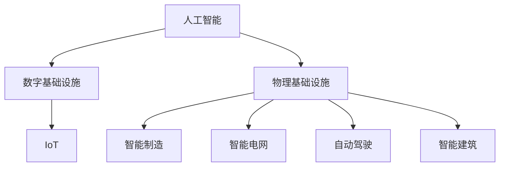

                 

# AI在自动化数字和物理基础设施中的应用

> 关键词：人工智能, 自动化, 数字基础设施, 物理基础设施, 物联网, 智能制造, 智能电网, 自动驾驶

## 1. 背景介绍

### 1.1 问题由来

随着信息技术的发展，数字基础设施（Digital Infrastructure）和物理基础设施（Physical Infrastructure）正在逐步融合，形成高度互联互通的网络体系。这些基础设施的自动化和智能化转型，对人工智能（AI）技术提出了更高的要求。AI的应用不仅可以提高基础设施的效率和安全性，还可以提升用户体验和服务质量。

### 1.2 问题核心关键点

AI在自动化数字和物理基础设施中的主要应用包括：

- **物联网（IoT）**：通过传感器网络收集环境数据，利用AI进行数据分析和预测，实现设备自动化管理。
- **智能制造**：利用AI对生产过程进行优化，提高生产效率和质量，降低成本。
- **智能电网**：利用AI进行负荷预测、需求响应、故障诊断等，提升电力系统的稳定性和可靠性。
- **自动驾驶**：通过AI进行环境感知和路径规划，提高交通安全性和出行效率。
- **智能建筑**：利用AI进行能效管理、安防监控、设备维护等，提高建筑的智能化水平。

## 2. 核心概念与联系

### 2.1 核心概念概述

为更好地理解AI在数字和物理基础设施中的应用，本节将介绍几个关键概念：

- **人工智能（AI）**：一种通过算法和模型，使计算机系统具备自主学习和决策能力的技术。AI包括机器学习、深度学习、强化学习等子领域。

- **数字基础设施（DI）**：包括通信网络、数据中心、云计算等，为数字经济提供支撑。

- **物理基础设施（PI）**：包括交通、能源、建筑等，为社会经济活动提供实体支持。

- **物联网（IoT）**：通过互联网将设备、传感器等互联互通，实现数据收集和远程控制。

- **智能制造**：利用AI对生产过程进行优化，实现柔性制造和智能化管理。

- **智能电网**：利用AI进行电力系统管理，提高能源利用效率和可靠性。

- **自动驾驶**：利用AI进行环境感知和决策，实现无人驾驶汽车。

- **智能建筑**：利用AI进行能效管理、安防监控等，提升建筑智能化水平。

这些概念之间的逻辑关系可以通过以下Mermaid流程图来展示：



这个流程图展示出AI技术在数字和物理基础设施中的渗透和应用。

## 3. 核心算法原理 & 具体操作步骤
### 3.1 算法原理概述

AI在数字和物理基础设施中的应用，主要依赖于数据的收集、处理和分析，以及智能决策的实现。基于AI的自动化解决方案通常包括数据采集、特征工程、模型训练和优化、智能决策和执行等步骤。

**数据采集**：通过传感器、摄像头、RFID等设备，实时采集环境数据和设备状态信息。

**特征工程**：对采集到的数据进行预处理、清洗和特征提取，构建模型训练所需的数据集。

**模型训练**：利用机器学习或深度学习算法，对数据集进行训练，得到能够进行智能决策的模型。

**智能决策**：将训练好的模型应用于实际场景，进行实时数据处理和决策，实现自动化管理。

**执行与反馈**：根据决策结果，自动控制设备和系统，同时收集执行结果和反馈信息，优化模型和算法。

### 3.2 算法步骤详解

以智能制造为例，基于AI的制造自动化主要包括以下几个步骤：

**Step 1: 数据采集与预处理**
- 利用传感器（如温度、压力、振动传感器）采集生产设备的运行数据。
- 使用数据清洗技术，去除异常数据和噪声。
- 应用特征提取算法，将原始数据转化为可用于模型训练的特征。

**Step 2: 模型训练与优化**
- 选择合适的机器学习或深度学习模型（如CNN、RNN、LSTM等）。
- 使用历史生产数据对模型进行训练，调整模型参数。
- 应用正则化技术，防止过拟合。
- 进行模型验证和优化，确保模型泛化能力。

**Step 3: 智能决策与执行**
- 将训练好的模型应用于实际生产过程，进行实时数据处理和预测。
- 根据预测结果，自动调整生产参数，优化生产过程。
- 将决策结果转化为可执行指令，控制生产设备。

**Step 4: 反馈与优化**
- 收集执行结果和反馈信息，评估模型性能。
- 根据反馈信息，调整模型参数，优化决策效果。
- 不断迭代和优化模型，提升自动化水平。

### 3.3 算法优缺点

基于AI的自动化解决方案具有以下优点：

- **高效性**：通过自动化操作，大大提高了生产效率和设备利用率。
- **精确性**：利用AI模型进行精确预测和决策，减少人为错误。
- **灵活性**：模型可以根据反馈信息进行动态调整，适应不同生产场景。
- **可靠性**：通过数据驱动的决策，提升系统的稳定性和可靠性。

同时，也存在一些局限性：

- **数据依赖**：模型需要大量高质量的数据进行训练，数据获取和处理成本较高。
- **技术门槛**：AI模型的训练和优化需要专业技能，实施难度较大。
- **安全风险**：模型可能受到攻击或数据泄露，需要加强安全防护。
- **维护成本**：模型的部署和维护需要持续的技术支持。

### 3.4 算法应用领域

基于AI的自动化解决方案在多个领域得到广泛应用，包括：

- **智能制造**：利用AI进行生产过程优化、质量控制、设备维护等，提升制造效率和质量。
- **智能电网**：利用AI进行负荷预测、需求响应、故障诊断等，提高电力系统的稳定性和可靠性。
- **自动驾驶**：利用AI进行环境感知和路径规划，提高交通安全性和出行效率。
- **智能建筑**：利用AI进行能效管理、安防监控等，提高建筑的智能化水平。
- **智慧城市**：利用AI进行城市运行监测、交通管理、公共服务等，提升城市管理水平。
- **智能医疗**：利用AI进行疾病预测、诊断、治疗方案优化等，提高医疗服务质量。

## 4. 数学模型和公式 & 详细讲解  
### 4.1 数学模型构建

AI在自动化数字和物理基础设施中的应用，主要依赖于数学模型进行数据处理和决策。以下以智能制造为例，介绍基本的数学模型构建过程。

### 4.2 公式推导过程

以机器学习中的线性回归模型为例，其公式推导过程如下：

设训练集为 $(x_i, y_i)$，其中 $x_i$ 为输入特征，$y_i$ 为输出标签，模型参数为 $\theta = (w, b)$，其中 $w$ 为权重向量，$b$ 为偏置项。线性回归模型的目标是最小化预测值与真实值之间的平方误差：

$$
J(\theta) = \frac{1}{2N} \sum_{i=1}^N (y_i - \theta^T x_i)^2
$$

利用梯度下降算法，求解最小化问题，得到参数 $\theta$：

$$
\frac{\partial J(\theta)}{\partial \theta} = -\frac{1}{N} \sum_{i=1}^N (y_i - \theta^T x_i) x_i
$$

$$
\theta = \theta - \eta \frac{\partial J(\theta)}{\partial \theta}
$$

其中 $\eta$ 为学习率，$\frac{\partial J(\theta)}{\partial \theta}$ 为损失函数对参数 $\theta$ 的梯度。

### 4.3 案例分析与讲解

以智能电网为例，基于AI的负荷预测模型可以采用时间序列分析方法进行建模。假设预测目标为未来24小时的用电负荷，可以通过以下几个步骤构建模型：

**Step 1: 数据准备**
- 收集历史用电数据，包括时间、负荷、天气等特征。
- 将数据分为训练集和测试集。

**Step 2: 模型选择与训练**
- 选择合适的时序模型（如ARIMA、LSTM等）。
- 使用历史数据对模型进行训练，调整模型参数。
- 应用正则化技术，防止过拟合。

**Step 3: 模型验证与优化**
- 在测试集上评估模型性能，计算均方误差等指标。
- 根据评估结果，调整模型参数，优化预测效果。

**Step 4: 模型应用**
- 将训练好的模型应用于实时负荷预测，预测未来24小时的用电负荷。
- 根据预测结果，进行需求响应，优化电力系统运行。

## 5. 项目实践：代码实例和详细解释说明
### 5.1 开发环境搭建

在进行AI应用开发前，需要准备好开发环境。以下是使用Python进行TensorFlow开发的环境配置流程：

1. 安装Anaconda：从官网下载并安装Anaconda，用于创建独立的Python环境。

2. 创建并激活虚拟环境：
```bash
conda create -n tf-env python=3.8 
conda activate tf-env
```

3. 安装TensorFlow：根据CUDA版本，从官网获取对应的安装命令。例如：
```bash
conda install tensorflow -c tensorflow -c conda-forge
```

4. 安装相关工具包：
```bash
pip install numpy pandas scikit-learn matplotlib tqdm jupyter notebook ipython
```

完成上述步骤后，即可在`tf-env`环境中开始AI应用开发。

### 5.2 源代码详细实现

这里以智能电网负荷预测为例，给出使用TensorFlow进行模型训练的PyTorch代码实现。

首先，定义数据处理函数：

```python
import pandas as pd
from sklearn.model_selection import train_test_split
import tensorflow as tf

def load_data(file_path):
    data = pd.read_csv(file_path)
    # 提取时间、负荷等特征
    features = data[['time', 'load']]
    # 处理缺失值
    features = features.dropna()
    # 将时间转换为日期时间格式
    features['time'] = pd.to_datetime(features['time'])
    # 将负荷数据进行标准化处理
    features['load'] = (features['load'] - features['load'].mean()) / features['load'].std()
    return features

def split_data(data, test_size=0.2):
    X_train, X_test, y_train, y_test = train_test_split(data.drop('load', axis=1), data['load'], test_size=test_size, shuffle=True)
    return X_train, X_test, y_train, y_test

def preprocess_data(X_train, y_train):
    # 对时间特征进行滑动窗口处理
    X_train = X_train.rolling(window=24, min_periods=1).mean()
    # 将时间特征转换为小时数
    X_train['hour'] = X_train['time'].dt.hour
    # 对负荷特征进行归一化处理
    X_train['load'] = (X_train['load'] - X_train['load'].mean()) / X_train['load'].std()
    return X_train, y_train

def build_model(input_shape):
    model = tf.keras.Sequential([
        tf.keras.layers.Dense(64, activation='relu', input_shape=input_shape),
        tf.keras.layers.Dense(64, activation='relu'),
        tf.keras.layers.Dense(1)
    ])
    model.compile(optimizer='adam', loss='mse', metrics=['mae'])
    return model

```

然后，定义模型训练函数：

```python
def train_model(model, X_train, y_train, epochs=100):
    history = model.fit(X_train, y_train, epochs=epochs, batch_size=32, validation_split=0.2)
    return history

```

最后，启动训练流程并评估模型：

```python
file_path = 'data.csv'
X_train, X_test, y_train, y_test = split_data(load_data(file_path))
X_train, y_train = preprocess_data(X_train, y_train)
model = build_model(X_train.shape[1:])
history = train_model(model, X_train, y_train)
model.evaluate(X_test, y_test)
```

以上就是使用TensorFlow进行智能电网负荷预测的完整代码实现。可以看到，TensorFlow的高级API使得模型构建和训练变得简单易用。

### 5.3 代码解读与分析

让我们再详细解读一下关键代码的实现细节：

**load_data函数**：
- 加载数据集，并处理时间、负荷等特征。
- 使用Pandas和Scikit-learn库进行数据清洗和标准化处理。

**split_data函数**：
- 将数据集分为训练集和测试集，用于模型训练和评估。
- 使用train_test_split函数，指定测试集比例和随机数种子。

**preprocess_data函数**：
- 对时间特征进行滑动窗口处理，获取每小时负荷数据。
- 将时间特征转换为小时数，用于模型训练。
- 对负荷特征进行归一化处理，防止过拟合。

**build_model函数**：
- 定义模型结构，包括多个全连接层。
- 使用Adam优化器和均方误差损失函数，训练模型。

**train_model函数**：
- 使用模型训练函数进行模型训练，指定迭代次数和批量大小。
- 使用validation_split参数，将数据集分为训练集和验证集。

**训练流程**：
- 加载数据集，进行预处理和数据划分。
- 定义模型结构，编译模型。
- 使用训练函数进行模型训练，并记录训练历史。
- 在测试集上评估模型性能，输出评估指标。

可以看出，TensorFlow提供了丰富的API和工具，可以方便地进行模型构建、训练和评估。开发者可以快速上手，开发出高性能的AI应用。

## 6. 实际应用场景
### 6.1 智能制造

基于AI的智能制造可以显著提升生产效率和质量，减少人为错误。通过实时监测设备状态和生产过程，进行预测性维护和故障诊断，可以延长设备寿命，降低维护成本。

**应用实例**：某汽车制造企业利用AI对生产过程进行优化，通过实时监测生产设备的运行数据，进行设备状态预测和故障诊断，提高了生产效率和设备利用率。

**技术难点**：生产环境复杂，数据种类多样，如何构建高效、鲁棒的特征提取模型，是AI应用的关键。

### 6.2 智能电网

智能电网通过AI进行负荷预测、需求响应和故障诊断，提升电力系统的稳定性和可靠性。

**应用实例**：某电力公司利用AI进行负荷预测，根据预测结果进行需求响应，优化电力系统运行。

**技术难点**：电力系统动态变化，负荷数据非平稳，如何构建准确、鲁棒的预测模型，是AI应用的关键。

### 6.3 自动驾驶

自动驾驶利用AI进行环境感知和路径规划，提高交通安全性和出行效率。

**应用实例**：某自动驾驶公司利用AI进行环境感知，通过实时监测车辆周围环境，进行路径规划和决策，实现了自动驾驶功能。

**技术难点**：环境复杂多变，数据量庞大，如何构建高效、鲁棒的感知和决策模型，是AI应用的关键。

### 6.4 智能建筑

智能建筑通过AI进行能效管理、安防监控等，提高建筑的智能化水平。

**应用实例**：某商业建筑利用AI进行能效管理，通过实时监测能源消耗和设备运行状态，进行能效分析和优化，降低了能源消耗和维护成本。

**技术难点**：建筑系统复杂，数据种类多样，如何构建高效、鲁棒的特征提取和优化模型，是AI应用的关键。

## 7. 工具和资源推荐
### 7.1 学习资源推荐

为了帮助开发者系统掌握AI在自动化数字和物理基础设施中的应用，这里推荐一些优质的学习资源：

1. TensorFlow官方文档：提供详细的API文档和教程，是TensorFlow开发者的必备资料。

2. Kaggle竞赛：Kaggle平台上有大量数据集和竞赛项目，可以帮助开发者提升数据处理和模型训练能力。

3. DeepLearning.AI课程：由Andrew Ng教授主讲，涵盖深度学习和机器学习的基础和应用，适合初学者学习。

4. Coursera课程：提供多门关于AI在工业应用中的课程，涵盖智能制造、智能电网、自动驾驶等多个领域。

5. HuggingFace官方文档：提供丰富的预训练模型和微调范式，适合开发者进行学习和实践。

通过对这些资源的学习实践，相信你一定能够快速掌握AI在自动化数字和物理基础设施中的应用，并用于解决实际的AI问题。

### 7.2 开发工具推荐

高效的开发离不开优秀的工具支持。以下是几款用于AI开发和应用开发的常用工具：

1. TensorFlow：由Google主导开发的开源深度学习框架，生产部署方便，适合大规模工程应用。

2. PyTorch：基于Python的开源深度学习框架，灵活动态的计算图，适合快速迭代研究。

3. Keras：高层次的深度学习API，易于上手，适合初学者和快速原型开发。

4. Jupyter Notebook：用于数据处理和模型训练的交互式开发环境，适合快速迭代和实验验证。

5. Anaconda：用于创建和管理Python环境的工具，方便开发者进行项目管理和版本控制。

6. Git：版本控制系统，适合团队协作和代码管理。

合理利用这些工具，可以显著提升AI应用的开发效率，加快创新迭代的步伐。

### 7.3 相关论文推荐

AI在自动化数字和物理基础设施中的应用，源于学界的持续研究。以下是几篇奠基性的相关论文，推荐阅读：

1. "Intelligent Manufacturing with AI: A Survey"：综述了AI在智能制造中的应用，包括质量控制、设备维护等。

2. "Energy Efficiency Optimization for Smart Grids via Machine Learning"：研究了AI在智能电网中的应用，包括负荷预测、需求响应等。

3. "Deep Learning for Autonomous Vehicles"：综述了AI在自动驾驶中的应用，包括环境感知、路径规划等。

4. "Building Smart Cities with AI"：探讨了AI在智慧城市中的应用，包括交通管理、公共服务等。

5. "AI in Healthcare: A Survey"：综述了AI在医疗领域的应用，包括疾病预测、诊断、治疗方案优化等。

这些论文代表了大规模AI应用的最新进展，通过学习这些前沿成果，可以帮助研究者把握学科前进方向，激发更多的创新灵感。

## 8. 总结：未来发展趋势与挑战
### 8.1 总结

本文对AI在自动化数字和物理基础设施中的应用进行了全面系统的介绍。首先阐述了AI技术在数字和物理基础设施中的重要性，明确了AI在智能制造、智能电网、自动驾驶、智能建筑等多个领域的应用潜力。其次，从原理到实践，详细讲解了AI应用的数学模型和具体实现步骤，给出了智能制造、智能电网、自动驾驶等AI应用项目的代码实例。同时，本文还广泛探讨了AI应用在实际场景中的具体应用，展示了AI技术的巨大潜力。

通过本文的系统梳理，可以看到，AI技术在数字和物理基础设施中的应用前景广阔，有望显著提升基础设施的智能化水平，推动数字化转型。未来，伴随AI技术的不断发展，AI在各个领域的落地应用将会更加广泛，为社会经济的发展带来深远影响。

### 8.2 未来发展趋势

展望未来，AI在数字和物理基础设施中的应用将呈现以下几个发展趋势：

1. **自动化水平提升**：AI技术将更加深入地融入生产过程和决策环节，实现全流程自动化和智能化。

2. **数据量激增**：随着物联网设备的普及，数据量将呈现指数级增长，AI需要处理更加多样、复杂的数据。

3. **边缘计算普及**：为了应对数据处理和传输延迟，边缘计算将逐渐普及，实时性得到提升。

4. **联邦学习应用**：在数据隐私和安全的前提下，联邦学习将允许多方数据协同训练AI模型，提升模型性能。

5. **跨领域融合**：AI将与物联网、大数据、云计算等技术进行深度融合，形成更完善的智能化体系。

6. **持续学习与进化**：AI模型将具备持续学习的能力，通过新数据不断进化和优化。

以上趋势凸显了AI在数字和物理基础设施中的巨大潜力。这些方向的探索发展，必将进一步提升基础设施的智能化水平，推动数字化转型。

### 8.3 面临的挑战

尽管AI在数字和物理基础设施中的应用前景广阔，但在实际落地过程中，仍面临诸多挑战：

1. **数据隐私与安全**：在数据采集和处理过程中，如何保护用户隐私，防止数据泄露和滥用。

2. **模型泛化能力**：AI模型需要在多种场景下表现一致，避免过拟合和模型偏差。

3. **技术复杂度**：AI应用的实现需要高水平的技术支持，需要跨学科的团队合作。

4. **系统集成难度**：不同系统之间的数据格式、协议、接口等不兼容，需要进行复杂的技术集成。

5. **用户体验优化**：AI应用的落地需要考虑用户体验，如何提升系统的易用性和直观性。

6. **法律与伦理**：AI应用的伦理与安全问题，需要建立完善的法规和监管机制。

正视AI应用面临的这些挑战，积极应对并寻求突破，将是大规模AI应用成功落地的关键。相信随着学界和产业界的共同努力，这些挑战终将一一被克服，AI在数字和物理基础设施中的潜力将得到充分发挥。

### 8.4 研究展望

面向未来，AI在数字和物理基础设施中的应用需要重点关注以下几个方向：

1. **数据隐私与安全技术**：研究高效的数据加密、匿名化、差分隐私等技术，保护用户隐私。

2. **模型泛化能力提升**：研究跨领域、跨模态的模型泛化方法，提高AI模型的适应性和可靠性。

3. **边缘计算与联邦学习**：研究高效的边缘计算和联邦学习算法，提升数据处理和模型训练的效率。

4. **跨领域融合技术**：研究跨学科的融合技术，推动AI与物联网、大数据、云计算等技术的深度整合。

5. **持续学习与进化技术**：研究持续学习与进化算法，使AI模型能够不断适应新数据和新场景。

6. **伦理与法律研究**：研究AI应用的伦理与安全问题，建立完善的法规和监管机制。

这些研究方向的探索，必将引领AI在数字和物理基础设施中的技术突破，推动智能化转型。

## 9. 附录：常见问题与解答

**Q1: AI在智能制造中的应用主要有哪些？**

A: AI在智能制造中的应用主要包括以下几个方面：

1. **预测性维护**：利用AI进行设备状态预测和故障诊断，提前进行维护，减少设备停机时间。
2. **质量控制**：通过AI进行产品缺陷检测和质量分类，提高产品质量和生产效率。
3. **生产过程优化**：利用AI进行生产过程的优化，减少能源消耗和原材料浪费，提高生产效率。
4. **供应链管理**：通过AI进行供应链优化，预测需求和库存，降低成本，提高供应链响应速度。

**Q2: 如何构建一个高效的AI预测模型？**

A: 构建高效的AI预测模型需要考虑以下几个关键因素：

1. **数据质量**：确保数据采集和处理的质量，去除异常值和噪声，进行特征工程。
2. **模型选择**：根据数据特征和预测任务选择合适的模型，如线性回归、随机森林、深度学习等。
3. **超参数调优**：通过交叉验证和网格搜索等方法，找到最优的超参数组合。
4. **模型验证**：在验证集上评估模型性能，进行模型选择和优化。
5. **模型应用**：将训练好的模型应用于实际预测任务，进行实时数据处理和决策。

**Q3: AI在智能电网中的应用主要有哪些？**

A: AI在智能电网中的应用主要包括以下几个方面：

1. **负荷预测**：利用AI进行负荷预测，优化电力系统调度。
2. **需求响应**：通过AI进行需求响应，优化电力系统运行，降低电网压力。
3. **故障诊断**：利用AI进行故障诊断，快速定位和处理电网故障，提高电力系统可靠性。
4. **能源管理**：利用AI进行能源管理，优化能源分配，提高能源利用效率。

**Q4: 智能建筑中AI的应用主要有哪些？**

A: 智能建筑中AI的应用主要包括以下几个方面：

1. **能效管理**：利用AI进行能效分析，优化建筑能耗，降低能源成本。
2. **安防监控**：通过AI进行安防监控，提升建筑安全性。
3. **设备维护**：利用AI进行设备维护，延长设备寿命，减少维护成本。
4. **室内环境控制**：利用AI进行室内环境控制，提高室内舒适度。

**Q5: 智能驾驶中AI的应用主要有哪些？**

A: 智能驾驶中AI的应用主要包括以下几个方面：

1. **环境感知**：利用AI进行环境感知，识别道路标志、车辆、行人等。
2. **路径规划**：通过AI进行路径规划，选择最优路径，避免碰撞。
3. **决策制定**：利用AI进行决策制定，在复杂环境中做出安全、高效的驾驶决策。
4. **自动泊车**：利用AI进行自动泊车，提高停车效率和安全性。

**Q6: 如何提高AI模型在实际应用中的性能？**

A: 提高AI模型在实际应用中的性能，可以从以下几个方面入手：

1. **数据增强**：通过数据增强技术，扩充数据集，提高模型泛化能力。
2. **模型优化**：通过模型优化算法，提高模型训练效率和性能。
3. **实时推理**：优化模型推理算法，提高模型实时性和响应速度。
4. **模型集成**：通过模型集成技术，融合多种模型的优势，提高模型性能和鲁棒性。
5. **持续学习**：通过持续学习技术，模型能够不断适应新数据和新场景，提升性能。

这些技术手段的组合应用，可以显著提高AI模型在实际应用中的性能和可靠性。

---

作者：禅与计算机程序设计艺术 / Zen and the Art of Computer Programming

