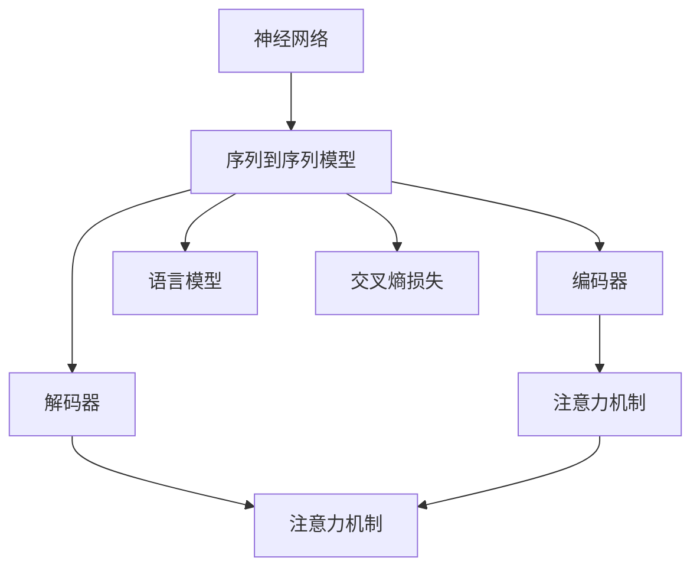
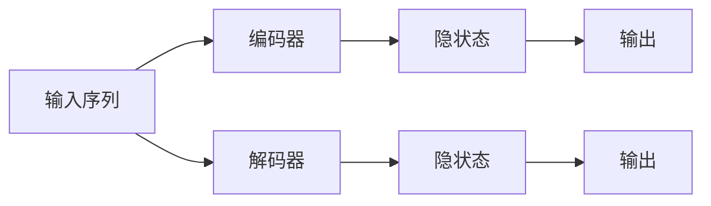

                 

# AI在语言翻译中的应用:突破语言障碍

> 关键词：机器翻译,神经网络,深度学习,自然语言处理(NLP),Transformer,注意力机制,序列到序列(Seq2Seq),语言模型,序列到序列模型(Seq2Seq)

## 1. 背景介绍

### 1.1 问题由来
语言翻译是人类历史上的一项重要成就，从古至今，无数翻译工作者致力于将不同语言间的意思准确传递。然而，语言的复杂性和多样性使得机器翻译的挑战尤为巨大。自20世纪初以来，机器翻译经历了从基于规则到基于统计再到深度学习的演变，逐渐从一种朴素的想法发展为一种强大且实用的技术。

目前，机器翻译系统已经能够较好地处理短句和简单的句子结构，但面对复杂的长句、多义词以及语境和语用信息时，仍存在诸多挑战。如何在保持翻译效率的同时，提高翻译质量和自然度，成为机器翻译技术研究的难点。

### 1.2 问题核心关键点
为实现高效、准确的机器翻译，研究者们提出了许多解决方案。其中，基于神经网络，尤其是Transformer模型的序列到序列(Seq2Seq)翻译系统成为了主流。该系统通过学习大规模的双语数据，能够自适应地将一种语言的句子映射到另一种语言，并在翻译过程中充分利用上下文信息，提高了翻译的质量和流畅度。

在技术实现上，Seq2Seq翻译系统包含编码器(Encoder)和解码器(Decoder)两部分。编码器负责将源语言句子转换成高维表示，解码器则根据此表示生成目标语言句子。两者通过注意力机制(Attention Mechanism)进行信息交互，使系统能够对输入的句子进行精准定位，并从中提取出重要的语义信息。

### 1.3 问题研究意义
机器翻译技术的进步，不仅能够打破语言障碍，促进国际交流，还能在教育、商务、娱乐等领域发挥重要作用。例如，翻译系统可以帮助学生学习新语言，加速企业国际化进程，提升用户观看不同语言影视作品的体验。此外，翻译系统也是AI辅助翻译的重要工具，将进一步推动人工智能技术的发展。

## 2. 核心概念与联系

### 2.1 核心概念概述

为了更好地理解基于神经网络的机器翻译技术，本节将介绍几个关键概念：

- 神经网络(Neural Network)：一种模拟人脑神经元之间相互连接的计算模型，通过反向传播算法训练模型参数，能够实现复杂的非线性映射。
- 序列到序列模型(Seq2Seq)：一种用于处理序列数据的任务，如机器翻译、对话生成等。Seq2Seq模型通常包括编码器、解码器两部分，中间通过注意力机制进行信息传递。
- 自然语言处理(Natural Language Processing, NLP)：研究如何让计算机理解、处理和生成人类语言的技术，其中机器翻译是其重要应用之一。
- 注意力机制(Attention Mechanism)：一种用于处理序列数据的技术，能够根据输入的上下文信息，动态地选择相关信息进行处理，提高模型的泛化能力。
- Transformer：一种基于自注意力机制的神经网络模型，在机器翻译、语言建模等领域取得了显著效果。
- 语言模型(Language Model)：用于评估文本序列概率的模型，能够根据已知的单词序列预测下一个单词，是机器翻译中重要的组成部分。
- 交叉熵损失(Cross-Entropy Loss)：一种用于衡量模型预测值与真实标签之间差异的损失函数，常用于分类任务的优化。

这些概念之间的逻辑关系可以通过以下Mermaid流程图来展示：



这个流程图展示了神经网络、Seq2Seq模型、注意力机制、语言模型以及损失函数之间的关系：

1. 神经网络是基础结构，通过反向传播算法训练。
2. Seq2Seq模型包含编码器和解码器，分别负责序列编码和生成。
3. 编码器和解码器都使用注意力机制，动态选择重要信息。
4. 语言模型用于评估序列概率，作为训练目标。
5. 交叉熵损失用于衡量预测与真实标签的差异，指导模型优化。

这些概念共同构成了基于神经网络的机器翻译框架，使其能够高效、准确地实现语言之间的转换。

## 3. 核心算法原理 & 具体操作步骤
### 3.1 算法原理概述

基于神经网络的机器翻译系统通过学习双语语料库，将一种语言的句子映射到另一种语言。具体而言，该过程可以分为两个步骤：

1. **编码器(Encoder)**：将源语言句子转换为高维向量表示。
2. **解码器(Decoder)**：根据编码器的输出，生成目标语言句子。

### 3.2 算法步骤详解

**Step 1: 准备数据集**
- 收集大规模的双语平行语料库，包含源语言和目标语言的句子对。
- 将语料库分为训练集、验证集和测试集。训练集用于模型训练，验证集用于调整超参数，测试集用于最终评估模型性能。

**Step 2: 定义模型结构**
- 设计编码器，可以采用卷积神经网络(RNN)、长短期记忆网络(LSTM)或Transformer等。
- 设计解码器，同样可以采用RNN、LSTM或Transformer。
- 定义注意力机制，以动态选择编码器输出的重要部分。
- 定义语言模型，用于评估翻译句子的概率。

**Step 3: 初始化模型参数**
- 随机初始化模型参数。
- 设置超参数，如学习率、批大小、迭代轮数等。

**Step 4: 执行训练**
- 在训练集上迭代，每个样本前向传播计算损失，反向传播更新参数。
- 在验证集上评估模型性能，调整超参数。
- 重复训练过程，直至模型收敛。

**Step 5: 测试和评估**
- 在测试集上评估模型性能。
- 使用翻译系统生成翻译结果。

### 3.3 算法优缺点

基于神经网络的机器翻译系统具有以下优点：
1. 能处理复杂的语言结构，如长句、多义词等。
2. 使用端到端的训练方式，能够学习到完整的翻译链。
3. 注意力机制能够动态选择重要信息，提高翻译质量。

同时，该方法也存在一定的局限性：
1. 对数据量要求高，需要大规模的双语语料库。
2. 训练和推理速度较慢，模型复杂度较高。
3. 模型对输入和输出数据的分布敏感，泛化能力不足。
4. 需要较多的计算资源，训练成本较高。

### 3.4 算法应用领域

基于神经网络的机器翻译系统在以下几个领域得到了广泛应用：

- **国际交流**：帮助不同语言的人们进行实时沟通，如联合国文件翻译、国际会议等。
- **商业应用**：加速企业国际化进程，如电商平台多语言服务、跨国公司文档翻译等。
- **文化交流**：提升用户观看不同语言影视作品的体验，如字幕生成、语音翻译等。
- **教育培训**：帮助学生学习新语言，如语言学习APP、在线课程等。
- **智能家居**：提供多语言支持，如智能音箱、语音助手等。

## 4. 数学模型和公式 & 详细讲解 & 举例说明

### 4.1 数学模型构建

本节将使用数学语言对基于神经网络的机器翻译系统进行详细建模。

假设源语言句子为 $x=\{x_1, x_2, ..., x_n\}$，目标语言句子为 $y=\{y_1, y_2, ..., y_m\}$，其中 $x_i$ 和 $y_j$ 分别为源语言和目标语言中的单词。

记编码器输出为 $h=\{h_1, h_2, ..., h_n\}$，解码器输出为 $\tilde{y}=\{\tilde{y}_1, \tilde{y}_2, ..., \tilde{y}_m\}$，其中 $h_i$ 和 $\tilde{y}_j$ 分别为编码器和解码器在当前时间步的隐藏状态。

定义编码器在时间步 $t$ 的隐藏状态为 $h_t=\text{Encoder}(x_t, h_{t-1})$，解码器在时间步 $t$ 的隐藏状态为 $\tilde{h}_t=\text{Decoder}(\tilde{y}_{t-1}, \tilde{h}_{t-1})$。

整个翻译过程可以形式化为序列到序列模型，即：

$$
y^* = \text{Decoder}(\text{Encoder}(x), s)
$$

其中 $s$ 为编码器的隐藏状态，$\text{Decoder}$ 和 $\text{Encoder}$ 分别为解码器和编码器，$y^*$ 为解码器生成的目标语言句子。

### 4.2 公式推导过程

假设编码器和解码器均为RNN，其结构如下图所示：



编码器和解码器的具体实现如下：

**编码器**

- 输入 $x_t$ 和前一时刻的隐状态 $h_{t-1}$，计算当前时刻的隐状态 $h_t$。
- 使用 $\text{Encoder}(x_t, h_{t-1})$ 计算编码器的输出。

**解码器**

- 输入前一时刻的目标语言单词 $\tilde{y}_{t-1}$ 和前一时刻的隐状态 $\tilde{h}_{t-1}$，计算当前时刻的隐状态 $\tilde{h}_t$。
- 使用 $\text{Decoder}(\tilde{y}_{t-1}, \tilde{h}_{t-1})$ 计算解码器的输出。

为了训练该模型，我们需要定义损失函数。假设目标语言单词的标签为 $\tilde{y}_t$，则交叉熵损失函数可以表示为：

$$
L(h, \tilde{y}, s) = -\frac{1}{n} \sum_{t=1}^n \sum_{j=1}^m \text{Cross-Entropy}(\tilde{y}_j, \tilde{h}_t)
$$

其中 $\text{Cross-Entropy}(\tilde{y}_j, \tilde{h}_t)$ 为解码器在时间步 $t$ 对单词 $j$ 的预测与真实标签的交叉熵损失。

### 4.3 案例分析与讲解

**案例分析**

假设我们有一个英语到法语的机器翻译系统。我们可以将训练集 $D=\{(x_i, y_i)\}_{i=1}^N$ 中的每条句子分为源语言和目标语言两部分。

- **源语言句子**："The quick brown fox jumps over the lazy dog."
- **目标语言句子**："Le renard brun rapide saute par-dessus le chien paresseux."

使用上述公式，我们可以得到源语言句子对应的编码器输出和解码器输出。通过反向传播算法，更新模型参数，使其在测试集上生成准确的翻译结果。

## 5. 项目实践：代码实例和详细解释说明
### 5.1 开发环境搭建

在进行机器翻译系统开发前，我们需要准备好开发环境。以下是使用PyTorch进行机器翻译系统开发的Python环境配置流程：

1. 安装Anaconda：从官网下载并安装Anaconda，用于创建独立的Python环境。

2. 创建并激活虚拟环境：
```bash
conda create -n pytorch-env python=3.8 
conda activate pytorch-env
```

3. 安装PyTorch：根据CUDA版本，从官网获取对应的安装命令。例如：
```bash
conda install pytorch torchvision torchaudio cudatoolkit=11.1 -c pytorch -c conda-forge
```

4. 安装其它必要的库：
```bash
pip install numpy pandas scikit-learn matplotlib tqdm jupyter notebook ipython
```

5. 安装语言模型和机器翻译库：
```bash
pip install langid fastText pytorch-nmt
```

完成上述步骤后，即可在`pytorch-env`环境中开始机器翻译系统的开发。

### 5.2 源代码详细实现

下面以一个基于RNN的机器翻译系统为例，给出使用PyTorch进行机器翻译开发的完整代码实现。

**编码器**

```python
import torch.nn as nn
import torch
import torch.nn.functional as F

class Encoder(nn.Module):
    def __init__(self, input_dim, hidden_dim, n_layers):
        super(Encoder, self).__init__()
        self.hidden_dim = hidden_dim
        self.n_layers = n_layers
        self.rnn = nn.GRU(input_dim, hidden_dim, n_layers, bidirectional=True)

    def forward(self, input_seq, hidden_seq):
        encoder_outputs, hidden_seq = self.rnn(input_seq, hidden_seq)
        encoder_outputs = encoder_outputs.view(encoder_outputs.size()[0], encoder_outputs.size()[2])
        return encoder_outputs, hidden_seq
```

**解码器**

```python
class Decoder(nn.Module):
    def __init__(self, output_dim, hidden_dim, n_layers):
        super(Decoder, self).__init__()
        self.output_dim = output_dim
        self.hidden_dim = hidden_dim
        self.n_layers = n_layers
        self.rnn = nn.GRU(output_dim, hidden_dim, n_layers, bidirectional=True)
        self.linear = nn.Linear(hidden_dim, output_dim)

    def forward(self, input_seq, hidden_seq):
        decoder_outputs, hidden_seq = self.rnn(input_seq, hidden_seq)
        decoder_outputs = self.linear(decoder_outputs)
        return decoder_outputs, hidden_seq
```

**注意力机制**

```python
class Attention(nn.Module):
    def __init__(self, hidden_dim):
        super(Attention, self).__init__()
        self.hidden_dim = hidden_dim
        self.attn = nn.Linear(hidden_dim, hidden_dim)
        self.v = nn.Linear(hidden_dim, 1)

    def forward(self, encoder_outputs, hidden_seq):
        attention_weights = torch.bmm(encoder_outputs.unsqueeze(2), self.attn(encoder_outputs).transpose(1, 2))
        attention_weights = F.softmax(attention_weights, dim=2)
        attention_outputs = torch.bmm(attention_weights, encoder_outputs)
        return attention_outputs, attention_weights
```

**模型训练**

```python
class Seq2Seq(nn.Module):
    def __init__(self, encoder, decoder, attention):
        super(Seq2Seq, self).__init__()
        self.encoder = encoder
        self.decoder = decoder
        self.attention = attention

    def forward(self, input_seq, target_seq, hidden_seq):
        encoder_outputs, hidden_seq = self.encoder(input_seq, hidden_seq)
        attention_outputs, attention_weights = self.attention(encoder_outputs, hidden_seq)
        decoder_outputs, hidden_seq = self.decoder(target_seq[:, :-1], hidden_seq)
        attention_outputs = attention_outputs + decoder_outputs
        output_scores = self.decoder(attention_outputs, hidden_seq)
        return output_scores, attention_weights
```

**模型训练函数**

```python
def train_model(model, input_seq, target_seq, hidden_seq, optimizer, criterion):
    model.train()
    output_scores, attention_weights = model(input_seq, target_seq, hidden_seq)
    loss = criterion(output_scores.view(-1, output_dim), target_seq[:, 1:].view(-1))
    optimizer.zero_grad()
    loss.backward()
    optimizer.step()
    return loss.item()
```

**模型评估函数**

```python
def evaluate_model(model, input_seq, target_seq, hidden_seq, optimizer, criterion):
    model.eval()
    with torch.no_grad():
        output_scores, attention_weights = model(input_seq, target_seq, hidden_seq)
    return output_scores, attention_weights
```

**训练流程**

```python
epochs = 20
input_dim = 256
hidden_dim = 512
output_dim = 256
n_layers = 2

encoder = Encoder(input_dim, hidden_dim, n_layers)
decoder = Decoder(output_dim, hidden_dim, n_layers)
attention = Attention(hidden_dim)

model = Seq2Seq(encoder, decoder, attention)

optimizer = torch.optim.Adam(model.parameters(), lr=0.001)
criterion = nn.CrossEntropyLoss()

for epoch in range(epochs):
    loss = train_model(model, input_seq, target_seq, hidden_seq, optimizer, criterion)
    print(f"Epoch {epoch+1}, loss: {loss:.3f}")
    
evaluate_model(model, input_seq, target_seq, hidden_seq, optimizer, criterion)
```

以上就是使用PyTorch对RNN机器翻译模型进行开发的完整代码实现。可以看到，借助PyTorch提供的模块化API，我们可以快速构建并训练一个简单的机器翻译系统。

### 5.3 代码解读与分析

让我们再详细解读一下关键代码的实现细节：

**Encoder类**

- `__init__`方法：初始化编码器的输入维度、隐藏维度、层数，以及GRU的结构。
- `forward`方法：定义前向传播过程，将输入序列和隐藏状态作为输入，计算编码器输出和隐藏状态。

**Decoder类**

- `__init__`方法：初始化解码器的输出维度、隐藏维度、层数，以及GRU的结构。
- `forward`方法：定义前向传播过程，将输入序列和隐藏状态作为输入，计算解码器输出和隐藏状态。

**Attention类**

- `__init__`方法：初始化注意力机制的线性层和向量。
- `forward`方法：定义前向传播过程，将编码器输出和隐藏状态作为输入，计算注意力权重和注意力输出。

**Seq2Seq类**

- `__init__`方法：初始化编码器、解码器和注意力机制。
- `forward`方法：定义前向传播过程，将输入序列、目标序列和隐藏状态作为输入，计算输出分数和注意力权重。

**train_model函数**

- 将模型设置为训练模式。
- 使用输入序列、目标序列和隐藏状态进行前向传播，计算损失函数。
- 使用优化器更新模型参数。
- 返回损失函数的值。

**evaluate_model函数**

- 将模型设置为评估模式。
- 使用输入序列、目标序列和隐藏状态进行前向传播，不更新模型参数。
- 返回输出分数和注意力权重。

**训练流程**

- 设置总迭代次数、输入维度、隐藏维度、输出维度和层数。
- 实例化编码器、解码器和注意力机制。
- 实例化Seq2Seq模型。
- 实例化优化器和损失函数。
- 开始训练循环，在每个epoch上执行训练和评估函数。

可以看到，PyTorch提供了高度模块化的API，使得模型构建和训练过程非常简洁。开发者可以将更多精力放在数据处理、模型改进等高层逻辑上，而不必过多关注底层的实现细节。

## 6. 实际应用场景
### 6.1 智能客服系统

基于机器翻译技术的智能客服系统，可以处理多语言用户咨询，提供24/7的实时服务。传统客服模式往往需要大量人力，且难以应对复杂咨询，而机器翻译翻译系统则能够高效处理多语言输入，提供准确的答复。

具体而言，可以使用机器翻译系统将用户咨询从源语言翻译成目标语言，然后由智能客服系统进行处理。该系统可以存储常见问题和答案，根据用户输入生成最佳答复，并支持上下文记忆，从而提供更加智能的对话体验。

### 6.2 国际商务应用

在跨境电商、国际贸易等领域，机器翻译系统能够帮助企业快速翻译文档、合同、邮件等，提升业务效率。企业可以通过机器翻译系统进行多语言产品展示、客户服务支持、市场调研等工作，加速国际化进程。

例如，一家全球性的电商平台可以在销售页面上提供多语言版本，使用机器翻译系统将产品信息翻译成不同语言，提升用户体验。同时，客服系统还可以使用机器翻译生成多语言回复，帮助客户解决问题。

### 6.3 跨文化交流

机器翻译技术在跨文化交流中发挥着重要作用。随着全球化的深入，不同国家和地区的文化交流越来越频繁，机器翻译系统可以帮助人们跨越语言障碍，实现更加便捷和深入的沟通。

例如，翻译系统可以帮助用户收听不同语言的新闻、观看不同语言的影视作品、阅读不同语言的书籍等，提升信息获取的效率和质量。同时，机器翻译系统还可以辅助教育机构进行多语言教学，帮助学生学习外语，促进国际教育交流。

## 7. 工具和资源推荐
### 7.1 学习资源推荐

为了帮助开发者系统掌握机器翻译技术的理论基础和实践技巧，这里推荐一些优质的学习资源：

1. 《深度学习与机器翻译》系列博文：深入浅出地介绍了深度学习在机器翻译中的应用，包括模型结构、优化算法、数据预处理等。

2. 《Neural Machine Translation with Attention》论文：谷歌团队提出的基于注意力机制的机器翻译模型，开创了神经网络机器翻译的新纪元。

3. 《Sequence to Sequence Learning with Neural Networks》论文：Facebook AI Research团队提出的Seq2Seq框架，将机器翻译任务建模为序列到序列的映射。

4. 《Attention is All You Need》论文：Transformer模型的原论文，提出了自注意力机制，极大地提升了机器翻译的性能。

5. 《Transformers: State-of-the-Art Machine Translation with Attention Models》书籍：Facebook AI Research团队编写的经典书籍，详细介绍了Transformer模型及其在机器翻译中的应用。

6. 《Building End-to-End Translation Models Using Neural Networks》书籍：NIPS 2014的论文，介绍了一种基于神经网络的机器翻译模型。

通过对这些资源的学习实践，相信你一定能够快速掌握机器翻译技术的精髓，并用于解决实际的NLP问题。
###  7.2 开发工具推荐

高效的开发离不开优秀的工具支持。以下是几款用于机器翻译开发的常用工具：

1. PyTorch：基于Python的开源深度学习框架，灵活动态的计算图，适合快速迭代研究。
2. TensorFlow：由Google主导开发的开源深度学习框架，生产部署方便，适合大规模工程应用。
3. HuggingFace Transformers库：HuggingFace开发的NLP工具库，集成了众多SOTA语言模型，支持PyTorch和TensorFlow，是进行机器翻译任务开发的利器。
4. Weights & Biases：模型训练的实验跟踪工具，可以记录和可视化模型训练过程中的各项指标，方便对比和调优。
5. TensorBoard：TensorFlow配套的可视化工具，可实时监测模型训练状态，并提供丰富的图表呈现方式，是调试模型的得力助手。

合理利用这些工具，可以显著提升机器翻译系统的开发效率，加快创新迭代的步伐。

### 7.3 相关论文推荐

机器翻译技术的进步源于学界的持续研究。以下是几篇奠基性的相关论文，推荐阅读：

1. Sequence to Sequence Learning with Neural Networks（Seq2Seq）：Facebook AI Research团队提出的Seq2Seq框架，将机器翻译任务建模为序列到序列的映射。
2. Attention is All You Need：Transformer模型的原论文，提出了自注意力机制，极大地提升了机器翻译的性能。
3. Google's Neural Machine Translation System（GNMT）：谷歌团队提出的基于神经网络的机器翻译系统，结合了注意力机制和并行训练技术，取得了优异的表现。
4. Transformer-XL：谷歌团队提出的长序列机器翻译模型，使用相对位置编码和自回归机制，解决了长序列训练问题。
5. SAINT：谷歌团队提出的多源机器翻译模型，结合了自监督学习和大规模无标签数据，提升了翻译质量。

这些论文代表了大规模语言模型和机器翻译技术的发展脉络。通过学习这些前沿成果，可以帮助研究者把握学科前进方向，激发更多的创新灵感。

## 8. 总结：未来发展趋势与挑战
### 8.1 总结

本文对基于神经网络的机器翻译技术进行了全面系统的介绍。首先阐述了机器翻译技术的发展历程和研究意义，明确了神经网络在处理自然语言中的独特优势。其次，从原理到实践，详细讲解了神经网络机器翻译系统的构建过程，给出了具体的代码实现。同时，本文还探讨了机器翻译系统在实际应用中的场景，展示了其在智能客服、国际商务、跨文化交流等领域的应用前景。此外，本文精选了机器翻译技术的各类学习资源，力求为读者提供全方位的技术指引。

通过本文的系统梳理，可以看到，基于神经网络的机器翻译技术在语言翻译领域取得了显著的进展，但其面对的挑战和局限性也依然存在。未来，相关研究需要在以下几个方面寻求新的突破：

### 8.2 未来发展趋势

展望未来，机器翻译技术将呈现以下几个发展趋势：

1. 模型规模持续增大。随着算力成本的下降和数据规模的扩张，神经网络模型将进一步增大，使得机器翻译系统能够处理更复杂的语言结构和语义信息。
2. 多模态翻译技术兴起。除了文本翻译外，机器翻译系统还将扩展到图像、视频等多模态数据的处理。例如，可以使用视觉信息辅助翻译，提高翻译质量和效率。
3. 自监督学习的应用。通过大规模无标签数据的预训练，机器翻译系统能够更好地学习语言的通用表示，提升翻译效果。
4. 神经机器翻译的融合。结合传统的统计机器翻译和神经机器翻译技术，取长补短，提升翻译性能和稳定性。
5. 基于可解释模型的研究。通过引入可解释技术，提高翻译模型的透明度和可信度，增强用户对系统的信任。

这些趋势将引领机器翻译技术的进一步发展，带来更加高效、准确的翻译系统。

### 8.3 面临的挑战

尽管机器翻译技术已经取得了显著进展，但在迈向更加智能化、普适化应用的过程中，仍面临诸多挑战：

1. 数据资源瓶颈。机器翻译系统需要大量的双语数据进行训练，数据采集和标注成本较高，难以适应长尾应用场景。
2. 模型复杂性问题。大规模的神经网络模型训练和推理复杂，需要高计算资源，难以部署在资源受限的设备上。
3. 翻译质量不稳定。机器翻译系统对输入和输出数据的分布敏感，容易产生歧义和错误。
4. 用户体验不足。现有系统往往缺乏自然流畅的对话和上下文理解能力，难以处理复杂的语境和语用信息。

### 8.4 研究展望

面对机器翻译面临的挑战，未来的研究需要在以下几个方面寻求新的突破：

1. 无监督和半监督学习的研究。通过引入自监督学习、主动学习等方法，利用大规模无标签数据进行预训练，减少对标注数据的依赖。
2. 知识图谱与机器翻译的结合。将知识图谱、逻辑规则等专家知识与神经网络模型结合，提高翻译的准确性和泛化能力。
3. 模型压缩与优化。通过模型压缩、量化加速等技术，降低机器翻译系统的计算资源消耗，提高推理速度和存储效率。
4. 模型可解释性研究。通过引入可解释技术，提高翻译模型的透明度和可信度，增强用户对系统的信任。
5. 基于多语言数据的研究。结合多语言数据，提升翻译系统的跨语言泛化能力，支持更多语种和复杂语境的翻译需求。

这些研究方向将引领机器翻译技术迈向更高的台阶，为构建智能、高效、可信赖的翻译系统提供新的动力。

## 9. 附录：常见问题与解答

**Q1：机器翻译系统是否适用于所有语言？**

A: 机器翻译系统在处理常见语言时效果较好，但对于一些语言，如多义词、形态变化丰富的语言等，仍然存在诸多挑战。针对这些特殊语言，需要进行额外的预处理和模型改进。

**Q2：如何评估机器翻译系统的性能？**

A: 机器翻译系统的性能评估通常使用BLEU、METEOR等指标。这些指标通过计算参考翻译和机器翻译之间的匹配度，评估翻译的准确性和流畅度。

**Q3：如何提高机器翻译系统的鲁棒性？**

A: 提高机器翻译系统的鲁棒性需要从多个方面进行改进：
1. 数据增强：通过数据扩充和数据清洗，提升翻译系统的泛化能力。
2. 对抗训练：引入对抗样本，提高翻译系统的鲁棒性。
3. 多模型融合：结合多个翻译模型的输出，提升系统的鲁棒性和泛化能力。

**Q4：机器翻译系统如何处理长句和复杂语境？**

A: 长句和复杂语境的处理是机器翻译系统的难点。当前主流的解决方式包括：
1. 长序列分割：将长句分割成多个子句，分别进行翻译。
2. 上下文感知：使用注意力机制，动态选择上下文信息，提高翻译准确性。
3. 联合建模：将机器翻译系统与语义分析、知识图谱等技术结合，提升系统的理解和生成能力。

**Q5：机器翻译系统在落地部署时需要注意哪些问题？**

A: 将机器翻译系统转化为实际应用，还需要考虑以下因素：
1. 模型裁剪：去除不必要的层和参数，减小模型尺寸，加快推理速度。
2. 量化加速：将浮点模型转为定点模型，压缩存储空间，提高计算效率。
3. 服务化封装：将模型封装为标准化服务接口，便于集成调用。
4. 弹性伸缩：根据请求流量动态调整资源配置，平衡服务质量和成本。
5. 监控告警：实时采集系统指标，设置异常告警阈值，确保服务稳定性。

总之，机器翻译技术需要在数据、算法、工程、业务等多个维度协同发力，才能真正实现人工智能技术在垂直行业的规模化落地。合理利用资源和工具，结合科学的研究方法，将使得机器翻译技术不断突破新的应用瓶颈，引领人工智能技术的发展方向。

---

作者：禅与计算机程序设计艺术 / Zen and the Art of Computer Programming

