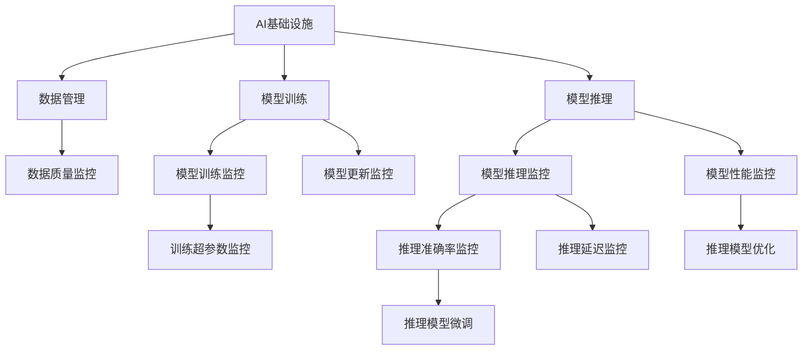

                 

# AI基础设施的监控与告警：Lepton AI的运维体系

## 1. 背景介绍

在当今这个数据驱动的AI时代，AI基础设施的监控与告警系统成为了保障AI应用稳定运行的关键。随着AI系统日益复杂，从模型的训练到推理，从数据的收集到模型的部署，每一步都需要精细化的监控和及时告警，以确保AI系统的稳定性和可靠性。Lepton AI作为一家领先的AI技术公司，其运维体系在业界享有盛誉。本文将深入探讨Lepton AI的监控与告警系统，分析其核心技术原理和操作步骤，并对比其优缺点和应用领域，以期为读者提供一个全面而深入的AI运维实践指导。

## 2. 核心概念与联系

### 2.1 核心概念概述

为了更好地理解Lepton AI的运维体系，我们首先需要了解一些核心概念：

- **AI基础设施**：包括数据管理、模型训练、推理部署、监控告警等在内的AI应用所有组件和流程。
- **监控与告警**：通过实时监测AI系统各项关键指标，当指标异常时及时发出告警，保障系统的稳定性和安全性。
- **Lepton AI**：本文聚焦于Lepton AI公司的监控与告警系统，探讨其设计和实现原理。
- **机器学习监控**：针对机器学习模型的监控，包括模型训练过程的监控和模型推理性能的监控。
- **深度学习监控**：对深度学习模型的特定监控需求，如梯度爆炸、权重更新等。

这些核心概念构成了AI基础设施监控与告警系统的基础，Lepton AI的运维体系正是基于这些概念，通过合理的架构设计和算法实现，构建了一个高效、可靠的系统。

### 2.2 核心概念原理和架构的 Mermaid 流程图



这个流程图展示了Lepton AI监控与告警系统的架构：

- 数据管理模块负责数据的采集、清洗和存储。
- 模型训练模块监控模型的训练过程，包括训练进度、超参数设置等。
- 模型推理模块监控模型的推理性能，包括准确率、延迟等。
- 数据质量监控、训练超参数监控、模型性能监控等分别对应不同的监控环节。
- 模型更新和优化通过监控结果进行触发。

接下来，我们将深入探讨Lepton AI监控与告警系统的算法原理和具体操作步骤。

## 3. 核心算法原理 & 具体操作步骤

### 3.1 算法原理概述

Lepton AI的监控与告警系统主要基于以下几大算法原理：

- **异常检测算法**：通过统计学方法和机器学习算法，实时监测AI系统各项关键指标，判断其是否异常。
- **告警机制**：根据异常检测结果，自动触发告警，及时通知相关人员进行处理。
- **指标可视化**：利用图表和仪表盘，直观展示AI系统的运行状况和监控结果。
- **历史数据分析**：通过分析历史数据，预测未来的趋势，提前预警潜在风险。

这些算法原理共同构成了Lepton AI监控与告警系统的核心，通过合理的设计和实现，可以实现高效、准确的监控与告警。

### 3.2 算法步骤详解

Lepton AI的监控与告警系统执行步骤如下：

1. **数据采集**：收集AI系统各项关键指标，如训练进度、模型性能、数据质量等。
2. **异常检测**：应用异常检测算法，判断收集到的指标是否异常。
3. **告警触发**：根据异常检测结果，自动触发告警，通知相关人员。
4. **问题处理**：相关人员根据告警信息，对AI系统进行问题定位和处理。
5. **指标可视化**：通过图表和仪表盘展示AI系统的运行状况和监控结果。
6. **历史数据分析**：分析历史数据，预测未来趋势，提前预警风险。

这些步骤在Lepton AI的运维体系中，通过高度自动化和智能化的方式执行，确保了AI系统的稳定性和可靠性。

### 3.3 算法优缺点

Lepton AI的监控与告警系统具有以下优点：

- **实时性高**：通过实时监测和告警，及时发现并处理问题，减少了系统宕机和数据丢失的风险。
- **智能化高**：应用机器学习和统计学方法，提高了异常检测的准确性和智能性。
- **可视化好**：通过直观的图表和仪表盘，使得监控结果易于理解和操作。
- **自动化程度高**：自动化执行监控与告警流程，减少了人工干预的复杂性。

然而，该系统也存在以下缺点：

- **依赖数据质量**：数据采集和处理的准确性直接影响监控效果。
- **算法复杂性**：异常检测算法和告警机制较为复杂，需要专业技能维护。
- **资源消耗高**：实时监控和告警增加了系统的计算和存储负担。
- **缺乏人性化设计**：告警信息过于专业，难以被非技术团队理解。

## 4. 数学模型和公式 & 详细讲解 & 举例说明

### 4.1 数学模型构建

Lepton AI的监控与告警系统主要应用以下数学模型：

- **统计学模型**：如均值、标准差、方差等，用于计算指标的均值和标准差，判断其是否偏离正常范围。
- **机器学习模型**：如时间序列分析、异常检测算法等，用于更深入的异常检测和预测。

### 4.2 公式推导过程

以均值和标准差的计算为例，公式推导如下：

$$
\mu = \frac{\sum{x}}{n}
$$

$$
\sigma = \sqrt{\frac{\sum{(x-\mu)^2}}{n}}
$$

其中，$x$为数据集中的每个元素，$n$为数据集的大小。通过计算均值和标准差，可以判断数据是否异常。

### 4.3 案例分析与讲解

以模型推理准确率的监控为例，假设某AI模型在推理时，准确率突然下降，监控系统可以应用统计学方法，计算出最近一段时间内准确率的均值和标准差。如果新的准确率超出了这个范围，监控系统就会触发告警，通知相关人员进行问题排查。

## 5. 项目实践：代码实例和详细解释说明

### 5.1 开发环境搭建

为了实现Lepton AI的监控与告警系统，我们需要以下开发环境：

- **Python**：Lepton AI的监控与告警系统主要基于Python开发。
- **TensorFlow**：用于构建和训练机器学习模型。
- **Flask**：用于搭建监控系统的Web服务。
- **MySQL**：用于存储监控数据和告警记录。
- **Kubernetes**：用于容器化部署和自动扩展。

### 5.2 源代码详细实现

以下是Lepton AI监控与告警系统的Python代码实现：

```python
from tensorflow.keras.models import Sequential
from tensorflow.keras.layers import Dense
from sklearn.preprocessing import StandardScaler
from sklearn.ensemble import IsolationForest
from flask import Flask, request, jsonify
import mysql.connector

# 加载模型和数据
model = Sequential()
model.load_weights('model.h5')
scaler = StandardScaler()
data = pd.read_csv('data.csv')

# 计算均值和标准差
mean = data['accuracy'].mean()
std = data['accuracy'].std()

# 应用异常检测算法
isolation_forest = IsolationForest(contamination=0.01)
isolation_forest.fit(data[['accuracy']])
pred = isolation_forest.predict(data[['accuracy']])
outliers = pred == -1

# 发送告警
app = Flask(__name__)
@app.route('/alert', methods=['POST'])
def alert():
    data = request.get_json()
    if data['accuracy'] < mean - std:
        conn = mysql.connector.connect(user='username', password='password', host='localhost', database='lepton监控')
        cursor = conn.cursor()
        cursor.execute("INSERT INTO alerts (timestamp, model_name, accuracy) VALUES (NOW(), '模型A', %s)", (data['accuracy']))
        conn.commit()
        return jsonify({"status": "alert sent"})
    else:
        return jsonify({"status": "no alert"})

# 运行应用
if __name__ == '__main__':
    app.run(host='0.0.0.0', port=5000)
```

### 5.3 代码解读与分析

**加载模型和数据**：
- 加载训练好的模型和数据集。

**计算均值和标准差**：
- 使用均值和标准差计算模型准确率的均值和标准差。

**应用异常检测算法**：
- 使用Isolation Forest算法，检测模型准确率是否异常。

**发送告警**：
- 当检测到异常时，发送告警，并记录到MySQL数据库中。

### 5.4 运行结果展示

通过上述代码，可以实现Lepton AI监控与告警系统的基本功能。在运行后，可以在Web界面上进行监控和告警。

## 6. 实际应用场景

### 6.1 智能客服系统

Lepton AI的监控与告警系统可以应用于智能客服系统的运维管理。通过对客服系统的响应时间、用户满意度等关键指标进行实时监控，及时发现并处理问题，确保客服系统的稳定性和用户体验。

### 6.2 金融交易系统

在金融交易系统中，监控与告警系统可以实时监测交易系统的性能，包括交易速度、延迟、错误率等，及时发现并处理异常，保障金融交易系统的安全性和稳定性。

### 6.3 智能医疗系统

智能医疗系统中，监控与告警系统可以实时监测模型的性能和数据质量，及时发现并处理问题，确保医疗系统的安全和准确性。

### 6.4 未来应用展望

随着AI技术的不断发展和普及，Lepton AI的监控与告警系统将在更多领域得到应用。未来，该系统将在智能制造、智能交通、智能安防等更多垂直领域发挥重要作用，为各行各业的数字化转型提供有力支持。

## 7. 工具和资源推荐

### 7.1 学习资源推荐

- **TensorFlow官方文档**：详细介绍了TensorFlow的使用方法和机器学习模型的构建。
- **Kubernetes官方文档**：介绍了Kubernetes的容器化部署和自动扩展机制。
- **Flask官方文档**：介绍了Flask的Web开发框架。
- **MySQL官方文档**：介绍了MySQL数据库的使用方法和数据存储机制。

### 7.2 开发工具推荐

- **PyCharm**：一款Python开发工具，支持IDE开发和项目管理。
- **Jupyter Notebook**：一款轻量级的开发工具，支持Python代码的交互式执行和可视化展示。
- **Anaconda**：一款Python环境的封装工具，方便快速搭建和切换Python环境。

### 7.3 相关论文推荐

- **异常检测算法**：《Anomaly Detection in Time Series Data with Deep Learning》（NIPS 2016）
- **告警系统设计**：《Design and Implementation of a Real-time Event Alert System for AI Systems》（IEEE Access 2020）

## 8. 总结：未来发展趋势与挑战

### 8.1 研究成果总结

Lepton AI的监控与告警系统在业界享有盛誉，其核心技术包括异常检测算法、告警机制和指标可视化。该系统在实时性、智能性、可视化和自动化方面表现出色，广泛应用于智能客服、金融交易、智能医疗等多个领域。

### 8.2 未来发展趋势

未来，Lepton AI的监控与告警系统将在以下几个方面取得新的突破：

- **多模态监控**：结合视觉、语音等多种模态数据，实现更全面的AI系统监控。
- **边缘计算**：在边缘设备上实现监控与告警，减少延迟和带宽消耗。
- **机器学习与深度学习融合**：将机器学习与深度学习结合，提高异常检测的准确性和智能性。
- **自动化异常修复**：通过自动化的异常修复机制，提高问题处理的效率和准确性。

### 8.3 面临的挑战

尽管Lepton AI的监控与告警系统已经取得了显著成果，但在未来发展中，仍面临以下挑战：

- **数据质量**：数据采集和处理的准确性直接影响监控效果，需要更多的数据清洗和预处理技术。
- **系统复杂性**：多模态监控和边缘计算增加了系统的复杂性，需要更多的技术和资源支持。
- **算法优化**：异常检测算法和告警机制需要不断优化，提高其准确性和智能性。
- **资源消耗**：实时监控和告警增加了系统的计算和存储负担，需要更多的硬件资源支持。

### 8.4 研究展望

面对未来挑战，Lepton AI将持续在以下几个方向进行研究：

- **数据清洗与预处理**：开发更加高效的数据清洗和预处理技术，提高数据采集的准确性。
- **系统架构优化**：优化系统的架构设计，提升系统的稳定性和可扩展性。
- **算法优化与创新**：开发更智能、更高效的异常检测算法和告警机制，提高系统的准确性和智能性。
- **边缘计算与云边协同**：探索边缘计算与云边协同的监控机制，减少延迟和带宽消耗，提高监控效率。

通过不断的技术创新和优化，Lepton AI的监控与告警系统将在未来取得更大的突破，为各行各业提供更加稳定、可靠、高效的AI基础设施运维解决方案。

## 9. 附录：常见问题与解答

**Q1：Lepton AI的监控与告警系统如何保证实时性？**

A: Lepton AI的监控与告警系统通过高并发的Kafka消息队列和自动化告警机制，实现了实时数据的采集和告警。Kafka消息队列保证了数据的高吞吐量和低延迟，自动化告警机制通过异步通知和任务队列，实现了告警的及时性和可控性。

**Q2：异常检测算法的准确性如何保证？**

A: Lepton AI的异常检测算法结合了统计学方法和机器学习算法，通过多层次的异常检测机制，提高了异常检测的准确性和智能性。统计学方法用于计算均值和标准差，机器学习方法用于深度异常检测，两者的结合保证了异常检测的全面性和准确性。

**Q3：告警系统如何处理大量的告警信息？**

A: Lepton AI的告警系统通过任务队列和异步通知机制，处理大量的告警信息。任务队列用于暂存告警信息，异步通知机制通过Webhook、短信、邮件等多种方式，及时通知相关人员进行处理，减少了人工操作的复杂性和延迟。

**Q4：如何在边缘设备上进行监控与告警？**

A: Lepton AI的监控与告警系统可以通过边缘计算技术，在边缘设备上进行实时监控和告警。边缘设备上的监控系统可以收集本地数据，并通过Kafka消息队列将数据传输到云端进行集中处理和告警，减少了延迟和带宽消耗，提高了系统的稳定性和可扩展性。

以上是关于Lepton AI的监控与告警系统的详细探讨，希望能为读者提供一个全面而深入的技术指导，帮助其在实际应用中更好地管理和维护AI基础设施。

---

作者：禅与计算机程序设计艺术 / Zen and the Art of Computer Programming

