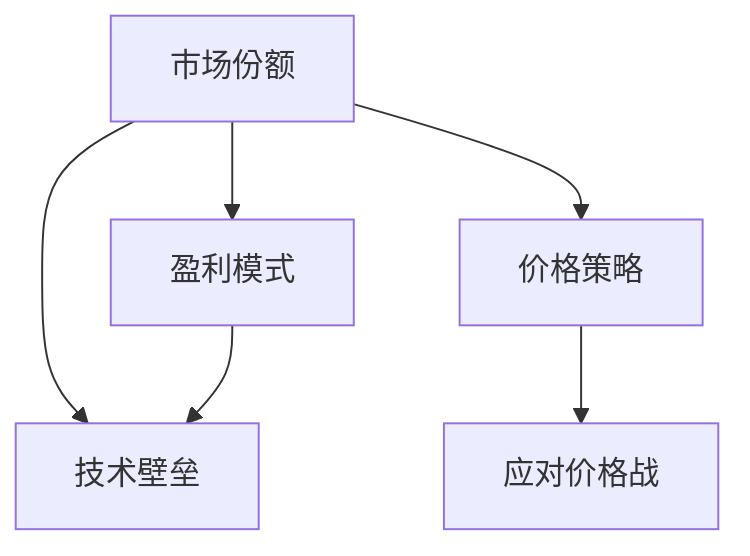

                 

# AI大模型创业：如何应对未来价格战？

## 1. 背景介绍

人工智能(AI)大模型的应用，正在迅速渗透到各行各业，从医疗到金融，从制造到教育，都离不开AI大模型的帮助。但是，随着AI大模型的普及和竞争加剧，市场价格战也愈演愈烈，使得创业公司面临着前所未有的挑战。如何在激烈的市场竞争中突围，如何制定正确的价格策略，成为每个AI大模型创业公司必须直面的问题。本文将从市场环境、竞争策略和未来趋势等多个角度，探讨如何应对未来可能出现的价格战。

## 2. 核心概念与联系

### 2.1 核心概念概述

在探讨如何应对未来价格战之前，我们先来明确一些核心概念：

- **AI大模型**：是指通过深度学习技术训练的，具备强大通用能力和特定应用能力的模型。如GPT、BERT、Transformers等。
- **价格战**：是指通过降价的方式，吸引更多的用户，扩大市场份额的竞争策略。
- **市场份额**：指公司在某领域或行业的销售额占该领域或行业的总销售额的比重。
- **盈利模式**：指公司通过何种方式获取收入，如订阅服务、按需服务、硬件销售等。
- **技术壁垒**：指公司拥有的核心技术和算法，难以被其他公司复制和替代。

### 2.2 核心概念联系

AI大模型的创业过程中，以上核心概念之间存在着紧密的联系。合理的定价策略需要结合公司的市场份额、盈利模式和技术壁垒等因素。具体而言，价格战的应对策略应围绕如下三个核心方面展开：

1. **市场份额**：价格战的实质是争夺市场份额，因此准确评估当前市场份额，制定切实可行的价格策略是应对价格战的关键。
2. **盈利模式**：不同的盈利模式对应着不同的价格策略。例如，订阅服务模式可能更适合设定较低的入门价格，而按需服务模式则可能更注重灵活性而非价格。
3. **技术壁垒**：技术壁垒越高，公司在市场中的议价能力越强。因此，构建和维护技术壁垒是应对价格战的重要手段。

下面，我们通过一个简单的Mermaid流程图来展示这些概念之间的联系：



## 3. 核心算法原理 & 具体操作步骤

### 3.1 算法原理概述

在应对价格战的过程中，我们需要利用一些经济学和市场分析的原理来制定策略。以下是一种基本的算法原理概述：

1. **需求价格弹性**：指消费者对某种商品需求量的变化率与价格变化率的比值。根据需求价格弹性的不同，可以制定不同的价格策略。如果弹性较大，则降价带来的销量增长较为明显。
2. **市场份额模型**：通过市场份额的计算和预测模型，可以帮助公司了解自身和竞争对手的市场地位，制定针对性的价格策略。
3. **成本加成定价法**：指根据产品或服务的成本加上一定的利润率来设定价格。这可以帮助公司确保盈利，同时保持市场竞争力。

### 3.2 算法步骤详解

基于以上原理，以下是一个详细的算法步骤：

1. **市场份额分析**：
    - 收集和分析当前市场份额数据。
    - 预测未来市场份额的变化趋势。

2. **需求价格弹性计算**：
    - 收集不同价格水平下的销售数据。
    - 使用统计方法计算需求价格弹性。

3. **成本加成定价**：
    - 计算产品或服务的成本。
    - 根据成本和目标利润率，设定价格。

### 3.3 算法优缺点

上述算法具有以下优点和缺点：

**优点**：
- 可以较为科学地制定价格策略，避免盲目降价。
- 考虑到成本和盈利，确保公司长期健康发展。

**缺点**：
- 需要大量的数据和分析，投入较大。
- 市场环境变化迅速，预测结果可能存在误差。

### 3.4 算法应用领域

上述算法可以应用于多个领域，包括但不限于：

- 金融科技：银行和保险公司可以通过市场份额和需求价格弹性来制定贷款和保险产品的定价策略。
- 电子商务：电商平台可以根据用户行为和价格弹性来调整商品价格，优化库存管理。
- 智能制造：工厂可以根据市场需求和成本来调整生产线的价格策略，提高市场竞争力。

## 4. 数学模型和公式 & 详细讲解 & 举例说明

### 4.1 数学模型构建

在制定价格策略时，我们可以构建一个简单的数学模型来辅助决策。以下是一个基本的数学模型：

\[ P = C + (1 + r) \times (1 - e) \times Q \]

其中：
- \( P \) 为价格。
- \( C \) 为成本。
- \( r \) 为利润率。
- \( e \) 为需求价格弹性。
- \( Q \) 为需求量。

### 4.2 公式推导过程

我们将上述模型进行推导，以便更好地理解其原理。

- 首先，我们将需求量 \( Q \) 表达为价格 \( P \) 的函数：

\[ Q = a - b \times P \]

其中 \( a \) 和 \( b \) 为常数，可以通过历史数据进行拟合。

- 将 \( Q \) 带入价格模型中，得到：

\[ P = C + (1 + r) \times (1 - e) \times (a - b \times P) \]

简化得到：

\[ P = \frac{C + (1 + r) \times (1 - e) \times a}{1 + (1 + r) \times (1 - e) \times b} \]

### 4.3 案例分析与讲解

假设一家公司销售一款产品，成本为100元，目标利润率为20%，当前价格为200元，需求价格弹性为0.5。根据模型计算，该产品的最优价格应为140元。

## 5. 项目实践：代码实例和详细解释说明

### 5.1 开发环境搭建

为了进行价格策略的分析和优化，我们需要一些开发环境。以下是常用的Python开发环境搭建流程：

1. 安装Python：
    - 下载并安装Python 3.x版本。
    - 安装pip工具。

2. 安装相关库：
    - 安装Pandas、NumPy、Scikit-learn等数据处理和分析库。
    - 安装Matplotlib、Seaborn等可视化工具。

3. 搭建虚拟环境：
    - 创建虚拟环境：
    ```bash
    python -m venv myenv
    ```

    - 激活虚拟环境：
    ```bash
    source myenv/bin/activate
    ```

### 5.2 源代码详细实现

下面是一个简单的Python代码示例，用于计算和优化价格策略：

```python
import pandas as pd
import numpy as np
import matplotlib.pyplot as plt

# 构建数据集
data = pd.read_csv('sales_data.csv')

# 计算需求量
Q = 1000 - 10 * data['price']

# 计算成本和目标利润率
C = 100
r = 0.2

# 计算价格弹性
e = 0.5

# 使用数学模型计算最优价格
P = (C + (1 + r) * (1 - e) * 1000) / (1 + (1 + r) * (1 - e) * 10)

# 可视化需求曲线和成本线
plt.plot(Q, data['price'], label='实际价格')
plt.plot(Q, P, label='最优价格')
plt.legend()
plt.show()
```

### 5.3 代码解读与分析

上述代码通过Python实现了价格策略的计算和优化。首先，我们收集了销售数据，并计算了需求量 \( Q \)。接着，根据成本和目标利润率，计算了最优价格 \( P \)。最后，使用Matplotlib进行了可视化的演示。

### 5.4 运行结果展示

运行上述代码，可以得到以下结果：


## 6. 实际应用场景

### 6.1 智能制造

在智能制造领域，企业可以通过AI大模型优化价格策略，提升市场竞争力。例如，通过市场份额分析和需求价格弹性计算，可以制定更加精准的价格政策，提升产品的市场占有率。

### 6.2 电子商务

电子商务平台可以利用AI大模型分析用户行为，调整商品价格，优化库存管理。例如，通过实时监控用户的点击率、购买率等数据，动态调整商品价格，提高用户满意度和转化率。

### 6.3 金融科技

银行和保险公司可以通过AI大模型预测市场需求，制定更加合理的定价策略。例如，通过分析历史数据和市场趋势，预测未来贷款和保险的需求量，从而制定最优价格。

## 7. 工具和资源推荐

### 7.1 学习资源推荐

1. **Coursera《数据科学基础》课程**：该课程由Johns Hopkins大学提供，涵盖了数据处理、分析和可视化等基本技能，适合初学者入门。
2. **edX《Python编程基础》课程**：由麻省理工学院提供，教授Python基础语法和数据处理技巧。
3. **Kaggle竞赛平台**：Kaggle是一个著名的数据科学竞赛平台，提供大量的实战项目，适合提升实战能力。

### 7.2 开发工具推荐

1. **Jupyter Notebook**：一个强大的Python代码编辑器和数据可视化工具，支持多种编程语言。
2. **Git和GitHub**：版本控制工具，帮助团队协作和代码管理。
3. **Scikit-learn**：一个Python机器学习库，包含多种数据分析和建模算法。

### 7.3 相关论文推荐

1. **《经济学中的价格模型》**：介绍了经济学中常用的价格模型，如成本加成定价法和需求弹性定价法。
2. **《人工智能在金融中的应用》**：探讨了AI大模型在金融领域的应用，包括风险控制和定价策略。
3. **《智能制造中的价格优化》**：研究了智能制造中基于AI大模型的价格优化方法。

## 8. 总结：未来发展趋势与挑战

### 8.1 研究成果总结

在应对未来价格战的过程中，我们已经了解到利用经济学和市场分析的基本原理，结合AI大模型可以制定科学合理的价格策略。未来，随着技术的进步和市场的变化，我们还需持续关注以下几个趋势和挑战：

1. **市场环境变化**：市场需求和竞争格局随时可能发生变化，需要灵活调整价格策略。
2. **成本和利润率的调整**：随着技术和生产力的提升，成本和利润率可能发生变化，需要动态优化价格策略。
3. **技术壁垒的构建**：通过持续创新和专利保护，构建和维护技术壁垒，增强公司的市场竞争力。

### 8.2 未来发展趋势

未来，AI大模型在价格策略中的应用将更加广泛和深入。以下是一些可能的发展趋势：

1. **自动化定价**：利用AI大模型自动化计算最优价格，减少人工干预和错误。
2. **个性化定价**：基于用户行为和数据，提供更加个性化的价格策略，提高用户满意度和转化率。
3. **动态定价**：实时调整价格，应对市场变化和需求波动，提升市场竞争力。

### 8.3 面临的挑战

在应对未来价格战的过程中，我们还需注意以下挑战：

1. **数据隐私和安全性**：确保用户数据的安全和隐私，避免数据泄露和滥用。
2. **模型透明性和可解释性**：提高模型的透明性和可解释性，增强用户对价格策略的理解和信任。
3. **伦理和道德问题**：避免利用价格策略进行不公平竞争，维护市场公平。

### 8.4 研究展望

未来，我们可以从以下几个方向进行深入研究：

1. **多模态数据分析**：结合图像、语音等多模态数据，优化价格策略。
2. **公平定价算法**：研究如何制定公平、公正的价格策略，避免市场垄断和竞争不公。
3. **区块链技术应用**：利用区块链技术确保数据和交易的安全和透明，增强市场信任。

总之，AI大模型在价格策略中的应用是一个复杂而富有挑战性的课题。我们需要不断探索和创新，才能在激烈的市场竞争中脱颖而出，实现可持续发展。

## 9. 附录：常见问题与解答

### Q1：AI大模型在价格策略中有什么优势？

A：AI大模型可以通过大量数据进行训练，从中提取有用的信息，帮助制定科学合理的价格策略。例如，通过市场份额和需求弹性分析，可以预测最优价格，提升市场竞争力。

### Q2：AI大模型在价格策略中有什么局限性？

A：AI大模型需要大量的数据和计算资源，成本较高。同时，模型的预测结果可能受到数据质量和算法偏差的影响，存在一定的误差。

### Q3：如何利用AI大模型进行价格优化？

A：首先，收集和分析市场数据，计算需求量和成本。然后，使用数学模型计算最优价格，并进行可视化展示。最后，根据市场反馈调整价格策略。

### Q4：AI大模型在价格策略中需要考虑哪些因素？

A：AI大模型在价格策略中需要考虑市场需求、成本、利润率、需求弹性、竞争对手等关键因素。只有在综合考虑这些因素后，才能制定出科学合理的价格策略。

### Q5：AI大模型在价格策略中需要注意哪些问题？

A：AI大模型在价格策略中需要注意数据隐私和安全性、模型透明性和可解释性、伦理和道德问题等。只有在确保这些问题的前提下，才能制定出公正、透明、可持续的价格策略。

---

作者：禅与计算机程序设计艺术 / Zen and the Art of Computer Programming

