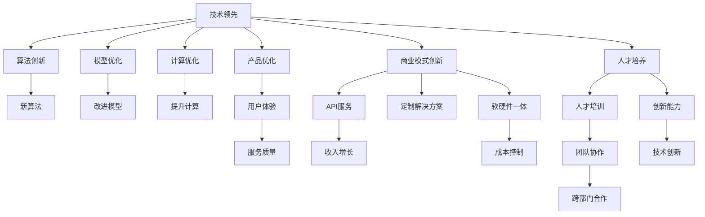

                 

# AI大模型创业：如何应对未来竞争对手？

在AI大模型领域，竞争日益激烈。企业要想在这样的环境中立于不败之地，不仅需要拥有领先的技术和产品，还需要深刻理解行业趋势和市场需求，制定合理的竞争策略。本文将从多个角度探讨如何应对未来竞争对手，包括技术领先、产品优化、商业模式创新和人才培养等。

## 1. 背景介绍

### 1.1 市场现状

当前，AI大模型市场正处于快速发展的初期阶段。虽然只有少数几家巨头企业在这一领域占据主导地位，但随着技术的普及和应用场景的拓展，越来越多的小企业和创业公司正在加入这场竞争。市场尚未形成稳定的格局，企业的竞争策略和市场定位将成为决定其未来发展的关键因素。

### 1.2 竞争挑战

AI大模型领域的竞争主要体现在以下几个方面：
- **技术领先**：模型性能、计算效率、数据处理能力等方面的差距。
- **产品优化**：用户体验、服务质量、应用范围等方面的不足。
- **商业模式**：收入模式、市场份额、客户关系等方面的差异。
- **人才培养**：人才储备、团队协作、创新能力等方面的挑战。

### 1.3 本文重点

本文旨在探讨如何通过技术创新、产品优化、商业模式创新和人才培养，应对AI大模型领域的未来竞争对手，实现企业的可持续发展。

## 2. 核心概念与联系

### 2.1 核心概念概述

为更好地理解如何在AI大模型领域应对竞争，我们需要先明确几个核心概念及其联系：

- **技术领先**：指在算法、模型架构、计算效率等方面保持竞争优势。
- **产品优化**：通过用户反馈、市场调研等手段，持续改进产品的功能、性能和用户体验。
- **商业模式创新**：探索多样化的收入模式，如API服务、定制解决方案、软硬件一体等。
- **人才培养**：构建完善的人才培训体系，吸引和培养顶尖技术人才。

这些概念之间相互关联，共同构成了企业在AI大模型领域的核心竞争力。

### 2.2 核心概念原理和架构的 Mermaid 流程图



这个流程图展示了技术领先、产品优化、商业模式创新和人才培养之间的联系。技术领先是基础，产品优化和商业模式创新依赖于技术优势，而人才培养则是持续创新的关键。

## 3. 核心算法原理 & 具体操作步骤

### 3.1 算法原理概述

在AI大模型领域，技术领先的核心在于算法和模型架构的创新。下面以深度学习中的Transformer模型为例，介绍其核心算法原理。

Transformer模型通过自注意力机制，实现了序列数据的并行计算，提高了模型的训练和推理效率。其主要原理包括以下几个方面：

- **自注意力机制**：通过多头自注意力机制，模型可以捕捉到输入序列中不同位置之间的关系，从而更好地理解上下文信息。
- **位置编码**：通过位置编码，模型能够区分输入序列中不同位置的信息，避免位置偏置。
- **残差连接和层归一化**：通过残差连接和层归一化，模型可以更好地收敛和优化。

### 3.2 算法步骤详解

以下是Transformer模型的核心算法步骤：

1. **输入序列编码**：将输入序列转换为模型可以处理的向量形式。
2. **多头自注意力计算**：计算多头自注意力权重，获取不同位置的信息。
3. **残差连接和层归一化**：通过残差连接和层归一化，保证信息流动的稳定性和模型的收敛性。
4. **前向传播和后向传播**：通过前向传播和后向传播，更新模型参数。

### 3.3 算法优缺点

Transformer模型的优点包括：
- **高效并行计算**：自注意力机制使得模型能够高效地处理长序列数据。
- **更好的上下文理解**：通过多头自注意力机制，模型能够更好地捕捉到输入序列中的上下文信息。

缺点包括：
- **计算资源消耗大**：Transformer模型需要大量的计算资源，特别是在大规模模型训练时。
- **参数量较大**：由于模型复杂度较高，导致参数量较大，增加了模型训练的难度。

### 3.4 算法应用领域

Transformer模型在自然语言处理、语音识别、图像识别等领域得到了广泛应用，特别是在机器翻译、文本分类、情感分析等任务中表现优异。

## 4. 数学模型和公式 & 详细讲解 & 举例说明

### 4.1 数学模型构建

Transformer模型的数学模型可以表示为：

$$
y = M(x; \theta)
$$

其中，$x$ 为输入序列，$y$ 为输出序列，$M$ 为Transformer模型，$\theta$ 为模型参数。

### 4.2 公式推导过程

Transformer模型的核心公式包括自注意力机制和残差连接。以自注意力机制为例，其推导过程如下：

1. **计算查询向量**：
   $$
   Q = xW_Q^T
   $$

2. **计算键值向量**：
   $$
   K = xW_K^T, V = xW_V^T
   $$

3. **计算自注意力权重**：
   $$
   \alpha = \frac{e^{QK^T}}{\sqrt{d_k}}
   $$

4. **计算自注意力输出**：
   $$
   z = \alpha V
   $$

其中，$d_k$ 为键向量的维度。

### 4.3 案例分析与讲解

以机器翻译为例，Transformer模型通过多头自注意力机制，能够将源语言序列映射到目标语言序列，从而实现高效准确的翻译。

## 5. 项目实践：代码实例和详细解释说明

### 5.1 开发环境搭建

在进行项目实践前，需要准备好开发环境。以下是使用Python进行TensorFlow开发的环境配置流程：

1. 安装Anaconda：从官网下载并安装Anaconda，用于创建独立的Python环境。
2. 创建并激活虚拟环境：
```bash
conda create -n tf-env python=3.8 
conda activate tf-env
```

3. 安装TensorFlow：根据CUDA版本，从官网获取对应的安装命令。例如：
```bash
conda install tensorflow==2.7.0 -c pytorch -c conda-forge
```

4. 安装各类工具包：
```bash
pip install numpy pandas scikit-learn matplotlib tqdm jupyter notebook ipython
```

完成上述步骤后，即可在`tf-env`环境中开始项目实践。

### 5.2 源代码详细实现

以下是一个使用TensorFlow实现Transformer模型的Python代码示例：

```python
import tensorflow as tf
from tensorflow.keras.layers import Input, Dense, Embedding, LayerNormalization, MultiHeadAttention

class Transformer(tf.keras.Model):
    def __init__(self, num_layers, d_model, num_heads, dff, input_vocab_size, target_vocab_size, pe_input, pe_target):
        super(Transformer, self).__init__()
        self.encoder = tf.keras.Sequential([
            Embedding(input_vocab_size, d_model),
            LayerNormalization(epsilon=1e-6),
            MultiHeadAttention(num_heads=num_heads, d_model=d_model, k_v_bias=False),
            LayerNormalization(epsilon=1e-6),
            Dense(dff, activation='relu'),
            LayerNormalization(epsilon=1e-6),
            Dense(target_vocab_size)
        ])
        self.decoder = tf.keras.Sequential([
            Embedding(target_vocab_size, d_model),
            LayerNormalization(epsilon=1e-6),
            MultiHeadAttention(num_heads=num_heads, d_model=d_model, k_v_bias=False),
            LayerNormalization(epsilon=1e-6),
            Dense(dff, activation='relu'),
            LayerNormalization(epsilon=1e-6),
            Dense(target_vocab_size)
        ])
        self.final_layer = Dense(target_vocab_size)

    def call(self, x, y, training=False):
        x = self.encoder(x)
        y = self.decoder(y)
        x = self.final_layer(x + y)
        return x

# 构建模型
model = Transformer(num_layers=2, d_model=128, num_heads=8, dff=512, input_vocab_size=10000, target_vocab_size=10000, pe_input=2000, pe_target=2000)

# 编译模型
model.compile(optimizer='adam', loss='categorical_crossentropy', metrics=['accuracy'])

# 训练模型
model.fit(x_train, y_train, epochs=10, validation_data=(x_val, y_val))
```

### 5.3 代码解读与分析

让我们再详细解读一下关键代码的实现细节：

**Transformer类**：
- `__init__`方法：初始化编码器和解码器，并定义Transformer模型的结构。
- `call`方法：定义模型的前向传播过程，包括编码、解码和输出。

**模型编译和训练**：
- 在模型实例化后，使用`compile`方法定义损失函数、优化器和评估指标。
- 使用`fit`方法进行模型训练，设置训练轮数和验证数据。

### 5.4 运行结果展示

```python
import matplotlib.pyplot as plt

# 训练过程可视化
plt.plot(history.history['accuracy'], label='train')
plt.plot(history.history['val_accuracy'], label='val')
plt.xlabel('Epoch')
plt.ylabel('Accuracy')
plt.legend()
plt.show()

plt.plot(history.history['loss'], label='train')
plt.plot(history.history['val_loss'], label='val')
plt.xlabel('Epoch')
plt.ylabel('Loss')
plt.legend()
plt.show()
```

以上就是使用TensorFlow实现Transformer模型的完整代码实现。可以看到，借助TensorFlow的高级API，实现起来相对简洁高效。

## 6. 实际应用场景

### 6.1 自然语言处理

Transformer模型在自然语言处理领域得到了广泛应用。以机器翻译为例，Transformer模型通过多头自注意力机制，能够捕捉输入序列中不同位置之间的关系，从而实现高效的翻译。

### 6.2 语音识别

Transformer模型在语音识别领域也有应用，通过声学模型和语言模型联合训练，实现高效准确的语音转文本。

### 6.3 图像识别

Transformer模型在图像识别领域同样表现优异，通过多尺度图像建模，能够实现高效准确的图像分类和目标检测。

## 7. 工具和资源推荐

### 7.1 学习资源推荐

为了帮助开发者系统掌握Transformer模型的理论基础和实践技巧，这里推荐一些优质的学习资源：

1. 《深度学习与强化学习笔记》系列博文：由大模型技术专家撰写，深入浅出地介绍了深度学习、强化学习的原理和应用。
2. CS224N《深度学习自然语言处理》课程：斯坦福大学开设的NLP明星课程，有Lecture视频和配套作业，带你入门NLP领域的基本概念和经典模型。
3. 《自然语言处理与深度学习》书籍：由斯坦福大学教授所写，全面介绍了NLP领域的深度学习算法和应用。
4. TensorFlow官方文档：TensorFlow的官方文档，提供了丰富的API参考和样例代码，是学习和实践TensorFlow的必备资料。
5. PyTorch官方文档：PyTorch的官方文档，提供了丰富的API参考和样例代码，适合学习和实践TensorFlow和PyTorch。

通过对这些资源的学习实践，相信你一定能够快速掌握Transformer模型的精髓，并用于解决实际的NLP问题。

### 7.2 开发工具推荐

高效的开发离不开优秀的工具支持。以下是几款用于TensorFlow开发常用的工具：

1. Jupyter Notebook：免费的交互式编程环境，支持Python、TensorFlow等多种语言。
2. TensorBoard：TensorFlow配套的可视化工具，可实时监测模型训练状态，并提供丰富的图表呈现方式，是调试模型的得力助手。
3. Keras：高级神经网络API，封装了TensorFlow和Theano等底层框架，简化了模型定义和训练过程。
4. TensorFlow Lite：轻量级TensorFlow模型，适用于移动设备和嵌入式系统。
5. TensorFlow Extended (TFX)：开源机器学习平台，支持模型开发、训练、部署等全流程管理。

合理利用这些工具，可以显著提升TensorFlow模型的开发效率，加快创新迭代的步伐。

### 7.3 相关论文推荐

Transformer模型代表了深度学习领域的最新进展，以下是几篇奠基性的相关论文，推荐阅读：

1. Attention Is All You Need：提出Transformer结构，开启了NLP领域的预训练大模型时代。
2. Transformer-XL: Attentive Language Models Beyond a Fixed-Length Context：提出Transformer-XL模型，解决了长序列建模的问题。
3. A Survey of Deep Learning Methods for Conversational Agents：综述了对话系统中深度学习方法的最新进展，介绍了Transformer模型在对话中的应用。
4. Deep Learning for Natural Language Processing：由斯坦福大学教授所写，全面介绍了NLP领域的深度学习算法和应用。
5. Reformer: The Efficient Transformer：提出Reformer模型，在保持Transformer性能的同时，大幅减少了计算资源消耗。

这些论文代表了大模型领域的最新进展，通过学习这些前沿成果，可以帮助研究者把握学科前进方向，激发更多的创新灵感。

## 8. 总结：未来发展趋势与挑战

### 8.1 总结

本文对AI大模型领域的核心概念和相关算法进行了全面系统的介绍，并结合具体项目实践，展示了Transformer模型的强大性能。通过本文的系统梳理，可以看到，AI大模型在自然语言处理、语音识别、图像识别等领域具有广阔的应用前景，已成为推动人工智能技术进步的重要力量。

### 8.2 未来发展趋势

展望未来，AI大模型领域将呈现以下几个发展趋势：

1. **模型规模继续增大**：随着算力成本的下降和数据规模的扩张，预训练语言模型的参数量还将持续增长。超大模型蕴含的丰富语言知识，有望支撑更加复杂多变的下游任务微调。
2. **模型性能不断提升**：通过算法创新和模型优化，AI大模型的性能将不断提升，实现更高效、更准确的计算。
3. **跨领域应用拓展**：AI大模型在多个领域的应用将不断拓展，如医疗、金融、教育等，带来更广泛的商业价值。
4. **联邦学习和边缘计算**：通过联邦学习、边缘计算等技术，实现模型在分布式环境下的高效训练和推理。
5. **个性化推荐和智能交互**：基于AI大模型的推荐系统和智能交互系统将不断优化，提供更加个性化、智能化的服务。

以上趋势凸显了AI大模型领域的广阔前景。这些方向的探索发展，必将进一步提升AI大模型的性能和应用范围，为人工智能技术的发展带来新的突破。

### 8.3 面临的挑战

尽管AI大模型领域取得了瞩目成就，但在迈向更加智能化、普适化应用的过程中，仍面临诸多挑战：

1. **计算资源瓶颈**：模型规模的增大和复杂度的提升，对计算资源提出了更高的要求，需要采用分布式计算、混合精度训练等技术进行优化。
2. **数据获取和标注成本**：大模型训练和微调需要大量高质量的标注数据，获取和标注成本较高，需要探索无监督和半监督学习等方法。
3. **模型可解释性和鲁棒性**：AI大模型的决策过程难以解释，面对噪声和对抗样本等鲁棒性问题，需要进一步提高模型的可解释性和鲁棒性。
4. **知识产权和伦理问题**：模型的训练和应用过程中涉及大量知识产权和伦理问题，需要制定合理的政策和规范。

### 8.4 研究展望

面对AI大模型领域面临的挑战，未来的研究需要在以下几个方面寻求新的突破：

1. **混合精度训练和模型压缩**：通过混合精度训练和模型压缩，实现高效能低成本的模型训练和推理。
2. **自监督学习和半监督学习**：探索无监督和半监督学习，降低对标注数据的依赖，实现更加灵活高效的模型训练。
3. **跨领域知识融合**：将跨领域知识与AI大模型进行融合，实现更全面、准确的模型训练。
4. **算法创新和模型优化**：通过算法创新和模型优化，提高模型的性能和效率，实现更加智能化的应用。
5. **伦理和安全保障**：制定合理的政策和规范，保障知识产权和伦理安全，确保模型的应用符合人类价值观和伦理道德。

这些研究方向的探索，必将引领AI大模型领域迈向更高的台阶，为构建安全、可靠、可解释、可控的智能系统铺平道路。面向未来，AI大模型领域的持续创新和探索，必将带来更多的技术突破和应用变革。

## 9. 附录：常见问题与解答

**Q1：AI大模型在实际应用中存在哪些挑战？**

A: AI大模型在实际应用中存在以下挑战：
1. 计算资源消耗大：模型规模的增大和复杂度的提升，对计算资源提出了更高的要求。
2. 数据获取和标注成本高：大模型训练和微调需要大量高质量的标注数据，获取和标注成本较高。
3. 模型可解释性差：AI大模型的决策过程难以解释，面对噪声和对抗样本等鲁棒性问题，需要进一步提高模型的可解释性和鲁棒性。
4. 知识产权和伦理问题：模型的训练和应用过程中涉及大量知识产权和伦理问题，需要制定合理的政策和规范。

**Q2：如何提高AI大模型的可解释性和鲁棒性？**

A: 提高AI大模型的可解释性和鲁棒性，可以采取以下措施：
1. 引入可解释性技术：如LIME、SHAP等，通过局部解释技术，揭示模型的决策机制。
2. 对抗样本训练：通过引入对抗样本，提高模型的鲁棒性。
3. 知识图谱融合：将知识图谱与AI大模型进行融合，提升模型的常识推理能力。
4. 多模态融合：将视觉、语音、文本等多模态信息进行融合，提高模型的综合感知能力。

**Q3：AI大模型在落地应用时需要注意哪些问题？**

A: AI大模型在落地应用时需要注意以下问题：
1. 模型裁剪和量化：去除不必要的层和参数，减小模型尺寸，加快推理速度。
2. 模型部署和优化：选择合适的部署平台，优化模型结构和算法，实现高效计算。
3. 模型更新和维护：及时更新模型和数据，保证模型的实时性和准确性。
4. 模型监控和调优：实时监控模型的性能和状态，根据反馈进行调优和优化。

**Q4：AI大模型在创业过程中需要注意哪些问题？**

A: AI大模型在创业过程中需要注意以下问题：
1. 技术选型和研发投入：选择合适的技术平台和工具，确保技术领先和稳定。
2. 商业模式和用户需求：明确商业模式和用户需求，制定合理的定价和营销策略。
3. 人才招聘和培养：吸引和培养顶尖技术人才，建立完善的人才培训体系。
4. 数据获取和标注：获取和标注高质量的数据，确保模型训练的有效性和可靠性。

**Q5：AI大模型在落地应用中如何平衡成本和性能？**

A: 在落地应用中，AI大模型需要平衡成本和性能，可以采取以下措施：
1. 模型裁剪和量化：去除不必要的层和参数，减小模型尺寸，加快推理速度。
2. 模型压缩和优化：采用模型压缩和优化技术，提高模型的计算效率和推理速度。
3. 混合精度训练：采用混合精度训练，提高模型训练和推理的效率。
4. 分布式计算：采用分布式计算，实现高效的模型训练和推理。

这些措施将帮助企业在落地应用中，实现成本和性能的平衡，提升AI大模型的应用效果。

---

作者：禅与计算机程序设计艺术 / Zen and the Art of Computer Programming

