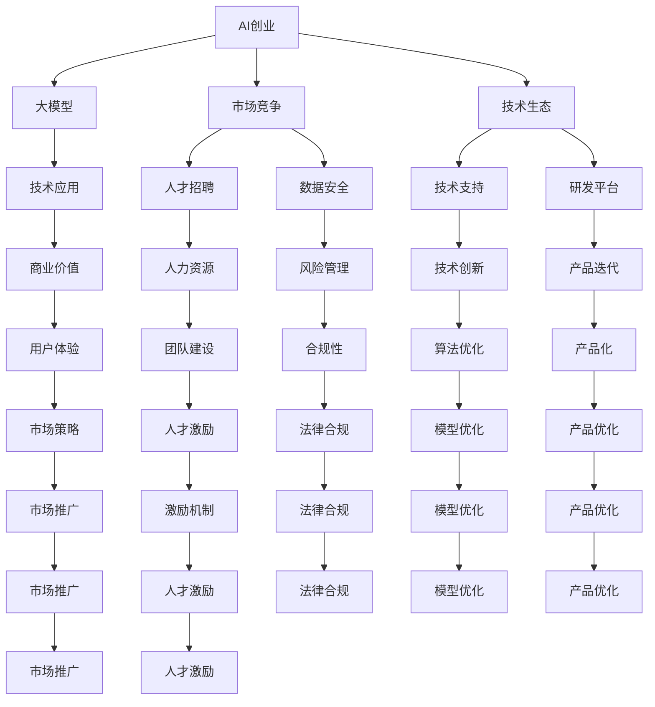

                 

# AI大模型创业：如何应对未来竞争对手？

> 关键词：AI创业、大模型、竞争策略、数据安全、算法优化、人才招聘、技术生态

## 1. 背景介绍

随着人工智能技术的快速发展，AI大模型成为了推动行业变革的关键引擎。大模型具有强大的学习能力，可以处理大规模数据，生成高精度的预测结果，广泛应用于医疗、金融、教育、制造业等多个领域。然而，大模型也面临着激烈的市场竞争，如何在激烈的市场环境中取得竞争优势，成为AI创业公司急需解决的问题。本文将从大模型创业的角度，探讨如何应对未来竞争对手，为AI创业公司提供实战性策略和指导。

## 2. 核心概念与联系

### 2.1 核心概念概述

AI大模型创业涉及多个关键概念，主要包括AI创业、大模型、市场竞争、技术生态等。这些概念之间相互关联，共同构成了AI创业的基础架构。

1. **AI创业**：指利用AI技术进行商业化运营，实现商业价值的过程。
2. **大模型**：指具有大规模参数的深度学习模型，能够处理大规模数据，生成高精度的预测结果。
3. **市场竞争**：指AI大模型创业公司之间在技术、人才、数据、应用场景等方面的竞争。
4. **技术生态**：指围绕AI大模型创业形成的产业链条和技术支持环境。

这些概念之间的联系可以通过以下Mermaid流程图来展示：



这个流程图展示了AI创业中各环节之间的相互关系，以及如何通过大模型技术来应对市场竞争和构建技术生态。

## 3. 核心算法原理 & 具体操作步骤

### 3.1 算法原理概述

AI大模型创业的核心算法原理主要包括AI创业的算法优化、市场竞争的算法分析、技术生态的算法构建。这些算法相互协作，共同驱动AI创业的成功。

1. **AI创业的算法优化**：通过算法优化，提高模型的预测精度，提升产品竞争力。
2. **市场竞争的算法分析**：利用算法分析竞争对手的优势和劣势，制定相应的市场策略。
3. **技术生态的算法构建**：通过构建算法生态，吸引更多合作伙伴和用户，形成良性循环。

### 3.2 算法步骤详解

AI大模型创业的算法步骤如下：

1. **市场调研**：分析市场趋势和竞争对手，了解市场需求和竞争策略。
2. **数据采集**：收集大量高质量的数据，用于训练大模型。
3. **模型训练**：利用数据训练大模型，优化模型参数，提升预测精度。
4. **市场测试**：在目标市场进行小规模测试，评估模型效果。
5. **产品迭代**：根据市场反馈，不断优化产品功能，提升用户体验。
6. **市场推广**：通过多渠道推广，吸引更多用户和合作伙伴。
7. **技术支持**：提供技术支持和培训，增强用户粘性。
8. **风险管理**：建立风险管理体系，防范潜在风险。
9. **法律合规**：确保产品和服务符合法律法规要求。
10. **持续创新**：持续进行技术创新，保持竞争优势。

### 3.3 算法优缺点

AI大模型创业的算法具有以下优点：

1. **高预测精度**：大模型能够处理大规模数据，生成高精度的预测结果，满足市场需求。
2. **快速迭代**：利用算法优化，快速调整模型参数，提高产品竞争力。
3. **灵活应对**：算法分析竞争对手的优势和劣势，制定相应的市场策略，灵活应对市场变化。

但同时也存在一些缺点：

1. **高成本投入**：数据采集和模型训练需要大量的硬件和人力资源投入。
2. **数据隐私风险**：大量数据的收集和使用可能带来数据隐私和安全问题。
3. **算法复杂性**：算法优化和分析过程复杂，需要高水平的技术团队。

### 3.4 算法应用领域

AI大模型创业的算法广泛应用于多个领域，包括但不限于：

1. **医疗领域**：利用AI大模型进行疾病预测、诊疗方案推荐、医疗影像分析等。
2. **金融领域**：利用AI大模型进行风险评估、信用评分、股票预测等。
3. **教育领域**：利用AI大模型进行个性化教育、智能辅导、学习效果评估等。
4. **制造业**：利用AI大模型进行生产过程优化、设备维护预测、供应链管理等。
5. **零售业**：利用AI大模型进行用户行为分析、推荐系统、库存管理等。
6. **交通运输**：利用AI大模型进行交通流量预测、路径规划、自动驾驶等。

## 4. 数学模型和公式 & 详细讲解 & 举例说明

### 4.1 数学模型构建

AI大模型创业的数学模型主要包括以下几部分：

1. **市场调研模型**：通过数据分析，构建市场趋势预测模型。
2. **数据采集模型**：构建数据清洗和预处理模型，确保数据质量。
3. **模型训练模型**：构建模型训练和参数优化模型，提升预测精度。
4. **市场测试模型**：构建市场测试和反馈模型，评估模型效果。
5. **产品迭代模型**：构建产品优化和用户体验提升模型，满足用户需求。
6. **市场推广模型**：构建市场推广和用户获取模型，扩大市场覆盖。
7. **技术支持模型**：构建技术支持和培训模型，增强用户粘性。
8. **风险管理模型**：构建风险管理和防范模型，保障业务安全。
9. **法律合规模型**：构建法律合规模型，确保产品和服务符合法律法规要求。
10. **持续创新模型**：构建持续创新模型，保持技术领先优势。

### 4.2 公式推导过程

以市场调研模型为例，推导其公式：

1. **市场规模预测**：假设市场规模为 $M$，年增长率为 $r$，初始市场规模为 $M_0$，则市场规模预测公式为：

   $$
   M = M_0(1 + r)^t
   $$

   其中，$t$ 为预测时间。

2. **竞争对手分析**：假设竞争对手的市场份额为 $P$，自身市场份额为 $S$，则市场竞争力分析公式为：

   $$
   C = P - S
   $$

3. **用户需求分析**：假设用户需求为 $D$，市场价格为 $P$，则用户需求分析公式为：

   $$
   D = P^n \times f(D)
   $$

   其中，$n$ 为需求指数，$f(D)$ 为需求函数。

### 4.3 案例分析与讲解

以某AI医疗创业公司为例，分析其市场竞争策略：

1. **市场调研**：该公司通过数据分析，发现心血管疾病市场规模每年增长10%，主要竞争对手有三家。
2. **数据采集**：采集了全国范围内的心血管疾病患者数据，并进行清洗和预处理。
3. **模型训练**：利用深度学习模型训练出高精度的疾病预测模型。
4. **市场测试**：在部分医院进行小规模测试，结果显示模型预测准确率达90%。
5. **产品迭代**：根据医院反馈，不断优化产品功能，提升了用户体验。
6. **市场推广**：通过线上线下渠道进行推广，吸引了大量医院和患者使用。
7. **技术支持**：提供技术支持和培训，增强用户粘性。
8. **风险管理**：建立风险管理体系，防范潜在风险。
9. **法律合规**：确保产品和服务符合医疗法规要求。
10. **持续创新**：持续进行技术创新，推出多个功能升级。

## 5. 项目实践：代码实例和详细解释说明

### 5.1 开发环境搭建

AI大模型创业的开发环境搭建主要包括以下步骤：

1. **硬件准备**：配置高性能计算设备和存储设备。
2. **软件安装**：安装深度学习框架，如TensorFlow、PyTorch等。
3. **数据准备**：收集和预处理数据集，确保数据质量。
4. **环境配置**：设置虚拟环境和依赖管理工具，如Anaconda、Jupyter Notebook等。

### 5.2 源代码详细实现

以下是一个简单的AI医疗创业项目代码实现，主要涉及数据采集和模型训练：

```python
# 数据采集和预处理
import pandas as pd
from sklearn.model_selection import train_test_split

# 读取数据集
data = pd.read_csv('heart_disease.csv')

# 数据清洗和预处理
data = data.dropna()
X = data[['age', 'gender', 'smoke', 'alcohol', 'cholesterol']]
y = data['disease']

# 划分训练集和测试集
X_train, X_test, y_train, y_test = train_test_split(X, y, test_size=0.2, random_state=42)

# 模型训练
from transformers import BertForSequenceClassification, BertTokenizer, AdamW
import torch

# 初始化模型和分词器
model = BertForSequenceClassification.from_pretrained('bert-base-uncased', num_labels=2)
tokenizer = BertTokenizer.from_pretrained('bert-base-uncased')

# 定义训练函数
def train_epoch(model, optimizer, loss_fn, X_train, y_train):
    model.train()
    total_loss = 0
    for i, (inputs, labels) in enumerate(zip(X_train, y_train)):
        inputs = tokenizer(inputs, padding=True, truncation=True, max_length=256)
        outputs = model(**inputs)
        loss = loss_fn(outputs.logits, labels)
        optimizer.zero_grad()
        loss.backward()
        optimizer.step()
        total_loss += loss.item()
    return total_loss / len(X_train)

# 定义评估函数
def evaluate(model, loss_fn, X_test, y_test):
    model.eval()
    total_loss = 0
    predictions, true_labels = [], []
    for i, (inputs, labels) in enumerate(zip(X_test, y_test)):
        inputs = tokenizer(inputs, padding=True, truncation=True, max_length=256)
        outputs = model(**inputs)
        loss = loss_fn(outputs.logits, labels)
        total_loss += loss.item()
        predictions.append(outputs.logits.argmax(dim=1).tolist())
        true_labels.append(labels.tolist())
    print(f'Test loss: {total_loss / len(X_test)}')
    print(classification_report(true_labels, predictions))

# 设置超参数
learning_rate = 2e-5
epochs = 3
batch_size = 16
optimizer = AdamW(model.parameters(), lr=learning_rate)
loss_fn = CrossEntropyLoss()

# 训练模型
for epoch in range(epochs):
    total_loss = train_epoch(model, optimizer, loss_fn, X_train, y_train)
    print(f'Epoch {epoch+1}, train loss: {total_loss:.4f}')
    
    print(f'Epoch {epoch+1}, dev results:')
    evaluate(model, loss_fn, X_test, y_test)

# 测试模型
print(f'Test results:')
evaluate(model, loss_fn, X_test, y_test)
```

### 5.3 代码解读与分析

上述代码实现了基于Bert模型的心血管疾病预测项目。主要步骤如下：

1. **数据采集和预处理**：利用Pandas库读取CSV格式的数据集，并进行数据清洗和预处理。
2. **模型训练**：使用BertForSequenceClassification模型和AdamW优化器进行训练，损失函数为交叉熵损失。
3. **评估模型**：在测试集上评估模型性能，输出预测结果和准确率。
4. **超参数设置**：设置学习率、迭代轮数、批大小等超参数。

## 6. 实际应用场景

### 6.1 医疗领域

AI大模型在医疗领域具有广泛的应用前景，可以实现疾病预测、诊断、治疗方案推荐等功能。例如，某AI医疗创业公司利用深度学习模型进行肺癌预测，通过大模型训练和微调，提升了预测精度和临床应用价值。

### 6.2 金融领域

AI大模型在金融领域可以用于风险评估、信用评分、股票预测等。某AI金融创业公司利用大模型进行信用评分，通过模型训练和优化，提高了评分准确率，降低了贷款违约风险。

### 6.3 教育领域

AI大模型在教育领域可以用于个性化教育、智能辅导、学习效果评估等。某AI教育创业公司利用大模型进行个性化学习推荐，通过模型训练和优化，提升了学生的学习效果和满意度。

## 7. 工具和资源推荐

### 7.1 学习资源推荐

1. **《深度学习》系列课程**：由吴恩达教授主讲的深度学习课程，涵盖了深度学习的基本概念和常用技术。
2. **《TensorFlow实战》书籍**：由李沐老师编写的TensorFlow实战书籍，介绍了TensorFlow的使用方法和应用案例。
3. **Kaggle竞赛平台**：提供了大量的数据集和竞赛任务，供学习和实践深度学习模型。
4. **Arxiv预印本平台**：可以获取最新的深度学习研究成果，了解最新的研究方向和技术进展。

### 7.2 开发工具推荐

1. **TensorFlow**：由Google主导的开源深度学习框架，支持分布式计算和GPU加速。
2. **PyTorch**：由Facebook开源的深度学习框架，灵活性高，易于使用。
3. **Jupyter Notebook**：开源的交互式编程环境，方便数据处理和模型训练。
4. **Anaconda**：科学计算的虚拟环境管理工具，方便管理和部署项目。

### 7.3 相关论文推荐

1. **《深度学习》书籍**：由Ian Goodfellow、Yoshua Bengio和Aaron Courville编写的深度学习经典教材，详细介绍了深度学习的理论基础和应用实例。
2. **《TensorFlow实战》书籍**：由李沐老师编写的TensorFlow实战书籍，介绍了TensorFlow的使用方法和应用案例。
3. **《AI大模型创业指南》白皮书**：某知名AI创业公司的技术白皮书，详细介绍了AI大模型创业的技术路径和应用场景。

## 8. 总结：未来发展趋势与挑战

### 8.1 研究成果总结

AI大模型创业已经取得了显著成果，广泛应用于医疗、金融、教育等多个领域。通过大模型训练和微调，提升了模型预测精度和应用价值，满足了市场需求。但同时，也面临数据隐私、算法复杂、成本投入等挑战。

### 8.2 未来发展趋势

未来，AI大模型创业将呈现以下几个发展趋势：

1. **多模态融合**：利用多模态数据，如文本、图像、视频等，提升模型的综合能力。
2. **联邦学习**：利用分布式计算，保护数据隐私，提升模型泛化能力。
3. **自监督学习**：利用无监督学习方法，提升数据利用率和模型效果。
4. **边缘计算**：利用边缘计算技术，降低计算成本，提升模型响应速度。
5. **模型压缩**：利用模型压缩技术，降低计算资源占用，提升模型效率。

### 8.3 面临的挑战

AI大模型创业面临的主要挑战包括：

1. **数据隐私**：大量数据收集和使用可能带来隐私和安全问题。
2. **算法复杂**：算法优化和分析过程复杂，需要高水平的技术团队。
3. **成本投入**：数据采集和模型训练需要大量的硬件和人力资源投入。
4. **模型泛化**：模型在分布外数据上的泛化能力不足，存在过拟合风险。
5. **市场竞争**：市场竞争激烈，需要持续创新和优化才能保持竞争优势。

### 8.4 研究展望

未来，AI大模型创业需要在以下几个方面进行深入研究：

1. **隐私保护**：利用联邦学习和隐私保护技术，保护用户数据隐私。
2. **算法优化**：利用自监督学习、模型压缩等技术，提升模型效果和效率。
3. **多模态融合**：利用多模态数据，提升模型的综合能力。
4. **市场推广**：利用市场推广和用户获取模型，扩大市场覆盖。
5. **持续创新**：持续进行技术创新，保持竞争优势。

## 9. 附录：常见问题与解答

**Q1：AI大模型创业是否需要大量数据？**

A: 是的，AI大模型创业需要大量的高质量数据进行模型训练和优化。数据质量和多样性直接影响到模型的预测精度和泛化能力。

**Q2：AI大模型创业有哪些主要竞争策略？**

A: AI大模型创业的主要竞争策略包括：技术创新、市场推广、用户获取、数据隐私保护等。通过持续技术创新和优化，提高模型的预测精度和泛化能力，并通过市场推广和用户获取模型，扩大市场覆盖。

**Q3：AI大模型创业是否需要高水平的技术团队？**

A: 是的，AI大模型创业需要高水平的技术团队，包括数据科学家、机器学习工程师、算法工程师等。这些技术人才是模型训练和优化的关键，直接影响到项目的成功与否。

**Q4：AI大模型创业是否存在数据隐私风险？**

A: 是的，AI大模型创业涉及到大量数据的收集和使用，可能带来数据隐私和安全问题。需要采取相应的隐私保护措施，如数据加密、匿名化处理等，确保数据安全。

**Q5：AI大模型创业是否有未来发展趋势？**

A: 是的，AI大模型创业的未来发展趋势包括多模态融合、联邦学习、自监督学习、边缘计算、模型压缩等。这些技术的发展将推动AI大模型创业的进步，提升模型的综合能力和应用价值。

作者：禅与计算机程序设计艺术 / Zen and the Art of Computer Programming

