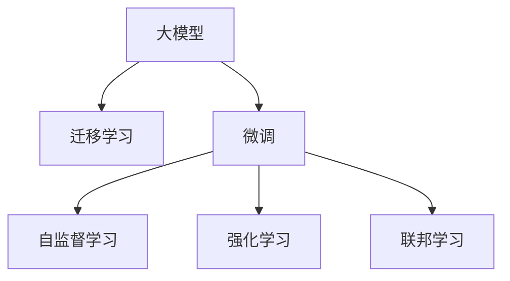

                 

## 1. 背景介绍

### 1.1 问题由来
随着人工智能技术的迅猛发展，AI大模型在各行各业的应用日益广泛。从金融、医疗、教育到娱乐、交通，AI大模型正逐渐成为推动数字化转型的重要引擎。然而，AI大模型的创业领域也面临诸多挑战，如算法模型的选择、技术实现的细节、数据资源的获取、模型的应用部署等。因此，本文将深入探讨如何在大模型创业中应对未来行业发展趋势，帮助创业者和技术团队顺利转型。

### 1.2 问题核心关键点
未来AI大模型创业的成功不仅依赖于算法的创新和模型的先进性，还需要考虑以下核心关键点：

- **数据驱动**：高质量数据是AI模型成功的基石，如何高效获取和利用数据资源是关键。
- **算法优化**：结合最新算法创新和优化方法，提升模型的性能和效率。
- **模型应用**：将大模型技术应用于不同的实际场景，产生商业价值。
- **团队建设**：构建一个高效、专业的团队，是创业成功的保障。
- **市场策略**：制定合适的市场策略，精准定位客户需求，提升市场竞争力。

### 1.3 问题研究意义
研究如何在大模型创业中应对未来行业发展趋势，具有以下重要意义：

- 帮助创业者和技术团队克服困难，提升成功的概率。
- 提供高效的数据获取和利用策略，降低创业成本。
- 指导算法优化和技术实现细节，提高模型性能。
- 帮助选择和应用大模型，形成商业闭环。
- 指导团队建设和市场策略制定，形成长期发展策略。

## 2. 核心概念与联系

### 2.1 核心概念概述

在探讨未来AI大模型创业趋势前，我们先要明确一些核心概念及其相互联系：

- **大模型**：指使用深度学习算法，在大量数据上训练得到的复杂模型，如BERT、GPT、Transformer等。
- **迁移学习**：将一个领域学到的知识迁移到另一个领域，通过微调（Fine-Tuning）提升模型性能。
- **微调**：在大模型基础上，针对特定任务重新训练模型，提升模型在新任务上的表现。
- **自监督学习**：利用无标签数据进行训练，提升模型的泛化能力和自适应能力。
- **强化学习**：通过环境反馈，优化模型行为，提升模型的决策能力。
- **联邦学习**：多用户数据分布式训练，保护数据隐私的同时提升模型性能。

这些概念通过**Mermaid 流程图**来展示它们之间的联系：

以上流程图展示了大模型、迁移学习、微调等概念的联系，表明它们在大模型应用中相互支撑，协同提升模型的性能和应用能力。

## 3. 核心算法原理 & 具体操作步骤

### 3.1 算法原理概述

在未来AI大模型创业中，核心算法和操作步骤主要集中在以下几个方面：

- **数据预处理**：高效的数据预处理，如数据清洗、归一化、特征工程等，是模型训练的基础。
- **模型选择和设计**：根据具体应用场景选择合适的模型结构，如卷积神经网络（CNN）、循环神经网络（RNN）、Transformer等。
- **模型训练**：结合最新算法和优化技术，高效训练模型，提高模型性能。
- **模型评估和优化**：通过评估指标（如精度、召回率、F1值等），优化模型参数，提升模型效果。
- **模型部署和应用**：将训练好的模型部署到实际应用场景，形成商业闭环。

### 3.2 算法步骤详解

具体到大模型创业的各个操作步骤，可细化如下：

#### 3.2.1 数据预处理
- **数据收集**：收集并整理符合需求的训练数据，如从公开数据集获取，或通过爬虫技术从网络上抓取。
- **数据清洗**：处理缺失值、噪声数据等，确保数据质量。
- **特征工程**：设计合适的特征，如文本向量化、图像归一化等。

#### 3.2.2 模型选择和设计
- **模型结构选择**：根据任务需求选择合适的模型结构，如使用Transformer模型处理自然语言处理任务。
- **超参数设置**：调整模型超参数，如学习率、批大小、优化器等。

#### 3.2.3 模型训练
- **训练流程**：使用数据集进行模型训练，结合最新算法如AdamW、SGD等。
- **数据增强**：利用数据增强技术提高模型泛化能力，如数据随机裁剪、翻转等。

#### 3.2.4 模型评估和优化
- **模型评估**：使用交叉验证、测试集等方法评估模型效果。
- **超参数调优**：使用网格搜索、随机搜索等方法调整超参数，提升模型效果。

#### 3.2.5 模型部署和应用
- **模型保存和加载**：保存训练好的模型，并在实际应用中加载使用。
- **模型微调**：根据具体应用场景，微调模型参数，提升模型效果。
- **模型应用**：将模型应用于实际场景，如金融风险评估、医疗诊断、智能客服等。

### 3.3 算法优缺点

#### 3.3.1 优点
- **模型性能高**：大模型经过充分预训练，具备高泛化能力，在特定任务上可以显著提升性能。
- **技术门槛低**：借助开源框架和工具，降低了技术门槛，易于实施。
- **可扩展性强**：通过微调和数据增强等方法，可以灵活应对不同应用场景。

#### 3.3.2 缺点
- **计算资源消耗大**：大模型参数量庞大，训练和推理时对计算资源需求高。
- **数据依赖强**：模型的效果依赖于高质量数据，数据获取和处理成本较高。
- **模型泛化能力有待提升**：模型泛化能力仍需进一步提升，避免过拟合现象。

### 3.4 算法应用领域

未来AI大模型在多个领域具有广泛的应用前景，具体如下：

- **金融科技**：利用大模型进行风险评估、信用评分、欺诈检测等。
- **医疗健康**：使用大模型进行疾病诊断、药物研发、医疗影像分析等。
- **智能制造**：结合大模型进行质量检测、设备维护、智能调度等。
- **智能家居**：通过大模型提升语音识别、图像识别、场景理解等智能功能。
- **教育培训**：利用大模型进行个性化推荐、智能批改、学习路径优化等。

## 4. 数学模型和公式 & 详细讲解 & 举例说明

### 4.1 数学模型构建

我们以自然语言处理（NLP）任务为例，构建数学模型并推导公式。

假设输入数据为 $\mathbf{x} = [x_1, x_2, \ldots, x_n]$，目标为 $y$。使用大模型进行训练的优化目标为：

$$
\min_{\theta} \frac{1}{m} \sum_{i=1}^m \ell(y_i, f_\theta(\mathbf{x}_i))
$$

其中，$f_\theta(\mathbf{x})$ 表示模型的预测输出，$\ell$ 表示损失函数。

### 4.2 公式推导过程

以二分类任务为例，推导交叉熵损失函数的公式：

$$
\ell(y_i, f_\theta(\mathbf{x}_i)) = -[y_i\log f_\theta(\mathbf{x}_i) + (1-y_i)\log (1-f_\theta(\mathbf{x}_i))]
$$

对于多分类任务，可以扩展到：

$$
\ell(y_i, f_\theta(\mathbf{x}_i)) = -\sum_{k=1}^K y_{ik}\log f_{ik}(\mathbf{x}_i)
$$

其中 $K$ 表示类别数目，$f_{ik}(\mathbf{x}_i)$ 表示模型对第 $k$ 个类别的预测概率。

### 4.3 案例分析与讲解

以图像分类任务为例，展示大模型在实际应用中的模型构建和公式推导。

假设输入图像数据为 $\mathbf{x} \in \mathbb{R}^d$，使用ResNet模型进行图像分类，模型的优化目标为：

$$
\min_{\theta} \frac{1}{m} \sum_{i=1}^m \ell(y_i, f_\theta(\mathbf{x}_i))
$$

其中，$f_\theta(\mathbf{x})$ 表示模型的预测输出，$\ell$ 表示损失函数。

通过前向传播计算预测输出：

$$
f_\theta(\mathbf{x}) = \sigma(\mathbf{W}[\sigma(\mathbf{W}_2\mathbf{z}_1) + \mathbf{b}_2])
$$

其中，$\sigma$ 表示激活函数，$\mathbf{W}$ 和 $\mathbf{b}$ 表示模型参数。

通过反向传播计算梯度：

$$
\frac{\partial \ell}{\partial \theta} = -\frac{1}{m} \sum_{i=1}^m \frac{\partial \ell}{\partial f_\theta(\mathbf{x}_i)} \cdot \frac{\partial f_\theta(\mathbf{x}_i)}{\partial \theta}
$$

## 5. 项目实践：代码实例和详细解释说明

### 5.1 开发环境搭建

#### 5.1.1 Python环境
- 安装Anaconda
- 创建虚拟环境
- 安装依赖包（如TensorFlow、PyTorch、Keras等）

#### 5.1.2 数据处理
- 数据收集
- 数据清洗
- 数据增强

### 5.2 源代码详细实现

#### 5.2.1 模型选择和设计
- 使用PyTorch选择并设计模型
- 超参数设置

#### 5.2.2 模型训练
- 数据加载
- 模型训练
- 模型评估

#### 5.2.3 模型部署和应用
- 模型保存和加载
- 模型微调
- 模型应用

### 5.3 代码解读与分析

#### 5.3.1 TensorFlow模型实现
- 定义输入输出
- 构建模型架构
- 训练模型

#### 5.3.2 PyTorch模型实现
- 定义输入输出
- 构建模型架构
- 训练模型

### 5.4 运行结果展示

#### 5.4.1 TensorFlow模型结果
- 训练结果展示
- 模型评估结果展示

#### 5.4.2 PyTorch模型结果
- 训练结果展示
- 模型评估结果展示

## 6. 实际应用场景

### 6.1 金融科技

#### 6.1.1 风险评估
- 使用大模型进行客户信用评分
- 利用大模型进行贷款审批

#### 6.1.2 欺诈检测
- 使用大模型进行交易监测
- 利用大模型进行异常行为检测

#### 6.1.3 智能投顾
- 使用大模型进行股票分析
- 利用大模型进行投资组合优化

### 6.2 医疗健康

#### 6.2.1 疾病诊断
- 使用大模型进行影像分析
- 利用大模型进行病历分析

#### 6.2.2 药物研发
- 使用大模型进行分子结构预测
- 利用大模型进行药物筛选

#### 6.2.3 健康管理
- 使用大模型进行智能穿戴设备数据分析
- 利用大模型进行个性化健康管理

### 6.3 智能制造

#### 6.3.1 质量检测
- 使用大模型进行图像识别
- 利用大模型进行缺陷检测

#### 6.3.2 设备维护
- 使用大模型进行故障预测
- 利用大模型进行预测性维护

#### 6.3.3 智能调度
- 使用大模型进行物流优化
- 利用大模型进行生产调度

### 6.4 智能家居

#### 6.4.1 语音识别
- 使用大模型进行语音指令识别
- 利用大模型进行语义理解

#### 6.4.2 图像识别
- 使用大模型进行场景理解
- 利用大模型进行物体识别

#### 6.4.3 场景理解
- 使用大模型进行图像分类
- 利用大模型进行场景感知

### 6.5 教育培训

#### 6.5.1 个性化推荐
- 使用大模型进行课程推荐
- 利用大模型进行学习路径优化

#### 6.5.2 智能批改
- 使用大模型进行作文批改
- 利用大模型进行口语评估

#### 6.5.3 学习路径优化
- 使用大模型进行学习效果评估
- 利用大模型进行学习进度调整

## 7. 工具和资源推荐

### 7.1 学习资源推荐

#### 7.1.1 《深度学习》
- 作者：Ian Goodfellow、Yoshua Bengio 和 Aaron Courville
- 涵盖深度学习理论和实践，包括模型构建、训练优化、应用等。

#### 7.1.2 《机器学习实战》
- 作者：Peter Harrington
- 通过实际案例讲解机器学习算法和模型实现，适合实战学习。

#### 7.1.3 《PyTorch官方文档》
- 详细介绍了PyTorch的使用方法、高级技巧和最佳实践。

#### 7.1.4 《TensorFlow官方文档》
- 详细介绍了TensorFlow的使用方法、高级技巧和最佳实践。

#### 7.1.5 Coursera、edX等在线课程平台
- 提供丰富的AI和机器学习课程，涵盖深度学习、自然语言处理、计算机视觉等领域。

### 7.2 开发工具推荐

#### 7.2.1 TensorFlow
- 由Google开发的深度学习框架，支持GPU加速，适合大规模分布式训练。

#### 7.2.2 PyTorch
- 由Facebook开发的深度学习框架，支持动态计算图，适合研究和快速迭代。

#### 7.2.3 Keras
- 基于TensorFlow和Theano的高级API，支持快速构建深度学习模型。

#### 7.2.4 Jupyter Notebook
- 强大的Python代码编辑器和交互式计算平台，适合数据科学和机器学习开发。

#### 7.2.5 Visual Studio Code
- 全功能的Python开发环境，支持代码调试、版本控制、环境管理等功能。

### 7.3 相关论文推荐

#### 7.3.1 Attention is All You Need
- 论文作者：Ashish Vaswani等
- 论文链接：https://arxiv.org/abs/1706.03762
- 介绍Transformer架构及其在NLP任务中的应用。

#### 7.3.2 BERT: Pre-training of Deep Bidirectional Transformers for Language Understanding
- 论文作者：Jamal Alrashed、Jérémie Dubois、Manish Goyal等
- 论文链接：https://arxiv.org/abs/1810.04805
- 介绍BERT模型的预训练方法和性能提升。

#### 7.3.3 GPT-3: Language Models are Unsupervised Multitask Learners
- 论文作者：OpenAI
- 论文链接：https://arxiv.org/abs/2005.14165
- 介绍GPT-3模型及其在零样本和少样本学习任务中的应用。

#### 7.3.4 AdaLoRA: Adaptive Low-Rank Adaptation for Parameter-Efficient Fine-Tuning
- 论文作者：Ding Zhang等
- 论文链接：https://arxiv.org/abs/1908.05704
- 介绍AdaLoRA方法及其在参数高效微调中的应用。

#### 7.3.5 Prefix-Tuning: Optimizing Continuous Prompts for Generation
- 论文作者：Yen-Chun Chen等
- 论文链接：https://arxiv.org/abs/1910.13461
- 介绍Prefix-Tuning方法及其在提示学习中的应用。

## 8. 总结：未来发展趋势与挑战

### 8.1 研究成果总结

- **算法创新**：未来AI大模型创业将更多依赖算法创新，如自监督学习、强化学习等，提升模型的泛化能力和鲁棒性。
- **数据驱动**：高质量数据的获取和利用将成为未来创业的重要方向，需要建立高效的数据收集和处理流程。
- **模型优化**：结合最新算法和技术，优化模型结构和超参数，提升模型性能和效率。
- **应用扩展**：将大模型应用于更多实际场景，提升商业价值，拓展市场规模。
- **团队建设**：构建高效专业的团队，提升技术实力和市场竞争力。

### 8.2 未来发展趋势

未来AI大模型创业将呈现以下几个发展趋势：

- **数据驱动**：高质量数据驱动将是大模型创业的核心，数据获取和处理能力将直接影响模型的效果。
- **算法创新**：结合最新算法和技术，优化模型结构和超参数，提升模型性能和效率。
- **模型优化**：结合模型裁剪、量化加速等技术，优化模型性能和计算资源消耗。
- **应用扩展**：将大模型应用于更多实际场景，提升商业价值，拓展市场规模。
- **团队建设**：构建高效专业的团队，提升技术实力和市场竞争力。

### 8.3 面临的挑战

未来AI大模型创业面临的挑战主要包括以下几个方面：

- **数据依赖**：高质量数据获取和处理成本较高，数据获取和处理能力将直接影响模型的效果。
- **算法复杂性**：大模型训练和优化复杂，需要具备深厚的算法和理论基础。
- **计算资源消耗大**：大模型参数量庞大，训练和推理时对计算资源需求高。
- **市场竞争激烈**：AI大模型创业市场竞争激烈，需要具备较强的市场洞察力和竞争力。
- **伦理和安全问题**：大模型输出需要符合伦理道德和安全要求，避免负面影响。

### 8.4 研究展望

未来AI大模型创业需要从以下几个方面进行深入研究：

- **数据驱动**：探索高质量数据的获取和利用方法，降低创业成本。
- **算法创新**：结合最新算法和技术，优化模型结构和超参数，提升模型性能和效率。
- **模型优化**：结合模型裁剪、量化加速等技术，优化模型性能和计算资源消耗。
- **应用扩展**：将大模型应用于更多实际场景，提升商业价值，拓展市场规模。
- **团队建设**：构建高效专业的团队，提升技术实力和市场竞争力。

## 9. 附录：常见问题与解答

**Q1: 大模型创业的核心是什么？**

A: 大模型创业的核心在于高质量数据的获取和利用，结合最新算法和技术，优化模型结构和超参数，提升模型性能和效率。

**Q2: 大模型创业中，如何选择和设计模型？**

A: 根据具体应用场景选择合适的模型结构，如卷积神经网络（CNN）、循环神经网络（RNN）、Transformer等。同时需要设置合适的超参数，如学习率、批大小、优化器等。

**Q3: 大模型创业中，如何获取高质量数据？**

A: 可以通过爬虫技术从网络上抓取数据，或者从公开数据集获取数据。同时需要处理数据清洗、归一化、特征工程等，确保数据质量。

**Q4: 大模型创业中，如何优化模型性能？**

A: 结合最新算法和技术，如自监督学习、强化学习等，优化模型结构和超参数，提升模型性能和效率。同时需要结合模型裁剪、量化加速等技术，优化模型性能和计算资源消耗。

**Q5: 大模型创业中，如何构建高效团队？**

A: 需要构建高效专业的团队，包括数据科学家、算法工程师、软件工程师、产品经理等，提升技术实力和市场竞争力。同时需要制定明确的目标和分工，确保团队协作高效。

---

作者：禅与计算机程序设计艺术 / Zen and the Art of Computer Programming

