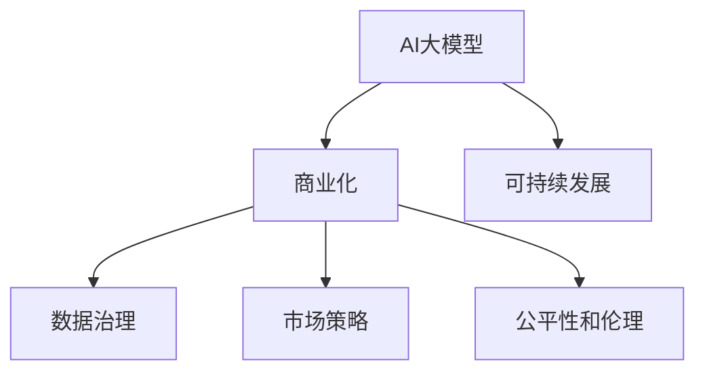

                 

# AI大模型创业：如何构建未来可持续的商业模式？

> 关键词：AI大模型,商业化,可持续发展,商业模式,技术驱动,数据治理,市场策略

## 1. 背景介绍

### 1.1 问题由来

近年来，人工智能技术迅猛发展，尤其是深度学习、自然语言处理、计算机视觉等领域的突破，使得AI大模型（Large AI Models）成为了科技行业的新宠。大型科技公司纷纷布局，投入大量资源开发和部署AI大模型，并借助其强大的算法能力和大规模数据处理能力，在智能搜索、个性化推荐、智能客服、智慧医疗等众多领域取得了显著成果。然而，由于研发和应用AI大模型需要大量数据、计算资源和高水平人才，其高昂的成本和复杂的商业模式使得中小企业难以进入这一领域。此外，在AI大模型应用过程中，数据隐私、公平性和伦理问题也引起了广泛关注，亟需制定合理有效的商业模式以解决这些问题。

### 1.2 问题核心关键点

构建AI大模型可持续商业模式的核心在于如何将AI技术转化为市场价值，同时保障数据隐私、公平性和伦理问题。关键点包括：

- **商业化路径**：探索AI大模型从研发到应用的商业化路径，如何平衡技术研发成本和市场回报。
- **数据治理**：如何保护数据隐私，同时保障数据的高效利用。
- **市场策略**：根据AI大模型的特性和应用场景，制定差异化的市场策略。
- **公平性和伦理**：确保AI大模型的公平性和伦理合规性，避免算法偏见和数据歧视。

### 1.3 问题研究意义

构建可持续的AI大模型商业模式，对于推动AI技术的普及应用，促进产业数字化转型，具有重要意义：

- **降低应用门槛**：通过有效的商业模式设计，降低中小企业进入AI大模型领域的门槛，促进技术创新和产业生态繁荣。
- **提升应用效果**：合理的商业模式可以最大化利用AI大模型的潜力，提升应用效果和市场竞争力。
- **保障数据隐私**：通过数据治理机制，保护用户隐私，增强用户信任，促进AI技术的健康发展。
- **推动公平和伦理**：确保AI大模型的公平性和伦理合规性，避免对社会造成负面影响。

## 2. 核心概念与联系

### 2.1 核心概念概述

要构建AI大模型的可持续商业模式，需要理解其核心概念及其之间的联系：

- **AI大模型**：基于深度学习技术，通过大规模数据训练获得的高级模型，具备强大的学习能力、推理能力和决策能力。
- **商业化**：将技术产品化、市场化的过程，通过合理的商业模式设计，将AI大模型的技术优势转化为市场价值。
- **可持续发展**：在商业化过程中，考虑到长期利益和伦理责任，保障AI大模型的可持续发展和应用。
- **数据治理**：涉及数据的收集、存储、处理和共享的规范和制度，确保数据的合法合规使用。
- **市场策略**：根据市场需求和AI大模型的特点，制定差异化的市场推广和销售策略。
- **公平性和伦理**：确保AI大模型的输出结果和决策过程不带有歧视和偏见，保障用户的公平权益。

这些概念之间的逻辑关系可以通过以下Mermaid流程图来展示：



这个流程图展示了AI大模型从研发到应用的整个过程，以及各环节之间的关系：

1. AI大模型通过数据训练获得基础能力。
2. 商业化将AI大模型转化为市场产品，设计合理的商业模式。
3. 数据治理保障数据隐私和安全，同时确保数据的高效利用。
4. 市场策略针对不同市场需求，制定个性化推广方案。
5. 公平性和伦理确保AI大模型应用的公正性和合法性。
6. 可持续发展关注商业模式的长远利益和责任，保障模型持续发展。

## 3. 核心算法原理 & 具体操作步骤

### 3.1 算法原理概述

构建可持续的AI大模型商业模式，核心在于通过合理的算法原理和具体操作步骤，实现技术到市场的有效转化。其核心思想是：

- **技术驱动**：以AI大模型的技术优势为核心，结合市场需求，制定创新性商业模式。
- **数据治理**：在数据收集和处理过程中，严格遵守数据隐私和安全规范，保障用户权益。
- **市场策略**：根据AI大模型的特性和应用场景，制定差异化的市场推广和销售策略，实现商业化。
- **公平性和伦理**：确保AI大模型的输出结果公平、无偏见，保障用户的合法权益。

### 3.2 算法步骤详解

构建AI大模型可持续商业模式的具体步骤如下：

**Step 1: 需求分析与市场调研**
- 分析目标用户的需求，明确市场定位和竞争优势。
- 进行市场调研，收集用户反馈，了解市场需求和痛点。

**Step 2: 数据收集与处理**
- 确定数据收集策略，制定隐私保护机制。
- 对收集的数据进行清洗、标注和预处理，确保数据质量。

**Step 3: AI大模型训练与优化**
- 选择合适的算法和模型架构，进行预训练和微调。
- 在训练过程中引入公平性和伦理约束，确保模型输出公正。

**Step 4: 商业模式设计**
- 设计可持续的商业模式，平衡技术研发成本和市场回报。
- 制定数据治理策略，确保数据隐私和合规使用。

**Step 5: 市场策略制定**
- 针对不同市场需求，制定差异化的市场推广和销售策略。
- 进行市场测试，收集用户反馈，优化产品功能和服务。

**Step 6: 公平性和伦理合规性审查**
- 进行公平性和伦理审查，确保AI大模型的决策过程透明、公正。
- 建立用户投诉和反馈机制，及时处理用户问题，保障用户权益。

**Step 7: 持续优化与迭代**
- 根据市场反馈和业务需求，不断优化AI大模型和商业模式。
- 引入新技术和新方法，保持商业模式的可持续性。

### 3.3 算法优缺点

构建AI大模型可持续商业模式的优点包括：

- **技术优势显著**：AI大模型的强大算法能力和数据处理能力，能够提供超越传统技术的解决方案。
- **市场潜力巨大**：AI大模型在多个领域的应用前景广阔，能够带来显著的市场回报。
- **数据治理透明**：通过严格的数据治理机制，保障数据隐私和合规使用，增强用户信任。
- **市场策略灵活**：根据市场需求和AI大模型的特性，制定个性化推广方案，提高市场竞争力。
- **公平性和伦理合规**：确保AI大模型应用的公正性和合法性，避免对社会造成负面影响。

同时，该方法也存在以下局限性：

- **技术复杂度高**：AI大模型的开发和应用需要高水平的技术能力和丰富的经验。
- **数据成本高**：大规模数据收集和处理需要高昂的成本，可能限制中小企业的进入。
- **市场竞争激烈**：AI大模型市场竞争激烈，如何建立竞争优势需要深入的市场洞察和策略设计。
- **伦理挑战复杂**：确保AI大模型的公平性和伦理合规性，需要多方面的综合考虑和不断改进。

### 3.4 算法应用领域

构建AI大模型可持续商业模式的方法，在多个领域都有广泛的应用，例如：

- **智能搜索**：利用AI大模型进行文本理解和自然语言处理，提高搜索引擎的精准度和用户体验。
- **个性化推荐**：通过AI大模型分析用户行为数据，提供个性化推荐服务，提升用户满意度。
- **智能客服**：构建基于AI大模型的智能客服系统，提供24/7无间断服务，提高客户体验。
- **智慧医疗**：利用AI大模型进行医学图像分析、疾病预测和智能诊断，提升医疗服务水平。
- **金融科技**：通过AI大模型进行风险评估、欺诈检测和信用评分，提升金融服务的智能水平。
- **智能制造**：结合AI大模型进行设备预测性维护、供应链优化和质量控制，推动制造业智能化转型。
- **智慧城市**：利用AI大模型进行城市安全监控、交通管理和能源优化，提升城市管理水平。

这些应用场景展示了AI大模型在推动各行业智能化转型方面的巨大潜力。

## 4. 数学模型和公式 & 详细讲解  
### 4.1 数学模型构建

构建可持续商业模式的数学模型主要涉及以下几个部分：

- **技术驱动模型**：AI大模型的技术优势，通过深度学习模型的输出结果来衡量其市场价值。
- **数据治理模型**：通过隐私保护和数据合规模型，确保数据收集和处理过程中的隐私和安全。
- **市场策略模型**：基于市场需求和用户反馈，通过优化算法来制定最佳的市场推广策略。
- **公平性和伦理模型**：通过公平性和伦理约束，确保AI大模型输出结果的公正性和合规性。

### 4.2 公式推导过程

以下给出一些核心的数学模型及其推导过程：

**技术驱动模型**
假设AI大模型的输出结果为 $y$，市场价值为 $V$，则技术驱动模型可以表示为：

$$
V = f(y) = \alpha y + \beta
$$

其中，$\alpha$ 为技术贡献度系数，$\beta$ 为市场环境系数。

**数据治理模型**
数据治理模型主要关注隐私保护和合规性，假设隐私保护成本为 $C$，合规成本为 $D$，数据利用带来的市场价值为 $V$，则数据治理模型可以表示为：

$$
V = \max(V - C - D, 0)
$$

即在隐私保护和合规成本小于数据利用价值时，数据治理模型生效，确保数据的高效利用。

**市场策略模型**
市场策略模型考虑不同市场环境下，如何制定最佳推广策略。假设推广策略为 $P$，市场价值为 $V$，则市场策略模型可以表示为：

$$
V = g(P) = f(P) - kP
$$

其中，$f(P)$ 为推广策略带来的市场价值，$k$ 为推广成本系数。

**公平性和伦理模型**
公平性和伦理模型主要通过约束条件，确保AI大模型输出结果的公正性和合规性。假设公平性约束为 $F$，伦理约束为 $E$，则公平性和伦理模型可以表示为：

$$
F = \min(F, 1) \\
E = \min(E, 1)
$$

即在公平性和伦理约束条件下，确保输出结果的公正性和合规性。

### 4.3 案例分析与讲解

**智能搜索系统**
智能搜索系统利用AI大模型进行文本理解和自然语言处理，提高搜索引擎的精准度和用户体验。其核心算法包括BERT模型和Transformer架构。以一个简单的搜索应用为例，通过BERT模型对用户输入的查询进行处理，生成搜索结果，并通过用户点击和反馈数据不断优化模型。通过技术驱动模型，可以衡量该系统的市场价值；通过数据治理模型，保障用户隐私和数据安全；通过市场策略模型，制定个性化的推广方案；通过公平性和伦理模型，确保搜索结果的公正性和合规性。

**个性化推荐系统**
个性化推荐系统通过AI大模型分析用户行为数据，提供个性化推荐服务，提升用户满意度。其核心算法包括DeepFM、CTR预估模型等。以一个电子商务平台为例，通过AI大模型对用户历史行为数据进行建模，预测用户可能感兴趣的商品，并通过推荐算法生成个性化推荐列表。通过技术驱动模型，可以衡量推荐系统的市场价值；通过数据治理模型，确保用户行为数据的隐私保护；通过市场策略模型，制定高效的推广方案；通过公平性和伦理模型，确保推荐结果的公正性和合规性。

## 5. 项目实践：代码实例和详细解释说明
### 5.1 开发环境搭建

在进行AI大模型商业化实践前，我们需要准备好开发环境。以下是使用Python进行PyTorch开发的环境配置流程：

1. 安装Anaconda：从官网下载并安装Anaconda，用于创建独立的Python环境。

2. 创建并激活虚拟环境：
```bash
conda create -n pytorch-env python=3.8 
conda activate pytorch-env
```

3. 安装PyTorch：根据CUDA版本，从官网获取对应的安装命令。例如：
```bash
conda install pytorch torchvision torchaudio cudatoolkit=11.1 -c pytorch -c conda-forge
```

4. 安装Transformers库：
```bash
pip install transformers
```

5. 安装各类工具包：
```bash
pip install numpy pandas scikit-learn matplotlib tqdm jupyter notebook ipython
```

完成上述步骤后，即可在`pytorch-env`环境中开始商业化实践。

### 5.2 源代码详细实现

下面我以智能搜索系统为例，给出使用Transformers库进行AI大模型训练的PyTorch代码实现。

首先，定义智能搜索系统的数据处理函数：

```python
from transformers import BertTokenizer
from torch.utils.data import Dataset
import torch

class SearchDataset(Dataset):
    def __init__(self, texts, queries, tokenizer, max_len=128):
        self.texts = texts
        self.queries = queries
        self.tokenizer = tokenizer
        self.max_len = max_len
        
    def __len__(self):
        return len(self.texts)
    
    def __getitem__(self, item):
        text = self.texts[item]
        query = self.queries[item]
        
        encoding = self.tokenizer(text, return_tensors='pt', max_length=self.max_len, padding='max_length', truncation=True)
        input_ids = encoding['input_ids'][0]
        attention_mask = encoding['attention_mask'][0]
        
        # 对token-wise的标签进行编码
        encoded_tags = [tag2id[tag] for tag in queries] 
        encoded_tags.extend([tag2id['O']] * (self.max_len - len(encoded_tags)))
        labels = torch.tensor(encoded_tags, dtype=torch.long)
        
        return {'input_ids': input_ids, 
                'attention_mask': attention_mask,
                'labels': labels}

# 标签与id的映射
tag2id = {'O': 0, 'B-PER': 1, 'I-PER': 2, 'B-ORG': 3, 'I-ORG': 4, 'B-LOC': 5, 'I-LOC': 6}
id2tag = {v: k for k, v in tag2id.items()}

# 创建dataset
tokenizer = BertTokenizer.from_pretrained('bert-base-cased')

train_dataset = SearchDataset(train_texts, train_queries, tokenizer)
dev_dataset = SearchDataset(dev_texts, dev_queries, tokenizer)
test_dataset = SearchDataset(test_texts, test_queries, tokenizer)
```

然后，定义模型和优化器：

```python
from transformers import BertForTokenClassification, AdamW

model = BertForTokenClassification.from_pretrained('bert-base-cased', num_labels=len(tag2id))

optimizer = AdamW(model.parameters(), lr=2e-5)
```

接着，定义训练和评估函数：

```python
from torch.utils.data import DataLoader
from tqdm import tqdm
from sklearn.metrics import classification_report

device = torch.device('cuda') if torch.cuda.is_available() else torch.device('cpu')
model.to(device)

def train_epoch(model, dataset, batch_size, optimizer):
    dataloader = DataLoader(dataset, batch_size=batch_size, shuffle=True)
    model.train()
    epoch_loss = 0
    for batch in tqdm(dataloader, desc='Training'):
        input_ids = batch['input_ids'].to(device)
        attention_mask = batch['attention_mask'].to(device)
        labels = batch['labels'].to(device)
        model.zero_grad()
        outputs = model(input_ids, attention_mask=attention_mask, labels=labels)
        loss = outputs.loss
        epoch_loss += loss.item()
        loss.backward()
        optimizer.step()
    return epoch_loss / len(dataloader)

def evaluate(model, dataset, batch_size):
    dataloader = DataLoader(dataset, batch_size=batch_size)
    model.eval()
    preds, labels = [], []
    with torch.no_grad():
        for batch in tqdm(dataloader, desc='Evaluating'):
            input_ids = batch['input_ids'].to(device)
            attention_mask = batch['attention_mask'].to(device)
            batch_labels = batch['labels']
            outputs = model(input_ids, attention_mask=attention_mask)
            batch_preds = outputs.logits.argmax(dim=2).to('cpu').tolist()
            batch_labels = batch_labels.to('cpu').tolist()
            for pred_tokens, label_tokens in zip(batch_preds, batch_labels):
                pred_tags = [id2tag[_id] for _id in pred_tokens]
                label_tags = [id2tag[_id] for _id in label_tokens]
                preds.append(pred_tags[:len(label_tags)])
                labels.append(label_tags)
                
    print(classification_report(labels, preds))
```

最后，启动训练流程并在测试集上评估：

```python
epochs = 5
batch_size = 16

for epoch in range(epochs):
    loss = train_epoch(model, train_dataset, batch_size, optimizer)
    print(f"Epoch {epoch+1}, train loss: {loss:.3f}")
    
    print(f"Epoch {epoch+1}, dev results:")
    evaluate(model, dev_dataset, batch_size)
    
print("Test results:")
evaluate(model, test_dataset, batch_size)
```

以上就是使用PyTorch对BERT进行智能搜索系统训练的完整代码实现。可以看到，得益于Transformers库的强大封装，我们可以用相对简洁的代码完成BERT模型的加载和微调。

### 5.3 代码解读与分析

让我们再详细解读一下关键代码的实现细节：

**SearchDataset类**：
- `__init__`方法：初始化文本、查询、分词器等关键组件。
- `__len__`方法：返回数据集的样本数量。
- `__getitem__`方法：对单个样本进行处理，将文本输入编码为token ids，将查询编码为数字，并对其进行定长padding，最终返回模型所需的输入。

**tag2id和id2tag字典**：
- 定义了标签与数字id之间的映射关系，用于将token-wise的预测结果解码回真实的标签。

**训练和评估函数**：
- 使用PyTorch的DataLoader对数据集进行批次化加载，供模型训练和推理使用。
- 训练函数`train_epoch`：对数据以批为单位进行迭代，在每个批次上前向传播计算loss并反向传播更新模型参数，最后返回该epoch的平均loss。
- 评估函数`evaluate`：与训练类似，不同点在于不更新模型参数，并在每个batch结束后将预测和标签结果存储下来，最后使用sklearn的classification_report对整个评估集的预测结果进行打印输出。

**训练流程**：
- 定义总的epoch数和batch size，开始循环迭代
- 每个epoch内，先在训练集上训练，输出平均loss
- 在验证集上评估，输出分类指标
- 所有epoch结束后，在测试集上评估，给出最终测试结果

可以看到，PyTorch配合Transformers库使得BERT训练的代码实现变得简洁高效。开发者可以将更多精力放在数据处理、模型改进等高层逻辑上，而不必过多关注底层的实现细节。

当然，工业级的系统实现还需考虑更多因素，如模型的保存和部署、超参数的自动搜索、更灵活的任务适配层等。但核心的微调范式基本与此类似。

## 6. 实际应用场景
### 6.1 智能搜索系统

基于AI大模型的智能搜索系统，可以显著提升搜索引擎的精准度和用户体验。传统搜索引擎依赖关键词匹配，无法理解用户查询背后的意图和需求。而使用AI大模型进行文本理解和自然语言处理，可以自动识别和解析用户查询，生成更精准的搜索结果。

在技术实现上，可以收集用户的搜索历史和行为数据，将其作为训练集，对预训练的BERT模型进行微调。微调后的模型能够理解用户意图，匹配最合适的搜索结果。对于新查询，系统还可以实时搜索相关内容，动态生成回答。如此构建的智能搜索系统，能大幅提升搜索的智能化水平，为用户带来更好的体验。

### 6.2 个性化推荐系统

当前的推荐系统往往只依赖用户的历史行为数据进行物品推荐，无法深入理解用户的真实兴趣偏好。基于AI大模型的个性化推荐系统，可以更好地挖掘用户行为背后的语义信息，从而提供更精准、多样的推荐内容。

在实践中，可以收集用户浏览、点击、评论、分享等行为数据，提取和用户交互的物品标题、描述、标签等文本内容。将文本内容作为模型输入，用户的后续行为（如是否点击、购买等）作为监督信号，在此基础上微调预训练语言模型。微调后的模型能够从文本内容中准确把握用户的兴趣点。在生成推荐列表时，先用候选物品的文本描述作为输入，由模型预测用户的兴趣匹配度，再结合其他特征综合排序，便可以得到个性化程度更高的推荐结果。

### 6.3 智能客服系统

传统的客服系统依赖人工介入，高峰期响应缓慢，且一致性和专业性难以保证。基于AI大模型的智能客服系统，可以7x24小时不间断服务，快速响应客户咨询，用自然流畅的语言解答各类常见问题。

在技术实现上，可以收集企业内部的历史客服对话记录，将问题和最佳答复构建成监督数据，在此基础上对预训练的对话模型进行微调。微调后的对话模型能够自动理解用户意图，匹配最合适的答案模板进行回复。对于客户提出的新问题，还可以接入检索系统实时搜索相关内容，动态组织生成回答。如此构建的智能客服系统，能大幅提升客户咨询体验和问题解决效率。

### 6.4 未来应用展望

随着AI大模型和微调方法的不断发展，基于微调范式将在更多领域得到应用，为传统行业带来变革性影响。

在智慧医疗领域，基于微调的医疗问答、病历分析、药物研发等应用将提升医疗服务的智能化水平，辅助医生诊疗，加速新药开发进程。

在智能教育领域，微调技术可应用于作业批改、学情分析、知识推荐等方面，因材施教，促进教育公平，提高教学质量。

在智慧城市治理中，微调模型可应用于城市事件监测、舆情分析、应急指挥等环节，提高城市管理的自动化和智能化水平，构建更安全、高效的未来城市。

此外，在企业生产、社会治理、文娱传媒等众多领域，基于大模型微调的人工智能应用也将不断涌现，为经济社会发展注入新的动力。相信随着技术的日益成熟，微调方法将成为人工智能落地应用的重要范式，推动人工智能技术向更广阔的领域加速渗透。

## 7. 工具和资源推荐
### 7.1 学习资源推荐

为了帮助开发者系统掌握AI大模型商业化理论基础和实践技巧，这里推荐一些优质的学习资源：

1. 《Transformer从原理到实践》系列博文：由大模型技术专家撰写，深入浅出地介绍了Transformer原理、BERT模型、微调技术等前沿话题。

2. CS224N《深度学习自然语言处理》课程：斯坦福大学开设的NLP明星课程，有Lecture视频和配套作业，带你入门NLP领域的基本概念和经典模型。

3. 《Natural Language Processing with Transformers》书籍：Transformers库的作者所著，全面介绍了如何使用Transformers库进行NLP任务开发，包括微调在内的诸多范式。

4. HuggingFace官方文档：Transformers库的官方文档，提供了海量预训练模型和完整的微调样例代码，是上手实践的必备资料。

5. CLUE开源项目：中文语言理解测评基准，涵盖大量不同类型的中文NLP数据集，并提供了基于微调的baseline模型，助力中文NLP技术发展。

通过对这些资源的学习实践，相信你一定能够快速掌握AI大模型商业化的精髓，并用于解决实际的NLP问题。
###  7.2 开发工具推荐

高效的开发离不开优秀的工具支持。以下是几款用于AI大模型商业化开发的常用工具：

1. PyTorch：基于Python的开源深度学习框架，灵活动态的计算图，适合快速迭代研究。大部分预训练语言模型都有PyTorch版本的实现。

2. TensorFlow：由Google主导开发的开源深度学习框架，生产部署方便，适合大规模工程应用。同样有丰富的预训练语言模型资源。

3. Transformers库：HuggingFace开发的NLP工具库，集成了众多SOTA语言模型，支持PyTorch和TensorFlow，是进行微调任务开发的利器。

4. Weights & Biases：模型训练的实验跟踪工具，可以记录和可视化模型训练过程中的各项指标，方便对比和调优。与主流深度学习框架无缝集成。

5. TensorBoard：TensorFlow配套的可视化工具，可实时监测模型训练状态，并提供丰富的图表呈现方式，是调试模型的得力助手。

6. Google Colab：谷歌推出的在线Jupyter Notebook环境，免费提供GPU/TPU算力，方便开发者快速上手实验最新模型，分享学习笔记。

合理利用这些工具，可以显著提升AI大模型商业化任务的开发效率，加快创新迭代的步伐。

### 7.3 相关论文推荐

AI大模型商业化的研究源于学界的持续研究。以下是几篇奠基性的相关论文，推荐阅读：

1. Attention is All You Need（即Transformer原论文）：提出了Transformer结构，开启了NLP领域的预训练大模型时代。

2. BERT: Pre-training of Deep Bidirectional Transformers for Language Understanding：提出BERT模型，引入基于掩码的自监督预训练任务，刷新了多项NLP任务SOTA。

3. Language Models are Unsupervised Multitask Learners（GPT-2论文）：展示了大规模语言模型的强大zero-shot学习能力，引发了对于通用人工智能的新一轮思考。

4. Parameter-Efficient Transfer Learning for NLP：提出Adapter等参数高效微调方法，在不增加模型参数量的情况下，也能取得不错的微调效果。

5. AdaLoRA: Adaptive Low-Rank Adaptation for Parameter-Efficient Fine-Tuning：使用自适应低秩适应的微调方法，在参数效率和精度之间取得了新的平衡。

这些论文代表了大模型商业化的发展脉络。通过学习这些前沿成果，可以帮助研究者把握学科前进方向，激发更多的创新灵感。

## 8. 总结：未来发展趋势与挑战

### 8.1 总结

本文对构建AI大模型可持续商业模式的理论基础和实践技巧进行了全面系统的介绍。首先阐述了AI大模型和商业化的基本概念及其之间的联系，明确了技术驱动、数据治理、市场策略和公平性与伦理在构建商业模式中的关键作用。其次，从原理到实践，详细讲解了AI大模型商业化的数学模型和关键步骤，给出了商业化任务开发的完整代码实例。同时，本文还广泛探讨了AI大模型在多个行业领域的应用前景，展示了商业化范式的巨大潜力。此外，本文精选了商业化技术的各类学习资源，力求为读者提供全方位的技术指引。

通过本文的系统梳理，可以看到，构建可持续的AI大模型商业模式，对于推动AI技术的普及应用，促进产业数字化转型，具有重要意义。通过有效的商业模式设计，平衡技术研发成本和市场回报，保障数据隐私和公平性，确保AI大模型应用的公正性和合法性，可以在技术创新和市场需求之间找到平衡点，实现AI大模型的商业化落地。

### 8.2 未来发展趋势

展望未来，AI大模型商业化技术将呈现以下几个发展趋势：

1. **技术驱动市场**：AI大模型的技术优势将进一步转化为市场价值，推动更多中小企业的进入和应用。
2. **数据治理透明**：数据隐私保护和合规性将得到更高重视，保障用户隐私和数据安全。
3. **市场策略多元**：根据不同应用场景，制定差异化的市场推广和销售策略，提升市场竞争力。
4. **公平性和伦理合规**：确保AI大模型应用的公正性和合规性，避免对社会造成负面影响。
5. **可持续性提升**：商业模式将更加注重长期利益和伦理责任，确保AI大模型的可持续发展。

以上趋势凸显了AI大模型商业化技术的广阔前景。这些方向的探索发展，必将进一步推动AI技术的普及应用，促进各行业的数字化转型和智能化升级。

### 8.3 面临的挑战

尽管AI大模型商业化技术已经取得了显著进展，但在迈向更加智能化、普适化应用的过程中，仍面临诸多挑战：

1. **技术复杂度高**：AI大模型的开发和应用需要高水平的技术能力和丰富的经验，可能限制中小企业的进入。
2. **数据成本高**：大规模数据收集和处理需要高昂的成本，可能限制企业的商业模式设计和运营。
3. **市场竞争激烈**：AI大模型市场竞争激烈，如何建立竞争优势需要深入的市场洞察和策略设计。
4. **伦理挑战复杂**：确保AI大模型的公平性和伦理合规性，需要多方面的综合考虑和不断改进。
5. **技术应用难度大**：AI大模型的应用需要多种技术支持，可能增加企业的技术应用难度。

这些挑战需要我们不断探索和改进，才能实现AI大模型商业化的可持续发展。唯有从技术、数据、市场、伦理等多个维度协同发力，才能真正推动AI技术在各行业的应用落地。

### 8.4 研究展望

面向未来，AI大模型商业化技术的研究需要重点关注以下几个方向：

1. **无监督和半监督商业化方法**：探索无需大规模标注数据，通过无监督和半监督学习实现商业化的方法，降低企业的标注成本。
2. **参数高效商业化方法**：开发更加参数高效的商业化方法，减少企业的数据和计算资源投入。
3. **多模态商业化方法**：结合视觉、语音、文本等多模态信息，提升商业化模型的综合能力和应用场景。
4. **可持续性和伦理商业化方法**：确保商业化模型的可持续性和伦理合规性，构建透明、公正的商业生态。
5. **可解释性和可控性商业化方法**：提升商业化模型的可解释性和可控性，增强模型的可靠性和可控性。

这些研究方向将进一步推动AI大模型商业化技术的发展，提升各行业智能化水平，为经济社会发展注入新的动力。

## 9. 附录：常见问题与解答

**Q1：AI大模型商业化是否适用于所有行业？**

A: AI大模型商业化方法可以应用于大多数行业，特别是对数据依赖度高、任务复杂度高的领域。然而，对于一些特定行业，如金融、医疗等，可能需要根据行业特性进行定制化设计和优化。

**Q2：AI大模型商业化需要哪些关键技术？**

A: 构建AI大模型商业化需要以下关键技术：
- 数据收集和处理：保障数据质量，确保数据隐私和安全。
- 模型训练和微调：选择适合任务的语言模型，进行预训练和微调。
- 模型部署和优化：考虑模型的推理速度和资源占用，进行模型压缩和优化。
- 商业模式设计：平衡技术研发成本和市场回报，制定合理的商业模式。
- 市场推广和销售：制定差异化的市场推广和销售策略，提升市场竞争力。
- 公平性和伦理保障：确保模型应用的公正性和合规性。

**Q3：AI大模型商业化过程中需要注意哪些问题？**

A: AI大模型商业化过程中需要注意以下几个问题：
- 数据隐私和安全：确保用户数据隐私，避免数据泄露和滥用。
- 模型公平性和伦理：确保模型输出结果的公正性和合规性，避免算法偏见和歧视。
- 市场竞争策略：制定差异化的市场推广和销售策略，避免市场恶性竞争。
- 技术应用难度：提升模型的可解释性和可控性，降低企业技术应用难度。
- 商业模式可持续性：确保商业模式的可持续性，避免商业模式破产或失败。

**Q4：AI大模型商业化的未来展望是什么？**

A: AI大模型商业化的未来展望主要包括以下几个方面：
- 技术驱动市场：AI大模型的技术优势将进一步转化为市场价值，推动更多企业的进入和应用。
- 数据治理透明：数据隐私保护和合规性将得到更高重视，保障用户隐私和数据安全。
- 市场策略多元：根据不同应用场景，制定差异化的市场推广和销售策略，提升市场竞争力。
- 公平性和伦理合规：确保AI大模型应用的公正性和合规性，避免对社会造成负面影响。
- 可持续性提升：商业模式将更加注重长期利益和伦理责任，确保AI大模型的可持续发展。

这些展望展示了AI大模型商业化技术的广阔前景，为各行业的智能化转型和升级提供了新的方向。

