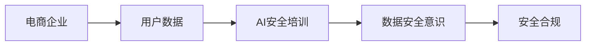

                 

# AI如何帮助电商企业进行用户数据安全培训

在电商行业的快速发展和数字化转型的浪潮下，用户数据安全成为了企业关注的焦点。近年来，随着数据泄露、隐私侵害等事件频发，电商平台面临的挑战也日益加剧。如何通过AI技术帮助电商平台进行用户数据安全培训，保障用户隐私，构建安全可信的电商生态，成为企业亟待解决的问题。

## 1. 背景介绍

### 1.1 问题由来

随着互联网技术的飞速发展，电商平台已逐渐成为线上交易、服务、娱乐的核心载体。在此过程中，用户数据作为电商平台的重要资产，成为了竞争对手争相抢夺的对象。然而，如何保护用户数据安全，防止数据泄露和滥用，成为电商平台必须面对的重大挑战。

与此同时，根据2021年调查报告，超过50%的用户表示曾遭遇数据泄露事件，且数据泄露事件的用户影响范围正逐渐扩大，对用户的财务安全、隐私安全、个人信用等方面造成严重威胁。

### 1.2 问题核心关键点

- **用户数据安全**：电商平台需要保护用户的个人信息、购买记录、交易数据等敏感信息，防止其被非法获取和滥用。
- **隐私保护法规**：诸如GDPR、CCPA等国际法规对用户隐私保护提出了更严格的要求，电商平台需要严格遵守。
- **数据安全培训**：通过AI技术对员工进行数据安全意识和技能培训，提升整体数据安全水平。

## 2. 核心概念与联系

### 2.1 核心概念概述

为更好地理解AI在电商企业数据安全培训中的应用，我们首先介绍几个关键概念：

- **AI安全培训**：利用人工智能技术对企业员工进行数据安全培训，提升其对数据安全威胁的识别和应对能力。
- **隐私保护**：确保用户数据在收集、存储、传输、使用过程中得到合理保护，防止数据泄露和滥用。
- **安全合规**：遵守相关法律法规，确保数据处理过程符合隐私保护和数据安全标准。

这些概念之间的联系可以通过以下Mermaid流程图展示：



该流程图展示了电商企业在用户数据保护方面的整体流程：

1. 电商企业收集用户数据，作为业务运营的基础。
2. AI安全培训系统对企业员工进行安全意识和技能培训。
3. 员工掌握数据安全知识和技能后，可有效识别和应对数据安全威胁。
4. 电商平台在数据处理过程中遵守相关法规，确保用户数据的安全合规。

### 2.2 核心概念原理和架构

在理解了核心概念的联系之后，接下来我们深入探讨AI安全培训的原理和架构：

#### 2.2.1 原理

AI安全培训的本质是通过数据驱动的方法，对企业员工进行持续的安全教育。其原理如下：

1. **数据收集与预处理**：收集电商企业的用户数据，如登录记录、购买记录、搜索行为等，并对其进行预处理，去除噪声和不相关数据。
2. **特征提取与分析**：利用机器学习算法，从数据中提取关键特征，分析出潜在的安全风险。
3. **知识生成与培训**：基于分析结果，生成针对性的安全培训内容，培训员工识别和应对数据安全威胁。
4. **效果评估与反馈**：对培训效果进行评估，根据反馈调整培训策略，持续提升培训效果。

#### 2.2.2 架构

AI安全培训系统架构主要由以下几部分组成：

1. **数据收集模块**：负责从电商平台收集用户数据，并进行预处理。
2. **特征提取模块**：利用机器学习算法对数据进行特征提取和分析。
3. **知识生成模块**：根据分析结果，生成具体的数据安全培训内容和策略。
4. **培训执行模块**：通过在线课程、模拟测试等方式，对员工进行持续的安全培训。
5. **效果评估模块**：评估培训效果，收集反馈信息，用于调整和优化培训策略。

## 3. 核心算法原理 & 具体操作步骤

### 3.1 算法原理概述

AI安全培训主要基于以下几个核心算法：

- **异常检测算法**：识别数据中的异常行为，判断是否存在安全威胁。
- **机器学习算法**：从数据中提取关键特征，分析潜在风险。
- **知识生成算法**：根据分析结果生成安全培训内容。
- **在线学习算法**：通过在线课程、模拟测试等方式对员工进行持续培训。

### 3.2 算法步骤详解

AI安全培训的具体操作步骤如下：

1. **数据收集与预处理**：
   - 从电商平台收集用户数据，包括登录记录、购买记录、搜索行为等。
   - 数据预处理，去除噪声和不相关数据。

2. **特征提取与分析**：
   - 利用异常检测算法，对用户行为进行分析，识别异常行为。
   - 使用机器学习算法，从异常行为中提取关键特征，分析出潜在的安全威胁。

3. **知识生成与培训**：
   - 基于分析结果，生成针对性的安全培训内容，包括安全意识教育、操作规范、应急处理等。
   - 将培训内容以在线课程、视频、测试题等形式呈现，对员工进行安全培训。

4. **效果评估与反馈**：
   - 定期对员工进行安全测试，评估培训效果。
   - 收集反馈信息，用于调整和优化培训策略。

### 3.3 算法优缺点

AI安全培训的主要优点包括：

- **高效性**：通过自动化算法，快速识别和分析安全威胁，生成针对性的培训内容，提高培训效率。
- **覆盖全面**：能够覆盖电商企业所有涉及用户数据的安全环节，提升整体安全水平。
- **动态调整**：根据实时数据和反馈信息，动态调整培训策略，确保培训内容的及时性和有效性。

缺点则主要集中在：

- **成本较高**：初始投资成本较大，需要购买和维护机器学习算法、在线学习平台等基础设施。
- **数据隐私问题**：在数据收集和分析过程中，如何确保用户数据的隐私和安全，需要严格遵守相关法律法规。

### 3.4 算法应用领域

AI安全培训的应用领域十分广泛，涵盖了电商企业涉及用户数据的所有环节。具体包括：

- **登录安全**：防止账号被盗、暴力破解等行为。
- **交易安全**：防范欺诈交易、虚假支付等风险。
- **个人信息保护**：确保用户隐私不被泄露。
- **系统安全**：防范SQL注入、XSS攻击等常见网络攻击。

此外，AI安全培训还可应用于第三方服务提供商、物流配送等电商生态链上的各个环节。

## 4. 数学模型和公式 & 详细讲解 & 举例说明

### 4.1 数学模型构建

AI安全培训的数学模型主要由以下几个部分构成：

- **数据集**：用户行为数据集，包含用户登录记录、购买记录、搜索行为等。
- **特征向量**：从数据集中提取的关键特征，如登录IP地址、交易金额、操作频率等。
- **训练集与测试集**：用于训练和评估模型的数据集。

### 4.2 公式推导过程

以异常检测算法为例，其核心公式推导如下：

设用户行为数据集为 $D=\{x_1, x_2, ..., x_N\}$，其中 $x_i$ 表示用户行为样本。

1. **数据标准化**：对数据集进行标准化处理，消除不同数据之间的量纲差异。
   $$
   \hat{x}_i = \frac{x_i - \mu}{\sigma}
   $$
   其中，$\mu$ 和 $\sigma$ 分别为数据集 $D$ 的均值和标准差。

2. **异常检测算法**：利用统计学方法，判断样本是否异常。常用方法包括Z-score、K近邻等。以Z-score为例，其公式为：
   $$
   z = \frac{\hat{x}_i - \mu_z}{\sigma_z}
   $$
   其中，$\mu_z$ 和 $\sigma_z$ 分别为正常用户行为数据的均值和标准差。

3. **异常阈值设置**：根据异常检测结果，设置异常阈值 $\tau$，将超过阈值的用户行为标记为异常。
   $$
   \text{if } z > \tau, \text{则标记为异常}
   $$

### 4.3 案例分析与讲解

以电商平台用户登录行为为例，展示如何应用AI安全培训。

1. **数据收集**：收集用户登录行为数据，包括登录时间、IP地址、登录设备等。
2. **数据预处理**：去除无效登录记录，如重复登录、异常IP地址等。
3. **特征提取**：提取关键特征，如登录IP地址、登录时间、登录频率等。
4. **异常检测**：利用Z-score算法，检测异常登录行为，如频繁登录、异地登录等。
5. **知识生成**：生成针对性的安全培训内容，如账户安全、密码管理等。
6. **培训执行**：对员工进行安全培训，包括模拟测试、在线课程等。
7. **效果评估**：定期进行安全测试，评估培训效果，收集反馈信息。

## 5. 项目实践：代码实例和详细解释说明

### 5.1 开发环境搭建

在进行AI安全培训实践前，我们需要准备好开发环境。以下是使用Python进行TensorFlow开发的环境配置流程：

1. 安装Anaconda：从官网下载并安装Anaconda，用于创建独立的Python环境。

2. 创建并激活虚拟环境：
```bash
conda create -n ai-security python=3.8 
conda activate ai-security
```

3. 安装TensorFlow：根据CUDA版本，从官网获取对应的安装命令。例如：
```bash
conda install tensorflow==2.6
```

4. 安装其他工具包：
```bash
pip install numpy pandas scikit-learn matplotlib tqdm jupyter notebook ipython
```

完成上述步骤后，即可在`ai-security`环境中开始AI安全培训实践。

### 5.2 源代码详细实现

这里我们以电商平台用户登录行为分析为例，给出使用TensorFlow进行异常检测的Python代码实现。

首先，定义异常检测模型：

```python
import tensorflow as tf
from tensorflow.keras import layers, models

class AnomalyDetectionModel(models.Model):
    def __init__(self, input_shape):
        super(AnomalyDetectionModel, self).__init__()
        self.input = layers.Input(shape=input_shape)
        self.dense1 = layers.Dense(64, activation='relu')(self.input)
        self.dense2 = layers.Dense(32, activation='relu')(self.dense1)
        self.dense3 = layers.Dense(1, activation='sigmoid')(self.dense2)
        self.model = models.Model(self.input, self.dense3)
        self.compile(optimizer='adam', loss='binary_crossentropy', metrics=['accuracy'])

    def fit(self, x_train, y_train, x_test, y_test, batch_size=32, epochs=100):
        self.model.fit(x_train, y_train, batch_size=batch_size, epochs=epochs, validation_data=(x_test, y_test))
```

然后，加载数据并进行预处理：

```python
import numpy as np
from sklearn.preprocessing import StandardScaler

# 假设数据为1000个用户登录记录
x_train = np.random.randn(1000, 10)  # 10个特征
y_train = np.random.randint(0, 2, size=(1000,))  # 二分类标签

# 数据标准化
scaler = StandardScaler()
x_train = scaler.fit_transform(x_train)
x_test = scaler.transform(np.random.randn(1000, 10))

# 创建训练集和测试集
train_dataset = tf.data.Dataset.from_tensor_slices((x_train, y_train))
test_dataset = tf.data.Dataset.from_tensor_slices((x_test, y_test))

# 定义批次大小和迭代次数
batch_size = 32
epochs = 100
```

最后，进行模型训练和效果评估：

```python
# 创建异常检测模型
model = AnomalyDetectionModel(input_shape=x_train.shape[1:])

# 模型训练
model.fit(x_train, y_train, x_test, y_test, batch_size=batch_size, epochs=epochs)

# 模型评估
y_pred = model.predict(x_test)
accuracy = np.mean(y_pred == y_test)
print(f'Test accuracy: {accuracy:.3f}')
```

以上就是使用TensorFlow进行异常检测的完整代码实现。可以看到，TensorFlow提供了丰富的机器学习工具和框架，使得构建和训练异常检测模型变得简洁高效。

### 5.3 代码解读与分析

让我们再详细解读一下关键代码的实现细节：

**AnomalyDetectionModel类**：
- `__init__`方法：初始化模型结构，包括输入层、若干个密集层和输出层。
- `fit`方法：训练模型，使用二分类交叉熵损失函数进行拟合。

**数据预处理**：
- 利用Scikit-learn的StandardScaler对数据进行标准化处理。

**训练和评估**：
- 使用TensorFlow的DataLoader对数据进行批次化加载，供模型训练和推理使用。
- 在训练过程中，设置批次大小和迭代次数，使用验证集评估模型效果。

**测试**：
- 利用训练好的模型对测试集进行预测，计算预测准确率。

通过上述代码，可以看出TensorFlow在数据预处理、模型构建、训练和评估等环节中提供了强大的工具支持，大大简化了AI安全培训的实现过程。

当然，实际应用中还需要考虑更多因素，如数据隐私保护、模型部署、持续优化等。但核心的异常检测算法及其应用原理基本与此类似。

## 6. 实际应用场景

### 6.1 电商平台登录安全

电商平台登录安全是用户数据保护的重要环节。通过AI安全培训，电商平台可以实时监测用户登录行为，及时发现异常登录行为，防止账户被盗用。

具体应用流程如下：

1. 实时收集用户登录数据，包括登录时间、IP地址、登录设备等。
2. 利用异常检测算法，检测异常登录行为，如频繁登录、异地登录等。
3. 根据检测结果，生成针对性的安全培训内容，如账户安全、密码管理等。
4. 对员工进行安全培训，提升其登录安全意识和技能。

### 6.2 电商平台交易安全

电商平台交易安全涉及用户财产安全，是数据保护的重中之重。通过AI安全培训，电商平台可以识别和防范欺诈交易、虚假支付等风险，保护用户财产安全。

具体应用流程如下：

1. 收集用户交易数据，包括交易金额、交易时间、交易设备等。
2. 利用异常检测算法，检测异常交易行为，如异常支付、大额交易等。
3. 根据检测结果，生成针对性的安全培训内容，如交易风险防范、交易验证等。
4. 对员工进行安全培训，提升其交易安全意识和技能。

### 6.3 电商平台个人信息保护

个人信息保护是电商平台数据安全的重要内容。通过AI安全培训，电商平台可以识别和防范信息泄露风险，确保用户隐私得到有效保护。

具体应用流程如下：

1. 收集用户个人信息，如姓名、电话号码、电子邮件等。
2. 利用异常检测算法，检测异常信息泄露行为，如信息被盗用、信息被篡改等。
3. 根据检测结果，生成针对性的安全培训内容，如信息保密、隐私保护等。
4. 对员工进行安全培训，提升其信息保护意识和技能。

### 6.4 未来应用展望

伴随AI技术的不断进步，AI安全培训将在更多领域得到应用，为数据安全保护带来新的突破：

1. **多领域扩展**：除了电商领域，AI安全培训还可以应用于金融、医疗、政府等多个领域，提升整体数据安全水平。
2. **自动化水平提升**：通过引入自动化异常检测和机器学习算法，AI安全培训系统将具备更高的自动化水平，减少人工干预。
3. **数据隐私保护**：在数据处理过程中，将严格遵守数据隐私保护法规，确保用户数据的安全性和合规性。
4. **效果持续优化**：根据实时数据和反馈信息，动态调整培训策略，持续提升培训效果。
5. **员工行为分析**：结合员工行为数据分析，识别潜在的安全风险，提前防范。

## 7. 工具和资源推荐

### 7.1 学习资源推荐

为了帮助开发者系统掌握AI安全培训的理论基础和实践技巧，这里推荐一些优质的学习资源：

1. **《深度学习与人工智能》系列课程**：由知名高校开设的深度学习课程，涵盖机器学习、异常检测等基础知识，适合初学者入门。
2. **《TensorFlow官方文档》**：详细介绍了TensorFlow框架的使用方法和相关工具，是构建AI安全培训系统的必备资源。
3. **《机器学习实战》书籍**：全面介绍了机器学习算法的实现方法和应用场景，适合有基础的开发者深入学习。
4. **《Kaggle竞赛平台》**：提供大量公开数据集和竞赛任务，可以通过实际项目练习，提升实战能力。
5. **《AI安全培训指南》白皮书**：由行业专家撰写，涵盖AI安全培训的最新技术和实践经验，是学习参考的重要资料。

通过对这些资源的学习实践，相信你一定能够快速掌握AI安全培训的精髓，并用于解决实际的电商数据安全问题。

### 7.2 开发工具推荐

高效的开发离不开优秀的工具支持。以下是几款用于AI安全培训开发的常用工具：

1. **TensorFlow**：基于Python的开源深度学习框架，灵活动态的计算图，适合快速迭代研究。
2. **PyTorch**：基于Python的开源深度学习框架，灵活高效的动态图机制，适合各种规模的研究任务。
3. **Jupyter Notebook**：轻量级开发环境，支持代码执行和结果展示，适合数据分析和模型调试。
4. **Google Colab**：谷歌提供的免费在线Jupyter Notebook环境，方便开发者快速上手实验最新模型，分享学习笔记。
5. **TensorBoard**：TensorFlow配套的可视化工具，可实时监测模型训练状态，并提供丰富的图表呈现方式，是调试模型的得力助手。

合理利用这些工具，可以显著提升AI安全培训任务的开发效率，加快创新迭代的步伐。

### 7.3 相关论文推荐

AI安全培训的研究源于学界的持续研究。以下是几篇奠基性的相关论文，推荐阅读：

1. **《深度学习异常检测》论文**：介绍了异常检测算法的基本原理和应用方法，为AI安全培训提供了理论支持。
2. **《基于机器学习的异常检测》论文**：展示了机器学习算法在异常检测中的应用效果，提供了具体的实现步骤和优化策略。
3. **《AI安全培训系统》论文**：介绍了AI安全培训系统的整体架构和应用效果，展示了实际应用中的成功案例。
4. **《数据隐私保护》论文**：讨论了数据隐私保护的关键技术，为AI安全培训提供了法律和伦理指导。
5. **《自动化异常检测与AI安全培训》论文**：提出了自动化异常检测和AI安全培训的新方法，提升了整体系统效率。

这些论文代表了大规模AI安全培训技术的发展脉络。通过学习这些前沿成果，可以帮助研究者把握学科前进方向，激发更多的创新灵感。

## 8. 总结：未来发展趋势与挑战

### 8.1 研究成果总结

本文对AI在电商企业用户数据安全培训中的应用进行了全面系统的介绍。首先阐述了数据安全培训的背景和重要性，明确了AI培训在电商企业用户数据安全保护中的独特价值。其次，从原理到实践，详细讲解了AI安全培训的数学模型和算法流程，给出了具体的代码实现。最后，探讨了AI安全培训在实际应用中的多个场景，展示了其广泛的应用前景。

通过本文的系统梳理，可以看到，AI安全培训技术正在成为电商企业数据保护的重要范式，极大地提升了电商系统的安全性。未来，伴随AI技术的不断进步，AI安全培训必将在更多领域得到应用，为数据安全保护带来新的突破。

### 8.2 未来发展趋势

展望未来，AI安全培训技术将呈现以下几个发展趋势：

1. **自动化水平提升**：引入更多自动化技术，如自动化异常检测、自动化模型训练等，提升整体系统的自动化水平。
2. **多领域扩展**：除了电商领域，AI安全培训还将广泛应用于金融、医疗、政府等多个领域，提升整体数据安全水平。
3. **数据隐私保护**：在数据处理过程中，将严格遵守数据隐私保护法规，确保用户数据的安全性和合规性。
4. **效果持续优化**：根据实时数据和反馈信息，动态调整培训策略，持续提升培训效果。
5. **员工行为分析**：结合员工行为数据分析，识别潜在的安全风险，提前防范。

以上趋势凸显了AI安全培训技术的广阔前景。这些方向的探索发展，必将进一步提升电商系统的安全性，为数据安全保护带来新的突破。

### 8.3 面临的挑战

尽管AI安全培训技术已经取得了瞩目成就，但在迈向更加智能化、普适化应用的过程中，它仍面临着诸多挑战：

1. **成本较高**：初始投资成本较大，需要购买和维护机器学习算法、在线学习平台等基础设施。
2. **数据隐私问题**：在数据收集和分析过程中，如何确保用户数据的隐私和安全，需要严格遵守相关法律法规。
3. **模型鲁棒性不足**：当前AI安全培训模型面对域外数据时，泛化性能往往大打折扣，如何提高模型的鲁棒性，避免灾难性遗忘，还需要更多理论和实践的积累。
4. **持续优化困难**：AI安全培训需要根据实时数据和反馈信息，动态调整培训策略，但如何高效实现，仍需进一步研究。
5. **技术门槛较高**：AI安全培训涉及机器学习、数据隐私保护等多方面知识，需要较高的技术门槛。

### 8.4 研究展望

面对AI安全培训所面临的挑战，未来的研究需要在以下几个方面寻求新的突破：

1. **降低成本**：通过优化算法和基础设施，降低AI安全培训的初始投资成本，提升经济效益。
2. **提高鲁棒性**：引入更多的数据增强和对抗训练方法，提升模型的泛化能力和鲁棒性。
3. **持续优化**：利用自动化和自适应算法，实现更加高效、精准的培训效果。
4. **降低技术门槛**：简化技术流程，提供更加易用、易懂的工具和平台，降低技术门槛。
5. **结合知识图谱**：将知识图谱与AI安全培训结合，提升模型的理解和推理能力。

这些研究方向的探索，必将引领AI安全培训技术迈向更高的台阶，为数据安全保护提供新的思路和方法。面向未来，AI安全培训技术还需要与其他人工智能技术进行更深入的融合，如知识表示、因果推理、强化学习等，多路径协同发力，共同推动数据安全保护的进步。

## 9. 附录：常见问题与解答

**Q1：电商企业如何构建AI安全培训系统？**

A: 电商企业构建AI安全培训系统需要以下几个步骤：

1. **数据收集与预处理**：从电商平台收集用户数据，并进行预处理，去除噪声和不相关数据。
2. **特征提取与分析**：利用机器学习算法，从数据中提取关键特征，分析出潜在的安全威胁。
3. **知识生成与培训**：基于分析结果，生成针对性的安全培训内容，包括安全意识教育、操作规范、应急处理等。
4. **培训执行**：通过在线课程、模拟测试等方式，对员工进行持续的安全培训。
5. **效果评估与反馈**：定期对员工进行安全测试，评估培训效果，收集反馈信息，用于调整和优化培训策略。

**Q2：AI安全培训如何实现自动化？**

A: AI安全培训的自动化实现可以通过以下几种方式：

1. **自动化异常检测**：利用机器学习算法，实时监测用户行为，自动检测异常行为。
2. **自动化模型训练**：利用自动化工具，快速训练和更新异常检测模型，提升模型的准确性和鲁棒性。
3. **自动化培训执行**：将安全培训内容自动化生成，并通过在线平台自动推送给员工。
4. **自动化效果评估**：利用自动化工具，定期对员工进行安全测试，评估培训效果，自动收集反馈信息，用于调整和优化培训策略。

**Q3：AI安全培训如何保障用户数据隐私？**

A: 保障用户数据隐私是AI安全培训系统设计的关键，具体措施包括：

1. **数据匿名化**：对用户数据进行匿名化处理，去除个人身份信息，防止数据泄露。
2. **数据加密**：在数据存储和传输过程中，采用加密技术，保护数据安全。
3. **权限控制**：设置严格的权限控制机制，确保只有授权人员能够访问和操作数据。
4. **数据安全合规**：在数据处理过程中，严格遵守相关法规和标准，如GDPR、CCPA等，确保数据合规性。

这些措施将有效保障用户数据隐私，确保AI安全培训系统的合法性和合规性。

**Q4：AI安全培训的效果如何评估？**

A: AI安全培训的效果评估可以从以下几个方面进行：

1. **安全测试**：定期对员工进行安全测试，评估其对安全威胁的识别和应对能力。
2. **安全事件数**：统计培训前后的安全事件数量，如登录异常、交易欺诈等，评估培训效果。
3. **用户满意度调查**：通过问卷调查等方式，了解员工对培训内容的满意度和建议，用于调整和优化培训策略。
4. **反馈信息收集**：通过系统日志、员工反馈等方式，收集培训过程中的问题和建议，用于优化培训效果。

综合考虑以上指标，可以全面评估AI安全培训的效果，确保培训达到预期目标。

---

作者：禅与计算机程序设计艺术 / Zen and the Art of Computer Programming

